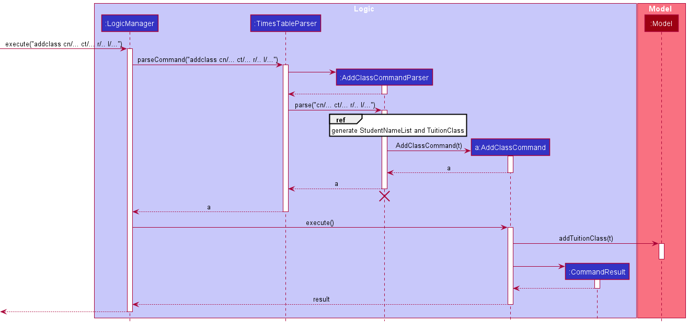
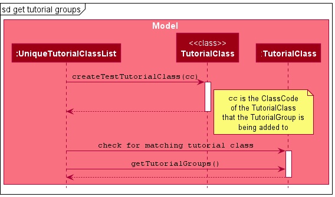

* Table of Contents
{:toc}

--------------------------------------------------------------------------------------------------------------------

## **Acknowledgements**

* This project is based on the AddressBook-Level3 project created by the [SE-EDU initiative](https://se-education.org).

--------------------------------------------------------------------------------------------------------------------

## **Setting up, getting started**

Refer to the guide [_Setting up and getting started_](SettingUp.md).

--------------------------------------------------------------------------------------------------------------------

## **Design**

:bulb: **Tip:** The `.puml` files used to create diagrams in this document can be found in the [diagrams](https://github.com/AY2122S1-CS2103T-W15-1/tp/tree/master/docs/diagrams/) folder. Refer to the [_PlantUML Tutorial_ at se-edu/guides](https://se-education.org/guides/tutorials/plantUml.html) to learn how to create and edit diagrams.

### Architecture

The ***Architecture Diagram*** given above explains the high-level design of the App.

Given below is a quick overview of main components and how they interact with each other.

**Main components of the architecture**

**`Main`** has two classes called [`Main`](https://github.com/AY2122S1-CS2103T-W15-1/tp/tree/master/src/main/java/seedu/address/Main.java) and [`MainApp`](https://github.com/AY2122S1-CS2103T-W15-1/tp/tree/master/src/main/java/seedu/address/MainApp.java). It is responsible for,
* At app launch: Initializes the components in the correct sequence, and connects them up with each other.
* At shut down: Shuts down the components and invokes cleanup methods where necessary.

[**`Commons`**](#common-classes) represents a collection of classes used by multiple other components.

The rest of the App consists of four components.

* [**`UI`**](#ui-component): The UI of the App.
* [**`Logic`**](#logic-component): The command executor.
* [**`Model`**](#model-component): Holds the data of the App in memory.
* [**`Storage`**](#storage-component): Reads data from, and writes data to, the hard disk.

**How the architecture components interact with each other**

The *Sequence Diagram* below shows how the components interact with each other for the scenario where the user issues the command `delete 1`.

Each of the four main components (also shown in the diagram above),

* defines its *API* in an `interface` with the same name as the Component.
* implements its functionality using a concrete `{Component Name}Manager` class (which follows the corresponding API `interface` mentioned in the previous point.

For example, the `Logic` component defines its API in the `Logic.java` interface and implements its functionality using the `LogicManager.java` class which follows the `Logic` interface. Other components interact with a given component through its interface rather than the concrete class (reason: to prevent outside component's being coupled to the implementation of a component), as illustrated in the (partial) class diagram below.

The sections below give more details of each component.

### UI component

The **API** of this component is specified in [`Ui.java`](https://github.com/AY2122S1-CS2103T-W15-1/tp/tree/master/src/main/java/seedu/address/ui/Ui.java)

The UI consists of a `MainWindow` that is made up of parts e.g.`CommandBox`, `ResultDisplay`, `StudentListPanel`, `ClassListPanel`, `StatusBarFooter` etc. All these, including the `MainWindow`, inherit from the abstract `UiPart` class which captures the commonalities between classes that represent parts of the visible GUI.

The `UI` component uses the JavaFx UI framework. The layout of these UI parts are defined in matching `.fxml` files that are in the `src/main/resources/view` folder. For example, the layout of the [`MainWindow`](https://github.com/AY2122S1-CS2103T-W15-1/tp/tree/master/src/main/java/seedu/address/ui/MainWindow.java) is specified in [`MainWindow.fxml`](https://github.com/AY2122S1-CS2103T-W15-1/tp/tree/master/src/main/resources/view/MainWindow.fxml)

The `UI` component,

* executes user commands using the `Logic` component.
* listens for changes to `Model` data so that the UI can be updated with the modified data.
* keeps a reference to the `Logic` component, because the `UI` relies on the `Logic` to execute commands.
* depends on some classes in the `Model` component, as it displays `Student` and `TutorialClass` objects residing in the `Model`.

### Logic component

**API** : [`Logic.java`](https://github.com/AY2122S1-CS2103T-W15-1/tp/tree/master/src/main/java/seedu/address/logic/Logic.java)

Here's a (partial) class diagram of the `Logic` component:

How the `Logic` component works:
1. When `Logic` is called upon to execute a command, it uses the `ClassmateParser` class to parse the user command.
1. This results in a `Command` object (more precisely, an object of one of its subclasses e.g., `AddCommand`) which is executed by the `LogicManager`.
1. The command can communicate with the `Model` when it is executed (e.g. to add a student).
1. The result of the command execution is encapsulated as a `CommandResult` object which is returned from `Logic`.

The Sequence Diagram below illustrates the interactions within the `Logic` component for the `execute("delete 1")` API call.

:information_source: **Note:** The lifeline for `DeleteStudentCommandParser` should end at the destroy marker (X) but due to a limitation of PlantUML, the lifeline reaches the end of diagram.

Here are the other classes in `Logic` (omitted from the class diagram above) that are used for parsing a user command:

How the parsing works:
* When called upon to parse a user command, the `ClassmateParser` class creates an `XYZCommandParser` (`XYZ` is a placeholder for the specific command name e.g., `AddStudentCommandParser`) which uses the other classes shown above to parse the user command and create a `XYZCommand` object (e.g., `AddStudentCommand`) which the `ClassmateParser` returns back as a `Command` object.
* All `XYZCommandParser` classes (e.g., `AddStudentCommandParser`, `DeleteStudentCommandParser`, ...) inherit from the `Parser` interface so that they can be treated similarly where possible e.g, during testing.

### Model component
**API** : [`Model.java`](https://github.com/AY2122S1-CS2103T-W15-1/tp/tree/master/src/main/java/seedu/address/model/Model.java)

The `Model` component,

* stores the ClassMATE data i.e., all `Student` objects (which are contained in a `UniqueStudentList` object), and all `TutorialClass` objects (which are contained in a `UniqueTutorialClassList` object).
* stores the currently 'selected' `Student` and `TutorialClass` objects (e.g., results of a search query) as a separate _filtered_ lists which are exposed to outsiders as an unmodifiable `ObservableList<Student>` and `ObservableList<TutorialClass>` that can be 'observed' e.g. the UI can be bound to this list so that the UI automatically updates when the data in the list change.
* stores a `UserPref` object that represents the user’s preferences. This is exposed to the outside as a `ReadOnlyUserPref` objects.
* does not depend on any of the other three components (as the `Model` represents data entities of the domain, they should make sense on their own without depending on other components)

:information_source: **Note:** An alternative (arguably, a more OOP) model is given below. It has a `Tag` list in the `ClassMATE`, which `Student` references. This allows `ClassMATE` to only require one `Tag` object per unique tag, instead of each `Student` needing their own `Tag` objects. 

### Storage component

**API** : [`Storage.java`](https://github.com/AY2122S1-CS2103T-W15-1/tp/tree/master/src/main/java/seedu/address/storage/Storage.java)

The `Storage` component,
* can save both ClassMATE data and user preference data in json format, and read them back into corresponding objects.
* inherits from both `ClassmateStorage` and `UserPrefStorage`, which means it can be treated as either one (if only the functionality of only one is needed).
* depends on some classes in the `Model` component (because the `Storage` component's job is to save/retrieve objects that belong to the `Model`)

### Common classes

Classes used by multiple components are in the `seedu.address.commons` package.

--------------------------------------------------------------------------------------------------------------------

## **Implementation**

This section describes some noteworthy details on how certain features are implemented.

### Tutorial Class Management Features
(Contributed by Rushil Ramesh and Vishnu Sundaresan)

ClassMATE allows the user to manage information relevant to the TutorialClass. A User is able to:

1. Add a new tutorial class
2. Delete an existing tutorial class
3. List all existing tutorial class
4. Find all tutorial classes containing a keyword in their classcodes (Coming Soon)
5. View Class Details (Coming Soon)

#### Current Implementation

The class `Classmate` facilitates all operations related to tutorial classes. It maintains a `UniqueTutorialClassList`
of containing all tutorial classes, as well as a `FliteredList` of `TutorialClass` instances reflecting the current
state of the tutorial class list to be displayed to the user. The `Classmate` contains a summary of all the logic of the
tutorial class commands (e.g. `AddClassCommand`)  executed on the `UniqueTutorialCLassList`.

The following operations are implemented:
* `Classmate#hasTutorialClass(TutorialClass tutorialClass)` - Checks if tutorial class is in ClassMATE
* `Classmate#addTutorialClass(TutorialClass tutorialClass)` - Adds tutorial Class to ClassMATE
* `Classmate#removeTutorialClass(TutorialClass tutorialClass)` - Deletes existing tutorial class from ClassMATE
* `Classmate#getTutorialClassList()` - Displays entire list of tutorial classes.
* `Model#updateFilteredTutorialClassList(Predicate<TutorialClass> predicate)` - Searches for tutorial class by keyword and displays filtered list.

These operations are exposed in the `Model` interface as `Model#hasTutorialClass(TutorialClass tutorialClass)`,
`Model#addTutorialClass(TutorialClass tutorialClass)`, `Model#deleteTutorialClass(TutorialClass tutorialClass)` and
`Model#getTutorialClass()`respectively.

Given below is an example of how the tutorial class features can be used:

Step 1. The user launches the application for the first time. The `UniqueTutorialClassList` would be derived from the
initial ClassMATE state, and all tutorial classes stored will be displayed.

Step 2. The user executes an `addc c/G01 s/Tues 12 - 2pm` command. The `addc` command calls `Model#addTutorialClass()`, adding a new tutorial class to Classmate. This modifies and saves the
state of ClassMATE. The updated `UniqueTutorialClassList` will be displayed in the `ClassListPanel`
to the user.

Step 3. The user executes a `findc G01` command. The `findc` command calls the `Model#updateFilteredTutorialClassList()`, modifying the state of the filtered list
of tutorial classes. The updated filtered list consisting of te results of the search query will be displayed to the user.

Step 4. The user executes a  `viewc 1` command. The `viewc` command updates the `FilteredList` of `TutorialCLass`es to only display the class at the
given index, and updates the `FilteredList` of `Students` to contain only the students who are in the selected class. The updated filtered list of
students and tutorial classes will be displayed to the user.

Step 5. The user executes a `deletec 2` command. The `deletec` command calls `Model#deleteTutorialCLass()`, modifying and saving the
state of ClassMATE by deleting the class stored at the given index in the `UniqueTutorialClassList`. This updated list will be displayed to the user.

Step 6. The user executes a `listc` command. The `listc` command calls `Model#getTutorialClassList()` modifying and saving the state of the `FilteredList`
to contain all tutorial classes in ClassMATE. This updated list will be displayed to the user.

Using the example of the `AddClassCommand`,
when the user enters the `addc` command to add a tutorial class, the user input command undergoes the same command parsing as described in [Section 3.3, “Logic component”](#33-logic-component).
During the parsing, a new TutorialClass instance is created. This `TutorialClass` instance will be received by the `AddClassCommand` when it is created.

The *Sequence Diagram* below summarises the aforementioned steps.

 
Execution of the `AddClassCommand`

#### Design Considerations

#### Aspect: Finding Tutorial Classes

* Alternative 1 (current choice): Find Tutorial Classes by selecting all classes with classcodes matching the search keyword
    * Pros: Shorter keyword to type, therefore increasing user typing speed. User is also able to find multiple classes
    * Cons: Lower Accuracy in searching for a specific class, having to search through multiple classes

* Alternative 2: Find tutorial class by exact class code
    * Pros: Higher Accuracy in search
    * Cons: Takes longer for user to type commands, less user-friendly

#### Aspect: Student and Tutorial Class lists
* Alternative 1 (current choice): Use two separate lists to store students and tutorial classes
    * Pros: Faster, simpler command executions for student and tutorial class commands.
    Easier to maintain overall. Therefore, all students and all tutorial classes can be accessed independent of each other.
    * Cons: Class specific student commands are slower. For example a user is required to `viewc` in order to filter just the students in the class,
    increasing the overall time
* Alternative 2: Nesting of students within Tutorial Class
    * Pros: Faster in class specific student commands and students are better organised.
    * Complexity of tutorial classes is increased and slower to navigate to view other tutorial classes or perform general commands on the students

### Student Participation Mark Features

(Contributed by Vishnu Sundaresan)

ClassMATE allows the user to manage information about Class Participation grading relevant to each Student. A User is able to:

1. Add a weekly participation mark
2. Delete a weekly participation mark
3. Delete all weekly participation marks

#### Proposed Implementation

Each Student will contain a `List` known as `marks` that will store all participation mark values for the Student. This list is internally stored as an `ArrayList`. Using an `Enumeration` of Student Marks, which contains the following Marks:

* `POOR` (0 marks)
* `LOW` (1 mark)
* `AVG` (2 marks)
* `GOOD` (3 marks)
* `HIGH` (4 marks)
* `EXCELLENT` (5 marks)

ClassMATE will then support the following command classes:

* `AddLastMarkCommand(Index index, StudentMark mark)`
* `DeleteLastMarkCommand(Index index)`
* `DeleteAllMarksCommand(Index index)`

These commands inherit from the `Command` class, and are named accordingly.

Given below is an example of how the student marks features can be used:

Step 1. The user launches the application for the first time. The existing `marks` list would be derived from the
initial ClassMATE state, and all students stored will be displayed along with their currently stored marks below their name

Step 2. The user executes an `addm 1 m/low` command. After the Command has been parsed, the `addm` command calls `AddLastMarkCommand#addStudentMark()`  and subsequently `Model#setStudent()` and `Model#updateFilteredStudentList()`, adding the mark provided (`LOW` in this case) to Classmate. This modifies and saves the state of ClassMATE. The updated `UniqueStudentList` will be displayed in the `ClassListPanel` to the user.

Step 3. The user executes a `deletelm 1` command. The `deletelm` command calls the `DeleteLastMarkCommand#deleteLastStudentMark()` and subsequently the`Model#setStudent()` and the `Model#updateFilteredStudentList()`, modifying the state of the filtered list of students. The updated filtered list consists the students with the latest mark removed from the 1st student.

​																						**Before `deletelm` command**

​																						**After `deletelm` command**

Step 4. The user executes a `deleteam 1` command. The `deleteam` command calls `DeleteAllMarkCommand#deleteAllStudentMark()`, then subsequently `Model#setStudent()`and `Model#updateFilteredStudentList()`, modifying and saving the state of ClassMATE by deleting all marks for the 1st student at the given index in the `UniqueStudentList`. This updated list will be displayed to the user.

Using the example of the `AddMarkCommand`,
when the user enters the `addm` command to add a tutorial class, the user input command undergoes the same command parsing as described in [Section 3.3, “Logic component”](#33-logic-component).
During the parsing, a new `Student` instance is created. This `Student` instance will be received by the `AddMarkCommand` when it is created.

The *Sequence Diagram* below summarizes the aforementioned steps.

Execution of the `AddMarkCommand`

#### Design Considerations

#### Aspect: Rationale for studentMarks size

* Alternative 1 (current choice): Keep a list of variable length
  * Pros: Flexible, allows instructors not to worry about the number of tutorials taken.
  * Cons: Prone to human error of counting, not tallying within strict 26 tutorial-limit.
* Alternative 2: Keep a fixed-size list of 26
  * Pros: Since there are 13 weeks and two tutorials a week, there will be a projected 26 tutorials held. Thus, a fixed size of 26 elements will allow the list to reflect this requirement.
  * Cons: Instructors are limited to this 26-class limit, and cannot store marks for extra tutorials/make-up sessions.

#### Aspect: Display of Marks

* Alternative 1: Display as a list under student credentials in each student card
  * Pros: Simple to implement, easily viewed
  * Cons: Unable to fit all marks, lack of earlier mark visibility
* Alternative 2 (current choice): Display in 'viewstu' command as separate feature
  * Pros: Can view all marks at once, clear to understand
  * Cons: Marks can only be viewed for one student at a time

### ClassCode Implementation Feature
(Contributed by Zhou Yirui)

ClassMATE allows user to assign student to a tutorial class using a ClassCode. A user is able to:

1. Add ClassCode to a student
2. Edit ClassCode of a student

#### Current Implementation
The class `ClassCode` facilitates all operations related to classCode. `ClassCode` is implemented such that a
Tutorial Class with the corresponding ClassCode must exist before the ClassCode can be added. Tutorial Class `G00` is a
default class that do not need to be created.

Given below is an example of how classCode can be used.

Step 1: After launching the application for the first time, user executes `addstu n/Abigail p/91199119 e/ab@gmail.com a/Downling Park #15-20 c/G08`.
The `addstu` command calls `Model#hasTutorialClass()`, and the model component checks if the TutorialClass specified by the
class code exists. If it exists, the student is added successfully, else, an error message is given.

#### Proposed Implementation
Step 2: The user deletes TutorialClass G08 using the `deletec` command. The `deletec` command changes the ClassCode of all students
of TutorialClass `G08` to `G00`.

### Tutorial Group Management Features
This feature is split into two parts.
* Adding/removing tutorial group to tutorial class (Contributed by Ngu Yi Yang)
* Adding/removing student to tutorial group. (Contributed by Zhou Yirui)

ClassMATE allows the user to manage information relevant to the TutorialGroup. A User is able to:

1. Add a new tutorial group to an existing tutorial class
2. Remove an existing tutorial group from an existing tutorial class
3. Add a student to an existing tutorial group
4. Remove a student from tutorial group

#### Current Implementation (Adding/removing tutorial group to tutorial class)

The class `Classmate` facilitates all operations related to tutorial groups. It maintains a
`UniqueTutorialClassList` containing all tutorial classes, where each class maintains a `UniqueTutorialGroupList` containing its tutorial groups.
Tutorial groups are identical only if all its attributes, `GroupName`, `ClassCode` and `GroupType` are the same.
`Classmate` contains a summary of all the logic of the interaction between tutorial group and tutorial class such as
adding tutorial groups to tutorial classes (e.g. `AddGroupCommand`)  executed on the `UniqueTutorialGroupList`.

The following operations are implemented:
* `Classmate#hasTutorialGroup(TutorialGroup tutorialGroup)` - Checks if tutorial group is in ClassMATE
* `Classmate#addTutorialGroup(TutorialGroup tutorialGroup)` - Adds tutorial group to ClassMATE
* `Classmate#removeTutorialGroup(TutorialGroup tutorialGroup)` - Deletes existing tutorial group from ClassMATE
* `UniqueTutorialClassList#contains(TutorialGroup toCheck)`  - Checks if tutorial group is in any of the tutorial classes
* `UniqueTutorialClassList#add(TutorialGroup toAdd)`  - Adds tutorial group to its respective class
* `TutorialClass#getTutorialGroups()`  - Retrieves the list of tutorial groups within the TutorialClass
* `TutorialClass#createTestTutorialClass(ClassCode classCode)`  - Creates a dummy tutorial class from the class code of the tutorial group for checking

Given below is an example of how the tutorial group features can be used:

Step 1. The user executes an `addcg gn/1 c/G06 type/OP1` command. The `addcg` command calls `Model#hasTutorialClass()`,
and the model component checks if the TutorialClass specified by the class code exists and throws an exception if it does not.
It then checks whether the tutorial group already exists using `Model#hasTutorialGroup()`and calls `Model#addTutorialGroup()` if it does not.

The checking of whether the tutorial class and tutorial group already exists is done as such:
`Classmate` calls the `contains` method of its `UniqueTutorialClassList`. This method is overloaded to accept
either a `TutorialClass` or `TutorialGroup`. The difference between the implementation of these two is that for the former,
it simply checks through its list of tutorial classes. For the latter, it uses `TutorialClass#createTestTutorialClass(ClassCode classCode)`
to retrieve the tutorial class of the tutorial group it is being added to, so that it can then find that tutorial class
within the `UniqueTutorialClassList` and get its `UniqueTutorialGroupList` using the method `TutorialClass#getTutorialGroups()`
and from there check whether the tutorial group already exists or not.

Adding of tutorial groups is similar; It again finds the tutorial class in the `UniqueTutorialClassList` using its class code
After retrieving the respective tutorial class, it can then add the tutorial group using `UniqueTutorialClassList#add(TutorialGroup toAdd)`.

This modifies and saves the state of ClassMATE.

Step 2. The user executes a `deletecg c/G06 gn/1 type/OP1` command. The `deletecg` command works in the same way as the `addcg`
command, except it removes that tutorial group from ClassMATE after checking if it exists.

Using the example of the `AddGroupCommand`,
when the user enters the `addcg` command to add a tutorial group, the user input command undergoes the same command parsing as described in [Section 3.3, “Logic component”](#33-logic-component).
During the parsing, a new TutorialGroup instance is created. This `TutorialGroup` instance will be received by the `AddGroupCommand` when it is created.

The *Sequence Diagram* below summarizes the aforementioned steps.

#### Design Considerations

#### Aspect: Storing Tutorial Groups as lists
* Alternative 1 (current choice): Storing tutorial groups in their respective tutorial classes
    * Pros: Faster when performing find functions such as finding tutorial groups in a particular class. Tutorials groups are also better organised.
    * Cons: Splitting groups based on a category makes it harder to extend to support filtering groups with a different category from what is implemented.

* Alternative 2: Use a single list to store all tutorial groups.
    * Pros: Simpler to implement, easier to add or remove tutorial groups.
      Storing tutorial groups as arrays in JSON is less complicated.
    * Cons: Searching or filtering the list of tutorial groups by group types may take a longer time.

### Recommended workflow for setting up ClassMATE

The *Activity Diagram* below provides an example of how users should set up their tutorial classes, tutorial groups and students
in ClassMATE.

--------------------------------------------------------------------------------------------------------------------

## **Documentation, logging, testing, configuration, dev-ops**

* [Documentation guide](Documentation.md)
* [Testing guide](Testing.md)
* [Logging guide](Logging.md)
* [Configuration guide](Configuration.md)
* [DevOps guide](DevOps.md)

--------------------------------------------------------------------------------------------------------------------

## **Appendix: Requirements**

### Product scope

**Target user profile**:

* CS2101 Tutors with multiple tutorial classes
* prefer desktop apps over other types
* can type fast
* prefers typing to mouse interactions
* is reasonably comfortable using CLI apps

**Value proposition**: Manage and store student details faster than a typical mouse/GUI driven app. Organise students within classes and groups.

### User stories

Priorities: High (must have) - `* * *`, Medium (nice to have) - `* *`, Low (unlikely to have) - `*`

| Priority | As a …​                                    | I want to …​                     | So that I can…​                                                        |
| -------- | ------------------------------------------ | ------------------------------ | ---------------------------------------------------------------------- |
| `* * *`  | new user                                   | see help      | refer to instructions when I forget how to use the App                 |
| `* *`  | new user                                       | view sample data              | see what the app looks like when in use                               |
| `* * *`  | user                                       | add a new student              |                                                                        |
| `* * *`  | user                                       | view a student's details       | easily check the details and progress of the students                  |
| `* * *`  | user                                       | add a new class                |                                                                        |
| `* * `   | user                                       | add a class schedule           | plan my week in advance                                                |
| `* * *`  | user                                       | view a class' details          | easily check the details of a particular class                         |
| `* * *`  | user                                       | delete a student               | remove entries that I no longer need                                   |
| `* * *`  | user                                       | delete a class                 | remove classes that I no longer need
| `* * *`  | user                                       | find a student by name          | locate details of students without having to go through the entire list |
| `* * *`  | user                                       | find a class by code           | locate details of a class without having to go through the entire list |
| `* * *`  | user                                       | view all classes               | see which classes I'm taking                                           |
| `* * *`  | user                                       | view all students in a class   | see the students enrolled in a particular class                                         |
| `* *`    | experienced user                           | add class participation details to a student | track the paricipation of each student                   |
| `* *` | experienced user | add groups within tutorial classes | to organise my class groups |
| `* *` | experienced user | add students to specific sub-groups | to organise students in groups based on examination (e.g. OP1) |
| `* *` | experienced user | delete students from specific sub-groups | remove students from the group as required |
| `*` | user | add different types of marks to students | to mark students for various assessments |

### Use cases

(For all use cases below, the **System** is the `ClassMATE` and the **Actor** is the `user`, unless specified otherwise)

**Use case: Delete a student**

**MSS**

1.  User requests to list students
2.  ClassMATE shows a list of students
3.  User requests to delete a specific student in the list
4.  ClassMATE deletes the student

    Use case ends.

**Extensions**

* 2a. The list is empty.

  Use case ends.

* 3a. The given index is invalid.

    * 3a1. ClassMATE shows an error message.

      Use case resumes at step 2.

**Use case: Edit a student**

**MSS**

1.  User requests to list students
2.  ClassMATE shows a list of students
3.  User requests to edit a specific student in the list with some parameters
4.  ClassMATE edits the student

    Use case ends.

**Extensions**

* 2a. The list is empty.

  Use case ends.

* 3a. The given index is invalid.

    * 3a1. ClassMATE shows an error message.

      Use case resumes at step 2.

* 3b. The given parameter to edit is a Class Code.

    * 3b1. ClassMATE removes all existing tutorial groups of the student.

      Use case resumes at step 4.

**Use case: List students**

**MSS**

1.  User requests to list students
2.  ClassMATE shows a list of students

    Use case ends.

**Extensions**

* 1a. User decides to specify a class to list students

    * 1a1. ClassMATE shows a list of students in the specified  tutorial class

      Use case ends.

* 2a. The list is empty.

  Use case ends.

**Use case: Add a tutorial class**

**MSS**

1.  User requests to add a tutorial class.
2.  ClassMATE adds the tutorial class.

    Use case ends.

**Extensions**

* 1a. The tutorial class already exists.
    *  1a1. ClassMATE shows a message informing the user.

  Use case ends.

**Use case: Find and view a tutorial class**

**MSS**

1.  User requests to find a tutorial class
2.  ClassMATE shows a list of classes with the given keyword
3.  User requests to view a specific class in the list
4.  ClassMATE shows the class details

    Use case ends.

**Extensions**

* 2a. The list is empty.

  Use case ends.

* 3a. The given index is invalid.

    * 3a1. ClassMATE shows an error message.

      Use case resumes at step 2.

**Use case: Add a tutorial group**

**MSS**

1.  User requests to add a tutorial group with the given parameters, Group number, Group type and Class code.
2.  ClassMATE adds the tutorial class.

    Use case ends.

**Extensions**

* 1a. ClassMATE detects an invalid parameter.
    *  1a1. ClassMATE shows a message informing the user.

  Use case ends.

* 1b. The tutorial class that the tutorial group is being added to does not exists.
    *  1b1. ClassMATE shows a message informing the user.

  Use case ends.

* 1c. The tutorial group already exists.
    *  1c1. ClassMATE shows a message informing the user.

  Use case ends.

**Use case: Delete Latest Mark from Student**

**MSS**

1. User lists all students with `liststu`

2. ClassMATE shows a list of students

3. User enters command `deletelm x` where 'x' is the index of student to delete marks of

4. ClassMATE deletes the latest mark stored for that student

   Use case ends.

**Extensions**

* 2a. The list is empty.

  Use case ends.

* 3a. The given index is invalid.

  * 3a1. ClassMATE shows an error message.

  Use case resumes at step 2.

* 3b. There are no marks stored for the student.

  * 3b1. ClassMATE shows an error message.

  Use case ends.

### Non-Functional Requirements

1. Should work on any _mainstream OS_ as long as it has Java `11` or above installed.
2. Should be able to hold at least 1000 students, 400 groups and 99 classes without a noticeable sluggishness in performance for typical usage.
3. A user with above average typing speed for regular English text (i.e. not code, not system admin commands) should be able to accomplish most of the tasks faster using commands than using the mouse.
4. Readable font, at least size 12.
5. Should not cause noticeable lag for other applications when running.
6. Dark Mode.
7. Able to function in the background.
8. Able to respond to user actions within three seconds.
9. A tutorial class should be able to hold up to 20 students.
10. A group should be able to hold up to 5 students.
11. Each action should not take more than 3 commands.

### Glossary

* **Mainstream OS**: Windows, Linux, Unix, (MAC) OS-X
* **Private student detail**: A student detail that is not meant to be shared with others
* **Tutorial class**: A CS2101 tutorial class. Each student can only have up to one tutorial class
* **Student**: An NUS student taking the CS2101(T) module
* **Tutorial group**: A tutorial group is a subsection of the class and contains a few students for the purpose of small activities or group project.
* **Group number**: The number of a group in the CS2101 class, which is specified by a number.
* **Class code**: The name of a typical class in for the CS2101 module. E.g. G06.
* **Group type**: The type of a group in the CS2101 class, which is either OP1 or OP2.

--------------------------------------------------------------------------------------------------------------------

## **Appendix: Instructions for manual testing**

Given below are instructions to test the app manually.

:information_source: **Note:** These instructions only provide a starting point for testers to work on;
testers are expected to do more *exploratory* testing.

### Launch and shutdown

1. Initial launch

   1. Download the jar file and copy into an empty folder

   1. Double-click the jar file Expected: Shows the GUI with a set of sample contacts. The window size may not be optimum.

1. Saving window preferences

   1. Resize the window to an optimum size. Move the window to a different location. Close the window.

   1. Re-launch the app by double-clicking the jar file. 
       Expected: The most recent window size and location is retained.

1. _{ more test cases …​ }_

### Deleting a student

1. Deleting a student while all students are being shown

   1. Prerequisites: List all students using the `liststu` command. Multiple students in the list.

   1. Test case: `deletestu 1` 
      Expected: First student is deleted from the list. Details of the deleted student shown in the status message. Timestamp in the status bar is updated.

   1. Test case: `deletestu 0` 
      Expected: No student is deleted. Error details shown in the status message. Status bar remains the same.

   1. Other incorrect delete commands to try: `delete`, `delete x`, `...` (where x is larger than the list size) 
      Expected: Similar to previous.
1. Deleting a student that at a negative index.
   1. Prerequisites: List all students using the `liststu` command. Multiple students in the list.
   1. Test case: `deletestu -5` 
      Expected: No student is deleted. Error details shown in the status message. Status bar remains the same.
   1. Other incorrect delete commands to try: `delete`, `delete x`, `...` (where x is larger than the list size) 
      Expected: Similar to previous.

### Saving data

1. Dealing with missing/corrupted data files

   1. Prerequisites: None

   2. Test case: JSON file missing. 

      Expected: ClassMATE gives warning about missing storage, and creates a new storage file populated with sample data.

   3. Test case: JSON file corrupted

      Expected: ClassMATE gives warning about corrupted data, and creates a new storage file populated with sample data.
