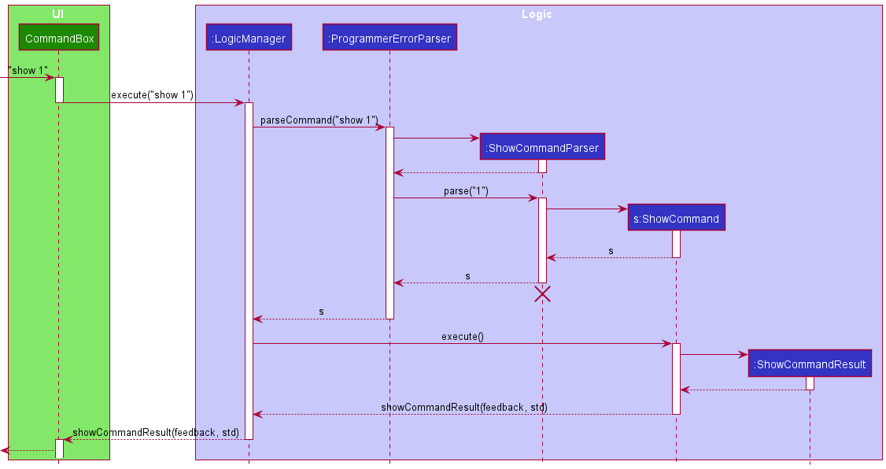
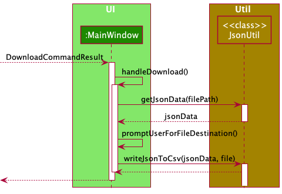

## **Table of Contents**

1. [Acknowledgements](#Acknowledgements)
2. [Setting up, getting started](#Setting-up)
3. [Design](#Design)
4. [Architecture](#Architecture)
5. [UI component](#UI component)
6. [Logic component](#Logic component)
7. [Model](#Model component)
8. [Storage component](#Storage component)
9. [Common classes](#Common classes)
10. [Implementations](#Implementations)
11. [Documentation, logging, testing, configuration, dev-ops](#Documentation)
12. [Appendix: Requirements](#Appendix Requirements)
13. [User Stories](#User Stories)
14. [Use cases](#Use Cases)
15. [Non-Functional Requirements](#Non-Functional Requirements)
16. [Glossary](#Glossary)
17. [Appendix: Instructions for manual testing](#Appendix)
18. [Effort](#Effort)

--------------------------------------------------------------------------------------------------------------------

##  **1. Acknowledgements**

ProgrammerError makes use of the following third-party libraries:

* Libraries used: [JavaFX](https://openjfx.io/), [Jackson](https://github.com/FasterXML/jackson)
  , [JSON In Java](https://mvnrepository.com/artifact/org.json/json), [opencsv](http://opencsv.sourceforge.net/)
  , [JUnit5](https://github.com/junit-team/junit5)

--------------------------------------------------------------------------------------------------------------------

##  **2. Setting up, getting started**

Refer to the guide [_Setting up and getting started_](SettingUp.md).

--------------------------------------------------------------------------------------------------------------------

##  **3. Design**

:bulb: **Tip:** The `.puml` files used to create diagrams in this document can be found in
the [diagrams](https://github.com/AY2122S1-CS2103-F09-3/tp/tree/master/docs/diagrams) folder.

##  **4. Architecture**

The ***Architecture Diagram*** given above explains the high-level design of the App.

Given below is a quick overview of main components and how they interact with each other.

**Main components of the architecture**

**`Main`** has two classes
called [`Main`](https://github.com/AY2122S1-CS2103-F09-3/tp/blob/master/src/main/java/seedu/programmer/Main.java)
and [`MainApp`](https://github.com/AY2122S1-CS2103-F09-3/tp/blob/master/src/main/java/seedu/programmer/MainApp.java). It
is responsible for,

* At app launch: Initializes the components in the correct sequence, and connects them up with each other.
* At shut down: Shuts down the components and invokes cleanup methods where necessary.

[**`Commons`**](#common-classes) represents a collection of classes used by multiple other components.

The rest of the App consists of four components.

* [**`UI`**](#ui-component): ProgrammerError's UI.
* [**`Logic`**](#logic-component): The command executor.
* [**`Model`**](#model-component): Holds the data of ProgrammerError in memory.
* [**`Storage`**](#storage-component): Reads data from, and writes data to, the hard disk.

**How the architecture components interact with each other**

The *Sequence Diagram* below shows how the components interact with each other for the scenario where the user issues
the command `delete 1`.

Each of the four main components (also shown in the diagram above),

* defines its *API* in an `interface` with the same name as the Component.
* implements its functionality using a concrete `{Component Name}Manager` class (which follows the corresponding
  API `interface` mentioned in the previous point.

For example, the `Logic` component defines its API in the `Logic.java` interface and implements its functionality using
the `LogicManager.java` class which follows the `Logic` interface. Other components interact with a given component
through its interface rather than the concrete class (reason: to prevent outside component's being coupled to the
implementation of a component), as illustrated in the (partial) class diagram below.

The sections below give more details of each component.

##  **5. UI component**

The **API** of this component is specified
in [`Ui.java`](https://github.com/AY2122S1-CS2103-F09-3/tp/blob/master/src/main/java/seedu/programmer/ui/Ui.java)

At a high level, the `MainWindow` component interacts with 3 other main components: `Logic`, `PopupManager` and `FileManager` (Figure 4.1).
Note that the components under `MainWindow` have been omitted for simplicity and will be shown in greater detail in the next diagram.

    <em>Figure 5.1: Overview of Ui components</em>

 
1. Firstly, `MainWindow` interacts with the `Logic` component to determine which data to display to the user.
2. Secondly, `MainWindow` conducts file operations on the Ui through a `FileManager`.
   For instance, the `FileManager` handles situations where the user is required to select files or directories.
3. Thirdly, to manage the display of popup windows to the user, `MainWindow` interacts with a `PopupManager` which handles
   the configuration, creation and showing of popups on the Ui.

In addition, there are two additional windows that the UI can display: `HelpWindow` and `DashboardWindow`. They inherit
from the abstract class `PopupWindow`, which captures the commonalities between classes that represent popup information
to be displayed to the user.

Now taking a closer look at the `MainWindow` component, it consists of a number of parts e.g.`CommandBox`, `ResultDisplay`, `StudentListPanel`
, `StatusBarFooter` etc. (Figure 5.2). These components, including the `MainWindow`, inherit from the abstract `UiPart` class which captures
the commonalities between classes that represent parts of the visible GUI. The following is a summary of the parts of the `MainWindow`.

    <em>Figure 5.2: MainWindow Ui components</em>

 
Note that the `UI` component uses the JavaFx UI framework.

- The layout of these UI parts are defined in matching `.fxml` files that are in the `src/main/resources/view` folder.
  For example, the layout of
  the [`MainWindow`](https://github.com/se-edu/addressbook-level3/tree/master/src/main/java/seedu/address/ui/MainWindow.java)
  is specified
  in [`MainWindow.fxml`](https://github.com/se-edu/addressbook-level3/tree/master/src/main/resources/view/MainWindow.fxml)

- The styling of the UI components are defined in the `src/main/resources/view/css` folder.

The `UI` component,

* executes user commands using the `Logic` component.
* listens for changes to `Model` data so that the UI can be updated with the modified data.
* keeps a reference to the `Logic` component, because the `UI` relies on the `Logic` to execute commands.
* depends on some classes in the `Model` component, as it displays `Student` object residing in the `Model`.

##  **6. Logic component**

**API** : [`Logic.java`](https://github.com/se-edu/addressbook-level3/tree/master/src/main/java/seedu/address/logic/Logic.java)

Here's a (partial) class diagram of the `Logic` component:

How the `Logic` component works:

1. When `Logic` is called upon to execute a command, it uses the `ProgrammerErrorParser` class to parse the user
   command.
1. This results in a `Command` object (more precisely, an object of one of its subclasses e.g., `AddCommand`) which is
   executed by the `LogicManager`.
1. The command can communicate with the `Model` when it is executed (e.g. to add a student).
1. The result of the command execution is encapsulated as a `CommandResult` object which is returned back from `Logic`.

The Sequence Diagram below illustrates the interactions within the `Logic` component for the `execute("delete 1")` API
call.

:information_source: **Note:** The lifeline for `DeleteCommandParser` should end at the destroy marker (X) but due to a limitation of PlantUML, the lifeline reaches the end of diagram.

Here are the other classes in `Logic` (omitted from the class diagram above) that are used for parsing a user command:

How the parsing works:

* When called upon to parse a user command, the `ProgrammerErrorParser` class creates an `XYZCommandParser` (`XYZ` is a
  placeholder for the specific command name e.g., `AddCommandParser`) which uses the other classes shown above to parse
  the user command and create a `XYZCommand` object (e.g., `AddCommand`) which the `ProgrammerErrorParser` returns back
  as a `Command` object.
* All `XYZCommandParser` classes (e.g., `AddCommandParser`, `DeleteCommandParser`, ...) inherit from the `Parser`
  interface so that they can be treated similarly where possible e.g, during testing.

##  **7. Model component**

**API** : [`Model.java`](https://github.com/AY2122S1-CS2103-F09-3/tp/blob/master/src/main/java/seedu/programmer/model/Model.java)

The `Model` component,

* stores the ProgrammerError data i.e., all `Student` objects (which are contained in a `UniqueStudentList` object).
* stores the currently 'selected' `Student` objects (e.g., results of a search query) as a separate _filtered_ list
  which is exposed to outsiders as an unmodifiable `ObservableList<Student>` that can be 'observed' e.g. the UI can be
  bound to this list so that the UI automatically updates when the data in the list change.
* stores a `UserPref` object that represents the user’s preferences. This is exposed to the outside as
  a `ReadOnlyUserPref` objects.
* does not depend on any of the other three components (as the `Model` represents data entities of the domain, they
  should make sense on their own without depending on other components)

:information_source: **Note:** An alternative (arguably, a more OOP) model is given below. It has a `Tag` list in `ProgrammerError`, which `Student` references. This allows `ProgrammerError` to only require one `Tag` object per unique tag, instead of each `Student` needing their own `Tag` objects. 

##  **8. Storage component**

**API** : [`Storage.java`](https://github.com/AY2122S1-CS2103-F09-3/tp/blob/master/src/main/java/seedu/programmer/storage/Storage.java)

The `Storage` component,

* can save both ProgrammerError data and user preference data in json format, and read them back into corresponding
  objects.
* inherits from both `ProgrammerErrorStorage` and `UserPrefStorage`, which means it can be treated as either one (if
  only the functionality of only one is needed).
* depends on some classes in the `Model` component (because the `Storage` component's job is to save/retrieve objects
  that belong to the `Model`)

##  **9. Common classes**

Classes used by multiple components are in the `seedu.programmer.commons` package.

--------------------------------------------------------------------------------------------------------------------

##  **10. Implementation**

This section describes some noteworthy details on how certain features are implemented.

### \[Proposed\] Undo/redo feature

#### Proposed Implementation

The proposed undo/redo mechanism is facilitated by `VersionedProgrammerError`. It extends `ProgrammerError` with an
undo/redo history, stored internally as an `programmerErrorStateList` and `currentStatePointer`. Additionally, it
implements the following operations:

* `VersionedProgrammerError#commit()` — Saves the current ProgrammerError state in its history.
* `VersionedProgrammerError#undo()` — Restores the previous ProgrammerError state from its history.
* `VersionedProgrammerError#redo()`
* ores a previously undone ProgrammerError state from its history.

These operations are exposed in the `Model` interface as `Model#commitProgrammerError()`, `Model#undoProgrammerError()`
and `Model#redoProgrammerError()` respectively.

Given below is an example usage scenario and how the undo/redo mechanism behaves at each step.

Step 1. The user launches the application for the first time. The `VersionedProgrammerError` will be initialized with the
initial ProgrammerErrorstate, and the `currentStatePointer` pointing to that single ProgrammerError state.

Step 2. The user executes `delete 5` command to delete the 5th student in the ProgrammerError. The `delete` command
calls `Model#commitProgrammerError()`, causing the modified state of the ProgrammerError after the `delete 5` command executes
to be saved in the `programmerErrorStateList`, and the `currentStatePointer` is shifted to the newly inserted ProgrammerError
state.

Step 3. The user executes `add -n David …​` to add a new student. The `add` command also
calls `Model#commitProgrammerError()`, causing another modified ProgrammerError state to be saved into
the `programmerErrorStateList`.

:information_source: **Note:** If a command fails its execution, it will not call `Model#commitProgrammerError()`, so the ProgrammerError state will not be saved into the `programmerErrorStateList`.

Step 4. The user now decides that adding the student was a mistake, and decides to undo that action by executing
the `undo` command. The `undo` command will call `Model#undoProgrammerError()`, which will shift the `currentStatePointer`
once to the left, pointing it to the previous ProgrammerError state, and restores the ProgrammerError to that state.

:information_source: **Note:** If the `currentStatePointer` is at index 0, pointing to the initial ProgrammerError state, then there are no previous ProgrammerError states to restore. The `undo` command uses `Model#canUndoProgrammerError()` to check if this is the case. If so, it will return an error to the user rather
than attempting to perform the undo.

The following sequence diagram shows how the undo operation works:

:information_source: **Note:** The lifeline for `UndoCommand` should end at the destroy marker (X) but due to a limitation of PlantUML, the lifeline reaches the end of diagram.

The `redo` command does the opposite — it calls `Model#redoProgrammerError()`, which shifts the `currentStatePointer` once
to the right, pointing to the previously undone state, and restores the ProgrammerError to that state.

:information_source: **Note:** If the `currentStatePointer` is at index `pProgrammerErrorStateList.size() - 1`, pointing to the latest ProgrammerError state, then there are no undone ProgrammerError states to restore. The `redo` command uses `Model#canRedoProgrammerError()` to check if this is the case. If so, it will return an error to the CS2100 TA rather than attempting to perform the redo.

Step 5. The CS2100 TA then decides to execute the command `list`. Commands that do not modify the ProgrammerError, such
as `list`, will usually not call `Model#commitProgrammerError()`, `Model#undoProgrammerError()` or `Model#redoProgrammerError()`.
Thus, the `programmerErrorStateList` remains unchanged.

Step 6. The CS2100 TA executes `purge`, which calls `Model#commitProgrammerError()`. Since the `currentStatePointer` is not
pointing at the end of the `programmerErrorStateList`, all ProgrammerError states after the `currentStatePointer` will be
purged. Reason: It no longer makes sense to redo the `add -n David …​` command. This is the behavior that most modern
desktop applications follow.

The following activity diagram summarizes what happens when a CS2100 TA executes a new command:

#### Design considerations:

**Aspect: How undo & redo executes:**

* **Alternative 1 (current choice):** Saves the entire ProgrammerError.
    * Pros: Easy to implement.
    * Cons: May have performance issues in terms of memory usage.

* **Alternative 2:** Individual command knows how to undo/redo by itself.
    * Pros: Will use less memory (e.g. for `delete`, just save the student being deleted).
    * Cons: We must ensure that the implementation of each individual command are correct.

### Add Student 
#### Implementation 

The add student feature allows the CS2100 to add a new student into the student list. Its implementation 
introduces the following classes: 

- `AddCommand` that extends `Command`
- `AddCommandParser` that implements `Parser<AddCommand>`
- Student information: `Student`, `Name`, `StudentId`, `ClassId`, `Email`, `UniqueStudentList` 

The syntax of this command is `add -n <NAME> -sid <STUDENT_ID> -cid <CLASS_ID> -email <EMAIL>`. For instance,
`add -n Erwin -sid A0234596H -cid B02 -email e0543221@u.nus.edu` will create a student with the given name, student id, 
class id and email. 

Given below is a possible usage scenario:

The CS2100 TA keys in the command `add -n Erwin -sid A0234596H -cid B02 -email e0543221@u.nus.edu`. 

The mechanism is as described below: 
- Upon detecting `add` as the command word. `ProgrammerErrorParser` will create a `AddCommandParser` with the input 
name, student id, class id and email. 
- `AddCommandParser` parses the name, student id, class id and email and creates a `Student` object. It will then 
create a `AddCommand` with the new `Student` object. 
- `AddCommand` receives the new `Student` object and checks if any student in `UniqueStudentList` shares the same `studentId` and `email`
with the newly created student. 
- If the new `Student` is unique it will be added to the `UniqueStudentList`. 
- ProgrammerError will show a success message for adding the student. For example, `New student added: Erwin; Student ID: A0234596H; Class ID: B02; Email: e0543221@u.nus.edu`
in the `resultDisplay`, informing the user that the add operation is valid. 

The following (partial) sequence diagram shows how the add command works:
- Note: toAdd in the sequence diagram represents the new `Student` object to be added.
- Refer to [Logic component](#Logic component) for a review of the Logic Component.

 

The following activity diagram summarizes what happens when a CS2100 TA executes a new command:

#### Design considerations: 

#### Aspect: Only unique Student ID and email is accepted: 
- Each student object should have unique Student ID and email. 
  - Pros: 
    - Ensures that each student is unique and easily identifiable with the key attributes.
    - Ensures that there are no duplicates and redundant data. 
  - Cons: 
    - The strict checks on the `UniqueStudentList` will affect `EditCommand` when the user tries to edit an existing student. 
    This will happen when the user only wants to edit one of the attribute. (For example, studentId.)
    This newly edited student will have an old copy of the email. This side effect will cause the newly created `student` to clash with its old instance in `UniqueStudentList`, 
    causing the command to fail, even though it should be valid. As such, it makes it hard to implement, as we have to 
    ensure that it works with `EditCommand` as well.

### Filter Student List

#### Implementation

The filter mechanism is facilitated by the `QueryStudentDescriptor` and the
`StudentDetailContainsQueryPredicate`. The `StudentDetailContainsQueryPredicate` extends `Predicate<Student>` and
contains a private field of type
`QueryStudentDescriptor` that will be used to test if a given student to the predicate matches all the query fields in
the `QueryStudentDescriptor`.

* `StudentDetailContainsQueryPredicate#test(Student)` — Evaluates the predicate on the given `Student` argument.
* `QueryStudentDescriptor#doesStudentMatchDescriptor(Student)` — Evaluates if the `QueryStudentDescriptor` fields
  matches with the corresponding fields of the `Student` argument.

These operations are exposed in the `Model` interface as `Model#updateFilteredStudentList(Predicate<Student>)`.

Given below is an example usage scenario and how the list filtering mechanism behaves.

Step 1. The CS2100 TA launches the application.

Step 2. The CS2100 TA executes `filter -cid B01` to display all the students whose Class ID matches `B01`.

The following UML sequence diagrams shows how the filter command works:

1. In the following sequence diagram, the focus is on modelling the interactions between components to create the `FilterCommand` object.
   

2. In the next sequence diagram, the focus is on the interactions between components when the `FilterCommand` is being executed.

:information_source: **Note:** The lifeline for `StudentDetailContainsPredicate`
, `QueryStudentDescriptor` and `FilterCommand` should end at the destroy marker (X) but due to a limitation of PlantUML,
the lifeline reaches the end of diagram.

The following UML activity diagram summarizes what happens when a CS2100 TA executes a new filter command.

#### Design Consideration

**Aspect: How filter command executes**

* **Alternative 1 (current choice):** Filter commands can take in any combination of query parameters (`-n`, `-cid`, `-sid` and `-email`)
    * Pros: Allow for flexibility in the way the CS2100 TA wants to filter the list.
    * Cons: More difficult to implement and proper handling of the combinations of query parameters is needed.

* **Alternative 2:** A different type of filter command to filter by each of the student's attribute.
    * Pros: Implementation does not need to consider the combination of query parameters.
    * Cons: Multiple commands have to be executed to filter the list in more than one query dimension.

**Aspect: How to handle combination of query parameters**

* **Alternative 1 (current choice):** Design a `QueryStudentDescriptor` class that abstracts the handling of the input
  query parameters.
    * Pros: Need not explicitly handle the different argument combinations at the higher-level abstractions
      (e.g. `FilterCommandParser` class). Code is more maintainable.
    * Cons: Was more difficult to implement which required time to design the interactions among the components.

* **Alternative 2:** Handle the different argument combinations in the `FilterCommandParser` class.
    * Pros: Easier to handle empty argument cases with explicit conditional checking.
    * Cons: Bad use of abstraction, SLAP violated and long nested conditional statements. Code made harder for future
      extension.

**Aspect: Naming the function**

* **Alternative 1 (current choice):** Calling it `filter`.
    * Pros: `filter` is an intuitive command word for the expected functionality.
    * Cons: From the user experience perspective, it is slightly longer than type than other alternative.

* **Alternative 2:** Calling it `view`.
    * Pros: It is shorter to type and less refactoring required from the code that this project evolved from.
    * Cons: `view` is not as intuitive as other alternatives.

* **Alternative 3 (future consideration):** Providing a shortcut command for `filter`.
    * Pros: Allows for users to type less for the same expected behaviour.
    * Cons: New users may be confused with such shortcut commands.

### Show Lab Results Feature

#### Implementation

The show lab results feature allows the CS2100 TA to view the lab result list of a particular student. Its
implementation introduces the following classes:

* `ShowCommand`that extends `Command`
* `ShowCommandParser` that implements `Parser<ShowCommand>`
* `ShowCommandResult` that extends `CommandResult`

The syntax of this command is `show <INDEX_IN_LIST>`. For instance,`show 1` asks ProgrammerError to display the lab
results of student at index 1 of the current list.

Given below is a possible usage scenario:

[Pre-Condition] There are 2 students in ProgrammerError, and the CS2100 TA has created some lab results for each of
them.

Step 1. The CS2100 TA keys in the command `show 1`: The information of the student at index 1 as well as his/her lab
results are displayed on the side panel.

The mechanism is as described below:

* Upon detecting 'show' as the command word. `ProgrammerErrorParser` will create a `ShowCommandParser` with the input
  index.

* `ShowCommandParser` parses the index and creates a `ShowCommand`, which finds the student to be shown according to the
  index and creates a `ShowCommandResult` with the student identified.

* `MainWindow` receives the `ShowCommandResult` and displays the information and lab results of the identified student.

Step 2. The CS2100 TA keys in `show 2`: The side panel is updated with the information and lab results of the student at
index 2

Step 3. The CS2100 TA key in `show 3`: ProgrammerError will show an error message in the `resultDisplay`, warning the
user that the index is invalid. This is triggered by `CommandException`, which is thrown by `ShowCommand`.

The following sequence diagram shows how the show command works:

The following activity diagram summarizes what happens when a CS2100 TA executes a new command:

#### Design considerations:

**Aspect: How Show Lab Results executes:**

* **Alternative 1 (current choice):** Each student object keeps track of its own lab results by an ObservableList.
    * Pros: Easy to implement; Lower chance of having mismatched student and lab records.
    * Cons: Have to pass a `Student` instance across different classes; May have performance issue if more attributes
      are added for `Student`

* **Alternative 2:** An ObservableList of lab results of every student in ProgrammerError itself.
    * Pros: Potential improvement in performance by passing an index, instead of a `Student` instance, across different
      classes.
    * Cons: Hard to implement, as we have to ensure the ObservableList of lab results and students have matching index
      (ie `Student` instance at index 1 of student list has its lab results at index 1 of lab results list), given that
      other operations such as add and delete can change the indexes easily.

### Download Data Feature

The download data feature allows the CS2100 TA to download student data as a CSV file in a directory location of their
choice.

#### Implementation

The implementation details of this feature can be found mainly in `MainWindow` as most of the necessary operations are
related to the UI. In addition, the following classes are utilised:

- `DownloadCommand`: for generating the `DownloadCommandResult`
- `DownloadCommandResult`: for displaying the feedback to the CS2100 TA
- `MainWindow.fxml`: for the addition of a 'Download' button on the MainWindow
- `Popup.css`: for the customisation of styles for pop-up messages

In the `Logic` components, the `download` command works in a similar fashion to the `show` command, except that it does
not require its own parser.

This sequence diagram shows how the `download` command works at a lower level:

The following activity diagram summarizes what happens when a CS2100 TA executes the download command:

#### Design Considerations

One of the main considerations was to deal with reading and writing files only when necessary. This meant checking if
there is any data to begin with. Only if there exists any data will the CS2100 TA be prompted to select a folder
destination.

Additionally, a pop-up message was chosen to be displayed for two reasons. First, it provides the user a clear visual
indicator of the result of their command, as compared to the typical textual output they would see. Second, we would
only know if the data was successfully downloaded after the textual response is shown to the user. Using a pop-up
message right at the end of this operation means we can customise the message depending on whether the download was a
success.

### Alternatives

1. One alternative could be to not use a third-party package (`org.json`), and instead manually parse the json file and
   write the corresponding values to a CSV file which ProgrammerError would create. We chose not to go down this route
   as it is much more tedious with little reward in terms of code management and code quality.

2. Another alternative with respect to the CS2100 TA experience could be to disallow the user from selecting a folder to save
   their data to. Instead, a default location could be chosen so as to save the CS2100 TA some time in getting their data
   downloaded quickly. However, since we wanted to make ProgrammerError more flexible and adaptable to different users, we opted to include the
   functionality of allowing the CS2100 TA to select a folder destination.

### Purge Feature 

This sequence diagram shows how the `purge` command works:

--------------------------------------------------------------------------------------------------------------------

##  **11. Documentation, logging, testing, configuration, dev-ops**

* [Documentation guide](Documentation.md)
* [Testing guide](Testing.md)
* [Logging guide](Logging.md)
* [Configuration guide](Configuration.md)
* [DevOps guide](DevOps.md)

--------------------------------------------------------------------------------------------------------------------

##  **12. Appendix: Requirements**

### Product scope

**Target user profile**:

CS2100 Lab TAs who

* have to manage a number of students across different classes
* keep track of the students' lab results
* keep track of the students' details (eg. Student ID, email)
* prefer and comfortable with CLI tools
* can type fast
* are proficient with Unix commands
* prefer typing to mouse interactions

**Value proposition**:

CS2100 Lab TAs who use ProgrammerError enjoys greater productivity and efficiency when managing their classes of students.

##  **13. User Stories**

Priorities: High (must have) - `* * *`, Medium (nice to have) - `* *`, Low (unlikely to have) - `*`

| Priority | As a …​                                    | I want to …​                                                                               | So that I can…​
| -------- | ------------------------------------------ | ------------------------------------------------------------------------------------------------ | ----------------------------------------------------------------------
| `* * *`  | potential CS2100 TA exploring the app           | see the app populated with sample data| easily see how the app will look like when it is in use.
| `* * *`  | CS2100 TA ready to start using the app          | purge all current data         |  get rid of data in the app.
| `* * *`  | CS2100 TA                                  | be able to create records of individual students: (Name, Student ID, Class ID, email)| so that I can identify and track their progress separately.
| `* * *`  | CS2100 TA                                  | be able to sort the class records| have an organized class record.
| `* * *`  | CS2100 TA                                  | delete the details of a student| clear the information of students who have dropped out of the class.
| `* * *`  | new CS2100 TA                                   | use the in-build help feature  | learn how to use the app quickly.
| `* * *`  | CS2100 TA                                  | be able to view (read) the records of individual students| know more about the student's current performance and email.
| `* * *`  | CS2100 TA                                  | be able to update the details of a student| correct any mistakes that I have made.
| `* * *`  | CS2100 TA                                  | be able to save the data in a CSV file| upload to LumiNUS and share with the CS2100 Instructors.
| `* * *`  | proficient programmer / CS2100 TA                 | navigate ProgrammerError seamlessly with the use of Unix command| efficiently manage my class.
| `* * `  | CS2100 TA with multiple devices             | export the data in my ProgrammerError                                                            | import it on another device.
| `* * `  | busy CS2100 TA                              | view students' statistics formatted in a standard form                                            | avoid sorting the information on my own.
| `* * `  | CS2100 TA                                   | use the app to track students' performance                                                       | identify those who need more help.
| `* * `  | CS2100 TA                                        | know that the software and data will be available 99.999 percent of the time I try to access it  | don't get frustrated and find another software to use.
| `* *`   | CS2100 TA who is an undergradudate myself   | spend little time updating ProgrammerError                                                       | have have sufficient time for my other commitments.
| `* *`   | CS2100 TA with overwhelming work            | be greeted with a nice interface                                                                 | enjoy the process of doing admin tasks.
| `* *`   | CS2100 TA                                   | upload the students' lab results to LumiNUS conveniently                                         |
| `* *`   | impatient CS2100 TA with overwhelming work  | be greeted with a nice interface                                                                 | quickly retrieve a student's particular/email from the database.
| `* *`   | CS2100 TA who loves using the keyboard      | type commands                                                                                    | practice my typing skills.
| `* *`   | CS2100 TA                                   | generate weekly feedbacks via email for my students with ease                                    |
| `* *`   | CS2100 admin                                | have a dashboard to have a bird eye view of my class statistics                                  | be updated quickly on my class progress.
| `* *`   | CS2100 TA                                   | use tags to identify which labs are marked or unmarked                                           | know which what labs to mark next.
| `*`     | CS2100 TA with multiple classes             | filter the contact list by name, classes, email  | easily identify those in the current class.                |
| `*`     | CS2100 TA                                   | archive previous batch statistics           | compare current batch performance with them                                                      |
| `*`     | expert CS2100 TA                                 | archive/hide unused data                                                                         | avoid being distracted by irrelevant data.
| `*`     | a CS2100 TA with many students and classes         | store vital information of my students                                                           | query it when the need arises.
| `*`     | CS2100 Teaching Staff                       | easily search and update student's contact details                                               | I can reach them throughout the module.

##  **14. Use Cases**

For all use cases below, the **System** is the `ProgrammerError` and the **Actor** is the
`CS2100 Teaching Assistant (CS2100 TA in short)`, unless otherwise specified.

**Use case: UC1 Purge/Delete all sample student records**

Precondition: CS2100 TA opens ProgrammerError for the first time

**MSS**

1. CS2100 TA requests to list student records
2. ProgrammerError shows a list of sample student records
3. CS2100 TA requests to purge sample student records
4. ProgrammerError deletes all sample student records

   Use case ends.

**Use case: UC2 Create a student record**

**MSS**

1. CS2100 TA requests to list student records
2. ProgrammerError shows a list of student records
3. CS2100 TA specifies the student's details
4. ProgrammerError creates a student record

   Use case ends.

**Extensions**

* 2a. The list is empty.

  Use case ends.

* 3a. The student details given are incomplete.

    * 3a.1. ProgrammerError shows an error message.

    Use case resumes at step 3.

* 3b. The student email or ID given are not unique.

    * 3a.1. ProgrammerError shows an error message.

    Use case resumes at step 3.

**Use case: UC3 View a student record**

**MSS**

1. CS2100 TA requests to list student records
2. ProgrammerError shows a list of student records
3. CS2100 TA requests to view a specific student record
4. ProgrammerError shows the student record's details

   Use case ends.

**Extensions**

* 2a. The list is empty.

  Use case ends.

* 3a. The given index is invalid.

    * 3a1. ProgrammerError shows an error message.

    Use case resumes at step 2.

**Use case: UC4 Delete a student record**

**MSS**

1. CS2100 TA requests to list student records
2. ProgrammerError shows a list of student records
3. CS2100 TA requests to delete a specific student record in the list
4. ProgrammerError deletes the student record

   Use case ends.

**Extensions**

* 2a. The list is empty.

  Use case ends.

* 3a. The given index is invalid.

    * 3a1. ProgrammerError shows an error message.

    Use case resumes at step 2.

**Use case: UC5 Update a student record**

**MSS**

1. CS2100 TA requests to list student records
2. ProgrammerError shows a list of student records
3. CS2100 TA requests to update a specific student record
4. ProgrammerError updates the student record

   Use case ends.

**Extensions**

* 2a. The list is empty.

  Use case ends.

* 3a. The given index is invalid.

    * 3a.1. ProgrammerError shows an error message.

    Use case resumes at step 2.

* 3b. The given email or student id is not unique

    * 3b.1. ProgrammerError shows an error message.

    Use case resumes at step 2.

**Use case: UC6 Download student records**

**MSS**

1. CS2100 TA <ins>creates (UC2) </ins> /  <ins>views (UC3) </ins> /  <ins>delete (UC4) </ins> /  <ins>update (
   UC5) </ins> a student record
2. ProgrammerError automatically save the changed student records to hard disk
3. CS2100 TA restarts the application
4. ProgrammerError shows the saved data

   Use case ends.

**Use case: UC7 Create a lab record**

**MSS**

1. CS2100 TA requests to create a new lab record
2. ProgrammerError requests for lab details
3. CS2100 TA specifies the lab name and total score
4. ProgrammerError creates a lab record for every student

   Use case ends.

**Extensions**

* 3a. The given lab name is not unique or lab score < 0
  * 3a.1 ProgrammerError shows an error message.
  Use case resumes at 2

  Use case ends.

**Use case: UC8 Edit a lab record**

**MSS**

1. CS2100 TA requests to  <ins>view a particular student's record using a show command (UC3) <ins/>
2. ProgrammerError show the student's record
3. CS2100 TA specifies lab number and actual score or total score
4. ProgrammerError updates the student's record

  Use case ends.

**Extensions**

* 3a. The given lab score < 0 or actual score > total score
    * 3a.1 ProgrammerError shows an error message.
* Use case resumes at 2

  Use case ends.

##  **15. Non-Functional Requirements**

1. Should work on any _mainstream OS_ as long as it has Java `11` or above installed.
2. A TA with above average typing speed for code should be able to accomplish most of the tasks faster using commands
   than using the mouse.
3. The data should be stored locally and should be in a human editable CSV file.
4. The product should be for a single user at a time (i.e. not a multi-user product).
5. No DBMS should be used to store data.
6. The software should follow the Object-oriented paradigm primarily. (with the possibility of allowing a mix of other
   styles when justifiable).
7. The final product should be a result of evolving the given code base. (i.e. allowed to replace all existing code with
   new code, as long as it is done incrementally)
8. The GUI should work well (i.e., should not cause any resolution-related inconveniences to the user) for standard
   screen resolutions 1920x1080 and higher, and screen scales 100% and 125%.
9. the GUI should be usable (i.e., all functions can be used even if the user experience is not optimal) for resolutions
   1280x720 and higher, and screen scales 150%.

##  **16. Glossary**

- **Mainstream OS**: Windows, Linux, Unix, OS-X
- **Student ID**: An NUS student's matriculation number (AXXXXXXXY)
- **Email**: An NUS student email (eXXXXXXX@u.nus.edu)
- **TA**: A CS2100 teaching assistant
- **PE**: ProgrammerError

--------------------------------------------------------------------------------------------------------------------

##  **17. Appendix: Instructions for manual testing**

Given below are instructions to test the app manually.

:information_source: **Note:** These instructions only provide a starting point for testers to work on;
testers are expected to do more *exploratory* testing.

### Launch and shutdown

1. Initial launch

    1. Download the jar file and copy into an empty folder

    1. Double-click the jar file Expected: Shows the GUI with a set of sample contacts. The window size may not be
       optimum.

1. Saving window preferences

    1. Resize the window to an optimum size. Move the window to a different location. Close the window.

    1. Re-launch the app by double-clicking the jar file. 
       Expected: The most recent window size and location is retained.

1. _{ more test cases …​ }_

### Deleting a student

1. Deleting a student while all students are being shown

    1. Prerequisites: List all students using the `list` command. Multiple students in the list.

    1. Test case: `delete 1` 
       Expected: First contact is deleted from the list. Details of the deleted contact shown in the status message.
       Timestamp in the status bar is updated.

    1. Test case: `delete 0` 
       Expected: No student is deleted. Error details shown in the status message. Status bar remains the same.

    1. Other incorrect delete commands to try: `delete`, `delete x`, `...` (where x is larger than the list size) 
       Expected: Similar to previous.

1. _{ more test cases …​ }_

### Download data

1. Select folder from directory chooser window to save data to:

    1. To cancel, click 'cancel' to return to the main window.
    2. In the chosen folder, ProgrammerError will save a CSV file of the students' data named `programmerError.csv`.

### Dashboard

1. Enter dashboard as a command or press F5 to view the dashboard.

    1. CS2100 TA will be able to view the number of students, number of classes, number of labs.
    2. CS2100 TA will also be able to see the number of labs left to mark.
  
  
##  **18. Appendix: Effort**
  
### Challenges Faced and Achievements Made
The following is a non-exhaustive list of challenges we encountered during the development of ProgrammerError:
  1. **Rewriting the Command Syntax** 
  - This was challenging as it required a nuanced understanding of how CLI syntax is constructed and following standard conventions. 
  - Not all of us were familiar with Unix syntax, which made it more difficult to design a solution that would be suitable for users who prefer typing.
  2. **Designing New UI components**
  - AB3 uses a simple components with an (arguably) poor user interface (UI) and user experience (UX). On the other hand, our team revamped the look and feel of the application, customizing the dark theme specially (using GitHub's color scheme) to suit TAs. This involved much experimentation with color schemes and building new components, such as popup windows to enhance the user experience. 
  - Other examples include: color-coding the labs which are marked or unmarked (displayed as green or red respectively), as well as customizing the Help window and Dashboard Window to incorporate our new Dark Theme.
  3. **Working with Third-Party Libraries**
  - Compared to AB3 which does not use minimal third-party libraries for its features, our team integrated two additional external libraries to develop our `upload` and `download` features. 
  - This was more challenging than it initally seemed as it required trying out multiple potential candidate libraries to find those which are most suitable for our use case and would be compatible across multiple operating systems. 
  - Through this process, we also encountered dependency issues with the new libraries and spent significant time and effort debugging these issues.
  4. **Implementing Dynamic Features**
  - AB3's features typically work by having the user type in text commands to be executed. We felt this was core, but we wanted to go a step further and implement our features to minimise the TA having to type unecessary commands.
  - For instance, the list of students always remains sorted whenever updates are made to the student data. This required many checks and careful organization of the student data so that the sorting can be done efficiently at minimal cost to the user TA.
  - Additionally, the dashboard feature was also designed to update dynamically whenever changes are made to the student data. This saves the TA much time in keeping track of the labs they have yet to mark, thereby enhancing their user experience and satisfaction.

