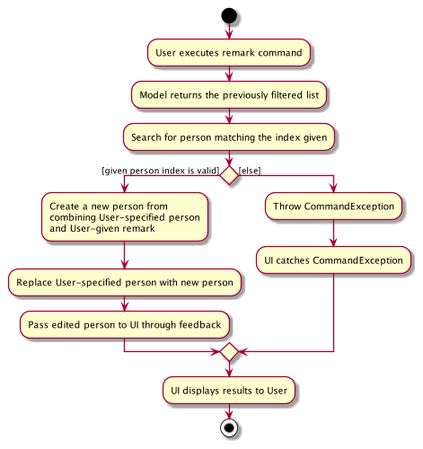
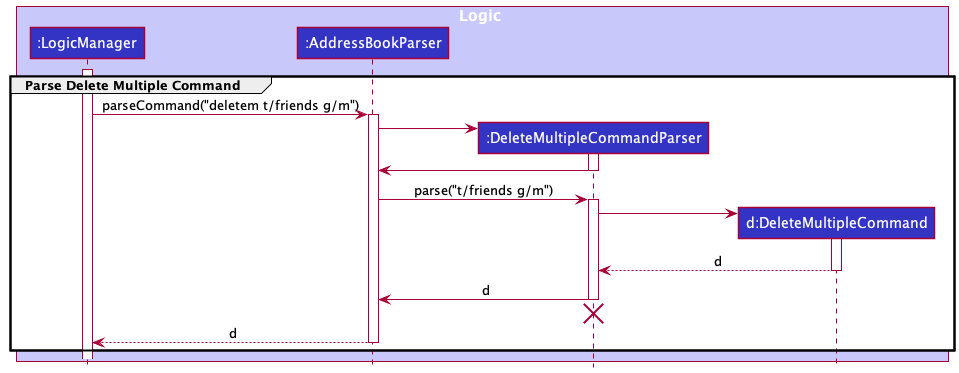
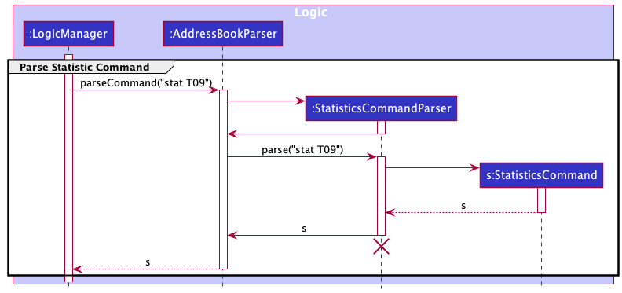
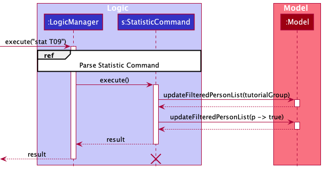
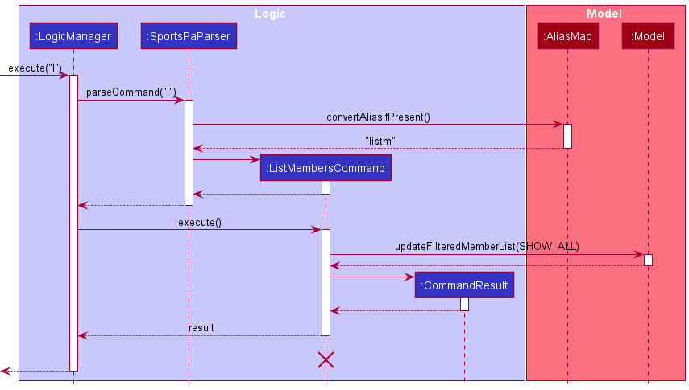

# Welcome to Socius Developer Guide!

Welcome to Socius Developer Guide! Choose a section from the table of contents below to find the details on how Socius works!

--------------------------------------------------------------------------------------------------------------------

## Table of Contents

1. [Introduction to Socius](#introduction-to-socius)
2. [Using this guide](#using-this-guide)
3. [Acknowledgements](#acknowledgements)
4. [Setting up, getting started](#setting-up--getting-started)
5. [Design](#design)
   1. [Architecture](#architecture)
   2. [UI component](#ui-component)
   3. [Logic component](#logic-component)
   4. [Model component](#model-component)
   5. [Storage component](#storage-component)
   6. [Common classes](#common-classes)
   7. [Implementation](#implementation-of-features)
   8. [Documentation, logging, testing, configuration, dev-ops](#documentation-logging-testing-configuration-dev-ops)
   9. [Appendix: Requirements](#appendix-requirements)
   10. [Appendix: Instructions for manual testing](#appendix-instructions-for-manual-testing)

--------------------------------------------------------------------------------------------------------------------

## Introduction to Socius

Socius is a desktop application that helps CS2103T Software Engineering students, to
* manage classmates’ contacts,
* make friends, and
* find teammates!

The Socius Developer Guide gets you learn how Socius works.
This Developer Guide familarises you with the commands and functionality of Socius, enabling you to build on Socius.

We hope that you will have a great time learning about Socius! :)

Socius provides these main features:
* Access details of students taking CS2103T.
* Find any student with their name, tutorial group, nationality, tags, and more.
* Pin suitable tags to categorize students.
* View statistics on nationality.

Socius is optimized for use via a *Command Line Interface (CLI)* while still having the benefits of a *Graphical User Interface (GUI)*. If you can
type fast, Socius can get your contact management tasks done faster than traditional *GUI* apps.

--------------------------------------------------------------------------------------------------------------------

## Using this guide

Before exploring the features of Socius, you should be familiar with these symbols used in this user guide.

| Symbol | Meaning |
| :----: | ------- |
| :information_source: | Important information |
| :exclamation: | Warning or caution |
| :bulb: | Additional information such as tips |
| :wrench: | Help with common technical issues |

--------------------------------------------------------------------------------------------------------------------

## **Acknowledgements**

Socius is adapted from Address Book 3, authored by NUS CS2103T Teaching Team. [Address Book 3 Source Code](https://github.com/nus-cs2103-AY2122S1/tp)

--------------------------------------------------------------------------------------------------------------------

## **Setting up & Getting started**

Refer to the guide [_Setting up & Getting started_](SettingUp.md).

--------------------------------------------------------------------------------------------------------------------

## **Design**

:bulb: **Tip:** The `.puml` files used to create diagrams in this document can be found in
the [diagrams](https://github.com/se-edu/addressbook-level3/tree/master/docs/diagrams/) folder. Refer to the [_PlantUML
Tutorial_ at se-edu/guides](https://se-education.org/guides/tutorials/plantUml.html) to learn how to create and edit
diagrams.

### Architecture

The ***Architecture Diagram*** given above explains the high-level design of Socius.

Given below is a quick overview of main components and how they interact with each other.

**Main components of the architecture**

**`Main`** has two classes
called [`Main`](https://github.com/se-edu/addressbook-level3/tree/master/src/main/java/seedu/address/Main.java)
and [`MainApp`](https://github.com/se-edu/addressbook-level3/tree/master/src/main/java/seedu/address/MainApp.java). It
is responsible for,

* At Socius launch: Initializes the components in the correct sequence, and connects them up with each other.
* At shut down: Shuts down the components and invokes cleanup methods where necessary.

[**`Commons`**](#common-classes) represents a collection of classes used by multiple other components.

The rest of the App consists of four components.

* [**`UI`**](#ui-component): The UI of Socius.
* [**`Logic`**](#logic-component): The command executor.
* [**`Model`**](#model-component): Holds the data of Socius in memory.
* [**`Storage`**](#storage-component): Reads data from, and writes data to, the hard disk.

**How the architecture components interact with each other**

The *Sequence Diagram* below shows how the components interact with each other for the scenario where the user issues
the command `delete 1`.

Each of the four main components (also shown in the diagram above),

* defines its *API* in an `interface` with the same name as the Component.
* implements its functionality using a concrete `{Component Name}Manager` class (which follows the corresponding
  API `interface` mentioned in the previous point.

For example, the `Logic` component defines its API in the `Logic.java` interface and implements its functionality using
the `LogicManager.java` class which follows the `Logic` interface. Other components interact with a given component
through its interface rather than the concrete class (reason: to prevent outside component's being coupled to the
implementation of a component), as illustrated in the (partial) class diagram below.

The sections below give more details of each component.

### UI component

The **API** of this component is specified
in [`Ui.java`](https://github.com/se-edu/addressbook-level3/tree/master/src/main/java/seedu/address/ui/Ui.java)

The UI consists of a `MainWindow` that is made up of parts e.g.`CommandBox`, `ResultDisplay`, `PersonListPanel`
, `StatusBarFooter` etc. All these, including the `MainWindow`, inherit from the abstract `UiPart` class which captures
the commonalities between classes that represent parts of the visible GUI.

The `UI` component uses the JavaFx UI framework. The layout of these UI parts are defined in matching `.fxml` files that
are in the `src/main/resources/view` folder. For example, the layout of
the [`MainWindow`](https://github.com/se-edu/addressbook-level3/tree/master/src/main/java/seedu/address/ui/MainWindow.java)
is specified
in [`MainWindow.fxml`](https://github.com/se-edu/addressbook-level3/tree/master/src/main/resources/view/MainWindow.fxml)

The `UI` component,

* executes user commands using the `Logic` component.
* listens for changes to `Model` data so that the UI can be updated with the modified data.
* keeps a reference to the `Logic` component, because the `UI` relies on the `Logic` to execute commands.
* depends on some classes in the `Model` component, as it displays `Person` object residing in the `Model`.

### Logic component

**API** : [`Logic.java`](https://github.com/AY2122S1-CS2103T-W08-4/tp/blob/master/src/main/java/seedu/address/logic/Logic.java)

How the `Logic` component works:

1. When `Logic` is called upon to execute a command, it uses the `AddressBookParser` class to parse the user command.
1. This results in a `Command` object (more precisely, an object of one of its subclasses e.g., `AddCommand`) which is
   executed by the `LogicManager`.
1. The command can communicate with the `Model` when it is executed (e.g. to add a person).
1. The result of the command execution is encapsulated as a `CommandResult` object which is returned back from `Logic`.

The Sequence Diagram below illustrates the interactions within the `Logic` component for the `execute("edit 1 n/Amy")` API
call.

:information_source: **Note:** The lifeline for `EditCommandParser` should end at the destroy marker (X) but due to a limitation of PlantUML, the lifeline reaches the end of diagram.

### Model component

**API** : [`Model.java`](https://github.com/se-edu/addressbook-level3/tree/master/src/main/java/seedu/address/model/Model.java)

The `Model` component,

* stores the address book data i.e., all `Person` objects (which are contained in a `UniquePersonList` object).
* stores the currently 'selected' `Person` objects (e.g., results of a search query) as a separate _filtered_ list which
  is exposed to outsiders as an unmodifiable `ObservableList<Person>` that can be 'observed' e.g. the UI can be bound to
  this list so that the UI automatically updates when the data in the list change.
* stores a `UserPref` object that represents the user’s preferences. This is exposed to the outside as
  a `ReadOnlyUserPref` objects.
* does not depend on any of the other three components (as the `Model` represents data entities of the domain, they
  should make sense on their own without depending on other components)

:information_source: **Note:** An alternative (arguably, a more OOP) model is given below. It has a `Tag` list in the `AddressBook`, which `Person` references. This allows `AddressBook` to only require one `Tag` object per unique tag, instead of each `Person` needing their own `Tag` objects. 

### Storage component

**API** : [`Storage.java`](https://github.com/se-edu/addressbook-level3/tree/master/src/main/java/seedu/address/storage/Storage.java)

The `Storage` component,

* can save both address book data and user preference data in json format, and read them back into corresponding
  objects.
* inherits from both `AddressBookStorage` and `UserPrefStorage`, which means it can be treated as either one (if only
  the functionality of only one is needed).
* depends on some classes in the `Model` component (because the `Storage` component's job is to save/retrieve objects
  that belong to the `Model`)

### Common classes

Classes used by multiple components are in the `seedu.addressbook.commons` package.

--------------------------------------------------------------------------------------------------------------------

## **Implementation of Features**

This section describes some noteworthy details on how certain features are implemented.

The features mentioned are:
1. [Modifying Contacts]((#adding-a-person-add))
   1. [Adding a person](#adding-a-person-add)
   2. [Adding tags to people](#adding-tags-to-people-addt)
   3. [Adding a remark to a person](#adding-a-remark-to-a-person-remark)
   4. [Editing a person](#editing-a-person-edit)
      1. [Support for multiple social handles](#support-for-multiple-social-handles)
   5. [Deleting a person](#deleting-a-person-delete)
   6. [Deleting multiple person](#delete-multiple-persons-deletem)
   7. [Deleting tags from people](#deleting-tags-from-people-deletet)
   8. [Clearing all contacts](#clearing-all-contacts-clear)
2. Viewing contacts
   1. [Listing all contacts](#listing-all-contacts-list)
   2. [Finding people](#finding-persons)
   3. [Sorting people](#sorting-persons)
   4. [Viewing statistics](#viewing-statistics)
3. Sharing contacts
   1. [Importing contacts](#import-json-file)
   2. [Exporting contacts](#export-json-file)
4. [Aliasing commands `alias`](#aliasing-commands-alias)
5. [Exiting Socius `exit`](#exiting-socius-exit)
6. [Saving contacts](#saving-the-data)
7. [Accessing command history](#command-history)
8. [Input Suggestion](#input-suggestion)

### Adding a person `add`

#### Implementation

The add mechanism is facilitated by AddCommand and AddCommandParser. It allows users to add contacts by name alone,
without the need to include other contact details.

#### Usage

Given below is an example usage scenario of how the AddCommand mechanism behaves at each step.

Step 1. The user first launches Socius and adds a new contact by name, without any other contact details.

Step 2. The user executes the command "add n/[NAME]" to add a new person with no contact details.

Step 3. The `parse` function of AddCommandParser will parse the input and set the optional arguments as empty strings, before
   instantiating a new `Person` object.

Step 4. The command communicates with the `Model` to add the person to the existing AddressBook.

Step 5. The result of the command execution is encapsulated as a `CommandResult` object which is returned back from `Logic`.

The following sequence diagram shows how the AddCommand function works:

The following activity diagram summarizes what happens when a user executes an AddCommand:

#### Design Considerations

**Aspect: How contacts are saved with optional arguments:**

* **Alternative 1 (current choice):** Save a contact, with empty strings as arguments if argument is not included in
  input.
    * Pros: Easy to implement.
    * Cons: May result in unexpected bugs.

* **Alternative 2:** Save all optional attributes of a contact as Optional type.
    * Pros: Will result in fewer unexpected bugs since input is expected to be optional.
    * Cons: Harder to implement.

### Adding tags to people `addt`

#### Implementation

The add tag mechanism is facilitated by AddTagCommand and AddTagCommandParser. It allows users to add tags to a person 
in their contact list by specifying the person's index number and the tags to add.

#### Usage

Given below is an example usage scenario and how the remark mechanism behaves at each step.

Step 1. The user executes `addt 1 t/friend` command to add the 'friend' tag to the first person in the displayed contact list.

Step 1.1. Alternatively, the user may execute `addt all t/friend` command to add the 'friend' tag to everybody in the displayed
contact list.

Step 2. `AddTagCommandParser#parse` will then parse the arguments provided. A new `AddTagCommand` object will be created after parsing.

The following sequence diagram briefly shows how the AddTagCommandParser operation works:

Step 3. The `AddTagCommand` will then create a new `Person` using information from input tag. All other information will be taken from the original `Person`.

Step 4. `AddTagCommand#execute` will then replace the original `Person` in the `model` with the new `Person`.

The following sequence diagram shows how the AddTagCommand mechanism works:

#### Design Considerations

**Aspect: How to support adding tags for one person and for everyone within AddTagCommand:**

* **Alternative 1 (current choice):** When the user enters 'addt all...', the parser will take Index as null.
    * Pros: Easy to implement.
    * Cons: May result in unexpected bugs.

* **Alternative 2:** Create two different classes for each function.
    * Pros: Will result in fewer unexpected bugs since the logic is more straightforward to the developer.
    * Cons: Less user-friendly as multiple commands have very similar functionalities.

### Editing a person `edit`

#### Implementation

The edit mechanism is facilitated by EditCommand and EditCommandParser. It allows users to edit any contact details of a person
in their contact list by the index number shown in their displayed contact list.

The following activity diagram summarizes what happens when a user executes a edit command on a specified person:

The edit mechanism will edit any contact details of the person specified by a given index. If the edited person already exists, the edit command will throw an exception.

During `EditCommand#execute`, a new `Person` object will be created. The values will remain the same for all of a person contact details (e.g. `Name`) except for those which are specified for change.

#### Usage

Given below is an example usage scenario and how the edit mechanism behaves at each step.

Step 1. The user executes `edit 1 n/Alice` command to edit the name of first person in the displayed contact list to 'Alice'.

Step 2. `EditCommandParser#parse` will then parse the arguments provided. A new `EditCommand` object will be created after parsing.

The following sequence diagram briefly shows how the EditCommandParser operation works:

Step 3. The `EditCommand` will then create a new `Person` using information from input arguments. All other information will be taken from the original `Person`.

Step 4. `EditCommand#execute` will then replace the original `Person` in the `model` with the new `Person`.

The following sequence diagram shows how the EditCommand mechanism works:

:information_source: **Note:** If a command fails its execution, it will not be saved in Socius, so the person's contact details in Socius will not be updated.

#### Design Considerations

* **Alternative 1 (current choice):** Create a new `Person` with their contact details replaced and the other contact details same as the original `Person`.
    * Pros: Maintains immutability.
    * Cons: It may have performance issues in terms of memory usage as a new `Person` object is created.

* **Alternative 2:** Edit the original `Person` directly.
    * Pros: It uses less memory and thus may run faster.
    * Cons: If the execution is stopped halfway, then the newly updated person will contain wrong information. It will also be difficult to debug.

### Support for multiple social handles

#### Implementation
A social handle can store a social platform and a user ID tied to that platform.

As a person may have multiple social handles for different social platforms, there is a need to support multiple social handles tied to a person.

The approach to implementing multiple social handles is similar to the original AB3's approach to implementing multiple tags. A Java HashSet is used to store all the social handle objects of a person.

The current implementation allows for each person to have only 1 social handle for each platform. Therefore, when parsing social handles, new user ID will overwrite old user ID of the same social platform. This is done by using a Java Hashtable to store all the original social platforms in a platform name to social handle object pair, then check if the social platform of new social handle is present in the hashtable, and then update accordingly. After all the updates, the values of the hashtable are converted into a set to be store under an attribute of a person.

#### Usage
Social handles can be introduced to a person via the 'add' or 'edit' command.

Given a user wants to change the following entry:

Given below demonstrates how the social handle mechanism would behave at each step.

Step 1: The user enters the command `edit 1 s/tg:alex777 s/ig:a_lex_123 s/tw:alexxx00`

Step 2: `AddressBookParser#parseCommand` will be called to do the first round of parsing to find the type of command being used.

Step 3: After finding the command used is Edit, `EditCommandParser#parse` will be called to further parse the command.

Step 4: `EditCommandParser#parse` will call `ArgumentTokenizer#tokenize` to get an `ArgumentMultimap` object, which contains parsed values of all the prefixes.

Step 5: `ArgumentMultimap#GetAllValues` is then called to get a list of values with social handle prefix `s/`.

Step 6: `ParserUtil#parseSocialHandles` is then used to parse the string value of social handles into a set of `SocialHandle` objects.

Step 7: `EditCommand` object is then created and updated with all the change needed to a person.

Step 8: `LogicManager` will then execute the `EditCommand`

Step 9: This will update the relevant person with the new data

The following sequence diagram shows how the EditCommand function works for social handles:

#### Design Considerations

**Aspect: How to store social handle**
* **Alternative 1:** Store each social handle for each platform as an individual attribute of a person
    * Pros: The logic will be easier to test.
    * Cons: There will be many duplicated code as each social handles are similar.
* **Alternative 2 (Current):** Store a person's social handles as a set.
    * Pros: It will be neater and less time-consuming to implement. Supporting additional platforms will only requires little code change.
    * Cons: It may be more complicated to test.
    
### Deleting a person `delete`

#### Implementation

The delete mechanism is facilitated by DeleteCommand and DeleteCommandParser. It allows users to delete a person
in their contact list by the index number shown in their displayed contact list.

#### Usage

Given below is an example usage scenario of how the DeleteCommand mechanism behaves at each step.

Step 1. The user executes `delete 1` command to delete the first person in the displayed contact list from the displayed contact list.

Step 2. `DeleteCommandParser#parse` will then parse the index provided. A new `DeleteCommand` object will be created after parsing.

Step 4. The command communicates with the `Model` to delete the person from the existing AddressBook.

Step 5. The result of the command execution is encapsulated as a `CommandResult` object which is returned from `Logic`.

The following sequence diagram shows how the DeleteCommand function works:

The following activity diagram summarizes what happens when a user executes an DeleteCommand:

### Adding a remark to people `remark`

#### Implementation

The remark mechanism is facilitated by RemarkCommand and RemarkCommandParser. It allows users to add a remark to a person
in their contact list by the index number shown in their displayed contact list.

The following activity diagram summarizes what happens when a user executes a remark command on a specified person:

The remark mechanism will add a remark to a person specified by a given index. If a remark already exists, the new remark will overwrite the old remark.

During `RemarkCommand#execute`, a new `Person` object will be created. The values will remain the same for all of a person contact details (e.g. `Name`) except for `Remark`.

#### Usage

Given below is an example usage scenario and how the remark mechanism behaves at each step.

Step 1. The user executes `remark 1 r/She likes coding` command to add a remark to the first person in the displayed contact list.

Step 2. `RemarkCommandParser#parse` will then parse the arguments provided. A new `RemarkCommand` object will be created after parsing.

The following sequence diagram briefly shows how the RemarkCommandParser operation works:

Step 3. The `RemarkCommand` will then create a new `Person` using information from input remark. All other information will be taken from the original `Person`.

Step 4. `RemarkCommand#execute` will then replace the original `Person` in the `model` with the new `Person`.

The following sequence diagram shows how the RemarkCommand mechanism works:

:information_source: **Note:** If a command fails its execution, it will not be saved in Socius, so the person's contact details in Socius will not be updated.

#### Design Considerations

* **Alternative 1 (current choice):** Create a new `Person` with their remark replaced and the other contact details same as the original `Person`.
    * Pros: Maintains immutability.
    * Cons: It may have performance issues in terms of memory usage as a new `Person` object is created.

* **Alternative 2:** Edit the original `Person` directly.
    * Pros: It uses less memory and thus may run faster.
    * Cons: If the execution is stopped halfway, then the newly updated person will contain wrong information. It will also be difficult to debug.

### Delete multiple people `deletem`

#### Implementation

The delete multiple people mechanism will delete contacts specified by a given set of keywords. Any contacts containing **all** the specified keywords will be deleted.

It works by filtering for the contacts in the `model` and deleting them one by one.

#### Usage

The following activity diagram briefly summarizes what happens when a user executes the `DeleteMultipleCommand` to delete contacts by keywords:

Given below is an example usage scenario and how the deleting multiple person mechanism behaves at each step.

Step 1. The user launches the application.

Step 2. The user executes `deletem t/friends g/m` command to delete all contacts with the tag `friends` and gender `M`.

Step 3. This will call `DeleteMultipleCommandParser#parse` which will then parse the arguments provided.
Within `DeleteMultipleCommandParser#parse`, `TagContainsKeywordsPredicate` and `GenderContainsKeywordsPredicate` will be created using the tags and gender. These will then be added into the list of predicates.

Step 4. A new `DeleteMultipleCommand` object will be created with its `predicate` set to the one defined in the previous step.
The following sequence diagram briefly shows how the parser operation works (`MultiplePredicates` not shown):

Step 5. `DeleteMultipleCommand#execute` will filter the model with the provided list of predicates and get back the filtered list.

Step 6. It will then iterate through the list and call `deletePerson` to remove contact with matching keywords one by one.

Step 7. After deleting contacts, it will call `updateFilteredPersonList` on model to list all the remaining contacts.

The following sequence diagram shows how the deleting multiple person mechanism works:

#### Design Considerations

* **Alternative 1 (current choice):** Deletes multiple contacts from the list given multiple keywords.
    * Pros: Convenient for user to mass delete contacts with one command instead of removing one by one.
    * Cons: Challenging to implement as it requires parsing and checking multiple dynamic parameters. It also may have performance issues in terms of memory usage.

* **Alternative 2:** Deletes multiple contacts from the list given a single keyword.
    * Pros: Less overlapping and easier to debug. It also uses less memory and thus may run faster.
    * Cons: Reduced flexibility for users when deleting contacts as they can only input one single keyword.

### Delete tags from people `deletet`

#### Implementation

The delete tag mechanism is facilitated by DeleteTagCommand and DeleteTagCommandParser. It allows users to delete tags from a person
in their contact list by specifying the person's index number and the tags to add.

#### Usage

Given below is an example usage scenario and how the delete tag mechanism behaves at each step.

Step 1. The user executes `deletet 1 t/friend` command to delete the 'friend' tag from the first person in the displayed contact list.
If the person does not has the 'friend' tag, the DeleteTagCommand throws an exception.

Step 1.1. Alternatively, the user may execute `deletet all t/friend` command to delete the 'friend' tag from everyone in the displayed
contact list. If no one has the 'friend' tag, the DeleteTagCommand throws an exception.

Step 2. `DeleteTagCommandParser#parse` will then parse the arguments provided. A new `DeleteTagCommand` object will be created after parsing.

The following sequence diagram briefly shows how the DeleteTagCommandParser operation works:

Step 3. The command communicates with the `Model` to delete the person from the existing AddressBook.

Step 4. The result of the command execution is encapsulated as a `CommandResult` object which is returned from `Logic`.

The following sequence diagram shows how the DeleteTagCommand mechanism works:

#### Design Considerations

**Aspect: How to support adding tags for one person and for everyone within AddTagCommand:**

* **Alternative 1 (current choice):** The `deletet all` command should fail only if no one has the specified tag to delete.
    * Pros: Intuitive.
    * Cons: May result in unintentional deletion of tags for the careless user.

* **Alternative 2:** The `deletet all` command should pass only if everyone has the specified tag to delete.
    * Pros: Minimise unintentional deletion of tags.
    * Cons: Less user-friendly, since the user have to make sure all users that are considered must carry that tag to delete.

### Clearing all contacts `clear`

#### Implementation

The clearing all contacts mechanism will delete all contacts from Socius.

#### Usage

The following activity diagram briefly summarizes what happens when a user executes the `ClearCommand` to clear all contacts:

Given below is an example usage scenario and how the clear all contacts mechanism behaves at each step.

Step 1. The user launches the application.

Step 2. The user executes the `clear` command to clear all contacts.

Step 3. `ClearCommand#execute` will replace the model with a blank contact list.

The following sequence diagram shows how the clearing all contacts mechanism works:

### Listing all contacts `list`

#### Implementation

The listing all contacts mechanism will list all contacts in Socius.

#### Usage

The following activity diagram briefly summarizes what happens when a user executes the `ListCommand` to list all contacts:

Given below is an example usage scenario and how the listing all contacts mechanism behaves at each step.

Step 1. The user launches the application.

Step 2. The user executes the `list` command to list all contacts.

Step 3. `ListCommand#execute` will update the model to show everyone in the contact list.

The following sequence diagram shows how the listing all contacts mechanism works:

### Finding people `find`

#### Implementation

The find mechanism is facilitated by FindCommand and FindCommandParser. It allows users to find contacts using any of their contact details.

#### Usage

Given below is an example usage scenario of how the findCommand mechanism behaves at each step.

1. The user first launches Socius. The user can see the details of his/her contacts once Socius starts.

2. The user finds a new contact by one or more contact details, for example, Name and Tag.

3. The user executes the command "find n/[NAME] t/[TAG]" to find people with that Name and has that Tag.

4. The `parse` function of FindCommandParse will parse the input and instantiate a new `Predicate` object for each
   argument present. At the end, all `Predicate` objects are combined using the `MultiplePredicate` object.

5. The command communicates with the `Model` to filter out the found person from the existing AddressBook.

6. The result of the command execution is encapsulated as a `CommandResult` object which is returned back from `Logic`.

The following sequence diagram shows how the FindCommand function works:

The following activity diagram summarizes what happens when a user executes a new command:

#### Design Considerations

**Aspect: How contacts are saved with multiple arguments:**

* **Alternative 1 (current choice):** Only include people who contain all the specified contact details
    * Pros: Intuitive feature. Similar to a Filter function in popular apps today.
    * Cons: Requires you to be familiar of the people in your contact list.

* **Alternative 2:** Include people who contain at least one of the specified contact details.
    * Pros: Good for users who want to broadly search for eligible friends.
    * Cons: Not very intuitive.
    
### Sorting people `sort`

#### Implementation

The following activity diagram summarizes what happens when a user executes a sort persons command with a specified field:

The sort mechanism sorts persons based on the specified field in ascending order.
The command will result in the creation of a Comparator<Person>.

#### Usage

Given below is an example usage scenario and how the Find mechanism behaves at each step.

Step 1. The user launches the application.

Step 2. The user executes `sort n/` command to sort all persons by name in ascending alphabetical order.

Step 3. This will call SortCommandParser#parse which will then parse the arguments provided.

Step 4. A new `NameComparator` and `SortCommand` object will then be created. It will be used to sort all the persons based on their names. This `NameComparator` is then passed to the `SortCommand`.

The following sequence diagram shows how the parser operation works (`NameComparator` not shown):

Step 5. `SortCommand#execute` will set the `AddressBook` model's sorted person list with the provided comparator.

Step 6. The GUI will then proceed to get the full list of persons.

Step 7. After execution, `CommandResult` will contain a message indicating that it has sorted all persons based on the specified field.

The following sequence diagram shows how the sort mechanism works:

#### Design Considerations

* **Alternative 1 (current choice):** Sort all persons based on single field.
    * Pros: Easy to implement.
    * Cons: May not be very convenient if the contact list is very huge and users would like to sort based on multiple fields.

* **Alternative 2:** Sort all persons based on multiple fields.
    * Pros: Convenient if the contact list is very huge and users would like to sort based on multiple fields.
    * Cons: Difficult to implement.
    
### Viewing statistics `stat`

#### Implementation

The Statistics command displays the nationality statistics of a given tutorial group.

#### Usage

Given below is an example usage scenario and how the Statistics mechanism behaves at each step.

Step 1. The user launches the application.

Step 2. The user executes `stat T09` command to compute the nationality statistics of tutorial group `T09`.

Step 3. This will call StatisticsCommandParser#parse which will then parse the arguments provided.

Step 4. A new `TutorialGroup` and `StatisticsCommand` object will then be created. It will be used to compute the statistics of the particular `TutorialGroup`. This `TutorialGroup` is then passed to the `StatisticsCommand`.

The following sequence diagram shows how the parser operation works (`NameComparator` not shown):

Step 5. `StatisticsCommand#execute` will set the `AddressBook` model's filtered person list with the filter criteria being the tutorial group. It will then be extracted into a `List` and then the `AddressBook` model's list will be reset.

Step 6. A `Statistic` object will then be created and its raw data will be passed to the returned `CommandResult`.

Step 7. The GUI will then proceed to parse the raw data and display it as a pie chart to the user.

The following sequence diagram shows how the Statistic mechanism works:

### Importing contacts `import`

#### Implementation

The import JSON file will import an external addressbook and add all the entries to the current addressbook in the user's device.

It works by utilizing the same mechanism that is used by Socius when first initializing the addressbook with existing JSON data.

#### Usage

Given below is an example usage scenario and how the Import mechanism behaves at each step.

Step 1. The user launches the application.

Step 2. The user executes `import t35.json` command to import a file located in `data/t35.json`.

Step 3. This will call `ImportCommandParser#parse` which will then parse the argument provided.

Step 4. A new `ImportCommand` object will be created with its `importedFileName` set to the one parsed in the previous step.

Step 5. `ImportCommand#execute` will create a mock `Storage` that takes in a mock `AddressBookStorage` with the `filePath` set to `data/importedFileName`.

Step 6. It will then call `Model#importAddressBook` which will take in the imported `ReadOnlyAddressBook` returned from `Storage#readAddressBook`.

Step 7. Finally, it will return a `CommandResult` if the operation is successful.

#### Design Considerations

**Aspect: File directory:**

* **Alternative 1 (current choice):** Only allow to-be-imported files to be located in the `data` directory
    * Pros: Every file used in the application will live under a single `data` directory.
    * Cons: Less flexibility for the user.

* **Alternative 2:** Allow to-be-imported files to be located anywhere
    * Pros: Gives user the flexibility to put the file wherever they want.
    * Cons: Different OSes have different file paths convention.

### Exporting contacts `export`

#### Implementation

The export JSON file will export all the current data into a JSON file.

It works by utilizing the same mechanism that is used by Socius when saving the addressbook into a JSON file.

#### Usage

Given below is an example usage scenario and how the Export mechanism behaves at each step.

Step 1. The user launches the application.

Step 2. The user executes `export tmp.json` command to export a file located in `data/tmp.json`.

Step 3. This will call `ExportCommandParser#parse` which will then parse the argument provided.

Step 4. A new `ExportCommand` object will be created with its `outputFilePath` set to `data/FILE_NAME`,
with the `FILE_NAME` being the string parsed in the previous step.

Step 5. `ExportCommand#execute` will first call `FileUtil#createIfMissing` to create the file as specified in `outputFilePath`.

Step 6. It will then call `JsonUtil#saveJsonFile` which will take in the `outputFilePath` and a `JsonSerializableAddressBook` of the current data, which is retrieved by calling `model#getAddressBook()`.

Step 7. Finally, it will return a `CommandResult` if the operation is successful.

#### Design Considerations

**Aspect: File directory:**

* **Alternative 1 (current choice):** Only allow files to be exported to the `data` directory
    * Pros: Every file exported from the application will live under a single `data` directory.
    * Cons: Less flexibility for the user.

* **Alternative 2:** Allow users to export files to any directory
    * Pros: Gives user the flexibility to place the file wherever they want.
    * Cons: Different OSes have different file paths convention.

### Aliasing commands `alias`

#### Implementation

The aliasing mechanism will give an alias to the specified command. If an alias already exists, the new command being aliased will overwrite the old one.

During `AliasCommand#execute`, a new entry of alias-command pair will be put into a singleton class called `CommandAliases`, which is implemented using a `HashMap`.

#### Usage

Given below is an example usage scenario and how the alias mechanism behaves at each step.

Step 1. The user executes `alias a/Singaporeans c/find nat/Singaporean` command to assign the alias `Singaporeans` to the command `find nat/Singaporean`.

Step 2. `AliasCommandParser#parse` will then parse the arguments provided. Then a new `AliasCommand` object will be created after parsing.

The following sequence diagram briefly shows how the alias operation works:

Step 3. `AliasCommand#execute` will then add a new entry of alias-command pair into `CommandAliases` by calling `CommandAliases#put`.

The following sequence diagram shows how the alias command mechanism works:

:information_source: **Note:** If a command fails its execution, it will not be saved in the AddressBook, so the person inside the AddressBook will not be updated.

#### Design Considerations

* **Alternative 1 (current choice):** Singleton pattern
    * Pros: Cannot be instantiated multiple times.
    * Cons: Might be confusing for new developers.

* **Alternative 2:** Non-Singleton
    * Pros: More commonly used in general and thus easier to understand.
    * Cons: A normal class can be instantiated multiple times, which does not suit the context of this implementation.

### Exiting Socius `exit`

#### Implementation

The exiting Socius mechanism will exit Socius.

#### Usage

The following activity diagram briefly summarizes what happens when a user executes the `ExitCommand` to exit Socius:

Given below is an example usage scenario and how the exiting Socius mechanism behaves at each step.

Step 1. The user launches the application.

Step 2. The user executes the `exit` command to exit from Socius.

Step 3. `ExitCommand#execute` returns a CommandResult with the `exit` boolean set to True.

The following sequence diagram shows how the exiting from Socius mechanism works:

### Saving data

#### Implementation

After each command, the latest data is saved in a JSON file. This helps users who
wish to seamlessly continue using Socius after exiting from Socius previously.

#### Design Considerations

**Aspect: How to safely save data from contact list to a JSON file:**

* **Alternative 1 (current choice):** Data is saved after every command.
    * Pros: Easy to implement.
    * Cons: More prone to errors since the save file is accessed very frequently and sometimese unnecessarily.

* **Alternative 2:** Data is saved after every command that modifies the contact list.
    * Pros: Less prone to errors since the save file is accessed only when necessary.
    * Cons: Tricky to implement.
    
### Input Suggestion

#### Implementation

The Input Suggestion mechanism will suggest potential words when the user types in something wrong or invalid.

Currently, this feature only supports suggestions for commands and nationalities.

This feature is implemented using the `Wagner-Fischer` dynamic programming algorithm to compute the `Levenshtein distance`.
The `Levenshtein distance` between two words is the minimum number of single-character edits
(insertions, deletions or substitutions) required to change one word into the other.

#### Usage

Given below is an example usage scenario and how the Input Suggestion mechanism behaves at each step when a user types in a wrong command word.

Step 1. The user launches the application.

Step 2. The user executes `fin n/Ben` command, with the intention of typing `find n/Ben`.

Step 3. This will call `AddressBookParser#parseCommand`. But since there are no command words that match it,
it will end up at the `default` clause of the `switch` statement.

Step 4. A new `WordSuggestion` object will be created with its `word` set to the `commandWord`,
`validWords` set to the `COMMAND_WORDS` list, and the `distanceLimit` set to 2.

Step 5. While being initialized, `WordSuggestion#computeAllLevenshteinDistance` will be called, and it will compute the
`Levenshtein distance` of `word` with every single word in `validWords`.
The result will be stored as a `Map` in `editDistances`,
with the key and value being a word and its corresponding edit distance respectively.
the minimum edit distance is also computed and stored in `minDistance`.

Step 6. Next, `WordSuggestion#getSuggestedWords` is called. It will return as a string, all the words that has
the same edit distance as `minDistance`, if `minDistance` is smaller than `distanceLimit`.

Step 7. Finally, it will throw a `ParseException` which contains the suggested words computed previously and
display the suggestions to the user.

#### Design Considerations

**Aspect: Algorithm and Time Complexity:**

* **Alternative 1 (current choice):** Dynamic programming (Wagner-Fischer algorithm)
    * Pros: More efficient, only takes `O(n * m)` time, with `n` and `m` being the length of each of the two strings.
    * Cons: Harder to implement by the developers.

* **Alternative 2:** Recursive
    * Pros: Very straightforward to implement as it follows directly from its mathematical formula.
    * Cons: Very inefficient as there are three recursive calls at each step, resulting in exponential time complexity.

_{more aspects and alternatives to be added}_

## **Documentation, logging, testing, configuration, dev-ops**

* [Documentation guide](Documentation.md)
* [Testing guide](Testing.md)
* [Logging guide](Logging.md)
* [Configuration guide](Configuration.md)
* [DevOps guide](DevOps.md)

--------------------------------------------------------------------------------------------------------------------

## **Appendix: Requirements**

### Product scope

**Target user profile**:

* has a need to manage a significant number of contacts
* prefer desktop apps over other types
* can type fast
* prefers typing to mouse interactions
* is reasonably comfortable using CLI apps
* is an NUS student enrolled in CS2103T
* wishes to meet new friends and form CS2103T project groups

**Value proposition**: Socius is a simple desktop app for managing CS2103T tutorial classmates’ contacts for
CS2103T module-takers, optimized for use via a Command Line Interface (CLI) while still having the benefits of a
Graphical User Interface (GUI). If you can type fast, Socius can get your contact management tasks done faster than
traditional GUI apps.

Socius helps you to gather information about your CS2103T tutorial classmates and facilitate the forming of project
groups with them.

### User stories

Priorities: 🔴 High: Must have | 🟡 Medium: Good to have | 🟢 Low: Unlikely to have

| Priority          | As a …​           | I want to …​                                     | So that I can…​                                            |
| :---------------- | :---------------- | :----------------------------------------------- | :--------------------------------------------------------- |
|🔴 High|student|scroll through each user’s entry to access information about my classmates|have a basic understanding of my classmates background|
|🔴 High|student|add new contacts|keep track of new students|
|🔴 High|student|delete existing contacts|delete irrelevant or outdated contacts from my address book|
|🔴 High|student|edit existing contacts|update any outdated contacts and customise my address book|
|🔴 High|introvert student|obtain the information of all classmates|know more about them without having to chat with all of them personally|
|🔴 High|first time user|see all the features / commands of the application|better understand how to use it|
|🔴 High|student|get contact information of my classmates|connect with other students and make friends|
|🟡&nbsp;Medium|visual student|see more graphics|understand the program faster|
|🟡 Medium|unorganized student|able to organise my modules/schedule easily|keeps things on schedule so i wont lack behind|
|🟡 Medium|impatient student|have a responsive interface|have a good user experience|
|🟡 Medium|impatient student|customise my commands to keep them short and simple|have a better user experience|
|🟡 Medium|tutor|track students with varying ability|better spread out students with similar ability so that the weakest wont be in the same group|
|🟡 Medium|tutor|track students with varying background|better spread out students with similar background into different groups|
|🟡 Medium|student|find people with different skillsets|learn from others|
|🟡 Medium|student|view all of my contact's social handles on a single platform|view their profile and easily contact them|
|🟡 Medium|student|check teammates availability|make sure my teammates have same vacant timeslots as me|
|🟡 Medium|student|know my classmates' personalities|identify like minded people / people of certain qualities I hope to work with in the group project|
|🟡 Medium|student|differentiate classmates from different countries|form groups with the correct international / local ratio|
|🟡 Medium|student|identify classmates with experience|ensure the spread of people with background in different groups|
|🟡 Medium|student|start finding teammates early|make a sound decision on who I wish to be in the same group with|
|🟡 Medium|student|view my tutorial group's student statistics|have a better understanding of my tutorial group's demographics|
|🟡 Medium|student|find classmates of the opposite gender|form groups with the correct gender ratio|
|🟡 Medium|student|mass tag a group of contacts|shortlist them as potential groupmates|
|🟡 Medium|international student|find other international students, possibly from the same country as me|connect with them and talk with them|
|🟡 Medium|high CAP student|find competent team|to mantain a good cap|
|🟡 Medium|low cap student|find people to carry|learn from them|
|🟢 Low|fast-typer student|pipe my commands|achive greater efficiency|

### Use cases

(For all use cases below, the **System** is the `SociusApplication` and the **Actor** is the `user`, unless specified
otherwise)

**Use case: Add a person**

**MSS**

1. User requests to add a person in the list
2. Socius adds the person

Use case ends.

**Extensions**

* 1a. The format of the request is invalid.

    * 1a1. Socius shows an error message.
    * 1a2. User enters a new request.
    * Steps 1a1-1a2 are repeated until the data entered are correct.

  Use case resumes at step 2.

**Use case: Edit a person**

**MSS**

1. User requests to list persons
2. Socius shows a list of persons
3. User requests to edit the personal details of a specific person in the list
4. Socius edits the personal details of the person

   Use case ends.

**Extensions**

* 2a. The list is empty.

  Use case ends.

* 3a. The given index is invalid.

    * 3a1. Socius shows an error message.
    * 3a2. User enters a new request.
    * Steps 3a1-3a2 are repeated until the data entered are correct.

      Use case resumes at step 4.

**Use case: Delete a person**

**MSS**

1. User requests to list persons
2. Socius shows a list of persons
3. User requests to delete a specific person in the list
4. Socius deletes the person

   Use case ends.

**Extensions**

* 2a. The list is empty.

  Use case ends.

* 3a. The given index is invalid.

    * 3a1. Socius shows an error message.
    * 3a2. User enters a new request.
    * Steps 3a1-3a2 are repeated until the data entered are correct.

      Use case resumes at step 4.

**Use case: Display a person**

**MSS**

1. User requests to list persons
2. Socius shows a list of persons

   Use case ends.

**Extensions**

* 2a. The list is empty.

  Use case ends.

**Use case: Tag a person**

**MSS**

1. User requests to list persons
2. Socius shows a list of persons
3. User requests to tag a specific person in the list
4. Socius tags the person

   Use case ends.

**Extensions**

* 2a. The list is empty.

      Use case ends.

* 3a. The given index is invalid.
    * 3a1. Socius shows an error message.
    * 3a2. User enters a new request.
    * Steps 3a1-3a2 are repeated until the data entered are correct.

      Use case resumes at step 4.

* 3b. The format of the request is invalid.
    * 3b1. Socius shows an error message.
    * 3b2. User enters a new request.
    * Steps 3b1-3b2 are repeated until the data entered are correct.

      Use case resumes at step 4.

**Use case: Remove existing tag of a person**

**MSS**

1. User requests to list persons
2. Socius shows a list of persons
3. User requests to remove existing tag of a specific person in the list
4. Socius removes the existing tag of the person

   Use case ends.

**Extensions**

* 2a. The list is empty. Use case ends.

* 3a. The given index is invalid.
    * 3a1. Socius shows an error message.
    * 3a2. User enters a new request.
    * Steps 3a1-3a2 are repeated until the data entered are correct.

      Use case resumes at step 4.

**Use case: Filter persons by tag**

**MSS**

1. User requests to list persons
2. Socius shows a list of persons
3. User requests to filter the list of persons by tag
4. Socius shows a filtered list of persons by tag Use case ends.

**Extensions**

* 2a. The list is empty. Use case ends.

* 3a. The given tag is invalid.
    * 3a1. Socius shows an empty list.

      Use case ends.

**Use case: Add remarks for a person**

**MSS**

1. User requests to list persons.
2. Socius shows a list of persons.
3. User requests to add remarks for a specific person in the list.
4. Socius adds remarks for the person.

      Use case ends.

**Extensions**

* 2a. The list is empty. Use case ends.

* 3a. The given index is invalid.
    * 3a1. Socius shows an error message.
    * 3a2. User enters a new request.
    * Steps 3a1-3a2 are repeated until the data entered are correct.

      Use case resumes at step 4.

* 3b. The format of the request is invalid.
    * 3b1. Socius shows an error message.
    * 3b2. User enters a new request.
    * Steps 3b1-3b2 are repeated until the data entered are correct.

      Use case resumes at step 4.

**Use case: Mass tag multiple persons**

**MSS**

1. User requests to list persons.
2. Socius shows a list of persons.
3. User requests to tag everyone in the list.
4. Socius adds tag for the list of persons.

      Use case ends.

**Extensions**

* 2a. The list is empty.
      Use case ends.

* 3a. The format of the request is invalid.
    * 3a1. Socius shows an error message.
    * 3a2. User enters a new request.
    * Steps 3a1-3a2 are repeated until the data entered are correct.

      Use case resumes at step 4.

**Use case: View tutorial group statistics**

**MSS**

1. User requests to list persons.
2. Socius shows a list of persons.
3. User requests to view statistics of a particular tutorial group.
4. Socius displays statistics of the tutorial group.

      Use case ends.

**Extensions**

* 2a. The list is empty.
      Use case ends.

* 3a. The tutorial group does not exist.
    * 3b1. Socius shows an error message.
    * 3b2. User enters a new request.
    * Steps 3a1-3a2 are repeated until the data entered are correct.

      Use case resumes at step 4.

* 3b. The format of the request is invalid.
    * 3b1. Socius shows an error message.
    * 3b2. User enters a new request.
    * Steps 3b1-3b2 are repeated until the data entered are correct.

      Use case resumes at step 4.

### Non-Functional Requirements

1. Should work on any _mainstream OS_ as long as it has Java `11` or above installed.
2. Should be able to hold up to 1000 persons without a noticeable sluggishness in performance for typical usage.
3. A user with above average typing speed for regular English text (i.e. not code, not system admin commands) should be
   able to accomplish most of the tasks faster using commands than using the mouse.
4. Should follow Standardised Date format (ISO 8601).
5. Should be able to work on computers with 50? MB of free storage space.
6. Performance requirements: the program should respond within one second.
7. Should show readable messages to users and prevent code from crashing when errors occur.

### Glossary

* **Mainstream OS**: Windows, Linux, Unix, OS-X
* **Private contact detail**: A contact detail that is not meant to be shared with others
* **Standardised Date Format(ISO 8601)**: YYYY-MM-DD. E.g. 2021-09-28

--------------------------------------------------------------------------------------------------------------------

## **Appendix: Instructions for manual testing**

Given below are instructions to test the app manually.

:information_source: **Note:** These instructions only provide a starting point for testers to work on;
testers are expected to do more *exploratory* testing.

### Launch and shutdown

1. Initial launch

    1. Download the jar file and copy into an empty folder

    1. Double-click the jar file Expected: Shows the GUI with a set of sample contacts. The window size may not be
       optimum.

1. Saving window preferences

    1. Resize the window to an optimum size. Move the window to a different location. Close the window.

    1. Re-launch the app by double-clicking the jar file. 
       Expected: The most recent window size and location is retained.

1. Shutdown

    1. Exit the application using the `exit` command.

### Deleting a person

1. Deleting a person while all persons are being shown

    1. Prerequisites: List all persons using the `list` command. Multiple persons in the list.

    1. Test case: `delete 1` 
       Expected: First contact is deleted from the list. Details of the deleted contact shown in the status message.
       Timestamp in the status bar is updated.

    1. Test case: `delete 0` 
       Expected: No person is deleted. Error details shown in the status message. Status bar remains the same.

    1. Other incorrect delete commands to try: `delete`, `delete x`, `...` (where x is larger than the list size) 
       Expected: Similar to previous.

### Adding a person

1. Adding a person

    1. Prerequisites: -

    1. Test case: `add n/Jon Snow p/98765432 g/M t/North` 
       Expected: New person Jon Snow, along with parameters parsed, is added to the list.
       Details of the added contact shown in the status message.

    1. Test case: `add r/King of the North e/snowyjon@gmail.com` 
       Expected: No person is added. Error details shown in the status message.

    1. Other incorrect delete commands to try: `add`  
       Expected: Similar to previous.

### Saving data

1. Dealing with missing data files

    1. Prerequisites: Ensure that you have a `data` folder containing a file titled `addressbook.json` in the same directory as your jar file.

    1. Simulate a missing file by deleting the `addressbook.json` file.

    1. Re-Launch the application again.
       Expected: Shows the GUI with a set of sample contacts and new file titled `addressbook.json` will be created in the `data` folder.

1. Dealing with corrupted data files

    1. Prerequisites: Ensure that you have a `data` folder containing a file titled `addressbook.json` in the same directory as your jar file.

    1. Simulate a corrupted file by editing the `addressbook.json` file.

    1. Re-Launch the application again.
       Expected: Shows the GUI with a set of sample contacts and upon shutdown, the `addressbook.json` file will be updated with the sample contacts.

