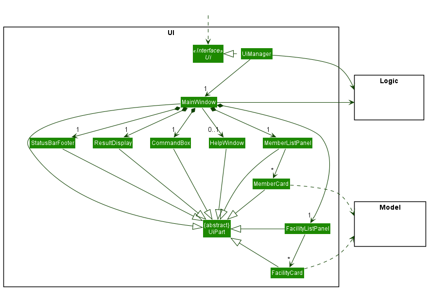
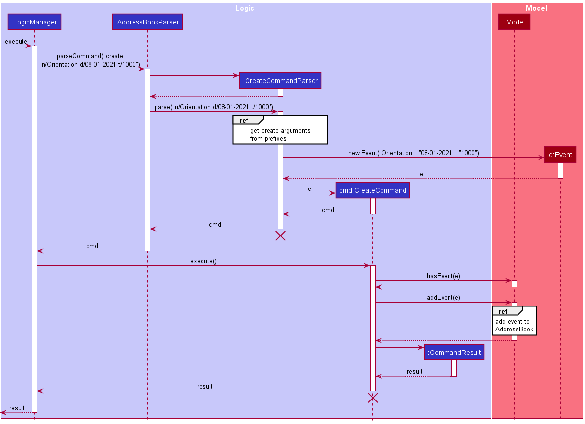
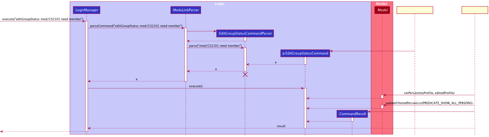

**Table of Contents**
1. [Acknowledgements](#acknowledgements)
2. [Setting up, getting started](#setting-up-getting-started)
3. [Design](#design)
4. [Implementation](#implementation)
5. [Documentation, logging, testing, configuration, dev-ops](#documentation-logging-testing-configuration-dev-ops)
6. [Appendix](#appendix-requirements)
   1. [Requirements](#appendix-requirements)
   2. [Instructions for manual testing](#appendix-instructions-for-manual-testing)

--------------------------------------------------------------------------------------------------------------------

## **Acknowledgements**

* {list here sources of all reused/adapted ideas, code, documentation, and third-party libraries -- include links to the original source as well}

--------------------------------------------------------------------------------------------------------------------

## **Setting up, getting started**

Refer to the guide [_Setting up and getting started_](SettingUp.md).

--------------------------------------------------------------------------------------------------------------------

## **Design**

:bulb: **Tip:** The `.puml` files used to create diagrams in this document can be found in the [diagrams](https://github.com/se-edu/addressbook-level3/tree/master/docs/diagrams/) folder. Refer to the [_PlantUML Tutorial_ at se-edu/guides](https://se-education.org/guides/tutorials/plantUml.html) to learn how to create and edit diagrams.

### Architecture

The ***Architecture Diagram*** given above explains the high-level design of the App.

Given below is a quick overview of main components and how they interact with each other.

**Main components of the architecture**

**`Main`** has two classes called [`Main`](https://github.com/AY2122S1-CS2103T-W12-4/tp/blob/master/src/main/java/seedu/modulink/Main.java) and [`MainApp`](https://github.com/AY2122S1-CS2103T-W12-4/tp/blob/master/src/main/java/seedu/modulink/MainApp.java). It is responsible for,
* At app launch: Initializes the components in the correct sequence, and connects them up with each other.
* At shut down: Shuts down the components and invokes cleanup methods where necessary.

[**`Commons`**](#common-classes) represents a collection of classes used by multiple other components.

The rest of the App consists of four components.

* [**`UI`**](#ui-component): The UI of the App.
* [**`Logic`**](#logic-component): The command executor.
* [**`Model`**](#model-component): Holds the data of the App in memory.
* [**`Storage`**](#storage-component): Reads data from, and writes data to, the hard disk.

**How the architecture components interact with each other**

The *Sequence Diagram* below shows how the components interact with each other for the scenario where the user issues the command `addFav A0123456A`.

Each of the four main components (also shown in the diagram above),

* defines its *API* in an `interface` with the same name as the Component.
* implements its functionality using a concrete `{Component Name}Manager` class (which follows the corresponding API `interface` mentioned in the previous point.

For example, the `Logic` component defines its API in the `Logic.java` interface and implements its functionality using the `LogicManager.java` class which follows the `Logic` interface. Other components interact with a given component through its interface rather than the concrete class (reason: to prevent outside component's being coupled to the implementation of a component), as illustrated in the (partial) class diagram below.

The sections below give more details of each component.

### UI component

The **API** of this component is specified in [`Ui.java`](https://github.com/AY2122S1-CS2103T-W12-4/tp/tree/master/src/main/java/seedu/modulink/ui/Ui.java)

The UI consists of a `MainWindow` that is made up of parts e.g.`CommandBox`, `ResultDisplay`, `PersonListPanel`, `StatusBarFooter` etc. All these, including the `MainWindow`, inherit from the abstract `UiPart` class which captures the commonalities between classes that represent parts of the visible GUI.

The `UI` component uses the JavaFx UI framework. The layout of these UI parts are defined in matching `.fxml` files that are in the `src/main/resources/view` folder. For example, the layout of the [`MainWindow`](https://github.com/se-edu/addressbook-level3/tree/master/src/main/java/seedu/address/ui/MainWindow.java) is specified in [`MainWindow.fxml`](https://github.com/se-edu/addressbook-level3/tree/master/src/main/resources/view/MainWindow.fxml)

The `UI` component,

* executes user commands using the `Logic` component.
* listens for changes to `Model` data so that the UI can be updated with the modified data.
* keeps a reference to the `Logic` component, because the `UI` relies on the `Logic` to execute commands.
* depends on some classes in the `Model` component, as it displays `Person` object residing in the `Model`.

### Logic component

**API** : [`Logic.java`](https://github.com/AY2122S1-CS2103T-W12-4/tp/tree/master/src/main/java/seedu/modulink/logic/Logic.java)

Here's a (partial) class diagram of the `Logic` component:

How the `Logic` component works:
1. When `Logic` is called upon to execute a command, it uses the `ModuLinkParser` class to parse the user command.
1. This results in a `Command` object (more precisely, an object of one of its subclasses e.g., `CreateCommand`) which is executed by the `LogicManager`.
1. The command can communicate with the `Model` when it is executed (e.g. to add a person).
1. The result of the command execution is encapsulated as a `CommandResult` object which is returned back from `Logic`.

The Sequence Diagram below illustrates the interactions within the `Logic` component for the `execute("addFav")` API call.

:information_source: **Note:** The lifeline for `AddFavCommandParser` should end at the destroy marker (X) but due to a limitation of PlantUML, the lifeline reaches the end of diagram.

Here are the other classes in `Logic` (omitted from the class diagram above) that are used for parsing a user command:

How the parsing works:
* When called upon to parse a user command, the `ModuLinkParser` class creates an `XYZCommandParser` (`XYZ` is a placeholder for the specific command name e.g., `CreateCommandParser`) which uses the other classes shown above to parse the user command and create a `XYZCommand` object (e.g., `CreateCommand`) which the `ModuLinkParser` returns back as a `Command` object.
* All `XYZCommandParser` classes (e.g., `CreateCommandParser`, `EditCommandParser`, ...) inherit from the `Parser` interface so that they can be treated similarly where possible e.g, during testing.

### Model component
**API** : [`Model.java`](https://github.com/AY2122S1-CS2103T-W12-4/tp/tree/master/src/main/java/seedu/modulink/model/Model.java)

The `Model` component,

* stores the address book data i.e., all `Person` objects (which are contained in a `UniquePersonList` object).
* stores the currently 'selected' `Person` objects (e.g., results of a search query) as a separate _filtered_ list which is exposed to outsiders as an unmodifiable `ObservableList<Person>` that can be 'observed' e.g. the UI can be bound to this list so that the UI automatically updates when the data in the list change.
* stores a `UserPref` object that represents the user’s preferences. This is exposed to the outside as a `ReadOnlyUserPref` objects.
* does not depend on any of the other three components (as the `Model` represents data entities of the domain, they should make sense on their own without depending on other components)

:information_source: **Note:** An alternative (arguably, a more OOP) model is given below. It has a `Tag` list in the `ModuLink`, which `Person` references. This allows `ModuLink` to only require one `Tag` object per unique tag, instead of each `Person` needing their own `Tag` objects. 

### Storage component

**API** : [`Storage.java`](https://github.com/AY2122S1-CS2103T-W12-4/tp/tree/master/src/main/java/seedu/modulink/storage/Storage.java)

The `Storage` component,
* can save both address book data and user preference data in json format, and read them back into corresponding objects.
* inherits from both `ModuLinkStorage` and `UserPrefStorage`, which means it can be treated as either one (if only the functionality of only one is needed).
* depends on some classes in the `Model` component (because the `Storage` component's job is to save/retrieve objects that belong to the `Model`)

### Common classes

Classes used by multiple components are in the `seedu.modulink.commons` package.

--------------------------------------------------------------------------------------------------------------------

## **Implementation**

This section describes some noteworthy details on how certain features are implemented.

### Create A Profile
#### Implementation
The `create` mechanism will allow the user to create a personal profile.

The implementation required the creation of a parser for `CreateCommand` as the command does takes in parameters (personal information, module information etc..).
`CreateCommand` class updates the `Model` class and then returns a new instance of the `CommandResult` class.
The GUI will then update to include the created profile and the current user's profile will be highlighted in the GUI.
After creating a profile, the user can now use other commands in ModuLink.

#### Usage
To use this function and create a profile, simply enter the command and the required parameters in the command line in the following format.
`create n/NAME id/STUDENT_ID p/PHONE e/EMAIL [mod/TAG]...`  
Example: `create n/John Doe id/A1234567Z p/98765432 e/johnd@example.com mod/CS2100 mod/CS2101`

The following sequence diagram shows how the `create` mechanism works:

### Add A Module Tag
#### Implementation
The `addMod` mechanism will allow the user to add a module tag to their profile.

The implementation required the creation of a parser for `addModCommand` as the command does takes in parameters.
`addModCommand` class updates the `Model` class and then returns a new instance of the `CommandResult` class.
The GUI will then update to include the tags for the user profile.

#### Usage
To use this function and create a profile, simply enter the command and the required parameters in the command line in the following format.
`addMod [mod/MOD]...`  
Example: `addMod mod/CS2103T`

The following sequence diagram shows how the `addMod` mechanism works:

### Add A Profile As Favourite
#### Implementation
The `addFav` mechanism will allow the user to add a module tag to their profile.

The implementation required the creation of a parser for `addFavCommand` as the command does takes in parameters.
`addFavCommand` class updates the `Model` class and then returns a new instance of the `CommandResult` class.
The GUI will then update to show the specified profile as a favourite.

#### Usage
To use this function and create a profile, simply enter the command and the required parameters in the command line in the following format.
`addFav Student_ID`  
Example: `addFav A1234567X`

The following sequence diagram shows how the `addFav` mechanism works:

### List All Favourited Profiles
#### Implementation
The `listFav` mechanism will allow the user to view all the students that he/she has favourited.

The implementation did not require the creation of a parser for `ListFavCommand` as the command does not take in any parameters.
`ListFavCommand` class updates the `Model` class and then returns a new instance of the `CommandResult` class.
The GUI will then change the content to display all favourited profiles. 

#### Usage
To use this function to see all favourited profiles, simply enter `listFav` in the command line. 

The following sequence diagram shows how the `listFav` mechanism works:

### Filter Profiles By Module and Optionally Group Status
#### Implementation
The `filter` mechanism will allow the user to filter profiles by module and optionally group status.

The implementation required the creation of a parser for `filterCommand` as the command does takes in parameters.
`filterCommand` class updates the `Model` class and then returns a new instance of the `CommandResult` class.
The GUI will then update to show the profiles that contain the specified modules and/or group status.

#### Usage
To use this function and create a profile, simply enter the command and the required parameters in the command line in the following format.
`filter mod/MODULE [group/GROUP_STATUS]`  
Example: `filter mod/CS2103T group/SM`

The following sequence diagram shows how the `filter` mechanism works:

### Edit Group Status of Modules
#### Implementation
The `editGroupStatus` mechanism will allow the user to edit the group status of the modules on their profile.

The implementation required the creation of a parser for `editGroupStatusCommand` as the command does takes in parameters.
`editGroupStatusCommand` class updates the `Model` class and then returns a new instance of the `CommandResult` class.
The GUI will then update to show the updated group status for the specified module.

#### Usage
To use this function and create a profile, simply enter the command and the required parameters in the command line in the following format.
`editGroupStatus mod/MODULE group/GROUP_STATUS`  
Example: `editGroupStatus mod/CS2103T group/Need member`

The following sequence diagram shows how the `editGroupStatus` mechanism works:

--------------------------------------------------------------------------------------------------------------------

## **Documentation, logging, testing, configuration, dev-ops**

* [Documentation guide](Documentation.md)
* [Testing guide](Testing.md)
* [Logging guide](Logging.md)
* [Configuration guide](Configuration.md)
* [DevOps guide](DevOps.md)

--------------------------------------------------------------------------------------------------------------------

## **Appendix: Requirements**

### Product scope

**Target user profile**:

* has a need to manage a significant number of contacts
* prefer desktop apps over other types
* can type fast
* prefers typing to mouse interactions
* is reasonably comfortable using CLI apps
* wants to find people to form groups with for his CS modules

**Value proposition**: search for and contact students in the same modules to quickly form groups.

### User stories

Priorities: High (must have) - `* * *`, Medium (nice to have) - `* *`, Low (unlikely to have) - `*`

| Priority | As a …​                                    | I want to …​                     | So that I can…​                                                        |
| -------- | ------------------------------------------ | ------------------------------ | ---------------------------------------------------------------------- |
| `* * *`  | user                                       | add a contact as a favourite   | easily keep track of my favourites' activity                           |
| `* * *`  | user                                       | remove a contact as a favourite| remove users I no longer am interested in                              |
| `* * *`  | new user                                   | create a profile               | start using the app                                                    |
| `* *  `  | potential user exploring the app           | view those taking similar mods | easily find potential groupmates                                       |
| `* * *`  | user                                       | list the modules I am taking   | allow other users to view me as a potential groupmate                  |
| `* *`    | user who formed a group                    | update group status for my modules | let other users know I have a group for a module                   |
| `* *`    | proficient user                            | filter profiles by mods        | save time browsing profiles                                            |
| `* *`    | proficient user                            | filter profiles by module      | save time browsing profiles                                            |
| `* *`    | long time user                             | update the modules I am taking | find new favourites and groupmates for new modules that I am taking    |
| `*`    | user searching for groupmates              | view potential groupmates' github| browse their work to decide if we would work well together           |
| `*`    | user searching for groupmates              | view other profiles in more detail | find out more about the other user and potential groupmates          |
| `*`    | user looking for a specific profile         | find a profile by student ID      | quickly view their profile                                             |

### Use cases

(For all use cases below, the **System** is the `ModuLink` and the **Actor** is the `user`, unless specified otherwise. 
**Preconditions:** User is logged in.)

 

**Use case: UC1 - Create user profile**

**MSS**

1.  User boots up ModuLink for the first time.
2.  User enters their details.
3.  ModuLink creates a new profile.

    Use case ends.

**Extensions**

* 2a. The given details are invalid.

    * 2a1. ModuLink shows an error message.
    * 2a2. ModuLink requests for the correct details.

    Steps 2a1 - 2a2 are repeated until the correct details are entered.

      Use case resumes at step 2.

**Use case: UC2 - Add a profile to Favourites list**

 

**MSS**

1.  User requests to add a specific profile to their favourites list.
2.  ModuLink adds the profile.

    Use case ends.

**Extensions**

* 1a. The requested profile ID is invalid.

    * 1a1. ModuLink shows an error message.
    * 1a2. ModuLink requests for the correct ID.

    Steps 1a1 - 1a2 are repeated until the correct details are entered.

      Use case resumes at step 1.

 

**Use case: UC3 - Remove a profile from Favourites list**

**MSS**

1.  User requests to remove a specific profile from their favourites list.
2.  ModuLink removes the profile from their favourites.

    Use case ends.

**Extensions**

* 2a. The requested profile ID is invalid.

    * 2a1. ModuLink shows an error message.
    * 2a2. ModuLink requests for the correct ID.

    Steps 2a1 - 2a2 are repeated until the correct details are entered.

      Use case resumes at step 1.

 

**Use case: UC4 - View Favourites list**

**MSS**

1.  User requests to display all profiles in their favourites list.
2.  ModuLink shows a list of all profiles that the user has added to their favourites list.

    Use case ends.

 

**Use case: UC5 - Remove a module from the user's profile**

**MSS**

1. User requests to remove a module from their profile.
2. ModuLink removes the module from the profile.

    Use case ends.

**Extensions**

* 1a. The requested Module is invalid.

    * 1a1. ModuLink shows an error message.
    * 1a2. ModuLink requests for the correct ID.

* 1b. The requested Module is not present in the users current module list.

    * 1b1. ModuLink shows an error message.
    * 1b2. ModuLink requests for the correct ID.
    
 

**Use case: UC6 - Add a module to the user's profile**

**MSS**

1. User requests to add a module from their profile.
2. ModuLink adds the module from the profile.

    Use case ends.

**Extensions**

* 1a. The requested Module is invalid.

    * 1a1. ModuLink shows an error message.
    * 1a2. ModuLink requests for the correct ID.

 

**Use case: UC7 - Update group status for modules**

**MSS**

1.  User requests to change a tag for a specific module with their updated group status.
2.  ModuLink deletes the existing tag for the module in the user's profile.
3.  ModuLink adds the new tag for the module in the user's profile.

    Use case ends.

**Extensions**

* 1a. The requested module does not exist in the user's profile.

    * 1a1. ModuLink shows an error message.
    * 1a2. ModuLink asks the user if they would like to <u> add the module to their profile (UC6) </u>.

      Use case resumes at step 1.

 

**Use case: UC8 - Filter profiles by mods**

**MSS**

1.  User requests to find all profiles with a particular tag.
2.  ModuLink shows the list of profiles with the requested tag.

    Use case ends.

**Extensions**

* 1a. The requested tag does not exist.

    * 1a1. ModuLink shows an error message.
    * 1a2. ModuLink requests for the correct tag.

  Steps 1a1 - 1a2 are repeated until the correct tag is entered.

      Use case resumes at step 1.

 

**Use case: UC9 - Filter profiles by module**

**MSS**

1.  User requests to find all profiles which have a particular module(s).
2.  ModuLink shows the list of profiles with the requested module(s).

    Use case ends.

 

**Use case: UC10 - Find a profile by student ID**

**MSS**

1.  User requests to find a profile with the specified student ID.
2.  ModuLink shows the profile with the requested student ID.

    Use case ends.

**Extensions**

* 1a. The requested student ID does not exist as a profile.

    * 1a1. ModuLink shows an error message.

      Use case ends.

### Non-Functional Requirements

1.  **Interoperability**: Should work on any _mainstream OS_ as long as it has Java `11` or above installed.
2.  **Capacity/Efficiency**: Should be able to hold up to 1000 persons without a noticeable sluggishness in performance for typical usage.
3.  **Quality**: A user with above average typing speed for regular English text (i.e. not code, not system admin commands) should be able to accomplish most of the tasks faster using commands than using the mouse.
4.  **Performance**: Should be able to respond to a command within a response time of 2 seconds.
5.  **Quality**: A new user should be able to understand and use ModuLink easily with the help of the [UserGuide](https://ay2122s1-cs2103t-w12-4.github.io/tp/UserGuide.html).

### Glossary

* **Mainstream OS**: Windows, Linux, Unix, OS-X
* **Module**: A NUS CS module listed on [NUSmods](https://nusmods.com/modules?sem[0]=1&sem[1]=2&sem[2]=3&sem[3]=4)
* **Student**: A NUS CS student
  **Profile**: A student registered in ModuLink.
* **Group status**: The group status of a student for a group project in a module
* **Command**: A command for the program. A full list of command can be seen in the [UserGuide](https://ay2122s1-cs2103t-w12-4.github.io/tp/UserGuide.html).
* **Contact detail**: Contact details consist of the user names, email, telegram handle.

--------------------------------------------------------------------------------------------------------------------

## **Appendix: Instructions for manual testing**

Given below are instructions to test the app manually.

:information_source: **Note:** These instructions only provide a starting point for testers to work on;
testers are expected to do more *exploratory* testing.

### Launch and shutdown

1. Initial launch

   1. Download the jar file and copy into an empty folder

   1. Double-click the jar file Expected: Shows the GUI with a set of sample contacts. The window size may not be optimum.

1. Saving window preferences

   1. Resize the window to an optimum size. Move the window to a different location. Close the window.

   1. Re-launch the app by double-clicking the jar file. 
       Expected: The most recent window size and location is retained.

1. _{ more test cases …​ }_

### Saving data

1. Dealing with missing/corrupted data files

   1. _{explain how to simulate a missing/corrupted file, and the expected behavior}_

1. _{ more test cases …​ }_

[Back to top](#modulink-developer-guide)
