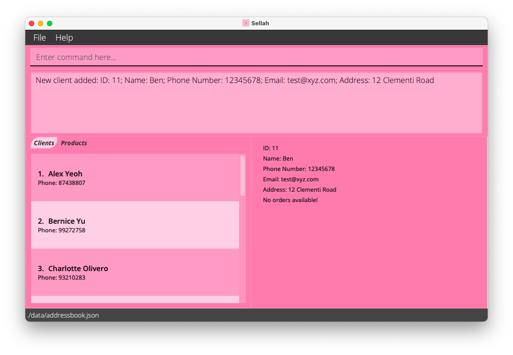
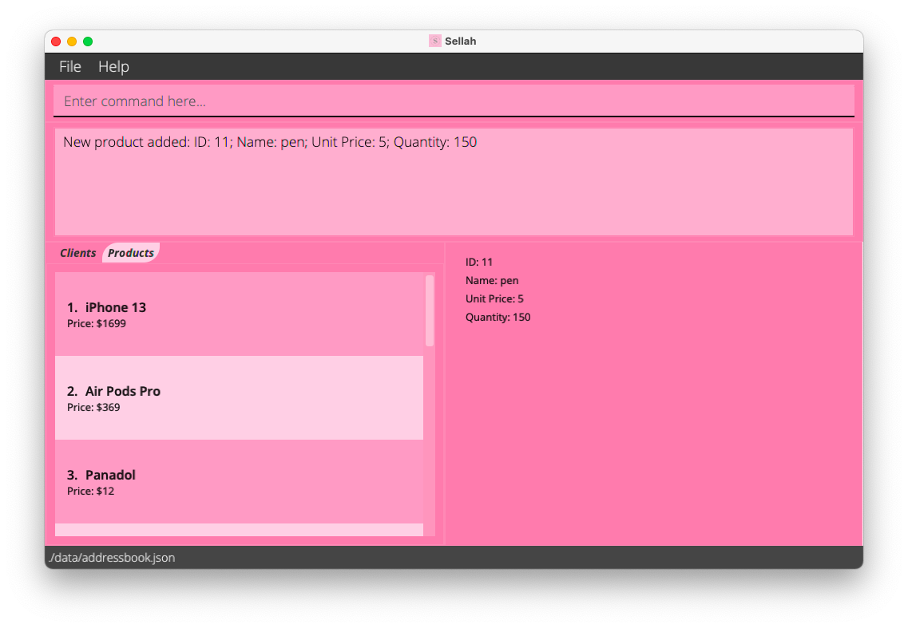
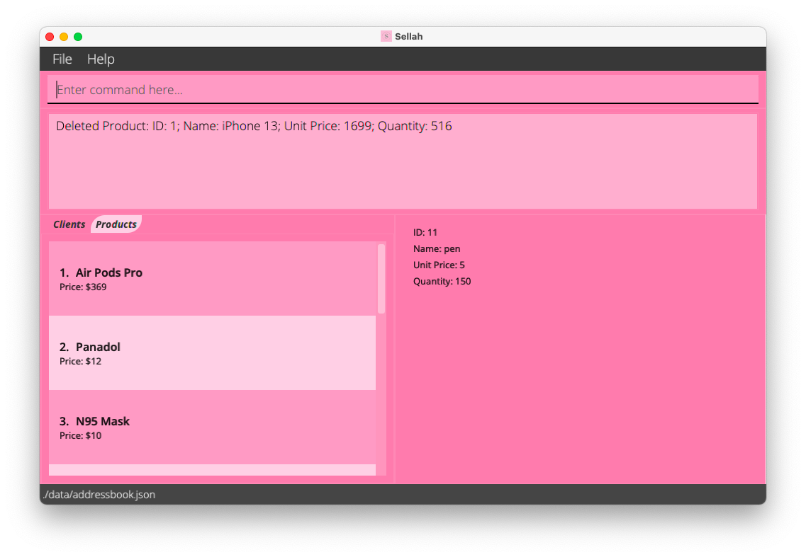
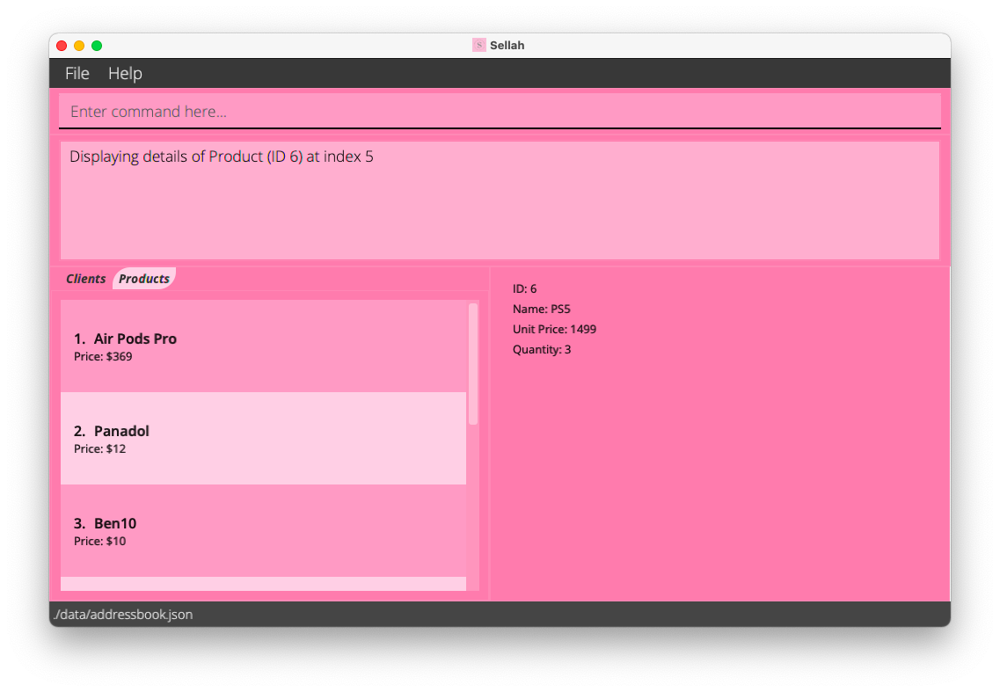
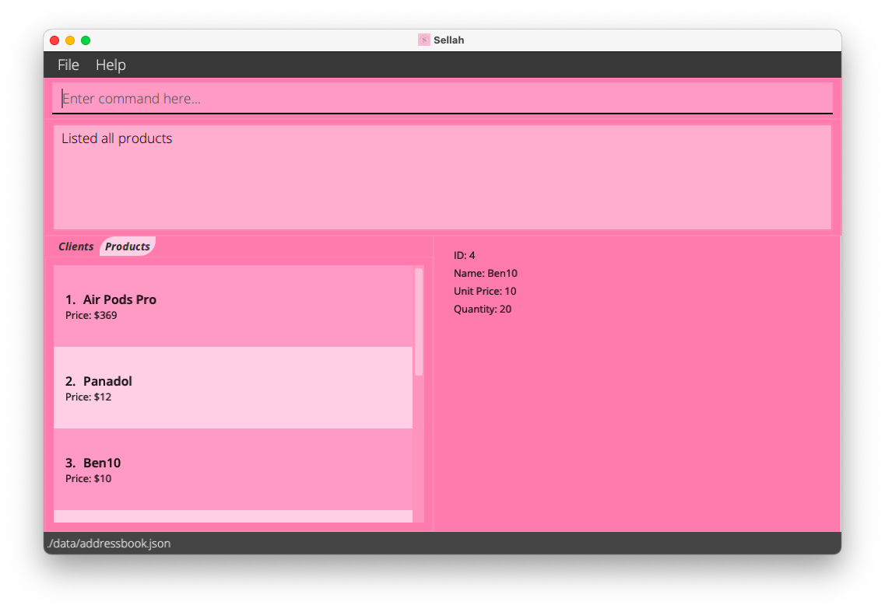

# User Guide for Sellah

## Table of Contents
1. [Introduction](#1-introduction)  
2. [Quick start](#2-quick-start)  
3. [About](#3-about)  
   3.1. [Structure of this Document](#31-structure-of-the-document)  
   3.2. [Reading this Document](#32-reading-this-document)  
   &nbsp;&nbsp;&nbsp;&nbsp; 3.2.1. [Technical terms](#321-technical-terms)  
   &nbsp;&nbsp;&nbsp;&nbsp; 3.2.2. [General Symbols and Syntax](#322-general-symbols-and-syntax)  
   &nbsp;&nbsp;&nbsp;&nbsp; 3.2.3. [Defining Client and Product](#323-defining-client-and-product)  
4. [Features](#4-features)   
   4.1. [Getting Help](#41-getting-help) 
   4.2. [Add](#42-add)  
   &nbsp;&nbsp;&nbsp;&nbsp; 4.2.1. [Adding a Client](#421-adding-a-client)  
   &nbsp;&nbsp;&nbsp;&nbsp; 4.2.2. [Adding a Product](#422-adding-a-product)  
   4.3. [Edit](#43-edit)  
   &nbsp;&nbsp;&nbsp;&nbsp; 4.3.1. [Editing a Client](#431-editing-a-client)  
   &nbsp;&nbsp;&nbsp;&nbsp; 4.3.2. [Editing a Product](#432-editing-a-product)  
   4.4. [Delete](#44-delete)  
   &nbsp;&nbsp;&nbsp;&nbsp; 4.4.1. [Deleting a Client](#441-deleting-a-client)  
   &nbsp;&nbsp;&nbsp;&nbsp; 4.4.2. [Deleting a Product](#442-deleting-a-product)  
   4.5. [View](#45-view)  
   &nbsp;&nbsp;&nbsp;&nbsp; 4.5.1. [Viewing a Client](#451-viewing-a-client)  
   &nbsp;&nbsp;&nbsp;&nbsp; 4.5.2. [Viewing a Product](#452-viewing-a-product)  
   4.6. [Find](#46-find)  
   &nbsp;&nbsp;&nbsp;&nbsp; 4.6.1. [Finding a Client](#461-finding-a-client)  
   &nbsp;&nbsp;&nbsp;&nbsp; 4.6.2. [Finding a Product](#462-finding-a-product)  
   4.7. [List](#47-list)  
   &nbsp;&nbsp;&nbsp;&nbsp; 4.7.1. [Listing all Clients](#471-listing-all-clients)  
   &nbsp;&nbsp;&nbsp;&nbsp; 4.7.2. [Listing all Products](#472-listing-all-products)  
   4.8.[Navigating the Command History](#48-navigating-the-command-history)  
   4.9. [Viewing Statistics](#49-viewing-statistics)  
   4.10. [Exiting Sellah](#410-exiting-sellah)  
   4.11. [Saving Data](#411-saving-data)  
   4.12. [Editing the Data file](#412-editing-the-data-file)  
   4.13. [Clearing the all Data](#413-clearing-all-data)  
5. [FAQ](#5-faq)  
6. [Command summary](#6-command-summary)  
--------------------------------------------------------------------------
## 1. Introduction
Welcome to the User Guide of **Sellah**!

**Sellah** is a desktop application optimized for online sellers who prefer using a Command Line Interface (CLI)
over the Graphical User Interface (GUI). It is used to keep track of the contact information of your clients and 
details of the products in your inventory.

**Sellah** uses CLI; this means that you operate the application by typing commands
into a Command Box. If your typing speed is fast, you can operate the application faster than other
GUI applications; GUI applications allow users to interact with the application through graphical icons such as 
buttons.  

If you are interested, jump to [Section 2 - Quick Start](#2-quick-start) to learn how to optimise your inventory using
**Sellah**.  
---
## 2. Quick Start

1. Ensure you have `Java 11` or above installed in your Computer. You can download it from
   [here](https://www.oracle.com/java/technologies/javase/jdk11-archive-downloads.html).

2. Download the latest `sellah.jar` from [here](https://github.com/AY2122S1-CS2103T-T12-1/tp/releases).

3. Copy the file to the folder you want to use as the _home folder_ for your **Sellah**.

4. Double-click the file to start the app. The GUI similar to the below should appear in a few seconds. Note how the app
   contains some sample data. You can use the [`clear`](#413-clearing-all-data) command to purge all data. 
   

5. Refer to the [Features](#4-features) below for details of each command.
---
## 3. About
### 3.1 Structure of the Document
The structure of this document is to help you find what you need quickly and easily.
In the next section [Section 3.2 Reading this Document](#32-reading-this-document), you will be able to find
definitions of technical terms, general syntax and format of commands that will be used
throughout the guide. The following section [Section 4 Features](#4-features), documents the main 
features of **Sellah** and provides explanations on how to utilise them to its fullest. Alternatively, if you are 
looking for a quick summary of the command formats, go to [Command Summary](#6-command-summary).

### 3.2 Reading this Document
This section provides some common terms and syntax that would be used throughout the document.
It is important that you familiarise yourself with them before moving on to [Section 4 Features](#4-features).
Throughout this guide, [Products](#323-defining-client-and-product) refer to the items in your inventory and 
[Clients](#323-defining-client-and-product) refer to
the people who have order [Products](#323-defining-client-and-product) from you.

#### 3.2.1 Technical Terms
|Term | Definition |
|:---:|:----:|
| Command | Keywords that Sellah recognises to invoke specific commands.|
| Parameters | Information to be passed to the Commands.|
| Index | The number next to the list of [Products](#323-defining-client-and-product) or [Clients](#323-defining-client-and-product).|
| ID | Each [Product](#323-defining-client-and-product) or [Client](#323-defining-client-and-product) is associated with a numerical tag. This number may not always be the same as Index.|

#### 3.2.2 General Symbols and Syntax
|Syntax| Definition |
|:----:|:----:|
|`...`| Indicates that the parameter before it can be used multiple times, including 0 times. If the parameter is `-o`, a possible usage could be `-o 1 -o 2`.|
|`UPPER_CASE` | Name of the parameter. `EMAIL` is a parameter named email. |
|`-lower_case UPPER_CASE` | A parameter field. The name of the parameter is defined in `UPPER_CASE` and `-lower_case` refers to an acronym of `UPPER_CASE`|
|`[-lower_case UPPER_CASE]` | An optional parameter field. Eg `-a A [-b B]` can be used as `A -b B` or `A`|

* Parameters can be in any order. 
  e.g. if the command specifies `-pn PHONE_NUMBER -e EMAIL`, `-e EMAIL -pn PHONE_NUMBER` is also acceptable.

* If a parameter is expected only once in the command but you specified it multiple times, only the last occurrence of
  the parameter will be taken. 
  e.g. if you specify `-pn 12341234 -pn 56785678`, only `-pn 56785678` will be taken.

* Extraneous parameters for commands that do not take in parameters (such as `exit`) will be ignored. 
  e.g. if the command specifies `exit 123`, it will be interpreted as `exit`.

#### 3.2.3 Defining Client and Product
**Client** refers to the clients that have bought your products before. Each client must have a **Name**, and a **Phone 
Number**. Optionally, they can have an **Email Address**, a physical **Address** and a list of **Orders**. Orders 
refer to the products that the client ordered. For each order, the **ID** associated to the product, the **Quantity** 
and the **date of order** must be included. Every client command requires a `-c` parameter. 

Parameter | Format |
--- | ---
`-n` | Any valid name, spaces are allowed. Eg `-n Alice Bob`
`-pn` | A series of  eight positive numbers from 0 to 9, eg `-pn 12345678`
`-e` | Any valid email, eg `-e abc@asdf.com`
`-a` | Any valid address, spaces are allowed. Eg `-a 12 clementi road`
`-o` | Each order requires a product id, quantity and a date field that is either in `YYYY/MM/DD` or `MM/DD` and is identified by its own ID. Eg `-o 1 1 10/20`

**Product** refers to the items currently in your inventory. Each product must have a **Name**, the **Unit Price**
(cost of 1 item). Optionally, you can add a **Quantity** to the products that indicates the number of that item you 
have in your inventory. Every product command requires a `-p` parameter.

Parameter | Format |
--- | ---
`-n` | Any valid name, spaces are allowed. Eg `-n windows laptop`
`-$` | A valid price, optional to specify the cents. Eg `-$ 10.00` and `-$ 10`.
`-q` | Any positive integer to specify the quantity. Eg `-q 15`

---
## 4. Features
This section contains the main features of the **Sellah**. To use each feature, you can enter the command associated 
with each feature into the CLI. 

### 4.1 Getting help
Displays a help message.
Format: `help`
Expected Output: 

### 4.2 Add
Adds a new client or product to Sellah with an automatically generated ID. An error message will be 
displayed if the format of a parameter is incorrect. Another message will be displayed if either the client or 
product to be added already exists in Sellah.

#### 4.2.1 Adding a Client
Adds a client with name, phone number and optional email, address and orders.  

Format: `add -c NAME -pn PHONE_NUMBER [-e EMAIL] [-a ADDRESS] [-o ORDER]...`  

Example: `add -c Ben -pn 98765432` adds a new `Client` `Ben`, whose `PHONE_NUMBER` is `98765432`.

#### 4.2.2 Adding a Product
Adds a product with name, unit price and optional quantity. If quantity is not specified, the number of Product is 
not 0, but undefined instead. 

Format: `add -p NAME -$ UNIT_PRICE [-q QUANTITY]` 

Example: `add -p pen -$ 10.00 -q 150` adds a new `Product` `pen` with a `UNIT_PRICE` of `$10.00` and there are `150` 
pens in stock.

### 4.3 Edit
Edits an existing client or product in Sellah. You should provide at least one of the optional field so 
that Sellah can update the client or product correctly.

#### 4.3.1 Editing a Client
Edits the client (if he exists) at the specified index in Sellah.

Format : `edit -c INDEX [-n NAME] [-pn PHONE_NUMBER] [-e EMAIL] [-a ADDRESS] [-o ORDER]...`

Example : `edit -c 1 -n Ben` Edits the name of the client with `INDEX` of `1` to `Ben`.

* If the client has an order with same `ID`, then that order's other information will be updated with the
information in `ORDER`.
* If the client does not have an order with same `ID`, then that `ORDER` will be added.
* If the `ORDER`'s `QUANTITY` is 0, then that `ORDER` will be removed.
* For example, assuming client already has an order `[ ID = 1, QUANTITY = 3, (other information)... ]`, and the
input `ORDER`s are `[ ID = 1, QUANTITY = 0, ... ]` and `[ ID = 2, QUANTITY = 10, ... ]`:
* `[ ID = 1, QUANTITY = 3, ... ]` will be updated to `[ ID = 1, QUANTITY = 0, ... ]` as they have the same `ID`,
and since `QUANTITY` is now 0, this `ORDER` will be removed.
* `[ ID = 2, QUANTITY = 10, ... ]` will be added as the client does not have an order with the same `ID`.

#### 4.3.2 Editing a Product
Edits the product (if it exists) at the specified index in Sellah.

Format: `edit -p INDEX [-n NAME] [-$ UNIT_PRICE] [-q QUANTITY]`

Example : `edit -p 3 -n Ben10 -q 20` Edits the name of the product with `INDEX` of `3` to `Ben10` and the quantity to `20`.

### 4.4 Delete
Deletes the specified client/product from Sellah. An error message will be displayed if the client or 
product doesn't exist in Sellah.

#### 4.4.1 Deleting a Client
Deletes the client at the specified index from Sellah.

Format: `delete -c INDEX`

Example : `delete -c 1` deletes the client with index 1 in the application.

#### 4.4.2 Deleting a Product
Deletes the product at the specified index in Sellah.

Format: `delete -p INDEX`

Example : `delete -p 1` deletes the product with index 1 from Sellah.

### 4.5 View
Views the details of a client or product. The details will be displayed in the second panel of Sellah. If the index 
provided is invalid, you will be shown an error message.

#### 4.5.1 Viewing a Client
Views a current client that exists in Sellah. You will see the details of the client in the second panel on the 
right. These details include ID, name, phone number, email, address and orders. If any of the details were not 
specified, a placeholder value will be displayed such as `No orders available!`.

Format : `view -c INDEX`

Example : `view -c 20` Views all the details of the client with `INDEX` of `20`

#### 4.5.2 Viewing a Product
Views a current product that exists in Sellah. Details of the product will be presented to you in the second panel 
on the right. These details include ID, name, unit price and quantity. If any of the details were not specified, a 
placeholder value will be displayed such as `No quantity provided`.

Format : `view -p INDEX`

Example : `view -p 5` Views all the details of the product with `INDEX` of `5`

### 4.6 Find
Finds a client or product in Sellah, based on the name specified in `-n`. The name you provided must fully match the
name(case-sensitive) in Sellah, otherwise you will receive an error message.

#### 4.6.1 Finding a Client
Finds a client in Sellah.

Format : `find -c NAME`

Example : `find -c john` Shows a list of all clients with the `NAME` `john` in Sellah.

#### 4.6.2 Finding a Product
Finds a product in Sellah.

Format : `find -p NAME`

Example : `find -c phone` Shows a list of all products with the `NAME` `phone` in the application.

### 4.7 List
Displays a list of all the clients or products in Sellah. If there are no clients or products, a message will inform 
you that Sellah has no clients or product, depending on whether you are listing client or product.

#### 4.7.1 Listing all Clients
Lists all the clients in Sellah.

Format : `list -c`

Example : `list -c` Shows a list of all clients in Sellah.

#### 4.7.2 Listing all Products
Lists all the products in Sellah.

Format : `list -p`

Example : `list -p` Shows a list of all products in the application.

### 4.8 Navigating the Command History
You may press the `↑` and `↓` keys to navigate to previous commands that you have used within the same session. 
Pressing `↑` when the first command is currently displayed will do nothing. `↓` when the last command is currently 
displayed clears the command input field. Subsequent `↓` will do nothing.

### 4.9 Viewing Statistics
Shows the current stock of each product in your inventory. If there are no products in your inventory with a valid 
quantity specified, an error message would be shown. The stock would be displayed as a pie chart in the secondary 
panel on the right. Each label would contain the product name with the quantity associated with it.

Format : `stat`

### 4.10 Exiting Sellah
Exits Sellah.

Format : `exit`

### 4.11 Saving Data
Sellah's data are saved in the hard disk automatically after any command that changes the data. There is no need to save
manually.

### 4.12 Editing the Data file
Sellah data are saved as a JSON file `[JAR file location]/data/sellah.json`. You are welcome to update data directly 
by editing this file. However, if your changes to the file make its format invalid, Sellah will start with an data 
file on its next run.

### 4.13 Clearing all Data
Deletes all client and product data from Sellah. Please be very careful when using this command as once 
deleted, the data **cannot be recovered**! 

Format: `clear`

Expected Output: 

---
## 5. FAQ
**Q**: How do I transfer my data to another Computer? 
**A**: Install the app in the other computer and overwrite the empty data file it creates with the file that contains
the data of your previous Sellah home folder. 

---
## 6. Command Summary
Action | Format
--- | ---
[Help](#41-getting-help) | `help`
[Exit](#410-exiting-sellah) | `exit`
[Add](#42-add) | Client : `add -c NAME -pn PHONE_NUMBER [-e EMAIL] [-a ADDRESS] [-o ORDER]...`  Product : `add -p NAME -$ UNIT_PRICE [-q QUANTITY]` 
[Delete](#44-delete) | Client : `delete -c INDEX`   Product : `delete -p INDEX`
[Clear](#413-clearing-all-data) | `clear`
[Edit](#43-edit) | Client : `edit -c INDEX [-n NAME] [-pn PHONE_NUMBER] [-e EMAIL] [-a ADDRESS] [-o ORDER]...`   Product : `edit -p INDEX [-n NAME] [-$ UNIT_PRICE] [-q QUANTITY]`
[Find](#46-find) | Client : `find -c NAME`   Product : `find -p NAME`
[List](#47-list) | Client : `list -c`   Product : `list -p`
[View](#45-view) | Client :`view -c INDEX`   Product : `view -c INDEX`
[Command History](#48-navigating-the-command-history) | Previous : `↑`   Next : `↓`
[Statistics](#49-viewing-statistics) | `stat`
