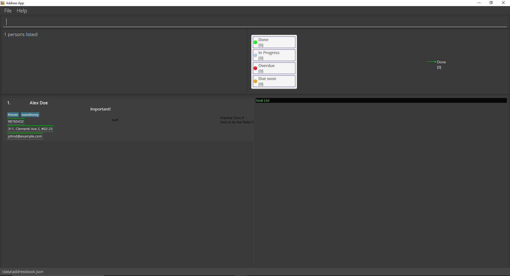

###ContactSh - UserGuide


As a student entrepreneur with a busy schedule, do you always find yourself missing an appointment/meeting with
your clients or friends? Or can't seem to find a way to easily recall details of a certain someone
who is probably stored as one of your many contacts in your Excel sheet? Fret not,
as we have designed an application called **ContactSh** just for you! It is a Desktop application for managing your contacts
as well as tasks related to each of them. It boasts a highly effective search function and contact-task tracking system.
It is also optimized for use via a Command Line Interface(CLI) that is similar in style as Linux CLIs,
while still having the benefits of a Graphical User Interface (GUI). If you can type fast, you will be able to manage
business tasks related to your contacts more efficiently than using other traditional GUI apps.

The [Quick Start](#quick-start) section shows you how to quickly get ContactSh up and running on your computer.
If you are a new user, it is recommended to go through the instructions under [Features](#features) one by one.
If you are an experienced user, and just want to refer to the list of features, you may use the [Table of contents](#table-of-contents)
to quickly navigate to the command of your choice.

---

## Table of Contents

[Quick Start](#quick-start) <br>
[Features](#features)
* [Give a list of instructions : `man`](#give-a-list-of-instructions-man)
* [Adding a person : `add`](#adding-a-person-add)
* [Listing all persons : `ls`](#listing-all-persons-ls)
* [Editing a person : `edit`](#editing-a-person-edit)
* [Locating persons by name : `find`](#locating-persons-by-name-find)
* [Deleting a person : `rm`](#deleting-a-person-rm)
* [Add task : `add`](#add-task-add)
* [Delete task : `rm`](#delete-task-rm)
* [Edit task : `edit`](#edit-task-edit)
* [Mark task as done : `donetask`](#mark-task-as-done-donetask)
* [Mark task as not done : `undotask`](#mark-task-as-not-done-undotask)
* [Clearing all entries : `clear`](#clearing-all-entries-clear)
* [Viewing tasks : `cat`](#viewing-tasks-cat)
* [Sorting persons by name: `sort`](#sorting-persons-by-name-sort)
* [Accessing the cache](#accessing-the-cache)
* [Saving the data](#saving-the-data)
* [Editing the data file](#editing-the-data-file)
* [Reminder for tasks that are due soon: `reminder `](#reminder-for-tasks-that-are-due-soon-reminder)
* [Archiving data files `[coming in v2.0]`](#archiving-data-files-coming-in-v20)

[FAQ](#faq)<br>
[Command Summary](#command-summary)

---

## Quick start

1. Ensure you have Java `11` or above installed in your Computer.

1. Download the latest `ContactSH.jar` from [here](https://github.com/AY2122S1-CS2103T-W10-1/tp/releases).

1. Copy the file to the folder you want to use as the _home folder_ for your ContactSH.

1. Double-click the file to start the app. The GUI similar to the below should appear in a few seconds. Note how the app contains some sample data.<br>
   

1. Type the command in the command box and press Enter to execute it. e.g. typing **`man`** and pressing Enter will open the help window.<br>
   Some example commands you can try:

   * **`ls`** : Lists all contacts.
   * **`add`**`-n John Doe -p 98765432 -e johnd@example.com -a John street, block 123, #01-01` : Adds a contact named `John Doe` to ContactSH.
   * **`rm`**`3` : Deletes the 3rd contact shown in the current list.
   * **`clear`** : Deletes all contacts.


1. Refer to the [Features](#features) below for details of each command.

---

## Features

<div markdown="block" class="alert alert-info">

**:information_source: Notes about the command format:**<br>

* Words in `UPPER_CASE` are the parameters to be supplied by you.<br>
  e.g. in `add -n NAME`, `NAME` is a parameter which can be used as `add -n John Doe`.

* Items in square brackets are optional.<br>
  e.g `-n NAME [-l LABEL]` can be used as `-n John Doe -l friend` or as `-n John Doe`.

* Items with `…`​ after them can be used multiple times including zero times.<br>
  e.g. `[-l LABEL]…​` can be used as `` (i.e. 0 times), `-l friend`, `-l friend -l family` etc.

* Parameters can be in any order.<br>
  e.g. if the command specifies `-n NAME -p PHONE_NUMBER`, `-p PHONE_NUMBER -n NAME` is also acceptable.

* If a parameter is expected only once in the command but you specified it multiple times, only the last occurrence of the parameter will be taken.<br>
  e.g. if you specify `-p 12341234 -p 56785678`, only `-p 56785678` will be taken.

* Extraneous parameters for commands that do not take in parameters (such as `ls`, `exit` and `clear`) will be ignored.<br>
  e.g. if the command specifies `ls 123`, it will be interpreted as `ls`.

</div>

### Viewing details of instructions: `man`

Shows you details of instructions that can be used to navigate the app.

Format: `man [COMMAND_NAME]`

* If no command-name is entered, you will see a table of instructions, in a new window, that can be used to navigate the app.

* If you enter a valid command-name, you will see the details of that command, which includes the format and taskName of the command.

Examples:
* `man sort` Shows the full details of `sort` command.

Sample outcome (You typed `man sort`)

```
sort: Sorts the list of persons by the alphabetical order of their name.
Parameters: [-r]
Example: sort -r
```

### Adding a person: `add`

Adds a person to ContactSH.

Format: `add -n NAME -p PHONE_NUMBER -e EMAIL -a ADDRESS [-d Description] [-l LABEL]... [-impt IMPORTANCE]`

<div markdown="span" class="alert alert-primary">:bulb: **Tip:**
A person can have any number of labels (including 0)
</div>

Notes:

*`IMPORTANCE` is either "true" or "false" (Case insensitive)

Examples:

* `add -n John Doe -p 98765432 -e johnd@example.com -a John street, block 123, #01-01` Adds a person with name `John Doe`, phone number `98765432`, email `johnd@example.com`, address `John street, block 123, #01-01`.
* `add -n Betsy Crowe -l friend -e betsycrowe@example.com -a Newgate Prison -p 1234567 -d Bald -l criminal` Adds a person with name `Betsy Crowe`, phone number `1234567`, email `betsycrowe@example.com`, address `Newgate Prison`, label `criminal` and `friend`, description `Bald`.

### Listing all persons: `ls`

Shows a list of all persons in ContactSH.

Format: `ls`

### Editing a person: `edit`

Edits an existing person in ContactSH.

Format: `edit INDEX [-n NAME] [-p PHONE] [-e EMAIL] [-a ADDRESS] [-d DESCRIPTION] [-l LABEL]… [-impt IMPORTANCE]`

* Edits the person at the specified `INDEX`. The index refers to the index number shown in the displayed person list. The index **must be a positive integer** 1, 2, 3, …​
* At least one of the optional fields must be provided.
* Existing values will be updated to the input values.
* When editing labels, the existing labels of the person will be removed i.e adding of labels is not cumulative.
* You can remove all the person’s labels by typing `-l` without
    specifying any labels after it.
* `IMPORTANCE` is either "true" or "false" (Case insensitive)

Examples:

* `edit 1 -p 91234567 -e johndoe@example.com` Edits the phone number and email address of the 1st person to be `91234567` and `johndoe@example.com` respectively.
* `edit 2 -n Betsy Crower -l` Edits the name of the 2nd person to be `Betsy Crower` and clears their existing labels.

### Locating persons by name: `find`

Finds persons whose names contain any of the given keywords.

Format: `find [-n NAME] [-p PHONE] [-e EMAIL] [-a ADDRESS] [-d DESCRIPTION] [-l LABEL] [-tn TASK_NAME]`

* The search is case-insensitive. e.g. hans will match Hans
* The order of the keywords matters. e.g. Hans Bo will not match Bo Hans
* Only the specified attribute is searched.
* Abbreviations will be matched e.g. Han will match Hans
* Persons matching all the keywords will be returned. e.g. A Y will return Alex Yeoh, Alexandra Yee

Examples:

find [-n] Alex Finds all people whose name matches the keyword "Alex".


### Deleting a person: `rm`

Deletes the specified person from ContactSH.

Format: `rm INDEX`

* Deletes the person at the specified `INDEX`.
* The index refers to the index number shown in the displayed person list.
* The index **must be a positive integer** 1, 2, 3, …​

Examples:

* `ls` followed by `rm 2` deletes the 2nd person in ContactSH.
* `find Betsy` followed by `rm 1` deletes the 1st person in the results of the `find` command.

### Add task: `add`

Add a task to the current list of tasks attached to a person.

Format: `add INDEX -tn TASKNAME [-td TASK_DATE] [-tt TASK_TIME] [-ta TASK_ADDRESS]`

* Adds a task to the person at the specified `INDEX`. The index refers to the index number shown in the displayed person list. The index **must be a positive integer** 1, 2, 3, …​
* `TASK_DATE` should follow the format of `YYYY-MM-DD`.
* `TASK_TIME` should follow the format of `HH:MM`.

Examples:
* `add 1 -tn call for meeting -td 2021-12-03 -tt 14:30` Adds the task `call for meeting` with date `2021-12-03` and time `14:30` to the list of task of the person in 1st person.

### Delete task: `rm`

Deletes a task from the specified person.

Format: `rm INDEX -ti TASK_INDEX…​`

* Deletes a task attached to the person at the specified `INDEX`. The index refers to the index number shown in the displayed person list. The index **must be a positive integer** 1, 2, 3, …​
* The task deleted is specified by the `TASK_INDEX`. The task_index refers to the index number displayed in the tasklist of said person. The index **must be a positive integer** 1, 2, 3, …​
 If the same `TASK_INDEX` is specified more than once, it will only be deleted once.

Examples:

* `rm 2 -ti 2 -ti 2` Deletes the 2nd task attached to the 2nd person.
* `rm 1 -ti 2 -ti 3` Deletes the 2nd and 3rd task attached to the 1st person.

### Edit task: `edit`

Edit an existing task in ContactSH.

Format: `edit INDEX -ti TASK_INDEX [-tn TASKNAME] [-td TASK_DATE] [-tt TASK_TIME] [-ta TASK_ADDRESS]…​`

* Edits tasks attached to the person at the specified `INDEX`. The index refers to the index number shown in the displayed person list. The index **must be a positive integer** 1, 2, 3, …​
* The tasks edited  is specified by the `TASK_INDEX`. The task_index refers to the index number displayed in the tasklist of said person. The index **must be a positive integer** 1, 2, 3, …​
* Multiple tasks of one person can be edited in one command. All fields provided after a given `TASK_INDEX` are taken to be updated fields for the task at that index.
* Existing values will be updated to the input value.
* At least one of the optional fields must be provided per `TASK_INDEX` provided.
* `TASK_DATE` should follow the format of `YYYY-MM-DD`.
* `TASK_TIME` should follow the format of `HH:MM`.

Examples:

* `edit 3 -ti 2 -tn Group Project Meeting` Changes the description of the 2nd task attached to the 3rd person in the list to `Group Project Meeting`.
* `edit 2 -ti 3 -tn Presentation Meeting -ta Zoom -ti 5 -td 2021-12-20` Changes the 3rd and 5th task of the second person in the list. Description of the 3rd task is changed to`Presentation Meeting` and address to `Zoom`, and date of the 5th task is changed to `2021-12-21`.

### Mark task as done: `donetask`

Marks existing tasks in ContactSH as done.

Format: `donetask INDEX -ti TASK_INDEX…​`

* Marks tasks attached to the person at the specified `INDEX` as done. The index refers to the index number shown in the displayed person list. The index **must be a positive integer** 1, 2, 3, …​
* The tasks marked is specified by the `TASK_INDEX`. The task_index refers to the index number displayed in the tasklist of said person. The index **must be a positive integer** 1, 2, 3, …​
* Multiple tasks of one person can be marked as done in one command.

Examples:

* `donetask 4 -ti 1 -ti 5` Marks the 1st and 5th task of the 4th person in the list as done.

### Mark task as not done: `undotask`

Marks existing tasks in ContactSH as not done.

Format: `undotask INDEX -ti TASK_INDEX…​`

* Marks tasks attached to the person at the specified `INDEX` as not done. The index refers to the index number shown in the displayed person list. The index **must be a positive integer** 1, 2, 3, …​
* The tasks marked is specified by the `TASK_INDEX`. The task_index refers to the index number displayed in the tasklist of said person. The index **must be a positive integer** 1, 2, 3, …​
* Multiple tasks of one person can be marked as not done in one command.

Examples:
* `undotask 4 -ti 1 -ti 5` Marks the 1st and 5th task of the 4th person in the list as not done.

### Clearing all entries: `clear`

Clears all entries from ContactSH.

Format: `clear`

### Viewing tasks: `cat`

1. Show you a list of tasks that has been attached to a specific person.

   Format: `cat INDEX`

   * Displays the list of tasks attached to the person at the specified `INDEX`.
   * The index refers to the index number shown in the displayed person list.
   * The index **must be a positive integer** 1, 2, 3, ...

   Examples:

   * `ls` followed by delete 2 deletes the 2nd person in the address book.
   * `find` Betsy followed by `delete 1` deletes the 1st person in the results of the `find`command.

2. Shows you a filtered list of tasks that has been attached to a specific person.

   Format: `cat INDEX -f KEYWORDS…`

   * Displays a filtered lists of tasks for a specific person according to the keywords provided.
   * Only tasks that matches the keywords will be shown.

   Examples:

   * Alex is the first person in the address book and has the tasks [Work, project meeting at NUS]. `cat 1 -f nus` will display the task "project meeting at NUS"

3.Shows you the task list of every single person in ContactSh.

   Format: `cat -A`

<div markdown="span" class="alert alert-primary">:bulb: **Tip:**
    Alternatively, you could also click on the person in the GUI to open said person's tasks!
    </div>

### Sorting persons by name: `sort`

Sort persons by the alphabetical order of their name.

Format: `sort [-r]`

* The default sort with no options provided displays a list of persons sorted in ascending ASCII alphabetical order of their name.
* If the optional `-r` flag is provided, a list of persons sorted in reverse order is displayed.

### Accessing the cache

* ContactSH guarantees it saves up to the last 25 `commands` (both valid and invalid) that you input. You can browse through the previous input using the up and down arrow key on your keyboard when typing in the command box.

* ContactSH may save up to 50 newest command. However, once the cache is full, half (25) of the oldest `command` will be deleted. Hence, the oldest 25 is not guaranteed to be saved.

* Cache will be emptied once you end the session (the application is closed). Hence, commands from previous sessions cannot be retrieved.

### Saving the data

* ContactSH data are saved in the hard disk automatically after any command that changes the data. There is no need to save manually.

### Editing the data file

* ContactSH data are saved as a JSON file `[JAR file location]/data/addressbook.json`. Advanced users are welcome to update data directly by editing that data file.

<div markdown="span" class="alert alert-warning">:exclamation: **Caution:**
If your changes to the data file makes its format invalid, ContactSH will discard all data and start with an empty data file at the next run.
</div>

### Reminder for tasks that are due soon: `reminder`

1. Shows a numerical value in days. The value is the number of days prior to a task's date to remind that it is due soon.

    Format: `reminder`

2. Sets the number of days prior to a task's date to remind that it is due soon.

    Format: `reminder -s DAYS`

    * DAYS refer to the number of days prior to a task's date.
      The day **must be a positive integer** 1, 2, 3, ...

    Example:

    * reminder -s 10

:memo:**Note**: A task will turn orange in colour as a reminder that it is due soon
when the system date is later than or same as (task's date - DAYS) and earlier than task's date.
### Archiving data files `[coming in v2.0]`

_Details coming soon ..._

---

## FAQ

**Q**: How do I transfer my data to another Computer?<br>
**A**: Install the app in the other computer and overwrite the empty data file it creates with the file that contains the data of your previous ContactSH home folder.

---

## Command summary

Action | Format, Examples
--------|------------------
**Add** | `add -n NAME -p PHONE_NUMBER -e EMAIL -a ADDRESS [-d Description] [-l LABEL]…​` <br> e.g., `add -n James Ho -p 22224444 -e jamesho@example.com -a 123, Clementi Rd, 1234665 -d Rich -l friend -l colleague`
**Clear** | `clear`
**Delete** | `rm INDEX`<br> e.g., `rm 3`
**Edit** | `edit INDEX [-n NAME] [-p PHONE_NUMBER] [-e EMAIL] [-a ADDRESS] [-d Description] [-l LABEL]…​`<br> e.g.,`edit 2 -n James Lee -e jameslee@example.com`
**Find** | `find [-n NAME] [-p PHONE_NUMBER] [-e EMAIL] [-a ADDRESS] [-d Description] [-l LABEL] [-tn TASK_NAME]`<br> e.g., `find -n Alex`
**List** | `ls`
**Sort** | `sort [-r]`
**Help** | `man`
**Add Task** | `add INDEX -tn TASKNAME` <br> e.g., `addtask 2 -tn celebrate $1 million revenue -tn Contact Professor to get help`
**Delete Task** | `rm INDEX -ti TASK_INDEX` <br> e.g., `deletetask 2 -ti 2 -ti 3`
**Edit Task** | `edit INDEX -ti TASK_INDEX [-tn TASK_NAME] [-td TASK_DATE] [-tt TASK_TIME] [-ta TASK_ADDRESS]…​` <br> e.g., `edittask 1 -ti 2 -tn Internship Interview -tt 15:45 -ti 4 -td 2022-09-20`
**Mark Task Done** | `donetask INDEX -ti TASK_INDEX…​` <br> e.g., `donetask 3 -ti 2 -ti 5`
**Undo Mark Task Done** | `undotask INDEX -ti TASK_INDEX…​` <br> e.g., `undotask 3 -ti 2 -ti 5`
**View Tasks** | `cat INDEX`<br>e.g.,`cat 4`<br><br>`cat -A`
**View Reminder Days** | `reminder`
**Set Reminder Days** | `reminder -s DAYS`<br>e.g., reminder -s 21
