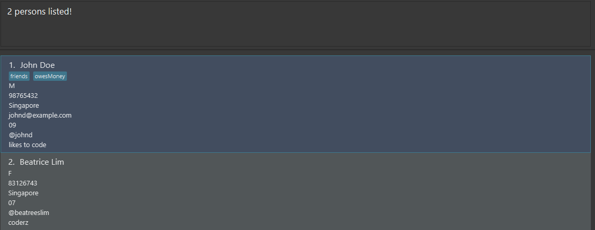

Socius is a **desktop app for managing CS2103T tutorial classmates’ contacts for international students, optimized for
use via a Command Line Interface (CLI)** while still having the benefits of a Graphical User Interface (GUI). If you can
type fast, Socius can get your contact management tasks done faster than traditional GUI apps.

--------------------------------------------------------------------------------------------------------------------

* Table of Contents
{:toc}

<!---
## Table of Contents
1. Quick Start
2. Features
     1. Viewing help `help`
     2. Adding a person `add`
     3. Importing contacts from a file `import`
     4. Listing all persons `list`
     5. Editing a person `edit`
     6. Locating persons by name `find`
     7. Deleting a person `delete`
     8. Computing statistics of a tutorial group : `stats`
     9. Clearing all entries `clear`
     10. Exiting the program `exit`
     11. Saving the data
     12. Editing the data file
3. FAQ
4. Command Summary
--->

--------------------------------------------------------------------------------------------------------------------

## Quick Start

1. Before you can use the application, you need to have ***Java 11*** installed in your Computer.

1. Download the latest `Socius.jar` on our [Releases](https://github.com/AY2122S1-CS2103T-W08-4/tp/releases) page.

1. Move the file (`Socius.jar`) to a folder you want to use as the _home folder_ for your Socius Application.

1. *Double-click* the file to start the app. You should see the following screen similar to the one below appear within a few seconds.

   

1. Note that the app comes with some sample data by default. Type `clear` in the command box to remove those sample data.

1. You can refer to the next section on [Features](#features) for more details of each command. Alternatively, you can go to [Command Summary](#command-summary) for an overview of all commands.

1. The following are some example of commands you can try. Type the command in the command box and press `⤷Enter` to execute it.

    * **`list`** : Lists all contacts.

    * **`add`** `n/John Doe tg/W08 nat/Singaporean` : Adds a contact named `John Doe` to Socius.

    * **`delete`** `3` : Deletes the 3rd contact shown in the current list.

    * **`clear`** : Deletes all contacts.

    * **`exit`** : Exits the app.

--------------------------------------------------------------------------------------------------------------------

## Features

**:information_source: Notes about the command format:** 

* Words in `UPPER_CASE` are the parameters to be supplied by the user. 
  e.g. in `add n/NAME`, `NAME` is a parameter which can be used as `add n/John Doe`.

* Items in square brackets are optional. 
  e.g `n/NAME [t/TAG]` can be used as `n/John Doe t/friend` or as `n/John Doe`.

* Items with `…`​ after them can be used multiple times including zero times. 
  e.g. `[t/TAG]…​` can be used as ` ` (i.e. 0 times), `t/friend`, `t/friend t/family` etc.

* Parameters can be in any order. 
  e.g. if the command specifies `n/NAME p/PHONE_NUMBER`, `p/PHONE_NUMBER n/NAME` is also acceptable.

* If a parameter is expected only once in the command but you specified it multiple times, only the last occurrence of
  the parameter will be taken. 
  e.g. if you specify `p/12341234 p/56785678`, only `p/56785678` will be taken.

* Extraneous parameters for commands that do not take in parameters (such as `help`, `list`, `exit` and `clear`) will be
  ignored. 
  e.g. if the command specifies `help 123`, it will be interpreted as `help`.

### Viewing help : `help`

Shows a message explaining how to access the help page.

Format: **`help`**

### Adding a person: `add`

Adds a person to the address book.

Format: **`add`** `n/NAME [p/PHONE_NUMBER] [e/EMAIL] [nat/NATIONALITY] [g/GENDER] [tg/TUTORIAL GROUP] [h/@SOCIALHANDLE]
[r/REMARK] [t/TAG]…​`

* Only `n/NAME` field is *compulsory*, while other fields are *optional*.
* The order of the fields does not matter

:bulb: **Tip:**
A person can have any number of tags (including 0)

Examples:

* **`add`** `n/Dwight Halpert`
* **`add`** `n/John Doe p/98765432 e/johnd@example.com g/M`
* **`add`** `n/Betsy Crowe t/friend e/betsycrowe@example.com p/1234567 tg/07`
* **`add`** `n/Tan Ah Gao nat/Singapore h/@TanAhCow r/Funny Guy`

### Importing contacts from a file `import`

Imports and adds every person that is listed in the specified file.

Format: `import FILE_NAME.json`

* File must be in JSON format.
* File must be located within the `data` directory in the same directory as `socius.jar`.

### Listing all persons : `list`

Shows a list of all persons in the address book.

Format: **`list`**

### Editing a person : `edit`

Edits an existing person in the address book.

Format: **`edit`** `INDEX  n/NAME [p/PHONE_NUMBER] [e/EMAIL] [nat/NATIONALITY] [g/GENDER] [tg/TUTORIAL GROUP] [h/@SOCIALHANDLE]
[r/REMARK] [t/TAG]…​`

* Edits the person at the specified `INDEX`. The index refers to the index number shown in the displayed person list.
  The index **must be a positive integer** 1, 2, 3, …​
* At least one of the optional fields must be provided.
* Existing values will be updated to the input values.
* When editing tags, the existing tags of the person will be removed i.e adding of tags is not cumulative.
* You can remove all the person’s tags by typing `t/` without specifying any tags after it.

Examples:

* **`edit`** `1 p/91234567 e/johndoe@example.com` Edits the phone number and email address of the 1st person to be `91234567`
  and `johndoe@example.com` respectively.
* **`edit`** `2 n/Betsy Crower t/` Edits the name of the 2nd person to be `Betsy Crower` and clears all existing tags.

### Locating persons by name: `find`

Finds persons whose names contain any of the given keywords.

Format: **`find`** `KEYWORD [MORE_KEYWORDS]`

* The search is case-insensitive. e.g `hans` will match `Hans`
* The order of the keywords does not matter. e.g. `Hans Bo` will match `Bo Hans`
* Socius is capable of searching for keywords of all properties. e.g. `SocialHandle`, `Nationality`, etc.
* Only full words will be matched e.g. `Han` will not match `Hans`add
* Persons matching at least one keyword will be returned (i.e. `OR` search). e.g. `n/Hans n/Bo` will
  return `Hans Gruber`
  , `Bo Yang`

Examples:

* **`find`** `n/John` returns `john` and `John Doe`
* **`find`** `n/alex n/david` returns `Alex Yeoh`, `David Li` 
  
* **`find`** `nat/Singapore`  
  

### Deleting a person : `delete`

Deletes the specified person from the address book.

Format: **`delete`** `INDEX`

* Deletes the person at the specified `INDEX`.
* The index refers to the index number shown in the displayed person list.
* The index **must be a positive integer** 1, 2, 3, …​

Examples:

* **`list`** followed by **`delete`** `2` deletes the 2nd person in the address book.
* **`find`** `Betsy` followed by **`delete`** `1` deletes the 1st person in the results of the **`find`** command.

### Clearing all entries : `clear`

Clears all entries from the address book.

Format: **`clear`**

### Exiting the program : `exit`

Exits the program.

Format: **`exit`**

### Saving the data

Socius data are saved in the hard disk automatically after any command that changes the data. There is no need to
save manually.

### Editing the data file

Socius data are saved as a JSON file `[JAR file location]/data/addressbook.json`. Advanced users are welcome to
update data directly by editing that data file.

:exclamation: **Caution:**
If your changes to the data file makes its format invalid, Socius will discard all data and start with an empty data file at the next run.

### Archiving data files `[coming in v2.0]`

_Details coming soon ..._

--------------------------------------------------------------------------------------------------------------------

## FAQ

**Q**: How do I transfer my data to another Computer? 
**A**: Install the app in the other computer and overwrite the empty data file it creates with the file that contains
the data of your previous Socius home folder.

--------------------------------------------------------------------------------------------------------------------

## Command Summary

|Action | Format | Examples|
|--------|------------------|------------------------------------|
|**Add** | **`add`** `n/NAME [p/PHONE_NUMBER] [e/EMAIL] [nat/NATIONALITY] [g/GENDER] [tg/TUTORIAL GROUP] [h/@SOCIALHANDLE] [r/REMARK] [t/TAG]…​`| **`add`** `n/James Ho p/22224444 e/jamesho@example.com g/M tg/12 h/@friendlyjames r/Friendly t/colleague`|
|**Clear** | **`clear`** | **`clear`** |
|**Delete** | **`delete`** `INDEX` | **`delete`** `3`|
|**Edit** | **`edit`** `INDEX [n/NAME] [p/PHONE_NUMBER] [e/EMAIL] [nat/NATIONALITY] [g/GENDER] [tg/TUTORIAL GROUP] [h/@SOCIALHANDLE] [r/REMARK] [t/TAG]…​` | **`edit`** `2 n/James Lee e/jameslee@example.com` |
|**Find** | **`find`** `KEYWORD [MORE_KEYWORDS]` | **`find`** `g/F tg/07` |
|**List** | **`list`** | **`list`** |
|**Help** | **`help`** | **`help`** |
