gitGud is a **desktop application for managing your friends' gaming information**. It uses a gamer-themed **Graphical User Interface 
(GUI) combined with an optimized Command Line Interface (CLI)** to give you a smooth and efficient experience. 

Keeping track of all of yours friends' gaming information and schedules can be difficult and time-consuming.
With gitGud, there is no need to get tilted(frustrated) by this anymore as **how fast you type determines how fast you can manage your gaming contacts**.

* Table of Contents
{:toc}

--------------------------------------------------------------------------------------------------------------------

## Quick start

1. Ensure you have Java `11` or above installed in your Computer.

2. Download the latest `gitgud.jar` from [here](https://github.com/AY2122S1-CS2103T-W13-4/tp/releases).

3. Copy the file to the folder you want to use as the _home folder_ for your gitGud application.

4. Double-click the file to start the app. The GUI similar to the below should appear in a few seconds. 
   
 <ins>gitGud upon startup.</ins>
5. Type the command in the command box and press `Enter` to execute it. e.g. typing **`help`** and pressing `Enter` will open the help window. 
   Some example commands you can try:

   * **`friend --list`** : Lists all friends.

   * **`friend --add`**`Draco -n Marcus` : Adds a friend __Marcus__ with gitGud `FRIEND_ID` of __Draco__ to the application.

   * **`friend --delete`**`Draco` : Deletes friend with gitGud `FRIEND_ID` of __Draco__.

   * **`exit`** : Exits the app.

6. Refer to the [Features](#features) below for details of each command.

--------------------------------------------------------------------------------------------------------------------

## Features

**:information_source: Notes about the command format:** 

* Words in `UPPER_CASE` are the parameters to be supplied by the user. 
  e.g. in `game --get GAME_ID`, `GAME_ID` is a parameter which can be used as `game --get CSGO`.

* If a parameter is expected only once in the command, but you specified it multiple times, only the last occurrence of the parameter will be taken. 
  e.g. if you specify `-n Marcus Tang -n Taufiq`, only `-n Taufiq` will be taken.

### Friend commands  

This section includes commands that help you manage information regarding the friends you play with, such as 
adding, editing, deleting or viewing of friends in your gitGud friend list.

#### Adding a friend: `friend --add`

Adds a new friend to gitGud friend’s list with an associated **unique** friend identifier.

Format: `friend --add FRIEND_ID [-n NAME]`

Examples:
* `friend --add Draco` Adds a brand-new friend into the friends list with the identifier 'Draco' and
  which does not currently have an associated real-life name.
* `friend --add tau_bar -n Taufiq` Adds a brand-new friend into the friends list with the identifier 'tau-bar' and
  has the real-life name 'Taufiq'.

Snapshot:

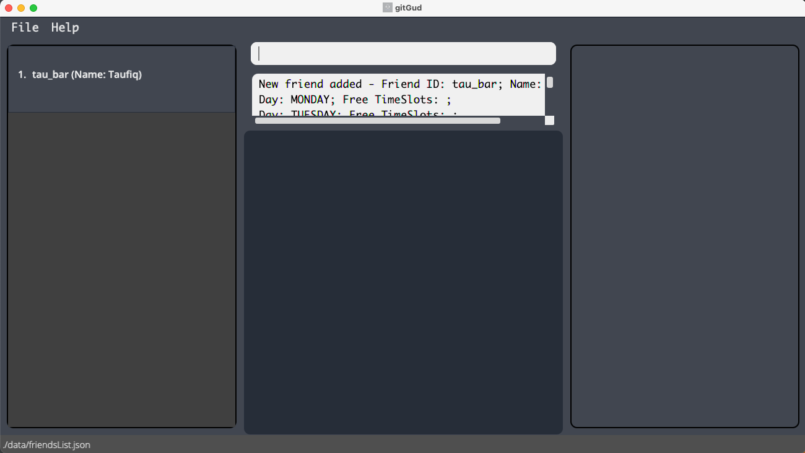
 <ins>gitGud after adding a friend</ins>

#### Editing a friend: `friend --edit` 

Updates the friend's name to a new name for an existing friend with the given `FRIEND_ID`. 

Format: `friend --edit FRIEND_ID -n NEW_NAME`

* The `FRIEND_ID` must currently exist in the friends list.

Examples: 
* `friend --edit Draco -n Kevin` Sets the name of existing friend with the `FRIEND_ID` "Draco" to "Kevin".

Snapshot: 
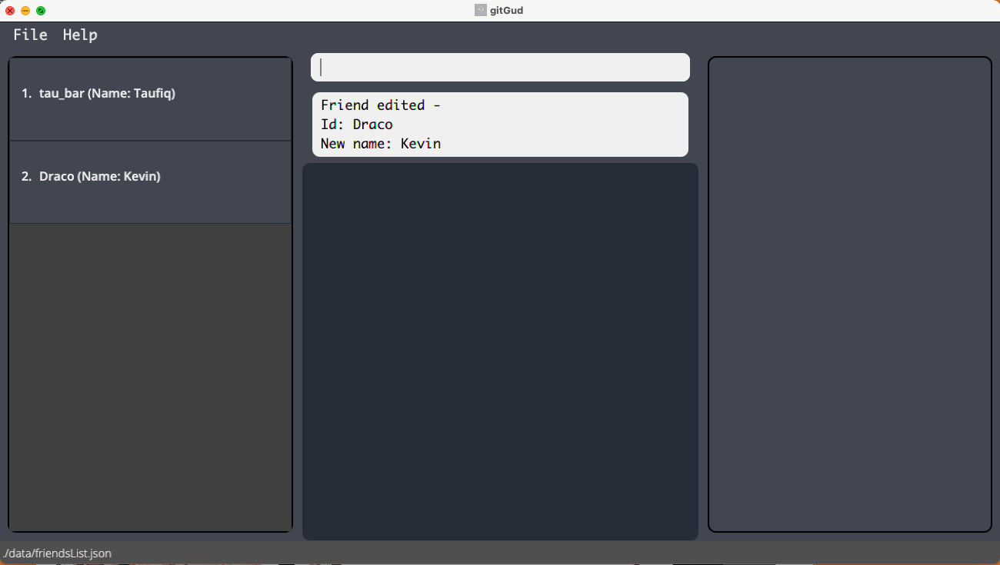
 <ins>gitGud after editing an existing friend's name</ins> 

#### Deleting a friend: `friend --delete`

Deletes a friend from gitGud’s friends list with the given `FRIEND_ID`.

Format: `friend --delete FRIEND_ID`

* The `FRIEND_ID` must currently exist in the friends list.

Examples:

* `friend --delete Draco` Deletes friend with gitGud `FRIEND_ID` of Draco and all their data from the friends list.

Snapshot:

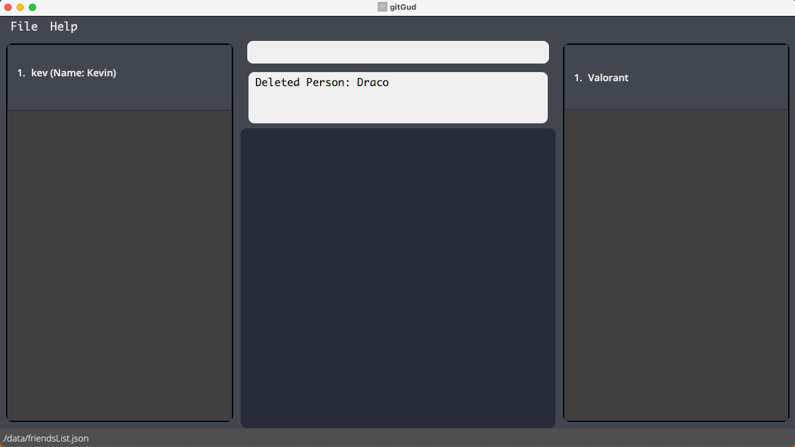
 <ins>gitGud after deleting a friend</ins>

#### Link games with a friend: `friend --link`

Links a game and the associated in-game username for the game to a friend with the provided `FRIEND_ID`.

A link between a particular friend and game shows that the friend plays the game. This association is required for subsequent commands, e.g. for the application to display all games that a friend plays or to recommend a friend to play with based on a particular game.

Format: `friend --link FRIEND_ID -g GAME_ID -u IN_GAME_USERNAME`

* Both `FRIEND_ID` and `GAME_ID` has to already be inside the friends and games list respectively.

Examples:
* `friend --link Draco -g DOTA -u Draco995`
  Links a single game, “DOTA” with the in-game username ‘Draco995’,
  to the friend with the gitGud `FRIEND_ID` ‘Draco’.

Snapshot:

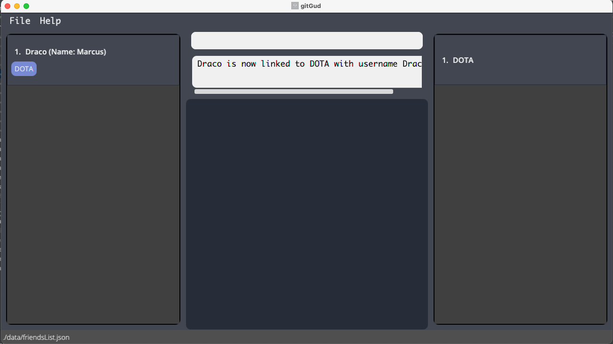
 <ins>gitGud after linking a friend to a game</ins>

#### Unlinking a game from a friend: `friend --unlink`

Removes the link between a friend and a game.

Format: `friend --unlink FRIEND_ID -g GAME_ID`

* `FRIEND_ID` has to already be inside the friends list.
* The friend has to be previously linked to the game with the provided `GAME_ID`.

Examples:
* `friend --unlink Draco -g DOTA` Removes the link between the friend with FRIEND_D 'Draco' and the game with `GAME_ID` 'DOTA'. 'Draco' is now no longer associated with 'DOTA'.

Snapshot:

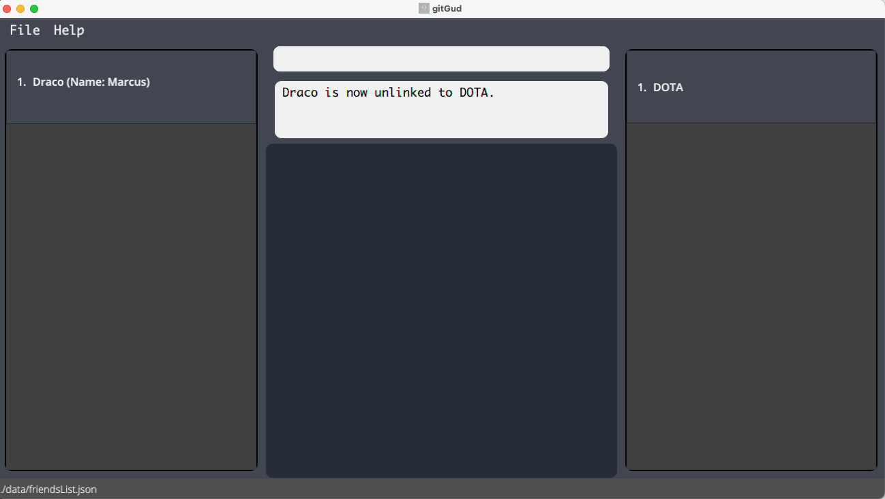
 <ins>gitGud after unlinking a friend from a game</ins>

#### Assigning a skill value for a linked game : `friend --skill`

Assigns the provided skill value to the friend with the given `FRIEND_ID` for the linked game with the given `GAME_ID`.
This command allows you to record your perceived gauge of a friend's skill level at a particular game. 

Format: `friend --skill FRIEND_ID -g GAME_ID -v SKILL_VALUE`

* A friend with the given `FRIEND_ID` provided must exist in the friends list.
* The friend has to be previously linked to the game with the given `GAME_ID`.
* The skill value assigned must be integers within the range 0 to 10 (inclusive). e.g. 0, 8 and 10 are valid skill levels,
  whereas -1, 11, 1.2, and "one" are invalid skill values.
 
Examples: 
* `friend --skill Draco -g Valorant -v 7` Sets the skill value for friend "Draco" for the linked game
"Valorant" to 7.
  
Snapshot:

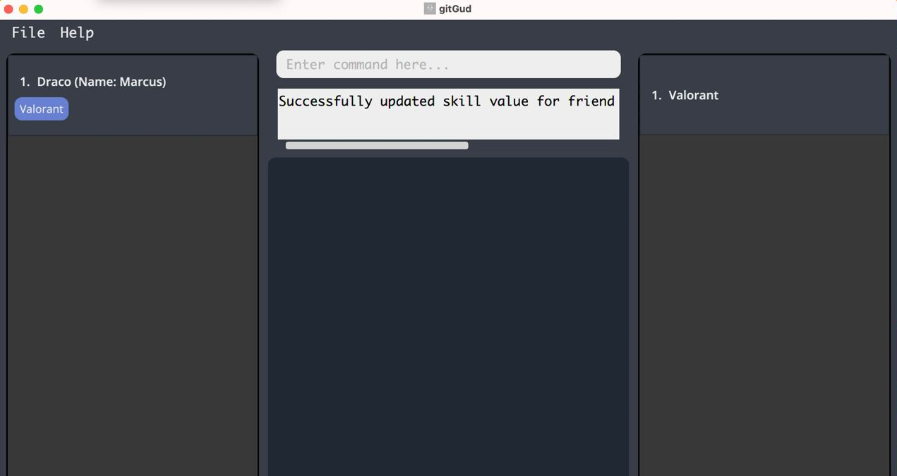
 <ins>gitGud after assigning skill value to game linked to friend</ins>

#### Scheduling a friend: `friend --schedule`

Schedules an existing friend by updating their schedule to indicate the time periods they are free or busy.
* gitGud stores a weekly schedule for each friend, from Monday to Sunday, with each day having 24 blocks of hours that can be marked as free or busy.
* The hourly blocks of time allows users to get an estimate of when their friends are free, allowing them to easily find common timeslots to play.

Format: `friend --schedule FRIEND_ID -p START_HOUR END_HOUR DAY -f IS_FREE`

**:information_source: Notes about the schedule:** 

New friends start off which a schedule with all periods marked as busy.

  

* `FRIEND_ID` must belong to an existing friend in gitGud.
* `START_HOUR` and `END_HOUR` must be an integer between 0 and 24 inclusive, and represents the hour of the day.
  * `END_HOUR` must be strictly after `START_HOUR`.
  * For example, `START_HOUR` = 2 and `END_HOUR` = 20 represents the time period from the 2nd to the 20th hour of the day.
* `DAY` must be an integer between 1 and 7 inclusive, with each day representing a day of the week from Monday to Sunday.
* `IS_FREE` is used to mark the period as a free or busy period, with `1` meaning free and `0` meaning busy.
* gitGud's UI displays the periods of time friends are free using the 24-hour notation.
  * The end of a day, midnight (12am) is displayed as 2400 to allow users to easily differentiate it from the start of the day, which is displayed as 0000.

Examples:
* `friend --schedule Draco -p 18 22 2 -f 1` Schedules "Draco" as free from 18th to 22nd hour, 1800 - 2200 on Tuesday.
* `friend --schedule Draco -p 12 24 7 -f 0` Schedules "Draco" as busy from 12th to 24th hour, 1200 - 2400 (midnight) on Sunday.

Snapshot:

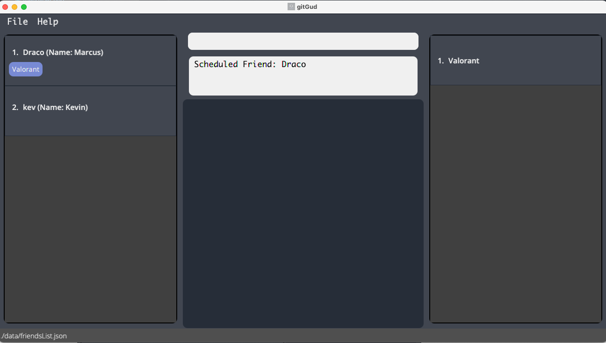
 <ins>gitGud after scheduling a friend's availability</ins>

#### Getting a single friend's complete data: `friend --get`

Displays a particular friend's complete data using gitGud’s **unique** friend identifier `FRIEND_ID`.

A friend's complete data includes:
* The weekly schedule of the friend
* List of games the friend plays
* In-game username for each game and the skill level in that game

Format: `friend --get FRIEND_ID`

* Gets the friend with the specified `FRIEND_ID`.
* The `FRIEND_ID` must currently exist in the friends list.

Examples:
* `friend --get Draco` Gets the complete data for friend "Draco"

Snapshot:

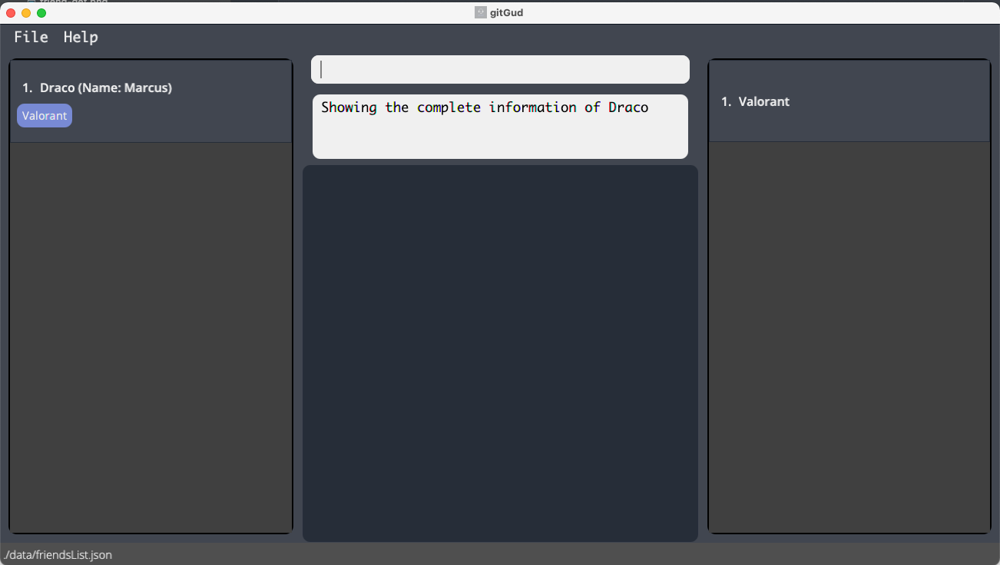
 <ins>gitGud after getting a friend from friends list</ins>

#### Listing/Filtering multiple friends data: `friend --list`

Lists all friends stored in gitGud whose friend id contains any of the given keywords.

Format: `friend --list [KEYWORD]`

* If `KEYWORD` is left empty, **all friends** stored in gitGud will be listed.
* The filter keyword is case insensitive e.g `Tau_bar` will match `tau_bar`.
* Only the `FRIEND_ID` of friends is filtered.
* Partial matches will be displayed e.g. `tau` will match `tau_bar`.

Examples:
* `friend --list` Lists all friends stored in gitGud.
* `friend --list ta` Lists all friends stored in gitGud that have `ta` in their `FRIEND_ID`.

Snapshot:

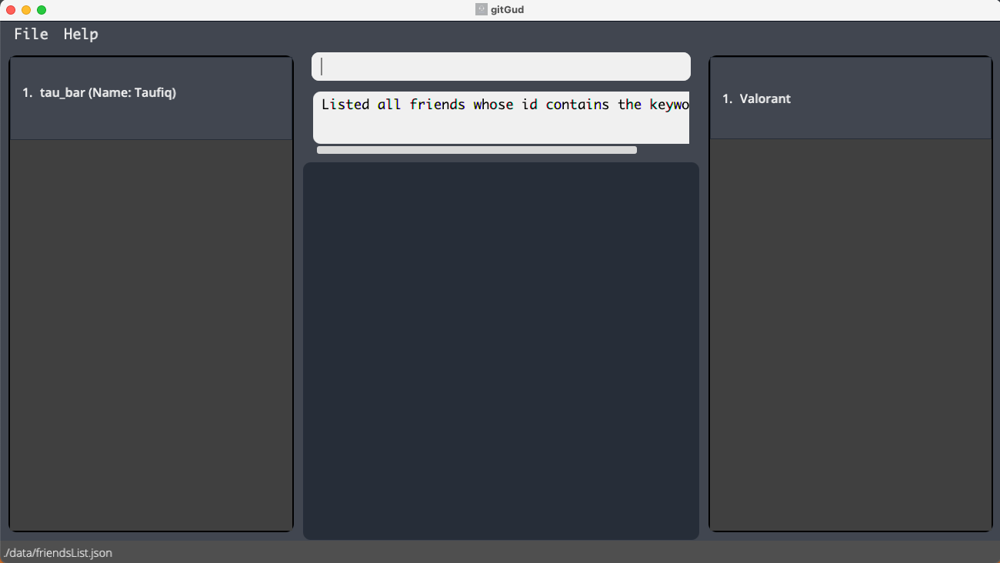
 <ins>gitGud after listing friends with the keyword</ins>

### Game commands

This section includes commands that help you manage the games you and your friends play, such as adding, deleting or 
viewing of games in your gitGud game list.

#### Adding a game: `game --add`

Adds a game with the given **unique** `GAME_ID` into the gitGud game list.

Format: `game --add GAME_ID`

* If the `GAME_ID` provided already exists, an error will be displayed. 
* The `GAME_ID` provided must be a single word e.g. `ApexLegends` and not `Apex Legends`.

Examples:
* `game --add Valorant` Adds a brand-new game into the game list with the **unique** `GAME_ID` 'Valorant'.

Snapshot:

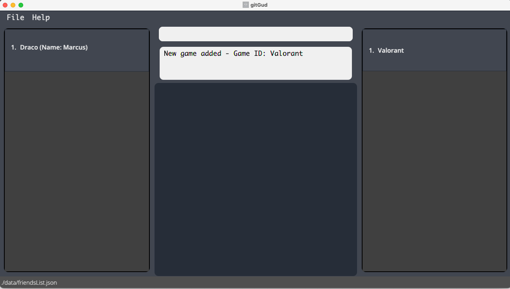
 <ins>gitGud after adding a game</ins>

#### Deleting a game: `game --delete`

Deletes a game from the gitGud game list.

Format: `game --delete GAME_ID`

Examples:
* `game --delete Valorant` Deletes the game record ‘Valorant’ from the game list if it exists.

Snapshot:

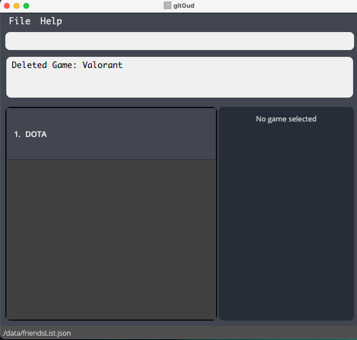
 <ins>gitGud after deleting a game</ins>

#### Getting a single game's complete data: `game --get`

Displays a particular game's complete data using gitGud’s **unique** game identifier `GAME_ID`.

A game's complete data includes:
* List of friends that play the game
* In-game username for each friend and their skill level

Format: `game --get GAME_ID`

* Gets the game with the specified `GAME_ID`.
* The `GAME_ID` must currently exist in the database

Examples:
* `game --get CSGO` Gets all the relevant information for the game "CSGO"

Snapshot:

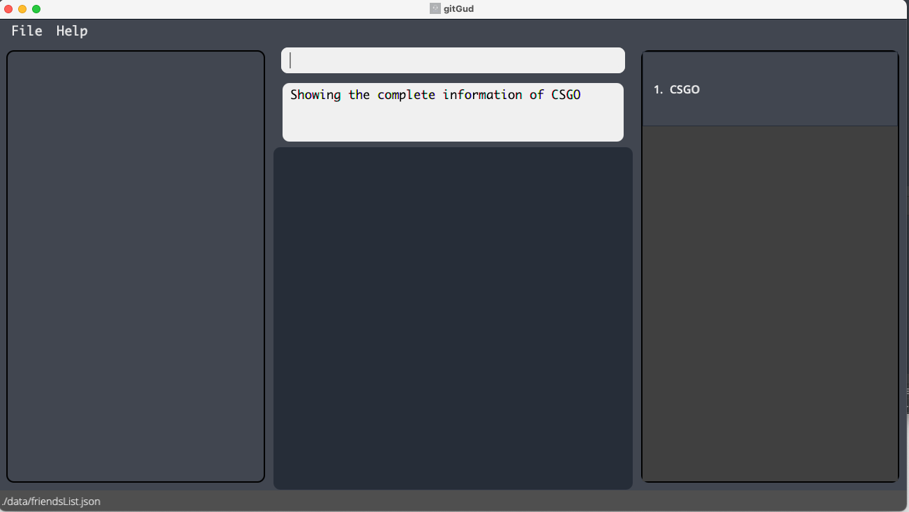
 <ins>gitGud after getting a game</ins>

#### Listing/Filtering multiple games data: `game --list`

Lists all games stored in gitGud whose game id contains any of the given keywords.

Format: `game --list [KEYWORD]`

* If `KEYWORD` is left empty, **all games** stored in gitGud will be listed.
* The filter keyword is case insensitive e.g `valorant` will match `Valorant`.
* Only the `GAME_ID` of games is filtered.
* Partial matches will be displayed e.g. `Valo` will match `Valorant`.

Examples:
* `game --list` Lists all games stored in gitGud.
* `game --list Valo` Lists all games stored in gitGud that have `Valo` in their `GAME_ID`.

Snapshot:

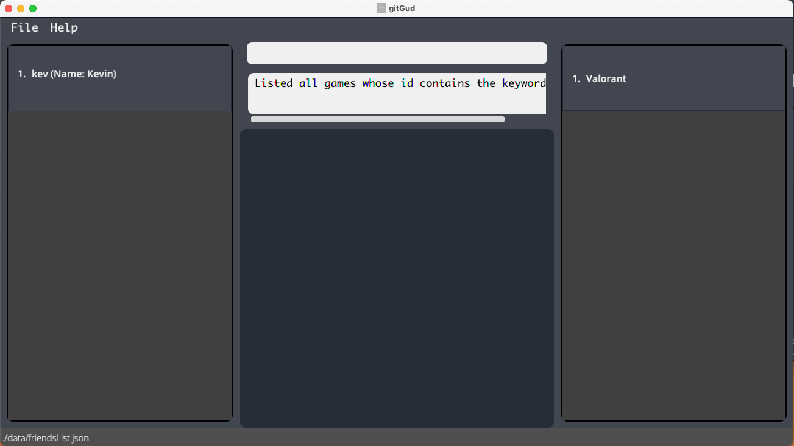
 <ins>gitGud after listing games with the keyword.</ins>

### Other commands

This section contains miscellaneous commands that may help improve your experience with gitGud.

#### Viewing help: `help`

Shows a message providing a link to the User Guide page.

Format: `help`

Snapshot:

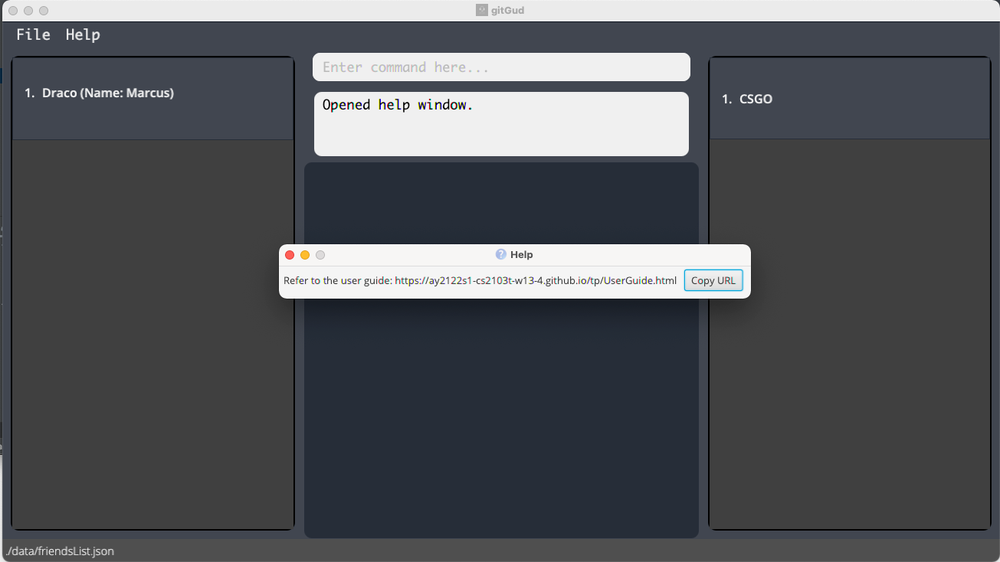
 <ins>gitGud after running help command</ins>

#### Clearing the friends and games lists : `clear`

Clears all friends and games from gitGud.

Format: `clear`

#### Exiting the program : `exit`

Exits gitGud.

Format: `exit`

--------------------------------------------------------------------------------------------------------------------

## FAQ

**Q**: How do I **_transfer_** my friends and games list data to another Computer running gitGud? 
**A**: Copy over the data folder (containing friendsList.json and gamesList.json) generated by gitGud on your current computer into the folder containing the 
gitGud.jar on the other computer.

--------------------------------------------------------------------------------------------------------------------

## Command summary

Action | Format, Examples
--------|------------------
**Add friend** | `friend --add FRIEND_ID [-n NAME]`   e.g., `friend --add Draco -n Marcus Tang`
**Edit friend**| `friend --edit FRIEND_ID -n NEW_NAME`   e.g., `friend --edit Draco -n Kevin` 
**Delete friend** | `friend --delete FRIEND_ID`  e.g., `friend --delete Draco`
**Link game and friend** | `friend --link FRIEND_ID -g GAME_ID -u IN_GAME_USERNAME`  e.g., `friend --link Draco -g Valorant -u taufiq007`
**Unlink game and friend** | `friend --unlink FRIEND_ID -g GAME_ID`   e.g., `friend --unlink Draco -g DOTA`
**Add skill value to linked game** | `friend --skill FRIEND_ID -g GAME_ID -v SKILL_VALUE`   e.g.,`friend --skill Draco -g Valorant -v 7`
**Schedule Friend** | `friend --schedule FRIEND_ID -p START_HOUR END_HOUR DAY -f IS_FREE`  e.g., `friend --schedule Draco -p 18 22 2 -f 1`
**Get friend** | `friend --get FRIEND_ID`  e.g., `friend --get Draco`
**List/Filter Friend** | `friend --list [KEYWORD]`  e.g., `friend --list`, `friend --list Tau`
**Add game** | `game --add GAME_ID`   e.g., `game --add Valorant`, `game --add ApexLegends` 
**Delete game** | `game --delete GAME_ID`   e.g., `game --delete Valorant`
**Get game** | `game --get GAME_ID`  e.g., `game --get Valorant`
**List/Filter Games** | `game --list [KEYWORD]`  e.g., `game --list`, `game --list Valorant`
**Viewing Help** | `help`
**Clearing friends and games lists** | `clear`
**Exit program** | `exit`

