# AniList V1.3

AniList is a desktop application made to be a single centralized location for anime lovers to keep track of all the animes they are interested in. In AniList, users will be able to keep track of animes that they are watching, wanting to watch or even animes that they have finished. Users will also be able to get statistics on their watching habits such as number of episodes watched and the genre distribution of their current list of animes.

AniList is optimized for use via a Command Line Interface (CLI) while still having the benefits of a customizable Graphical User Interface (GUI). If you are a fast typist, AniList can get your anime management tasks done FASTER than traditional GUI applications!

This User Guide is to be used by any AniList user. No technical background is required.

## Quick start
1. Ensure you have `Java 11` or later installed on your computer. ([install here](https://java.com/en/download/help/download_options.html))

2. Download the latest `anilist.jar` release [here](https://github.com/AY2122S1-CS2103T-T10-4/tp/releases).

3. Place the `anilist.jar` file into your desired *home folder* for AniList.

4. Double-click to launch the application. A window similar to the one shown below should appear shortly.

5. On first launch, AniList will contain sample data. Use the `clear` command to delete all current user data.

---

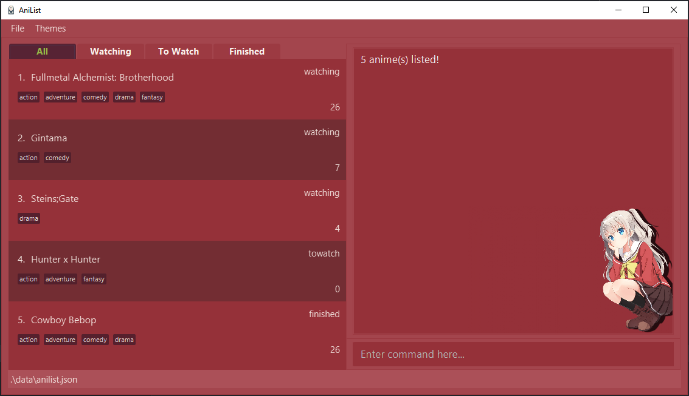

___

## GUI Breakdown

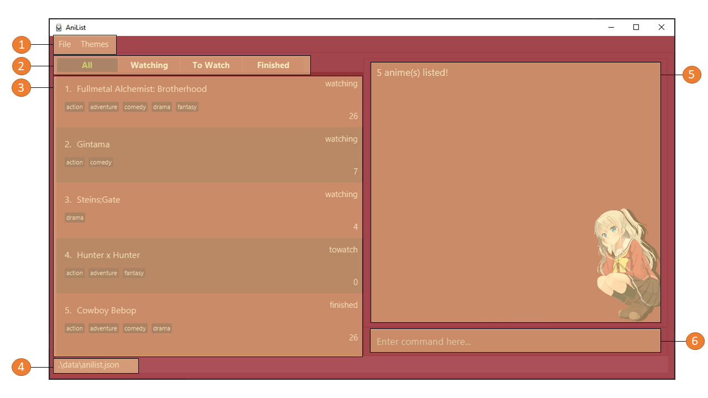

1. **Menu Bar:** Here the user have the option to Exit the application or to change the application theme.

2. **Tabs Bar:** Here the user can change the tabs to view their anime list filtered based on their watch status. (watching, towatch, finished)

3. **Anime List Panel:** The panel where all of the user's animes are listed. The order of listing is based on the time each entry was added.

4. **Save Location:** States the location in which the anime list file is saved in with respect to the location of the anilist.jar file.

5. **Command Result Panel:** This panel shows the result of the command based on user input in the Command Input Box.

6. **Command Input Box:** User inputs the desired command in this box and runs the command by pressing `enter`.

## Hot-Keys

AniList currently supports some hotkeys to allow for ease of use for CLI users.

* **Theme Switching:** `CTRL-T`. This will cycle through all the available themes.

Wonder Egg Priority Theme  |  Charlotte Theme
:-------------------------:|:-------------------------:
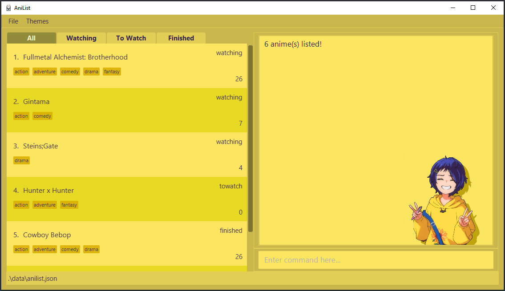  |  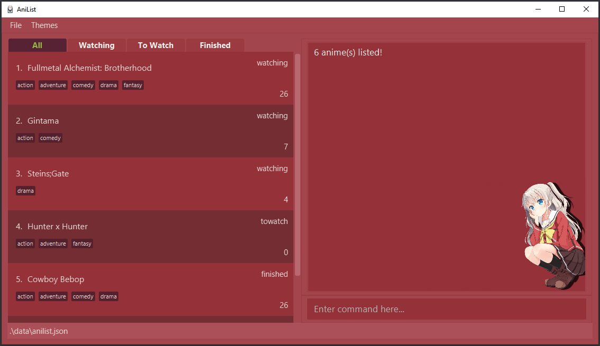

Squid Girl Theme           |  Dark Theme
:-------------------------:|:-------------------------:
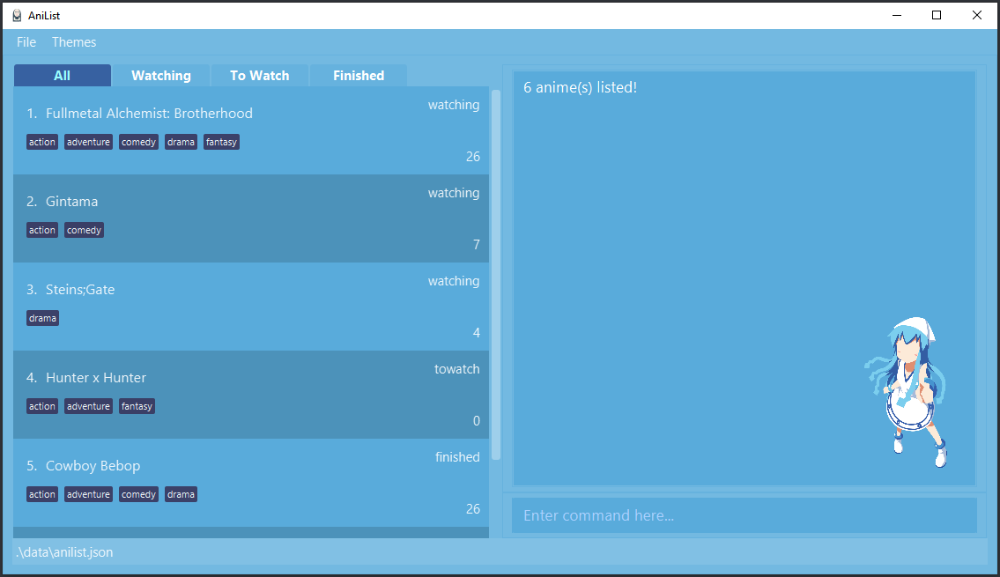  |  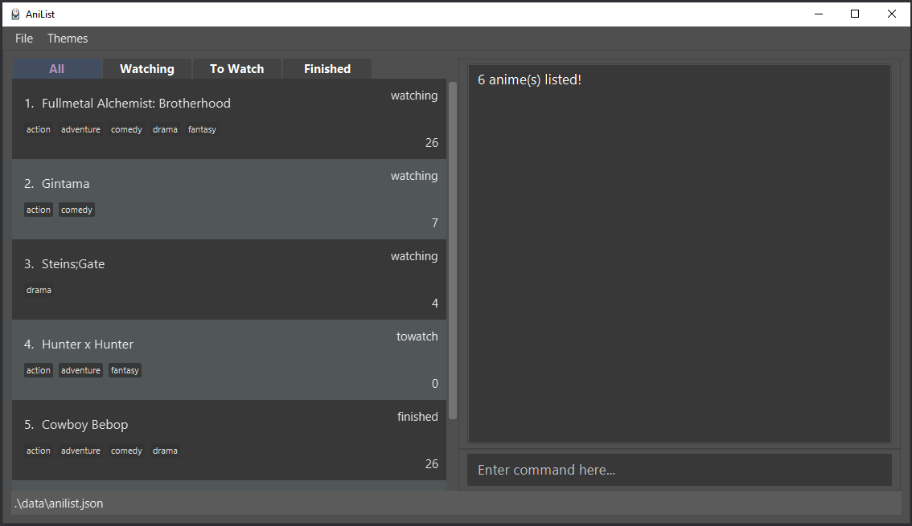

___

* **Tab Switching:** `CTRL-S` and `CTRL-D`. To cycle through the tabs to the right, use `CTRL-D`. To cycle through the tabs to the left, use `CTRL-S`.

All Tab  |  Watching Tab
:-------------------------:|:-------------------------:
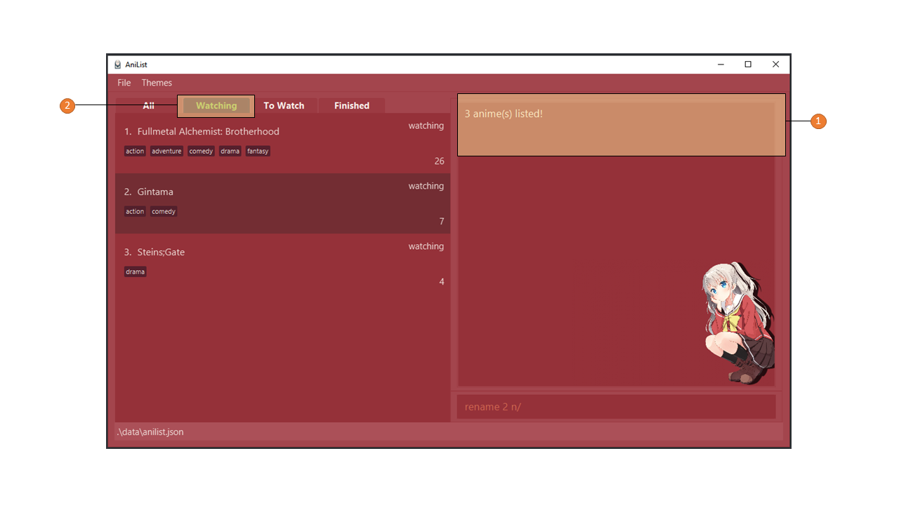  |  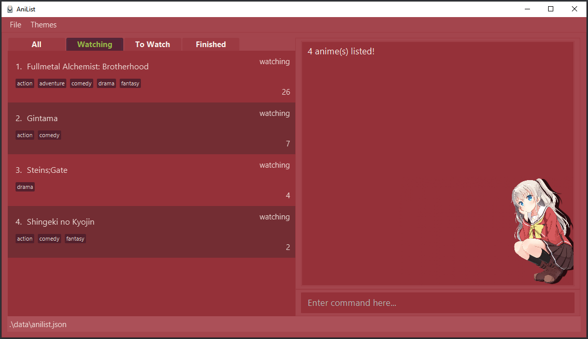

To Watch Tab           |  Finished Tab
:-------------------------:|:-------------------------:
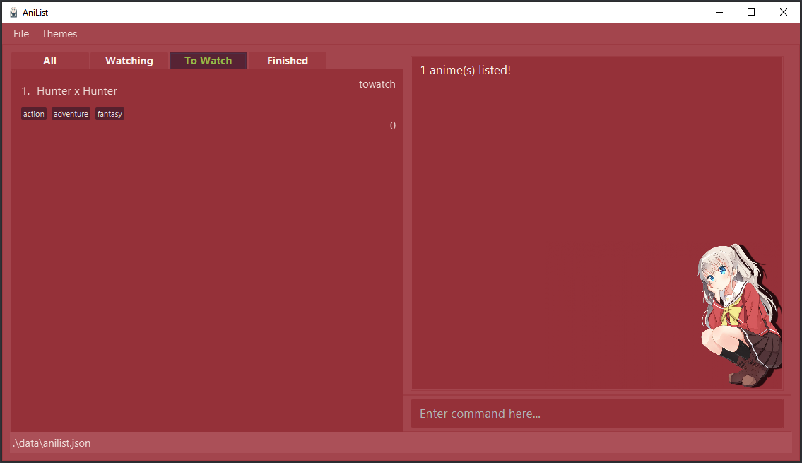  |  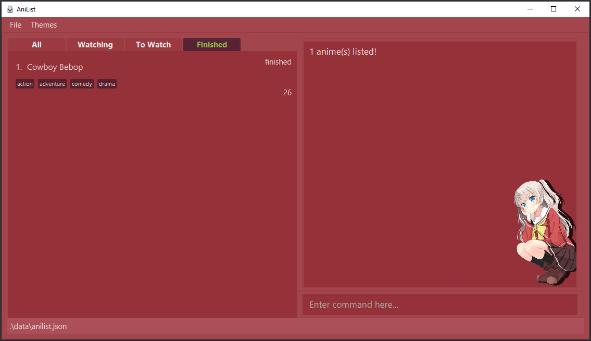

___
## Commands

**Notes about command format:**
* Words in UPPER_CASE are the specifications given by the user.
  e.g. in `add n/NAME`, NAME is the specification which can be used in in the form `add n/Doraemon`

* Items in square brackets are optional
  e.g. `add n/NAME [e/EPISODE]`. Both `add n/Naruto` and `add n/Naruto e/27` are considered valid commands.

### Adding an anime: `add`

Adds a user defined anime into the anime list.
Format: `add n/NAME [e/EPISODE] [s/STATUS] [g/GENRE1] [g/GENRE2] ...`

* `NAME` refers to the anime title
* `EPISODE` refers to the latest episode watched for the anime.
* `EPISODE` must be a non-negative integer `0, 1, 2 ...`
* `STATUS` refers to the watch status for the anime.
* `STATUS` are given in the form `towatch`, `watching`, `finished`, with `t`, `w`, `f`, as their short forms.
* `GENRE` refers to the genre to which the animes belong to.
* `GENRE` given must be from the list of available genres found in INSERT HOW TO FIND LIST HERE. Any number of genres can be provided for a single anime.

Example usages:
* `add n/Shingeki no Kyojin`
* `add n/Shingeki no Kyojin e/2`
* `add n/Shingeki no Kyojin s/w`
* `add n/Shingeki no Kyojin e/2 s/w g/fantasy`
* `add n/Shingeki no Kyojin e/2 s/w g/fantasy g/action g/comedy`

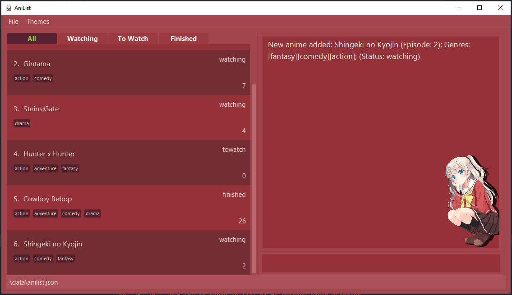

___

### Deleting an anime: `delete`

Deletes the user specified anime from the anime list if it exists.
Format: `delete INDEX`

* Deletes the anime at the specified `INDEX`
* The `INDEX` provided must be a positive integer `1, 2, 3...`

Example usages:
* `delete 1` deletes the first anime shown in the list.
* `delete 5` deletes the fifth anime shown on the list.

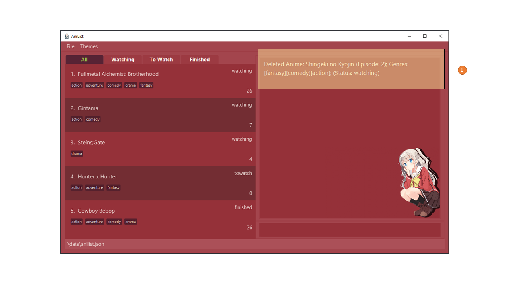

___

### Updating anime episode: `update`

Updates the episode that you are currently on for the user specified anime.
Format: `update INDEX e/NEWEPISODE`

* Updates the episode number of the anime at the specified `INDEX` to the `NEWEPISODE`.
* `NEWEPISODE`  must be a non-negative integer `0, 1, 2...`
* The `INDEX` provided must be a positive integer `1, 2, 3...`

Example usages:
* `update 1 e/3` updates the first anime to episode 3.
* `update 5 e/27` updates the fifth anime to episode 27.

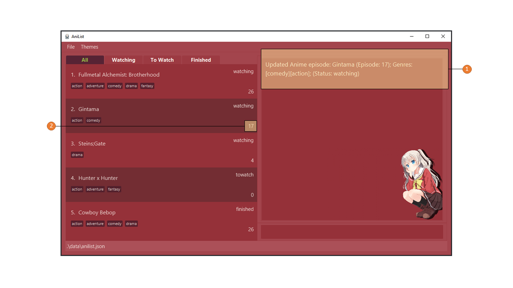

___

### Updating anime watch status: `status`

Updates the watch status of a specified anime.
Format: `status INDEX s/UPDATEDSTATUS`

* Updates the watch status of the anime at the specified `INDEX` to the `UPDATEDSTATUS`
* `UPDATEDSTATUS` must be in the form `towatch`, `watching`, `finished`.
* Shortforms to the keywords above are `t`, `w` and `f` respectively.
* The `INDEX` provided must be a positive integer `1, 2, 3...`

Example usages:
* `status 1 s/finished` updates the first anime to watch status `finished`.
* `status 5 s/watching` updates the fifth anime to watch status `watching`.
* `status 3 s/t` updates the third anime to watch status `towatch`

___

### Updating anime title: `rename`
Updates the anime title for the user specified anime.
Format: `rename INDEX n/NEWTITLE`

* Updates the anime title of the anime at the specified `INDEX` to the `NEWTITLE`
* `NEWTITLE` must only contain `ASCII` characters and cannot be empty
* The `INDEX` provided must be a positive integer `1, 2, 3...`

Example usages:
* `rename 1 n/Narutoo` updates the first anime title to Narutoo.
* `rename 1 n/Naruto: Shippuden` updates the first anime title to Naruto: Shippuden.

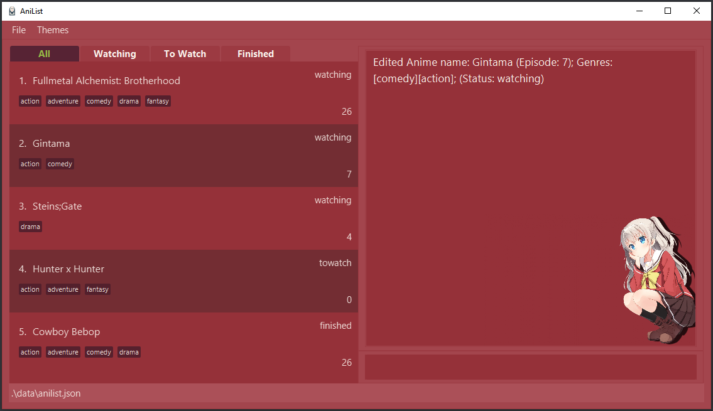
___

### Adding/ Deleting genre from anime: `genre`

Adds or deletes genre(s) from a specified anime 
Duplicate genres are not allowed 
Format: `genre INDEX c/ACTION g/GENRE [g/GENRE]`

* `ACTION` specifies whether you are adding or deleting genres
* Current list of available actions: `add`, `delete`
* `GENRE` can only contain alphabets and spaces. Two or more consecutive spaces are not allowed
* You need to provide at least 1 `GENRE`
* Updates the anime at the specified `INDEX`
* The index must be a positive integer 1, 2, 3, ...

Examples:
*  `genre 1 c/add g/shounen g/medieval fantasy g/isekai`
*  `genre 1 c/delete g/shounen g/medieval fantasy g/isekai`

___

### Listing anime based on watch status: `list`
Displays a list of animes that has been previously entered by the user based on their watch status.
Format: `list [s/STATUS]`

* If no `STATUS` is given, all animes will be listed.
* Displays the list of animes previously entered by the user based on their watch `STATUS`.
* `STATUS` must be in the form `towatch`, `watching`, `finished`.
* Shortforms to the keywords above are `t`, `w` and `f` respectively.

Example usages:
* `list` displays all the anime in the list panel.
* `list s/watching` displays all the anime with the watch status `watching`
* `list s/finished` displays all the anime with the watch status `finished`
* `list s/t` displays all the anime with the watch status `towatch`

___

### Clearing all user data: `clear`
Deletes **ALL** user data in the current displayed list. Upon execution of clear command, the anime list of the active tab will be empty.
Format: `clear`

* Only animes from the current active tab will be deleted.
* User will be prompted to key in the `clear` command once again upon first execution of `clear`.
* Only on the second confirmation will the desired anime data be deleted.

Example usages:
* `clear` user will be prompted for a comfirmation `clear` command.
* `clear` on second clear command all data of the active tab will be deleted.

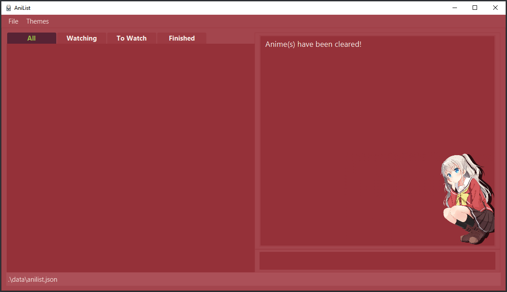

___

### Viewing all supported commands: `help`
Lists all currently supported commands on the Command Results panel.
Format: `help`

Example usages:
* `help` displays all currently supported commands of AniList

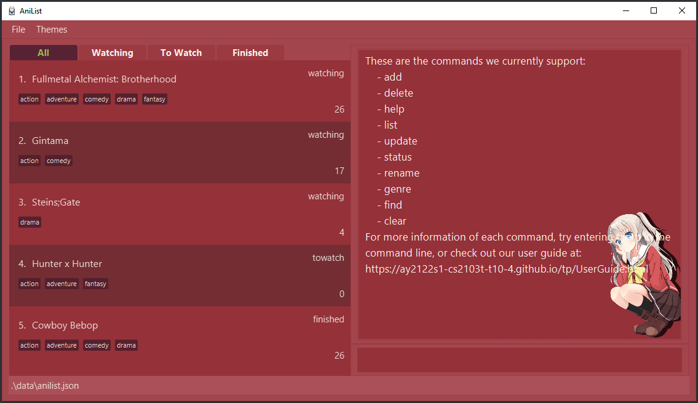

___

## Commands Table

| Command | Usage |
| :--------: | -------- |
| add     | Text     |
| delete     | Text     |
| update     | Text     |
| status     | Text     |
| rename     | Text     |
| genre     | Text     |
| genrelist | Text    |
| list     | Text     |
| clear    | Text     |
| help     | Text     |

## Glossary
