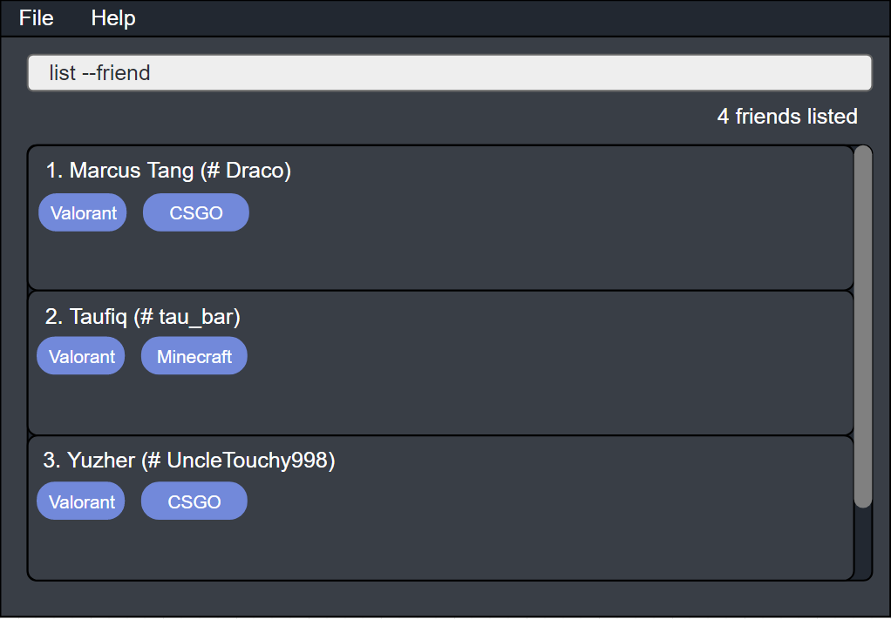
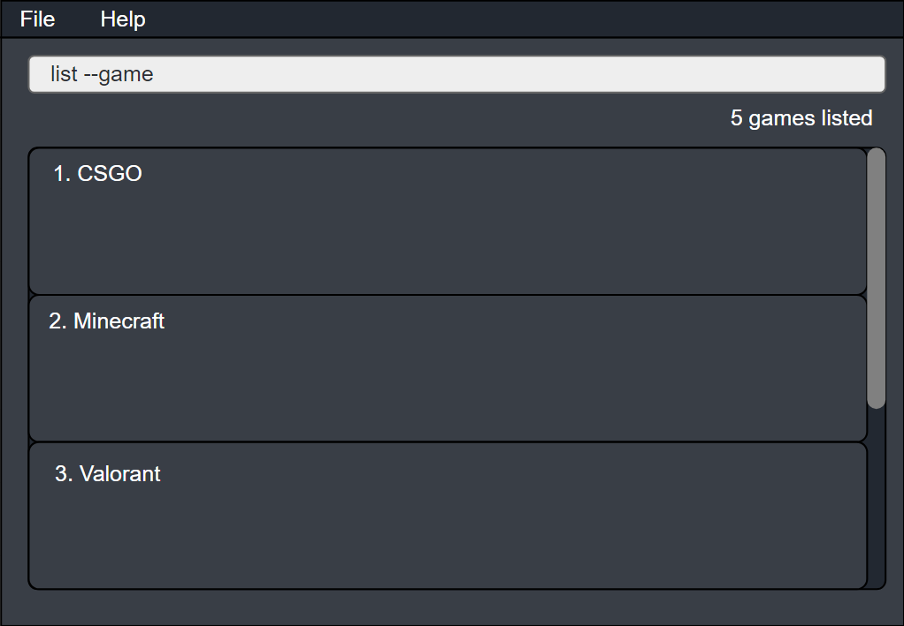

gitGud is a **desktop application for managing friends' gaming information**. gitGud uses a simple **Graphical User Interface 
(GUI) combined with an optimized Command Line Interface (CLI)** to give you a smooth and efficient experience. If you can 
type fast enough, gitGud can get you contact management tasks done faster than traditional GUI-based applications.

* Table of Contents
  {:toc}

--------------------------------------------------------------------------------------------------------------------

## Quick start

1. Ensure you have Java `11` or above installed in your Computer.

2. Download the latest `gitgud.jar` from [here](https://github.com/AY2122S1-CS2103T-W13-4/tp/releases).

3. Copy the file to the folder you want to use as the _home folder_ for your gitGud application.

4. Double-click the file to start the app. The GUI similar to the below should appear in a few seconds. Note how the app contains some sample data. 
   

5. Type the command in the command box and press `Enter` to execute it. e.g. typing **`help`** and pressing `Enter` will open the help window. 
   Some example commands you can try:

   * **`list --friend`** : Lists all friends.

   * **`friend`**`Draco --name Marcus` : Adds a friend __Marcus__ with gitGud FRIEND_ID of __Draco__ to the application.

   * **`friend --delete`**`Draco` : Deletes friend with gitGud FRIEND_ID of __Draco__.

   * **`exit`** : Exits the app.

6. Refer to the [Features](#features) below for details of each command.

--------------------------------------------------------------------------------------------------------------------

## Features

**:information_source: Notes about the command format:** 

* Words in `UPPER_CASE` are the parameters to be supplied by the user. 
  e.g. in `get --game GAME_NAME`, `GAME_NAME` is a parameter which can be used as `get --game CSGO`.

* Items in square brackets are optional. 
  e.g `friend FRIEND_ID [--name NAME]` can be used as `friend Draco --name “Marcus Tang”` or as `friend Draco`.

* Items with `…` after them can be used one or more times. 
  e.g. `GAME_NAME:IN_GAME_USERNAME…` can be used as `Valorant:biscuitismydog`, `Valorant:biscuitismydog Minecraft:Draco` etc.

* If a parameter is expected only once in the command, but you specified it multiple times, only the last occurrence of the parameter will be taken. 
  e.g. if you specify `--name “Marcus Tang” --name Taufiq`, only `--name Taufiq` will be taken.

* If a name provided has spaces in-between, use double quotation marks to wrap the name in the command e.g. wrap the name
  'Apex Legends' as `"Apex Legends"`.

### Viewing help: `help`

Shows a message explaning how to access the help page.

Format: `help`

### Adding a friend: `friend --add`

Adds a new friend to gitGud friend’s list with an associated **unique** friend identifier.

Format: `friend -add FRIEND_ID [--name NAME]`

Examples:
* `friend --add Draco` Adds a brand-new friend into the friends list with the identifier 'Draco' and
  which does not currently have an associated real-life name.
* `friend --add tau_bar --name Taufiq` Adds a brand-new friend into the friends list with the identifier 'tau-bar' and
  has the real-life name 'Taufiq'.

### Deleting a friend: `friend --delete`

Deletes a friend from gitGud’s friend’s list using gitGud’s unique friend identifier.

Format: `friend --delete FRIEND_ID`

* Deletes the person with the specified `FRIEND_ID`.
* The `FRIEND_ID` must currently exist in the database.

Examples:
* `friend --delete Draco` Deletes friend with gitGud FRIEND_ID of Draco and all their data from the database

### Adding a game: `game --add`

Adds a game with the given **unique** GAME_ID into the gitGud game list.

Format: `game --add GAME_ID`

* If the GAME_ID provided already exists, an error will be displayed. 
* The GAME_ID provided must be a single word e.g. `ApexLegends` and not `Apex Legends`.

Examples:
* `game --add Valorant` Adds a brand-new game into the game list with the unique GAME_ID 'Valorant'.

### Deleting a game: `game --delete`

Deletes a game from the gitGud game list.

Format: `game --delete GAME_NAME`

Examples:
* `game --delete Valorant` Deletes the game record ‘Valorant’ from the game list if it exists.

### Link games with a friend: `link`

Links game(s) and the associated in-game username(s) for each game to a friend for the provided gitGud FRIEND_ID to
his/her friend information.

Format: `link FRIEND_ID GAME_NAME:IN_GAME_USERNAME1 GAME2_NAME:IN_GAME_USERNAME2...`

* Add multiple games and in-game usernames for a friend by listing the game:in-game-username pairs separated by a space.
* For game names or in-game usernames with spaces in-between, wrap the name string with double quotation marks.
  For example, the game 'Apex Legends' linked to an in-game username 'tau-bar' would be represented as the pair
  `"Apex Legends":tau-bar`.

Examples:
* `link Draco Valorant:biscuitismydog Minecraft:Draco`
  Links two games, ‘Valorant’ with the in-game username ‘biscuitismydog’ and ‘Minecraft’ with the
  in-game username ‘Draco’, to the friend with the gitGud FRIEND_ID ‘Draco’.
* `link tau-bar “Apex Legends”:tau-dominator`
  Links a single game, “Apex Legends” with the in-game username ‘tau-dominator’,
  to the friend with the gitGud FRIEND_ID ‘tau-bar’.

### Listing multiple friends data: `list --friend`

Lists all friends stored in gitGud whose friend id contains any of the given keywords.

Format: `list [--friend [KEYWORD]]`

* The `--friend` flag is optional, if no flag is added or if `KEYWORD` is left empty, all friends stored in gitGud will be listed
* The filter keyword is case insensitive e.g `Tau_bar` will match `tau_bar`
* Only the `FRIEND_ID` of friends is filtered
* Partial matches will be displayed e.g. `tau` will match `tau_bar`

Examples:
* `list` or  `list --friend` Lists all friends stored in gitGud
* `list --friend ta` Lists all friends stored in gitGud that have `ta` in their name

### Listing multiple games data: `list --game`

Lists all games stored in gitGud whose friend id contains any of the given keywords.

Format: `list --game [KEYWORD]`

* If `KEYWORD` is left empty, all games stored in gitGud will be listed
* The filter keyword is case insensitive e.g `valorant` will match `Valorant`
* Only the `GAME_NAME` of games is filtered
* Partial matches will be displayed e.g. `Valo` will match `Valorant`

Examples:
* `list --game` Lists all games stored in gitGud
* `list --game Valo` Lists all friends stored in gitGud that have `Valo` in their name

### Getting a single friend's complete data: `get --friend`

Takes a look at a particular friend's complete data by searching their `FRIEND_ID`. A friend's complete data includes:
* List of games the friend plays
* In-game username for each game

Format: `get [--friend] FRIEND_ID`
* The `FRIEND_ID` must currently exist in the database

Examples:
* `get --friend Draco` Gets the complete data for friend "Draco", which includes the list of games he plays and his username for each game
* `get kev` Gets the complete data for friend "kev"

### Getting a single game's complete data: `get --game`

Gets all the relevant information for a game that was previously added, this includes:
* All the friends (represented by their `FRIEND_ID`) that play the game

Format: `get --game GAME_NAME`
* The `GAME_NAME` must currently exist in the database

Examples:
* `get --game CSGO` Gets all the relevant information for the game "CSGO". This includes all the friends in your database that play the game

--------------------------------------------------------------------------------------------------------------------

## FAQ

**Q**: How do I **_transfer_** my data to another Computer? 
**A**: Install the app in the other computer and overwrite the empty data file it creates with the file that contains the data of your previous AddressBook home folder.

**Q**: What happens if I add _**multiple flags**_ that clash? e.g. `list --friend tau --game Val`  
**A**: Only the first valid flag is taken and subsequent flags will be ignored.

**Q**: How do I _**update**_ a friend’s data that is already on the database? 
**A**: You can delete the friend and then add the friend with the new data.

--------------------------------------------------------------------------------------------------------------------

## Command summary

Action | Format, Examples
--------|------------------
**Viewing Help** | `help`
**Add friend** | `friend --add FRIEND_ID [--name "NAME"]`   e.g., `friend --add Draco --name "Marcus Tang"`
**Delete friend** | `friend --delete FRIEND_ID`  e.g., `friend --delete Draco`
**Add game** | `game --add GAME_NAME`   e.g., `game --add Valorant`, `game --add ApexLegends` 
**Delete game** | `game --delete GAME_NAME`   e.g., `game --delete Valorant`
**Link game and friend** | `link FRIEND_ID “GAME_NAME”:”IN_GAME_USERNAME”…`  e.g., `link tau_bar “Apex Legends”:taufiq007 Minecraft:taufMC`
**List Friend** | `list [--friend [KEYWORD]]`  e.g., `list`, `list --friend`, `list --friend Tau`
**List Games** | `list --game [KEYWORD]`  e.g., `list --game`, `list --game Valorant`
**Get friend** | `get --friend FRIEND_ID`  e.g., `get --friend Draco`
**Get game** | `get --game GAME_NAME`  e.g., `get --game Valorant`

