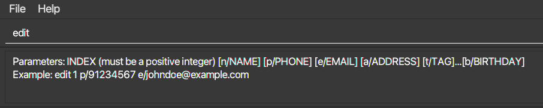
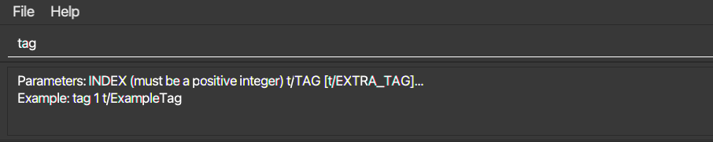
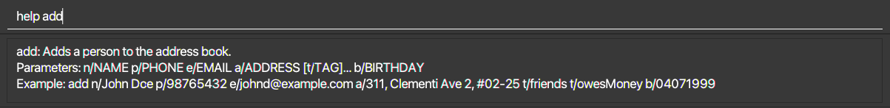

CONNECTIONS is a **desktop app for managing contacts, optimized for use via a Command Line Interface (CLI)** while still having the benefits of a Graphical User Interface (GUI). If you can type fast, CONNECTIONS can get your contact management tasks done faster than traditional GUI apps.

* [Quick Start](#quick-start)
* [Features](#features)
  * [Upcoming birthdays](#upcoming-birthdays)
  * [Command Assistant](#command-assistant)
  * [Command History](#command-history)
  * [Commands](#commands)
    * [Viewing help : `help`](#viewing-help--help)
    * [Adding a contact: `add`](#adding-a-contact-add)
    * [Listing all contacts : `list`](#listing-all-contacts--list)
    * [Editing a contact : `edit`](#editing-a-contact--edit)
    * [Adding Tags : `tag`](#adding-tags--tag)
    * [Removing Tags : `untag`](#removing-tags--untag)
    * [Locating contacts by name and tag(s): `find`](#locating-contacts-by-name-and-tags-find)
    * [Locating contacts by name or tag(s): `findAny`](#locating-contacts-by-name-or-tags-findany)
    * [Pinning a contact: `pin`](#pinning-a-contact--pin)
    * [Unpinning a contact: `unpin`](#unpinning-a-contact--unpin)
    * [Deleting a contact : `delete`](#deleting-a-contact--delete)
    * [Deleting multiple contact : `deletem`](#deleting-multiple-contacts--deletem)
    * [Exporting a mailing list of contacts: `mailingList`](#exporting-a-mailing-list-of-contacts--mailinglist)
    * [Clearing all entries : `clear`](#clearing-all-entries--clear)
    * [Exiting the program : `exit`](#exiting-the-program--exit)
* [FAQ](#faq)
* [Command Summary](#command-summary)

--------------------------------------------------------------------------------------------------------------------

## Quick start

1. Ensure you have Java `11` or above installed on your computer.

1. Download the latest `CONNECTIONS.jar` from [here](https://github.com/AY2122S1-CS2103-F09-4/tp/releases).

1. Copy the file to the folder you want to use as the _home directory_ for your CONNECTIONS.

1. Double-click the file to start the app. The GUI similar to the below should appear in a few seconds. Note how the app contains some sample data. 
   

1. Type the command in the command box and press Enter to execute it. e.g. typing **`help`** and pressing Enter will show a list of commands that CONNECTIONS supports. 
   Click [here](#command-summary) for a summary of example commands you can try!

1. Refer to the [Features](#features) below for details of each command.

--------------------------------------------------------------------------------------------------------------------

## Features

**:information_source: Notes about the command format:** 

* Words in `UPPER_CASE` are the parameters to be supplied by the user. 
  e.g. in `add n/NAME`, `NAME` is a parameter which can be used as `add n/John Doe`.

* Items in square brackets are optional. 
  e.g. `n/NAME [t/TAG]` can be used as `n/John Doe t/friend` or as `n/John Doe`.

* Items with `…`​ after them can be used multiple times including zero times. 
  e.g. `[t/TAG]…​` can be used as ` ` (i.e. 0 times), `t/friend`, `t/friend t/family` etc.

* Parameters can be in any order. 
  e.g. if the command specifies `n/NAME p/PHONE_NUMBER`, `p/PHONE_NUMBER n/NAME` is also acceptable.

* If a parameter is expected only once in the command, but you specified it multiple times, only the last occurrence of the parameter will be taken. 
  e.g. if you specify `p/12341234 p/56785678`, only `p/56785678` will be taken.

* Extraneous parameters for commands that do not take in parameters (such as `list`, `exit` and `clear`) will be ignored. 
  e.g. `list 123` will be interpreted as `list`.

* Phone numbers can be of any length, but can only contain numerical digits.

* Command words are case-sensitive. e.g. `findany` will not be interpreted as `findAny`.

### Upcoming Birthdays
The vertical tab provides upcoming birthdays at a glance.  
It sorts all birthdays amongst all contacts in CONNECTIONS **chronologically**, with the **nearest** upcoming birthday at the **top**.

* Contacts colour-coded in **GREEN** are celebrating their birthdays **today**.
* Contacts colour-coded in **BLUE** will be celebrating their birthdays in **a week or less**.
* The rest of the entries will not be colour-coded.  
    

### Command Assistant

Shows command format and example as the command is entered.

#### Sample Usage:

* `edit` is entered in the command box.
  * CONNECTIONS shows command format and sample for `edit`.
    

* `tag` is entered in the command box.
  * CONNECTIONS shows command format and sample for `tag`.
  

### Command History

View and use previously called commands.

Notes:
* Only commands that have been used in the current program run can be viewed. Commands used in previous runs are not stored.

#### Sample Usage:
* Up Arrow
  * Shows the previous command called in the command box.
  * If there are no previous commands, an empty command box is shown.
  * If the earliest command is shown, earliest command will continue to be shown.
* Down Arrow
  * Shows the next command called in the command box.
  * If there are no later commands, an empty command box is shown.

--------------------------------------------------------------------------------------------------------------------

## Commands

### Viewing help : `help`

Shows a help message that explains the purpose and method of usage for each command.

#### Format:
* `help` - List out all available commands.
* `help COMMAND` - Shows help message for the command specified.

Notes:
* Use the command `help more` to open a link to the documentation.

**Sample Usage:**

* `help`
  * Shows all available commands.
  
* `help add`
  * Shows help message for `add`.
  
* `help more`
  * Opens a link to the documentation.
  

### Adding a contact: `add`

Adds a contact to CONNECTIONS.

#### Format:
* `add n/NAME p/PHONE_NUMBER e/EMAIL a/ADDRESS [b/BIRTHDAY] [t/TAG]…​`

:bulb: **Tip:**
A contact can have any number of tags (including 0).

:bulb: **Tip:**
Format birthday as `ddMMyyyy`.

Notes:
* Phone numbers must be unique and must contain only numbers.
* Emails must contain @. (Valid emails that violate convention are accepted as well)
* Birthdays are optional and can be added to existing contacts using the `edit` command.
* Future dates are not allowed as birthdays.
* Tag names are limited to 60 characters.

**Sample Usage:**
* `add n/John Doe p/98765432 e/johnd@example.com a/John street, block 123, #01-01`
* `add n/Betsy Crowe t/friend e/betsycrowe@example.com a/Newgate Prison b/25121999 p/1234567 t/criminal`

### Listing all contacts : `list`

Shows a list of all contacts in CONNECTIONS.

#### Format:
* `list`

### Editing a contact : `edit`

Edits an existing contact in CONNECTIONS.

#### Format:
* `edit INDEX [n/NAME] [p/PHONE] [e/EMAIL] [a/ADDRESS] [b/BIRTHDAY] [t/TAG]…​`

Notes:
* Edits the contact at the specified `INDEX`. The index refers to the index number shown in the displayed contact list. The index **must be a positive integer** 1, 2, 3, …​
* There must be at least one of the optional fields provided alongside the edit command.
* Existing values will be updated to the input values.
* The existing set of tags that belongs to a contact will be updated to the new set of tags inputted. i.e. The edits made to a set of tags are not cumulative.
* You can remove all tags of a particular contact using `edit INDEX t/` (without providing anything after `t/`).

**Sample Usage:**
* `edit 1 p/91234567 e/johndoe@example.com`
  * Edits the phone number and email address of the 1st contact in the displayed contact list to be `91234567` and `johndoe@example.com`, respectively.
* `edit 2 n/Betsy Crower t/`
  * Edits the name of the 2nd contact in the displayed contact list to be `Betsy Crower` and clears all existing tags.

### Adding Tags : `tag`

Adds one or more tags to an existing contact in CONNECTIONS.

#### Format:
* `tag INDEX t/TAG [t/MORE_TAGS]…​`

Notes:
* Adds tag(s) to the contact at the specified `INDEX`. The index refers to the index number shown in the displayed contact list. The index **must be a positive integer** 1, 2, 3, …​
* New tags are added on top of existing tags i.e., tags added are cumulative.
* Adding new tags which already exist will succeed with a warning letting you know that the contact already had those tags.
* Tags have a character limit of 60.

**Sample Usage:**
* `tag 2 t/friend t/NUS`
    * Adds the tags `friend` and `NUS` to the 2nd contact.

### Removing Tags : `untag`

Removes one or more existing tags from an existing contact in CONNECTIONS.

#### Format:
* `untag INDEX t/TAG [t/MORE_TAGS]…​`

Notes:
* Remove tags from the contact at the specified `INDEX`. The index refers to the index number shown in the displayed contact list. The index **must be a positive integer** 1, 2, 3, …​
* Only tags that exist will be removed.
* CONNECTIONS displays a warning and will not remove any tags if the user tries to remove a non-existent tag.

**Sample Usage:**
* `untag 2 t/friend t/NUS`
    * Removes the tags `friend` and `NUS` from the 2nd contact.

### Locating contacts by name(s) and tag(s): `find`

Finds all contacts who match **ALL** name and tag keywords provided.

#### Format:
* `find [c/] [n/NAME] …​ [t/TAG] …​`
  * Note that `find` must have at least one `[n/NAME]` or `[t/TAG]`.

Notes:  
* `find` is case-insensitive for names. e.g. `find n/hans` will match contacts named `Hans`.  
* `find` is case-insensitive for tags by default. e.g. `find t/friend` will match a contact with tags `Friend` or `friend`.  
  * Adding the `c/` flag **after** the command word will make tag matching case-sensitive.  
    e.g. `find c/ t/friend` will match a contact with tag `friend` but not `Friend`.
* The order of the keywords does not matter. e.g. `find n/Hans t/football` will return the same result as `find  t/football n/Hans`.
* Only full words will be matched for names and tags.  
  * `find n/an` will not return `Hans`, but will return `Jing An`.  
* Only contacts that matched all keywords provided will be returned as search results (i.e. `AND` search).  
  e.g. `find n/Hans t/Friend` will return all contacts with names containing the word `Hans` and are tagged with `Friend`.

**Sample Usage:**
* `find n/John`
  * returns `john` and `John Doe`.
    
* `find n/alex t/football t/classmate`
  * returns `Alex Yeoh`, who has both `football` and `classmates` tag. 
    
* `find c/ t/FRIENDS`
  * returns `Shin`, who is tagged with `FRIENDS`.
    

### Locating contacts by name(s) or tag(s): `findAny`

Finds all contacts who match **ANY** name and tag keywords provided.

#### Format:
* `findAny [c/] [n/NAME] …​ [t/TAG] …​`
  * Note that `findAny` must have at least one `[n/NAME]` or `[t/TAG]`.

Notes:
* `findAny` is case-insensitive for names. e.g. `findAny n/hans` will match contacts named `Hans`.
* `findAny` is case-insensitive for tags by default. e.g. `findAny t/friend` will match a contact with tags `Friend` or `friend`.
  * Adding the `c/` flag **after** the command word will make tag matching case-sensitive.  
    e.g. `findAny c/ t/friend` will match a contact with tag `friend` but not `Friend`.
* The order of the keywords does not matter. e.g. `findAny n/Hans t/football` will return the same result as `findAny t/football n/Hans`.
* Only full words will be matched for names and tags.
  * `findAny n/an` will not return `Hans`, but will return `Jing An`.
* Only contacts that match at least one of the keywords provided will be returned as search results (i.e., `OR` search)
  e.g. `findAny n/Hans t/Friend` will return all contacts with names containing the word `Hans` or are tagged with `Friend`.

**Sample Usage:**
* `findAny n/John`
  * returns `john` and `John Doe`.
    
* `findAny n/alex n/irfan t/chef`
  * returns `Alex Yeoh`, `Irfan Ibrahim`, `Carol` who is tagged with `chef`. 
    
* `findAny c/ n/Shin t/FRIENDS t/chef`
  * returns `Shin` who is tagged with `FRIENDS`, as well as `Carol` who is tagged with `chef`.
    

### Pinning a contact : `pin`

Pins a contact to the top of the contact list. 

#### Format: 
* `pin INDEX`
  
Notes:
* Pins the contact at the specified `INDEX`.
* The index refers to the index number shown in the displayed contact list.
* The index **must be a positive integer** 1, 2, 3, …​

**Sample Usage:**
* `list` followed by `pin 2`
  * pins the 2nd contact in CONNECTIONS.
* `find n/Betsy` followed by `pin 1`
  * pins the 1st contact in the results of the `find` command.

### Unpinning a contact : `unpin`

Unpins a contact.

#### Format:
* `unpin INDEX`
  
Notes:
* Unpins the contact at the specified `INDEX`.
* The index refers to the index number shown in the displayed contact list.
* The index **must be a positive integer** 1, 2, 3, …​

**Sample Usage:**
* `list` followed by `unpin 2`
  * unpins the 2nd contact in CONNECTIONS.
* `find n/Betsy` followed by `unpin 1`
  * unpins the 1st contact in the results of the `find` command.

### Deleting a contact : `delete`

Deletes the specified contact from the address book.

#### Format:
* `delete INDEX`

Notes:
* Deletes the contact at the specified `INDEX`.
* The index refers to the index number shown in the displayed contact list.
* The index **must be a positive integer** 1, 2, 3, …​

**Sample Usage:**
* `list` followed by `delete 2`
  * deletes the 2nd contact in CONNECTIONS.
* `find n/Betsy` followed by `delete 1`
  * deletes the 1st contact in the results of the `find` command.

### Deleting multiple contacts : `deletem`

Deletes the contacts within the range from CONNECTIONS.

#### Format:
* `deletem START_INDEX - END_INDEX`

Notes:
* Deletes the contacts within the specified range from `START_INDEX to END_INDEX`.
* The indexes refer to index numbers shown in the displayed contact list.
* The indexes **must be a positive integer** 1, 2, 3, …​
* `END_INDEX` must be greater than or equal to `START_INDEX`.

**Sample Usage:**
* `list` followed by `deletem 2 - 3`
  * deletes the 2nd and 3rd contacts in the CONNECTIONS.
* `find n/Betsy` followed by `deletem 1 - 5`
  * deletes the 1st to 5th contacts in the results of the `find` command.

### Exporting a mailing list of contacts : `mailingList`

Exports a CSV file of the current view containing specified fields.

#### Format:
* `mailingList [p/] [e/] [a/] [b/] [t/]`

Notes:
* Name is always the first column in the CSV file.
* Including any of the arguments will include that field in the exported CSV file. 
* Each argument represents: 
  * `p/` phone number
  * `e/` email
  * `a/` address
  * `b/` birthday
  * `t/` tags
* The default exported fields are name, phone, email.
* Opens a file selector for you to pick the export location and file name.

**Sample Usage:**
* `mailingList`
  * Prepares a CSV of the current view containing Name, Phone and Email as the fields.

* `mailingList p/`
  * Prepares a CSV of the current view containing Name and Phone as the fields.

### Clearing all entries : `clear`

Clears all entries from CONNECTIONS.

#### Format:
* `clear`

### Exiting the program : `exit`

Exits the program.

#### Format:
* `exit`

### Saving the data

CONNECTIONS data are saved in the hard disk automatically after any command that changes the data. There is no need to save manually.

### Editing the data file

CONNECTIONS data are saved as a JSON file `[JAR file location]/data/CONNECTIONS.json`. Advanced users are welcome to update data directly by editing that data file.

:exclamation: **Caution:**
If your changes to the data file makes its format invalid, CONNECTIONS will discard all data and start with an empty data file at the next run.

--------------------------------------------------------------------------------------------------------------------

## FAQ

**Q**: How do I transfer my data to another Computer? 
**A**: Install the app in the other computer and overwrite the empty data file it creates with the file that contains the data of your previous CONNECTIONS home folder.

--------------------------------------------------------------------------------------------------------------------

## Command Summary

Action | Summary | Format, Examples
--------|--------|----------------
**Help** | Displays help information | `help [COMMAND]`  e.g., `help`, `help add`, `help more`
**Add** | Adds a contact | `add n/NAME p/PHONE_NUMBER e/EMAIL a/ADDRESS [b/BIRTHDAY] [t/TAG]…​`   e.g., `add n/James Ho p/22224444 e/jamesho@example.com a/123, Clementi Rd, 1234665 b/23062001 t/friend t/colleague`
**List** | Lists all contacts | `list`
**Edit** | Edits a contact | `edit INDEX [n/NAME] [p/PHONE_NUMBER] [e/EMAIL] [a/ADDRESS] [b/BIRTHDAY] [t/TAG]…​`  e.g.,`edit 2 n/James Lee e/jameslee@example.com b/30012000`   At least one argument must be present
**Tag** | Tags a contact | `tag INDEX t/TAG [t/MORE_TAGS]…​`  e.g., `tag 2 t/friend t/NUS`
**Untag** | Untags a contact | `untag INDEX t/TAG [t/MORE_TAGS]…​`  e.g., `untag 2 t/colleague`
**Find** | Locates contacts by name and tags (Results fulfill all search terms)| `find [c/] [n/NAME]... [t/TAG]...`   e.g., `find n/James t/friends`   At least one argument must be present
**FindAny** | Locates contacts by name and tags (Results fulfill at least one search term)| `findAny [c/] [n/NAME]... [t/TAG]...`  e.g., `findAny n/James t/NUS`   At least one argument must be present
**Pin** | Pins a contact | `pin INDEX`  e.g., `pin 1`
**Unpin** | Unpins a contact | `unpin INDEX`  e.g., `unpin 1`
**Delete** | Deletes a contact | `delete INDEX`  e.g., `delete 3`
**Deletem** | Deletes multiple contacts within the range | `deletem START_INDEX - END_INDEX`  e.g., `deletem 3 - 5`
**MailingList**| Exports a mailing list | `mailingList [p/] [e/] [a/] [b/] [t/]`   e.g., `mailingList [p/] [e/] [b/]`
**Clear** | Clears all entries | `clear`
**Exit** | Exits the program | `exit`

