# Welcome to Socius User Guide!

Welcome to Socius User Guide! Choose a section from the table of contents below to find answers, step-by-step guides and know about Socius better!

Are you a developer? Make sure to check out our Developer Guide too! You can find the Developer Guide [here](https://github.com/AY2122S1-CS2103T-W08-4/tp/blob/master/docs/DeveloperGuide.md).

--------------------------------------------------------------------------------------------------------------------

## Table of Contents

1. [Introduction to Socius](#introduction-to-socius)
2. [Using this guide](#using-this-guide)
3. [Quick start](#quick-start)
4. [Features](#features)
   1. [Viewing help `help`](#viewing-help-help)
   2. [Modify](#adding-a-person-add)
       1. [Adding a person `add`](#adding-a-person-add)
       2. [Adding tags to persons `addt`](#adding-tags-addt)
       3. [Adding a remark `remark`](#adding-remark-to-a-person-remark)
       4. [Editing a person `edit`](#editing-a-person-edit)
       5. [Deleting a person `delete`](#deleting-a-person-delete)
       6. [Deleting multiple persons `deletem`](#deleting-multiple-person-deletem)
       7. [Deleting tags from persons `deletet`](#deleting-tags-deletet)
       8. [Clearing all persons `clear`](#clearing-all-persons-clear)
   3. [View](#listing-all-persons-list)
      1. [Listing all persons `list`](#listing-all-persons-list)
      2. [Finding persons `find`](#finding-persons-find)
      3. [Sorting persons `sort`](#sorting-all-persons-sort)
      4. [Viewing statistics `stat`](#viewing-statistics-stat)
   4. [Share](#importing-contacts-import)
      1. [Importing contacts `import`](#importing-contacts-import)
      2. [Exporting contacts `export`](#exporting-contacts-export)
   5. [Advance](#aliasing-commands-alias)
      1. [Aliasing commands `alias`](#aliasing-commands-alias)
   6. [General](#exiting-the-program-exit)
      1. [Exiting the program `exit`](#exiting-the-program-exit)
      2. [Saving the data](#saving-the-data)
      3. [Command History](#command-history)
5. [Parameter Constraints](#parameter-constraints)
   1. [`n/NAME`](#nname)
   2. [`g/GENDER`](#ggender)
   3. [`p/PHONE_NUMBER`](#pphonenumber)
   4. [`e/EMAIL`](#eemail)
   5. [`nat/NATIONALITY`](#natnationality)
   6. [`tg/TUTORIAL_GROUP`](#tgtutorialgroup)
   7. [`s/SOCIAL_HANDLE`](#ssocialhandle)
   8. [`s/SOCIAL_HANDLE_USERID`](#ssocialhandleuserid)
   9. [`r/REMARK`](#rremark)
   10. [`t/TAG`](#ttag)
   11. [`a/ALIAS`](#aalias)
   12. [`c/COMMAND`](#ccommand)
6. [FAQ](#faq)
7. [Glossary](#glossary)
8. [Authors](#authors)
9. [Command Summary](#command-summary)
   1. [General](#general)
   2. [Modify](#modify)
   3. [View](#view)
   4. [Share](#share)
   5. [Advance](#advance)

--------------------------------------------------------------------------------------------------------------------

## Introduction to Socius

Socius is a desktop application that can help you, as a CS2103T Software Engineering student, to
* manage your classmates’ contacts
* make friends and
* find teammates!

The Socius User Guide helps you get started with using Socius.
This User Guide hopes to get you familarized with the commands of Socius and the flow of using the program, helping you to achieve maximum efficiency so that you can get the most out of it.
If you already have experience with using Socius, a summary table is available at the end for quick reference!

We hope that you will have a great time using Socius! :)

Here are some main features Socius provides:
* Access details of coursemates taking CS2103T.
* Find any coursemate(s) with their name, tutorial group, nationalities, tags and more.
* Tag coursemates with suitable tags to categorize them.
* View statistics on nationality.

Socius is optimized for use via a *Command Line Interface (CLI)* while still having the benefits of a *Graphical User Interface (GUI)*. If you can
type fast, Socius can get your contact management tasks done faster than traditional *GUI* apps.

--------------------------------------------------------------------------------------------------------------------

## Using this guide

Before diving into Socius and getting to know its features, lets get familiar with the symbols used in this user guide.

| Symbol | Meaning |
| :----: | ------- |
| :information_source: | Important information |
| :exclamation: | Warnings or cautions |
| :bulb: | Additional information such as tips |
| :wrench: | Help with common technical issues |

--------------------------------------------------------------------------------------------------------------------

## Quick Start

Here is a quick start on how you can start using our app in your own computer.

1. Ensure you have [*Java 11*](https://www.oracle.com/sg/java/technologies/javase/jdk11-archive-downloads.html) installed in your Computer.

2. Download the latest `Socius.jar` on our [Releases](https://github.com/AY2122S1-CS2103T-W08-4/tp/releases) page.

3. Move the file `Socius.jar` to a folder you want to use as the home folder for your Socius application.

4. Double-click the file to start the app. A GUI similar to the one below should appear within a few seconds.

:wrench: **Help:**
If double-click does not work, you can go to the terminal and type in `java -jar Socius.jar`. Ensure that the terminal is in the directory of the `Socius.jar` file.

   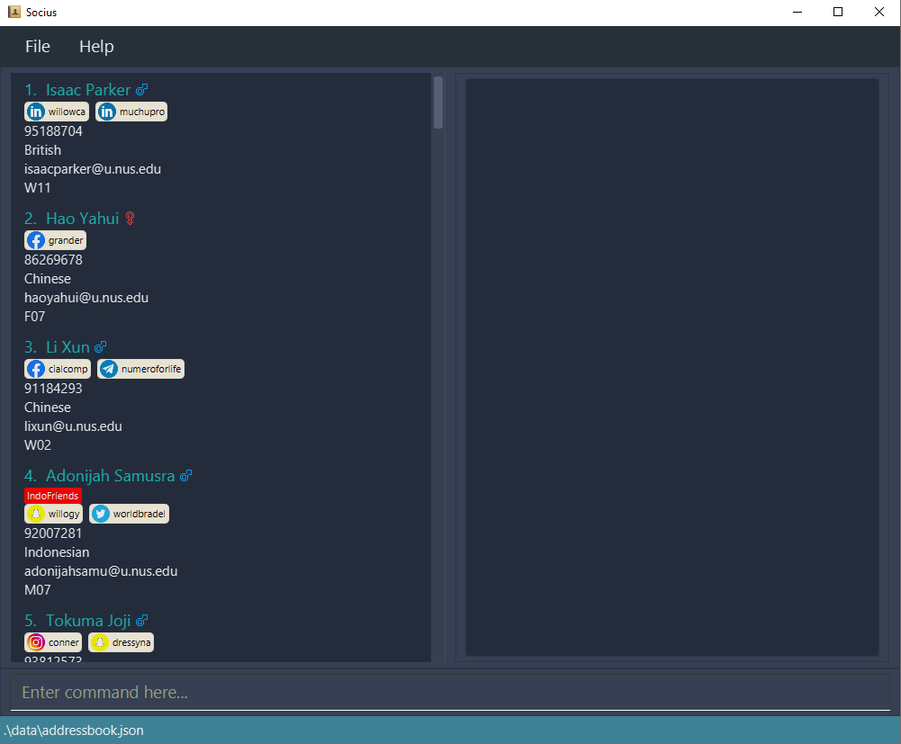

* Note that the app comes with some sample data by default. Type **`clear`** in the command box to remove those sample data.

* Type the command in the command box and press `Enter` to execute it. e.g. typing **`help`** and pressing `Enter` will open the help window.
Some example commands you can try:
    * **`add`** `n/Amy Tan tg/W08 nat/Singaporean` : Adds a contact named `Amy Tan` to list, together with her tutorial group and nationality.

    * **`delete`** `3` : Deletes the person at index 3 in the current list.

    * **`find`** : `g/f nat/Singaporean` : Finds contacts of all female Singaporeans.

    * **`list`** : Lists all contacts.

    * **`clear`** : Deletes all contacts.

    * **`exit`** : Exits the app.

* Refer to the next section on [Features](#features) for more details of each command. Alternatively, you can go to [Command Summary](#command-summary) for an overview of all commands.

--------------------------------------------------------------------------------------------------------------------

## Features

**:information_source: Notes about the command format:** 

* Words in `UPPER_CASE` are the parameters to be supplied by the user. 
  e.g. in `add n/NAME`, `NAME` is a parameter which can be used as `add n/John Doe`.

* Items in square brackets are optional. 
  e.g `n/NAME [t/TAG]` can be used as `n/John Doe t/friend` or as `n/John Doe`.

* Items with `…`​ after them can be used multiple times including zero times. 
  e.g. `[t/TAG]…​` can be used as ` ` (i.e. 0 times), `t/friend`, `t/friend t/family` etc.

* Parameters can be in any order. 
  e.g. if the command specifies `n/NAME p/PHONE_NUMBER`, `p/PHONE_NUMBER n/NAME` is also acceptable.

* If only one parameter is expected but multiple ones are specified, only the last will be taken. 
  e.g. if you specify `p/12341234 p/56785678`, only `p/56785678` will be taken.

* Extraneous parameters for commands that do not take in parameters (`help`, `list`, `exit` and `clear`) will be
  ignored. 
  e.g. if the command specifies `help 123`, it will be interpreted as `help`.

### Viewing help: `help`

You can view the full list of commands available on Socius with the `help` command.

Format: **`help`**

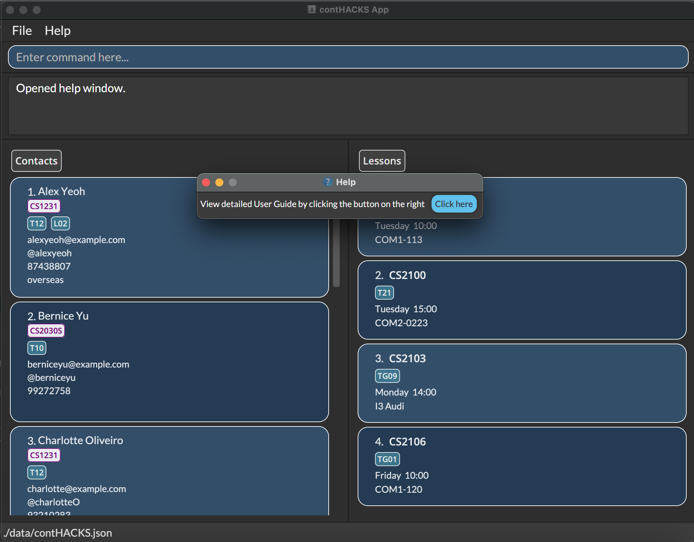
*After execution of Help Command: **`help`***

### Adding a person: `add`

If you want to add a new person into Socius, you can use the `add` command.

Format: **`add`** `n/NAME [p/PHONE_NUMBER] [e/EMAIL] [nat/NATIONALITY] [g/GENDER] [tg/TUTORIAL_GROUP] [s/SOCIAL_HANDLE]…​ [r/REMARK] [t/TAG]…​`

:bulb: **Tip:**
The [Parameter Constraints](#parameter-constraints) section shows the constraints for each parameter.

* Only the `NAME` field of a person is _compulsory_, other fields are _optional_.
* The order of the fields does not matter.

:bulb: **Tip:**
A person can have any number of tags (including 0) and social handles (including 0)

Examples:

* **`add`** `n/Amy Tan` adds `Amy Tan` to the list.
* **`add`** `n/Benedict p/98765432 e/ben@example.com g/M` adds `Benedict`  to the list together with his phone number, email and gender.
* **`add`** `n/Ernest s/tg:ernest2334 s/ig:ernessst` adds `Ernest` to the list together with his Telegram and Instagram handles.
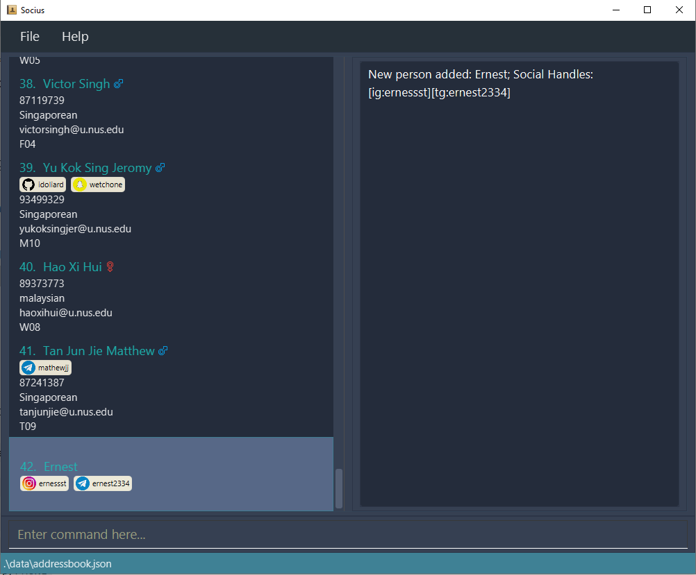
*After execution of Add Command: **`add`** `n/Ernest s/tg:ernest2334 s/ig:ernessst`*

### Adding tags: `addt`

You can add tags to a person in the contact book by `INDEX`. Alternatively, you can add tags to everyone in the
contact book by replacing `INDEX` with the word `all`.

Format: **`addt`** `INDEX t/TAG [t/TAG]…​`
* Add tags to the person at the specified `INDEX`.
* The index refers to the index number shown in the displayed person list.
* Index must be provided and **must be a positive integer** 1, 2, 3, …​
* Input tag will be appended to the existing tag.
* If duplicated tags are given, these tags will not be added.
* At least one `TAG` must be provided.
* `TAG` is case-sensitive

For example:

* **`addt`** `1 t/friend` followed by **`find`** `g/f` adds the friend tag to the person at index 1 in the filtered list of female contacts.
* **`addt`** `2 t/teammate t/neighbour` adds the teammate and neighbour tags to the person at index 2 in the displayed person list.

Alternatively, **`addt`** `all t/TAG [t/TAG]…​`
* Add tags to everybody in the list.
* Input tag will be appended to the existing tag.
* If duplicated tags are given, these tags will not be added.
* At least one `TAG` must be provided.
* `TAG` is case-sensitive

For example:

* **`addt`** `all t/friend` followed by **`find`** `g/f` adds the friend tag to all persons in the filtered list of female contacts.
* **`addt`** `all t/teammate t/neighbour` adds the teammate and neighbour tags to all persons in the displayed person list.
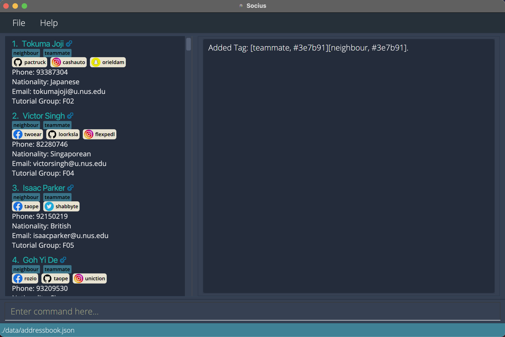
*After execution of Add Tag Command: **`addt`** `all t/teammate t/neighbour`*

### Adding remark to a person: `remark`

You can add a remark to a person in the contact book by `INDEX`.

Format: **`remark`** `INDEX r/VALUE`
* Add a remark to the person at the specified `INDEX`.
* The index refers to the index number shown in the displayed person list.
* Index must be provided and **must be a positive integer** 1, 2, 3, …​
* Existing remark will be updated to the input remark.
* If duplicated remarks are given, only the latest one will be taken.
* You can remove a person’s remark by typing `remark` (i.e. empty parameter) or `remark r/` without specifying any remark after it.

Examples:

* **`remark`** `1 r/She likes coding` adds the remark `She likes coding` to the person at index 1.
* **`remark`** `2` clears the remark of the person at index 2.
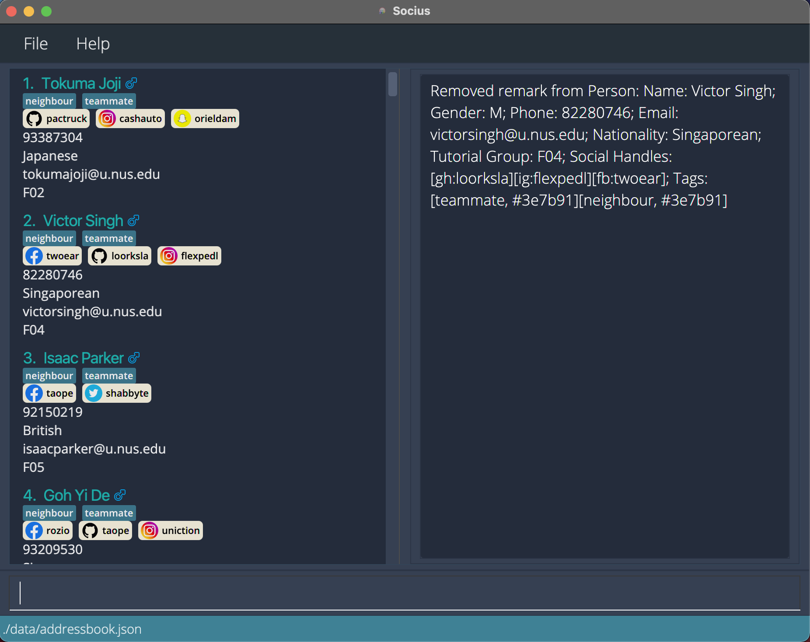
*After execution of Remark Command: **`remark`** `2`*

### Editing a person: `edit`

You can edit an existing person in the contact book by `INDEX`.

Format: **`edit`** `INDEX FIELD_PREFIX/VALUE [FIELD_PREFIX/VALUE]…​`

* `FIELD_PREFIX/VALUE` can be any of the following:
  * `n/NAME`
  * `g/GENDER`
  * `p/PHONE_NUMBER`
  * `e/EMAIL`
  * `nat/NATIONALITY`
  * `tg/TUTORIAL_GROUP`
  * `s/SOCIAL_HANDLE`
  * `r/REMARK`
  * `t/TAG`

:bulb: **Tip:**
The [Parameter Constraints](#parameter-constraints) section shows the constaints for each parameter.

* At least one field of the person must be changed.
* Edits the person at the specified `INDEX`.
* `INDEX` refers to the index number shown on the left of the name of a displayed person.
* New input values will overwrite existing values.
* To remove a field, simply leave the `VALUE` empty
  * For `s/SOCIAL_HANDLE`, you can specify which social handle to remove by only leaving the `USERID` part empty (i.e. `s/PLATFORM:`)
* If duplicated fields are given, only the latest one will be taken
  * This does not applies to `s/SOCIAL_HANDLE` and `t/TAG` as they can accept multiple values.
* When editing tags, the existing tags of the person will be replaced (i.e adding of tags is not cumulative).
* You can remove all the person’s tags by typing `t/` without specifying any tags after it.

:bulb: **Tip:**
You can change the default colour of the tag with `t/TAG:#HEX_COLOUR` 
Example: `t/friends:#FF0000` for a red colour tag

Examples:

* **`edit`** `1 p/91234567 e/amytan@example.com` edits the phone number and email address of the person at index 1 to be `91234567`
  and `amytan@example.com` respectively.
* **`edit`** `2 n/Benedict t/` edits the name of the person at index 2 to be `Benedict` and clears all his existing tags.

### Deleting a person: `delete`

You can delete the specified person from the contact book by `INDEX`.

Format: **`delete`** `INDEX`

* Deletes the person at the specified `INDEX`.
* The index refers to the index number shown in the displayed person list.
* Index must be provided and **must be a positive integer** 1, 2, 3, …​

Examples:

* **`list`** followed by **`delete`** `2` deletes the person at index 2 from the contact book.
* **`find`** `n/benedict` followed by **`delete`** `1` deletes the person at index 1 from the results of the **`find`** command.

### Deleting tags: `deletet`
You can delete tags to a person in the contact book by `INDEX`. Alternatively, you can delete tags for everyone in the
contact book by replacing `INDEX` with the word `all`.

Format: **`deletet`** `INDEX [t/TAG]…​`
* Delete tags of the person at the specified `INDEX`.
* The index refers to the index number shown in the displayed person list.
* Index must be provided and **must be a positive integer** 1, 2, 3, …​
* The tag refers to the tags to delete from the person.
* Existing tag will be removed if one of the input tags is the existing tag.
* If no `TAG` is provided, all tags of the person will be deleted.
* `TAG` is case-sensitive

Alternatively, **`deletet`** `all [t/TAG]…​`
* Delete tags of everybody in the list.
* The tag refers to the tags to delete from everyone.
* Existing tag will be removed if one of the input tags is the existing tag.
* If no `TAG` is provided, every tag in the list will be deleted.
* `TAG` is case-sensitive

### Deleting multiple person: `deletem`

You can delete multiple person from the contact book using `KEYWORD`.

Format: **`deletem`** `FIELD_PREFIX/KEYWORD [FIELD_PREFIX/KEYWORD]…​`

* `FIELD_PREFIX/KEYWORD` can be any of the following:
  * `n/NAME`
  * `g/GENDER`
  * `p/PHONE_NUMBER`
  * `e/EMAIL`
  * `nat/NATIONALITY`
  * `tg/TUTORIAL_GROUP`
  * `s/SOCIAL_HANDLE`
  * `r/REMARK`
  * `t/TAG`

* At least one `KEYWORD` must be provided.
* `KEYWORD` is case-insensitive. (e.g `hans` will match `Hans`)
* Persons matching all keywords will be deleted (i.e. `AND` search).

Examples:

* **`deletem`** `n/jia ling` deletes `Zhong Jia Ling` and `Oon Jia Ling`.
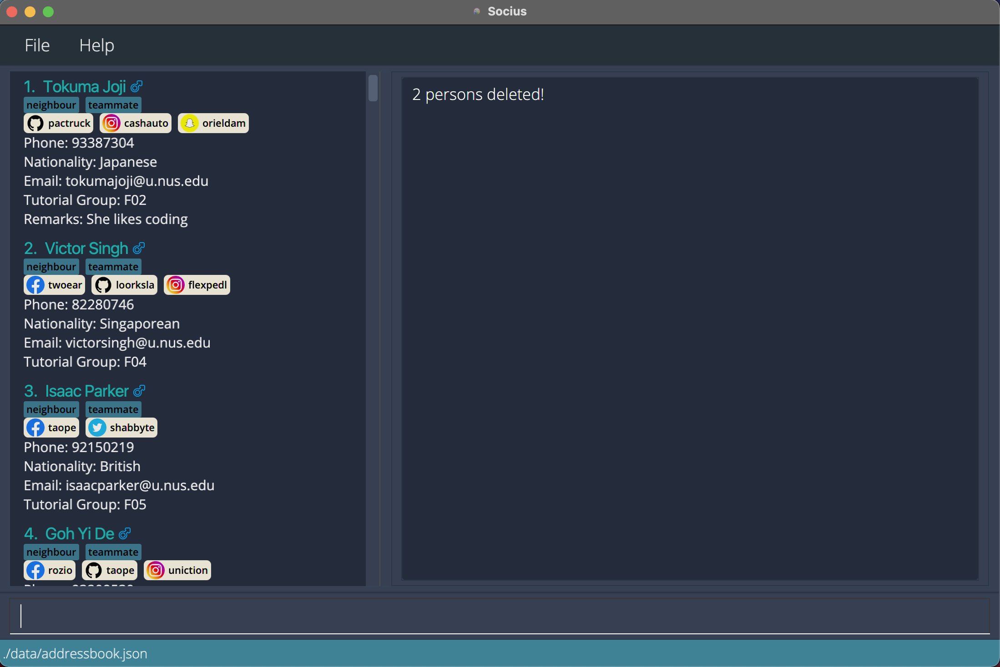
*After execution of Delete Multiple Command: **`deletem`** `n/jia ling`*

### Deleting tags: `deletet`
You can delete tags to a person in the contact book by `INDEX`. Alternatively, you can delete tags for everyone in the
contact book by replacing `INDEX` with the word `all`.

Format: **`deletet`** `INDEX [t/TAG]…​`
* Delete tags of the person at the specified `INDEX`.
* The index refers to the index number shown in the displayed person list.
* Index must be provided and **must be a positive integer** 1, 2, 3, …​
* The tag refers to the tags to delete from the person.
* Existing tag will be removed if one of the input tags is the existing tag.
* If no `TAG` is provided, all tags of the person will be deleted.
* `TAG` is case-sensitive

For example:

* **`deletet`** `1 t/friend` followed by **`find`** `g/f` deletes the friend tag from the person at index 1 in the filtered list of female contacts.
* **`deletet`** `2 t/teammate t/neighbour` deletes the teammate and neighbour tags from person at index 2 in the displayed person list.
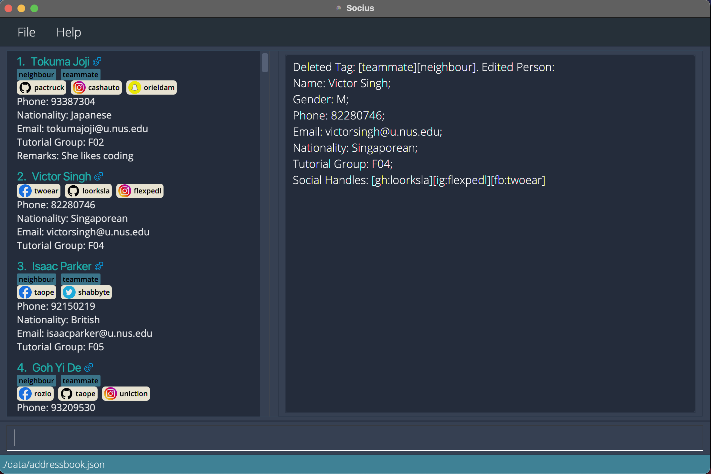
*After execution of Delete Tag Command: **`deletet`** `2 t/teammate t/neighbour`*

Alternatively, **`deletet`** `all [t/TAG]…​`
* Delete tags of everybody in the list.
* The tag refers to the tags to delete from everyone.
* Existing tag will be removed if one of the input tags is the existing tag.
* If no `TAG` is provided, every tag in the list will be deleted.
* `TAG` is case-sensitive

For example:

* **`deletet`** `all t/friend` followed by **`find`** `g/f` deletes the friend tag from all persons in the filtered list of female contacts.
* **`deletet`** `all t/teammate t/neighbour` deletes the teammate and neighbour tags from all persons in the displayed person list.

### Clearing all persons: `clear`

You can clear all persons from the contact book.

Format: **`clear`**

### Listing all persons: `list`

You can list all persons in the contact book.

Format: **`list`**

### Finding persons: `find`

You can find the specified persons using `KEYWORD`.

Format: **`find`** `FIELD_PREFIX/KEYWORD [FIELD_PREFIX/KEYWORD]…​`

* `FIELD_PREFIX/KEYWORD` can be any of the following:
     * `n/NAME`
     * `g/GENDER`
     * `p/PHONE_NUMBER`
     * `e/EMAIL`
     * `nat/NATIONALITY`
     * `tg/TUTORIAL_GROUP`
     * `s/SOCIAL_HANDLE_USERID`
     * `r/REMARK`
     * `t/TAG`

* At least one `KEYWORD` must be provided.
* The `KEYWORD` is case-insensitive. (e.g `hans` will match `Hans`)
* Persons matching all keywords will be returned (i.e. `AND` search).

Examples:

* **`find`** `n/Alex` returns `alex` and `Alexandra`.
* **`find`** `n/jack tg/M12` returns `Jack` who are from tutorial group `M12`. 
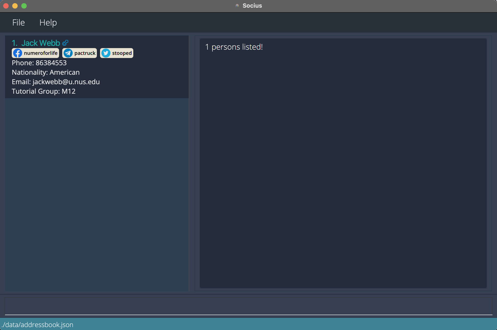
*After execution of Find Command: **`find`** `n/jack tg/M12`*
* **`find`** `nat/Singaporean` returns all persons who are Singaporeans.  
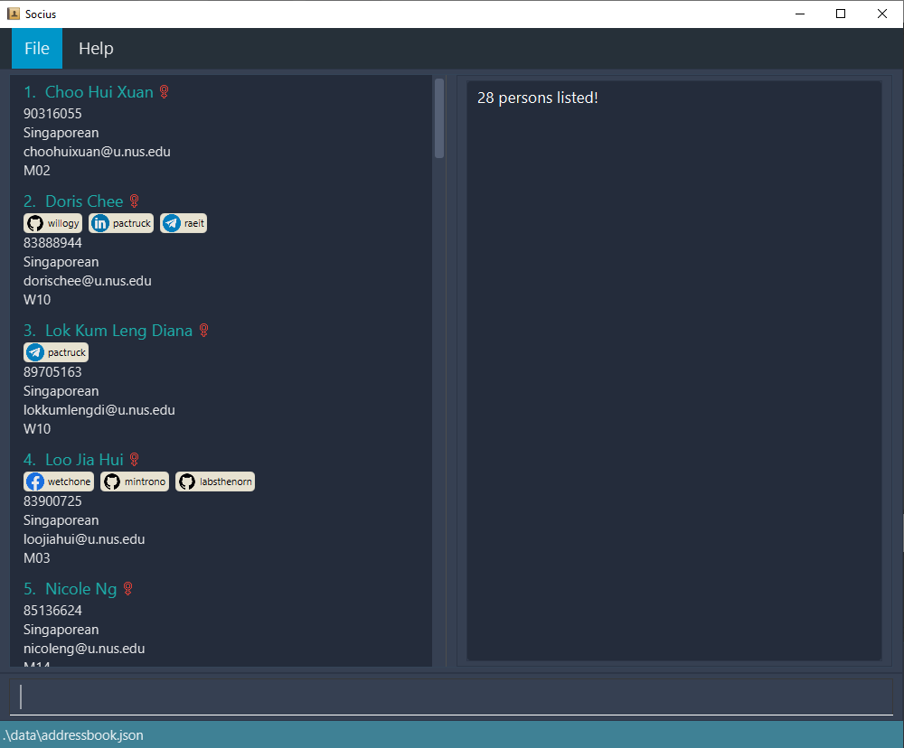
*After execution of Find Command: **`find`** `nat/Singaporean`*

### Sorting all persons: `sort`

You can sort all persons in the contact book by a specified field.

Format: **`sort`** `FIELD_PREFIX/`

* `FIELD_PREFIX/` can be any of the following: `n/`, `g/`, `p/`, `e/`, `nat/`, `tg/`, `s/`, `r/`, `t/`
* If field contains words, sort persons in ascending alphabetical order.
* If field contains numbers, sort persons in ascending numeric order.

Examples:

* **`sort`** `n/` sorts persons by name in ascending alphabetical order.
* **`sort`** `tg/` sorts persons by tutorial group in ascending alphanumeric order.
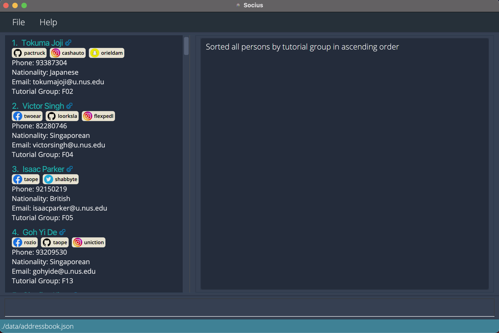
*After execution of Sort Command: **`sort`** `tg/`*

### Viewing statistics: `stat`

You can view the nationality statistics of a specified tutorial group.

Format: **`stat`** `TUTORIAL_GROUP`

Examples:

* **`stat`** `T08` computes and shows the nationality statistics of tutorial group `T08`.
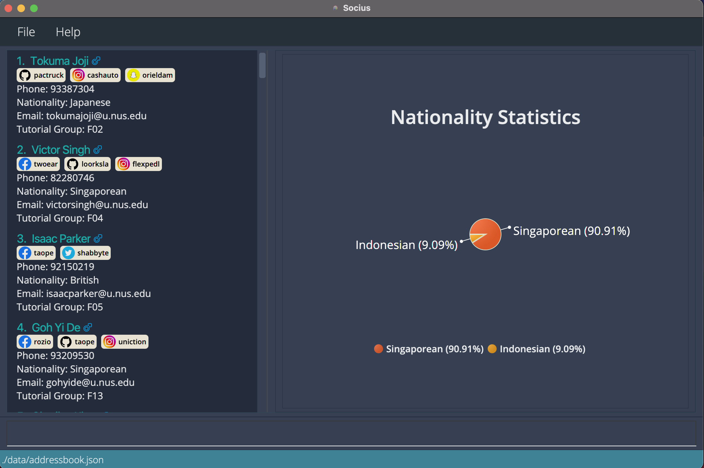
*After execution of Stat Command: **`stat`** `T08`*

### Importing contacts: `import`

You can import your friends' contact book into your application.

Format: **`import`** `FILE_NAME.json`

* File must be in JSON format!
* File must be located in the `./data` directory in relative to the directory of `Socius.jar`.

Examples:
* **`import`** `groupmates.json` imports a contact book via a file named `groupmates.json` into your existing application.
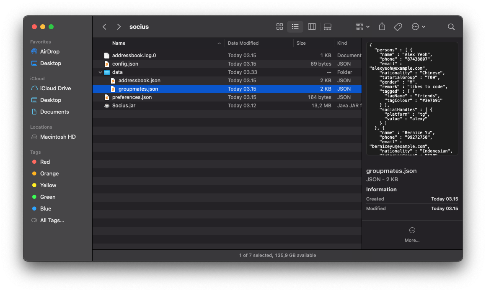
*Illustration of where the JSON file should be located*

### Exporting contacts: `export`

You can export your contact book and share it with your friends.

Format: **`export`** `FILE_NAME.json`

* File can only be exported to JSON format.
* File will be stored in the `./data` directory in relative to the directory of `Socius.jar`.

Examples:

* **`export`** `amy.json` export your contact book details into a file named `amy.json`.

### Aliasing commands: `alias`

You can create command shortcut by aliasing it with custom `KEYWORD`. This will assign the `KEYWORD` to a particular `COMMAND`,
so next time you can simply type in `KEYWORD` instead of the full `COMMAND`.

Format: **`alias`** `a/KEYWORD c/COMMAND`.

* `KEYWORD` cannot be same as command keywords such as `add`.
* The order of `KEYWORD` and `COMMAND` does not matter.

Examples:

* **`alias`** `a/Singaporeans c/find nat/Singaporean tg/T08` map the keyword `Singaporeans` to the stated command.
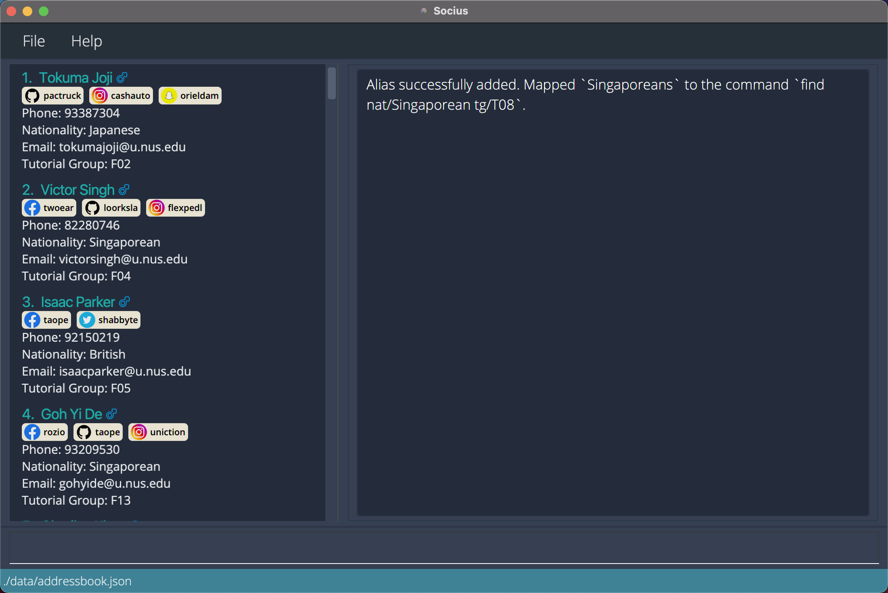
*After execution of Alias Command: **`alias`** `a/Singaporeans c/find nat/Singaporean tg/T08`*

### Exiting the program: `exit`

Exits the program.

Format: **`exit`**

### Saving the data

Socius data are automatically saved to the computer after any command that changes the data.
Therefore, there is no need to save manually. The data will be automatically loaded back into the application the next time you use it.

### Command History

Use up/down arrow keys to navigate through command history. This is useful if the command you are going to type only differs slightly from a command you have previously typed, or if you would like to revisit your previous commands.

--------------------------------------------------------------------------------------------------------------------

## Parameter Constraints

### `n/NAME`
`NAME` should only contain alphanumeric characters and spaces.

Example: `n/Zayden Tan Bee Hoon`

### `g/GENDER`
`GENDER` can be `M` for male, `F` for female or `O` for others.

Examples: `g/M`, `g/f`

### `p/PHONE_NUMBER`
`PHONE_NUMBER` should only contain numbers, and it should be at least 3 digits long.

Example: `98739283`

### `e/EMAIL`
`EMAIL` should be of the format `local-part@domain` and adhere to the following constraints:
* The local-part should only contain alphanumeric characters and these special characters: `+_.-`.
* The local-part may not start or end with any special characters.
* The domain name is made up of domain labels separated by periods.
* The domain name must:
     * end with a domain label at least 2 characters long
     * have each domain label start and end with alphanumeric characters
     * have each domain label consist of alphanumeric characters, separated only by hyphens, if any.

Example: `e/e3029834@u.nus.edu`

### `nat/NATIONALITY`
`NATIONALITY` is only valid if it is one of the nationality listed in this [list of nationalities TXT file](https://gist.github.com/marijn/274449).

Example: `nat/Singaporean`

### `tg/TUTORIAL_GROUP`
`TUTORIAL_GROUP` should only contain one letter that is either M/T/W/F followed by two digits.

Example: `tg/T09`

### `s/SOCIAL_HANDLE`
`SOCIAL_HANDLE` should be of the format `PLATFORM:USERID` and should adhere to the following constraints:
* Only the following `PLATFORM` are supported: `Instagram`, `Telegram`, `Facebook`, `Twitter`, `Github`, `Linkedin`, `Snapchat`, `Discord`
* The following 2 letter shorthand can be used to replace the full name of the social platform:
     * `ig` for Instagram
     * `tg` for Telegram
     * `fb` for Facebook
     * `tw` for Twitter
     * `gh` for Github
     * `ln` for Linkedin
     * `sc` for Snapchat
     * `dc` for Discord
* `USERID` should not contains whitespaces

Example: `s/tg:alexx9384`

### `s/SOCIAL_HANDLE_USERID`
`SOCIAL_HANDLE_USERID` is the `USERID` component of [`SOCIAL_HANDLE`](#ssocial-handle)

### `r/REMARK`
`REMARK` can take any values.

Example: `r/Stays in PGP`

### `t/TAG`
`TAG` names should be alphanumeric.

Example:  `t/friends`

:bulb: **Tip:**
You can change the default colour of the tag with `t/TAG:#HEX_COLOUR`
Example: `t/friends:#FF0000` for a red colour tag

### `a/ALIAS`
`ALIAS` can take any values except keywords that are reserved for command names.

Example: `a/findAlex`

### `c/COMMAND`
`COMMAND` must be a valid command.

Example: `c/find n/Alex`

--------------------------------------------------------------------------------------------------------------------

## FAQ
**Q**: How do I transfer my data to another Computer? 
**A**: Install the app in the other computer and overwrite the empty data file it creates with the file that contains
the data of your previous Socius home folder.

**Q**: Can I edit the data file directly? 
**A**: Socius data are saved as a JSON file (i.e. `JAR_FILE_LOCATION/data/addressbook.json`).
Advanced users are welcome to update data directly by editing that data file.

:exclamation: **Caution:**
If the format of your data file is invalid, Socius will discard all data and start with an empty data file at the next run.

--------------------------------------------------------------------------------------------------------------------

## Glossary

| Word | Meaning |
|--------|-------|
|        |         |

--------------------------------------------------------------------------------------------------------------------

## Authors

This User Guide is co-written by Hsiao Ting, Choon Yong, Kevin, Boon Kee and Nathan. We are a group of Computer Science students from the National University of Singapore, and members of AY2022S1-CS2103T-W08-4.

--------------------------------------------------------------------------------------------------------------------

## Command Summary

### General

| Command | Format | Examples |
| --------- | ------------------- | ----------------------------------------------- |
| **Help** | **`help`** | **`help`** |
| **Exit** | **`exit`** | **`exit`** |

### Modify

| Command | Format | Examples |
| --------- | ------------------- | ----------------------------------------------- |
| **Add** | **`add`** `n/NAME [p/PHONE_NUMBER] [e/EMAIL] [nat/NATIONALITY] [g/GENDER] [tg/TUTORIAL GROUP] [s/SOCIALHANDLE]…​ [r/REMARK] [t/TAG]…​`| **`add`** `n/James Ho p/22224444 e/jamesho@example.com g/M tg/T12 s/tg:friendlyjames r/Friendly t/colleague`|
| **Addt** | **`addt`** `INDEX t/TAG [t/TAG]…​` or `all t/TAG [t/TAG]…​` | **`addt`** `1 t/friend t/teammate`|
| **Remark** | **`remark`** `INDEX [r/REMARK]` | **`remark`** `2 r/She likes coding` |
| **Edit** | **`edit`** `INDEX FIELD_PREFIX/VALUE [FIELD_PREFIX/VALUE]…​` | **`edit`** `1 s/tg:dogcatdonkey43 s/ig:applegrapeorange32 t/teammates e/wfeewf@gmail.com g/M nat/Singaporean` |
| **Delete** | **`delete`** `INDEX` | **`delete`** `3`|
| **Deletet** | **`deletet`** `INDEX t/TAG [t/TAG]…​` or `all t/TAG [t/TAG]…​` | **`deletet`** `all t/teammate`|
| **Deletem** | **`deletem`** `FIELD_PREFIX/KEYWORD [FIELD_PREFIX/KEYWORD]…​` | **`deletem`** `n/James g/f` |
| **Clear** | **`clear`** | **`clear`** |

### View

| Command | Format | Examples |
| --------- | ------------------- | ----------------------------------------------- |
| **List** | **`list`** | **`list`** |
| **Find** | **`find`** `FIELD_PREFIX/KEYWORD [FIELD_PREFIX/KEYWORD]…​` | **`find`** `g/F tg/07` |
| **Sort** | **`sort`** `FIELD_PREFIX/` | **`sort`** `n/` |
| **Stat** | **`stat`** `TUTORIAL_GROUP` | **`stat`** `T09`|

### Share

| Command | Format | Examples |
| --------- | ------------------- | ----------------------------------------------- |
| **Import** | **`import`** | **`import`** `contactbook.json`|
| **Export** | **`export`** | **`export`** `contactbook.json`|

### Advance

| Command | Format | Examples |
|---------|-------------------|-------------------------------------------------|
| **Alias** | **`alias`** `a/KEYWORD c/COMMAND` | **`alias`** `a/allFemales c/find g/f`|
