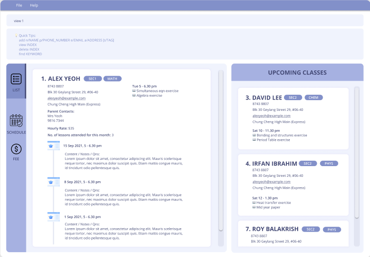

* Table of Contents
{:toc}

--------------------------------------------------------------------------------------------------------------------

## Introduction

Are you a busy private 1-to-1 home tutor who finds it difficult to remember all your students' information?

**Tuition Address Book (TAB)** is an all-in-one *desktop application* that helps you keep track of the large number of students and their respective lesson information, and empower you to provide the best quality home tuition service.

TAB comes with a clean Graphical User Interface (GUI) while optimised for user interaction via a CLI (Command Line Interface).

Use TAB to effortlessly manage your students' contact details faster than a typical mouse/GUI driven app!

## Quick start

1. Ensure you have Java `11` or above installed in your computer.

**:information_source: JDK Installation Guide**

You can install the required JDK and JRE from the 
[Java SE Development Kit Downloads page](https://www.oracle.com/java/technologies/downloads/).

Here is a [website](https://docs.oracle.com/en/java/javase/17/install/overview-jdk-installation.html#GUID-8677A77F-231A-40F7-98B9-1FD0B48C346A)
to help you with the installation. Follow the guide for your operation system for detailed instructions.

2. Download the latest `TAB.jar` from [here](https://github.com/AY2122S1-CS2103T-F13-3/tp/releases).

3. Copy the file to the folder you want to use as the _home folder_ for your TAB.

4. Double-click the file to start the app. The window similar to the one below should appear in a few seconds. Note how the app contains some sample data. 
   

5. Type the command in the command box and press Enter to execute it. e.g. typing **`help`** and pressing Enter will open the help window. 
   Some example commands you can try:

   * **`list`** : Lists all students.

   * **`add`**`n/John Doe p/98765432 e/johnd@example.com a/John street, block 123, #01-01` : Adds a student named `John Doe` to TAB.

   * **`delete`**`3` : Deletes the 3rd student shown in the current list.

   * **`clear`** : Deletes all students.

   * **`exit`** : Exits the app.

6. Refer to the [Features](#features) below for details of each command.

--------------------------------------------------------------------------------------------------------------------

## Features

**:information_source: Notes about the command format:** 

* Words in `UPPER_CASE` are the parameters to be supplied by the user. 
  e.g. in `add n/NAME`, `NAME` is a parameter which can be used as `add n/John Doe`.

* Items in square brackets are optional. 
  e.g. `n/NAME [t/TAG]` can be used as `n/John Doe t/friend` or as `n/John Doe`.
  
* Items in curly brackets separated by the pipe character `|` indicates that you must select exactly one parameter from the list of choices.
  e.g. `cond/{all | any | none}` can be used as `cond/all` or `cond/any` or `cond/none`.
  
* Items with `…` after them can be used multiple times including zero times. 
  e.g. `[t/TAG]…​` can be used as ` ` (i.e. 0 times), `t/friend`, `t/friend t/family` etc.

* Parameters can be in any order. 
  e.g. if the command specifies `n/NAME p/PHONE_NUMBER`, `p/PHONE_NUMBER n/NAME` is also acceptable.

* If a parameter is expected only once in the command, but you specified it multiple times, only the last occurrence of the parameter will be taken. 
  e.g. if you specify `p/12341234 p/56785678`, only `p/56785678` will be taken.

* Extraneous parameters for commands that do not take in parameters (such as `help`, `list`, `exit` and `clear`) will be ignored. 
  e.g. if the command specifies `help 123`, it will be interpreted as `help`.

### Getting Help 

--------------------------------------------------------------------------------------------------------------------

#### Viewing help: `help`

Shows a message explaining how to access the help page.

Format: `help`

### Managing Students

--------------------------------------------------------------------------------------------------------------------

#### Adding a student: `add`

Adds a student to TAB.

Format: `add n/NAME a/ADDRESS [p/PHONE_NUMBER] [e/EMAIL] [pp/PARENT_PHONE_NUMBER] [pe/PARENT_EMAIL] [sch/SCHOOL] [stream/ACAD_STREAM] [lvl/ACAD_LEVEL] [f/OUTSTANDING_FEES] [r/REMARK] [t/TAG]…​`

:bulb: **Tip:**
A student can have any number of tags (including 0).

**:information_source: Notes about the `add` command:** 

* At least one contact field is required. 
  e.g. at least one of the `p/PHONE_NUMBER`, `e/EMAIL`, `pp/PARENT_PHONE_NUMBER`, or `pe/PARENT_EMAIL` fields must be 
  included in the add command.

Examples:
* `add n/John Doe p/98765432 e/johnd@example.com a/John street, block 123, #01-01 pp/92345678 pe/jackdoe@example.com sch/John's School stream/John stream lvl/J1`
* `add n/Betsy Crowe t/cousin a/Newgate p/91234567 f/150.50 r/hasnt pay tuition fee for Aug t/retainee`

#### Editing a student: `edit`

Edits an existing student in TAB.

Format: `edit INDEX [n/NAME] [a/ADDRESS] [p/PHONE] [e/EMAIL] [pp/PARENT_PHONE_NUMBER] [pe/PARENT_EMAIL] [sch/SCHOOL] [stream/ACAD_STREAM] [lvl/ACAD_LEVEL] [f/OUTSTANDING_FEES] [r/REMARK] [t/TAG]…​`

**:information_source: Notes about the `edit` command:** 

* Edits the student at the specified `INDEX`. The index refers to the index number shown in the displayed list of students. 
  e.g. `edit 2` means that you wish to edit the 2nd student in the displayed list.

* You must provide at least one field. 
  e.g. entering just `edit 2` alone is not a valid command. You need to include the field you wish to edit.

* Existing values will be updated to the entered values. 
  e.g. `edit 2 f/0` will override the outstanding fees of the 2nd student in the displayed list to `0`.

* When editing tags, all existing tags of the student will be removed and replaced with the tags specified. 
  e.g. `edit 2 t/SEC2 t/IP` will erase the student's original tags and replace it with the new tags `SEC2` and `IP`.

* You can delete the data in optional fields by supplying a parameter with no arguments. 
  e.g. `edit 2 r/` will remove the remarks for the 2nd student in the displayed list.

* You cannot remove a contact field if it is the only remaining means of contact you have with a student. 
  e.g. no student should have all contact fields empty. `edit 2 pp/` will not work if the student does not have
  any `PHONE_NUMBER`, `EMAIL`, or `PARENT_EMAIL`.

* You can delete all tags of a student by typing `t/` without any arguments. 
  e.g. `edit 2 t/` will remove all existing tags from the 2nd student in the displayed list.

Examples:
* `edit 1 p/91234567 e/johndoe@example.com` Edits the phone number and email address of the 1st student to be `91234567` and `johndoe@example.com` respectively.
* `edit 2 n/Betsy Crower t/` Edits the name of the 2nd student to be `Betsy Crower` and clears all existing tags.
* `edit 3 sch/NJC stream/` Edits the school of the 3rd student to be `NJC` and clears academic stream data.

#### Deleting a student: `delete`

Deletes the specified student from TAB.

Format: `delete INDEX`

* Deletes the student at the specified `INDEX`.
* The index refers to the index number shown in the displayed student list.
* The index **must be a positive integer** 1, 2, 3, …

Examples:
* `list` followed by `delete 2` deletes the 2nd student in TAB.
* `find n/Betsy` followed by `delete 1` deletes the 1st student in the results of the `find` command.

#### Viewing a student's details: `view`

> ❕❕ <b>Note:</b> This feature is subject to changes

View data of student with specified index in detail.

Format: `view INDEX`

#### Listing all students: `list`

Shows a list of all students in TAB.

Format: `list`

### Finding Students

--------------------------------------------------------------------------------------------------------------------

#### Finding students by fields: `find`

Finds all students whose fields match the given keyword(s), based on the specified find condition.

Format: `find [cond/{all | any | none}] [n/NAME_KEYWORDS] [a/ADDRESS_KEYWORDS] [p/PHONE_KEYWORDS] [e/EMAIL_KEYWORDS] [pp/PARENT_PHONE_KEYWORDS] [pe/PARENT_EMAIL_KEYWORDS] [sch/SCHOOL_KEYWORDS] [stream/ACAD_STREAM_KEYWORDS] [lvl/ACAD_LEVEL_KEYWORDS] [t/TAG_KEYWORD]…​`

**:information_source: Notes about the `find` command:** 

* You can find students by all the fields except remark and fee.

* The filter condition indicates that a student is only considered a match when `all`, `any` or `none`
  of the fields which you are searching for match the student. 
  e.g. 
    * `find n/John t/math cond/all` will return students with both the name `John` and the tag `math`.
    * `find n/John t/math cond/any` will return students with only the name `John`, or only the tag `math`, or both.
    * `find n/John t/math cond/none` will return students without the name `John` and the tag `math`.

* The filter condition will not accept other arguments besides `all`, `any` and `none`. 
  e.g. `cond/every` will result in an error.
  
* The filter condition is optional and defaults to `all` if not specified.

* The filter condition is case-insensitive. 
  e.g. `None` or `ANY` are valid.
  
* You must provide at least one field to search. 
  e.g. entering just `find` or `find cond/any` alone is not a valid command. You need to include the fields you wish to search for.

* You must provide at least one keyword to search for. 
  e.g. entering just `find n/ ` alone is not a valid command as the keyword is empty.

* Tags must only have one keyword. 
  e.g. `find t/zoom math` is invalid. To search by multiple tags, you can do `find t/zoom t/math`.
  
* The search is case-insensitive. 
  e.g. keyword `hans` will match `Hans`.

* A keyword can match a word partially. 
  e.g. keyword `math` will match `mathematics`.
  
* The order of the keywords do not matter. 
  e.g. keyword `west jurong` will match `jurong west`.
  
* A field needs to contain all specified keywords to be matched. 
  e.g. keywords `Amad Ali` will not match `Amad` or `Ali Abdul`, but it will match `Amad bin Ali`.

Examples:
* `find a/west p/9876 n/john` matches student with name `Johnny tan`, address `Clementi west`, and phone number `98765432`.
* `find cond/none t/new t/paid t/zoom` returns students with none of the tags `new`, `paid` and `zoom`.
* `find stream/express sch/nus cond/any` returns students with stream `express` or school `nus`.

### Managing Lessons

--------------------------------------------------------------------------------------------------------------------

#### Adding a lesson: `ladd`

Adds a lesson with the corresponding details to the specified student in TAB.

**Types of lesson:**
* Recurring
* Makeup

**Lesson fields:**
* Date of lesson `dd MMM yyyy`
  *  e.g. `02 Jan 2018`
* Time range `HHmm-HHmm`
* Subject
* Homework

Format: `ladd INDEX [recurring/] date/dd MMM yyyy time/HHmm-HHmm subject/SUBJECT [hw/HOMEWORK]…​`

**:information_source: Notes about the `ladd` command:** 

* The type of lesson will be inferred from the presence of the "recurring/" prefix.
  
* The date is case-insensitive. i.e. `12 jaN 2022` is equivalent to `12 JAN 2022`.

Examples:

* `list` followed by `ladd 1 recurring/ date/30 jan 2022 time/0900-1100 subject/Math`
  adds the recurring lesson to the 1st student in TAB.

* `find n/john` followed by `ladd 1 date/16 Sep 2021 time/1530-1730 subject/Science hw/TYS p2 Q2 hw/Exercise 3 hw/Lab report`
  adds the makeup lesson to the 1st student in the results of the `find` command.

#### Deleting a lesson : `ldelete`

Deletes the specified lesson from the specified student in TAB.

Format: `ldelete INDEX LESSON_INDEX`

**:information_source: Notes about the `ldelete` command:** 

* Deletes the lesson of specified `LESSON_INDEX` for the student at the specified `INDEX`.
  
* The index refers to the index number shown in the displayed student list.
  
* The lesson index refers to the index number shown in the lesson list of the student.
  
* The index and lesson index **must be a positive integer** 1, 2, 3, …

Examples:
* `list` followed by `ldelete 2 1` deletes the 1st lesson for the 2nd student in TAB.
* `find n/Betsy` followed by `ldelete 1 1` deletes the 1st lesson for the 1st student in the results 
  of the `find` command.

### Viewing the Schedule

--------------------------------------------------------------------------------------------------------------------

#### Viewing schedule: `schedule` [coming soon]

Displays a read-only weekly schedule.

Format: `schedule`

### Managing Data

--------------------------------------------------------------------------------------------------------------------

#### Saving the data

TAB data are saved in the hard disk automatically after any command that changes the data. There is no need to save manually.

#### Editing the data file

TAB data are saved as a JSON file `[JAR file location]/data/addressbook.json`. Advanced users are welcome to update data directly by editing that data file.

:exclamation: **Caution:**
If your changes to the data file makes its format invalid, TAB will discard all data and start with an empty data file at the next run.

### Miscellaneous Commands

--------------------------------------------------------------------------------------------------------------------

#### Clearing all entries: `clear`

Clears all entries from TAB.

Format: `clear`

#### Viewing all tags: `tag`

Shows all the tags that user has created in TAB.

Format: `tag`

#### Undoing previous command: `undo`

Undo the previous command that modified the data.

Format: `undo`

#### Redoing undone command: `redo`

Redo the previous command that has been undone.

Format: `redo`

#### Exiting the program: `exit`

Exits the program.

Format: `exit`

--------------------------------------------------------------------------------------------------------------------

## FAQ

**Q**: How do I transfer my data to another Computer? 
**A**: Install the app in the other computer and overwrite the empty data file it creates with the file that contains the data of your previous AddressBook home folder.

--------------------------------------------------------------------------------------------------------------------

## Command summary

Action | Format, Examples
--------|------------------
**Help** | `help`
**Add Student** | `add n/NAME a/ADDRESS [p/PHONE_NUMBER] [e/EMAIL] [pp/PARENT_PHONE_NUMBER] [pe/PARENT_EMAIL] [sch/SCHOOL] [stream/ACAD_STREAM] [lvl/ACAD_LEVEL] [f/OUTSTANDING_FEES] [r/REMARKS] [t/TAG]…`   e.g. `add n/James Ho a/123, Clementi Rd, 1234665 p/22224444 e/jamesho@example.com pp/33335555 pe/danielho@example.com sch/DHS lvl/Y1 f/50 r/retainee t/cousin`
**View Student** | `view INDEX`
**Edit Student** | `edit INDEX [n/NAME] [a/ADDRESS] [p/PHONE] [e/EMAIL] [pp/PARENT_PHONE_NUMBER] [pe/PARENT_EMAIL] [sch/SCHOOL] [stream/ACAD_STREAM] [lvl/ACAD_LEVEL] [f/OUTSTANDING_FEES] [r/REMARK] [t/TAG]…`   e.g. `edit 2 n/James Lee e/jameslee@example.com`
**Delete Student** | `delete INDEX`   e.g. `delete 3`
**List Students** | `list`
**Find Students** | `find [cond/{all &#124; any &#124; none}] [n/NAME_KEYWORDS] [a/ADDRESS_KEYWORDS] [p/PHONE_KEYWORDS] [e/EMAIL_KEYWORDS] [pp/PARENT_PHONE_KEYWORDS] [pe/PARENT_EMAIL_KEYWORDS] [sch/SCHOOL_KEYWORDS] [stream/ACAD_STREAM_KEYWORDS] [lvl/ACAD_LEVEL_KEYWORDS] [t/TAG_KEYWORD]…​`
**View Tags** | `tag`
**Add Lesson** | `ladd INDEX [recurring/] date/dd MMM yyyy time/HHmm-HHmm subject/SUBJECT [hw/HOMEWORK]…​`   e.g. `ladd 1 recurring/ date/10 Nov 2021 time/1000-1200 subject/Math`
**Delete Lesson** | `ldelete INDEX LESSON_INDEX`   e.g.`ldelete 2 1`
**View Schedule** | `schedule`
**Clear** |`clear`
**Undo** | `undo`
**Redo** | `redo`
**Exit** | `exit`
