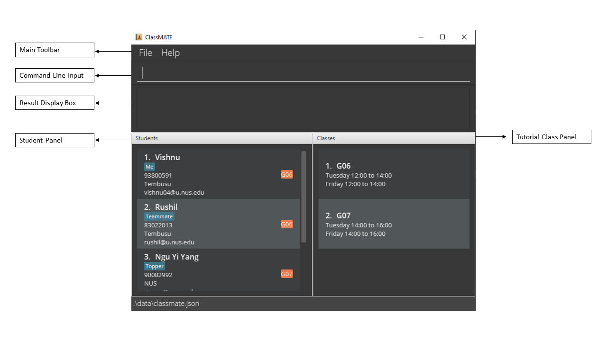
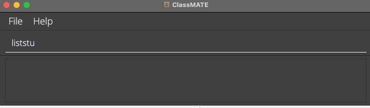
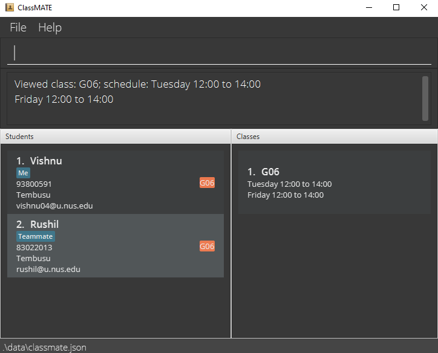
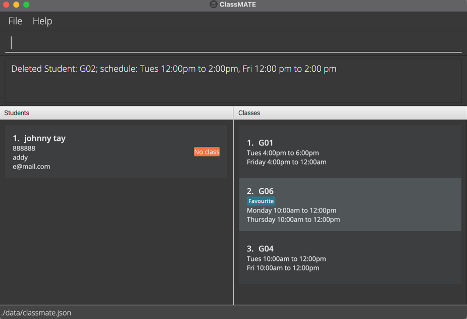
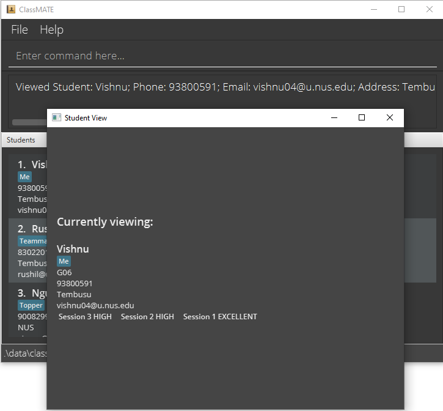
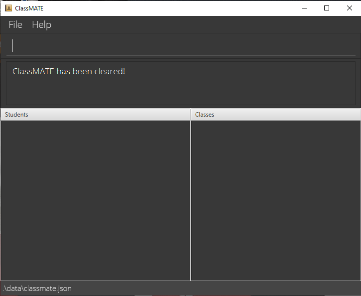

Are you having trouble with administrative work as a CS2101 tutor? Does current tools like Excel sheets or the pen and paper cause a lot of pain when trying to organize and search for students or recording class participation? Could there be a way to streamline this process while providing you a better way to visualise the information? Well, ClassMATE has it all covered!

ClassMATE is a **desktop app designed for you to manage student contacts and organize them into their tutorial classes and groups neatly, as well as recording of students' class participation without much hassle. Having both a Command Line Interface** (CLI) and a Graphical User Interface (GUI), it saves you time on your CS2101 administrative work while providing a pleasant experience at the same time.

This user guide for ClassMATE, will teach you how to:
* Create students, classes and groups
* Organize groups in their respective classes
* Add students to a class and their respective oral presentation groups within the class
* Filter and search students by groups and classes
* Add class participation marks for students

The first part is a guide on how to set up ClassMATE and an overview of the symbols and syntax we use in the user guide.
The remaining sections explain the important features of ClassMATE, such as the Tutorial Classes, Students,
Marks, and Tutorial Group Commands.

Use the Table of Contents below to
navigate to relevant sections to learn the commands for ClassMATE. Click on a section title to head there now!

* Table of Contents
{:toc}
--------------------------------------------------------------------------------------------------------------------

## How to use this User Guide

This User Guide has been created to help users, old and new alike, familiarize themselves with ClassMATE, its features, commands and uses!

* Use the Quick Start [below](#Quick-Start) :arrow_down_small: to setup ClassMATE on your Computer.
* You may view the entire list of ClassMATE's Features by clicking [here](#features).
* Alternatively, you can refer to the Command Summary Table at the bottom, or by clicking [here](#Command-Summary).
* A list of frequently-asked questions (FAQs) is maintained [here](#FAQ)

Throughout the User Guide,

**:information_source: Notes** will be used to give additional points regarding features

**:bulb:Tips** will be used to provide quick information bits about features

**:warning:Warning** will be used to provide warnings about features

We hope you find this User Guide helpful in using ClassMATE!

------

## Quick Start

1. Ensure you have Java `11` or above installed in your Computer. (Go to [this website](https://codejava.net/java-se/download-and-install-java-11-openjdk-and-oracle-jdk) and follow the instructions to download and install Oracle JDK 11, which is _basically_ Java 11.)
1. Download the latest `classmate.jar` from [here](https://github.com/AY2122S1-CS2103T-W15-1/tp/releases).
1. Copy the file to the folder you want to use as the _home folder_ for your ClassMATE.
1. Double-click the file to start the app. The GUI similar to the below should appear in a few seconds. Note how the app contains some sample data. 
   
1. Type the command in the **Command-Line Input** and press Enter to execute it. e.g. typing **`help`** and pressing Enter will open the help window.
   Check out some examples in the [Tutorial](#CLI Tutorial)
1. Refer to the [Features](#Features) below for details of each command.

## CLI Tutorial

In this section, you will familiarize yourself with the use of CLI to facilitate your experience when using ClassMATE.
All commands would be typed in the **Command-Line Input** located at the top of the user interface as shown in the image below.

Once you have familiarised yourself with the layout of the application, try out some example commands!

Some example commands you can try:
* **`liststu`** : Lists all students. All students currently stored in ClassMATE will be displayed in the **Student Panel**.

* **`addc c/G06 s/Tuesday 2:00pm to 4:00pm, Friday 2:00pm to 4:00pm`**: Adds a tutorial class with the code `G06`. The **Tutorial Class Panel**
  should reflect the updated list of tutorial classes including your new class, `G06`.

* **`addstu n/John Doe p/98765432 e/johnd@example.com a/John street, block 123, #01-01 c/G06`**: Adds a student named `John Doe` to ClassMATE.
  The **Student Panel** Should reflect the updated list of students including your new student, `John Doe`.

* **`deletestu 3`**: Deletes the 3rd student shown in the current list.

* **`clear`** : Deletes all data from ClassMATE.

* **`exit`** : Exits the app.

Once you have attempted these commands, you're ready to go!

### Command Format

**:information_source: Notes about the command format:** 
These are general rules applying to all explanations and command formats listed below!

* Words in `UPPER_CASE` are the parameters to be supplied by the user. 
  e.g. in `addstu n/NAME`, `NAME` is a parameter which can be used as `add n/John Doe`.

* Items in square brackets are optional. 
  e.g `n/NAME [t/TAG]` can be used as `n/John Doe t/friend` or as `n/John Doe`.

* Items with `…`​ after them can be used multiple times including zero times. 
  e.g. `[t/TAG]…​` can be used as ` ` (i.e. 0 times), `t/friend`, `t/friend t/family` etc.

* You can add parameters in any order. 
  e.g. if the command specifies `n/NAME p/PHONE_NUMBER`, you can also type `p/PHONE_NUMBER n/NAME` for the parameters.

* If a parameter is expected only once in the command, but you specified it multiple times, only the last occurrence of the parameter will be taken. 
  e.g. if you specify `p/12341234 p/56785678`, only `p/56785678` will be taken.

* If you add parameters for commands that do not take in parameters (such as `help`, `liststu`, `exit` and `clear`), they will be ignored. 
  e.g. if the command specifies `help 123`, it will be interpreted as `help`.

* `INDEX` items must be positive integers. Negative integers, decimal values, and zero will not be accepted for any command `INDEX`.  

  e.g. if the command `viewstu -5` is entered, it will throw an invalid command format error, telling you to enter a positive integer `INDEX` only!

## Features

Here, you can find instructions on how to use ClassMATE's various features. The features are divided into three main subsections,
each covering different subsections, namely the Tutorial Class Features, Student features and Tutorial Group Features. Each
subsection will provide you with an overview of the section, followed by the individual commands' formats, instructions on how to use them,
examples of use and the expected outcome of executing these commands.

### Viewing help : `help`

Shows a message explaning how to access the help page, which directs you to this user guide.

Entering format: `help`

## Tutorial Class Commands

This section covers all the commands you can use to manage information pertaining to tutorial classes!

Features include the ability to:
1. Add a tutorial class
1. List all tutorial classes
1. View all students in a tutorial class
1. Find a tutorial class by its class code
1. Delete a tutorial class

### Adding a tutorial class : `addc`

Adds a tutorial class to ClassMATE.

Entering format: `addc c/CLASS_CODE s/SCHEDULE [t/TAG]…​`

**:information_source: Note:** 
* Class Code should consist of 'G' followed by two numerical digits (i.e. any value from 'G01' to 'G99').

* Schedule consists of only 2 weekly timeslots. Each time slot should be written in the format `Day H:MM am/pm to H:MM am/pm` (e.g. `Wed 12:00pm to 2:00pm`)

* The `Day` should be start with a capital letter. Short form for days are also accepted (e.g. Tues for Tuesday).

:warning: **Warning:**
  Entering wrong/impossible timings is possible and will not be stopped. Enter schedule timings carefully. :warning:
  

Examples:

* `addc c/G06 s/Tuesday 2:00pm to 4:00pm, Friday 2:00 to 4:00pm`
* `addc c/G01 s/Monday 10:00am to 12:00pm, Thursday 10:00am to 12:00pm`

### Listing all classes : `listc`

Shows a list of all classes in ClassMATE.

Entering format: `listc`

### Viewing a class: `viewc`

Displays a class and its students in ClassMATE, as shown above.

:information_source: **Note:** 
`viewc` highlights the class at the given INDEX, and filters out only students in that class!

Entering format: `viewc INDEX`

* Views the class details at the specified INDEX.
* Details of a class includes students in the class and the class schedule.
* The index refers to the index number shown in the displayed list of classes, **not the Class Code**.

**:information_source: Note:** 
* The index must be a positive integer 1, 2, 3, …​

:bulb: **Tip:**
In order to find a specific class, use the `findc` command to find a particular class before viewing it.

Examples:

* `listc` followed by `viewc 2` shows the 2nd class in the displayed class list.

### Finding classes by class codes: `findc`

Find classes by class codes.

Entering format: `findc KEYWORD [MORE_KEYWORDS]`

**:information_source: Note:** 
* The search is absolute. e.g `G0` will not match `G06`

Examples:

* `findc G02` returns `G02` if it exists 

### Deleting a class: `deletec`

Deletes a class from ClassMATE

Entering format: `deletec INDEX`

* Deletes the class at the specified INDEX.
* The index refers to the index number shown in the displayed list of classes.

**:information_source: Note:** 
* The index **must be a positive integer** 1, 2, 3, …​
* Students formerly belonging to the deleted class would now be assigned to `No Class`. Groups that students were assigned to in the class will no longer exist and students will have no groups.

:warning: **Warning:**
This command deletes a class, **ALL** its groups and is irreversible. :warning:

Examples:

* `listc` followed by `deletec 2` deletes the 2nd class in the list of classes.
* `findc G06` followed by `deletec 1` deletes the 1st class in the results of the `findc` command.

## Student Commands

This part of the guide covers all the commands you can use to manage student information!

These features include the ability to:
1. Add new students
1. Edit and existing student
1. View a student's details
1. Delete a student
1. List all students
1. Find students by name
1. Add class participation marks
1. Removing class participation marks
1. Delete all students

### Adding a student: `addstu`

Adds a student to ClassMATE.

Entering format: `addstu n/NAME p/PHONE_NUMBER e/EMAIL a/ADDRESS c/CLASS_CODE [t/TAG]…​`

* The Name of a student accommodates special characters such as hyphens, apostrophes and slashes.
* A student can have any number of tags (including 0)

**:information_source: Note:** 
* The phone number should be at least 3 digits long.
* The tutorial class with the given Class Code must already exist in classmate.

Examples:
* If class G06 has not been created, add the class first using `addc`.
* `addstu n/John Doe p/98765432 e/johnd@example.com a/John street, block 123, #01-01 c/G06`
* `addstu n/Betsy Crowe t/proactive e/betsycrowe@example.com a/10 Kent Dr, #02-02 p/1234567 c/G06 t/teamPlayer`

### Editing a student : `editstu`

Edits an existing student in ClassMATE.

Entering format: `editstu INDEX [n/NAME] [p/PHONE_NUMBER] [e/EMAIL] [a/ADDRESS] [c/CLASS_CODE] [t/TAG]…​`

* Edits the student at the specified `INDEX`. The index refers to the index number shown in the displayed student list. The index **must be a positive integer** 1, 2, 3, …​

* At least one of the optional fields must be provided.

  
 :information-source: **Note:**
      An error message will be displayed to provide at least one field if no fields are provided, regardless of whether the INDEX is valid or not. The INDEX will be checked after at least one optional field is provided.
  

**:information_source: Note:** 
* The index must be a positive integer 1, 2, 3, …​
* Existing values will be updated to the input values.
* When editing tags, the existing tags of the student will be removed i.e adding of tags is not cumulative.
* You can remove all the student’s tags by typing `t/` without
  specifying any tags after it.

Examples:
*  `editstu 1 p/91234567 e/johndoe@example.com` Edits the phone number and email address of the 1st student to be `91234567` and `johndoe@example.com` respectively.
*  `editstu 2 n/Betsy Crower t/` Edits the name of the 2nd student to be `Betsy Crower` and clears all existing tags.

### Viewing a student : `viewstu`

View a student's details in ClassMATE, as shown in the picture above

Format: `viewstu INDEX`

* Views the student's details at specified `INDEX`
* The index refers to the index number shown in the displayed student list.

**:information_source: Note:** 
* The index must be a positive integer 1, 2, 3, …​

Examples:

* `liststu` followed by `viewstu 2` shows second student in the student list.
* `findstu Betsy` followed by `viewstu 1` shows the 1st student in the results of the find command.

### Listing all students : `liststu`

Shows a list of all students in ClassMATE.

Entering format: `liststu`

* All students stored are listed.

### Finding students by name: `findstu`

Finds students whose names contain any of the given keywords.

Entering format: `findstu KEYWORD [MORE_KEYWORDS]`

* The search is case-insensitive. e.g `hans` will match `Hans`
* Only the name is searched.
* Only full words will be matched e.g. `Han` will not match `Hans`

Examples:
* `findstu John` returns `john` and `John Doe`
* `findstu alex david` returns `Alex Yeoh`, `David Li` 

### Deleting a student : `deletestu`

Deletes the specified student from the student list.

Entering format: `deletestu INDEX`

* Deletes the student at the specified `INDEX`.
* The index refers to the index number shown in the displayed student list.

**:information_source: Note:** 
* The index **must be a positive integer** 1, 2, 3, …​

:warning: **Warning:**
This command deletes a student and is irreversible. :warning:

Examples:
* `liststu` followed by `deletestu 2` deletes the 2nd student in the student list.
* `findstu Betsy` followed by `deletestu 1` deletes the 1st student in the results of the `findstu` command.

## Student Marks Commands

There are 6 types of Marks that can be assigned to a student, for each session that the student attends. It is meant to be a class participation score, but its use can be flexible. The marks that can be assigned are:

* Poor
* Low
* Avg
* Good
* High
* Excellent

### Adding Latest Mark: `addlm`

Adds the mark for latest session.

Entering format: `addlm INDEX m/Mark`

* Mark is not case-sensitive.
* The index refers to the index number shown in the displayed student list.

**:information_source: Note:** 
* The index **must be a positive integer** 1, 2, 3, …​

Examples:

* `liststu` followed by`addlm 2 m/Low` assigns LOW mark to the latest session for 2nd student in the student list.
* `findstu Betsy` followed by `addlm 1 m/excellent` assigns EXCELLENT mark to the latest session for 1st student in the results of `findstu`.

### Deleting Latest Mark: `deletelm`

Deletes the mark for latest session.

Entering format: `deletelm INDEX`

* Deletes mark as the mark for latest session.
* Student has to have some marks assigned previously.
* The index refers to the index number shown in the displayed student list.

**:information_source: Note:** 
* The index **must be a positive integer** 1, 2, 3, …​

Examples:

* `liststu` followed by `addlm 2 m/Low`  and `deletelm 2` deletes the LOW mark assigned to the 2nd student in the student list.
* `findstu Betsy` followed by `deletelm 1` deletes latest sessions' mark for 1st student in the results of `findstu`.

### Deleting All Marks: `deleteam`

Deletes all marks for a student.

Entering format: `deleteam INDEX`

* Student has to have some marks assigned previously.
* The index refers to the index number shown in the displayed student list.

**:information_source: Note:** 
* The index **must be a positive integer** 1, 2, 3, …​

Examples:

* `liststu` followed by `addlm 2 m/Low`  and `deleteam 2` deletes all marks assigned to the 2nd student in the student list.
* `findstu Betsy` followed by `deleteam 1` deletes all sessions' mark for 1st student in the results of `findstu`.

## Tutorial Group Commands

These are the commands that involve tutorial groups!

The first part covers interactions between groups and classes, while the second part covers interactions between students and groups.

### Adding a group: `addcg`

Adds a group to a particular tutorial class in ClassMATE

Entering format: `addcg gn/GROUP_NUMBER c/CLASS_CODE type/GROUP_TYPE`

**:information_source: Note:** 
* GROUP_NUMBER should be a single digit

* GROUP_TYPE refers to the assignment that the group will work for. It should only be OP1 or OP2.

* The class must have already been added to ClassMATE first. If you are unsure, you can refer to
  [Adding a Tutorial Class](#adding-a-tutorial-class)

* Tutorial groups are identified by GROUP_NUMBER, GROUP_TYPE and CLASS_CODE. This means that
  any two tutorial groups are identical if all three fields are identical, which is not allowed.

Examples:
* `addcg gn/1 c/G01 type/OP1` adds Group 1 to class `G01` assigned to the task `OP1`

### Viewing a Group: `viewg`

Lists students in a particular tutorial group in ClassMATE

Entering format: `viewg c/CLASS_CODE type/GROUP_TYPE gn/GROUP_NUMBER`

**:information_source: Note:** 
* Only `OP1` and `OP2` are accepted as Group Types.

Examples:
* `viewg c/G06 type/OP2 gn/1` lists the students in `OP2` Group `1` of class `G06`

### Deleting a Group: `deletecg`

Deletes a group from ClassMATE

Entering Format: `deletecg c/CLASS_CODE type/GROUP_TYPE gn/GROUP_NUMBER`

**:information_source: Note:** 
* GROUP_NUMBER should be a single digit

* GROUP_TYPE refers to the assignment that the group will work for. It should only be OP1 or OP2.

* All students in the deleted group will no longer be in the group.

:warning: **Warning:**
This command deletes a group and is irreversible. :warning:

Examples:
* `deletecg c/G06 type/OP2 gn/1` deletes the `OP2` Group `1` of class `G06`

### Adding Student to a group: `addsg`

Adds a student to a group.

Entering format: `addsg INDEX gn/GROUP_NUMBER c/CLASSCODE type/TYPE`

* Adds the student to a group in the class

**:information_source: Note:** 
* Only `OP1` and `OP2` are accepted as Group Types.

Example:
* `addsg 1 gn/1 c/G06 type/OP1` adds the student at index 1 to OP1 Group 1 in class G06

### Deleting Student from a group: `deletesg`

Deletes a student from a group.

Entering format: `deletesg INDEX g/GROUP_NUMBER c/CLASSCODE type/TYPE`

* Deletes the student from a group in the class
* Type refers to the assignment that the group will work together for

**:information_source: Note:** 
* Only `OP1` and `OP2` are accepted as Group Types.

Example:
* `liststu c/G06`shows that Betsy is a student in class G06 with Index 1.
  `deletesg 1 gn/1 c/G06 type/OP1` then removes Betsy from OP1 Group 1 in class G06

### Clearing all data : `clear` :warning:

Clears all data from ClassMATE. Below is how it would look like.

:warning: **Warning:**
This command deletes **ALL** data and is irreversible :warning:

Entering format: `clear`

### Exiting the program : `exit`

Exits the program.

Entering format: `exit`

### Saving the data

ClassMATE data is saved in the hard disk automatically after any command that changes the data. **There is no need to save manually.**

### Editing the data file

ClassMATE data are saved as a JSON file `[JAR file location]/data/classmate.json`. Advanced users are welcome to update data directly by editing that data file.

:exclamation: **Caution:**
If your changes to the data file makes its format invalid, ClassMATE will discard all data and start with an empty data file at the next run.

--------------------------------------------------------------------------------------------------------------------

## FAQ

**Q**: How do I transfer my data to another Computer? 
**A**: Install the app in the other computer and overwrite the empty data file it creates with the file that contains the data of your previous ClassMATE home folder.

--------------------------------------------------------------------------------------------------------------------

## Command Summary

### Tutorial Class Commands

Action | Format, Examples
--------|------------------
**Add class** | `addc c/CLASS_CODE s/SCHEDULE [t/TAG]…​`  e.g., `addc c/G06 s/Tuesday 2:00pm to 4:00pm, Friday 2:00pm to 4:00pm`
**List all classes** | `listc`
**View students in class** | `viewc INDEX`  e.g., `listc` followed by `viewc 3`
**Find class** | `findc KEYWORD [MORE_KEYWORDS]`  e.g., `findc G02`
**Delete class** | `deletec INDEX`  e.g., `listc` followed by `deletec 2`

### Student Commands

Action | Format, Examples
--------|------------------
**Add student** | `addstu n/NAME p/PHONE_NUMBER e/EMAIL a/ADDRESS c/CLASS_CODE [t/TAG]…​`  e.g., `addstu n/James Ho p/22224444 e/jamesho@example.com a/123, Clementi Rd, 1234665 c/G01 t/attentive`
**Edit student** | `editstu INDEX [n/NAME] [p/PHONE_NUMBER] [e/EMAIL] [a/ADDRESS] [c/CLASS_CODE] [t/TAG]…​`  e.g., `editstu 2 n/James Lee e/jameslee@example.com`
**List students** | `liststu [c/CLASS_CODE]`  e.g., `liststu c/G06`
**View student** | `viewstu INDEX`  e.g., `liststu` followed by `viewstu 2`
**Find student** | `findstu KEYWORD [MORE_KEYWORDS]`  e.g., `findstu John`
**Delete student** | `deletestu INDEX`  e.g., `liststu` followed by `deletestu 3`

### Tutorial Group Commands
Action | Format, Examples
--------|------------------
**Add Tutorial Group** | `addcg gn/GROUP_NUMBER c/CLASS_CODE type/TYPE`   e.g.,`addcg gn/1 c/G11 type/OP1`
**List Tutorial Group** | `listg`
**Add Student to Group** | `addsg INDEX g/GROUP_NUMBER c/CLASSCODE type/TYPE`   e.g., `addsg 1 gn/1 c/G01 type/OP1`
**Delete Student from Group** | `deletesg INDEX gn/GROUP_NAME c/CLASS_CODE type/GROUP_TYPE`   e.g., `deletesg  1 gn/1 c/G01 type/OP1`
**View Students from Group** | `viewg gn/GROUP_NUMBER c/CLASS_CODE type/GROUP_TYPE`   e.g., `viewg gn/1 c/G01 type/OP1`
**Delete Tutorial Group** | `deletecg INDEX`   e.g., `deletecg 2`

### Other Commands
Action | Format, Examples
--------|------------------
**Help** | `help`
**Clears ClassMATE data** | `clear`
**Exit ClassMATE** | `exit`

## Glossary

Term | Definition
--------|------------------
**Java 11** | Java is a programming language, more on it [here](https://en.wikipedia.org/wiki/Java_(programming_language)).
**JSON** | a JSON file is an open standard file format, more on it [here](https://en.wikipedia.org/wiki/JSON).
**CLI** | Command Line Interface (CLI)  enables users to interact with a program by typing in text commands following visual prompts from the program.
**GUI** | Graphical User Interface (GUI) is a system of interactive visual components that allows users to interact with a program through graphical icons.
