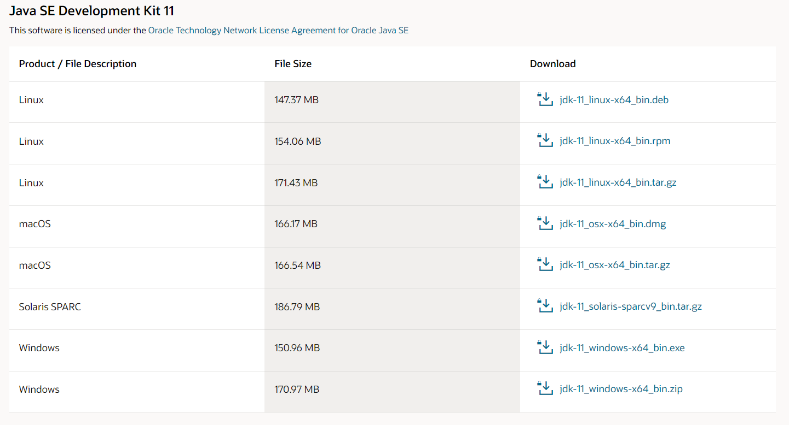
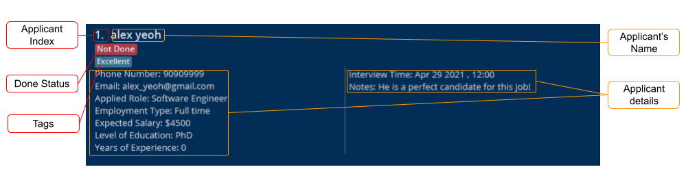
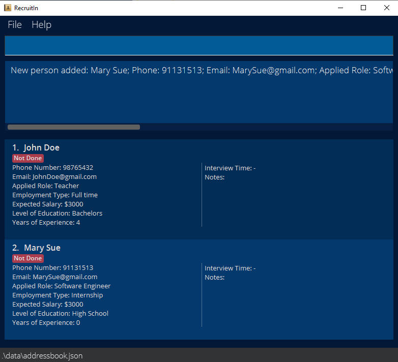
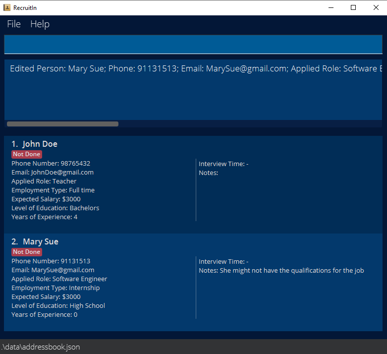
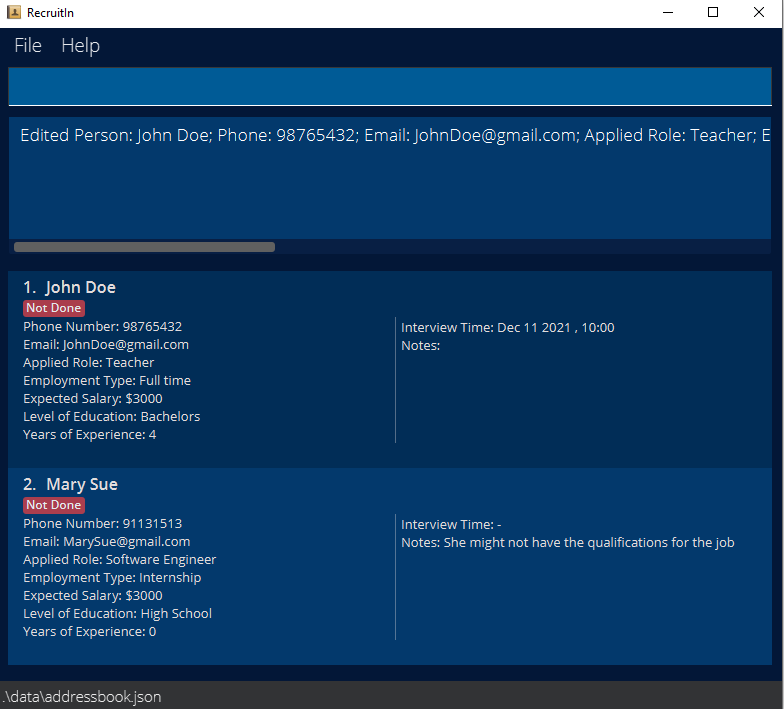
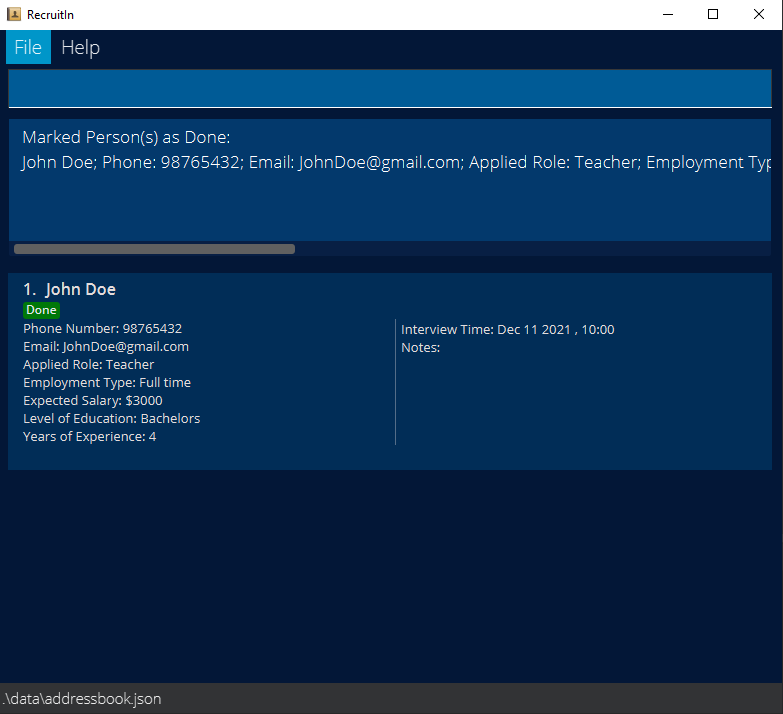
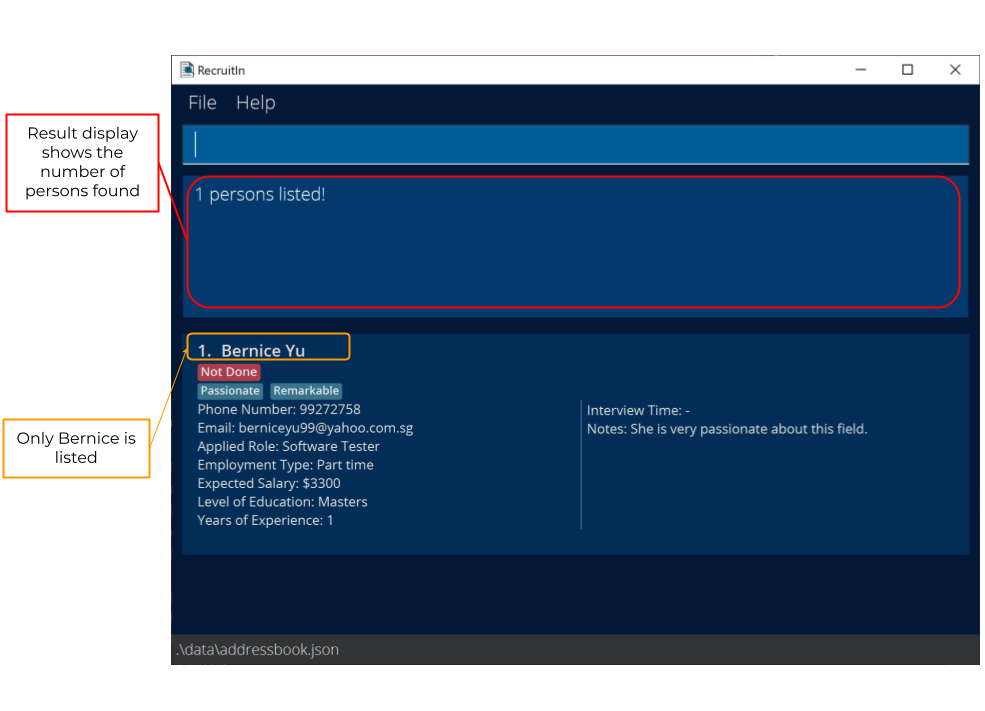
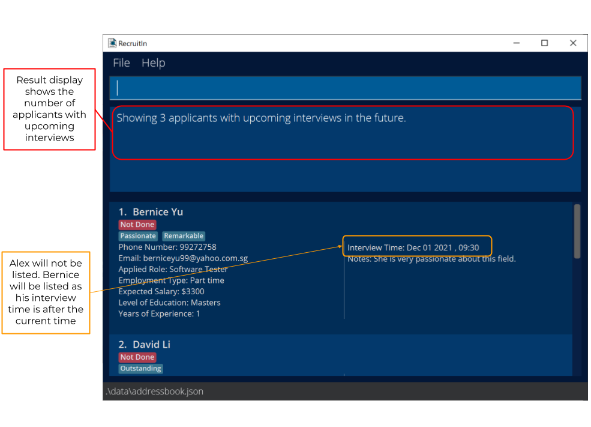
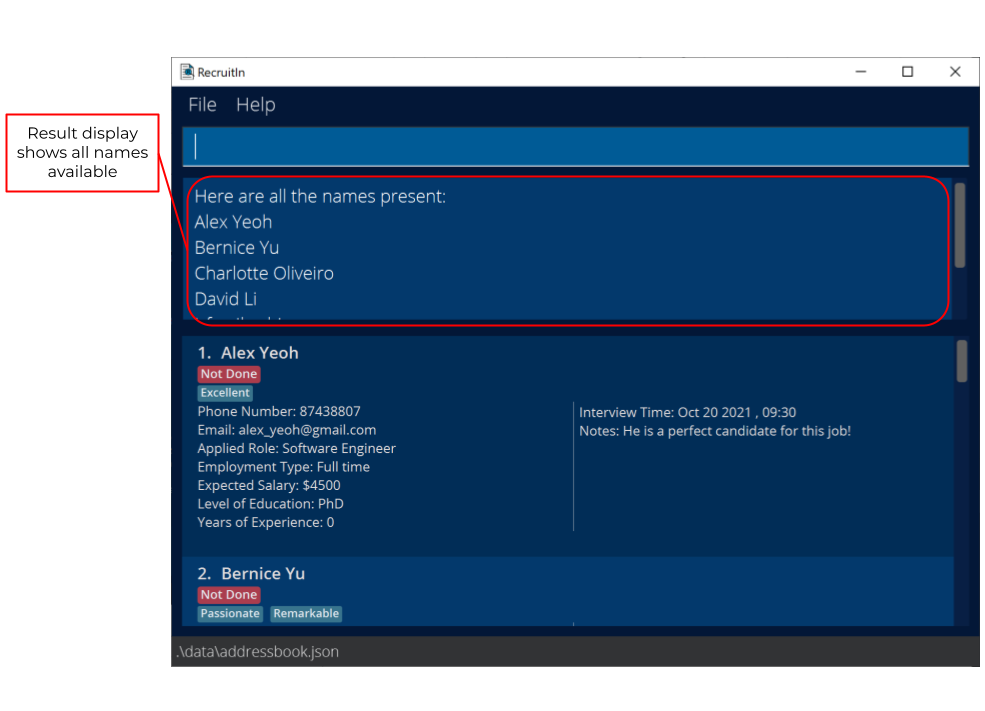
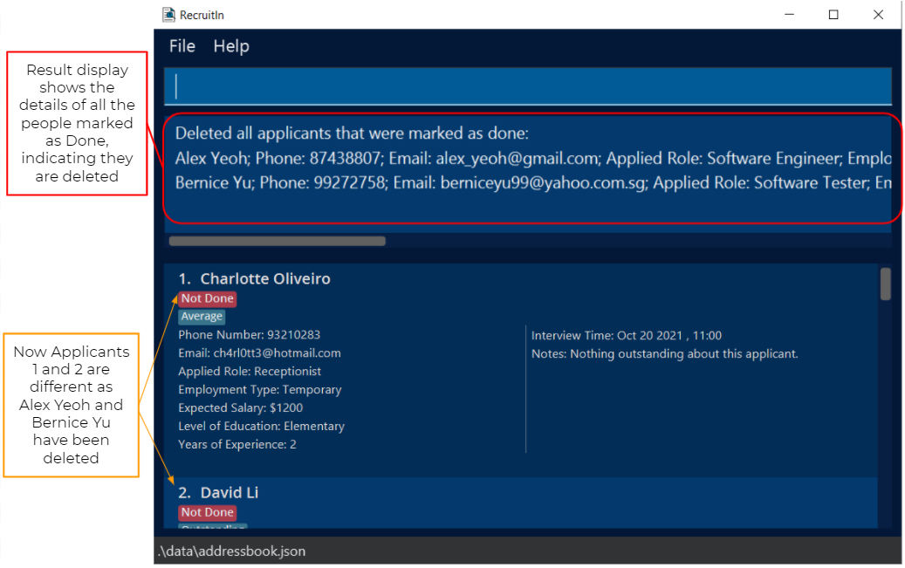

### About RecruitIn


<p align="center">
    
</p>

RecruitIn is a desktop app for recruiters in Singapore to keep track of the plethora of clients with different skill sets, availability and experience. 

It is optimised for quick text-based inputs via a Command Line Interface (CLI) while still having the ease of use of a Graphical User Interface (GUI). 

This product will make recruiters’ lives easier through categorisation and filter features to easily access candidates they have in mind.


### Table of Contents
* [About RecruitIn](#about-recruitin)
* [About this guide](#about-this-guide)
* [Glossary](#glossary)
* [Basic Command Format](#basic-command-format)
* [Quick start](#quick-start)
* [Features](#features)
    + [Viewing help : `help`](#viewing-help--help)
    + [Adding an applicant: `add`](#adding-an-applicant-add)
    + [Editing an applicant: `edit`](#editing-an-applicant--edit)
    + [Listing all applicants : `list`](#listing-all-applicants--list)
    + [Finding an applicant : `find`](#finding-an-applicant--find)
    + [Filtering interviews : `filter_interview`](#filtering-interviews--filter_interview)
    + [Deleting an applicant : `delete`](#deleting-an-applicant--delete)
    + [Showing search terms : `show`](#showing-search-terms--show)
    + [Marking an applicant : `mark`](#marking-an-applicant--mark)
    + [Unmarking an applicant : `unmark`](#unmarking-an-applicant--unmark)
    + [Deleting marked applicants : `delete_marked`](#deleting-marked-applicants--delete_marked)
    + [Clearing all data : `clear`](#clearing-all-data--clear)  
    + [Exiting the program : `exit`](#exiting-the-program--exit)
    + [Saving the data](#saving-the-data)
    + [Editing the data file](#editing-the-data-file)
* [Prefix Parameter Specifications ***{Advanced}***](#prefix-parameter-specifications-advanced)
* [FAQ](#faq)
* [Command summary](#command-summary)


### About this guide
[table of contents](#table-of-contents)

This guide aims to help users get familiar with using RecruitIn's features.
* **New users** can get started by following the steps under [Quick start](#quick-start).
* **Existing users** can view existing features under [Features](#features) or refer to the [Table of Contents](#table-of-contents) below to view specific features. A **summary** of existing features can also be viewed under [Command summary](#command-summary).
* **Advanced users** can view in-depth usage of RecruitIn's features by visiting links marked with ***{Advanced}*** under the [Table of Contents](#table-of-contents).
* Commonly addressed questions can be viewed under [FAQ](#faq).

<div markdown="block" class="alert alert-info">

**:information_source: Note for all users:**<br>

* If this is your **first time** reading this user guide, it is **recommended** that you visit [Glossary](#glossary) & [Features](#features) to familiarize
  yourself with the terminology and text formatting used in this user guide. This will help you better understand the user guide.

* If you still wish to skip directly to the feature descriptions, or if you need a refresher on the important terminologies and text formatting used
  in this user guide, you may visit [Basic Command Format](#basic-command-format).

</div>


### Glossary
[Table of contents](#table-of-contents)

| Term | Definition |
| :---: | :--- |
| **Command Line Interface (CLI)** | A **CLI** is a user interface that accepts text input to execute system functions.<br><br>RecruitIn uses a **CLI** interface to operate most of its features. |
| **Command** | **Commands** are user text inputs that executes certain features of RecruitIn. |
| **Prefix** | A **Prefix** is a fixed text input that indicates an applicant's detail.<br><br>For instance, `n/` is a Prefix that indicates an applicant's name.<br><br>It is used in commands to differentiate user inputs for different applicant details. |
| **Parameter** | A **Parameter** is a user text input that usually follows after a **Prefix**.<br><br>For instance, in `n/John`, `John` is a **Parameter** of **Prefix** `n/`.<br><br>In some cases, it does not have to follow a **Prefix**.<br><br>For instance, in `delete 1`, `1` is a **Parameter** of the `delete` command. |

### Basic Command Format
[Table of contents](#table-of-contents)

Before moving on with this user guide, listed below are some **important** text formatting that you should take
note of so that you may better understand our feature descriptions.

* Words in `UPPER_CASE` are the parameters to be supplied by the user.<br>
  e.g. in add n/NAME, NAME is a parameter which can be used as add n/John Doe.
* Words that are ***bold & italicized*** refers to a stored applicant detail for a certain prefix.<br>
  e.g. ***Name*** could refer to the value `John` stored as a name in the application.
* Items in square brackets are optional.<br>
  e.g. `n/NAME` `[t/TAG]` can be used as n/John Doe t/friend or as n/John Doe.
* Items with `...` after them can be repeated multiple times, including zero times.<br>
  e.g. `delete INDEX...` can be used as `delete 1` (i.e. `INDEX` repeated 0 times), `delete 1 2`, `delete 2 4 3` etc.

--------------------------------------------------------------------------------------------------------------------

## Quick start
[Table of contents](#table-of-contents)

1. Ensure you have Java `11` or above installed in your Computer. If not, you can install it from [here](https://www.oracle.com/sg/java/technologies/javase/jdk11-archive-downloads.html).
Download the correct version based on your operating system (e.g. Linux, macOS, Windows) and follow the Java installation instructions.



<div markdown="span" class="alert alert-info">

    **:information_source: Visit the link and scroll down to find Java SE Development Kit 11 as shown above.**

</div>

2. Download the latest `recruitIn.jar` from [here](https://github.com/AY2122S1-CS2103T-F11-2/tp/releases/tag/v1.3b).
Scroll down to the bottom and click on `recruitIn.jar`.

3. Copy the file to the folder you want to use as the _home folder_.

4. Double-click the file to start the app. The GUI should be similar to the below image. Note how the app contains some sample data.<br>
   
   
   Applicant data are displayed as a list in the **Applicant Panel**.
   

5. Now that your app is set up and running, lets run through a quick sample workflow on managing an applicant:<br><br>

    <div markdown="block" class="alert alert-info">

    **:information_source: Type in your commands into the Command Box and press Enter to execute it.**<br>
    * e.g. typing **`help`** and pressing Enter will open the help window.<br><br>
    </div>

   1. Use **`clear`** command to clear the existing sample data.<br><br>
   2. Suppose you have an applicant named `John Doe` that you have scouted from online sources and want to add him to
      your list of applicants. `John Doe` has kindly provided you his phone number, `98765432` and email `JohnDoe@gmail.com`. He has also
      stated that he is applying for the role of a `Teacher` and plans to work `Full time` with an expected salary of `3000`. His highest level of
      education is `Bachelors` and has `4` years of experience as a teacher. <br><br>
      Type in **`add`**`n/John Doe p/98765432 e/JohnDoe@gmail.com r/Teacher et/Full time s/3000 l/Bachelors y/4` to add `John Doe` to your
      list of applicants.<br><br>
   3. Let's also add in another applicant named `Mary Sue`. Her phone number is `91131513` and her email is `MarySue@gmail.com`. She is applying
      for the role of a `Software Engineer` and is looking for an `Internship` with an expected salary of `3000`. Her highest level of education is `High School`
      and has `0` years of experience as a `Software Engineer`. <br><br>
      Type in **`add`**`n/Mary Sue p/91131513 e/MarySue@gmail.com r/Software Engineer et/Internship s/3000 l/High School y/0`.<br><br>
      Your application should look like this:
      <br><br>
   4. As an experienced recruiter, you notice that `Mary Sue` may not have the qualifications for the job as a `Software Engineer` and want to add
      a note to remind yourself.<br><br>
      Type in **`edit`**`2 nt/She might not have the qualifications for the job` to add the note to `Mary Sue`.<br><br>
      Your application should look like this:
      <br><br>
   5. Your company then informs you that they would like to interview `John Doe` on December 11th 2021 at 10 am `2021-12-11, 10:00` and you want to remind
      yourself that an interview has been arranged for `John Doe`.<br><br>
      Type in **`edit`**`1 i/2021-12-11, 10:00` to add this interview slot to `John Doe`.<br><br>
      Your application should look like this:
      <br><br>
   6. Fast forward the time. Your company informs you that `John Doe` has
      passed his interview and is hired.<br><br>
      Type in **`find`**`n/John Doe p/98765432` to find `John Doe`.<br>
      Type in **`mark`**`1` to mark `John Doe` as done.<br><br>
      <br><br>
   7. Type in **`list`** to go back to your list of applicants.<br><br>
      Type in **`delete_marked`** to remove all applicants marked as done, such as `John Doe`.<br><br>
      Now `John Doe` is removed from your list of applicants.<br><br>

6. Aside from the commands shown in the sample workflow above, you may also find these useful:

    <div markdown="span" class="alert alert-warning">:exclamation: **Caution:**
    The commands given below are not related to the above sample workflow and are given strictly as example usages.
    </div>
   
      * **`delete`**`2` : Deletes the second applicant in your currently displayed list.

      * **`show`**`s/` : Displays all unique expected salaries currently in RecruitIn.

      * **`unmark`**`1` : Unmarks the 1st applicant shown in the list of all applicants.

      * **`filter_interview`**`past` : Displays all applicants whose interviews are in the past, relative to current date and time.

      * **`filter_interview`**`future` : Displays all applicants whose interview are in the future, relative to current date and time.

      * **`exit`** : Exits the app.


7. This marks the end of the Quick Start guide. If you would like to know more about using RecruitIn's features,
   you can refer to the [Features](#features) below for details of available commands.


--------------------------------------------------------------------------------------------------------------------

## Features
[Table of contents](#table-of-contents)

<div markdown="block" class="alert alert-info">

**:information_source: Notes about the command format:**<br>

* Words in `UPPER_CASE` are the parameters to be supplied by the user.<br>
  e.g. in `add n/NAME`, `NAME` is a parameter which can be used as `add n/John Doe`.

* Words that are ***bold & Italicised*** refers to a stored prefix value. 
  e.g. ***Name*** could refer to the value `John` stored as a name in the application.

* Items in square brackets are optional.<br>
  e.g `n/NAME [t/TAG]` can be used as `n/John Doe t/friend` or as `n/John Doe`.

* Items with `…`​ after them can be repeated multiple times, including zero times.<br>
  e.g. `delete INDEX...` can be used as `delete 1` (i.e. `INDEX` repeated 0 times), `delete 1 2`, `delete 2 4 3` etc.

* Parameters can be in any order.<br>
  e.g. if the command specifies `n/NAME p/PHONE_NUMBER`, `p/PHONE_NUMBER n/NAME` is also acceptable.

* If a parameter is expected only once in the command, but you specified it multiple times, only the last occurrence of the parameter will be taken.<br>
  e.g. if you specify `p/12341234 p/56785678`, only `p/56785678` will be taken.

* Extraneous parameters for commands that do not take in parameters (such as `help`, `list`, `exit` and `clear`) will be ignored.<br>
  e.g. if the command specifies `help 123`, it will be interpreted as `help`.

</div>


<div markdown="block" class="alert alert-primary">

**:information_source: Notes about the applicants:**<br>

* Duplicate applicants are not allowed. For two applicants to be duplicate, they must have either the same ***Phone Number*** or ***Email*** or both. <br>
  An error message will show if you attempt to `add` or `edit` applicants in a manner that will lead to duplicate stored applicants.

</div>

### Viewing help : `help`
[Table of contents](#table-of-contents)

Shows a message explaining how to access the help page.


Format: `help`


### Adding an applicant: `add`
[Table of contents](#table-of-contents)

Adds an applicant to RecruitIn.

Format: `add n/NAME p/PHONE_NUMBER e/EMAIL_ADDRESS r/ROLE et/EMPLOYMENT_TYPE s/EXPECTED_SALARY l/LEVEL_OF_EDUCATION y/YEARS_OF_EXPERIENCE [t/TAG] [i/INTERVIEW] [nt/NOTES]​`

* To add multiple tags, multiple `t/` prefixes should be used.
<div markdown="span" class="alert alert-warning">:exclamation: **Caution:**
Providing multiple tag values in a single `t/` prefix will lead to an error. (i.e. `add n/John p/90909090 e/john@gmail.com r/Software Tester et/Full time s/4500 l/High School y/3 t/smart helpful` will lead to an error)
</div>
* Inputs for each prefix is taken as a single value. (i.e. `r/software engineer` has the value `software engineer`)

Examples:
* `add n/Bob p/87654321 e/bob@gmail.com r/Software Engineering et/Full time s/4000 l/High School y/2 i/2021-10-21, 20:00 nt/This applicant has the credentials needed for this job.`
* `add n/John p/90909090 e/john@gmail.com r/Software Tester et/Full time s/4500 l/High School y/3 t/smart t/helpful` to add a person named `John` with two tags `smart` and `helpful`

<div markdown="block" class="alert alert-secondary">
**:information_source: Prefix inputs for `add` command must follow the following input specifications:**<br>

* You may
    * refer to [**Add Parameter Specifications**](#add-parameters) for detailed input specifications.
    * refer to add input specifications for specific prefixes by clicking on relevant links in the table below.

| Input | Prefix | Specifications |
| :---: | :---: | :---: |
| NAME | `n/` | [**name**](#name-n) |
| PHONE_NUMBER | `p/` | [**phone_number**](#phonenumber-p) |
| EMAIL_ADDRESS | `e/` | [**email_address**](#emailaddress-e) |
| ROLE | `r/` | [**role**](#role-r) |
| EMPLOYMENT_TYPE | `et/` | [**employment_type**](#employmenttype-et) |
| EXPECTED_SALARY | `s/` | [**expected_salary**](#expectedsalary-s) |
| LEVEL_OF_EDUCATION | `l/` | [**level_of_education**](#levelofeducation-l) |
| YEARS_OF_EXPERIENCE | `y/` | [**years_of_experience**](#yearsofexperience-y) |
| TAG | `t/` | [**tag**](#tag-t) |
| INTERVIEW | `i/` | [**interview**](#interview-i) |
| NOTES | `nt/` | [**notes**](#notes-nt) |

</div>

### Editing an applicant : `edit`
[Table of contents](#table-of-contents)

Edits an applicant's with specified index in RecruitIn.

Format: `edit INDEX [n/NAME] [p/PHONE_NUMBER] [e/EMAIL_ADDRESS] [r/ROLE] [et/EMPLOYMENT_TYPE]
 [s/EXPECTED_SALARY] [l/LEVEL_OF_EDUCATION] [y/YEARS_OF_EXPERIENCE] [t/TAG] [i/INTERVIEW] [nt/NOTES]`
 
 * Edit command must take at least 1 prefix input.
 * The `INDEX` refers to the index number shown in the displayed applicants list.
 * For `t/` prefix in particular, if **only** a single tag prefix is provided like so `t/` with no values, it will erase
remove tags from the applicant.
<div markdown="span" class="alert alert-warning">:exclamation: **Caution:**
Giving more than 1 tag prefix input with 1 or more having no value will instead lead to an error. (i.e. `edit 1 t/ t/smart` leads to an error)
</div>
 * Inputs for each prefix is taken as a single value. (i.e. `r/software engineer` has the value `software engineer`)

Examples:
* `edit 1 r/Software Engineer` will change the ***role*** of the applicant with the index number 1
* `edit 1 t/` will remove all ***tags***s from the applicant with index number 1
* `edit 1 n/John t/` will change the name of the applicant with index number 1 to `John` and remove all the applicant's ***tag***s

<div markdown="block" class="alert alert-secondary">
**:information_source: Prefix inputs for `edit` command must follow the same input specifications as `add` command:**<br>

* You may 
  * refer to [**Add Parameter Specifications**](#add-parameters) for detailed input specifications.
  * refer to add input specifications for specific prefixes by clicking on relevant links in the table below.

| Input | Prefix | Specifications |
| :---: | :---: | :---: |
| NAME | `n/` | [**name**](#name-n) |
| PHONE_NUMBER | `p/` | [**phone_number**](#phonenumber-p) |
| EMAIL_ADDRESS | `e/` | [**email_address**](#emailaddress-e) |
| ROLE | `r/` | [**role**](#role-r) |
| EMPLOYMENT_TYPE | `et/` | [**employment_type**](#employmenttype-et) |
| EXPECTED_SALARY | `s/` | [**expected_salary**](#expectedsalary-s) |
| LEVEL_OF_EDUCATION | `l/` | [**level_of_education**](#levelofeducation-l) |
| YEARS_OF_EXPERIENCE | `y/` | [**years_of_experience**](#yearsofexperience-y) |
| TAG | `t/` | [**tag**](#tag-t) |
| INTERVIEW | `i/` | [**interview**](#interview-i) |
| NOTES | `nt/` | [**notes**](#notes-nt) |

</div>

### Listing all applicants : `list`
[Table of contents](#table-of-contents)

Shows a list of all applicants in RecruitIn.

Format: `list`


### Finding an applicant : `find`
[Table of contents](#table-of-contents)

The `find` command finds applicants by specific prefixes.

Format: `find [n/NAME] [p/PHONE_NUMBER] [e/EMAIL_ADDRESS] [r/ROLE] [et/EMPLOYMENT_TYPE] [s/EXPECTED_SALARY] [l/LEVEL_OF_EDUCATION] [y/YEARS_OF_EXPERIENCE]  [t/TAG]  [i/INTERVIEW] [nt/NOTES] [d/DONE]`

***Note:*** *As mentioned in [Basic Command Format](#basic-command-format), you can include one or more of the search terms.*

* You can key in parameters in either UPPER CASE or small case. 
* If you key in multiple of the same prefix (e.g. `find n/alex n/bernice`) , the program will only find you applicants based on **the last** prefix (i.e. `n/bernice`).
* You can key in each prefix with **multiple keywords** separated by whitespace, e.g. `n/John Mary`, `t/friend colleague`

<div markdown="block" class="alert alert-warning">

* You can search for tags using multiple keywords by providing your parameters separated by whitespace in a `t/` prefix. (i.e. `find t/smart kind`)
    * This is different from `add` and `edit` commands which require tag parameters to be provided separately. (i.e. `edit 1 t/smart t/kind`)

</div>

* You should not find applicants by a prefix with empty parameters. (i.e. `find d/` will show you all applicants **unfiltered** by their ***done*** status)

Examples:
* `find n/alex n/bernice` finds you all applicants with only `bernice` as values for name prefix.
  
Before: 
After: 


* `find n/John Mary` finds you all applicants with either `John` or `Mary` as values for name prefix.
* `find t/friend colleague` finds you all applicants with `friend` or `colleague` as values for tag prefix.
* `find n/John Mary t/friend colleague`
* `find n/Bob p/87654321 e/bob@gmail.com r/Software Engineering et/Full time s/4000 l/High School y/2 nt/has the credentials d/Not Done`

<div markdown="block" class="alert alert-success">
**:information_source: Prefix parameters for `find` command must follow the following parameter specifications:**<br>

* You may
    * refer to [**Find Parameter Specifications**](#find-parameters) for detailed parameter specifications, or
    * refer to find parameter specifications for a specific prefix by clicking on the relevant link in the table below.

| Parameter | Prefix | Specifications |
| :---: | :---: | :---: |
| NAME | `n/` | [**name**](#name-n-1) |
| PHONE_NUMBER | `p/` | [**phone_number**](#phonenumber-p-1) |
| EMAIL_ADDRESS | `e/` | [**email_address**](#emailaddress-e-1) |
| ROLE | `r/` | [**role**](#role-r-1) |
| EMPLOYMENT_TYPE | `et/` | [**employment_type**](#employmenttype-et-1) |
| EXPECTED_SALARY | `s/` | [**expected_salary**](#expectedsalary-s-1) |
| LEVEL_OF_EDUCATION | `l/` | [**level_of_education**](#levelofeducation-l-1) |
| YEARS_OF_EXPERIENCE | `y/` | [**years_of_experience**](#yearsofexperience-y-1) |
| TAG | `t/` | [**tag**](#tag-t-1) |
| INTERVIEW | `i/` | [**interview**](#interview-i-1) |
| NOTES | `nt/` | [**notes**](#notes-nt-1) |
| DONE | `d/` | [**done**](#done-d) |

</div>
        
### Filtering interviews : `filter_interview`
[Table of contents](#table-of-contents)

The `filter_interview` command filters applicants by interview dates based on whether they are upcoming or have past current date and time.
Differs from ```find i/``` as it is not returning you all applicants with a specific interview date but 
rather all applicants with interviews that fall into the same group (`past` or `future`).

Format: `filter_interview past` or `filter_interview future`

* `filter_interview past` shows you applicants with interviews that were in the past (compared to the current date and time).
* `filter_interview future` shows you applicants with interviews that are coming up in the future (compared to the current date and time).

Before: 
After: 

* You should give either `past` or `future` as a parameter after `filter_interview`, but not both.
* You can type in either UPPER CASE or small case for `past` and `future`.
  

Examples:
* Let's assume that the current time is [29th October 2021, 1600].
* If you type`filter_interview past` or 
 `filter_interview pAsT` in the command box, you are able to see applicants with interviews that were before and including
  [29th October 2021, 1600].
* If you type `filter_interview future` or 
 `filter_interview fUTURE` in the command box, you are able to see applicants with interviews that are after [29th October 2021, 1600].
  

### Deleting an applicant : `delete`
[Table of contents](#table-of-contents)

The `delete` command deletes applicants by their index from the applicants list in RecruitIn.

Format: `delete INDEX...`

***Note:*** *As mentioned in [Basic Command Format](#basic-command-format), you can delete multiple applicants by including one or more indexes here.*

* The `INDEX` refers to the index number shown in the displayed applicants list.
* `INDEX` **must be a positive integer** such as 1, 2, 3, …​
* `INDEX` in RecruitIn **starts from one**.
*  You should type at least one `INDEX`. (i.e. `delete ` is not a valid command)
*  You should not type duplicate `INDEX`s. (i.e. `delete 2 2` is not a valid command)
* You should not type`INDEX` which exceeds the total number of applicants in the displayed applicants list.

Examples:
* After you execute the command `list`, `delete 1` deletes the 1st applicant listed in RecruitIn.
* After you execute the command `find n/John`, `delete 1` deletes the 1st applicant in the results of the `find` command.
* After you execute the command `list`, `delete 1 2` deletes the 1st and 2nd applicants listed in RecruitIn.
  
Before: 
After: 


### Showing search terms : `show`
[Table of contents](#table-of-contents)

The `show` command shows you unique search terms which you can use for a specific prefix.

Format: `show [n/] [p/] [e/] [r/] [et/] [s/] [l/] [y/] [t/]`

***Note:*** *As mentioned in [Basic Command Format](#basic-command-format), you can include any one of the prefixes in square brackets  here.*

* You should type **only 1** prefix that you want the program to show.
    * If you type multiple prefixes after `show`, the program will only show you the unique search terms found for the **first** prefix parameter.

Examples:
* `show i/` will display a list consisting of all interview timings.
* `show n/ i/` will display a list consisting of all names.
    
Before: 
After: 


### Marking an applicant : `mark`
[Table of contents](#table-of-contents)

Every applicant in RecruitIn will have a status of either "Done" or "Not Done".
A "Done" status means that you are done handling the applicant and no longer need to keep their details.
The `mark` command marks the specified applicant(s) in RecruitIn by changing their status to "Done".

Format: `mark INDEX…​`

* RecruitIn marks the applicant at the specified `INDEX`es as "Done".
* `INDEX` refers to the number shown in RecruitIn's displayed applicants list.
* `INDEX` **must be a positive whole number**, i.e. 1, 2, 3, …​
* `INDEX` should not exceed the total number of applicants in RecruitIn's displayed applicants list.
* `INDEX` in RecruitIn **starts from one**.
* You must give at least one `INDEX`. (i.e. `mark ` is not a valid command)
* You cannot give duplicate `INDEX`es. (i.e. `mark 2 2` is not a valid command)
* You cannot mark an applicant that has status "Done".

Examples:
* After using the command `list`, `mark 1` marks the 1st applicant listed in RecruitIn as "Done".

Before: 

After: 

* After using the command `list`, `mark 2 4 6` marks the 2nd, 4th and 6th applicant listed in RecruitIn as "Done".
* After using the command `find n/John`, `mark 1` marks the 1st applicant listed in RecruitIn's results of the `find` command.


### Unmarking an applicant : `unmark`
[Table of contents](#table-of-contents)

Every applicant in RecruitIn will have a status of either "Done" or "Not Done".
A "Not Done" status means that you are still handling the applicant and still need to keep their details.
The `unmark` command unmarks the specified applicant(s) in RecruitIn by changing their status to "Not Done".

Format: `unmark INDEX…​`

* RecruitIn unmarks the applicant at the specified `INDEX`es to "Not Done".
* `INDEX` refers to the number shown in RecruitIn's displayed applicants list.
* `INDEX` **must be a positive whole number**, i.e. 1, 2, 3, …​
* `INDEX` should not exceed the total number of applicants in RecruitIn's displayed applicants list.
* `INDEX` in RecruitIn **starts from one**.
* You must give at least one `INDEX`. (i.e. `unmark ` is not a valid command)
* You cannot give duplicate `INDEX`es. (i.e. `delete 2 2` is not a valid command)
* You cannot unmark an applicant that has status "Not Done".

Examples:
* After using the command `list`, `ummark 1` unmarks the 1st applicant listed in RecruitIn to "Not Done".

Before: 

After: 

* After using the command `list`, `unmark 2 4 6` unmarks the 2nd, 4th and 6th applicant listed in RecruitIn to "Not Done".
* After using the command `find n/John`, `unmark 1` unmarks the 1st applicant listed in RecruitIn's results of the `find` command.


### Deleting marked applicants : `delete_marked`
[Table of contents](#table-of-contents)

The `delete_marked` command deletes all applicants that are currently marked as done.
This provides an easy way for you to delete the data of all applicants you no longer need.

Format: `delete_marked`

Example:

Before: 

After: 


### Clearing all data : `clear`
[Table of contents](#table-of-contents)

Deletes all applicants in RecruitIn.

Format: `clear`

### Exiting the program : `exit`
[Table of contents](#table-of-contents)

The `exit` command causes RecruitIn to close and exit.

Format: `exit`

You can also exit RecruitIn by clicking on the 'X' button found on the top right side of the app. 


### Saving the data
[Table of contents](#table-of-contents)

Whenever you use any command which edits, updates or adds data, RecruitIn automatically saves the data.
You do not need to manually save data with any command. The saved data also automatically loads when the application starts.

### Editing the data file
[Table of contents](#table-of-contents)

RecruitIn saves the applicant data as a String in `/data/applicants.json`.
If you are advanced enough, you are welcome to update data directly by editing this data file.

Example of the format of how data is saved for an applicant:

```JSON
{
  "persons": [
    {
      "name" : "Alice Yeoh",
      "phone" : "87438807",
      "email" : "alexyeoh@example.com",
      "role" : "Software Engineering",
      "employmentType" : "Full time",
      "expectedSalary" : "3600",
      "levelOfEducation" : "High School",
      "experience" : "2",
      "tagged" : [],
      "interview" : "-",
      "notes" : "This applicant is a suitable candidate for the job!",
      "done": "Not Done"
    }
  ]
}
```
<div markdown="span" class="alert alert-warning">:exclamation: **Caution:**
If your changes to the data file makes the data format invalid, RecruitIn will remove all saved data and start with an empty data file the next time you open the app.
</div>

--------------------------------------------------------------------------------------------------------------------

## Prefix Parameter Specifications ***{Advanced}***

**Note**: **Alphanumeric** characters refers specifically to characters a-z, A-Z and 0-9.

### Add Parameters
[Table of contents](#table-of-contents)

<div markdown="block" class="alert alert-secondary">

* Return to [**Add**](#adding-an-applicant-add).
* Return to [**Edit**](#editing-an-applicant--edit).

* ##### NAME `n/`
    * A NAME parameter should only contain alphanumeric characters. You can have spaces in between words.
    * For example:
        * NAME parameters such as `John`, `Mary Sue` and `9ine 6ix` are acceptable.
        * NAME parameters such as `J@hn`, `Mary S^e` and `B{}b` are not acceptable.
    
* ##### PHONE_NUMBER `p/`
    * A PHONE_NUMBER parameter should contain a minimum of 3 digits. You cannot input any characters other than the digits 0-9.
    * For example:
        * PHONE_NUMBER parameters such as `99999999` and `999` are acceptable.
        * PHONE_NUMBER parameters such as `9999 9999` and `88` are not acceptable.
    
* ##### EMAIL_ADDRESS `e/`
    * An EMAIL_ADDRESS parameter should contain a **local part** and a **domain part**, separated by the `@` character. (i.e. ***local part***@***domain part***)
    * **Local part specifications**:
        * Your local part must **start with** and **end with** an alphanumeric character.
        * You can separate alphanumeric characters with any one of these characters: `+_.-`. (i.e. `John-a-bc`)
    * **Domain part specifications**:
        * Your domain part must contain **at least 2** domain labels, with each domain label separated by a `.`.
        * You must start and end each domain label with an alphanumeric character.
        * Within each domain label, you can separate alphanumeric characters with `-`. (i.e. `John@u-u.sg`)
        * Each domain label must have **at least 1** alphanumeric character, **except the final domain label**
          which must have **at least 2** alphanumeric characters. (i.e. `John@u.sg` is valid)
    * For example:
        * EMAIL_ADDRESS parameters such as `PeterJack_1190@example.com` and `e1234567@u.nus.edu` are acceptable.
        * EMAIL_ADDRESS parameters such as `peterjack@example.c` and `peter..jack@example.com` are unacceptable.
    
* ##### ROLE `r/`
    * A ROLE parameter should only contain **alphanumeric** characters. You can have spaces in between words.
    * For example:
        * ROLE parameters such as `Software Engineer` and `Sales Assistant` are acceptable.
        * ROLE parameters such as `Softw@re Engin^^r` and `Day + Night Security Guard` are not acceptable.
    
* ##### EMPLOYMENT_TYPE `et/`
    * An EMPLOYMENT_TYPE parameter should be one of the following: `Full time`, `Part time`, `Temporary` or `Internship`.
    * An EMPLOYMENT_TYPE is **case-insensitive**.
    * For example:
        * EMPLOYMENT_TYPE parameters such as `Full time` and `Internship` are acceptable.
        * EMPLOYMENT_TYPE parameters such as `fUlL tiMe` and `iNtErnShIP` are acceptable.
        * EMPLOYMENT_TYPE parameters such as `Long term` are not acceptable.
    
* ##### EXPECTED_SALARY `s/`
    * An EXPECTED_SALARY parameter should only be **non-negative whole numbers**.
        * An EXPECTED_SALARY can range from 0 to 2^(31) - 1 inclusive.
    * For example:
        * EXPECTED_SALARY parameters such as `0` and `3500` are acceptable.
        * EXPECTED_SALARY parameters such as `-600` and `~350` are not acceptable.
    
* ##### LEVEL_OF_EDUCATION `l/`
    * A LEVEL_OF_EDUCATION parameter should be one of the following: `Elementary`, `Middle School`, `High School`, `University`, `Bachelors`, `Masters` or `PhD`.
    * A LEVEL_OF_EDUCATION is **case-insensitive**.
    * For example:
        * LEVEL_OF_EDUCATION parameters such as `Middle School` and `PhD` are acceptable.
        * LEVEL_OF_EDUCATION parameters such as `miDDlE scHoOL` and `phD` are acceptable.
        * LEVEL_OF_EDUCATION parameters such as `Kindergarten` are not acceptable.
    
* ##### YEARS_OF_EXPERIENCE `y/`
    * A YEARS_OF_EXPERIENCE parameter should be a **non-negative number** with intervals of **0.5** 
      * A YEARS_OF_EXPERIENCE can be at most **67** (re-employment age in Singapore).
    * For example:
        * YEARS_OF_EXPERIENCE parameters such as `0` and `10` are acceptable.
        * YEARS_OF_EXPERIENCE parameters such as `0.5` and `3.0` are acceptable.
        * YEARS_OF_EXPERIENCE parameters such as `-1`, `3.1`, and `100` are not acceptable.
    
* ##### TAG `t/`
    * A TAG parameter should only contain alphanumeric characters. You **cannot** have spaces in between words.
    * For example:
        * TAG parameters such as `friends` and `colleagues` are allowed.
        * TAG parameters such as `best friends`, `old colleagues` and `seni@r` are not allowed.
    
* ##### INTERVIEW `i/`
    * An INTERVIEW parameter should be a legitimate date and follow the DateTime format `yyyy-M-d, H:m`. 
      * The format for Year is strictly 4 digits while others (i.e. Month, Day, Hours, Minutes) can be either 1 or 2 digits.
    * For example:
        * INTERVIEW parameters such as `2021-08-09, 13:00` and `2022-1-3, 3:00` are acceptable.
        * INTERVIEW parameters such as `morning`, `2021.10.21`, `2021-10-22 13:00` and `2021-02-30, 10:30` (not an existing date) are not acceptable.
    
* ##### NOTES `nt/`
    * A NOTES parameter can contain any character, number or symbol as there are no restrictions in place.
    * For example:
        * NOTES parameters such as `This candidate is good!` and `@Applicant123 is suitab13 for th3 job!` are acceptable.

</div>

### Find Parameters
[Table of contents](#table-of-contents)

<div markdown="block" class="alert alert-success">

* Return to [**Find**](#finding-an-applicant--find)

:information_source: Note that keywords refer to the words separated by whitespace in your parameters for each category. 
For example, if your input is `find n/Alex Bernice`, `Alex` and `Bernice` are your keywords in your NAME parameter.<br>

* ##### NAME `n/`
    * A NAME parameter matches with an existing stored ***Name*** only if **at least 1** keyword is equal to **at least 1** word in the ***Name***.
    * All the keywords that you provide in your NAME parameter must comply with the parameter specifications for add given [**here**](#name-n).
    * For example:
        * A `John` parameter can match with ***Name***s such as `John Tan` or `John Lee`.
        * A `John Mary` parameter can match with ***Name***s such as `Mary John`, `Mary Lee` or `Long John`.

* ##### PHONE_NUMBER `p/`
    * A PHONE_NUMBER parameter matches with an existing stored ***Phone Number*** only if **at least 1** keyword is equal to the ***Phone Number***.
    * All the keywords that you provide in your PHONE_NUMBER parameter must comply with the parameter specifications for add given [**here**](#phonenumber-p).
    * For example:
        * A `99999999` parameter can only match with ***Phone Number***s that are `99999999`.
        * A `99999999 88888888` parameter can only match with ***Phone Number***s that are `99999999` and `88888888`.

* ##### EMAIL_ADDRESS `e/`
    * An EMAIL_ADDRESS parameter matches with an existing stored ***Email Address*** only if **at least 1** keyword is equal to the ***Email Address***.
    * All the keywords that you provide in your EMAIL_ADDRESS parameter must comply with the parameter specifications for add given [**here**](#emailaddress-e).
    * For example:
        * A `alexyeoh@example.com` parameter can match with ***Email Address***es such as `alexyeoh@example.com`.
        * A `alexyeoh@example.com marysue@gmail.com` parameter can match with ***Email Address***es such as `alexyeoh@example.com`
          and `marysue@gmail.com`.

* ##### ROLE `r/`
    * A ROLE parameter matches with an existing stored ***Role*** only if the **entire** input is **contained** in the ***Role***.
    * All the keywords that you provide in your ROLE parameter must comply with the parameter specifications for add given [**here**](#role-r).
    * For example:
        * A `Software` parameter can match with ***Role***s such as `Software Engineer`, `Software` or `Software Developer`
        * A `Software Engineer` parameter can match with ***Role***s such as `Software Engineer` or `Senior Software Engineer`
          but not with ***Role***s such as `Software` or `Software Developer`.

* ##### EMPLOYMENT_TYPE `et/`
    * An EMPLOYMENT_TYPE parameter matches with an existing stored ***Employment Type*** only if the ***Employment Type*** **starts with** any of the keywords.
    * All possible ***Employment Type*** terms that comply with the parameter specifications for add are given [**here**](#levelofeducation-l). Keywords that you provide as a LEVEL_OF_EDUCATION 
      parameter must be words that these terms start with.
    * For example:
        * A `Full time` or `full time` or `full` parameter will match only with ***Employment Type***s that are ```Full time```
        * A ```Full part``` parameter will match with all ***Employment Type***s that are ```Full time``` and ```Part time```
        * A ```temp Intern``` parameter will match with all ***Employment Type***s that are ```Temporary``` and ```Internship```
        * A ```full time bob``` parameter is invalid as ```bob``` is not a word that any of the possible ***Employment Type*** terms start with.

* ##### EXPECTED_SALARY `s/`
    * An EXPECTED_SALARY parameter matches with an existing stored ***Expected Salary*** only if **at least 1** keyword is within a range of `500` from the ***Expected Salary***.
    * All the keywords that you provide in your EXPECTED_SALARY parameter must comply with the parameter specifications for add given [**here**](#expectedsalary-s).
    * For example:
        * A `3000` parameter can match with ***Expected Salary***s that range from `2500` to `3500` inclusive.
        * A `2500 5000` parameter can match with ***Expected Salary***s from the ranges `2000` to `3000` inclusive, and `4500` to `5500` inclusive.

* ##### LEVEL_OF_EDUCATION `l/`
    * A LEVEL_OF_EDUCATION parameter matches with an existing stored ***Level of Education*** only if the ***Level of Education*** **starts with** any of the keywords.    
    * All possible ***Level of Education*** terms that comply with the parameter specifications for add are given [**here**](#levelofeducation-l). Keywords that you provide as a LEVEL_OF_EDUCATION 
      parameter must be words that these terms start with.
    * For example:
        * A `H` parameter will match with ***Level of Education***s that are `High School`, but not with ***Level of Education***s that are `PhD`.
        * A `High School` parameter will match with all ***Level of Education***s that are `High School`, but not with ***Level of Education***s that are `Middle School`.
        * A `High Middle` parameter will match with all ***Level of Education***s that are `High School` and `Middle School`.
        * A `High School bob` parameter is invalid as `bob` is not a word that any of the possible ***Level of Education*** terms start with.

* ##### YEARS_OF_EXPERIENCE `y/`
    * A YEARS_OF_EXPERIENCE parameter matches with an existing stored ***Years Of Experience*** only if **at least 1** keyword is greater than or equal to the ***Years Of Experience***.
    * All the keywords that you provide in your YEARS_OF_EXPERIENCE parameter must comply with the parameter specifications for add given [**here**](#yearsofexperience-y).
    * For example:
        * A `3` parameter can match with ***Year Of Experience***s that are greater than or equal to `3`.
        * A `2 3` parameter can match with ***Year Of Experience***s that are greater than or equal to `2`.

* ##### TAG `t/`
    * Each applicant can have multiple stored ***Tag***s.
    * A TAG parameter matches with an applicant's set of ***Tag***s only if **at least 1** keyword is **exactly equals** to **at least 1** ***Tag*** within the applicant's set of ***Tag***s.
    * All the keywords that you provide in your TAG parameter must comply with the parameter specifications for add given [**here**](#tag-t).
    * For example:
        * An `old` parameter can match with applicants that have the ***Tag*** `old`, even if they have other tags.
        * An `experienced old` parameter can match with applicants that have the ***Tag*** `experienced`, or `old`, or both, even if they have other tags.

* ##### INTERVIEW `i/`
    * An INTERVIEW parameter matches with an existing stored ***Interview*** only if the keyword is a whole word (i.e. separated by space) contained in the ***Interview***.
    * All the keywords that you provide in your INTERVIEW parameter must comply with the displayed format (e.g. 20 Mar 2021, 10:30).
      
    * For example:
        * A `2021` parameter can match with applicants that have their ***Interview***s in the year 2021.
        * A `20:21` parameter can match with applicants that have their ***Interview***s at the time 20:21 on any date.
        * A `mar` parameter can match with applicants that have their ***Interview***s in March.
        * However, a `9:30` parameter cannot be matched with the ***Interview*** displayed as `20 Mar 2021, 09:30` (as 9:30 is not the whole word that is displayed, but 09:30 is).

* ##### NOTES `nt/`
    * A NOTES parameter matches with an existing stored ***Notes*** only if the **entire** input is **contained** in the ***Notes***.
    * All the keywords that you provide in your NOTES parameter must comply with the parameter specifications for add given [**here**](#notes-nt).
    * For example:
        * A `good in this field` parameter can match with applicants that have ***Notes*** containing `good in this field`.
        * A `passionate` parameter can match with applicants that have ***Notes*** such as `passionate but inexperienced` and `passionate and experienced`.

* ##### DONE `d/`
    * A DONE parameter can only be either `Done` or `Not Done`.  
    * For example:
        * A `Done` parameter can match with applicants that have their ***Done*** status marked as Done.
        * A `Not Done` parameter can match with applicants that have their ***Done*** status unmarked as Not Done.
        * Any other non-empty input is considered invalid.

</div>

--------------------------------------------------------------------------------------------------------------------

## FAQ
[Table of contents](#table-of-contents)

**Q**: How do I transfer my data to another computer?<br>
**A**: Install the app in the other computer and overwrite the empty data file it creates with the data file that your previous RecruitIn home folder contains.

**Q**: How do I reset the app and get back all the sample data?<br>
**A**: Navigate into the data file in your RecruitIn home folder, and delete the file `addressbook.json`.

**Q**: How do I know if I have the right version of Java installed (i.e. Java 11 or above)?<br>
**A**: Open up your terminal , type `java -version` and press enter. You should see a variant of Java 11 or above (for example `java version "11.0.9"`). 
If you do not know how to open up your terminal, refer to the next question below.

**Q**: How do I open up my terminal?<br>
**A**: There are different ways to open up your terminal, depending on what operating system you use.

* **MacOS**: 
  1. Open Spotlight Search by clicking on the magnifying glass icon in the upper-right corner of your desktop (or press `Command + Space` on your keyboard)
  2. Type in `terminal` into the Spotlight Search bar and press return.
    
* **Windows**:
  1. Press `Windows key + R` on your keyboard and press enter.
  2. Type `cmd` and press enter.
    
* **Linux**:
  1. Press `ctrl + alt + T` on your keyboard.

--------------------------------------------------------------------------------------------------------------------

## Command summary
[Table of contents](#table-of-contents)

Action | Format, Examples
--------|------------------
**Help** | `help`
**Add** | `add n/NAME p/PHONE_NUMBER e/EMAIL_ADDRESS r/ROLE et/EMPLOYMENT_TYPE s/EXPECTED_SALARY l/LEVEL_OF_EDUCATION y/YEARS_OF_EXPERIENCE [t/TAG] [i/INTERVIEW] [nt/NOTES]​` <br> e.g., `add n/Bob p/87654321 e/bob@gmail.com r/Software Engineering et/Full time s/4000 l/High School y/2 t/friend i/2021-10-21, 20:00 nt/This applicant is a good candidate for the job!`
**Edit** | `edit INDEX [n/NAME] [p/PHONE_NUMBER] [e/EMAIL_ADDRESS] [r/ROLE] [et/EMPLOYMENT_TYPE] [s/EXPECTED_SALARY] [l/LEVEL_OF_EDUCATION] [y/YEARS_OF_EXPERIENCE] [t/TAG] [i/INTERVIEW] [nt/NOTES]` <br> e.g., `edit 1 p/90909090 s/4500`
**List** | `list`
**Delete** | `delete INDEX...`<br> e.g., `delete 3 2 5 4`
**Find** | `find [n/NAME] [p/PHONE_NUMBER] [e/EMAIL_ADDRESS] [r/ROLE] [et/EMPLOYMENT_TYPE] [s/EXPECTED_SALARY] [l/LEVEL_OF_EDUCATION] [y/YEARS_OF_EXPERIENCE] [t/TAG] [i/INTERVIEW] [nt/NOTES] [d/DONE]`<br> e.g., `find n/John Mary`
**Filter interviews** | `filter_interview past` or `filter_interview future`
**Show** | `show [n/] [p/] [e/] [r/] [et/] [s/] [l/] [y/] [t/]`<br> e.g., `show r/ n/`
**Mark** | `mark INDEX…​`<br> e.g., `mark 3`
**Unmark** | `unmark INDEX…​`<br> e.g., `unmark 3`
**Delete marked** | `delete_marked`
**Clear**| `clear`
**Exit** | `exit`
