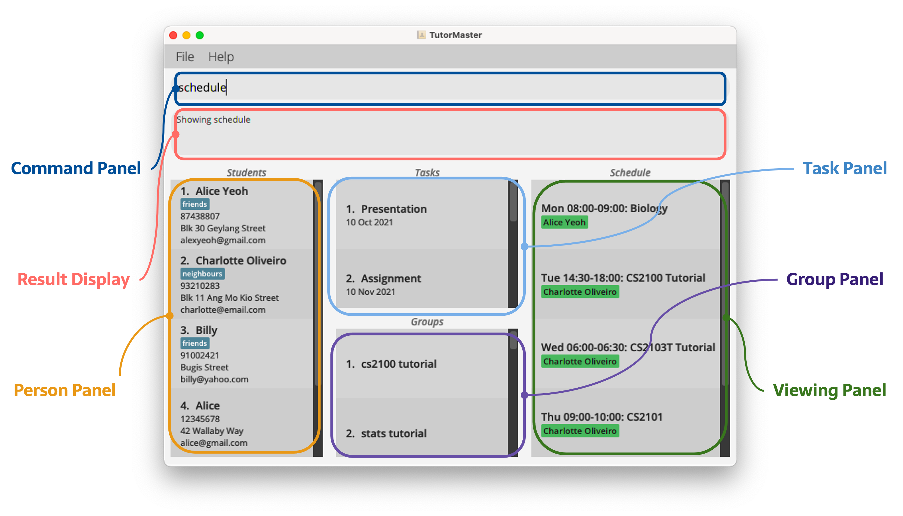
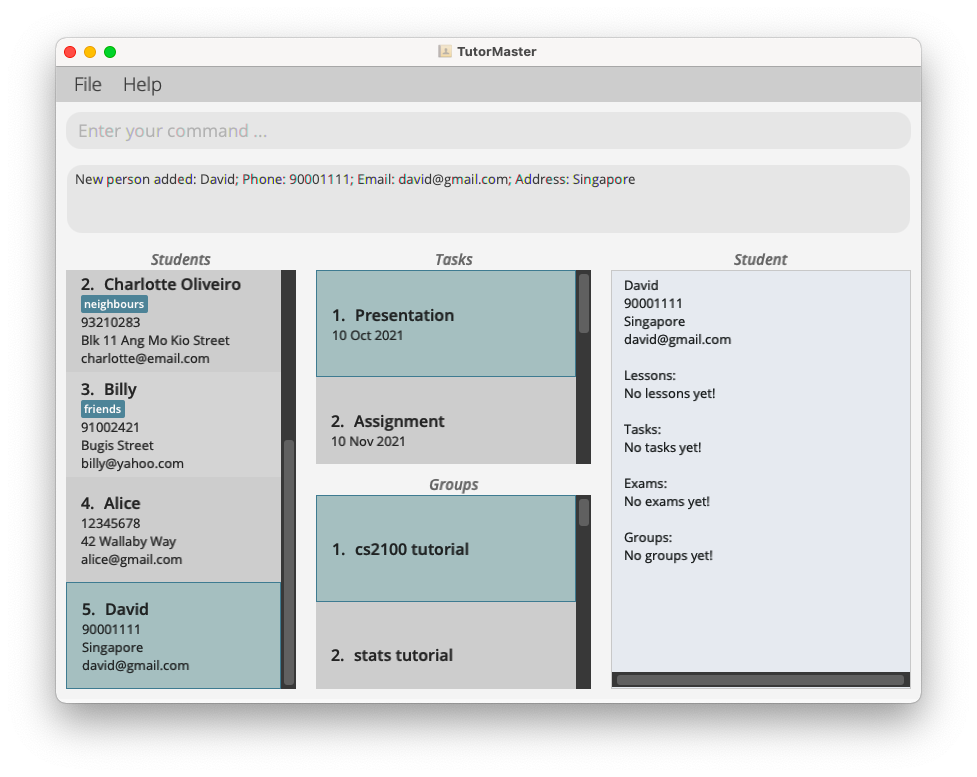
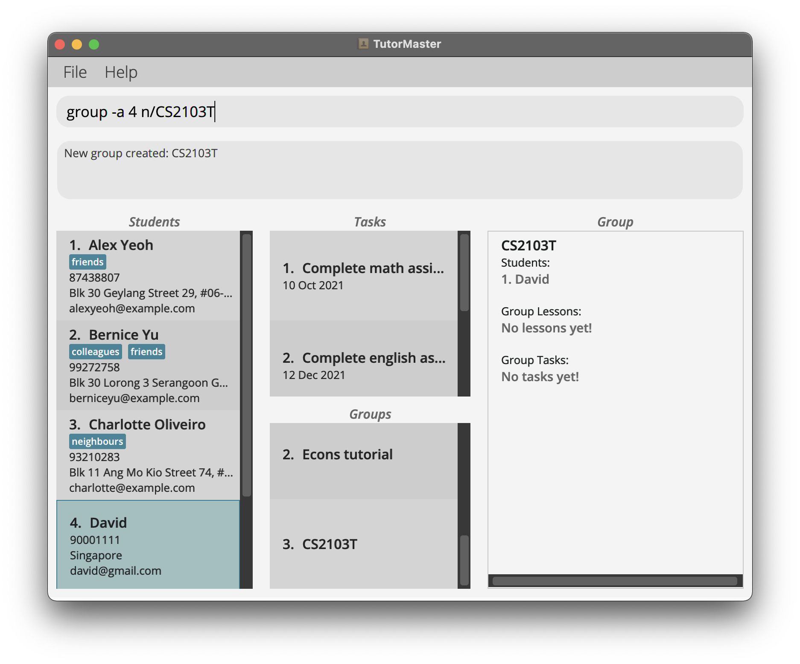
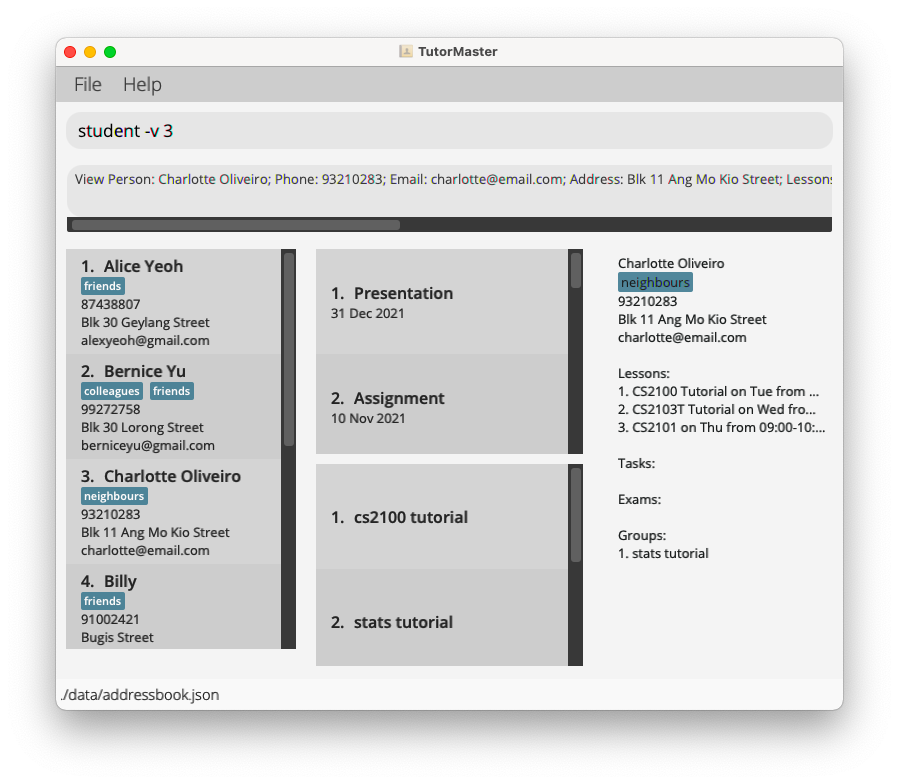
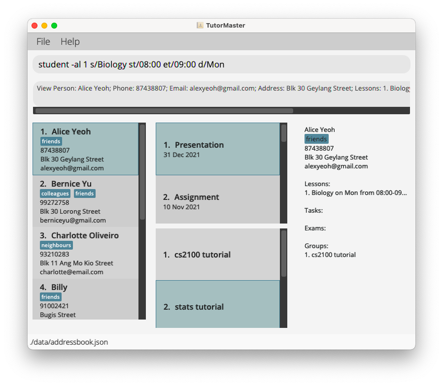
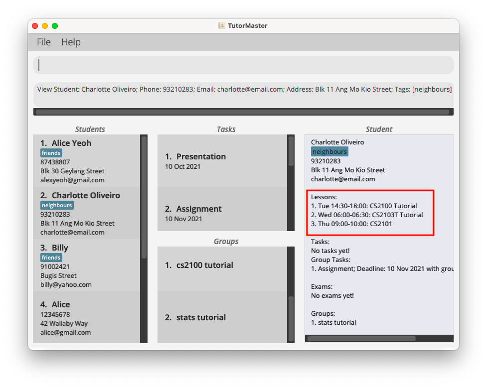
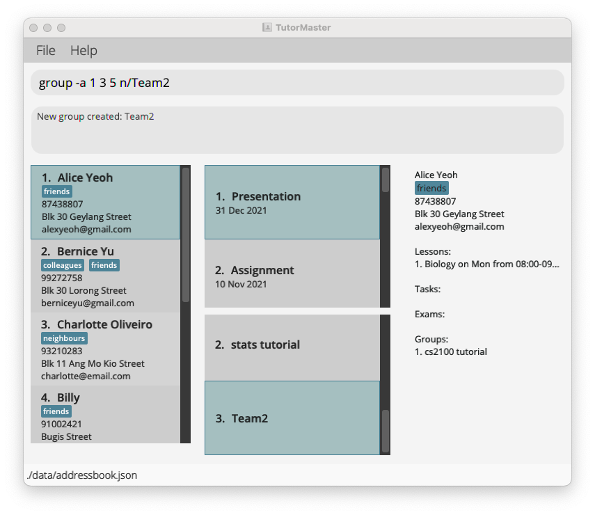
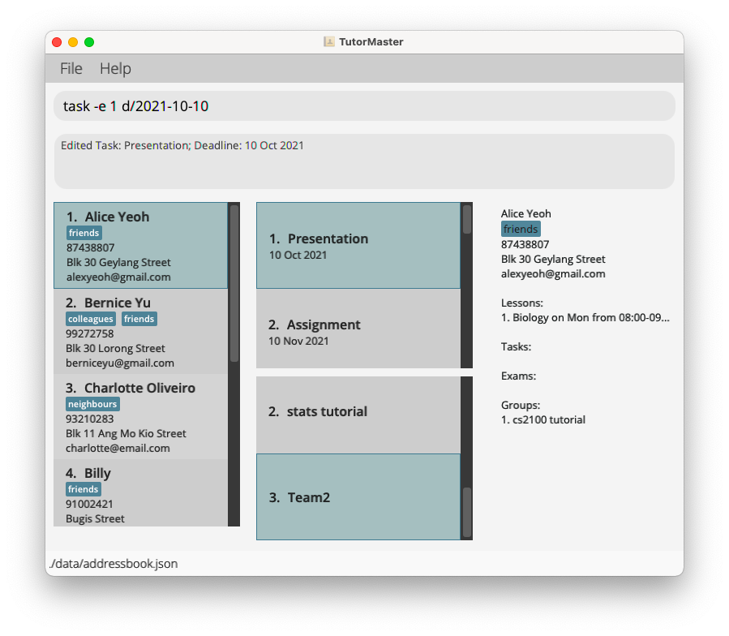
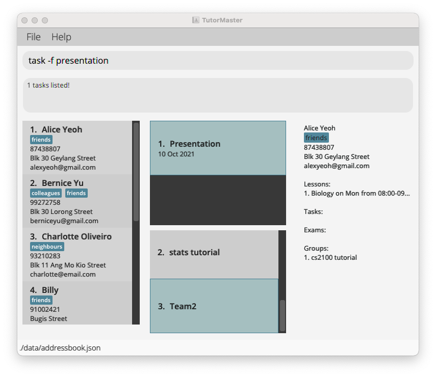

* Table of Contents
{:toc}

--------------------------------------------------------------------------------------------------------------------

## Introduction 

TutorMaster is a desktop app for freelance tutors to manage their students’ details and related tasks. It is optimised for use via a Command Line Interface (CLI) while still benefiting from a Graphical User Interface (GUI).

## Installation Guide

1. Ensure you have Java `11` or above installed in your Computer. You can also install it [here](https://www.oracle.com/sg/java/technologies/javase/jdk11-archive-downloads.html)

2. Download the latest `tutormaster.jar`.

3. Copy the file to the folder you want to use as the home folder for your TutorMaster.

4. Double-click the file to start the app. 
    * If you are a Mac user, open Terminal and navigate to the directory with Tutor Master.
   Type `java -jar tutormaster.jar` and run the command.
    * The GUI similar to below should appear in a few seconds. Note how the app contains some sample data. 

   

## UI of Tutor Master

   

The UI consists of a:
* Command Panel - To enter commands to be executed
* Result Display - Displays result of executed command
* Person Panel - Displays all added persons
* Task Panel - Displays all added tasks
* Group Panel - Displays all added groups 
* Viewing Panel - Displays either the schedule, group or person to be viewed

## Quick Start

Now that you have installed Tutor Master, let us give it a try!

Type any command in the "Command Panel" and hit `Enter` to execute it.

Here are some starting commands to help you navigate around the application:

Let us 
* Create a student named "David" 
* Add him to a group named "CS2103T" 
* Add and assign a task named "CS2103T Project" to "David".

### Managing Students

Since the goal is to manage students, let's start by adding a new student to the address book.
Let's try adding a student with the following details:
* Name: David
* Phone Number: 90001111
* Email: david@gmail.com
* Address: Singapore

1. Type the command `student -a n/David p/90001111 e/david@gmail.com a/Singapore` and hit `Enter`.
   * This adds a student with the details specified.
   * You will now be able to see __David__ at the entry in the person panel on the left,
   as shown in the image below.
   
 
     
2. Now lets try editing his address. Note the index number beside his name in the person panel, in this case it is 5. 
   Type the following command `student -e 5 a/Kent Ridge` and hit `Enter`.
   * This updates the address of David, who is at index __5__ to "Kent Ridge".
   * Note that the other details are unchanged, you can choose which fields you want to edit.
 

3. You can add a lesson to David. Let's assign a __Math__ lesson from __10:00__ to __12:00__ on __Friday__.  
   Type the following command `student -al 5 s/Math st/10:00 et/12:00 d/Fri` and hit `Enter`.
   * This adds a lesson to David with the given details.
   * You can view your schedule for the week by entering `schedule`, try it!
 
     

4. If you wish to view more details of a student, you can use the student view command. 
   Type `student -v 5` in the Command Panel and hit `Enter`.
    * Displays the student at `INDEX` 5 in the "Viewing Panel"

### Managing Groups

Let us now add "David" to a group named "CS2103T".

1.  Type `group -a 5 n/CS2103T` in the "Command Panel" and hit `Enter`
    * Takes "David" who is at `INDEX` 5 in the "Person Panel" and creates a group named "CS2103T"
    * "CS2103T" is now added to the "Group Panel". It has an `INDEX` of 3 in the "Group Panel"
    * This group currently has "David" inside
      
      
2. Type `group -v 3` in the "Command Panel" and hit `Enter`
    * Displays the group at `INDEX` 3 in the "Viewing Panel"

### Managing Tasks

// to be added

You can refer to the [Features](#features) below for details of each command.

--------------------------------------------------------------------------------------------------------------------

## Features

**:information_source: Notes about the command format:** 

* Words in `UPPER_CASE` are the parameters to be supplied by the user. 
  * e.g. in `add n/NAME`, `NAME` is a parameter which can be used as `add n/John Doe`.

* Items in square brackets `[]` are optional. 
  e.g `n/NAME [t/TAG]` can be used as `n/John Doe t/friend` or as `n/John Doe`.

* Items with `…`​ after them can be used multiple times including zero times. 
  e.g. `[t/TAG]…​` can be used as ` ` (i.e. 0 times), `t/friend`, `t/friend t/family` etc.

* Parameters can be in any order. 
  e.g. if the command specifies `n/NAME p/PHONE_NUMBER`, `p/PHONE_NUMBER n/NAME` is also acceptable.

* If a parameter is expected only once in the command but you specified it multiple times, only the last occurrence of the parameter will be taken. 
  e.g. if you specify `p/12341234 p/56785678`, only `p/56785678` will be taken.

* Extraneous parameters for commands that do not take in parameters (such as `help`, `list`, `exit` and `clear`) will be ignored. 
  e.g. if the command specifies `help 123`, it will be interpreted as `help`.

* `INDEX` parameters are very common in this application. Ensure that they are a positive integer and is less than 2,147,483,648.

--------------------------------------------------------------------------------------------------------------------
### Students

#### Adding a student: `student -a`

Adds a student to the Person Panel.

Format: `student -a n/NAME p/PHONE_NUMBER e/EMAIL a/ADDRESS [t/TAG]…​`

* Adds a student with the specified `NAME`
* `-a` refers to the add command
* Two students are considered the same if all their names, phone numbers and emails are the same. It is a requirement that **same students can not be added to the app simultaneously**.

Examples:
* `student -a n/John p/12345678 e/john@mail.com a/42 Wallaby Way, Sydney` 
  adds a student with the name John, phone number 12345678, email john@mail.com and address at 42 Wallaby Way, Sydney
* `student -a n/Barbara p/12344321 e/barber@gmail.com a/123 Sesame Street t/graduate t/actress` 
  adds a student with the name Barbara, phone number 12344321, email barber@gmail.com, address at 123 Sesame Street, and tags graduate and actress

#### Viewing a student: `student -v`

Views a particular student's details in the Person Panel.

Format: `student -v INDEX`

* Views the student detail specified at `INDEX`. `INDEX` should be a positive number.
* `-v` refers to the view command.

Examples:
* `student -v 3` view the student detail at index 3.

#### Editing a student: `student -e`

Edits the detail of a student in the Person Panel.

Format: `student -e INDEX [n/NAME] [p/PHONE_NUMBER] [e/EMAIL] [a/ADDRESS] [t/TAG]…​`

* Edits the detail of the student specified by the `INDEX`. `INDEX` should be a
  positive number and refers to the index number of a student in the list of students.
* `-e` refers to the edit command
* It is a requirement that **at least one of the optional fields should be provided**.

Example:

* `student -e 3 p/88888888 e/johnny@mail.com` Edits the phone number and email
  address of the third student in the student list to 88888888 and johnny@mail.com
  respectively.

#### Deleting a student: `student -d`

Deletes the specific student in the Person Panel.

Format: `student -d INDEX`

* Deletes the student specified by the `INDEX`.
* `-d` refers to the edit command
* `INDEX` should be a positive number and refers to the index number of a student in the list of students.

Examples:

* `student -d 3` deleted the third student in the persons list

#### Listing all students : `list`

Shows a list of all students in the Person Panel.

Format: `list`

#### Locating students by name: `student -f`

Finds students whose names contain any of the given keywords.

Format: `student -f KEYWORD…​`

* The search is case-insensitive. e.g `hans` will match `Hans`
* The order of the keywords does not matter. e.g. `Hans Bo` will match `Bo Hans`
* Only the name is searched.
* Only full words will be matched e.g. `Han` will not match `Hans`
* Persons matching at least one keyword will be returned (i.e. `OR` search).
  e.g. `Hans Bo` will return `Hans Gruber`, `Bo Yang`

Examples:
* `student -f John` returns `john` and `John Doe`
* `student -f alex david` returns `Alex Yeoh`, `David Li` 

#### Adding a lesson to a student: `student -al`

Adds a lesson to the specific student

Format: `student -al INDEX s/SUBJECT st/START_TIME et/END_TIME d/DAY`

* Adds a lesson to the student specified by the `INDEX`.
* `SUBJECT` takes in any input with at least one alphanumeric character.
* `DAY` takes in the following inputs: `Mon Tue Wed Thu Fri Sat Sun`.
* `START_TIME` and `END_TIME` takes in the time in 24-hour, HH:MM, format. For example `08:00`
  for 8am.

**:information_source: Overlapping lessons:** 
* The same student cannot be allocated to multiple lessons that are overlapping. Overlap is defined as being
  on the same day and within the same time frame.
* However, lessons of different students can still overlap. This may be disallowed in a future version.

Example:
* `student -al 1 s/Biology st/08:00 et/09:00 d/Mon` Adds a lesson with the subject name biology
  starting at 8am and ending at 9am on Mondays.

#### Deleting a lesson from a student: `student -dl`

Deletes a lesson from the specific student

Format: `student -dl PERSON_INDEX LESSON_INDEX`

* Specifies the student at `PERSON_INDEX`.
* Deletes the specified lesson at `LESSON_INDEX` of the student specified.
* Both `PERSON_INDEX` and `LESSON_INDEX` must be a positive number.
* The `LESSON_INDEX` can be found by using the [student viewing command](#viewing-a-student-student--v) as shown below.

Example:
* `student -dl 1 1` deletes the first lesson from the first student.

#### Adding an exam to a student: `student -ae`

Adds an exam to the specific student

Format: `student -ae INDEX s/SUBJECT d/DATE_TIME`

* Adds an exam to the student specified by the `INDEX`.
* `SUBJECT` takes in any input with at least one alphanumeric character.
* `DATE_TIME` takes in a date and time in the following format: `yyyy-MM-dd HH:mm`.
* There are currently no restrictions on `DATE_TIME`, please ensure that the exam dates are correct.

Example:
* `student -ae 1 s/Math d/2021-12-20 14:00` Adds an exam with the subject name Math
  on 20th December 2021, 2pm.

#### Deleting an exam from a student: `student -de`

Deletes an exam from the specific student

Format: `student -de PERSON_INDEX EXAM_INDEX`

* Specifies the student at `PERSON_INDEX`.
* Deletes the specified exam at `EXAM_INDEX` of the student specified.
* Both `PERSON_INDEX` and `EXAM_INDEX` must be a positive number.
* The `EXAM_INDEX` can be found by using the [student viewing command](#viewing-a-student-student--v), similarly to
deleting lessons.

Example:
* `student -de 1 1` deletes the first exam from the first student.

--------------------------------------------------------------------------------------------------------------------
### Groups

#### Grouping students: `group -a`

Groups students by their names together.

Format: `group -a INDEX…​ n/GROUPNAME`

* Groups students into a group specified at `GROUPNAME`
* `-a` refers to the add group command
* You can specify as many index numbers as required.
* The index refers to the index number shown in the displayed person list.
* The index **must be a positive integer** 1, 2, 3, …​

Examples:
* `group -a 1 3 5 n/Team2` creates a group "Team2" that includes students at index 1, 3 and 5.

#### Viewing a group: `group -v`

Views a group of students.

Format: `group -v INDEX`

* Views a group of students specified at `INDEX`
* `-v` refers to view group command.
* The index refers to the index number shown in the displayed group panel.
* The index **must be a positive integer** 1, 2, 3, …​

Examples:
* `group -v 5` views the group specified at the index 5.

#### Deleting a group: `group -d`

Deletes a group of students.

Format: `group -d INDEX`

* Deletes a group of students specified at `INDEX`
* `-d` refers to delete group command.
* The index refers to the index number shown in the displayed group list.
* The index **must be a positive integer** 1, 2, 3, …​

Examples:
* `group -d 5` deletes the group specified at the index 5.

#### Adding a lesson to a group: `group -al`

Adds a lesson to the specified group.

Format: `group -al INDEX s/SUBJECT st/START_TIME et/END_TIME d/DAY`

* Adds a lesson to the group specified by the `INDEX`.
* `SUBJECT` takes in any input with at least one alphanumeric character.
* `DAY` takes in the following inputs: `Mon Tue Wed Thu Fri Sat Sun`.
* `START_TIME` and `END_TIME` takes in the time in 24-hour, HH:MM, format. For example `08:00`
  for 8am.

**:information_source: Overlapping lessons:** 
* A group cannot be allocated a lesson if any students within the group have overlapping lessons. Overlap is defined as being
  on the same day and within the same time frame.
* However, lessons of different students or groups can still overlap. This may be disallowed in a future version.

Example:
* `group -al 1 s/Biology st/08:00 et/09:00 d/Mon` Adds a lesson with the subject name biology
  starting at 8am and ending at 9am on Mondays.

#### Deleting a lesson from a group: `group -dl`

Deletes a lesson from the specified group

Format: `group -dl GROUP_INDEX LESSON_INDEX`

* Specifies the group at `GROUP_INDEX`.
* Deletes the specified lesson at `LESSON_INDEX` of the group specified.
  The `LESSON_INDEX` can be found using the [group viewing command](#viewing-a-group-group--v).
* Both `GROUP_INDEX` and `LESSON_INDEX` must be a positive number.

Example:
* `group -dl 1 1` deletes the first lesson from the first group.

--------------------------------------------------------------------------------------------------------------------
### Tasks

#### Adding a task: `task -a`

Adds a task to the Task Panel.

Format: `task -a n/NAME d/DEADLINE`

* Adds a task with the name `NAME` and deadline `DEADLINE`
* The deadline must be in the format `YYYY-MM-DD`
* `-a` refers to the add command

Examples:
* `task -a n/CS2100 Lab 1 d/2021-10-10` adds the task "CS2100 Lab 1"

#### Editing a task: `task -e`

Edits a task in the Task Panel.

Format: `task -e INDEX [n/NAME] [d/DEADLINE]`

* Edits a task with the index `INDEX`. The index should be a positive number and refers to the index number of the task in the students’ task list
* `-e` refers to the edit command
* It is a requirement that **at least one of the optional fields should be provided!**
* The current value will be updated to the value input by the user

Examples:
* `task -e 4 d/2021-12-31` edits the deadline to 31 December 2021

#### Deleting a task: `task -d`

Deletes the specific task from the Task Panel.

Format: `task -d INDEX`

* Deletes the task specified at `INDEX`. The index should be a positive number.
* `-d` refers to the deletion command.
* The index refers to the index number shown in the displayed task list.

Examples:

* `task -d 1` deletes the task at index 1

#### Listing all tasks: `task -l`

Shows a list of all the tasks in the Task Panel.

Format: `task -l`

#### Finding a task by name: `task -f`

Find tasks whose names contain any of the given keywords.

Format: `task -f KEYWORD…​`

* The search is case-insensitive. e.g `report` will match `Report`
* The order of the keywords does not matter. e.g. `Report Lab` will match `Lab Report`
* Only the name is searched.
* Only full words will be matched e.g. `Rep` will not match `Report`
* Persons matching at least one keyword will be returned (i.e. `OR` search).
  e.g. `Report Submission` will return `Report 1`, `Lab Submission`

Examples:
* `task -f Report` returns `Report 1` and `Report Submission`
* `task -f lab submission` returns `Lab Submission`, `Report Submission` 

#### Assigning tasks to students: `task -as`

Assigns a specific task to students’ task list.

Format: `task -as STUDENTINDEX TASKINDEX`

* Assigns the task specified at index `TASKINDEX` to the “Student” object specified at index `STUDENTINDEX`.
* `-as` refers to the "assign to student" command.

Examples:
* `task -as 2 4` adds the task at the index 4 to the student at the index 2

#### Assigning tasks to groups: `task -ag`

Assigns a specific task to groups’ task list.

Format: `task -ag GROUPINDEX TASKINDEX`

* Assigns the task specified at index `TASKINDEX` to the “Group” object specified at index `GROUPINDEX`.
* `-ag` refers to the "assign to group" command.

Examples:
* `task -ag 2 4` adds the task at the index 4 to the group at the index 2

#### Unassigning tasks from students: `task -unas`

Unassigns a specific task from students’ task list.

Format: `task -unas STUDENTINDEX TASKINDEX`

* Unassigns the task specified at index `TASKINDEX` from the “Student” object specified at index `STUDENTINDEX`.
* `-unas` refers to the "unassign from student" command.

Examples:
* `task -unas 2 4` removes the task at the index 4 from the student at the index 2

#### Unassigning tasks from groups: `task -unag`

Unassigns a specific task from groups’ task list.

Format: `task -unag GROUPINDEX TASKINDEX`

* Unassigns the task specified at index `TASKINDEX` from the “Group” object specified at index `GROUPINDEX`.
* `-unag` refers to the "unassign from group" command.

Examples:
* `task -unag 2 4` removes the task at the index 4 from the group at the index 2

#### Marking a task as done by student: `task -do`

Marks that a student has done a task.

Format: `task -do STUDENTINDEX TASKINDEX`

* Marks the task specified at index `TASKINDEX` as done by the “Student” object specified at index `STUDENTINDEX`.
* `-do` refers to the "mark as done" command.

Examples:
* `task -do 2 4` marks the task at the index 4 as done by the student at the index 2

#### Marking a task as not done by student: `task -undo`

Marks that a student has not done a task.

Format: `task -undo STUDENTINDEX TASKINDEX`

* Marks the task specified at index `TASKINDEX` as not done by the “Student” object specified at index `STUDENTINDEX`.
* `-undo` refers to the "mark as undone" command.

Examples:
* `task -undo 2 4` marks the task at the index 4 as not done by the student at the index 2

--------------------------------------------------------------------------------------------------------------------
### Others

#### Viewing schedule : `schedule`

Views the current lesson schedule for the week.

#### Viewing help : `help`

Views a info page for a list of commands and examples

Format: `help`

#### Clearing all entries : `clear`

Clears all entries in Tutor Master.

Format: `clear`

#### Exiting the program : `exit`

Exits the program.

Format: `exit`

--------------------------------------------------------------------------------------------------------------------

#### Saving the data

Tutor Master data are saved in the hard disk automatically after any command that changes the data. There is no need to save manually.

#### Editing the data file

Tutor Master data are saved as a JSON file `[JAR file location]/data/tutormaster.json`. Advanced users are welcome to update data directly by editing that data file.

:exclamation: **Caution:**
If your changes to the data file makes its format invalid, Tutor Master will discard all data and start with an empty data file at the next run.

#### Archiving data files `[coming in v2.0]`

_Details coming soon ..._

--------------------------------------------------------------------------------------------------------------------

## FAQ

**Q**: How do I transfer my data to another Computer? 
**A**: Install the app in the other computer and overwrite the empty data file it creates with the file that contains the data of your previous Tutor Master home folder.

--------------------------------------------------------------------------------------------------------------------

## Command summary

Action | Format, Examples
--------|------------------
**Add a student** | `student -a n/NAME p/PHONE_NUMBER e/EMAIL a/ADDRESS [t/TAG]…​`   e.g., `student -a n/John p/12345678 e/john@mail.com a/42 Wallaby Way, Sydney`
**Edit a student** | `student -e INDEX [n/NAME] [p/PHONE_NUMBER] [e/EMAIL] [a/ADDRESS] [t/TAG]…​`   e.g., `student -e 3 c/88888888 e/johnny@mail.com`
**View a student** | `student -v INDEX`   e.g., `student -v 3`
**Delete a student** | `student -d INDEX`   e.g., `student -d 3`
**Find a student** | `student -f KEYWORD…​`   e.g., `student -f John`
**List all students** | `list`
**Add a lesson to a student** | `student -al INDEX s/SUBJECT st/START_TIME et/END_TIME d/DAY`   e.g. `student -al 1 s/Biology st/08:00 et/09:00 d/Mon`
**Delete a lesson from a student** | `student -dl PERSON_INDEX LESSON_INDEX`   e.g. `student -dl 1 1`
**Add an exam to a student** | `student -ae INDEX s/SUBJECT d/DATE_TIME`   e.g. `student -ae 1 s/Math d/2021-12-20 14:00`
**Delete an exam from a student** | `student -de PERSON_INDEX EXAM_INDEX`   e.g. `student -de 1 1`
**Group students** | `group -a INDEX…​ n/GROUPNAME`   e.g., `group -a 1 3 5 n/Team2`
**View a group** | `group -v INDEX`   e.g., `group -v 5`
**Delete a group** | `group -d INDEX`   e.g., `group -d 2`
**Add a lesson to a group** | `group -al INDEX s/SUBJECT st/START_TIME et/END_TIME d/DAY`   e.g. `group -al 1 s/Chinese st/16:00 et/18:00 d/Thu`
**Delete a lesson from a group** | `group -dl GROUP_INDEX LESSON_INDEX`   e.g. `group -dl 1 1`
**Add a task** | `task -a n/NAME d/DEADLINE`   e.g., `task -a n/CS2100 Lab 1 d/2021-10-10`
**Edit a task** | `task -e INDEX [n/NAME] [d/DEADLINE]`   e.g., `task -e 4 d/2021-12-31`
**Delete a task** | `task -d INDEX`   e.g., `task -d 1`
**Find a task** | `task -f KEYWORD…​`   e.g., `task -f Report`
**Assign a task to a student** | `task -as STUDENTINDEX TASKINDEX`   e.g., `task -as 2 4`
**Assign a task to a group** | `task -ag GROUPINDEX TASKINDEX`   e.g., `task -ag 2 4`
**Unassign a task from a student** | `task -unas STUDENTINDEX TASKINDEX`   e.g., `task -unas 2 4`
**Unassign a task from a group** | `task -unag GROUPINDEX TASKINDEX`   e.g., `task -unag 2 4`
**Mark task as done by student** | `task -do STUDENTINDEX TASKINDEX`   e.g., `task -do 2 4`
**Mark task as not done by student** | `task -undo STUDENTINDEX TASKINDEX`   e.g., `task -undo 2 4`
**Schedule** | `schedule`
**Help** | `help`
**Clear all entries** | `clear`
**Exit** | `exit`
