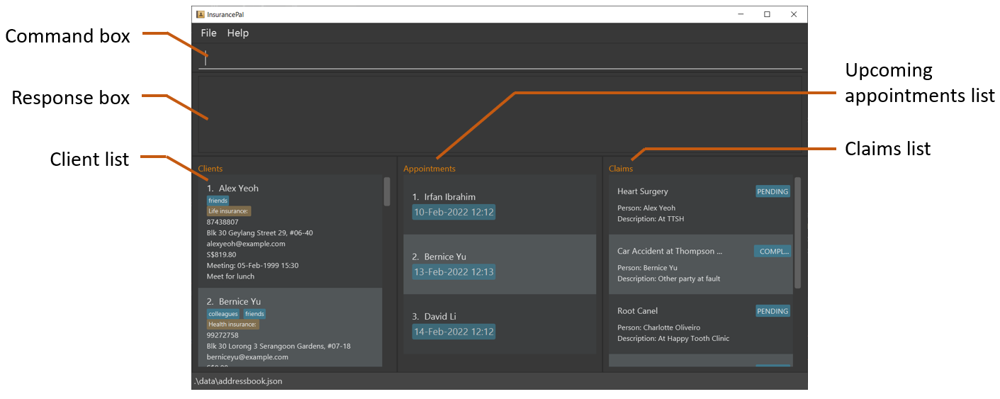

<div>
  
  <h1> CohortConnect v1.4 </h1>
  
  <b> Type. Explore. Connect. </b>
  
</div>

<br><br>

CohortConnect is an advanced desktop address book which facilitates networking among Computer Science (CS) students. It is optimized for use via a Command Line Interface (CLI) while still having the benefits of a Graphical User Interface (GUI). 

With advanced features for managing large groups of contacts, CohortConnect is intended for use in a university setting. At the start of the semester, professors will distribute `csv` or `json` files containing a list of students. Instantly load them into CohortConnect with a single **Import** command. With data collected from students before the semester, our **Find A Buddy** feature helps you find potential groupmates by leveraging GitHub’s metadata using a proprietary algorithm. In the **Events** tab, you can identify events and hackathons that your peers will be attending.

## Table of Contents
* Table of Contents
{:toc}

## Purpose

This User Guide is intended for basic to advanced users of CohortConnect. It provides sufficient information for users to set up the application and learn all its features.

## Prerequisites

1. Basic knowledge about `csv` and `json` type file formats.
2. Basic knowledge about Technical Terms like `CLI`, `UI` and `JAR`.
3. `Java 11` Installed on the System.

## Quick Start

1. Ensure you have Java 11 or above installed in your computer.
2. Download the latest `CohortConnect.jar` release from [here](https://github.com/AY2122S1-CS2103T-T10-1/tp/releases).
3. Place `CohortConnect.jar` in an empty folder.
4. Double-click the jar file to start the program.
5. The UI would look like this:

<p align="center">

</p>

> * Welcome Splash Screen

<p align="center">

</p>

> * This Window is only displayed once, when the Student launches the App for the first time.
6. Enter Your Name in the `Name Field`.
7. Enter Your __VALID__ Telegram Handle in the `Telegram Field`.
8. Enter Your __VALID__ GitHub Username in the `GitHub Field`.

<div markdown="span" class="alert alert-primary">

:bulb: TIP:
<br/>

1. Telegram Handle Conventions:  
• Can only contain the letters a-z or A-Z, digits 0-9 and underscores.
<br/>
• Is case-insensitive.
<br/>
• Must be 5 to 32 characters long.
<br/>
<br/>  
2. GitHub Username Conventions:
<br/>
• Can only contain alphanumeric characters or hyphens.
<br/>
• Cannot have multiple consecutive hyphens. 
<br/>
• Cannot begin or end with a hyphen. 
<br/>
• Can have a maximum of 39 characters.
<br/>

</div>

<p align="center">

</p>

> * Main Window.

## User Interface



1. **Menu Bar**: Contains links and keyboard shortcuts for navigating to other UI components.
2. **Profile Window**: Opens the Profile Window, where users can see the details they have entered during profile set up.
3. **Events Icon**: Switches to the events tab.
4. **Command Box**: A text field for users to enter their commands and view previous commands command-line style.
5. **Result Box**: Displays the results of commands entered into the Command Box.
6. **Tab Switcher**: Shows all tabs, highlights the current tab, and switches between tabs by clicking or keyboard shortcuts.
7. **Contact List**: Shows all contacts in a scrollable list.
8. **Contact Details**: Shows all details of the currently selected contact.

## Keyboard Mappings

1. <kbd>⌘</kbd> + <kbd>1</kbd>: To Switch to Contacts Tab.
2. <kbd>⌘</kbd> + <kbd>2</kbd>: To Switch to Favorites Tab.
3. <kbd>⌘</kbd> + <kbd>3</kbd>: To Switch to Events Tab.
4. <kbd>⌘</kbd> + <kbd>4</kbd>: To Switch to Find a Buddy Tab.
5. <kbd>⌘</kbd> + <kbd>P</kbd>: To Launch the Profile Window.
6. <kbd>↑</kbd>: To Retrieve the Last Entered Command (Similar to Terminal).
7. <kbd>↓</kbd>: To Retrieve the Next Entered Command (Similar to Terminal).
8. <kbd>F1</kbd>: To Launch the Help Window.

<div markdown="span" class="alert alert-primary">
:bulb: TIP: <kbd>⌘</kbd> for Mac = <kbd>Ctrl</kbd> for Windows
</div>

## Features

Notes about command format:

- `[x/xxx]` refers to an optional field

<div markdown="span" class="alert alert-primary">
:bulb: TIP: In the Command Box, use <kbd>↑</kbd> and <kbd>↓</kbd> arrow keys to navigate the command history.
</div>

### Adding a new Student - `add`

Adds a Student to the Address Book.

Format:

```
add n/<NAME> te/<TELEGRAM> g/<GITHUB> [p/<PHONE_NUMBER>] [e/<EMAIL>] [a/<ADDRESS>]
[t/<TAG>]
```

Example:

```
add n/John Doe te/johndoe g/john-doe p/98765432 e/johnd@eg.com
a/John Street, Blk 12, #01-01
```

### Delete a Student - `delete`

Deletes the specified Student Contact from the Address Book.

Format:

```
delete <INDEX>
```

Example:

```
delete 7
```

### Edit a Student - `edit`

Edits an existing Student Contact in the Address Book.

Format: 

```
edit <INDEX> [n/<NAME>] [te/<TELEGRAM>] [g/<GITHUB>] [p/<PHONE>] [e/<EMAIL>]
[a/<ADDRESS>] [t/<TAG>]
```

Example:

```
edit 1 n/John te/john_123 t/TA
```

### Edit your Profile - `edit profile`

Edits the Profile linked to the Address Book.


Format:

```
edit profile [n/<NAME>] [te/<TELEGRAM>] [g/<GITHUB>]
```

:bulb: TIP:
<br/>

1. Name Conventions:  
   • Should only contain alphabetical characters.
   <br/>
2. Telegram Handle Conventions:
   <br/>
   • Can contain the letters a-z or A-Z, digits 0-9 and underscores.
   <br/>
   • Must be 5 to 32 characters long.
   <br/>
3. GitHub Username Conventions:
   <br/>
   • May only contain alphanumeric characters or hyphens.
   <br/>
   • Cannot have multiple consecutive hyphens.
   <br/>
   • Cannot begin or end with a hyphen.
   <br/>
   • Can have a maximum of 39 characters.
   <br/>

* Edits name, Telegram and GitHub fields of user's profile.
* If the prefix of the field to be edited is mentioned, then its parameters cannot be left empty.
E.g. `edit profile te/` and `edit profile n/Bob te/` would result in an error because the updated Telegram handle 
has not been specified. 
* If multiple prefixes are missing parameters, then the user is notified of the first missing parameter.
E.g. `edit profile n/ te/ ` would result in an error saying that the name to be edited is missing.

Examples:
* `edit profile te/bob_osum`
* `edit profile n/Bob g/bob-codes`
* `edit profile n/Alex te/alex_1 g/alex123`


### Find a Student - `find`

Finds students contacts whose names, Telegram handles, GitHub usernames or assigned tags contain any of the given keywords.

Format 1: 
```
find <NAME> [MORE_NAMES]
```


* Searches for matching names

  **:information_source: Name must contain only alphabetical characters.**<br>
* Matches contact names with the **exact** keyword or those that contain the keyword as substring. e.g. `find al` will return <b><u>Al</u></b>ex Yeoh as well as Roy B<b><u>al</u></b>akrishnan
* The search **is case-insensitive**.  e.g. alex will match Alex
* Persons matching at least one keyword will be returned (i.e. OR search). e.g. Hans Bo will return Hans Gruber, Bo Yang

Examples:

* Search by single name: `find alex`
* Search by multiple names: `find ai bob dom` 

<br>

Format 2:
```
find <TAG> [MORE_TAGS]
```


* Searches for contacts with matching tags.
* Matches students with the **exact** tag name. e.g. `find t/friend` will only display student contacts with the tag `friend` and not `friends`.
* The search **is case-insensitive**. e.g. `find t/Friends` will match contacts with the tag `friends` too.

Examples:

* Search by single tag: `find t/classmates` 
* Search by multiple tags: `find t/friends neighbours`

<br>

Format 3: 
```
find te/<TELEGRAM_HANDLE> [MORE_TELEGRAM_HANDLES]
```


* Searches for a student contact by telegram handle.
* Matches student contacts with the exact Telegram handle or Telegram handle that contain the keyword as a substring. e.g. `find te/Al` will display student contacts with the Telegram handles `al_x1` and `randall_xo`.
* The search **is case-insensitive**. e.g. `find te/Al` will find the contact with the Telegram handle `alex` too.

Examples:

* Search by single Telegram handle: `find te/dY` 
* Search by multiple Telegram handles: `find te/bob al_x1` 

<br>

Format 4: 
```
find g/GITHUB_USERNAME [MORE_GITHUB_USERNAMES]
```

* Searches for a student contact by GitHub username.
* Matches student contacts with the exact GitHub username or GitHub username that contain the keyword as a substring. e.g. `find g/ai` will display student contacts with the GitHub usernames `ai-coder` and `kaira1208`.
* The search **is case-insensitive**. e.g. `find g/Al` will find the contact with the GitHub username `Alex`.

Examples:

* Search by single GitHub username: `find g/dY` 
* Search by multiple GitHub usernames: `find g/ai-coder kaira1208`

### Find A Buddy Tab

The Find a Buddy feature can be accessed by just switching to the last tab. The tab will display the top 5 matches to your profile based on gathered GitHub data.

<p align="center">

</p>


#### Working

The GitHub data used includes the percentage of contributions for different languages in the top 30 repositories, and the number of repos in the user's profile.

A similarity score is calculated using these features. The similarity score is based on the following three metrics:

- Euclidean Distance
- Manhattan Distance
- Cosine Similarity

On clicking a student, you can view the similarity score and the languages you have in common with the selected student.

### Show a Student Contact - `show`

Shows detailed information of a Student Contact. This can be done using the name 
of the contact, GitHub username, telegram id or the index. It shows the student with the corresponding detail containing the keyword.

<div markdown="span" class="alert alert-primary">

:bulb: Note:
The show keywords are case-insensitive, john Doe will match with John Doe, JOHN DOE and JoHN DoE

</div>

Format 1: 

```
show <NAME>
```

Example 1:

```
show John Doe
```

<div markdown="span" class="alert alert-primary">

:bulb: Note:
If the exact name is not given, the show function will act similar to find and then you can pick out one contact from the given list.

</div>

Format 2:

```
show g/<GITHUB_USERNAME>
```

Example 2:

```
show g/john-doe
```

Format 3:

```
show te/<TELEGRAM_ID>
```

Example 3:

```
show te/john_doe
```

Format 4: 

```
show <INDEX>
```

Example 4:

```
show 4
```

### Exporting Student Contacts - `export`

Exports the Student Contacts to the specified JSON or CSV file. Exported file will be in the same folder as the application.

Exporting will not overwrite existing files.

Format 1:

```
export <FILENAME>.json
```

Example 1:

```
export Friends.json
```

Format 2:

```
export <FILENAME>.csv
```

Example 2:

```
export Friends.csv
```

### Importing Student Contacts - `import`

Imports Student Contacts from the specified JSON or CSV file. File must be in the same folder as the application.

Importing will not remove existing contacts, and ignores duplicate contacts.

Format 1:

```
import <FILENAME>.json
```

Example 1:

```
import CS2103T.json
```

Format 2:

```
import <FILENAME>.csv
```

Example 2:

```
import CS2103T.csv
```

### Setting a Contact as Favorite - `fav`

Helps to set a particular Student Contact as a Favorite only if the contact has not been favorited.

Format:

```
fav <INDEX>
```

Example:

```
fav 1
```

### Setting a Contact as Unfavorite - `unfav`

Helps to set a particular Student Contact as an Unfavorite only if the contact has been favorited.

Format:

```
unfav <INDEX>
```

Example:

```
unfav 1
```

### Adding or removing tags from a contact - `tag`

Allows user to directly add or remove tag(s) from a specific student contact.

Format:

```
tag <INDEX> a/<TAG_TO_ADD> [MORE_TAGS] r/<TAG_TO_REMOVE> [MORE_TAGS]
```
>* Index is compulsory and must be a positive integer.<br>
>* To add or remove an event or module type tag, specify the tag type before the name of the tag. E.g. `tag 2 a/event-hackathon` (to add an event tag) or `tag 2 a/module-CS2103T` (to add a module tag) and likewise for remove. Tags specified without valid type before the name will be considered as general tags.<br>
* Users can choose to only add tag(s), only remove tag(s) or add tag(s) and remove tag(s)


* Adding tags : 
  * If `a/` is entered, it must be followed by the name(s) of tag(s) to be added. E.g. `tag 1 a/ r/friends` 
  would result in an error even if only the `friends` tag was to be removed.
  * Duplicate tags aren't allowed. E.g. `tag 1 a/teammate` would result in an error if the student contact at index 1 
  already has the tag `teammate`.
  * If multiple tags are to be added and there is at least 1 tag that is not already assigned to the specific contact, 
  then this tag is added and the remaining duplicate tags are ignored. E.g. if `tag 1 a/classmate a/cca` would result in only the `classmate` tag being added to the student contact at index 1 if it already has the tag `cca`.


* Removing tags :
  * If `r/` is entered, it must be followed by the name(s) of tag(s) to be removed. E.g. `tag 1 a/friends r/`
    would result in an error even if only the `friends` tag was to be added.
  * Attempting to remove a tag that is not assigned to the specified contact is not allowed. E.g. `tag 1 r/teammate` would result in an error if the student contact at index 1
    is not assigned the tag `teammate`.
  * If multiple tags are to be removed and there is at least 1 valid tag that can be removed from the specific contact,
    then this tag is removed and the remaining invalid tags are ignored. E.g. if `tag 1 r/classmate r/cca` would result in only the `classmate` tag being removed from the student contact at index 1 if the tag `cca` is not assigned to them already.

Examples:
* Adding single (general) tag : `tag 1 a/friends`
* Adding single (event) tag : `tag 2 a/event-hackathon`
* Adding multiple tags : `tag 3 a/friends a/teammate`
* Removing multiple (general) tags : `tag 2 r/family owesmoney`
* Removing multiple (module) tags : `tag 2 r/module-CS1101S module-MA1521`
* Adding and removing a tag : `tag 4 a/friends r/colleagues`

### Displaying the Help Window - `help`

Displays the Help Window, which consists of a list of possible Commands, and a link to this UserGuide.

When the `Visit URL` button is clicked, the UserGuide is opened in the system's default web browser.

Format:

```
help
```

<p align="center">

</p>

### Listing All Student Contacts - `list`

Lists all the Student Contacts present.

Format:

```
list
```

### Deleting All Student Contacts - `clear`

Deletes all the Student Contacts present.

Format:

```
clear
```

<div markdown="span" class="alert alert-danger">
:exclamation: DANGER: Use With Caution!
</div>

### Open Telegram of Current User

Opens the current user's Telegram link in the user's default web browser. If the user has the Telegram application installed on his device, he will be redirected to the application.

Format:

```
te
```

### Open GitHub of Current User

Opens the current user's GitHub profile in the user's default web browser.

Format:

```
g
```

### Retrieve Command History - <kbd>↑</kbd> / <kbd>↓</kbd>

Similar to a Command Line Interface, <kbd>↑</kbd> retrieves the previous command, while <kbd>↓</kbd> retrieves the next command.

### Exiting the App - `exit`

Exits the App.

Format:

```
exit
```

## FAQ

Q: On typing and running commands, the error message "XXXX" is shown, what shall I do?

A: Please **strictly** follow the command format to avoid such issues.

--------------------------------------------------------------------------------------------------------------------

## Command summary

| Feature | Command(s) |
| ------ | ------ |
| Add a new Student | `add n/<NAME> te/<TELEGRAM> g/<GITHUB> [p/<PHONE>] [e/<EMAIL>] [a/<ADDRESS>] [t/<TAG>]` |
| Delete All Student Contacts Present | `clear` |
| Delete a Student | `delete <INDEX> ` |
| Exit the App | `exit` |
| Edit a Student | `edit <INDEX> [n/<NAME>] [te/<TELEGRAM>] [g/<GITHUB>] [p/<PHONE>] [e/<EMAIL>] [a/<ADDRESS>] [t/<TAG>]` |
| Edit your Profile | `edit profile [n/<NAME>] [te/<TELEGRAM>] [g/<GITHUB>]` |
| Exporting Student Contacts | `export <FILENAME>.json` <br> `export <FILENAME>.csv` |
| Favorite a Student Contact | `fav <INDEX>` |
| Find a Student (by Name) | `find <STRING> ` |
| Find a Student (by Tag) | `find t/<TAG>` |
| Find a Student (by Telegram Handle) | `find te/<TELEGRAM>` |
| Import Student Contacts | `import <FILENAME>.json` <br> `import <FILENAME>.csv` |
| List all the Student Contacts Present | `list` |
| Open Current Student's GitHub Profile in the Web Browser | `g` |
| Open Current Student's Telegram Link in the Web Browser | `te` |
| Show the Help Window | `help` |
| Show a Student Contact (by Name)| `show <NAME>` |
| Show a Student Contact (by Index) | `show <INDEX>` |
| To Add Tag(s) | `tag <INDEX> a/<TAG_TO_ADD> [MORE_TAGS]` |
| To Remove Tag(s) | `tag <INDEX> r/<TAG_TO_REMOVE> [MORE_TAGS]` |
| To Add and Remove Tag(s) Simultaneously | `tag <INDEX> a/<TAG_TO_ADD> [MORE_TAGS] r/<TAG_TO_REMOVE> [MORE_TAGS]` |
| Unfavorite a Student Contact | `unfav <INDEX>` |
