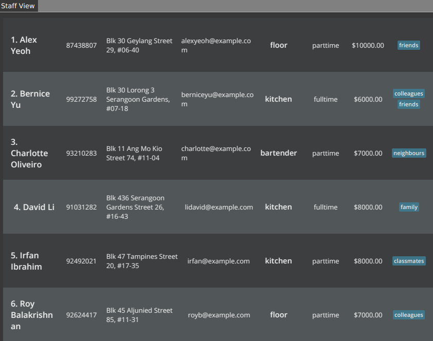
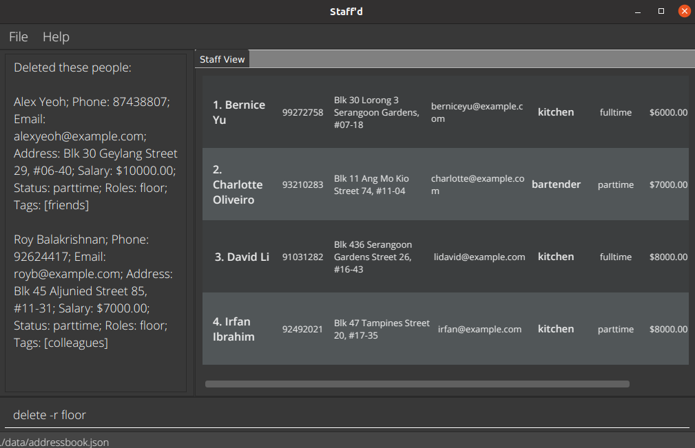
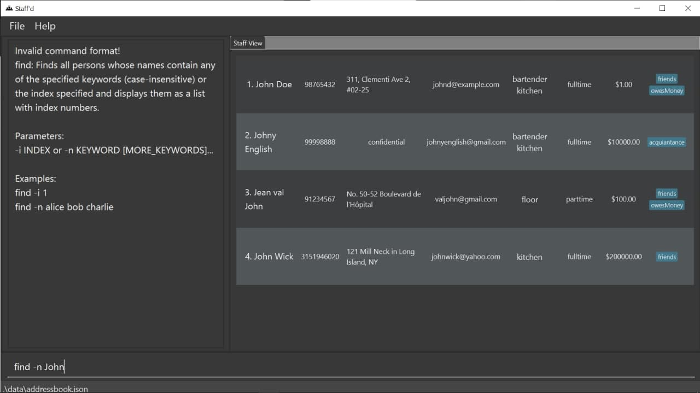
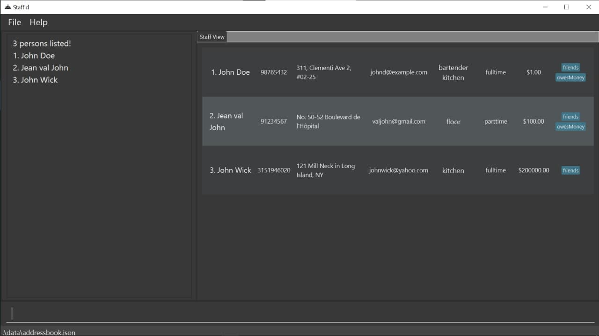
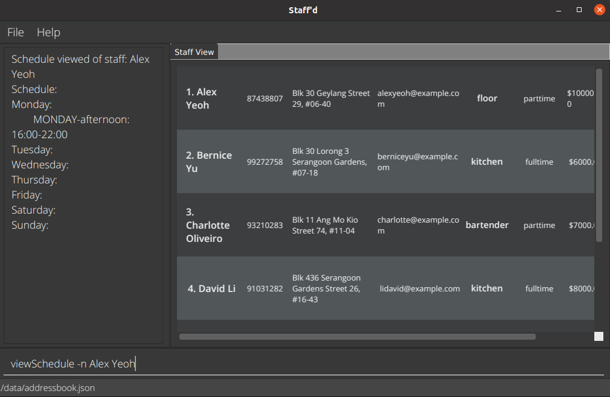
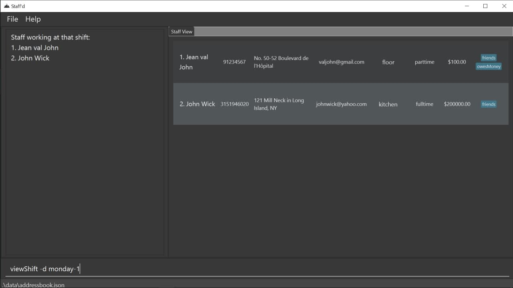

Staff’d helps food & beverage managers manage details and schedules of their staff. It is optimized for CLI users so that frequent tasks can be done faster by typing in commands. It is optimized for restaurants with two active shifts.

* Table of Contents
{:toc}

--------------------------------------------------------------------------------------------------------------------

## Quick start

### Firing up Staff'd

1. Ensure you have _Java 11_ or above installed in your Computer.

1. Download the latest _staffd.jar_ from [here](https://github.com/AY2122S1-CS2103T-W11-2/tp/releases).

1. Copy the file to the folder you want to use as the _home folder_ for your Staff’d.

2. If linux is your operating system, run `chmod +x staffd.jar` from the _home folder_.

3. Double-click the file to start the app. The GUI similar to the below should appear in a few seconds. Note how the app contains some sample data. 
   

### First Steps on Staff'd

1. On the first initialisation, Staff'd will have some sample data for you to play with.

1. The following is an example of how you might use Staff'd.

1. Joe wants to join your restaurant.

1. Try adding a Joe using the `add` command. `add n/Joe s/fulltime r/kitchen p/98765432 $/1234789 e/Joe@example.com a/John street, block 123, #01-01`

1. Type the command in the command box and press Enter to execute it.

1. Say the Staff in question has to work on the next monday's afternoon shift.

1. Use the `addShift` command to add the staff to the morning shift.   `addShift -n Joe d/monday-0`
  
1. Joe has a flu and is now unable to work on the next monday which is on 25th October 2021.

1. Mark Joe as absent with the `mark` command.   `mark -n Joe da/2021-10-25`

1. Joe has recovered faster than expected and is able to work on monday.

1. Remove the mark from Joe with the `unmark` command.   `unmark -n Joe da/2021-10-25`

1. On the first day of work, Joe has caused 10 customers food poisoning and is fired.

1. Remove Joe from Staff'd with the delete command.   `delete -n Joe`

1. Refer to the [Features](#features) below for more details of each command. Images are provided for commands with significant output.

--------------------------------------------------------------------------------------------------------------------

## Features

### Flag legend

#### Flags for Specific Fields

Flags|Description
---|-----------
n/|Name
s/|Status (as a full-time/part-time worker)
r/|Role (e.g. kitchen, floor)
a/|Address
$/|Salary
i/|Index
e/|Email
t/|Extra tags
d/|Shift (for shift related commands)
da/|Date

#### Flags for Lookup

Flags|Name
---|----
-n|Name
-i|Index
-d|Day Of the Week
-t|Tag
-ti|Time

#### Fields of a staff

The fields that a Staff must have.

Flags|Name
----|----
-n|Name
-s|Status
-a|Address
-$|Salary
-e|Email
-t|Tags

**:information_source: Notes about the command format:** 

* Words in `UPPER_CASE` are the parameters to be supplied by the user. 
  e.g. in `add n/NAME`, `NAME` is a parameter which can be used as `add n/John Doe`.

* Items in square brackets are optional. 

  e.g `n/NAME [t/TAG]` can be used as `n/John Doe t/friend` or as `n/John Doe`.

* Items with `…` after them can be used multiple times including zero times. 
  e.g. `[t/TAG]…` can be used as ` ` (i.e. 0 times), `t/friend` (i.e 1 times), `t/friend t/family` etc.

* Parameters can be in any order. 
  e.g. if the command specifies `n/NAME p/PHONE_NUMBER`, `p/PHONE_NUMBER n/NAME` is also acceptable.

* If a parameter is expected only once in the command but you specified it multiple times, only the last occurrence of the parameter will be taken. 
  e.g. if you specify `p/12341234 p/56785678`, only `p/56785678` will be taken.

* Extra parameters for commands that do not take in parameters (such as `help`, `list`, `exit` and `clear`) will be ignored. 
  e.g. if the command specifies `help 123`, it will be interpreted as `help`.

### Utility Features

#### Viewing help : `help`
Shows a message explaining how to access the help page.

Format: `help`

#### Changing tabs : `tab`
Switches between the tabs: staff view and schedule.

Format: `tab`

#### Setting Role Requirements : `setRoleReq `

Set the minimum number of staff required for each shift. The three roles are: kitchen, floor and bartender. 
Multiple roles can be set with this same command, but if the same role occurs multiple times, the last instance will be
used.

The default role requirements are 0 for all three roles. The Clear Command will also reset the
role requirements to the default.

Format:

`setRoleReq r/ROLE-NUMBER_REQUIRED...`

Examples:

`setRoleReq r/floor-3`\
`setRoleReq r/kitchen-4 r/bartender-2`

See Also:

[Clear Command](#clearing-all-entries--clear)

#### Setting Default Shift Timings : `setDefaultShiftTimings `

Set the default timings for the morning and afternoon shift. Please note:
* All 4 timings must be present
* Timings must be provided in an `HH:mm` format, using the 24-hour clock. (Example: `22:00`)
* The duration of the shift must not be zero (i.e. the shift cannot start and end at the same time)
* The shifts do not overlap, but can have the same start and end times
* The morning shift must start at noon or before noon. Similarly, the afternoon shift must start at noon or after noon.
* The default morning shift timings are 10:00 - 16:00, and the default afternoon shift timing is 16:00 - 22:00.
* The Clear Command will also reset the shift timings to the aforementioned defaults.

Format:

`setDefaultShiftTimings MORNING_START_TIME MORNING_END_TIME AFTERNOON_START_TIME AFTERNOON_END_TIME`

Examples:

`setDefaultShiftTimings 10:00 16:00 17:00 22:00`\
`setDefaultShiftTimings 09:00 15:00 18:00 23:00`

See Also:

[Clear Command](#clearing-all-entries--clear)

#### Listing all persons : `list`

Shows a list of all staffs in the staff view.

Format: `list`

#### Saving the data

Staff'd data are saved in the hard disk automatically after any command that changes the data. There is no need to save manually.

#### Editing the data file

Staff'd data are saved as a JSON file. Advanced users are welcome to update data directly by editing that data file.

:exclamation: **Caution:**
If your changes to the data file makes its format invalid, Staff'd will discard all data and start with an empty data file at the next run.

### Basic management of Staff Details

#### Viewing overall staff statistics : `stats`

Command to display the staff statistics for all the staff. Displays the total working hour
and salary for this month.

Format: `stats`

#### Viewing individual staff statistics: `istaff`

Command to display the staff statistics for an individual staff or a group of staffs for this month.
If the today is 2021-11-01, the statistics will be shown for the month of november.

Format:

`istaff [-i INDEX] [-n NAME] [-p PHONE] [-e EMAIL] [-a ADDRESS] [-$ SALARY] [-s STATUS] [-r ROLE]...`

Example:

`istaff -i 1`
`istaff -p 999`
`istaff -n Joe`

#### Adding a staff : `add`

Adds a staff to the system. 

 * Staff of the same name cannot be added.
 * The tags and information are optional and can be presented in any order.
 * Upon creation of a staff, the system creates an index for them which can be used to refer to them and access the system.

Format:  
`add n/NAME p/PHONE_NUMBER e/EMAIL a/ADDRESS $/SALARY [s/STATUS] [r/ROLE]... [t/TAG]...`  

Examples:  
`add n/Joe s/fulltime r/kitchen p/98765432 $/1234789 e/Joe@example.com a/John street, block 123, #01-01`  
`add n/Candice s/parttime p/91234567 $/2 e/candice@example.com a/Newgate Prison`

#### Marking a staff as absent : `mark`

Marks a specified staff(s) as not working for a specified date.

* The salary for that date will not be included in calculation,
depending on the staff's status. By default, the staff is recorded
as present for all shifts.
* The format of the input date is in: `YYYY-MM-DD`.
* If no date input is provided, the next occurrence of that shift is assumed.
* If only one date input is provided, the next occurrence of that shift, after the provided date is marked. For instance,
  if the shift is on Monday 1/11/2021, with `da/2021-10-27` as the date input, the shift on 1/10/2021 would be marked.
* Will not indicate if there is a shift in the period provided, even if there isn't a shift, the staff will be marked absent for that period.
* Mark command marks that the staff is absent for a shift, and does not remove the shift from being tracked. Use [deleteShift](#deleting-a-shift-from-a-staff--deleteshift) instead if the shift is to be removed from the schedule entirely.

Format:  

Marking a period:  

`mark [-i INDEX] [-n NAME] [-p PHONE] [-e EMAIL] [-a ADDRESS] [-$ SALARY] [-s STATUS] [-r ROLE]... [da/START_DATE] [da/END DATE]`  

Examples:  
`mark -i 1 da/2020-01-03 da/2021-01-03`  
`mark -n Alex Yeoh da/2020-01-03`

#### Removing the absent mark : `unmark`

Removes the period that was marked by the `mark` command.

The format of the input date is in: `YYYY-MM-DD`.

* If no date input is provided, the next occurrence of that shift is assumed.
* If only one date input is provided, the next occurrence of that shift, after the provided date is unmarked. For instance,
  if the shift is on Monday 1/11/2021, with `da/2021-10-27` as the date input, the shift on 1/10/2021 would be unmarked.

Format:  
`unmark [-i INDEX] [-n NAME] [-p PHONE] [-e EMAIL] [-a ADDRESS] [-$ SALARY] [-s STATUS] [-r ROLE]... [da/START_DATE] [da/END_DATE]`

Examples:  
`unmark -i 1 da/2020-01-03 da/2021-01-03`  
`unmark -t friends da/2020-01-03`

#### Deleting a Staff : `delete`

Deletes the specified staff.

* Deletes the staff(s) with the specified `NAME`, `ROLE`, `STATUS`, `INDEX`.
* The index refers to the index number shown in the displayed staff list. It **must be a positive integer** 1, 2, 3, within the range of the staff view.

Formats:  
`delete -n NAME`  
`delete -i INDEX`  
`delete -r ROLE`  
`delete -s STATUS`  

Examples:  
`delete -n Candice`  
`delete -i 2`  
`delete -r floor`  
`delete -s fulltime`

#### Editing a staff : `edit`

Edits an existing staff in the Staff List.

Formats:  
`edit -n NAME [n/NAME] [p/PHONE_NUMBER] [e/EMAIL] [a/ADDRESS] [$/SALARY] [s/STATUS] [r/ROLE]... [t/TAG]...`  
`edit -i INDEX [n/NAME] [p/PHONE_NUMBER] [e/EMAIL] [a/ADDRESS] [$/SALARY] [s/STATUS] [r/ROLE]... [t/TAG]...`

* Edits the staff of the specified `NAME`, `INDEX`.
The index refers to the index number shown in the displayed staff list. The index **must be a positive integer** 1, 2, 3, … within the range of staff list.
* At least one of the optional fields must be provided.
* Existing values will be updated to the input values.

Examples:  
`edit -i 1 p/91234567 e/johndoe@example.com`  
`edit -n Bob p/69696969 e/candicepleasedateme@tinder.com`  
`edit -n Candice r/cook`

#### Finding staff : `find`

Finds staff whose names contain any of the given keywords, or by their index in the staff list.
Can attach [fields](#fields-of-a-staff) for additional restrictions or find by fields alone. 
If index search is performed, no other input is expected.

Name Search:

* The search is case-insensitive. e.g `bob` will match `Bob`.
* The order of the keywords does not matter. e.g. `Candice Dee` will match `Dee Candice`.
* Only full words will be matched e.g. `Boba` will not match `Bob`.
* Staff matching at least one keyword will be returned (i.e. `OR` search).
  e.g. `John Nathan` will return `John Wick`, `Nathan Tan`.

Index Search:

* If previous searches have been made, the search is conducted on the displayed list. Otherwise, it will
  be performed on the overall staff list.
* The index must be within range. (i.e. from 1 until the size of the Staff List)
* If the list is empty, no input is accepted.
* Only single search is supported, and this search will return only the specific Staff at that index.

Field Search:

* Can perform field search alone or along with name search.
* The [fields](#fields-of-a-staff) that are attached must match exactly the field to compare to.
* All the fields will take the last input as the actual input accept for tags and roles, which will find
the staff(s) that match all the inputs.

Format:  
`find -n KEYWORD [MORE_KEYWORDS] [-p PHONE] [-e EMAIL] [-a ADDRESS] [-$ SALARY] [-s STATUS] [-r ROLE]`  
`find -i INDEX [-p PHONE] [-e EMAIL] [-a ADDRESS] [-$ SALARY] [-s STATUS] [-r ROLE]`  

Examples:  
`find -n John`  
`find -n alex david`    
`find -i 3`  
`find -t Friend`
`find -r kitchen -r floor`  

List before using Find command:

List after using Find command:

#### Clearing all entries : `clear`

Clears all entries from the Staff List. The default Shift Timings and Role Requirements are also reset.

Format: `clear`

See Also:

[setDefaultShiftTimings Command](#setting-default-shift-timings--setdefaultshifttimings-)\
[setRoleReq Command](#setting-role-requirements--setrolereq-)

#### Exiting the program : `exit`

Exits the program.

Format: `exit`

### Basic Management of Staff Schedules

#### Viewing schedule for the week: `change`

The change command enables the user to view a different week than the default one, which is the next seven days.
The schedule for the current week is shown under the schedule tab by default. The week
can be changed using the `change` command. 

 * Takes in a single date input to translate into a week, which consists of the seven days after the input date.
 * The date is in `YYYY-MM-DD`
 * The change command also causes all the default shift related commands to take place over the resulting week.

Format:  
`change da/DATE`    

Examples:  
`change da/2021-12-28`  

The output will look like the following.

#### Viewing all the staff(s) working a shift : `viewShift`

Finds all the staff working at a particular shift. The shift can be specified either by detailing the day of the week and the time, or the day of the week and slot number.

* When using the -ti flag, it is in 24-hour format. Example, for 4.pm on wednesday, we use   `wednesday-16:00`.
* The DAY entry is not case-sensitive.
* If no date input is provided, the next occurrence of the provided shift is displayed.
* Similarly, if only one date input is provided, the next occurrence of the provided shift *after the provided date* is displayed.

Formats:  
`viewShift -d DAY-shift_number [da/START_DATE] [da/END_DATE]`  
`viewShift -ti DAY-HH:mm [da/START_DATE] [da/END_DATE]`

Note that day refers to the day of the week, and it is case-insensitive. However, it should be spelt in full (e.g. MONDAY instead of Mon).

Examples:  
`viewShift -d monday-1 da/2021-10-01`  
`viewShift -d TUESDAY-0`  
`viewShift -ti wednesday-12:00`  
`viewShift -ti THURSDAY-16:30`

Demonstration:  

#### Adding a shift to a staff's schedule : `addShift`

Adds a time period where the staff is working to the staff’s schedule.

* There are two ways to identify the staff to add the time period to: by their `name` or by their staff `index`.
* The start time and end time will be set to the default one (If it's a morning slot, then the period of shift is from
  10:00 to 16:00; If it's an afternoon slot, then the period of shift is 16:00 to 22:00).
* If no `da/` input is provided, the following seven days starting with the current date will be taken.
* If only one date input is provided, this input will be regarded as the start date bound the shift added is
  to the next date that the shift is at. For instance, if the shift is on a 1/11/2021, a monday,
  with `da/2021-10-27` as input, the shift will be added to 1/10/2021 (Because 1/11/2021 is the first
  monday after 2021/10/27).
* If two dates are provided, they will be considered as the start date and the end date of the period. Shifts will be
  added to Any date matched with the `d/` input. For example, if the command
  `addShift -n Candice d/Monday-1 da/2021-10-27 da/2021-11-14` is executed, shifts will be added to the afternoon of
  1/11/2021, 8/11/2021, because these are the two mondays in this period.
* If the shift is not in the period provided, the program will do nothing.

Formats:  
`addShift -n NAME d/DAYOFWEEK-SHIFTNUMBER [da/START_DATE] [da/END_DATE]`
`addShift -i INDEX d/DAYOFWEEK-SHIFTNUMBER [da/START_DATE] [da/END_DATE]`

Examples:  
`addShift -n Candice d/Monday-1 da/2021-10-01`   
`addShift -i 1234 d/tuesday-0`

Notes:
* The start date and the end date are included in the period.
* The `DAYOFWEEK` stands for the day in the week, such as `monday`, `sunday` etc. 
* Field required to specify shifts are not case-sensitive, but must be full. 

#### Swapping shifts: `swapShift`
Swaps shifts between 2 staffs. The 2 staffs are identified using their names.

* If no date input is provided, the next occurrence of the provided shift is assumed.
* If only one date input is provided, the next occurrence of both the provided shifts *after the provided date* is assumed.

Formats:  
`swapShift -n NAME -n NAME d/day-shift_number d/day-shift_number [da/START_DATE] [da/END_DATE]`  
`swapShift -n NAME d/day-shift_number -n NAME d/day-shift_number [da/START_DATE] [da/END_DATE]`

Examples:  
`swapShift -n Candice -n Bob d/monday-0 d/tuesday-1 da/2021-10-01`  
`swapShift -n Candice d/monday-0 -n Bob d/tuesday-1`

Notes:
* The staff identified using the first name is associated with the first shift and the staff identified using the second name is associated with the second shift.
* This means that you can permute the order of the parameters in any way but the rule mentioned right above will always be followed.

#### Updating the start time and end time for a shift : `setShiftTime`

Updates the start time and end time of a specific shift of a specific staff.

* Start time and end time must follow the format (hh:mm).
* Start time must be earlier than end time.
* Both start time and end time must be within the bound (10:00-16:00 for morning slot, 16:00-22:00 for afternoon slot).
* If the shift does not exist in the staff's schedule, it will be created.
* Start date must be earlier than the end date.

Formats:  
`setShiftTime -n NAME d/DAYOFWEEK-SHIFTNUMBER st/hh:mm-hh:mm [da/START_DATE] [da/END_DATE]`  
`setShiftTime -i INDEX d/DAYOFWEEK-SHIFTNUMBER st/hh:mm-hh:mm [da/START_DATE] [da/END_DATE]`  

Examples:   
`setShiftTime -i 12 d/tuesday-1 st/17:00-21:30`
`setShiftTime -n Candice d/Monday-0 st/10:30-12:30 da/2021-10-01`  
`setShiftTime -i 1 d/wednesday-1 st/17:00-21:30 da/2021-10-01 da/2021-11-01`

Notes:
* If no date input is provided, current week is taken as default.
* If only one date input is provided, it assumes that the period is for the seven days after the date.
* If two date inputs are provided, the period will be taken from the start date to the end date, both included.
* The `DAYOFWEEK` field required to specify shifts are not case-sensitive, but must be full.

#### Deleting a shift from a staff : `deleteShift`

Deletes a time period from the staff schedule.  There are two ways to identify the staff to delete the time period from: by their `name` or by their staff `index`. The deleted period must be the same as a period previously entered by the manager.

If no date input is provided, the next occurrence of the provided shift is assumed.
* If only one date input is provided, the next occurrence of the provided shift *after the provided date* is assumed.
* If the shift to delete is not in the input date range, the program will do nothing.

Formats:  
`deleteShift -n NAME d/DAYOFWEEK-shiftNumber [da/START_DATE] [da/END_DATE]`  
`deleteShift -i INDEX d/DAYOFWEEK-shiftNumber [da/START_DATE] [da/END_DATE]`

Examples:  
`deleteShift -n Joe d/tuesday-1 da/2021-10-01`  
`deleteShift -i 1278 d/friday-1`

--------------------------------------------------------------------------------------------------------------------

## Command summary

Action | Format, Examples
--------|------------------
**View** | `view [-n NAME] [-p PHONE] [-e EMAIL] [-a ADDRESS] [-$ SALARY] [-s STATUS] [-r ROLE]... [-t TAG]...`
**Add** | `add n/NAME p/PHONE_NUMBER e/EMAIL a/ADDRESS $/SALARY [s/STATUS] [r/ROLE]... [t/TAG]...`
**Delete** | `delete -n NAME`   `delete -i INDEX`   `delete -r role`   `delete -s STATUS`
**Edit** | `edit -n NAME [n/NAME] [p/PHONE_NUMBER] [e/EMAIL] [a/ADDRESS] [$/SALARY] [s/STATUS] [r/ROLE]... [t/TAG]...`   `edit -i INDEX [n/NAME] [p/PHONE_NUMBER] [e/EMAIL] [a/ADDRESS] [$/SALARY] [s/STATUS] [r/ROLE]... [t/TAG]...`
**Find** | `find -n KEYWORD [MORE_KEYWORDS] [-p PHONE] [-e EMAIL] [-a ADDRESS] [-$ SALARY] [-s STATUS] [-r ROLE]`  `find -i [INDEX]`   e.g., `find -n James Jake`
**View staff(s) statistics** | `istaff [-i INDEX] [-n NAME] [-p PHONE] [-e EMAIL] [-a ADDRESS] [-$ SALARY] [-s STATUS] [-r ROLE]...`
**Add staff to shift** | `addShift -n NAME d/DAYOFWEEK-SHIFTNUMBER [da/START_DATE] [da/END_DATE]`   `addShift -i INDEX d/DAYOFWEEK-SHIFTNUMBER [da/START_DATE] [da/END_DATE]`
**Swap shifts** | `swapShift -n NAME -n NAME d/day-shift_number d/day-shift_number [da/START_DATE] [da/END_DATE]`   `swapShift -n NAME d/day-shift_number -n NAME d/day-shift_number [da/START_DATE] [da/END_DATE]`
**Set shift time** | `setShiftTime -n NAME d/DAYOFWEEK-SHIFTNUMBER st/hh:mm-hh:mm [da/START_DATE] [da/END_DATE]`   `setShiftTime -i INDEX d/DAYOFWEEK-SHIFTNUMBER st/hh:mm-hh:mm [da/START_DATE] [da/END_DATE]`
**Delete staff shift** | `deleteShift -n NAME d/DAY-SHIFTNUMBER [da/START_DATE] [da/END_DATE]`   `deleteShift -i INDEX d/DAY-SHIFTNUMBER [da/START_DATE] [da/END_DATE]`
**View shift** | `viewShift -d DAY-SHIFTNUMBER [da/START_DATE] [da/END_DATE]`   `viewShift -ti DAY-HH:mm [da/START_DATE] [da/END_DATE]`
**Mark absent** | `mark [-i INDEX] [-n NAME] [-p PHONE] [-e EMAIL] [-a ADDRESS] [-$ SALARY] [-s STATUS] [-r ROLE]... [da/START_DATE] [da/END_DATE]`
**Remove mark** | `unmark [-i INDEX] [-n NAME] [-p PHONE] [-e EMAIL] [-a ADDRESS] [-$ SALARY] [-s STATUS] [-r ROLE]... [da/START_DATE] [da/END_DATE]`
**Change schedule** | `change da/START_DATE`
**Set role requirements** | `setRoleReq r/ROLE-NUMBER_REQUIRED...`
**Set default shift timings** | `setDefaultShiftTimings MORNING_START_TIME MORNING_END_TIME AFTERNOON_START_TIME AFTERNOON_END_TIME`
**View overall statistics** | `stats`
**List** | `list`
**Tab** | `tab`
**Help** | `help`
**Clear** | `clear`
**Exit** | `exit`

--------------------------------------------------------------------------------------------------------------------

## FAQ

**Q**: How do I transfer my data to another Computer? 
**A**: Install the app in the other computer and overwrite the empty data file it creates with the file that contains the data of your previous Staff'd home folder.

**Q**: Where is the save file located? 
**A**: In the data folder in the _home folder_ called _addressbook.json_.
