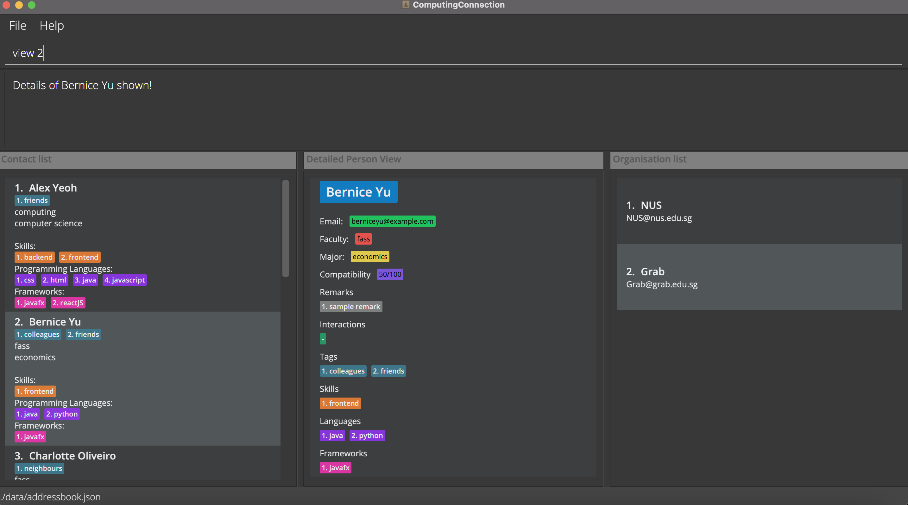

## Product overview

*ComputingConnection* is for entrepreneurial students in NUS Computing who want to **keep track of other students’ skill sets so that they can easily look for suitable people to work with on future projects.** *ComputingConnection* is optimized for Command Line Interface (CLI) over a Graphical User Interface (GUI) for efficiency with a keyboard.

You can use *ComputingConnection* to efficiently record information such as faculty, major, skills, programming languages, and remarks (and more!) of peers that you have encountered throughout university. *ComputingConnection* will allow you to remember and document your network of potential student partners for projects in the future.

* Table of Contents
{:toc}

--------------------------------------------------------------------------------------------------------------------
## About (using this user guide)
In this section, you will learn how to use the *ComputingConnection* user guide efficiently and effectively.

### Navigating this guide
1. Chronological navigation by scrolling 
- If this is your first time using ComputingConnection, we recommend this for a comprehensive walkthrough.
  
2. Targeted search by jumping 
- If you know what you're looking for and want to be efficient. 
- Skip to specific sections via the Table of Contents or navigable texts.
- CTRL + F to find specific keywords. 

### Text conventions
This user guide is formatted using the following conventions:

Syntax          | Interpretation
----------------|-------------
*Italic text*   | The name of the application, *ComputingConnection*
**Bold text**   | Keywords for **emphasis** 
`Block text`    | `command syntax` or `technical references` 
Orange text     | Headings and subheadings of various size
------          | Dividers for section breaks

### Meaning of icons and symbols
:information_source: : Additional information  
:bulb: Tip  
:exclamation: Important message  
:x: Error or danger to avoid  

:bulb: Call out bar for a tip
* These blocks of text are here to aid the readability of this user guide! 
* They can be tagged with different icons for different purposes. 

--------------------------------------------------------------------------------------------------------------------

## Quick start

1. Ensure you have Java `11` or above installed in your Computer.

1. Download the latest `computingconnection.jar` from [here](https://github.com/AY2122S1-CS2103T-W10-3/tp/releases).

1. Copy the file to the folder you want to use as the _home folder_ for your ComputingConnection.

1. Double-click the file to start the app. The GUI similar to the below should appear in a few seconds. Note how the app contains some sample data. 
   

1. Type the command in the command box and press Enter to execute it. e.g. typing **`help`** and pressing Enter will open the help window. 
   Some example commands you can try:

   * **`list`** : Lists all contacts.

   * **`add`**`n/Dion Neo e/dion@example.com f/computing m/computer science` : Adds a contact named `Dion Neo` to the ComputingConnection, with the respective email, faculty and major fields.

   * **`delete`**`3` : Deletes the 3rd contact shown in the current list.

   * **`clear`** : Deletes all contacts.

   * **`exit`** : Exits the app.

1. Refer to the [Features](#features) below for details of each command.

--------------------------------------------------------------------------------------------------------------------

## Understanding the 'Features' section
In this section, you will learn how to utilise the features and commands available in *ComputingConnection*, as seen in the [Features](#features) section. 

### Terminologies used
Unique terms specific to *ComputingConnection*

Term            | Meaning
----------------|-----------------
Contact         | Represents a person in ComputingConnection
Data field      | Categories that you can assign to a contact   See [Structure of a contact](#structure-of-a-contact) for the full list of data fields 

### Structure of a contact
Understanding the structure of a **contact** in *ComputingConnection* is important in enabling you to be more productive.

Category        | Specific fields | Description
----------------|-----------------|-----------------
Personal data fields  | 1. `n/`: Name   2. `e/`: Email | Compulsory fields
University data fields   | 3. `f/`: Faculty   4. `m/:` Major | Compulsory fields
Skill data fields | 5. `s/`:Skill   6. `l/`: Programming Language   7. `fr/`: Framework | Optional fields that can have 0 or more values 
Miscellaneous data fields| 8. `r/`: Remark   9. `int/`: Interaction | Optional fields that can have 0 or more values

### ComputingConnection command formats

**:information_source: Notes about the command format:** 

* Words in `UPPER_CASE` are the parameters to be supplied by the user. 
  e.g. in `add n/NAME`, `NAME` is a parameter which can be used as `add n/Jason Ang`.

* Items in square brackets are optional. 
  e.g. `n/NAME [t/TAG]` can be used as `n/Shivam Tiwari t/friend` or as `n/Shivam Tiwari`.

* Items with `…`​ after them can be used multiple times including zero times. 
  e.g. `[s/SKILL]…​` can be used as ` ` (i.e. 0 times), `s/frontend`, `s/frontend s/backend` etc.

* Parameters can be in any order. 
  e.g. if the command specifies `n/NAME e/EMAIL`, `e/EMAIL n/NAME` is also acceptable.

* If a parameter is expected only once in the command, but you specified it multiple times, only the last occurrence of the parameter will be taken. 
  e.g. if you specify `p/12341234 p/56785678`, only `p/56785678` will be taken.

* Extraneous parameters for commands that do not take in parameters (such as `help`, `list`, `sort`, `exit` and `clear`) will be ignored. 
  e.g. if the command specifies `help 123`, it will be interpreted as `help`.

--------------------------------------------------------------------------------------------------------------------

## Features
Features and commands are categorised based on 
1. System commands
2. Contact-specific commands
3. Organisation-specific commands

### System commands
Commands that are related to the whole ComputingConnection system or database. 

##### Viewing help: `help`
Shows a message explaining how to access the help page.  

Format: `help`

##### Listing all contacts : `list`
Shows a list of all contacts in the address book.  

Format: `list`

:bulb: Insert tips
* `INSERT HERE` 

##### Sorting contacts : `sort`
Sorts all contacts and shows the list in alphabetical order.  

Format: `sort`

:bulb: Insert tips
* `INSERT HERE` 

##### Filtering contacts : `filter`
Filters the contacts by tags.

Format: `filter f/FACULTY [t/TAG]`

* Filters a contact according to a tag
  Examples:
* `filter f/computing` returns all users who have been assigned the f/computing tag.
* `filter t/staff f/computing` returns all users who have been assigned the t/staff tag and f/computing tag .
  

:bulb: Insert tips
* `INSERT HERE` 

##### Clearing all entries : `clear`
Clears all contacts from ComputingConnection.

Format: `clear`

:exclamation: Be **careful**
* The confirmation for clearing data will be implemented in future releases. 

### Contact-specific commands
Commands that are related to a specific contact

##### Adding a contact: `add`
Adds a contact to the address book.

Format: `add n/NAME p/PHONE_NUMBER e/EMAIL r/ROLE f/FACULTY m/MAJOR [s/SKILL]…​ [l/LANGUAGE]…​ [fr/FRAMEWORK]…​ [t/TAG]…​`

Examples: 

* `add n/Timothy Wong e/timothy@nus.edu.sg f/computing m/computer science`
* `add n/Timothy Wong e/timothy@nus.edu.sg f/computing m/computer science s/frontend l/javascript`

:bulb: Insert tips
* A contact must have one and only one name, email, faculty and major.
* You can always add optional data fields later on! 

##### Editing a contact : `edit`
Edits an existing contact in the address book.

Format: `edit INDEX [n/NAME] [p/PHONE] [e/EMAIL] [r/ROLE] [f/FACULTY] [m/MAJOR] [s/SKILL]…​ [l/LANGUAGE]…​ [fr/FRAMEWORK]…​ [t/TAG]…​`

* Edits the contact at the specified `INDEX`. The index refers to the index number shown in the displayed contact list. The index **must be a positive integer** 1, 2, 3, …​
* At least one of the optional fields must be provided.
* Existing values will be updated to the input values.
* When editing tags, the existing tags of the contact will be removed i.e adding of tags is not cumulative.
* You can remove all the contact’s tags by typing `t/` without
  specifying any tags after it.

##### Appending multiple data fields: `append`
Appends a new element to data fields that support multiple elements.

Format: `append 1 [s/SKILL] [l/PROGRAMMING LANGUAGE] [fr/FRAMEWORK] [t/TAG]...`

* The index refers to the index number shown in the displayed contact list.
* The index **must be a positive integer** 1, 2, 3, …​

:bulb: Insert tips
* `INSERT HERE` 

Examples:
* `append 3 s/webdev l/python t/classmate` Appends 'webdev' to the skill data field, 'python' to the language data field, and 'classmate' to the tag data field of the Person at index 3 in the list.

##### Removing data fields: `remove`
Removes an element from a data field at a specified index.

Format: `remove 1 [s/INDEX] [l/INDEX] [fr/INDEX] [t/INDEX] [int/INDEX]`

* The index refers to the index of the specific element in the non-single data field.
* Applicable to skill and miscellaneous data fields.

:bulb: Insert tips
* `INSERT HERE` 

##### Adding an interaction with a contact : `interaction`
Adds an interaction record to a specific contact in the address book.

Format: `interaction INDEX [int/DESCRIPTION] [on/DATE]`
interaction 1 int/We talked. on/1990-01-20
* Adds an interaction record to the contact at the specified `INDEX`. The index refers to the index number shown in the displayed contact list. 
  The index **must be a positive    integer** 1, 2, 3, …​
* All fields must be present
* Date must be in the format of `YYYY-MM-DD`

Examples:
* `interaction 1 int/We talked. on/1990-01-20` Adds an interaction with description 'We talked' and date '1990-01-20' to the Person at index 1 of the list.

##### Viewing a specific contact in detail : `view`
Get a detailed view of a specific contact by index.

Details of specific contact shown on right side of screen.
Index is based on current list displayed on left side of screen.

Format: `view INDEX`

Examples:

*  `view 1` Displays the details of contact indexed at 1 in the current list.
*  `view 2` Displays the details of contact indexed at 2 in the current list.

:bulb: Insert tips
* `INSERT HERE` 

##### Locating contacts by name: `find`
Finds contacts whose names contain any of the given keywords.

Format: `find KEYWORD [MORE_KEYWORDS]`

* The search is case-insensitive. e.g `hans` will match `Hans`
* The order of the keywords does not matter. e.g. `Hans Bo` will match `Bo Hans`
* Only the name is searched.
* Partial matches will work e.g. `Han` will match `Hans`
* Contacts matching at least one keyword will be returned (i.e. `OR` search).
  e.g. `Hans Bo` will return `Hans Gruber`, `Bo Yang`

Examples:
* `find John` returns `john` and `John Doe`
* `find alex david` returns `Alex Yeoh`, `David Li` 
  

:bulb: Insert tips
* `INSERT HERE` 

##### Deleting a contact : `delete`
Deletes the specified contact from the address book.

Format: `delete INDEX`

* Deletes the contact at the specified `INDEX`.
* The index refers to the index number shown in the displayed contact list.
* The index **must be a positive integer** 1, 2, 3, …​

Examples:
* `list` followed by `delete 2` deletes the 2nd contact in the address book.
* `find Betsy` followed by `delete 1` deletes the 1st contact in the results of the `find` command.

:bulb: Insert tips
* `INSERT HERE` 

### Organisation-specific commands
Commands that are related to organisations

##### Adding an organisation: `add org`
Adds an organisation to the address book.

Format: `add org n/NAME e/EMAIL p/PERSON`

AAn organisation can have any number of  persons within it(including 0). However, an organisation must have a name.
These are organisations whose contact the user wished to remember.

Examples:

* `add org n/Shopee e/EMAIL p/[n/John doe]`
* `add org n/SoC e/EMAIL p/[n/Seth e/EMAIL f/computing m/computer science]`
* `add org n/NUS e/EMAIL p/[n/Damith e/EMAIL f/computing m/computer science] p/[n/Danny e/EMAIL f/computing m/computer science]`

List of personal detail tags:
* n/: name
* e/: email

List of members:
* p/: persons in the organisation

:bulb: Insert tips
* `INSERT HERE` 

### Future commands
Commands to be implemented in future versions

##### Archiving data files `[coming in v2.0]`
_Details coming soon ..._

--------------------------------------------------------------------------------------------------------------------

## FAQ

**Q**: How do I transfer my data to another Computer? 
**A**: Install the app in the other computer and overwrite the empty data file it creates with the file that contains the data of your previous AddressBook home folder.

--------------------------------------------------------------------------------------------------------------------

## Command summary

System Command | Format, Examples
--------|------------------
**Help** | `help`
**List** | `list`
**Sort** | details coming soon
**Filter** | details coming soon
**Clear** | `clear`|

Contact-specific Command | Format, Examples
--------|------------------
**Add** | `add n/NAME e/EMAIL f/FACULTY m/MAJOR [s/SKILL] [l/LANGUAGE] [fr/FRAMEWORK] [t/TAG]…​`   e.g., `add n/James Ho e/jamesho@example.com s/marketing t/colleague`
**Edit** | `edit INDEX n/NAME e/EMAIL f/FACULTY [t/TAG]…​`  e.g.,`edit 2 n/James Lee e/jameslee@example.com`
**Append** | `append INDEX [s/SKILL] [l/LANGUAGE] [fr/FRAMEWORK] [t/TAG]...`
**Remove** | `remove 1 [s/INDEX] [l/INDEX] [fr/INDEX] [t/INDEX]...`
**View** | details coming soon
**Find** | `find KEYWORD [MORE_KEYWORDS]`  e.g., `find James Jake`
**Delete** | `delete INDEX`  e.g., `delete 3`

Organisation-specific Command | Format, Examples
--------|------------------
**Add Org** | `add org n/NAME e/EMAIL p/PERSON`
