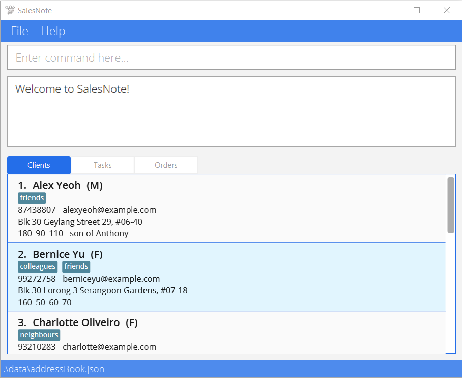
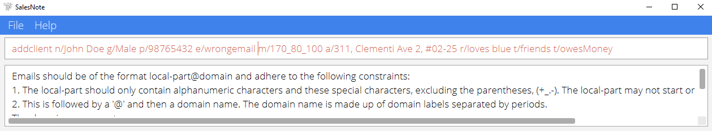
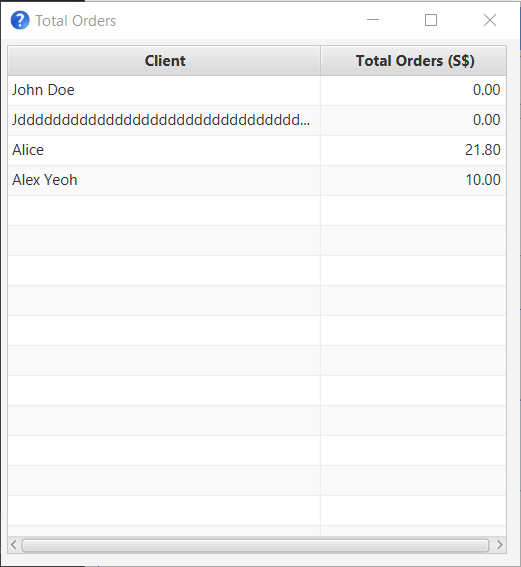

SalesNote is a **desktop app for tailors, optimized for use via a Command Line Interface** (CLI), suitable for fast
typists. SalesNote aims to help tailors simplify their administrative tasks, with the main features split between helping to manage:
* Client Information (e.g. Contact details, measurements, notes)
* Tasks to be done 
* Sales orders and accounts

This is a user guide aimed at helping all users of SalesNote; both new and experienced. The table of contents 
below lists all the available commands, and the link will bring you to a quick overview for more information on the
given command. Newer users hoping to quickly get started can refer to the "quick start", in the first section of the
user guide below.

## Table of Contents

- [Quick Start](#quick-start)
- [Features](#features)
    - [Viewing help : `help`](#viewing-help--help)
    - [Client Commands](#client-commands)
        - [Adding a client : `addclient`](#adding-a-client--addclient)
        - [Deleting a client : `deleteclient`](#deleting-a-client--deleteclient)
        - [Editing a client : `editclient`](#editing-a-client--editclient)
        - [Locating clients by name : `findclient`](#locating-clients-by-name--findclient)
        - [Listing all clients : `listclients`](#listing-all-clients--listclients)
    - [Task Commands](#task-commands)
        - [Adding a task : `addtask`](#adding-a-task--addtask)
        - [Deleting a task : `deletetask`](#deleting-a-task--deletetask)
        - [Editing a task : `edittask`](#editing-a-task--edittask)
        - [Finding tasks by keywords : `findtask`](#finding-tasks-by-keywords--findtask)
        - [Listing all tasks : `listtasks`](#listing-all-tasks--listtasks)
        - [Listing completed tasks : `completedtasks`](#listing-completed-tasks--completedtasks)
        - [Listing incomplete tasks : `incompletetasks`](#listing-incomplete-tasks--incompletetasks)
        - [Marking a task as done : `marktask`](#marking-a-task-as-done--marktask)
    - [Order Commands](#order-commands)
        - [Adding an order : `addorder`](#adding-an-order--addorder)
        - [Deleting an order : `deleteorder`](#deleting-an-order--deleteorder)
        - [Finding orders by keywords : `findorder`](#finding-orders-by-keywords--findorder)
        - [Listing all orders : `listorders`](#listing-all-orders--listorders)
        - [Listing completed orders : `completedorders`](#listing-completed-orders--completedorders)
        - [Listing incomplete orders : `incompleteorders`](#listing-incomplete-orders--incompleteorders)
        - [Marking an order as complete : `markorder`](#marking-an-order-as-complete--markorder)
        - [Sorting orders : `sortorders`](#sorting-orders--sortorders)
        - [Viewing total orders : `totalorders`](#viewing-total-orders--totalorders)
    - [Clearing all entries : `clear`](#clearing-all-entries--clear)
    - [Exiting the program : `exit`](#exiting-the-program--exit)
    - [Saving the data](#saving-the-data)
    - [Editing the data file](#editing-the-data-file)
- [FAQ](#faq)
- [Command Summary](#command-summary)
            
            

--------------------------------------------------------------------------------------------------------------------

## Quick Start

1. Ensure you have Java `11` or above installed on your computer.
You may install Java `11` from [here](https://www.oracle.com/java/technologies/downloads/#java11).
2. Download the latest `SalesNote.jar` from [here](https://github.com/AY2122S1-CS2103T-W08-3/tp/releases).
3. Copy the file to the folder you want to use as the _home folder_ for your SalesNote.
4. Double-click the file to start the app. The GUI similar to the below should appear in a few seconds. 
The app provides some sample data to help you get started.

5. Type the command in the command box and press Enter to execute it.
e.g. typing **`listtasks`** and pressing Enter will list all tasks.
Some example commands you can try:
   * **`list`**: List all clients.
   * **`add`**`n/John Doe g/Male p/98765432 e/johnd@example.com m/170_80_100 a/311, Clementi Ave 2, #02-25 r/loves blue t/friends t/owesMoney`: Adds a client named `John Doe`.
   * **`delete`**`2`: Deletes the 2nd client shown in the current client list.
   * **`clear`**: Deletes all existing data.
   * **`exit`**: Exits the app.
6. Refer to the [Features](#features) below to learn more about the commands.

--------------------------------------------------------------------------------------------------------------------

## Features

**:information_source: Notes about the command format:** 
Here are some general notes for you to aid in understanding the documentation below. It includes examples 
to help you better understand how the documentation translates to actual commands you can key into SalesNote.

* In the documentation, words in `UPPER_CASE` are the parameters you should supply. Some examples include:
    * In `addclient n/NAME ...`, `NAME` should be replaced by a name of your choice. e.g. `addclient n/Jacob Tan ...`
    * In `deletetask INDEX`, `INDEX` should be replaced by a positive number. e,g, `deletetask 2`

* When the documentation surrounds parameters with square brackets, this indicates they are optional and can be left blank.
    * The format for `addtask` is:
        * `addtask l/LABEL d/DATE [t/TASKTAG]`
    * So in this case, you can use the command with or without supplying a `TASKTAG`. The following are both valid:
        * `addtask l/Sew Buttons d/20th Aug 2021`
        * `addtask l/Sew Buttons d/20th Aug 2021 t/SO1`

* To add on to the previous point, some arguments have a `…​` after them, e.g. `[t/TAG]…​` in the `addclient` command.
  This is to indicate that the arguments may be used 0 or more times, for instance the following are all valid:
    * `addclient n/Jacob Tan p/98765432 e/jtan@gmail.com a/47 Cashew Road m/170-70-70 g/M t/Regular t/Important`
    * `addclient n/Jacob Tan p/98765432 e/jtan@gmail.com a/47 Cashew Road m/170-70-70 g/M t/Regular`
    * `addclient n/Jacob Tan p/98765432 e/jtan@gmail.com a/47 Cashew Road m/170-70-70 g/M`

* The parameters you give an argument can be in any order  
  e.g. if the command specifies `n/NAME p/PHONE_NUMBER`, `p/PHONE_NUMBER n/NAME` is also acceptable.

* If a parameter is expected only once in the command but you specified it multiple times, only the last occurrence of the parameter will be taken. 
  e.g. if you specify `p/12341234 p/56785678`, only `p/56785678` will be taken.

* Extraneous parameters for commands that do not take in parameters (such as `help`, `list`, `exit` and `clear`) will be ignored. 
  e.g. if the command specifies `help 123`, it will be interpreted as `help`.

### Viewing help : `help`

This command will bring up the following window, allowing you to access this user guide at any time.

Format: `help`

## Client Commands

These commands relate to helping you record and manage client information using SalesNote. When entering a client's
information into the application, there are several fields of information you can store, such as the client's gender,
or their body measurements for clothing.

**:information_source: Notes about the client commands:** 

* SalesNote allows you to record the gender of the client. The gender field takes accepts "M" or "Male" to
  indicate male gender, and "F" or "Female" to indicate female gender. Note that this ignores case, thus "male" or "FEMALE" will also be accepted.
* A related point, is that SalesNote also allows you to store their measurements for easy reference. This field
  is **different depending on their gender**. Take note of the following points:
    * A male's body measurements should be of the format height_waist_shoulder in cm, and it should not be blank.
    * A female's body measurements should be of the format height_waist_shoulder_bust in cm, and it should not be blank.
* A phone number is to consist only of numbers, and be between 3 and 20 digits long
* An email should be of the form `LOCALPART@DOMAIN` and follow the following rules:
    1. The local-part should only contain alphanumeric characters and these special characters, excluding the parentheses, (+_.-). The local-part may not start or end with any special characters.
    2. This is followed by a '@' and then a domain name. The domain name is made up of domain labels separated by periods.
       The domain name must:
        - end with a domain label at least 2 characters long
        - have each domain label start and end with alphanumeric characters
        - have each domain label consist of alphanumeric characters, separated only by hyphens, if any.
* The tag field is meant to help categorise your clients: it should consist of a single block of alphanumeric characters. Some examples of valid tags:
    * `t/regular` (trailing and leading spaces are allowed and will be removed, so "t/ friends" and "t/friends  " have the same result)
    * `t/cat1` (numbers are allowed)
    * Note that `t/regular friend` fails however
* The remark field is a free-form field that allows you to keep short notes. e.g. `r/broad shoulders`

[return to top](#table-of-contents)

### Adding a client : `addclient` 

Format: `addclient n/NAME p/PHONE_NUMBER e/EMAIL a/ADDRESS m/MEASUREMENT g/GENDER [r/REMARK] [t/TAG]…​`

Allows you to add a client to SalesNote. 

Note that the application maintains a list of unique individuals! In this case two individuals are **considered equal if
they have the same name**. Two individuals having the exact same name is quite the rare occurrence, and so we felt
this was more likely to be a user mistake we wanted to help prevent. If you do happen to have two clients with the
exact same name, our recommendation is to add a number, to make clear that this was intentional (e.g. adding Jane Lim
and Jane Lim1).

:bulb: **Tip:**
If you get the required format for a field wrong e.g. you key in an invalid EMAIL, SalesNote will give you a 
warning, and a reminder of the requirements:

Some examples of valid commands:
* `addclient n/Ng Chin Gan p/98765432 e/ncg@example.com a/42 Almond Street g/M m/170_100_40`
* `addclient n/Alice Seah e/aseah@example.com a/47 Cashew Street p/92345782 t/important g/F m/160_85_35_81`

[return to top](#table-of-contents)

### Deleting a client : `deleteclient`

Format: `deleteclient INDEX`

Allows you to delete a client from SalesNote.

* Deletes the client at the specified `INDEX`.
* The index refers to the index number shown in the displayed **Clients** tab list.
* The index **must be a positive integer** 1, 2, 3, …​

Examples:
* Using `listclients` first, to display all clients in SalesNote followed by `deleteclient 2` will 
  delete the 2nd client in the displayed list.
* Using `findclient Alice` first, followed by `deleteclient 1` will delete the 1st client in the results of the `findclient` command.
    This is a quick and convenient way to remove a specific client that you know is in SalesNote, without 
  having to scroll to find them.

[return to top](#table-of-contents)

### Editing a client : `editclient`

Format: `editclient INDEX [n/NAME] [p/PHONE_NUMBER] [e/EMAIL] [a/ADDRESS] [m/MEASUREMENT] [g/GENDER] [r/REMARK] [t/TAG]…​`

Edits an existing client in SalesNote.

:information_source: **Note:**
Editing the gender of a customer is something we expect to be quite rare. Nevertheless, if you find yourself needing to
do so, do not forget to also edit their body measurements when you change their gender! As a reminder, the measurements
SalesNote requires are different depending on the gender of the client.

* Edits the client at the specified `INDEX`. The index refers to the index number shown in the displayed client list. The index **must be a positive integer** 1, 2, 3, …​
* **At least one of the optional fields must be provided.** 
* Existing values will be updated to the input values.
* When editing tags, the existing tags of the client will be removed i.e adding of tags is not cumulative. In particular, this means
    that if you want to keep all existing tags, and add a new one, you should re-type all the tags in the command.
    * e.g. Suppose the first displayed client already has the tag `friend`, and you wish to add the tag `regular`. The 
      command is then:   `editclient 1 t/friend t/regular`
* You can remove all the client’s tags by typing `t/` without specifying any tags after it.

Examples:
*  `editclient 1 p/91234567 e/jacobtan@example.com` Edits the phone number and email address of the 1st client to be `91234567` and `jaconbtan@example.com` respectively.
*  `editclient 2 n/Jamie Chew t/` Edits the name of the 2nd client to be `Jamie Chew` and clears all existing tags.

[return to top](#table-of-contents)

### Locating clients by name : `findclient`

Format: `findclient KEYWORD [MORE_KEYWORDS]`

Allows you to find clients whose names contain any of the given keywords.

* The search is case-insensitive. e.g `chan` will match `Chan`
* The order of the keywords does not matter. e.g. `Jane Lim` will match `Lim Jane`
* Only the name is searched.
* Only full words will be matched e.g. `Jan` will not match `Jane`
* Clients matching at least one keyword will be returned, for instance searching `Jane Tay` will return `Jane Tan`, `Alice Tay`

Examples:
* `findclient jacob` can return `Jacob Chua` and `Jacob Tan`
* `findclient alex david` can return `Alex Yeoh` and `David Li`

[return to top](#table-of-contents)

### Listing all clients : `listclients`

Format: `listclients`

Displays a list of all clients in SalesNote to you. 

One common use of this command is to remove a filter. For instance you might have used `findclient tan` to display only clients
whose names contain "Tan". Following with the command `listclients` allows you to refresh the client list to display all clients currently in SalesNote.

[return to top](#table-of-contents)

--------------------------------------------------------------------------------------------------------------------

## Order Commands
These commands are for helping you to manage your incoming orders and manage accounts with SalesNote. Orders are created
with a label describing them, a client, an amount, and a date. The following are a few points to take note of:

**:information_source: Notes about the order commands:** 

* The amount field is any number from 0 to 1 billion.
* The client for the order **must exist in SalesNote** to create the order. For instance  
  `addorder l/blue blouse c/Jane a/22.50 d/20 August 2021` will fail if the client with name `Jane` is not in SalesNote. Note that the name is matched
  **regardless of capitalisation!** So if you have a client named `James`, your order can be addressed to `james`, `JAMES`, `James` and so on.
* Editing a client, will also edit all the orders tied to the client. For instance, if a client's name is changed from
  "Alice" to "Alice Lin", all orders addressed to "Alice" will now be addressed to "Alice Lin". 
* The date field should follow one of the following formats:

  Format | Example
      --------|------------------
  **dd mmmm yyyy** | `08 November 2001`
  **dd mmm yyyy** | `08 Nov 2021`
  **yyyy mm dd** | `2021 11 08`
  **dd-mm-yyyy** | `08-11-2021`
  **yyyy/mm/dd** | `2021/11/08`
  **dd/mm/yyyy** | `08/11/2021`

### Adding an order : `addorder` [!back]

Format: `addorder l/LABEL c/CUSTOMER a/AMOUNT d/DATE`

Allows you to add an order to SalesNote. Note that SalesNote maintains a unique list of orders. Orders are considered the same if
they have the same **label and customer**. So `addorder l/blue blouse c/Alice a/21.00 d/20 August 2021` followed by `addorder l/blue blouse c/alice a/100 d/21 August 2021`
will not be allowed. This is to help guard against user error. If you are sure this is what you want, our suggestion is to add a number at the end of the order label
e.g. `addorder l/blue blouse1 c/alice a/100 d/21 August 2021` instead.

Examples:
* `addorder l/blue blouse c/Alice a/21.90 d/20 August 2021`
* `addorder l/school uniform c/John a/15.00 d/15 October 2021`

[return to top](#table-of-contents)

### Deleting an order : `deleteorder`

Format: `deleteorder INDEX`

Allows you to delete an order from SalesNote.

* Deletes the order at the specified `INDEX`
* The index refers to the index number shown in the displayed order list.
* The index must be a positive integer 1, 2, 3

Note that this will also delete all tasks tagged to the deleted order (for more information, see [Task Commands](#task-commands)).

Examples:
* `listorders` followed by `deleteorder 1` deletes the first listed task in SalesNote
* `findorders Tan` followed by `deleteorder 1` deletes the first customer with surname "Tan" in SalesNote

[return to top](#table-of-contents)

### Finding orders by keywords : `findorder`

Format: `findorder KEYWORD [MORE_KEYWORDS]`

Searches for orders whose customer, label, date or sales id contain any of the given keywords, and 
displays them to you in the **Orders** tab.

* The search is case-insensitive. e.g. `green` will match `Green`
* The order of the keywords does not matter. e.g. `Blue Blazer` will match `Blazer Blue`
* Only full words will be matched. e.g. `Blazer` will not match `Blazers`
* Orders matching at least one keyword will be returned e.g. `Blue Blazer` can return both `Blue Shirt` and `Black Blazer`.

Examples:
* `findorder blue` returns `blue blazer` and `blue shirt`
* `findorder SO1` returns order with id of `SO1`

As the purpose of the order commands in SalesNote are to help you manage accounts better, we offer a more comprehensive
set of commands for viewing and sorting orders, shown here below.

[return to top](#table-of-contents)

### Listing all orders : `listorders`

Format: `listorders`

Displays a list of all orders in SalesNote to you.

[return to top](#table-of-contents)

### Listing completed orders : `completedorders`

Format: `completedorders`

Filters the list to show only completed orders to you.

[return to top](#table-of-contents)

### Listing incomplete orders : `incompleteorders`

Format: `incompleteorders`

Filters the list to show only incomplete orders to you.

[return to top](#table-of-contents)

### Marking an order as complete : `markorder`

Format: `markorder INDEX`

This command is to mark an order in SalesNote as complete, meant to be used when payment has been received.

* Marks the order at the specified `INDEX` as complete
* The index refers to the index number shown in the displayed order list.
* The index must be a positive integer 1, 2, 3

This command can be combined with others for ease of use. Some examples:
* Using `findorder Alice` to find all orders addressed to clients named Alice, followed by `markorder 1` to mark the first such order as complete.
* Using `incompleteorders` to filter the list to show only the orders where payment is outstanding first, to quickly find the 
  correct one to mark as complete when a client is making payment.

[return to top](#table-of-contents)

### Sorting orders : `sortorders`

Format: `sortorders f/FIELD [o/ORDERING]`

Allows you to sort all orders based on a chosen field and arrangement.

* Your orders are sorted based on the `FIELD` chosen. You may choose between:
    * The Date field, identified with a "d" or "date".
    * The Amount field, identified with an "a" or "amount".
* The direction of the arrangement depends on the `ORDERING`, which is either:
    * Ascending, identified with an "asc" or "ascending".
    * Descending, identified with a "desc" or "descending".
* If the `ORDERING` parameter is not supplied, the list will be sorted in ascending order.

**:information_source: Note:**  

* Your orders are normally arranged in the sequence they were added.
* When two or more orders have an identical value for the `FIELD` chosen, the normal arrangement is used as a tiebreaker.
* Adding / Deleting an order reverts the list to the normal arrangement.

Examples:
* `sortorders f/date o/descending` sorts your orders in descending order of date (orders with later dates shown first).
* `sortorders f/d o/asc` sorts your orders in ascending order of date (orders with earlier dates shown first).
* `sortorders f/a o/ascending` sorts your orders in ascending order of amount (orders for smaller amounts shown first).
* `sortorders f/amount` sorts your orders in ascending order of amount (orders for smaller amounts shown first).

[return to top](#table-of-contents)

### Viewing total orders : `totalorders`

Format: `totalorders`

This opens a new window, displaying the total dollar amount of all orders from each client in SalesNote to you.

:bulb: **Tip:**
Press the ESCAPE key to close the total orders window

:information_source:

* Clients without orders will not be displayed.
* After adding/deleting orders, you might want to run this command again to refresh the window.

<figcaption align = "center">e.g. In the figure above, the application has three clients Ng Chin Gan, Alice Seah,
and Jacob Tan, but Jacob Tan is not shown as there are no orders from him in SalesNote yet</figcaption>

[return to top](#table-of-contents)
--------------------------------------------------------------------------------------------------------------------

## Task Commands
This part of the user guide concerns commands meant to help you manage tasks. Tasks in SalesNote come with a 
label, and a date representing an intended deadline. Like any good to-do list, SalesNote allows you to mark tasks
as completed, but also provides you with an ability to tag tasks to orders.

**:information_source: Notes about the task commands:** 

* A task tag is **not** the same as a client tag. While you are free to select any client tag you wish, a task tag should:
    * Be `General` or
    * Have prefix `SO` followed by the id of a sales order. This is how you tag tasks as being related to a given order.
    * Some examples:
        * `addtask sew buttons t/general`
        * `addtask sew buttons t/SO1` (this marks the task, as being related to order 1)
        * `addtask sew buttons` (for convenience, if the tag is omitted, SalesNote will classify the task as "general")
* This gives you a convenient way to group related work. For instance, if an order of interest has id `4`, you can tag all
  relevant tasks `SO4` and later type `findtask SO4` to find all these related tasks. As a reminder, if the order
  should be deleted, SalesNote will automatically remove the tasks tagged to that order for you.
* The number after the 'SO' prefix **must correspond to the id of an existing order**. 
* The date that accompanies tasks should be keyed in one of the following formats:
  
  Format | Example
    --------|------------------
  **dd mmmm yyyy** | `08 November 2001`
  **dd mmm yyyy** | `08 Nov 2021`
  **yyyy mm dd** | `2021 11 08`
  **dd-mm-yyyy** | `08-11-2021`
  **yyyy/mm/dd** | `2021/11/08`
  **dd/mm/yyyy** | `08/11/2021`

[return to top](#table-of-contents)

### Adding a task : `addtask`

Format: `addtask l/LABEL d/DATE [t/TASKTAG]`

Adds a task to SalesNote. The `TASKTAG` field allows you to relate tasks to orders, to help you better organise your work. Note that SalesNote
maintains a **unique list of tasks.** Tasks are considered the same if they have the **same label and same tag**. In particular, this means that:

* `addtask l/Sew buttons d/20 Aug 2021` and
* `addtask l/Sew buttons d/21 Aug 2021` are considered the same task, and you will be unable to key both in succession.
* Similar in the case with adding clients, this is to guard against user error. If you're sure this is what you want,
the simple solution is again to add a number at the end. e.g. `addtask1 l/Sew buttons d/21 Aug 2021`

:information_source: **Note:**
A reminder that for your convenience, a new task will automatically be assigned the 'General' tag if the `TASKTAG` parameter is not supplied.

Examples:
* `addtask l/sew buttons onto blazer d/20 August 2021 t/SO1` adds the task to SalesNote if there is an order with the id of SO1.
* `addtask l/sew buttons onto blazer d/20 Aug 2021` (the tasktag can be omitted)
* `addtask l/sew buttons onto blazer d/2021/08/18`

[return to top](#table-of-contents)

### Deleting a task : `deletetask`

Format: `deletetask INDEX`

Lets you delete a specified task from SalesNote.

* The command deletes the task at the specified `INDEX`.
* The index refers to the index number shown in the displayed task list on the **Tasks** tab.
* The index **must be a positive integer** 1, 2, 3, …​

Examples:
* `listtasks` followed by `deletetask 2` deletes the 2nd task in SalesNote.
* `findtask sew` followed by `deletetask 1` deletes the 1st task in the results of the `findtask` command.

[return to top](#table-of-contents)

### Editing a task : `edittask`

Format: `edittask INDEX [l/LABEL] [d/DATE] [t/TASKTAG]`

Allows you to edit the information of an existing task in SalesNote.

* Edits the task at the specified `INDEX`. The index refers to the index number shown in the displayed task list on the **Tasks**'s tab. The index **must be a positive integer** 1, 2, 3, …​
* At least one of the optional fields must be provided.
* Existing values will be updated to the input values.
* If you attempt to edit the `TASKTAG` field to tie the task to an order, note that the order with that id must exist in SalesNote first.
    e.g. `edittask 2 t/SO2` will fail if there is no order with id 2 in SalesNote.

Examples:
* `edittask 1 l/order cloth d/19 September 2021` edits the label and date of the 1st task to be `order cloth` and `19th September 2021` respectively.
* `edittask 2 t/General` edits the tag of the 2nd task to be `General`

[return to top](#table-of-contents)

### Finding tasks by keywords : `findtask`

Format: `findtask KEYWORD [MORE_KEYWORDS]`

Helps you find tasks whose label, date or task tag contain any of the given keywords.

* The search is case-insensitive. e.g. `orders` will match `Orders`
* The order of the keywords does not matter. e.g. `Cloth Orders` will match `Orders Cloth`
* Only full words will be matched. e.g. `Order` will not match `Orders`
* Tasks matching at least one keyword will be returned (i.e. OR search). e.g. `Order clothes` will return `Order scissors`, `Sew clothes`.

Examples:
* `findtask buttons` returns `order buttons` and `deliver red buttons`
* `findtask SO1` returns task with task tag of `SO1`

[return to top](#table-of-contents)

### Listing all tasks : `listtasks`

Format: `listtasks`

Displays a list of all tasks in SalesNote to you.

[return to top](#table-of-contents)

### Listing completed tasks : `completedtasks`

Format: `completedtasks`

Filters the list of tasks to show all completed tasks to you.

[return to top](#table-of-contents)

### Listing incomplete tasks : `incompletetasks`

Format: `incompletetasks`

Filters the list of tasks to show all incomplete tasks to you.

[return to top](#table-of-contents)

### Marking a task as done : `marktask`

Format: `marktask INDEX`

Allows you to mark a specified task from SalesNote as done.

* Marks the task at the specified `INDEX` as done.
* The index refers to the index number shown in the displayed task list on the **Tasks**'s tab.
* The index **must be a positive integer** 1, 2, 3, …​

Examples:
* `listtasks` followed by `marktask 2` marks the the 2nd task displayed as done.

[return to top](#table-of-contents)

--------------------------------------------------------------------------------------------------------------------

### Clearing all entries : `clear`

Format: `clear`

This is to quickly clear all entries (Clients, Tasks, Order) from SalesNote. Useful for a new user who wants to
remove all the example data.

[return to top](#table-of-contents)

### Exiting the program : `exit`

Format: `exit`

Exits the program.

[return to top](#table-of-contents)

### Saving the data

SalesNote data is saved in the hard disk (As a JSON file) automatically after any command that changes the data. There is no need to save manually.

[return to top](#table-of-contents)

### Editing the data file

SalesNote saves each data in a different json file.
- AddressBook (Clients information) : as a JSON file `[JAR file location]/data/addressbook.json`.
- TaskBook (Tasks information)  : as a JSON file `[JAR file location]/data/taskBook.json`.
- OrderBook (Sales order information) : as a JSON file `[JAR file location]/data/orderBook.json`.

Advanced users are welcome to update data directly by editing that data file.

_Example usage_

1. Open the JSON file in any of your favorite text editor.
2. Edit the entities in the JSON file as you wish.
3. Re-open SaleNote and changes should be reflected.

:exclamation: <b>Caution:</b>
If your changes to the data file make its format invalid, SalesNote will discard all data related to the incorrectly formatted JSON file and start with an empty data file at the next run.

[return to top](#table-of-contents)

--------------------------------------------------------------------------------------------------------------------

## FAQ

**Q**: How do I transfer my data to another Computer? 
**A**: Install the app in the other computer and overwrite the empty data file it creates with the file that contains the data of your previous SalesNote home folder.

--------------------------------------------------------------------------------------------------------------------

## Command summary

### Client Commands

Action | Format, Examples
--------|------------------
**ListClients** | `listclients`
**AddClient** | `addclient n/NAME p/PHONE_NUMBER e/EMAIL a/ADDRESS m/MEASUREMENT g/GENDER [r/REMARK] [t/TAG]…​`   e.g., `addclient n/John Doe p/98765432 e/johnd@example.com a/John street Blk 92 g/M m/170_100_40 t/friend`
**DeleteClient** | `deleteclient INDEX`  e.g., `deleteclient 3`
**EditClient** | `editclient INDEX [n/NAME] [p/PHONE_NUMBER] [e/EMAIL] [a/ADDRESS] [m/MEASUREMENT] [g/GENDER] [r/REMARK] [t/TAG]…​`  e.g.,`editclient 2 n/James Lee e/jameslee@example.com`
**FindClients** | `findclient KEYWORD [MORE_KEYWORDS]`  e.g., `findclient James Jake`

### Task Commands

Action | Format, Examples
--------|------------------
**ListTasks** | `listtasks`
**AddTask** | `addtask l/LABEL d/DATE [t/TASKTAG]` e.g., `addtask l/sew buttons onto blazer d/20 August 2021 t/SO1`
**DeleteTask** | `deletetask INDEX` e.g., `deletetask 1`
**EditTask** | `edittask INDEX [l/LABEL] [d/DATE] [t/TASKTAG]` e.g., `edittask 1 l/order cloth d/19 September 2021 t/General`
**MarkTask** | `marktask INDEX` e.g., `marktask 2`
**FindTasks** | `findtask KEYWORD [MORE_KEYWORDS]`  e.g., `findtask buttons`
**CompletedTasks** | `completedtasks`
**IncompleteTasks** | `incompletetasks`

### Order Commands

Action | Format, Examples
--------|------------------
**ListOrders** | `listorders`
**AddOrder** | `addorder l/LABEL c/CUSTOMER a/AMOUNT d/DATE` e.g., `addorder l/blue blouse c/Alice a/21.90 d/20 August 2021`
**DeleteOrder** | `deleteorder INDEX` e.g., `deleteorder 1`
**MarkOrder** | `markorder INDEX` e.g., `markorder 2`
**FindOrders** | `findorder KEYWORD [MORE_KEYWORDS]`  e.g., `findorder blazer`
**CompletedOrders** | `completedorders`
**IncompleteOrders** | `incompleteorders`
**SortOrders** | `sortorders f/FIELD [o/ORDERING]` e.g., `sortorders f/date o/descending`
**ViewTotalOrders** | `totalorders`

### General Commands

Action | Format
--------|------------------
**Help** | `help`
**Clear** | `clear`
**Exit** | `exit`

[return to top](#table-of-contents)

Acknowledgements:
This project is based on the AB3 project created by the [SE-EDU initiative](https://se-education.org).
