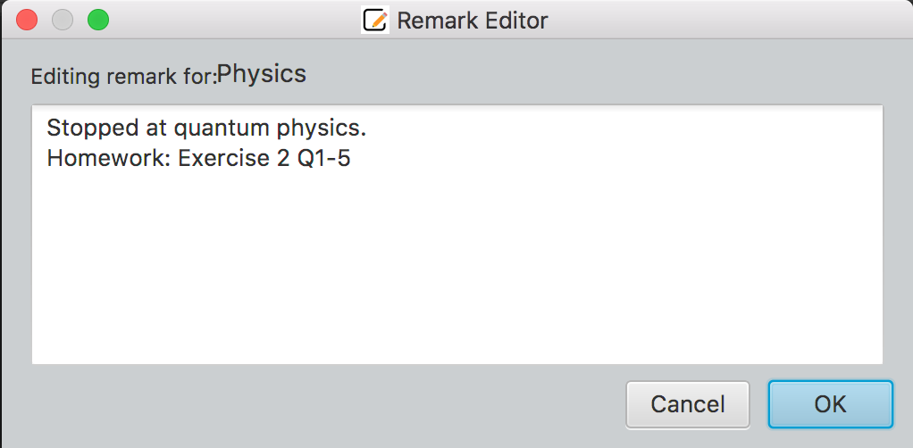

TutAssistor is a ***desktop app for private tutors to manage tuition class time slots, optimized for use via a Command Line Interface (CLI)***.

It enables tutors to resolve conflicts in their tuition schedule and manage their students more efficiently.

* Table of Contents
{:toc}

--------------------------------------------------------------------------------------------------------------------

## Quick start

### For Windows
1. Download the latest TutAssistor release from [our github site](https://github.com/AY2122S1-CS2103T-T12-4/tp/releases).
2. Double click the downloaded TutAssistor.jar file to launch TutAssistor.

### For Mac
1. Download the latest TutAssistor release from [our github site](https://github.com/AY2122S1-CS2103T-T12-4/tp/releases).
2. Open Terminal.
3. Change the active directory to the location of TutAssistor.jar.

For example,
```
cd Downloads
```
4. Run the following command.
```
java -jar TutAssistor.jar
```

--------------------------------------------------------------------------------------------------------------------

## Features
<div markdown="span" class="alert alert-primary">
Tip: When using the following commands, refer to the 'Addition Formatting Information for Commands' section of this guide to learn the requirements for the various parameters used.
</div>

### Adding students/tuition classes

#### Adding a student: `add`

Command Shortcut: `a`

Adds a student’s information such as n/NAME, p/PHONE_NUMBER.

Format: `add n/NAME p/PHONE_NUMBER e/EMAIL a/ADDRESS [r/REMARK]`

Examples:

```
add n/John Doe p/98765432 e/johnd@example.com a/John street, block 123, #01-01
```
```
a n/Richard Ng p/97865342 e/richardng@example.com a/Yishun Ave 1 block 60, #07-12 r/Can only attend on even weeks
```

#### Adding a tuition class: `addclass`

Command Shortcut: `ac`

Adds a tuition class with a set l/LIMIT of students at specified ts/TIMESLOT.

The students to be added are optional. The time slot should follow the format "Www hh:mm-hh:mm" to help TutAssistor check if the time slot is already taken or there is an overlap on time slots. 
If there is any conflict or overlap, TutAssistor will alert the conflict.

Format: `addclass n/NAME l/LIMIT ts/TIMESLOT [s/NAME,NAME,NAME...] [r/REMARK]`

Note that if you are listing multiple students, there must not be a space after each comma.

Examples:
```
addclass n/Chemistry l/16 ts/Thu 15:00-17:00 s/Bernice Yu,Richard Ng
```
```
ac n/Math l/8 ts/Mon 11:00-14:00 r/Quiz on final lesson
```

### Viewing students/tuition classes

Provides a detailed view of student or class information of a given INDEX.

#### Viewing a student: `student`

Command Shortcut: `vs`

Format: `student INDEX`

Example:
```
student 2
```
or
```
vs 2
```

An example of a student information page.

#### Viewing a tuition class: `class`

Command Shortcut: `vc`

Format: `class INDEX`

Example:
```
class 3
```
or
```
vc 3
```

An example of a class information page.

### Editing students/tuition classes

Edits a student’s information such as n/NAME, p/PHONE_NUMBER.
Edits a tuition class's information such as its ts/TIMESLOT.

#### Editing a student: `edit`

Command Shortcut: `e`

Format: `edit INDEX [n/NAME] [p/PHONE] [e/EMAIL] [a/ADDRESS]`

Examples:
```
edit 1 n/Jason Tan a/221b Baker Street
```
```
e 2 p/62353535
```

#### Editing a class: `editclass`

Command Shortcut: `ec`

Format: `editclass INDEX [n/NAME] [l/LIMIT] [ts/TIMESLOT]`

Examples:
```
editclass 2 l/10
```
```
ec 3 n/Trigonometry ts/Sun 10:00-11:00
```

### Deleting students/tuition classes

Deletes a student or a tuition class of a given INDEX. Has the option to delete multiple at a time.

#### Deleting students: `delete`

Command Shortcut: `del`

Format: `delete STUDENT_INDEX [STUDENT_INDEX]...`

Example:
```
delete 1 2
```
```
del 1
```

#### Deleting tuition classes: `deleteclass`

Command Shortcut: `delc`

Format: `deleteclass CLASS_INDEX [CLASS_INDEX]...`

Example:
```
deleteclass 1 2
```
```
delc 4
```

### Adding/Removing an existing student from class

Move a student into/out of classes by adding or removing them.

#### Adding existing students to a class: `addtoclass`

Command Shortcut: `atc`

Add one or more existing students to an existing class, using student NAME or INDEX.

When adding students by NAME, use commas(`,`) to separate names, with no spaces after each comma.

When adding students by INDEX, use spaces to separate indexes.

Format:

`addtoclass si/STUDENT_INDEX [STUDENT_INDEX]... tc/CLASS_INDEX`

or

`addtoclass s/NAME[,NAME,NAME...] tc/CLASS_INDEX`

Examples:
```
addtoclass si/1 tc/1
```
```
atc si/1 2 3 4 tc/1
```
```
addtoclass s/James,Felicia tc/2
```
```
atc s/James tc/3
```

#### Removing existing students from a class: `remove`

Command Shortcut: `rm`

Removes existing students from a tuition class using student INDEX.

Format: `remove si/INDEX_STUDENT [INDEX_STUDENT]... tc/CLASS_INDEX`

Examples:
```
remove si/1 tc/1
```
```
rm si/1 2 3 4 tc/2
```

### Adding remark to a student/tuition class
Upon entering the command, a pop-up window is displayed for the user to edit the remarks.

#### Adding remarks to a student: `remark`

Command Shortcut: `re`

Adds or modifies a remark for a student of a given INDEX.

A window with a text box will be displayed to edit the remarks for that student.

Format: `remark STUDENT_INDEX`

Example:
```
remark 2
```
or
```
re 2
```

Editing window for a student's remarks.

#### Adding remarks to a tuition class: `remarkclass`

Command Shortcut: `rec`

Adds or modifies a remark for a tuition class of a given INDEX.

A window with a text box will be displayed to edit the remarks for that class.

Format: `remarkclass CLASS_INDEX`

Example:
```
remarkclass 2
```
or
```
rec 1
```

Editing window for a tuition class's remarks.

<div markdown="span" class="alert alert-primary">
Note: When creating a new student or tuition class, you can use the `r/` tag to add remarks  directly.
</div>

### Finding students by name: `find`

Command Shortcut: `f`

Filters the list of students to only display all students whose names contain any of the given keywords (case-insensitive).

Format: `find KEYWORD [KEYWORD]...`

Example: 
```
find alice tan
```
or
```
f alice tan
```
TutAssistor will display a list of all students with `alice` or `tan` in their name.

#### Listing all students: `list`

Command Shortcut: `l`

Display list of all students after conducting a search with the `find` command.

### Finding classes by name: `findclass`

Command Shortcut: `fc`

Filters the list of classes to only display all classes whose names contain any of the given keywords (case-insensitive).

Format: `findclass KEYWORD [KEYWORD]...`

Example: 
```
findclass physics chemistry
```
or
```
fc physics chemistry
```
TutAssistor will display a list of all classes with `physics` or `chemistry` in their name.

#### Listing all classes: `listclass`

Command Shortcut: `lc`

Displays list of all classes after conducting a search with the `findclass` command.

### Sorting tuition classes: `sort`

Command Shortcut: `s`

Sorts tuition class list according to time or alphabetical order.

Without exiting TutAssistor, the list will be auto-sorted
when adding and editing classes after the tutor sorted the list.

Format: `sort [o/ORDER]`

Examples: (examples below are all possible usages of `sort`)
* `sort` (sort by time)
* `sort o/asc` (sort by ascending alphabetical order)
* `sort o/desc` (sort by descending alphabetical order)
* `sort o/time` (sort by time)

### View timetable: `timetable`

Command Shortcut: `tt`

Example:
```
timetable
```

Shows lessons scheduled in this week in a timetable.


### View today tuition classes: `today`

Command Shortcut: `td`

Displays an overview of all classes happening today.


### Viewing help: `help`

Command Shortcut: `h`

Shows a command summary, as well as a link to the user guide. <br>


### Navigating input history

When typing in the command box, use the **up** and **down** arrow keys to access and navigate through previously entered inputs.

### Clearing all stored data: `clear`
<div markdown="span" class="alert alert-primary">
❗THIS COMMAND IS IRREVERSIBLE. IT WILL DELETE ALL EXISTING STUDENT AND CLASS DATA❗
</div>

Clears all current student and tuition class data.

### Exiting the app: `exit`

Exits the program.<br>
Format: `exit`

## Additional Formatting Information for Commands

### Names
Student Names must be unique, aka there cannot be 2 or more students registered with the exact same name.

Names for tuition classes may be reused.

### Phone Numbers
Phone numbers should only contain numbers, and should be at least 3 digits long.

### Emails
Emails should be of the format `local-part@domain` and adhere to the following constraints:
1. The `local-part` should only contain alphanumeric characters and these special characters, `+` `_` `.` `-`. The `local-part` may not start or end with any special characters.
2. This is followed by a `@` and then a `domain` name. The domain name is made up of domain labels separated by periods.
   The domain name must:
    - end with a domain label at least 2 characters long
    - have each domain label start and end with alphanumeric characters
    - have each domain label consist of alphanumeric characters, separated only by hyphens, if any.

### Timeslots
Timeslots for classes follow the following format:
```
WWW HH:MM-HH:MM
```
where
- `WWW` is the day of the week, **abbreviated to the first three letters, with only the first letter capitalised**.

    Examples:
    - Correct: `Mon`, `Tue`, `Wed`, `Thu`, `Fri`, `Sat`, `Sun`
    - Incorrect: `mon`, `tuesday`, `WED`, `Thurs`, `Friday`, etc
- `HH:MM` is the time with 2 digits for the hour and 2 digits for the minute. The first time must be earlier in the day than the second time.
    Examples:
    - Correct: `09:00-14:30`
    - Incorrect: `9:00-14:00`, `9am-2pm`, `9-2`, `09:00-08:00`

### Index
Indices for students or tuition classes must be a whole number, starting from `1`.

It must not exceed the size of the respective list.

Example:

If the list consists of `5` students/tuition classes -
- Correct: `1`, `2`, `3`, `4`, `5`
- Incorrect: `0`, `1.5`, `a`, `6`, etc.

## Command Summary

Action | Format | Shortcut
-------|--------|---------
***Add Student*** | `add n/NAME p/PHONE_NUMBER e/EMAIL a/ADDRESS [r/REMARK]` | `a`
***Add Class*** | `addclass n/NAME l/LIMIT ts/TIMESLOT [s/NAME,NAME,NAME...] [r/REMARK]` | `ac`
***View Student*** | `student INDEX` | `vs`
***View Class*** | `class INDEX` | `vc`
***Edit Student*** | `edit INDEX [n/NAME] [p/PHONE] [e/EMAIL] [a/ADDRESS]` | `e`
***Edit Class*** | `editclass INDEX [n/NAME] [l/LIMIT] [ts/TIMESLOT]` | `ec`
***Delete Student*** | `delete INDEX_STUDENT [INDEX_STUDENT]...` | `del`
***Delete Class*** | `deleteclass INDEX_CLASS [INDEX_CLASS]...` | `delc`
***Add Student to Class*** | `addtoclass si/INDEX_STUDENT [INDEX_STUDENT]... tc/INDEX_CLASS`<br>or<br>`addtoclass s/NAME[,NAME...] tc/INDEX_CLASS` | `atc`
***Remove Students from Class*** | `remove si/INDEX_STUDENT [INDEX_STUDENT]... tc/INDEX_CLASS` | `rm`
***Add Remarks to Student*** | `remark INDEX_STUDENT` | `re`
***Add Remarks to Class*** | `remarkclass INDEX_CLASS` | `rec`
***Find Student by Name*** | `find KEYWORD [KEYWORD]...` | `f`
***List all Students*** | `list` | `l`
***Find Class by Name*** | `findclass KEYWORD [KEYWORD]...` | `fc`
***List all Classes*** | `listclass` | `lc`
***Sort Tuition Class*** | `sort [o/ORDER]` | `s`
***View Timetable*** | `timetable` | `tt`
***View Today's Classes*** | `today` | `td`
***Help*** | `help` | `h`
***Clear all data*** | `clear` | -
***Exit*** | `exit` | -

