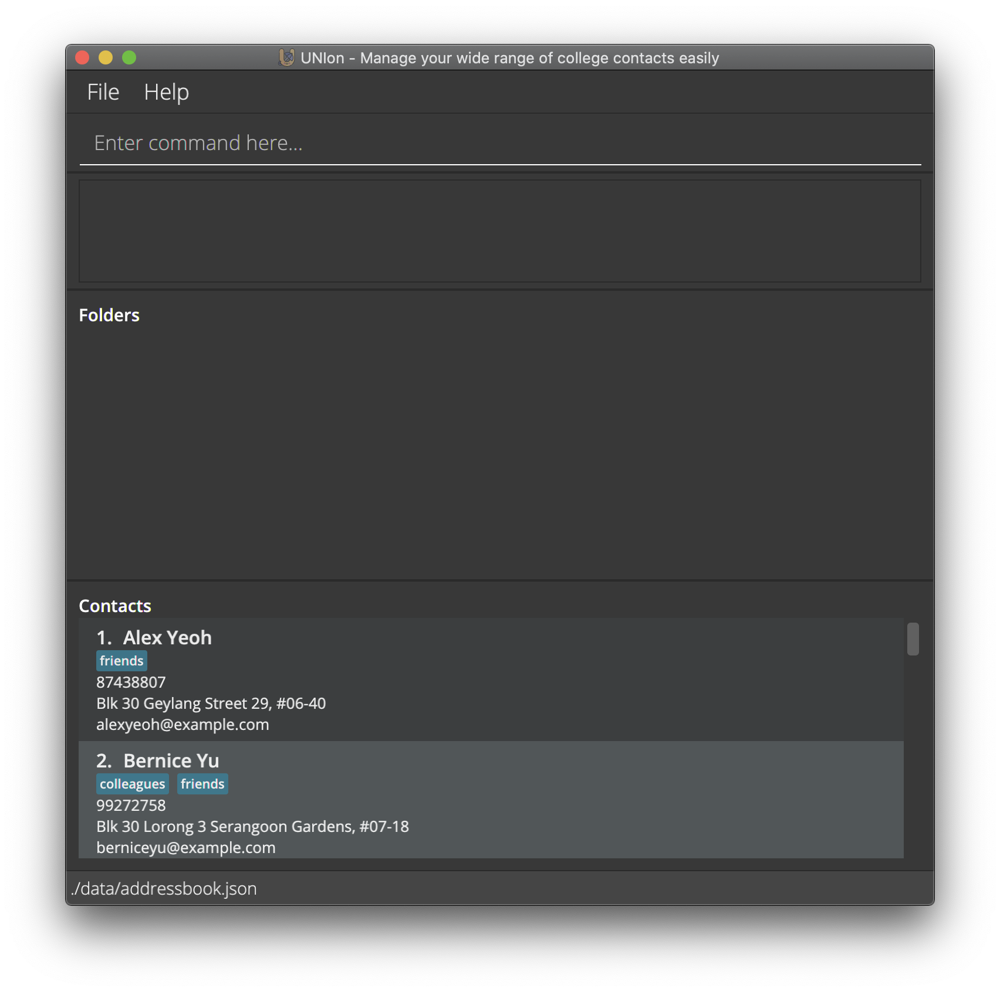

UNIon is a desktop app for organizing various types of contacts, optimized for use for the vast majority of computing students.
If you are already familiar with Unix commands, then UNIon will be easy for you to use.

* Table of Contents
{:toc}

--------------------------------------------------------------------------------------------------------------------

## Quick start

1. Ensure you have Java `11` or above installed in your Computer.
1. Download the latest JAR file from [here](https://github.com/AY2122S1-CS2103-T16-1/tp/releases).
1. Copy the file to the folder you want to use as the _home folder_ for your UNIon.
1. Double-click the file to start the app. The GUI should appear in a few seconds, and it should look similar to this image below. Note how the app contains some sample contacts. 
   

5. Type the command in the command box and press Enter to execute it. e.g. typing `help` and pressing Enter will open the help window. 
   Some example commands you can try:
   * `ls -contacts`: Lists all contacts.
   * `touch -n John Doe -p 98765432 -e johnd@example.com -a John street, block 123, #01-01`: Adds a contact named `John Doe` to UNIon.
   * `rm 3`: Deletes the 3rd contact shown in the current list.
   * `rm -contacts`: Deletes all contacts.
   * `exit`: Exits the app.
6. Refer to the [Features](#features) below for details of each command.

--------------------------------------------------------------------------------------------------------------------

## Features

**:information_source: Notes about the command format:** 

* Words in `UPPER_CASE` are the parameters to be supplied by the user. 
  e.g. in `touch -n NAME`, `NAME` is a parameter which can be used as `touch -n John Doe`.

* Items in square brackets are optional. 
  e.g. `-n NAME [-t TAG]` can be used as `-n John Doe -t friend` or as `-n John Doe`.

* Items with `…`​ after them can be used multiple times including zero times. 
  e.g. `[-t TAG]…​` can be used as ` ` (i.e. 0 times), `-t friend`, `-t friend -t family` etc.

* Parameters can be in any order. 
  e.g. if the command specifies `-n NAME -p PHONE`, `-p PHONE -n NAME` is also acceptable.

* If a parameter is expected only once in the command but you specified it multiple times, only the last occurrence of the parameter will be taken. 
  e.g. if you specify `-p 12341234 -p 56785678`, only `-p 56785678` will be taken.

* For commands that do not take in parameters (such as `help` and `exit`) , extraneous parameters will be ignored. 
  e.g. if the command specifies `help 123`, it will be interpreted as `help`.

* Flags such as `-contacts` and `-folders` are part of the command word and must be placed immediately after the main command word e.g. (`ls -contacts` not `ls -invalid_flag -contacts`)

### Viewing help: `help`

Shows a message explaining how to access the help page.

Format: `help`

### Managing people

#### Adding a person: `touch`

Adds a person to UNIon.

Format: `touch -n NAME -p PHONE -e EMAIL -a ADDRESS [-t TAG]…​`

* `NAME` has a character limit of 70 characters.
* `NAME` is case-sensitive as John Doe and john doe will be treated as different people.
* `PHONE` accepts any length to allow for phone formats from different countries.
* `ADDRESS` is truncated by an ellipsis if the contents cannot fit in one line.
* Duplicate tags are ignored.
* We recommend that `TAG`s are kept to a maximum of 50 characters. If a tag has more than 50 characters, you may not be able to view the entire tag (depending on the size of the window). 

:bulb: **Tip:**
A person can have any number of tags (including 0)

Examples:
* `touch -n John Doe -p 98765432 -e johnd@example.com -a John street, block 123, #01-01`
* `touch -n Betsy Crowe -t friend -e betsycrowe@example.com -a Newgate Prison -p 1234567 -t criminal`

#### Listing all persons: `ls -contacts`

Shows a list of all persons in UNIon.

Format: `ls -contacts`

#### Editing a person: `vim`

Edits an existing person in the UNIon.

Format: `vim INDEX [-n NAME] [-p PHONE] [-e EMAIL] [-a ADDRESS] [-t TAG]…​`

* Edits the person at the specified `INDEX`. The index refers to the index number shown in the displayed person list. The index **must be a positive integer** 1, 2, 3, …​
* At least one of the optional fields must be provided.
* `NAME` has a character limit of 70 characters.
* `PHONE` accepts any length to allow for phone formats from different countries.
* `ADDRESS` is truncated by an ellipsis if the contents cannot fit in one line.
* We recommend that `TAG`s are kept to a maximum of 50 characters. If a tag has more than 50 characters, you may not be able to view the entire tag (depending on the size of the window).

* Duplicate tags are ignored.
* Existing values will be updated to the input values.
* When editing tags, the existing tags of the person will be removed i.e. adding of tags is not cumulative.
* You can remove all the person’s tags by typing `-t` without specifying any tags after it.

Examples:
*  `vim 1 -p 91234567 -e johndoe@example.com` Edits the phone number and email address of the 1st person to be `91234567` and `johndoe@example.com` respectively.
*  `vim 2 -n Betsy Crower -t` Edits the name of the 2nd person to be `Betsy Crower` and clears all existing tags.

#### Locating persons by name: `find -contacts`

Finds persons whose names contain any of the given keywords.

Format: `find -contacts KEYWORD [MORE_KEYWORDS]`

* The search is case-insensitive. e.g. `hans` will match `Hans`
* The order of the keywords does not matter. e.g. `Hans Bo` will match `Bo Hans`
* Only the name is searched.
* Only full words will be matched e.g. `Han` will not match `Hans`
* Persons matching at least one keyword will be returned (i.e. `OR` search).
  e.g. `Hans Bo` will return `Hans Gruber`, `Bo Yang`
* All flags after `-contacts` will be ignored e.g. `find -contacts -invalid_flag Hans` is equivalent to `find -contacts Hans`

Examples:
* `find -contacts John` returns `john` and `John Doe`
* `find -contacts alex david` returns `Alex Yeoh`, `David Li` 

#### Deleting a person: `rm`

Deletes the specified person from UNIon.

Format: `rm INDEX`

* Deletes the person at the specified `INDEX`.
* The index refers to the index number shown in the displayed person list.
* The index **must be a positive integer** 1, 2, 3, …​

Examples:
* `ls -contacts` followed by `rm 2` deletes the 2nd person in UNIon.
* `find -contacts Betsy` followed by `rm 1` deletes the 1st person in the results of the `find -contacts` command.

#### Clearing all people: `rm -contacts`

Clears all contacts from UNIon.

Format: `rm -contacts`

### Managing folders

#### Adding a folder: `mkdir`

Creates a folder for contacts to be added into.

Format: `mkdir FOLDER_NAME`

* Creates a folder with the name `FOLDER_NAME`.
* `FOLDER_NAME` has a maximum character limit of 30.
* Duplicate folder names are not allowed.

Examples:

* `mkdir CS2103` creates a folder with the name `CS2103`.

#### Adding contacts to a folder: `echo`

Adds existing contacts into a folder.

Format: `echo CONTACT_INDEX [CONTACT_INDEX]... >> FOLDER_NAME`

* Adds the persons at the specified indices into the given folder. The index refers to the index number shown in the displayed person list. The index **must be a positive integer** 1, 2, 3, ...
* `CONTACT_INDEX` must be a valid index referring to an existing person in the current list of contacts shown
* `CONTACT_INDEX` must not already be in the folder
* If multiple `CONTACT_INDEX` are passed, they must be unique and cannot contain duplicates
* `FOLDER_NAME` must be an existing folder

Examples:
* `echo 3 >> CS2103` Adds contact 3 to CS2103 folder.
* `echo 3 4 1 9 10 >> CS2103` Add contacts 3, 4, 1, 9, 10 to CS2103 folder.

#### Deleting a contact from folder: `rm`

Deletes the specified contact from the list of contacts from the folder.

Format: `rm 1 >> FOLDER_NAME`

* Deletes contact number 1 seen on the contact list from the folder named `FOLDER_NAME`.

Examples:

* `rm 1 >> CS1010` deletes a contact that corresponds to index 1 in the contact list from the folder `CS1010`.

#### Listing all folders: `ls -folders`

Retrieves list of all folders created.

Format: `ls -folders`

#### Editing a folder name: `mv`

Replaces the old folder name with the new folder name.

Format: `mv OLD_FOLDER_NAME | NEW_FOLDER_NAME`

* `NEW_FOLDER_NAME` has a maximum character limit of 30.

#### Locating folders by name: `find -folders`

Finds folders whose name contains any of the given keywords.

Format: `find -folders KEYWORD [MORE_KEYWORDS]`

* The search is case-insensitive. e.g. `cs2103` will match `CS2103`
* The order of the keywords does not matter. e.g. `Team Project CS2103` will match `CS2103 Team Project`
* Partial words will be matched e.g. `CS` will match `CS2103` and `CS2101`.
* Folders matching at least one keyword will be returned (i.e. `OR` search).
  e.g. `CS2103 Team Project` will return `CS2103`, `Team Project`
* All flags after `-folders` will be ignored e.g. `find -folders -invalid_flag CS2103` is equivalent to `find -contacts CS2103`

Examples:
* `find -folders CS` returns `CS2103` and `CS2101`
* `find -folders CS2103 Team Project` returns `CS2103`, `Team Project`

#### Deleting a folder: `rmdir`

Deletes a specified folder

Format: `rmdir FOLDER_NAME`

* Deletes folder with the name `FOLDER_NAME`.

Examples:

* `rmdir CS1010` deletes a folder with the name `CS1010`.

#### Clearing all folders: `rm -folders`

Clears all folders from UNIon.

Format: `rm -folders`

### Exiting the program: `exit`

Exits the program.

Format: `exit`

--------------------------------------------------------------------------------------------------------------------

### Saving the data

UNIon data are saved in the hard disk automatically after any command that changes the data. There is no need to save manually.

### Editing the data file

UNIon data are saved as a JSON file `[JAR file location]/data/addressbook.json`. Advanced users are welcome to update data directly by editing that data file.

:exclamation: **Caution:**
If your changes to the data file makes its format invalid, UNIon will discard all data and start with an empty data file at the next run.

## FAQ

**Q**: How do I transfer my data to another Computer? 
**A**: Install the app on the other computer and overwrite the empty data file it creates with the file that contains the data of your previous UNIon home folder.

--------------------------------------------------------------------------------------------------------------------

## Command summary

Action | Format, Examples
--------|------------------
**Help** | `help`
**Add new contact** | `touch -n NAME -p PHONE -e EMAIL -a ADDRESS [-t TAG]`   e.g., `touch -n James Ho -p 22224444 -e jamesho@example.com -a 123, Clementi Rd, 1234665 -t friend -t colleague`
**List contacts** | `ls -contacts`
**Edit contact** | `vim INDEX [-n NAME] [-p PHONE] [-e EMAIL] [-a ADDRESS] [-t TAG]`   e.g., `vim 2 -n James Lee -e jameslee@example.com`
**Find contact** | `find -contacts KEYWORD [MORE_KEYWORDS]`  e.g., `find -contacts James Jake`
**Delete contact** | `rm INDEX`  e.g., `rm 3`
**Clear contacts** | `rm -contacts`
**Add new folder** | `mkdir FOLDER_NAME`   e.g. `mkdir CS2103`
**Add contact to folder** | `echo INDEX >> FOLDER_NAME`   e.g., `echo 3 >> CS2103`
**Add multiple contacts to folder** | `echo CONTACT_INDEX [CONTACT_INDEX]... >> FOLDER_NAME`   e.g. `echo 3 4 1 9 10 >> CS2103`
**Delete contact from folder** | `rm INDEX >> FOLDER_NAME`   e.g., `rm 1 >> CS2102`
**List folders** | `ls -folders`
**Edit folder name** | `mv OLD_FOLDER_NAME | NEW_FOLDER_NAME`   e.g., `mv CS2103 | CS2102`
**Find folders** | `find -folders KEYWORD [MORE_KEYWORDS]`  e.g., `find -folders CS2103`
**Delete folder** | `rmdir FOLDER_NAME`   e.g., `rmdir CS1010`
**Clear folders** | `rm -folders`
