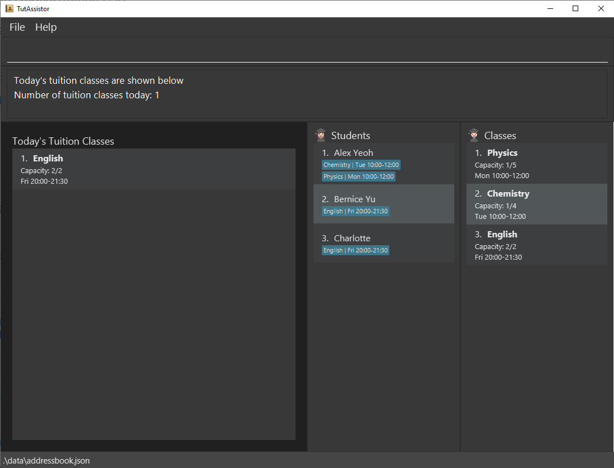

<p align="center">
  
</p>

Welcome to the _TutAssistor User Guide_! Simply choose a topic below to find answers, learn about the features, and manage tutoring better.

# Table of Contents
1. [Introduction](#1-introduction)

   1.1 [What is TutAssistor?](#11-what-is-tutassistor)

   1.2 [How to use this guide?](12-how-to-use-this-guide)

3. [Get started](#2-get-started)
4. [Features](#3-features)

   3.1 [Add student/class](#31-add-studenttuition-class)

   3.2 [View student/class](#32-view-studenttuition-class)

   3.3 [Edit student/class](#33-edit-studenttuition-class)

   3.4 [Delete student/class](#34-delete-studenttuition-class)

   3.5 [Move student](#35-addremove-student-from-class)

   3.6 [Add remark](#36-add-remark-to-studenttuition-class)

   3.7 [Find students/classes](#37-find-studenttuition-class)

   3.8 [List students/classes](#38-list-all-studentstuition-classes)

   3.9 [Sort classes](#39-sort-tuition-classes-sort--s)

   3.10 [View timetable](#310-view-timetable-timetable--tt)

   3.11 [View today's classes](#311-view-todays-classes-today--td)

   3.12 [View help](#312-view-help-help--h)

   3.13 [Navigate Input History](#313-navigate-input-history)
 
   3.14 [Clear data](#314-clear-data-clear)

   3.15 [Exit the program](#315-exit-the-app-exit)
   
   3.16 [Track payment `coming in v2.0`](#316-track-payment-coming-in-v20)

4. [Additional Command Format Information](#4-additional-command-format-information)
   
   4.1 [Name](#41-name)
   
   4.2 [Phone Number](#42-phone-number)
   
   4.3 [Email](#43-email)
  
   4.4 [Timeslot](#44-timeslot)

   4.5 [Index](#45-index)

5. [FAQ](#5-faq)
6. [Command Summary](#6-command-summary)

--------------------------------------------------------------------------------------------------------------------
## 1 Introduction

### 1.1 What is TutAssistor?
TutAssistor is a ***desktop app intended for private tutors to manage their students and classes, and it is optimized for use via a Command Line Interface (CLI)***.

TutAssistor provides an all-in-one platform for tutors to track student details, resolve conflicting tuition timeslots, and efficiently make notes for each lesson.

### 1.2 How to use this guide?
The features in this guide are formatted with the following conventions:
* **Command Keyword** - Each feature is executed by a command keyword. The shortcut for each command is shown together with its full command keyword separated by the <code>&#124;</code> symbol. The user can use the command shortcuts to reduce typing. 
* **Command Format** - Each command is accompanied by a set of information provided by the user. Refer to the [Features](#3-features) below for details of each command.
* **Example** - Possible usage of each features are provided. Users may follow these examples when familiarising with the app. 
* **Screenshots** - A visualisation of the expected outcome is provided for some of the features.

Jump right in to the next section to get you started!

--------------------------------------------------------------------------------------------------------------------

## 2 Get Started

### For Windows
1. Download the latest TutAssistor release from [our github site](https://github.com/AY2122S1-CS2103T-T12-4/tp/releases).
2. Double click the downloaded TutAssistor.jar file to launch TutAssistor.

### For Mac
1. Download the latest TutAssistor release from [our github site](https://github.com/AY2122S1-CS2103T-T12-4/tp/releases).
2. Open Terminal.
3. Change the active directory to the location of TutAssistor.jar.

    For example,
    
    ```
    cd Downloads
    ```
4. Run the following command.
  
    ```
    java -jar TutAssistor.jar
    ```

After launching the app, the GUI similar to the one shown below should appear in a few seconds. Note how the app contains some sample data.


--------------------------------------------------------------------------------------------------------------------

## 3 Features
<div markdown="block" class="alert alert-info">

**:information_source: Notes about the command format:**<br>

* Words in `UPPER_CASE` are the parameters to be supplied by the user.<br>
  e.g. in `add n/NAME`, `NAME` is a parameter which can be used as `add n/John Doe`.

* Items in square brackets are optional.<br>
  e.g `n/NAME [t/TAG]` can be used as `n/John Doe t/friend` or as `n/John Doe`.

* Items with `…`​ after them can be used zero or more times.<br>
  e.g. `[t/TAG]…​` can be used as ` ` (i.e. 0 times), `t/friend`, `t/friend t/family` etc.

* Parameters can be in any order.<br>
  e.g. if the command specifies `n/NAME p/PHONE_NUMBER`, `p/PHONE_NUMBER n/NAME` is also acceptable.

* If a parameter is expected only once in the command but you specified it multiple times, only the last occurrence of the parameter will be taken.<br>
  e.g. if you specify `p/12341234 p/56785678`, only `p/56785678` will be taken.

* Extraneous parameters for commands that do not take in parameters (such as `help`, `list`, `exit` and `clear`) will be ignored.<br>
  e.g. if the command specifies `help 123`, it will be interpreted as `help`.
   
Tip: Refer to the [Additional Command Format Information](#4-additional-command-format-information) under section 4 to learn the requirements of the various parameters used.
   
</div>

### 3.1 Add student/tuition class

#### Adding a student: `add` | `a`
Adds a student with the specified information such as name, phone number, etc.

Format: `add n/NAME p/PHONE_NUMBER e/EMAIL a/ADDRESS [r/REMARK]`

Examples:

```
add n/John Doe p/98765432 e/johnd@example.com a/John street, block 123, #01-01
```
```
a n/Richard Ng p/97865342 e/richardng@example.com a/Yishun Ave 1 block 60, #07-12 r/Can only attend on even weeks
```

#### Adding a tuition class: `addclass` | `ac`
Adds a tuition class with a set limit of students at a specified timeslot. TutAssistor will notify the user if there are any conflicting timeslots.

Format: `addclass n/NAME l/LIMIT ts/TIMESLOT [s/NAME,NAME,NAME...] [r/REMARK]`

* It is optional to add students into the class when creating a tuition class.
* The timeslot should follow the format "Www hh:mm-hh:mm".

<div markdown="span" class="alert alert-primary">:bulb: **Tip:**
There should not be a space after each comma when listing multiple students.
</div>

Examples:
```
addclass n/Chemistry l/16 ts/Thu 15:00-17:00 s/Bernice Yu,Richard Ng
```
```
ac n/Math l/8 ts/Mon 11:00-14:00 r/Quiz on final lesson
```

### 3.2 View student/tuition class
Displays the details the specified student or class in the information page.

#### Viewing a student: `student` | `vs`
Format: `student INDEX`

Example:
```
student 2
```
or
```
vs 2
```

*Displaying a student's details in the information page.*

#### Viewing a tuition class: `class` | `vc`
Format: `class INDEX`

Example:
```
class 3
```
or
```
vc 3
```

*Displaying a class' details in the information page.*

### 3.3 Edit student/tuition class
Edits an existing student or tuition class.

#### Editing a student: `edit` | `e`
Format: `edit INDEX [n/NAME] [p/PHONE] [e/EMAIL] [a/ADDRESS]`

Examples:
```
edit 1 n/Jason Tan a/221b Baker Street
```
```
e 2 p/62353535
```

#### Editing a class: `editclass` | `ec`
Format: `editclass INDEX [n/NAME] [l/LIMIT] [ts/TIMESLOT]`

Examples:
```
editclass 2 l/10
```
```
ec 3 n/Trigonometry ts/Sun 10:00-11:00
```

### 3.4 Delete student/tuition class
Deletes a student or a tuition class from TutAssistor.

* At least one student or class index must be provided.
   
* Provide multiple indices to delete multiple students or classes at once.

#### Deleting students: `delete` | `del`

Format: `delete STUDENT_INDEX [STUDENT_INDEX]...`

Example:
```
delete 1 2
```
```
del 1
```

#### Deleting tuition classes: `deleteclass` | `delc`

Format: `deleteclass CLASS_INDEX [CLASS_INDEX]...`

Example:
```
deleteclass 1 2
```
```
delc 4
```

### 3.5 Add/Remove student from class

Moves a student to/from a class.

#### Adding existing students to a class: `addtoclass` | `atc`

Adds one or more existing students to an existing class.

When adding multiple students at once, use:
* commas(`,`) to separate names, with no spaces after each comma.

* spaces to separate indices.

Format:

`addtoclass si/STUDENT_INDEX [STUDENT_INDEX]... tc/CLASS_INDEX`

or

`addtoclass s/NAME[,NAME,NAME...] tc/CLASS_INDEX`

Examples:
```
addtoclass si/1 tc/1
```
```
atc si/1 2 3 4 tc/1
```
```
addtoclass s/James,Felicia tc/2
```
```
atc s/James tc/3
```

#### Removing existing students from a class: `remove` | `rm`

Removes an existing student from a tuition class.

Format: `remove si/INDEX_STUDENT [INDEX_STUDENT]... tc/CLASS_INDEX`

Examples:
```
remove si/1 tc/1
```
```
rm si/1 2 3 4 tc/2
```

### 3.6 Add remark to student/tuition class
Upon entering the command, a pop-up window with a text box is displayed for the user to edit remarks.

<div markdown="span" class="alert alert-primary">:bulb: **Tip:**
Users can add, remove, or edit remarks through the editor window.
</div>


*Editing remarks with editor window*

#### Adding remark to a student: `remark` | `re`

Adds a remark for a student.

Format: `remark STUDENT_INDEX`

Example:
```
remark 2
```
or
```
re 2
```

#### Adding remark to a tuition class: `remarkclass` | `rec`

Adds a remark for a tuition class.

Format: `remarkclass CLASS_INDEX`

Example:
```
remarkclass 2
```
or
```
rec 1
```

<div markdown="span" class="alert alert-primary">
Note: When creating a new student or tuition class with the `add` command, you can use the `r/` tag to add remarks  directly.
</div>

### 3.7 Find student/tuition class
Filters the list based on the given keywords. The keywords are case-insensitive.

#### Finding students by name: `find` | `f`
Displays a list of students whose name matches the given keywords.

Format: `find KEYWORD [KEYWORD]...`

Example: 
```
find alice tan
```
or
```
f alice tan
```
TutAssistor will display a list of all students with `alice` or `tan` in their name.

#### Finding classes by name: `findclass` | `fc`

Displays a list of classes whose name matches the given keywords.

Format: `findclass KEYWORD [KEYWORD]...`

Example: 
```
findclass physics chemistry
```
or
```
fc physics chemistry
```
TutAssistor will display a list of all classes with `physics` or `chemistry` in their name.


The filtered list should look similar to the example shown below: <br>

*Example of executing `find alice tan` command*

### 3.8 List all students/tuition classes
Shows the full list of students or classes.

#### Listing all students: `list` | `l`

Displays a list of all students.

Format: `list`

#### Listing all classes: `listclass` | `lc`

Displays list of all classes.

Format: `listclass`

### 3.9 Sort tuition classes: `sort` | `s`

Sorts tuition class list according to time or alphabetical order.

* After the user executes the `sort` command, the list will continue to remain sorted even after adding or editing classes.
* The list will not be automatically sorted upon restarting TutAssistor, i.e., the user will have to execute the `sort` command again.

Format: `sort [o/ORDER]`

The possible usages of `sort` are given below:
* `sort` sorts by time
* `sort o/asc` sorts by ascending alphabetical order
* `sort o/desc` sorts by descending alphabetical order
* `sort o/time` sorts by time

### 3.10 View timetable: `timetable` | `tt`
Shows classes scheduled in this week in a timetable.

Format:
```
timetable
```


*A weekly view of all classes.*

### 3.11 View today's classes: `today` | `td`
Displays an overview of all classes happening today.


*A list of view of all classes happening today.*

### 3.12 View help: `help` | `h`

Shows a command summary, as well as a link to the user guide. <br>

Format: `help`


*The help window*

### 3.13 Navigate input history

When typing in the command box, use the **up** and **down** arrow keys to access and navigate through previously entered inputs.

### 3.14 Clear data: `clear`
Clears all current student and tuition class data.

Format: `clear`

<div markdown="span" class="alert alert-primary">
❗THIS COMMAND IS IRREVERSIBLE. IT WILL DELETE ALL EXISTING STUDENT AND CLASS DATA❗
</div>

### 3.15 Exit the app: `exit`

Exits the program.

Format: `exit`

### 3.16 Track payment `coming in v2.0`
_Detais coming soon..._

--------------------------------------------------------------------------------------------------------------------

## 4 Additional Command Format Information

### 4.1 Name
Student name is unique. There cannot be 2 or more students registered with the exact same name.

Names for tuition classes may be reused.

### 4.2 Phone Number
Phone number should only contain digits, and should be at least 3 digits long.

### 4.3 Email
Email should be of the format `local-part@domain` and adhere to the following constraints:
1. The `local-part` should only contain alphanumeric characters and these special characters, `+` `_` `.` `-`. The `local-part` may not start or end with any special characters.
2. This is followed by a `@` and then a `domain` name. The domain name is made up of domain labels separated by periods.
   The domain name must:
    - end with a domain label at least 2 characters long
    - have each domain label start and end with alphanumeric characters
    - have each domain label consist of alphanumeric characters, separated only by hyphens, if any

### 4.4 Timeslot
Timeslot for classes follows the format:
```
Ddd HH:mm-HH:mm
```
where
- `Ddd` is the day of the week, **abbreviated to the first three letters, with only the first letter capitalised**.

    Examples:
    - Correct: `Mon`, `Tue`, `Wed`, `Thu`, `Fri`, `Sat`, `Sun`
    - Incorrect: `mon`, `tuesday`, `WED`, `Thurs`, `Friday`, etc
- `HH:mm` is the time with 2 digits for the hour and 2 digits for the minute. The first time must be earlier in the day than the second time.

    Examples:
    - Correct: `09:00-14:30`
    - Incorrect: `9:00-14:00`, `9am-2pm`, `9-2`, `09:00-08:00`

### 4.5 Index
Index for a student or tuition class must be a positive integer, starting from `1`. It must not exceed the size of the list.

For example, if the list consists of `5` students/tuition classes:
- Correct: `1`, `2`, `3`, `4`, `5`
- Incorrect: `0`, `1.5`, `a`, `6`, etc.

--------------------------------------------------------------------------------------------------------------------

## 5 FAQ

**Q**: How do I transfer my data to another Computer?<br>
**A**: Install the app in the other computer and overwrite the empty data file it creates with the file that contains the data of your previous TutAssistor home folder.

--------------------------------------------------------------------------------------------------------------------

## 6 Command Summary

Action | Format | Shortcut
-------|--------|---------
***Add Student*** | `add n/NAME p/PHONE_NUMBER e/EMAIL a/ADDRESS [r/REMARK]` | `a`
***Add Class*** | `addclass n/NAME l/LIMIT ts/TIMESLOT [s/NAME,NAME,NAME...] [r/REMARK]` | `ac`
***View Student*** | `student INDEX` | `vs`
***View Class*** | `class INDEX` | `vc`
***Edit Student*** | `edit INDEX [n/NAME] [p/PHONE] [e/EMAIL] [a/ADDRESS]` | `e`
***Edit Class*** | `editclass INDEX [n/NAME] [l/LIMIT] [ts/TIMESLOT]` | `ec`
***Delete Student*** | `delete INDEX_STUDENT [INDEX_STUDENT]...` | `del`
***Delete Class*** | `deleteclass INDEX_CLASS [INDEX_CLASS]...` | `delc`
***Add Student to Class*** | `addtoclass si/INDEX_STUDENT [INDEX_STUDENT]... tc/INDEX_CLASS`<br>or<br>`addtoclass s/NAME[,NAME...] tc/INDEX_CLASS` | `atc`
***Remove Students from Class*** | `remove si/INDEX_STUDENT [INDEX_STUDENT]... tc/INDEX_CLASS` | `rm`
***Add Remarks to Student*** | `remark INDEX_STUDENT` | `re`
***Add Remarks to Class*** | `remarkclass INDEX_CLASS` | `rec`
***Find Student by Name*** | `find KEYWORD [KEYWORD]...` | `f`
***Find Class by Name*** | `findclass KEYWORD [KEYWORD]...` | `fc`
***List all Students*** | `list` | `l`
***List all Classes*** | `listclass` | `lc`
***Sort Tuition Class*** | `sort [o/ORDER]` | `s`
***View Timetable*** | `timetable` | `tt`
***View Today's Classes*** | `today` | `td`
***Help*** | `help` | `h`
***Clear all data*** | `clear` | -
***Exit*** | `exit` | -

