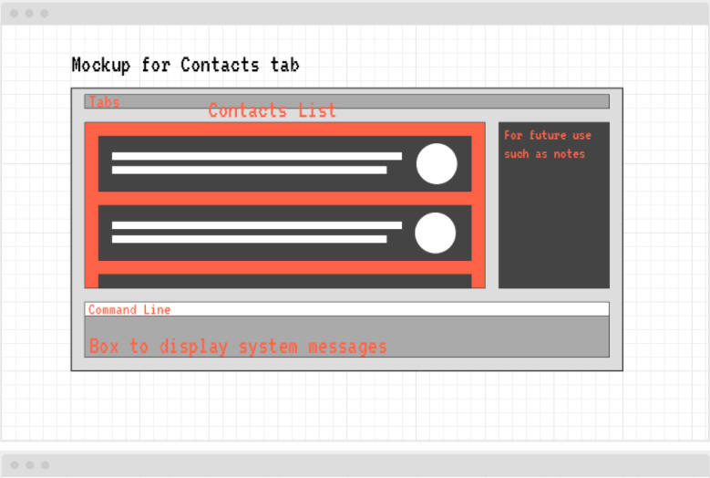
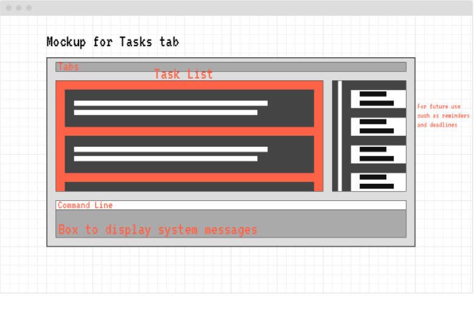

## Quick start

1. Ensure you have Java `11` or above installed in your Computer.

1. Download the latest `dash.jar` from here (not available yet).

1. Copy the file to the folder you want to use as the _home folder_ for Dash.

1. Double-click the file to start the app. The GUI similar to the below should appear in a few seconds.<br>
   

1. Type the command in the command box and press Enter to execute it. e.g. typing **`help`** and pressing Enter will open the help window.<br>
   Some example commands you can try:

* **`contacts`** : Switches to the contacts tab.

* **`tasks`** : Switches to the tasks tab.

* **`add n/NAME [p/PHONE_NUMBER] [e/EMAIL] [a/ADDRESS] [t/TAG]...`**`3` : Adds a contact with specified details.

* **`clear`** : Deletes all contacts.

* **`exit`** : Exits the app.

1. Refer to the [Features](#features) below for details of each command.

--------------------------------------------------------------------------------------------------------------------

## Features

<div markdown="block" class="alert alert-info">

**:information_source: Notes about the command format:**<br>

* Words in `UPPER_CASE` are the parameters to be supplied by the user.<br>
  e.g. in `add n/NAME`, `NAME` is a parameter which can be used as `add n/John Doe`.

* Items in square brackets are optional.<br>
  e.g `n/NAME [t/TAG]` can be used as `n/John Doe t/friend` or as `n/John Doe`.

* Items with `…` after them can be used multiple times including zero times.<br>
  e.g. `[t/TAG]…` can be used as ` ` (i.e. 0 times), `t/friend`, `t/friend t/family` etc.

* Parameters can be in any order.<br>
  e.g. if the command specifies `n/NAME p/PHONE_NUMBER`, `p/PHONE_NUMBER n/NAME` is also acceptable.

* If a parameter is expected only once in the command but you specified it multiple times, only the last occurrence of the parameter will be taken.<br>
  e.g. if you specify `p/12341234 p/56785678`, only `p/56785678` will be taken.

* Extraneous parameters for commands that do not take in parameters (such as `help`, `contacts`, `tasks` and `clear`) will be ignored.<br>
  e.g. if the command specifies `help 123`, it will be interpreted as `help`.

</div>

### General

#### Switch Tabs: [contacts] or [tasks] or [help]

Switches to another specified tab.

Format: ```contacts or tasks or help```

#### Exiting the program: [exit]

Exits the program.

Format: ```exit```

### Contacts

#### Adding contact details of a person: [add]

Adds a contact to the address book. Only name is compulsory during creation.

Format: ```add n/NAME [p/PHONE_NUMBER] [e/EMAIL] [a/ADDRESS] [t/TAG]...```

#### Editing contact details: [edit]

Replaces the contact details of the contact at the chosen index with the new details.

Format: ```edit INDEX [n/NAME] [p/PHONE_NUMBER] [e/EMAIL a/ADDRESS] [t/TAG]...```

* Edits the person at the specified INDEX. The index refers to the index number shown in the displayed contact list. The index must be a positive integer 1, 2, 3, …​
* At least one of the optional fields must be provided.
* Existing values will be updated to the input values.
* When editing tags, the existing tags of the person will be removed i.e adding of tags is not cumulative.
* You can remove all the person’s tags by typing t/ without specifying any tags after it.

#### Deleting a contact: [delete]

Deletes the contact at the chosen index.

Format: ```delete INDEX```

* Deletes the person at the specified INDEX.
* The index refers to the index number shown in the contact list.
* The index must be a positive integer i.e. 1, 2, 3, …

#### Finding contact through searching name: [find]

Finds all contacts whose name matches the search term.

Format: ```find NAME```

* The search is case-insensitive. e.g hans will match Hans
* The order of the keywords does not matter. e.g. Hans Bo will match Bo Hans
* Only the name is searched.
* Persons matching all keywords will be returned (i.e. AND search). e.g. Hans Bo will return only Hans Bo and Hans Bo the Second. It will not return Hans Gruber, Bo Yang

#### Finding contact through searching a specific field: [find]

Finds all contacts whose parameter (number, email, etc) matches the search term.

Format: ```find [p/PHONE_NUMBER] [e/EMAIL] [a/ADDRESS] [t/TAG]...```

* The search is case-insensitive. e.g hans@gmail.com will match Hans@gmail.com
* The order of the keywords does not matter. e.g. a/tampines 123 will match Blk 123 Tampines.
* Contacts matching all keywords will be returned (i.e. AND search). e.g. “find p/86235343 t/CS2101” will return only contacts who both have the given phone number AND the tag CS2101. It will not return contacts with different phone numbers, even if they contain the tag CS2101.

#### Clearing all contacts: [clear]

Deletes all contacts.

Format: ```clear```

### Tasks (When on tasks tab)

#### Adding a task: [add]

Adds a task to the task list. Only task description is compulsory during creation.

Format: ```add d/DESCRIPTION [t/TAG]...```

#### Editing

Replaces the details of the task at the given index with the new details.

Format: ```edit INDEX [d/DESCRIPTION] [t/TAG]...```

* Edits the specified task fields at the specified INDEX
* The index refers to the index number shown in the task list
* The index must be a positive integer i.e. 1, 2, 3, …

#### Editing task details [edit]

Replaces the details of the task at the given index with the new details.

Format: ```edit INDEX [d/DESCRIPTION] [t/TAG]...```

* Edits the specified task fields at the specified INDEX
* The index refers to the index number shown in the task list
* The index must be a positive integer i.e. 1, 2, 3, …

#### Deleting a task [delete]

Deletes the task at the chosen index.

Format: ```delete INDEX```

* Deletes the person at the specified INDEX
* The index refers to the index number shown in the task list
* The index must be a positive integer i.e. 1, 2, 3, …

#### Finding task through task description: [find]

Finds all tasks with descriptions that match the search term.

Format: ```find DESCRIPTION```

* The search is case-insensitive. e.g job will match Job
* The order of the keywords does not matter. e.g. home work will match work home
* Only the description field is searched.
* Task descriptions matching all keywords will be returned (i.e. AND search). e.g. Do this will return only Do this and Do this (very important!!!). It will not return Do maybe? or This doesn’t matter

#### Clearing all tasks: [clear]

Deletes all tasks.

Format: ```clear```

## Command summary

### General

Action | Format
--------|------------------
**Contacts** | `contacts`
**Tasks** | `tasks`
**Exit** | `exit`
**Help** | `help`

### Contact Tab

Action | Format
--------|------------------
**Add** | `add n/NAME [p/PHONE_NUMBER] [e/EMAIL] [a/ADDRESS] [t/TAG]`
**Edit** | `edit INDEX [n/NAME] [p/PHONE_NUMBER] [e/EMAIL a/ADDRESS] [t/TAG]`
**Delete** | `delete INDEX`
**Find** | `find NAME`
**Find** | `find [p/PHONE_NUMBER] [e/EMAIL] [a/ADDRESS] [t/TAG]`
**Clear** | `clear`

### Tasks Tab

Action | Format
--------|------------------
**Add** | `add d/DESCRIPTION [t/TAG]`
**Edit** | `edit INDEX [d/DESCRIPTION] [t/TAG]`
**Delete** | `delete INDEX`
**Find** | `find DESCRIPTION`
**Find** | `find [t/TAG]`
**Clear** | `clear`

## UI Mockup



