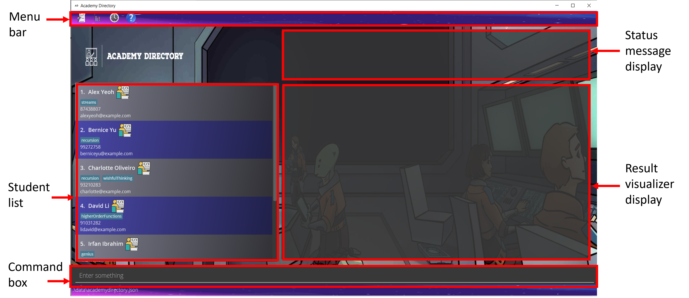
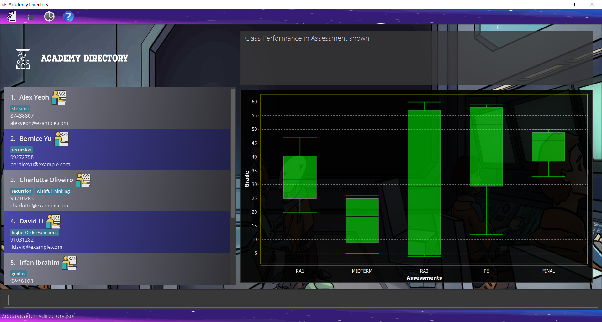
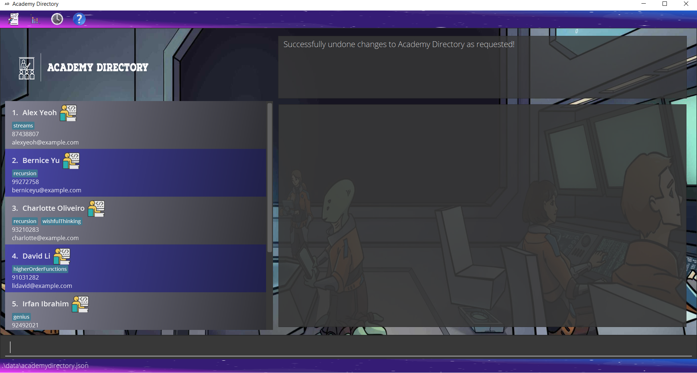
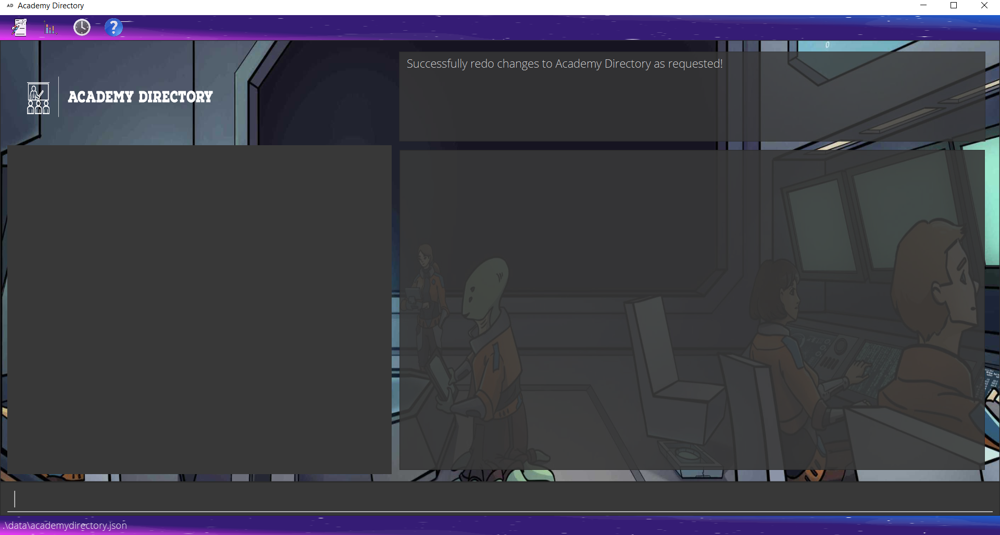
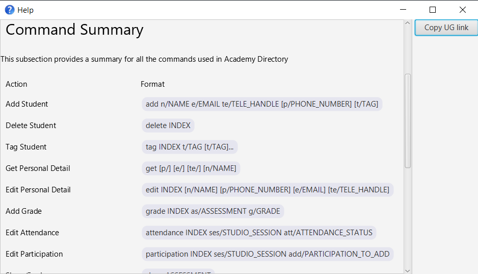
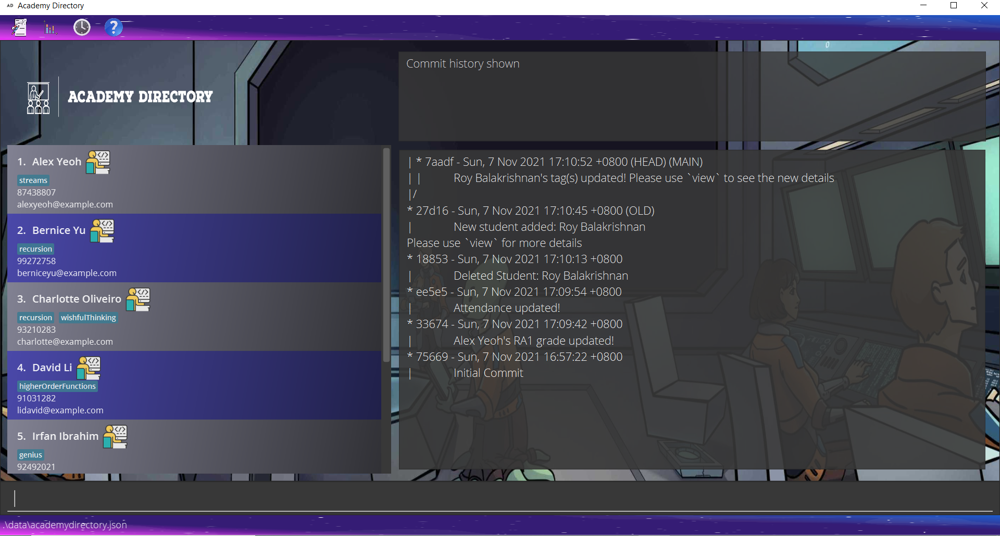
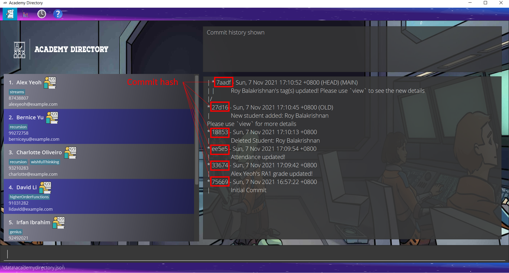

## Table of Contents
* [Overview](#overview)
* [Information About this User Guide](#information-about-this-user-guide)
  * [Purpose of User Guide](#purpose)
  * [Target Audience of User Guide](#target-audience)
* [Quick Start](#quick-start)
* [Preview](#preview)
* [Features](#features)
  * [Manage Students' Personal Details](#managing-students-personal-details)
    * [Add Student](#adding-a-student-add)
    * [Delete Student](#deleting-a-student-delete)
    * [Tag Student](#tagging-a-student--tag)
    * [Get Personal Detail](#getting-personal-detail-of-students-get)
    * [Edit Personal Detail](#editing-a-students-detail--edit)
  * [Track Students' Grades, Studio Attendance, and Participation](#tracking-students-grades-studio-attendance-and-participation)
    * [Add Grade](#adding-grades-for-an-assessment--grade)
    * [Edit Attendance](#editing-a-students-studio-attendance-attendance)
    * [Edit Participation](#editing-a-students-studio-participation-participation)
  * [Visualizing Tools](#visualization-tools)
    * [View student information](#viewing-all-related-information-of-a-student-view)
    * [Show Grade](#displaying-the-grades-for-an-assessment--show)
    * [Visualize all Grades](#visualizing-assessments-grades-of-the-entire-class-visualize)
    * [Filter Academy Directory](#filtering-academy-directory-by-name-or-tag-filter)
    * [Sort Student List](#sorting-student-list--sort)
  * [Others](#others)
    * [List All Students](#listing-all-students--list)
    * [Clear Student List](#clearing-all-students--clear)
    * [Undo Changes](#undo-changes-to-academy-directory-undo)
    * [Redo Changes](#redo-changes-to-academy-directory-redo)
    * [Help](#seeking-help--help)
      * [General Help](#viewing-general-help)
      * [Help with Specific Command](#viewing-specific-help)
    * [Exit Academy Directory](#exiting-the-program--exit)
    * [(For Advanced Users): View Commit History](#for-advanced-users-viewing-commit-history-history)
    * [(For Advanced Users): Revert Commit](#for-advanced-users-reverting-commit-revert)
* [FAQ](#faq)
* [Summary](#summary)
  * [Command Summary](#command-summary)
  * [Prefix Summary](#prefix-summary)
* [Glossary](#glossary)
* [Links](#links)
  * [Academy Directory Resources](#academy-directory-resources)
  * [Other Resources](#other-sources)
* [Acknowledgements](#acknowledgements)

--------------------------------------------------------------------------------------------------------------------
## Overview
Are you a CS1101S Avenger? Are you tired of dealing with
so many platforms like Luminus, Source Academy, etc.? And none of these platforms are even remotely useful for you? 

Well, we have good news. Academy Directory is just the application for you!

Academy Directory (AD) is a **desktop application for CS1101S tutors to manage their students.** Its main features are as follows: 
- [Manage students’ personal details](#managing-students-personal-details)
- [Track students' grades, Studio attendance, and participation](#tracking-students-grades-studio-attendance-and-participation)
- [Visualize data in Academy Directory](#visualization-tools) 

Academy Directory is written in _Java_ and thus can be run on all major operating systems!
It is optimized for use via a Command Line Interface (CLI), while still having the benefits of a Graphical User Interface (GUI).
Academy Directory is developed as an evolution of the Address Book 3 application, primarily for usage in teaching CS1101S - Programming Methodology I - at the National University of Singapore.

## Information about this User Guide
### Purpose
This user guide aims to: 
- Provide first-time users with information on how to use Academy Directory
- Show [details of all commands](#features) should users face any issues using any
of the command in Academy Directory
- Answer some of the [frequently asked questions](#faq)
- Provide a [summary of all commands](#command-summary) supported by Academy Directory

### Target Audience
The current version of Academy Directory is specifically designed for 
**CS1101S Avengers**. Therefore, the main Target Audience of this user guide are CS1101S Avengers.
As such, the following assumptions are made regarding the Target Audience:
- Can type fast and are comfortable using a CLI.
- Is comfortable downloading and installing software such as Java 11.
onto their system.
- Is familiar with the common terms relating to Computer Science.
- Is familiar with CS1101S module structure and teaching pedagogy.

While some technical background is assumed, we also provide the definitions for
certain technical terms commonly used in this user guide [here](#glossary).
--------------------------------------------------------------------------------------------------------------------
## Quick Start
This section provides instructions to begin using Academy Directory.

1. Ensure you have Java `11` or above installed in your Computer. Academy Directory has been tested on Java `11` and running on other versions might result in **bugs**.

2. Download the latest release [here](https://github.com/AY2122S1-CS2103T-T15-3/tp/releases) to the folder you want to use as the _home folder_ for your Academy Directory.

3. From the CLI, navigate to the folder used as *home folder* for Academy Directory and run `java -jar academydirectory.jar`. Ensure that the `.jar` file is named `academydirectory.jar`, otherwise the command will not work. 
A GUI similar to the below image should appear in a few seconds. Note how the app already contains some sample data. 
   

4. Type a command in the command box and press Enter to execute it. e.g. typing **`help`** and pressing Enter will open the help window. 
   Some example commands you can try:

   * **`list`** : Lists all contacts. For new users, the list will contain some sample data which users can delete.

   * **`visualize`** : Visualize grades of students. For new users, an empty whisker box plot diagram will be shown. Otherwise, the above image will be shown.

   * **`exit`** : Exits the app.

5. You may refer to the [Features](#features) below for the set of features supported by Academy Directory and the details for each command.

Notes:
- While it is possible to open `academydirectory.jar` by double-clicking it, this may cause Academy Directory
related files to be saved to an indeterminate location on the computer. As such, this method is _not recommended_, especially
for beginners. 
- The `clear` command can be used to remove the sample data in Academy Directory.
- Changes to Academy Directory are automatically saved into the database.

## Preview

Have you installed Academy Directory successfully? Let us now walk you through you how Academy Directory works, by starting off with a tutorial on how to interpret our User Interface design.

Components of UI | Functionality
--- | ---
Menu bar | Provides an immediate mean to execute commands relating to student academic data or usage history. There are 4 menus to choose from.
Student list | Shows the current list of students in your class, along with their tags and contact number. You can scroll through the list to see more students. Each student will be shown only their name, phone number (if have), email address, and tags (if have)
Command box | This is where you will enter your command and press Enter to use Academy Directory Command Line Interface
Status message display | This is where Academy Directory will inform you of what is happening after the commands you entered
Result visualizer display | This is where Academy Directory will visualize your data or results, on your request.

--------------------------------------------------------------------------------------------------------------------

## Features
This section shows all the commands supported by Academy Directory.

The commands are categorized based on the main features of Academy Directory: 
- Manage students’ personal details
- Track students' grades, Studio attendance, and participation
- Visualize data in Academy Directory
- Others

For better reading experience, please be familiar with the command format (shown below) as well as [some terms used](#glossary).

**:information_source: Notes about the command format:** 

* Words in `UPPER_CASE` are the parameters to be supplied by the user. 
  e.g. in `add n/NAME`, `NAME` is a parameter which can be used as `add n/John Doe`.

* Items in square brackets are optional. 
  e.g. `n/NAME [t/TAG]` can be used as `n/John Doe t/streams` or as `n/John Doe`.

* Items with `…`​ after them can be used multiple times including zero times. 
  e.g. `[t/TAG]…​` can be used as ` ` (i.e. 0 times), `t/streams`, `t/envmodel t/recursion` etc.

* Parameters can be in any order. 
  e.g. if the command specifies `n/NAME p/PHONE_NUMBER`, `p/PHONE_NUMBER n/NAME` is also acceptable.

* If a parameter is expected only once in the command, but you specified it multiple times, only the last occurrence of the parameter will be taken. 
  e.g. if you specify `p/12341234 p/56785678`, only `p/56785678` will be taken.

* Extraneous parameters for commands that do not take in parameters (such as `help`, `list`, `exit` and `clear`) will be ignored. 
  e.g. if the command specifies `help 123`, it will be interpreted as `help`.

***

### Managing students' personal details
#### Adding a student: `add`

Adds a student to Academy Directory

Format: `add n/NAME e/EMAIL te/TELE_HANDLE [p/PHONE_NUMBER]`

:bulb: **Tip:**
A student can have no phone number due to privacy concern.

* `PHONE_NUMBER` is an optional field. The default value is `NA` which stands for "Not Applicable".
* If Avengers do not wish to enter a student's phone number, 
  * `p/` prefix can be omitted from the command.
  * Otherwise, Avengers can supply the value `NA` to `p/` prefix. Note that it must be `NA` not `N.A` or `na`
* If newly inputted students have `NAME` matching exactly (case-sensitive) with an already existing entry, the program will output a warning message and show the existing entry.\
`This student already exists in the Academy Directory.`

Examples:
* `add n/Aaron Tan te/@sausage e/e0123456@u.nus.edu p/90312311`
* `add n/Charles Ng te/@charles e/e0123434@u.nus.edu p/NA`
* `add n/Betsy Lim te/@unislave e/e0123456@u.nus.edu`

#### Deleting a student: `delete`

Deletes a student from Academy Directory by their index.

Format: `delete INDEX`

* `INDEX` refers to the index number shown in the displayed student list.
* `INDEX` **must be a positive integer** 1, 2, 3, …​
* Deletes the student at the specified `INDEX`

Examples:
* `delete 2` deletes the 2nd student in the currently displayed list.

#### Tagging a student : `tag`

Tags a student.

Format: `tag INDEX t/TAG [t/TAG]...`

* `INDEX` refers to the index number shown in the displayed student list.
* `INDEX` **must be a positive integer** 1, 2, 3, …​
* Assigns a `Tag` to the student at the specified `INDEX`.
* Entering the tag command with a single empty tag `t/` will remove all tags assigned to the student.
* Tags names should be alphanumeric and consist of only one word.
* For multiple tag entries, none of the tags should be empty.
* All existing tags will be replaced by the new tags.

Examples:
* `tag 1 t/` removes all tags from the student specified at index 1.
* `tag 1 t/mission` sets `mission` tag to the student specified at index 1.
* `tag 2 t/streams t/envmodel` sets `streams` and `envmodel` tags to the student specified at index 2.

#### Getting personal detail of students': `get`

Gets personal detail of student/s. Personal detail refers to:
- Telegram Handle
- Email address
- Telephone number, if any

Format: `get [p/] [e/] [te/] [n/NAME]`

* At least one of the supported prefix i.e. `p/`, `e/` or `te/` must be passed in.
* If `NAME` is provided, only personal detail of the student/s whose name contain the given `NAME` will be shown.
The behavior here is similar to the [filter command](#filtering-academy-directory-by-name-or-tag-filter)
* If `NAME` is not provided, the personal detail of all students in AcademyDirectory will be shown
* Multiple prefixes can be supplied at the same time, and personal detail corresponding to all the given prefixes will be shown
* The order in which personal details will be shown is as follows, regardless of the order of the
prefixes passed to `get` command:
  * Phone Number (p/)
  * Email (e/)
  * Telegram Handle (te/)

Examples:
* `get p/` shows the phone number of all students in Academy Directory
* `get p/ e/ te/` shows the phone number, email, and telegram handle of all students in Academy Directory
* `get p/ n/alex` shows the phone number of all students in Academy Directory whose name has `alex`
* `get p/ e/ te/ n/alex` show the phone number, email, and telegram handle of all students in Academy Directory
whose name contains `alex`

#### Editing a student's detail : `edit`

Edits a student's personal details such as their `NAME`, `PHONE`, `TELEGRAM` and `EMAIL`.

Format: `edit INDEX [n/NAME] [e/EMAIL] [te/TELE_HANDLE] [p/PHONE_NUMBER]`

* Edits the student at the specified `INDEX`. The index refers to the index number shown in the displayed student list. The index **must be a positive integer** 1, 2, 3, …​
* At least one of the optional fields must be provided.
* Existing values will be updated to the input values.
* If edited `NAME` exactly matches (case-sensitive) with an already existing entry that is not the entry being edited, the program will output a warning message and show the existing entry.\
`This student already exists in the Academy Directory.`

Examples:
* `edit 1 p/91234567 e/e0425205@u.nus.edu`  Edits the phone number and email address of the 1st student to be `91234567` and `e0425205@u.nus.edu` respectively.
* `edit 2 n/Aaron Tan`  Edits the name of the 2nd student to be `Aaron Tan`.

***

### Tracking students' grades, Studio attendance, and participation
#### Adding grades for an assessment:  `grade`
Adds a student’s grade for a particular assessment.

Format: `grade INDEX as/ASSESSMENT g/GRADE`

* Record the student’s `GRADE` for the `ASSESSMENT`.
* The input `ASSESSMENT` must be one of the following: RA1, MIDTERM, RA2, PE, FINAL.
* The input `GRADE` must be a non-negative integer from 0 to 100 inclusive.

Example:
* `grade 1 as/RA1 g/15`

#### Editing a student's Studio attendance: `attendance`
Edits the attendance status of their students.

Format: `attendance INDEX ses/STUDIO_SESSION att/ATTENDANCE_STATUS`

* Edits the attendance of a student or multiple students based on their `INDEX`.
* Modifies the student(s) at the specified `INDEX`. The index refers to the index number shown in the displayed student list. The index **must be a positive integer** 1, 2, 3, …​
* Multiple `INDEX` can be parsed in at once as long as they are all valid.
* The `STUDIO_SESSION` field is a positive integer from 1 to 12 inclusive which refers to the Studio Session to be modified.
* The `ATTENDANCE_STATUS` field can only be a 1 or 0 to indicate whether the student attended the session or not where 1 marks a student as having attended while 0 marks a student as unattended.
* Existing values will be updated to the input values.

Examples:

* `attendance 1 ses/1 att/1` Marks the student with index number `1` as present for studio session 1
* `attendance 1, 2, 3 ses/12 att/0` Marks students with index numbers `1`, `2`, and `3` as absent for studio session 12
* `attendance 1, 2, 3 ses/7 att/1` Marks students with index numbers `1`, `2`, and `3` as present for studio session 7

#### Editing a student’s Studio participation: `participation`

Tracks the participation of their students during the relevant studios. We will be keeping track of Studio participation with a counter system which starts at 0 by default.

Format: `participation INDEX ses/STUDIO_SESSION add/PARTICIPATION_TO_ADD`

* Edits the Studio participation of a student or multiple students based on their `INDEX`.
* Modifies the student(s) at the specified `INDEX`. The index refers to the index number shown in the displayed student list. The index **must be a positive integer** 1, 2, 3, …​
* The `STUDIO_SESSION` field is a positive integer from 1 to 12 inclusive which refers to the Studio Session to be modified.
* The `PARTICIPATION_TO_ADD` field is an integer from -500 to 500 inclusive which indicates the Participation score of the student.
* `PARTICIPATION_TO_ADD` will be added to the student's current Participation score
* A student’s Studio Participation score cannot be reduced below 0.
* If a student's `Attendance` is `false` and the Participation score to be added is greater than 0, the student will also be marked as having attended the Studio.

Examples:
* `participation 4 ses/9 add/1` Adds `1` to the Participation score of student with index number `4` for Studio session `9`
* `participation 1, 2, 3 ses/12 add/500`
* `participation 4, 6 ses/2 add/-300`

***

### Visualization Tools
#### Viewing all related information of a student: `view`
Displays all information relating to a student, both personal and academic information. Information shown include the student's name, tag, participation data, examination score, and contact information.

Format: `view INDEX`

* View students' information, both personal and academic related, based on their `INDEX` number on the list.
* Information shown for the student will be in a drop-down menu listing participation and grades.
* Contact information like phone number, email address, and Telegram handle are also displayed.

Examples:
* `view 1`

.PNG)

:bulb: **Note:**
Includes an interactive GUI version where Avengers can click on the list to view student information as well.

#### Displaying the grades for an assessment:  `show`
Displays the grades and the average score of all the students for a particular assessment.

Format: `show ASSESSMENT`

* Display the list of grades that the students achieved for a particular `ASSESSMENT`, as well
as the average score.

Examples:
* `show RA1`

#### Visualizing assessments' grades of the entire class: `visualize`
Plots the grades and the average score of all the students for all assessments.

Format: `visualize`

* Visualize assessment grades of the class with Box & Whisker plot
* Any grade of any student that is not yet entered will be counted as `0`

:bulb: **Note:**
Includes an interactive GUI version where Avengers can click on the list to view statistics as well.

#### Filtering Academy Directory by name or tag: `filter`

Finds all students whose names or tags contain any of the specified keywords (case-insensitive) and
displays them as a list with index numbers.

Format: `filter KEYWORD [MORE_KEYWORDS]`

* The search is case-insensitive. e.g. `hans` will match `Hans`
* The order of the keywords does not matter. e.g. `Hans Bo` will match `Bo Hans`
* Only full words will be matched e.g. `stream` will not match `streams`
* Students matching at least one keyword will be returned (i.e. `OR` search).
  e.g. `Hans Bo` will return `Hans Gruber`, `Bo Yang`

Examples:
* `filter John` returns `john` and `John Doe`
* `filter alex david` returns `Alex Yeoh`, `David Li` 
* `filter stream` returns all students who are tagged with `stream`

#### Sorting student list : `sort`

Sorts the list of students in Academy Directory.

Format: `sort attr/ATTRIBUTE ord/ORDER`

* The sort can be done on some `ATTRIBUTE`  in either ascending order or descending order.
* `ATTRIBUTE` can only be `Name`, `Participation`, `RA1`, `Midterm`, `RA2`, `Final` and `Average`.
* `ATTRIBUTE` is case-insensitive. e.g. `name` and `NAME` will both sort the list by `Name`.
* `Average` here refers to the average score of all `Assessments`.
* `Participation` is sorted based on the average `Participation` of a `Student` across all Studio sessions.
* `Name` is sorted _lexicographically_. 
* `ORDER` can only be `asc` and `desc` which indicate either ascending or descending sort.
* `ORDER` is case-insensitive. e.g. `ASC` and `Asc` will both sort the list in ascending order
* Both `ATTRIBUTE` and `ORDER` are required for the sorting to work.

Examples:
* `sort attr/RA1 ord/desc` sorts the list in descending order based on their `RA1` grades.
* `sort attr/participation ord/asc` sorts the list in ascending order based on their participation score.

***

### Others
#### Listing all students : `list`

Shows a list of all students in Academy Directory.

Format: `list`

* This command is very useful to escape from the focused list obtain after running certain commands
  such as `filter`

#### Clearing all students : `clear`

Clears all students from Academy Directory. This will result in an empty Academy Directory

Format: `clear`

#### Undo changes to Academy Directory: `undo`
Undo changes made to Academy Directory data.

Format: `undo`

* `undo` only reverts changes made 
* `undo` will display an error message if there are no changes to be undone
* To see the list of commands that can be undone using `undo`, read [here](#appendix-a-version-controlled-commands)

Example:
1. `clear` command executed to clear the Academy Directory

3. `undo` command executed to obtain the original Academy Directory

:bulb: **Note:**
Includes an interactive GUI version where Avengers can click on the menu to undo the most recent changes as well.

#### Redo changes to Academy Directory: `redo`
Redo the changes made to Academy Directory data that were undone using the `undo` command.

Format: `redo`

* `redo` only reverts changes made
* `redo` will display an error message if there are no changes to be redone
* To see the list of commands that can be redone using `redo`, read [here](#appendix-a-version-controlled-commands)

Example:
1. `undo` command executed after a `clear` command to obtain the original Academy Directory

2. `redo` command executed to redo the changes and clear the Academy Directory.

:bulb: **Note:**
Includes an interactive GUI version where Avengers can click on the menu to redo the most recent changes as well.

#### Seeking help : `help`

Provides in-depth assistance using AD with a `help` command, either generally or specifically.

##### Viewing general help
Format: `help`

* The singular command `help` displays a menu of all commands available to use, as a list, and how
  to navigate each command, alongside the syntax for each command.

##### Viewing specific help

Format: `help COMMAND_NAME`

* Displays all information related to the command, which includes
    * What the command is about.
    * Why the command is needed.
    * What the syntax for the command is.
    * Example of usage and expected results.

Examples:
* `help`
* `help add`: Displays the exact same content as what is shown on this User Guide for the `add` command
  or [here](https://github.com/nus-cs2103-AY2122S1/tp/blob/master/docs/UserGuide.md#adding-a-student-add).
  
**Includes an interactive GUI version where Avengers can click on the menu to view help. Only available for general help**

#### Exiting the program : `exit`

Exits the program.

Format: `exit`

Alternatively, users can exit by clicking the `X` button on the top right corner of the application window.

***

#### [For Advanced Users] Viewing Commit History: `history`
Shows local commit history.

Format: `history`

- Only commands that result in a state change in Academy Directory will be committed. Such commands include
  `add`, `edit`, `delete`, `clear`, and more. For a full list, refer to the [appendix](#appendix-a-version-controlled-commands).
- Commits are sorted based on time, with the most recent commit shown at the top and the initial commit shown
  at the bottom
- The commit corresponding to current Academy Directory state is labelled with "(HEAD)"
- The commit corresponding to current branch is labelled with "(MAIN)"
- The commit corresponding to old branch is labelled with "(OLD)"
- Old branch is shown at the left, current branch at the right
- The corresponding commit hash is the five character string displayed
- Note that current implementation of `history` command can only show 2 branches: "OLD" and 
"MAIN". If there are already two branches and a third branch is going to be made, then the 
oldest branch will not be visible.

The following image shows the output of `history`. Note that some commits are labelled. The label "(HEAD)" is used
to indicate current state.

**Includes an interactive GUI version where Avengers can click on the menu to see usage history as well.**

#### [For Advanced Users] Reverting Commit: `revert`
Reverts state of Academy Directory to a previous commit

Format: `revert HASH`

- `HASH` refers to the commit hash of the commit to be reverted to
- `HASH` can be obtained using the `history` command
- Error message will be shown if attempting to revert to the current commit. This is because reverting to current
commit is unlikely to be intentional. 

The following image shows the output of `history`. The commit hashes are labelled. We can pick which commit
to revert to, and then type `revert <CORRESPONDING_HASH>` to revert to that commit. 

Example:
* `revert ee5e5` reverts state of Academy Directory to the commit with hash starting with `ee5e5`

--------------------------------------------------------------------------------------------------------------------

## FAQ

**Q**: How do I transfer my data to another Computer? 
**A**: Install the app in the other computer and overwrite the empty data file it creates with the file that contains
the data of your previous AcademyDirectory home folder. Overwrite the version control folder it creates with the version
control folder of your previous AcademyDirectory to retain commit history.

**Q**: How do I save my data? 
**A**: Academy Directory data are saved in the hard disk automatically after any command that changes the data. There is no need to save manually.

**Q**: Can I edit the data file? 
**A**: Academy Directory data are saved as a JSON file `[JAR file location]/data/academydirectory.json`. Advanced users are welcome to update data directly by editing that data file.

:exclamation: **Caution:**
If your changes to the data file makes its format invalid, Academy Directory will discard all data and start with an empty data file at the next run.

**Q**: How do I commit changes made to Academy Directory? 
**A**: Academy Directory implements an internal version control system (VCS) to keep track of state changes. Unlike some VCS, however, the internal VCS in Academy Directory will automatically stage and commit changes made
to Academy Directory, including commit message. Only commands that change the Academy Directory data will be staged and committed.

**Q**: Can I edit the version control files? 
**A**: Version control related files are saved as text files at `[JAR file location]/data/vc/`. Advanced users are welcome to
look at the files in this folder.

**Q**: When I run Academy Directory via Command Prompt, a warning message appears that there are unsupported JavaFX configurations. Do I need to be concerned about this? 
**A**: **No, both usability and functionality wise.** Academy Directory was not developed as a modular-based application, however, some features of our app do implement external modules not declared, and thus is the warning message. The problem has been addressed while our application was developed, but we have decided to left the warning as it is as addressing the warning is outside the scope of CS2103T and our project requirement itself.

:exclamation: **Caution:**
Invalid changes to any of the version control files may result in undefined behavior as this is not an intended use case. Proceed at your own risk.

--------------------------------------------------------------------------------------------------------------------
## Summary
This section provides a summary of commands and prefixes in Academy Directory

### Command Summary
This subsection provides a summary for all the commands used in Academy Directory

Action | Format | Examples
--------|--------|----------
[**Add Student**](#adding-a-student-add) | `add n/NAME e/EMAIL te/TELE_HANDLE [p/PHONE_NUMBER] [t/TAG]` | `add n/James Ho te/@TeleHandle p/22224444 e/jamesho@example.com t/Streams`
[**Delete Student**](#deleting-a-student-delete) | `delete INDEX` | `delete 3`
[**Tag Student**](#tagging-a-student--tag)| `tag INDEX t/TAG [t/TAG]...` | `tag 1 t/mission t/streams`
[**Get Personal Detail**](#getting-personal-detail-of-students-get) | `get [p/] [e/] [te/] [n/NAME]` | `get p/ e/ te/ n/Alex Yeoh`
[**Edit Personal Detail**](#editing-a-students-detail--edit) | `edit INDEX [n/NAME] [p/PHONE_NUMBER] [e/EMAIL] [te/TELE_HANDLE]` | `edit 2 n/James Lee e/jameslee@example.com`
[**Add Grade**](#adding-grades-for-an-assessment--grade) | `grade INDEX as/ASSESSMENT g/GRADE` | `grade INDEX as/RA1 g/15`
[**Edit Attendance**](#editing-a-students-studio-attendance-attendance) | `attendance INDEX ses/STUDIO_SESSION att/ATTENDANCE_STATUS` | `attendance 1, 2 ses/1 att/1`
[**Edit Participation**](#editing-a-students-studio-participation-participation) | `participation INDEX ses/STUDIO_SESSION add/PARTICIPATION_TO_ADD` | `participation 1 ses/12 att/0`
[**Show Grades**](#displaying-the-grades-for-an-assessment--show) | `show ASSESSMENT` | `show RA1`
[**Visualize all grades**](#visualizing-assessments-grades-of-the-entire-class-visualize) | `visualize` | `visualize`
[**Filter Academy Directory**](#filtering-academy-directory-by-name-or-tag-filter) | `filter KEYWORD [MORE_KEYWORDS]` | `filter James Jake`
[**Sort Student List**](#sorting-student-list--sort) | `sort attr/ATTRIBUTE ord/ORDER` | `sort attr/average ord/asc`
[**List All Students**](#listing-all-students--list) | `list` | `list`
[**Clear Student List**](#clearing-all-students--clear) | `clear` | `clear`
[**Undo**](#undo-changes-to-academy-directory-undo) | `undo` | `undo`
[**Redo**](#redo-changes-to-academy-directory-redo) | `redo` | `redo`
[**Help**](#seeking-help--help) | `help [COMMAND_NAME]` | `help add`
[**Exit**](#exiting-the-program--exit) | `exit` | `exit`
[**View Commit History**](#for-advanced-users-viewing-commit-history-history) | `history` | `history`
[**Revert Commit**](#for-advanced-users-reverting-commit-revert) | `revert HASH` | `revert df7x3`

### Prefix Summary
This subsection provides a summary for all the fields and their prefixes 
used in Academy Directory. Note that not all fields have a prefix; such fields
will have `N.A.` be written in their `Prefix` column

Field | Prefix
------|-------
INDEX | **N.A.**
NAME | **n/**
EMAIL | **e/**
TELE_HANDLE | **te/**
PHONE_NUMBER | **p/**
TAG | **t/**
STUDIO_SESSION   | **ses/**
ATTENDANCE_STATUS | **att/**
PARTICIPATION_TO_ADD | **add/**
ASSESSMENT | **as/**
GRADE | **g/**
ATTRIBUTE | **attr/**
ORDER | **ord/**
HASH| **N.A**

## Glossary
This section explains the commonly used terms in this user guide

Term | Definition | Comments
-----| ----------- | ---------- 
CS1101S | An introductory Computer Science module for year 1 students in the the National University of Singapore. |
Studios | Tutorials held in CS1101S and are essential in aiding the students to improve their grasp on the concepts taught during the lecture. | 
Avengers | A special term to call a CS1101S tutor. An avenger organizes a Studio session to improve on CS1101S concepts taught in lecture, recording attendance and grades.
Command Line Interface (CLI) | A text-based user interface, where users type commands to instruct the computer to do something.
Graphical User Interface (GUI) | A graphics-based user interface, where users click buttons to instruct the computer to do something.
Java | A program that allows running other programs written in Java programming language.
Operating System | Software that manages computer hardware and other computer software. | 
Command | An instruction typed by a user to Academy Directory.
Command Box | A part of the Academy Directory's GUI which can be used by users to type commands.
Field | Additional information that can be provided to a command for correct command execution. | May or may not have an associated prefix
Parameter | Part of the command which provides additional information provided by the user. | Actual values for the fields
Prefix | An abbreviation of a field. | Always ends with a backslash ('/')
Lexicographically |  Refers to the generalization of the alphabetical order of the dictionaries to sequences of ordered symbols or, more generally, of elements of a totally ordered set. More information can be found [here](https://en.wikipedia.org/wiki/Lexicographic_order). |

## Appendix
### Appendix A: Version Controlled Commands
The following list is a list of commands that are version controlled i.e. they can be undone and
redone using the `undo` command and the `redo` command. Furthermore, the use of these commands
will be reflected in the commit history, using the `history` command.
- [`add`](#adding-a-student-add)
- [`delete`](#deleting-a-student-delete)
- [`tag`](#tagging-a-student--tag)
- [`edit`](#editing-a-students-detail--edit)
- [`grade`](#adding-grades-for-an-assessment--grade)
- [`attendance`](#editing-a-students-studio-attendance-attendance)
- [`participation`](#editing-a-students-studio-participation-participation)
- [`sort`](#sorting-student-list--sort)
- [`clear`](#clearing-all-students--clear)

Commands not shown in the above list _will not_ appear in the commit history, and thus
cannot be reverted to and / or be undone or redone.

## Links
### Academy Directory Resources
- [Developer Guide](https://ay2122s1-cs2103t-t15-3.github.io/tp/DeveloperGuide.html): If you're interested in developing Academy Directory further, or only wish to see the gory details
- [About Us](https://ay2122s1-cs2103t-t15-3.github.io/tp/AboutUs.html): If you're interested to learn more about us
- [Github](https://github.com/AY2122S1-CS2103T-t15-3/tp): If you want to see our code or report any issues

### Other Sources
- [Java SE Runtime Download](https://www.oracle.com/java/technologies/downloads/) to install the latest Java version
- [AddressBook 3 (AB3)](https://github.com/se-edu/addressbook-level3) to see where we started this project from

## Acknowledgements
- This project is based on the AddressBook-Level3 project created by the [SE-EDU initiative](https://se-education.org/).
- The formatting and content of this User Guide is referenced from [AY2122S1-CS2103T-w17-1/tp](https://ay2122s1-cs2103t-w17-1.github.io/tp/).
- Design of the internal version control system is heavily inspired by [Git](https://github.com/git/git).
- Certain code implementations may have been inspired by [Baeldung tutorials](https://www.baeldung.com/) or [StackOverflow answers](https://stackoverflow.com)
- Application logo were designed with the assistance of [Tailor Brand](https://studio.tailorbrands.com/brands/6276554147/downloads) and [Adobe Spark](https://spark.adobe.com/express-apps/logo-maker/preview)
- Libraries used:
  - [JavaFX](https://openjfx.io/) for the amazing GUI
  - [Jackson](https://github.com/FasterXML/jackson) to save your data
  - [JUnit5](https://github.com/junit-team/junit5) so that we can deliver to you bug-free!
  - [MDFX](https://github.com/JPro-one/markdown-javafx-renderer) so that you can see User Guide in help without internet
- Background and icons used:
  - Source Academy classroom front page, taken from the [Asset page in Source Academy front-end](https://github.com/source-academy/frontend/tree/master/src/assets)
    License for reuse and distribution [here](https://github.com/source-academy/frontend/blob/master/LICENSE)
  - Slides Carnival background [here](https://www.slidescarnival.com/iris-free-presentation-template/3923)
  - External icons used on the UI
    - [Student icon](https://icons8.com/icon/iZBBn0SF22gW/programmer) taken from IconS8
    - [Grade icon](https://pngtree.com/freepng/test-papers-stationery-illustration_4652639.html) taken from PNGTree
    - [Statistic icon](https://pngtree.com/freepng/vector-statistics-icon_3782961.html) taken from PNGTree
