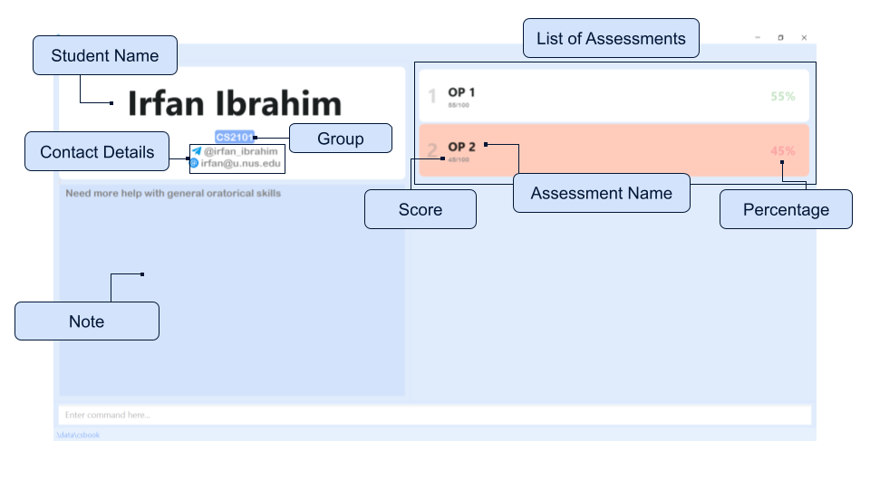
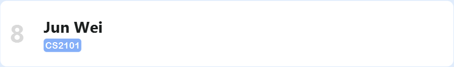
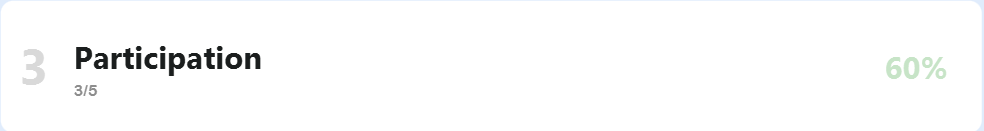
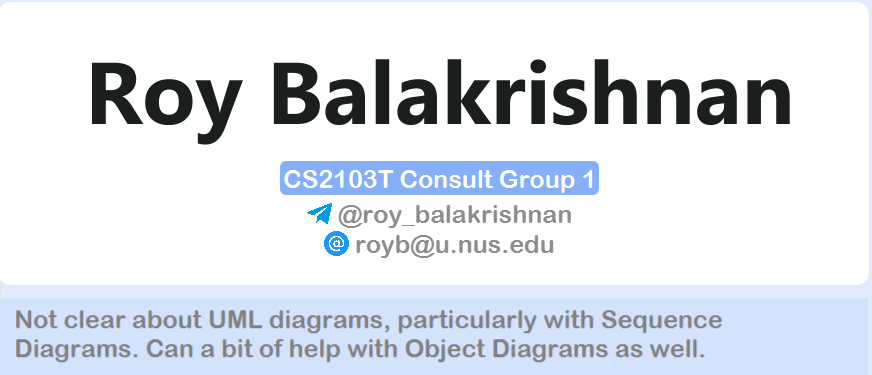
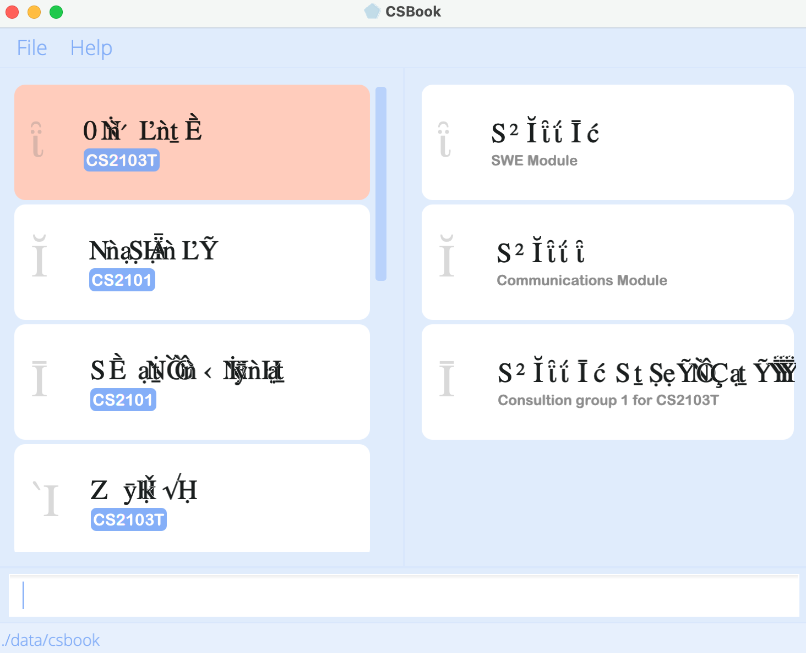

Welcome to the CSBook User Guide. **CSBook is a desktop app for teaching assistants (TAs) to manage their students. It is optimized for use via a Command Line Interface** (CLI) while still having the benefits of a Graphical User Interface (GUI). If you are faster at typing, CSBook can get your student management tasks done faster than traditional GUI applications.

CSBook aims to help **lessen your workload** and **save you the trouble** of having to use external applications to track your students' academic progress i.e. creating spreadsheets to track grades and take down notes. With CSBook, you can **organise your students into custom groups** and **store their information such as contact details, notes and assessments**. This allows you to manage your students in a **more intuitive and efficient** manner, which will free up more time for you to spend on teaching and helping them.

We would recommend that you first take a look at the [How to use](#how-to-use) section in the user guide.

## Table of Contents

- Table of Contents
  {:toc}

---

## How to use

This user guide will take you through the usages of CSBook and its features.

If you are a new user, do refer to the [Quick Start](#quick-start) section for **instructions to start using the application**.

If you are more experienced, you can continue on to the [Feature List](#feature-list) section, which provides **comprehensive descriptions on the usages of the various features**. There are also additional notes and tips for you on how to enhance the use of CSBook.
Else, you may refer to the [Command Summary](#command-summary) section for a **brief summary of the commands and their formats**.

Should you face any difficulties while following the user guide, do refer to the [FAQ](#faq) section for possible resolutions. If your query remains unresolved or is not addressed, feel free to reach out to our team through email at [e0559779@u.nus.edu](mailto:e0559779@u.nus.edu).

---

## Quick start

1. Ensure you have Java `11` or above installed in your Computer (See also: [FAQ](#faq)).

2. Download the latest `csbook.jar` from [here](https://github.com/AY2122S1-CS2103T-T09-3/tp/releases).

3. Copy the file to the folder you want to use as the _home folder_ for CSBook.

4. Double-click the file to start the app. The GUI as shown below should appear in a few seconds. You can refer to the [GUI](#gui) Section for more information on the layout. Note that the app contains some sample data.  
   

5. Type the command in the command box and press Enter to execute it. e.g. typing **`help`** and pressing Enter will open the help window.  
   Some example commands you can try:

   - **`list`** : Lists all students and groups currently stored.

   - **`addgroup`** `g/CS2100 d/Computer Organisation` : Adds a group named `CS2100` with the description `Computer Organisation` to CSBook

   - **`add`** `n/Jia Xian t/@albino_monkii e/albinomonkey@gmail.com g/CS2101` : Adds a student named `Jia Xian` to CSBook. The student has the following details:

     - Telegram Handle: `@albino_monkii`
     - Email: `albinomonkey@gmail.com`
     - Group: `CS2101`

   - **`delete`** `3` : Deletes the 3rd student shown in the current list.

   - **`clear`** : Deletes all students and groups.

   - **`exit`** : Exits the app.

6. Refer to the [Feature List](#feature-list) below for the full details of each command.

---

## Glossary of terms

| Term                               | Definition                                                                                                                                                                        |
| ---------------------------------- | --------------------------------------------------------------------------------------------------------------------------------------------------------------------------------- |
| **Command-Line Interface (CLI)**   | An interface that accepts and parses text input from the user in order to execute some command.                                                                                   |
| **Graphical User Interface (GUI)** | A visual interface that allows the user to interact with the program through graphical icons and buttons.                                                                         |
| **Group**                          | Any user-defined grouping in CSBook. They may indicate that students belonging to the group are from a certain module, tutorial, remedial or require additional help for example. |
| **Java**                           | The programming language used to create CSBook. It may also refer to the Java Runtime Environment, which allows Java applications like CSBook to be run.                          |
| **Module**                         | A unit of study that makes up a part of a course taught in university.                                                                                                            |
| **Operating System (OS)**          | The system software that is running on the computer. E.g. Microsoft Windows, macOS, Linux.                                                                                        |
| **Student**                        | A student in any module that the TA is teaching.                                                                                                                                  |
| **Terminal window**                | A simple CLI-based program that allows the user to run some system commands.                                                                                                      |
| **Teaching Assistant (TA)**        | A student teacher that has been hired to assist in teaching a tutorial/lab session for a module.                                                                                  |

## Glossary of icons

These icons will appear within coloured boxes to indicate information related to section or features.

|  Icon  | Meaning                                                                                              | Box colour |
| ---------------------------------------- | ---------------------------------------------------------------------------------------------------- | ---------- |
| :information_source:**Note**             | This icon serves to give an additional note or remark about the current feature                      | Blue       |
| :bulb:**Tip**                            | This icon serves to give a quick recommendation on how to use the feature in the most beneficial way | Blue       |
| :exclamation:**Caution**                 | This icon serves to give a note on an unexpected behaviour of the application                        | Yellow     |
| :warning:**Warning**                     | This icon serves to warn you against using a feature in some unintended manner                       | Yellow     |

## Glossary of parameters

<table>
  <tbody>
    <tr>
      <th>Parameter</th>
      <th>Required format</th>
    </tr>
    <tr>
      <td>ASSESSMENT_NAME</td>
      <td>
        <ul>
          <li>Alphanumeric and space allowed</li>
          <li>Should not be blank</li>
        </ul>
      </td>
    </tr>
    <tr>
      <td>DESCRIPTION</td>
      <td>
        <ul>
          <li>Alphanumeric and space allowed</li>
          <li>Should not be blank</li>
        </ul>
      </td>
    </tr>
    <tr>
      <td>EMAIL</td>
      <td>Emails should be of the format local-part@domain
        <ul>
          <li>local-part</li>
            <ul>
              <li>Alphanumeric and the special characters +_.-</li>
              <li>Special characters cannot be used consecutively</li>
              <li>May not start or end with any special characters</li>
            </ul>
          <li>domain</li>
            <ul>
              <li>Made up of domain labels separated by periods</li>
              <li>End with a domain label at least 2 characters long</li>
              <li>Have each domain label start and end with alphanumeric characters</li>
              <li>Each domain label consist of alphanumeric characters, separated only by hyphens, if any</li>
            </ul>
        </ul>
      </td>
    </tr>
    <tr>
      <td>GROUPNAME</td>
      <td>
        <ul>
          <li>Alphanumeric and space allowed</li>
          <li>Should not be blank</li>
        </ul>
      </td>
    </tr>
    <tr>
      <td>INDEX</td>
      <td>
        <ul>
          <li>Positive integer e.g. 1, 2, 3, ...</li>
          <li>Index value should not exceed Java's maximum integer value: 2147483647</li>
        </ul>
      </td>
    </tr>
    <tr>
      <td>NAME</td>
      <td>
        <ul>
          <li>Alphanumeric and space allowed</li>
          <li>Should not be blank</li>
        </ul>
      </td>
    </tr>
    <tr>
      <td>NOTE</td>
      <td>
        <ul>
          <li>Any character in the <a href="https://www.fileformat.info/info/charset/UTF-8/list.htm">UTF-8 character set</a></li>
          <li>No length restriction</li>
        </ul>
      </td>
    </tr>
    <tr>
      <td>SCORE</td>
      <td>Score should be of the format actual-score/total-score
        <ul>
          <li>The actual-score should be an integer greater than or equal to 0</li>
          <li>The total-score should be an integer greater than 0</li>
          <li>The actual-score should be less than or equal to the total-score</li>
          <li>actual-score and total-score should not exceed Java's maximum integer value: 2147483647</li>
        </ul>
      </td>
    </tr>
    <tr>
      <td>TELEGRAM_HANDLE</td>
      <td>
        <ul>
          <li>Start with an '@', followed by lowercase letters, numbers or underscores</li>
          <li>Minimum length is 5</li>
        </ul>
      </td>
    </tr>
  </tbody>
</table>

---

## GUI

This section will provide you with a brief introduction of our GUI.

**:information_source: GUI is optimised when window is maximised to full screen. Names and error messages may appear truncated for smaller screen sizes.**

### Main Screen

The main screen would show two panels which consist of the list of students and list of groups respectively.

The student card which represents each student will have the student’s name and the group they belong to.

**:information_source: A student would be flagged red if their score on the most recent assessment falls below the passing threshold of 50%.**

The group card which represents each group will have the group’s name and description.

The command box is located at the bottom of the window in which you can enter the commands.

### Detailed Student Page

This is the detailed student page which consists of the student’s information -- group the student belongs to, contact details, list of assessments and notes on the student.

For assessments, the assessment name, score the student received and percentage of performance would be displayed.

**:information_source: An assessment would be flagged red if the student’s score falls below the passing threshold of 50%.**

---

## Feature List

**:information_source: Notes about the command format:** 

- Words in `UPPER_CASE` are the parameters to be supplied by you. 
  e.g. in `add n/NAME`, `NAME` is a parameter which can be used as `add n/Jun Wei`.

- Parameters can be in any order. 
  e.g. if the command specifies `n/NAME t/TELEGRAM_HANDLE`, `t/TELEGRAM_HANDLE n/NAME` is also acceptable.

* Optional parameters/fields will be indicated within square brackets.
  e.g. if the command specifies `edit INDEX [n/NAME] [t/TELEGRAM_HANDLE] [e/EMAIL]`, `edit 1 n/Jia Xian` or `edit 1 n/Jia Xian t/@albino_monkey e/e0540014X@u.nus.edu` are both acceptable commands.

- For parameters that expect a number value, such as `INDEX` of a student or `SCORE` for assessments, if you try to enter an extremely large value, CSBook will not behave as expected. This is because for assessments to have total scores above a few hundreds or for a TA to have more than a few thousand students is considered unrealistic.

- For parameters that expect a string value i.e. non-numeric value, such as `NAME` of a student or `GROUPNAME` of a group, if you try to enter extremely long values, the name may be truncated. This is because for students or groups to have extremely long names is considered unrealistic.

- If you specify a parameter multiple times when it is expected only once in the command, only the last occurrence of the parameter will be taken. 
  e.g. if you specify `t/@albino_monkii t/@albino_api`, only `t/@albino_api` will be taken.

- Extraneous parameters for commands that do not take in parameters (such as `help`, `list`, `exit` and `clear`) will be ignored. 
  e.g. if the command specifies `help 123`, it will be interpreted as `help`.

### General features

:information_source: **Note**: Listed in this section are general features and commands you can use to manage CSBook.

#### Viewing help : `help`

Displays a pop-up message with a link to access the user guide.

Format: `help`

#### Clearing all entries : `clear`

Clears all students, groups and their associated data from CSBook

Format: `clear`

#### Encrypting the data file: `encrypt`

Encrypts the CSBook data file by converting data into a non-human-readable format to protect the data from access by undesirable parties.

Format: `encrypt`

#### Decrypting the data file: `decrypt`

Decrypts the CSBook data file by converting data back into a human-readable format from its previously encrypted state.

Format: `decrypt`

#### Exiting the program : `exit`

Exits the program.

Format: `exit`

#### Saving the data

CSBook data is saved in the hard disk automatically after you have used any command that changes the data. There is no need for you to save manually. The data is decrypted by default, but you may encrypt them using the `encrypt` command listed above.

#### Editing the data file

CSBook data is saved as an JSON file at `[JAR file location]/data/csbook`. If you are a more advanced user, you are welcome to update data by editing the data file directly .

Note that if you have enabled the encrypt function, the data will be saved in an encrypted JSON format. In which case, you are highly advised to decrypt the data file with the `decrypt` command before editing the data file directly.

:exclamation: **Caution:** If there are changes to the data file that makes its format invalid or if the data has invalid values, CSBook will discard all data and start with an empty data file on the next run.  

:warning: **Warning**: Do not intentionally change the data file in order to restart CSBook afresh with an empty data file. You should use the `clear` command instead if you want to clear all currently stored data.

### Student management features

:information_source: **Note**: Listed in this section are all the features and commands you can use to manage your students and their information in CSBook. The information you stored for each student will be collated into a single entry to help you keep track of them.

#### Adding a student: `add`

Adds a student to the CSBook.

Format: `add n/NAME t/TELEGRAM_HANDLE e/EMAIL g/GROUP_NAME`

1. Type the command into the command box, replacing `NAME`, `TELEGRAM_HANDLE`, `EMAIL` and `GROUP_NAME` with your student's name, telegram handle, email and name of the group that you want your student to be associated with respectively.
2. A pop-up is shown saying that the student has been successfully added, and the new student can be seen in the student list.

:information_source: **Note on command use**:
- `NAME` is case-sensitive and must be unique. Thus, it is possible to have two students named `John Green` and `john Green`, but it is not possible to have two students named `Alfred` and `Alfred`
- The `EMAIL` used can be any email; it need not be an NUS email.
- Each student **MUST** belong to a group. The group name must correspond to that of an existing group, which means that the group should be added to CSBook before the student is created.
- Each student can only belong to one group.

:bulb: **Tip**:

- If you have two students with the exact name, you may use numbers to differentiate them. e.g. `Lim Jun Wei 1` and `Lim Jun Wei 2`

:information_source: **Note on groups**: Refer to the "Group management features" section for more details on how you may use groups to enhance the way you track students.

**Examples:**

- `add n/Jia Xian t/@albino_monkii e/tanjiaxian@u.nus.edu g/CS2103T` adds a student named `Jia Xian`, with telgram handle `@jiaxian99` and email `tanjiaxian@u.nus.edu` to the group `CS2103T`.

- `add n/Jun Wei t/@junwei99 e/limjunwei@u.nus.edu g/CS2101` adds a student named `Jun Wei`, with telgram handle `@junwei99` and email `limjunwei@u.nus.edu` to the group `CS2101`.

**Example of command use:**

Result of `add n/Jun Wei t/@albino_api e/albinoape@u.nus.edu g/CS2101`:

#### Listing all students and groups : `list`

Shows a list of all students and groups in the CSBook.

**Format:** `list`

**Steps:**

1. Type the command into the command box.
2. All students and groups are displayed.

:information_source: **Note on command use:**: 
- The student is flagged red if their latest assessment falls below the passing threshold of 50%.

#### Editing a student : `edit`

Edits an existing student in the CSBook.

Format: `edit INDEX [n/NAME] [t/TELEGRAM_HANDLE] [e/EMAIL]`

- Edits the student at the specified `INDEX`.
- The index refers to the index number shown in the displayed student list. The index **must be a positive integer** 1, 2, 3, …​
- At least one of the optional fields must be provided.
- Existing values will be updated to the input values.

Examples:

- `edit 1 t/@albino_monkey e/e0540014X@u.nus.edu` Edits the telegram handle and email address of the 1st student to be `@albino_monkey` and `e0540014X@u.nus.edu` respectively.
- `edit 2 n/bernice` Edits the name of the 2nd student to be `bernice`.

#### Finding students by name: `find`

Finds students in the CSBook whose names contain any of the given keywords.

Format: `find KEYWORD [MORE_KEYWORDS]`

- The search is **case-insensitive**. e.g `roy` will match with `Roy`.
- The order of the keywords does not matter. e.g. `Alex Bernice` will match `Bernice Alex`.
- Only the name of the student is matched against the keywords.
- Only full words will be matched e.g. `Davi` will not match `David`.
- If several keywords were given, students matching at least one keyword will be returned.
  e.g. `Alex Bernice` will return `Alex Yeoh`, `Bernice Yu`.

Examples:

- `find oliveiro` returns `Charlotte Oliveiro` and `Edgar Oliveiro`
- `find alex david` returns `Alex Yeoh`, `David Li` 

Result of `find alex david`:

#### Viewing students: `viewstudent`

Views an existing student in the CSBook.

Format: `viewstudent NAME`

- The search is **case-sensitive**. e.g. `david` will not match `David`
- The full name of the student must be matched. e.g. `Alex` will not match `Alex Yeoh`
- The student's details shown includes their full name, group, telegram handle, email, notes and assessments.
- Individual assessments are flagged red if they fall below the passing threshold of 50%.
- To go back to the main page with the list of students and groups, use the `list` command.

Examples:

- `viewstudent David Li` returns `David Li`
- `viewstudent Irfan Ibrahim` returns `Irfan Ibrahim` 

Result of `viewstudent Irfan Ibrahim`:

#### Adding an assessment: `addassessment`

Adds an assessment for a student in the CSBook.

Format: `addassessment INDEX a/ASSESSMENT_NAME s/SCORE`

- Adds a new assessment to the student at the specified `INDEX`
- The index refers to the index number shown in the displayed student list. The index must be a **positive integer** 1, 2, 3, …​
- The assessment name must be unique in the student's assessment list.
- The assessment name should only contain alphanumeric characters and spaces, and it should not be blank
- The `SCORE` consists of two components: an _actual score_ and a _total score_ i.e. _actual score_/_total score_.
  - The _total score_ should be an integer greater than 0.
  - The _actual score_ should be an integer greater than or equal to 0
  * The _actual score_ should be less than or equal to the _total score_.

:information_source: **Note on command use**:
- The index refers to the index number shown in the displayed student list. The index must be a **positive integer** 1, 2, 3, …​
- The assessment name must be unique in the student's assessment list.
- The assessment name should only contain alphanumeric characters and spaces, and it should not be blank.
- The assessment name is **case sensitive**. For example, this means that `Midterms` and `midterms` will refer to two different assessments and allowed to coexist.
- The `SCORE` consists of two components: an _actual score_ and a _total score_ i.e. _actual score_/_total score_.
  - The _total score_ should be an integer greater than 0.
  - The _actual score_ should be an integer greater than or equal to 0
  - The _actual score_ should be less than or equal to the _total score_.
- The command works when viewing a detailed student page. The `INDEX` used makes reference to the previous student list that you came from. To go back to the main page with the list of students and groups, use the `list` command.

Examples:

- `addassessment 1 a/Finals s/13/30`
- `addassessment 6 a/Participation s/3/5` 

Result of `addassessment 6 a/Participation s/3/5`:

#### Deleting an assessment: `deleteassessment`

Deletes an assessment from a student in the CSBook.

Format: `deleteassessment INDEX a/ASSESSMENT_NAME`

- Deletes an assessment from the student at the specified `INDEX`
- The index refers to the index number shown in the displayed student list.
- The index must be a **positive integer** 1, 2, 3, …​
- The assessment name must be found in the student's assessment list. The search is **case-sensitive**. e.g. `Midterms` will not match `midterms`.
- The assessment name should only contain alphanumeric characters and spaces, and it should not be blank

Examples:

- `deleteassessment 1 a/Midterms`
- `deleteassessment 5 a/Participation`

#### Adding a note: `note`

Sets the note of the student in the CSBook to the given input.

Format: `note n/NAME no/NOTE`

- If there is an existing note, it will be overwritten by the new note.
- An existing note can be cleared by using the command with an empty `NOTE` parameter. i.e., `note n/NAME no/`

Examples:

- `note n/Roy Balakrishnan no/Not clear about UML diagrams, particularly with Sequence Diagrams. Can use a bit of help with Object Diagrams as well.` will add a note `Not clear about UML diagrams, particularly with Sequence Diagrams. Can use a bit of help with Object Diagrams as well.` 

Result of the above `note n/Roy Balakrishnan no/Not clear about...`:

- `note n/Roy Balakrishnan no/Improvement in UML Diagrams but still lacks understanding in Object Diagrams.` will replace the existing note shown above with `Improvement in UML Diagrams but still lacks understanding in Object Diagrams.`.

#### Deleting a student : `delete`

Deletes the specified student from the CSBook.

Format: `delete INDEX`

- Deletes the student at the specified `INDEX` and removes the student from their assigned group.
- The index refers to the index number shown in the displayed student list.
- The index must be a **positive integer** 1, 2, 3, …​

Examples:

- `list` followed by `delete 2` deletes the 2nd student in CSBook.
- `find alex david` followed by `delete 1` deletes the 1st student in the results of the `find` command.

### Group management features

:information_source: **Note**: Listed in this section are all the features and commands you can use to manage groups in CSBook. Groups allow you to assign students into various groupings based on certain criteria, which will facilitate easier lookup and management of students.  

:bulb: **Use cases**: You should use the groups feature in any way that best suits your needs! You can split students by
module/tutorial group if you're teaching more than one module/class. You can also create consultation groups for students within the same class to focus on certain students.

#### Creating a group: `addgroup`

Creates a group with the given group name and given description so that students can be added into it.

Format: `addgroup g/GROUPNAME d/DESCRIPTION`

- Creates a group with the specified `GROUPNAME` and `DESCRIPTION`.

:information_source: **Note**: `GROUPNAME` is case sensitive. For example, this means that `CS2100` and `cs2100` will refer to two different groups and allowed to coexist.

Examples:

- `addgroup g/CS2100 d/Computer Organisation` creates a group called `CS2100` with the description `Computer Organisation`
  that students can be added into. 

  Result of `addgroup g/CS2100 d/Computer Organisation`:
  

#### Viewing students of a group: `viewgroup`

Views the students who belong to the specified group.

Format: `viewgroup g/GROUPNAME`

Examples:

- `viewgroup g/CS2103T` displays the students in the group `CS2103T`.

Result of `viewgroup g/CS2103T`:

#### Changing the group of a student: `changegroup`

Changes the group of the specified student to the specified group.

Format: `changegroup n/NAME g/GROUPNAME`

- The student with the specified `NAME` has their group changed to the group with the specified `GROUPNAME`.

Examples:

- `changegroup n/David Li g/CS2103T Consult Group 1` changes the group that `David Li` belongs in to `CS2103T Consult Group 1`.

#### Deleting a group: `deletegroup`

Deletes the group with the specified group name as well as all students associated with the group.

Format: `deletegroup g/GROUPNAME`

- Deletes the group with the specified `GROUPNAME` as well as all students associated with the group.

Examples:

- `deletegroup g/CS2103T` deletes the group `CS2103T` along with all students that are in the group.

## Command summary

| Action                       | Format, Examples                                                                                                                   |
| ---------------------------- | ---------------------------------------------------------------------------------------------------------------------------------- |
| **Help**                     | `help`                                                                                                                             |
| **Clear**                    | `clear`                                                                                                                            |
| **Encrypt**                  | `encrypt`                                                                                                                          |
| **Decrypt**                  | `decrypt`                                                                                                                          |
| **Exit**                     | `exit`                                                                                                                             |
| **Add Student**              | `add n/NAME t/TELEGRAM_HANDLE e/EMAIL g/GROUPNAME`   e.g., `add n/Jia Xian t/@albino_monkii e/albinomonkey@u.nus.edu g/CS2103T` |
| **List Students and Groups** | `list`                                                                                                                             |
| **Edit Student**             | `edit INDEX [n/NAME] [t/TELEGRAM_HANDLE] [e/EMAIL]`  e.g.,`edit 1 t/@albino_monkey e/e0540014X@u.nus.edu`                       |
| **Find Students**            | `find KEYWORD [MORE_KEYWORDS]`  e.g., `find oliveiro`                                                                           |
| **View Student**             | `viewstudent NAME`  e.g., `viewstudent David Li`                                                                                |
| **Add Assessment**           | `addassessment INDEX a/ASSESSMENT_NAME S/SCORE`  e.g., `addassessment 1 a/Midterms s/60/100`                                    |
| **Delete Assessment**        | `deleteassessment INDEX a/ASSESSMENT_NAME`  e.g., `deleteassessment 1 a/Midterms`                                               |
| **Add Notes**                | `note n/NAME no/NOTE`  e.g., `note n/Charlotte Oliveiro no/Great with presentations`                                            |
| **Delete Student**           | `delete INDEX`  e.g., `delete 3`                                                                                                |
| **Add Group**                | `addgroup g/GROUPNAME d/DESCRIPTION`  e.g., `addgroup g/CS2100 d/Computer Organisation`                                         |
| **View Group**               | `viewgroup g/GROUPNAME`  e.g., `viewgroup g/CS2103T`                                                                            |
| **Change Group**             | `changegroup n/NAME g/GROUPNAME`  e.g., `changegroup n/David Li g/CS2103T Consult Group 1`                                      |
| **Delete Group**             | `deletegroup g/GROUPNAME`  e.g., `deletegroup g/CS2103T`                                                                        |

## FAQ

1. How do I check that I have Java `11` or above installed on my computer?

   - You may run the `java -version` command on your respective operating system's (OS) terminal window.
   - Alternatively, if the above does not work, you may follow [this guide](https://www.java.com/en/download/help/version_manual.html) to determine the version of Java installed on your Computer
   - Note: Either versions of Java released by [Oracle](https://www.oracle.com/java/) or [OpenJDK](https://openjdk.java.net/) are compatible.

2. The names of the students and groups are not rendered correctly.
   
   - Ensure that the current version of Java used is Java `11` as other versions of Java may cause issues with font rendering.
