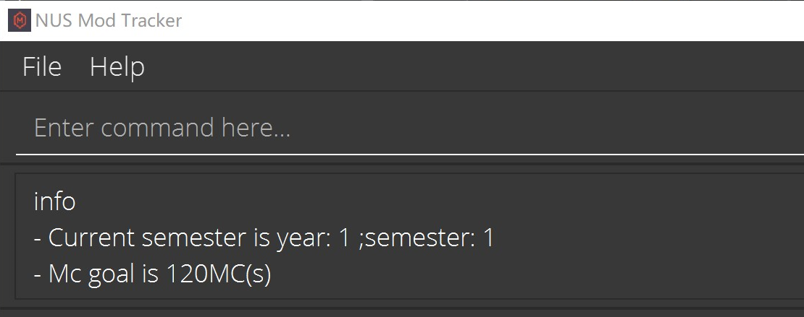
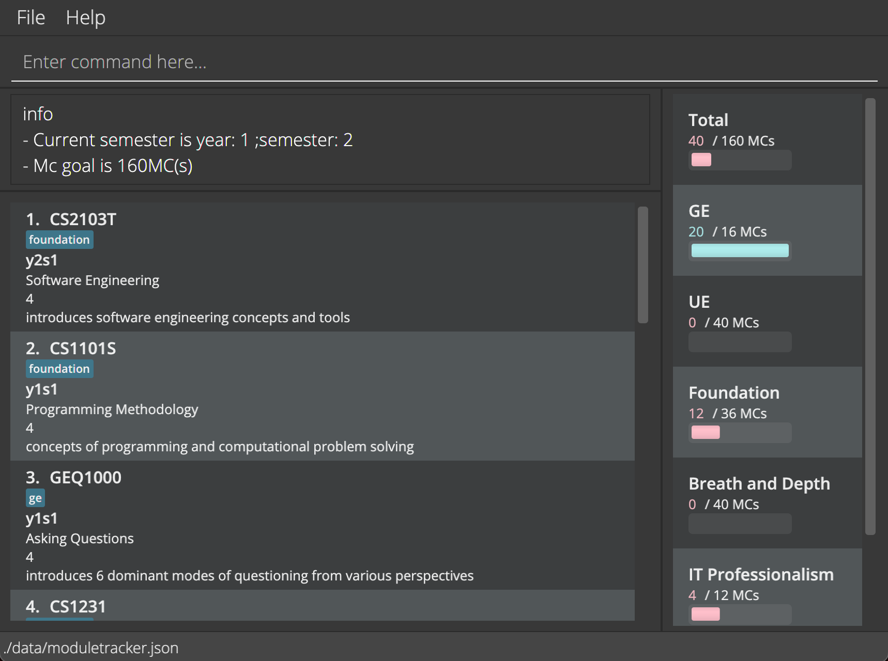
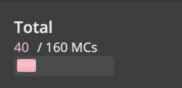

## 1. Introduction

NUS Mod Tracker is a **desktop app** designed for **NUS Computer Science (CS) students who are enrolled before the Academic Year 2020/2021** to **create their own academic plan**,
as well as to **keep track of their Modular Credits(MC) and modules taken**.
It is optimized for use via a Command Line Interface (CLI), while still having the benefits of a Graphical User
Interface (GUI).

For more information about our features, you can head over to our [Features](#features) section. Better yet, 
head over to our [Quick Start](#quick-start) and try it out for yourself!

### 1.1 Is this guide for you?

Are you someone who is trying our application for the very first time? If so, our guide is just the thing you need to get started on your journey to create your very own academic plan! 
Just simple read along and we will guide you step by step on how to use our application.

Are you someone who has maybe forgotten how some of our features work? Fret not, this user guide is also for you!
Simply head over to either our [Features](#features) section or our [Command Summary](#command-summary) section to solve your problems.

### 1.2 How to use the user guide 

We strongly recommend first time users of our application to read through the user guide in order to be familiarised with how our application works.
Throughout our user guide, we have included links which will direct you to the corresponding sections of the user guide. We have also added certain useful tips and tricks 
to help you get more out of our application. 
If you ever want to skip through any section of our user guide, do feel free to refer to use the table of contents right below this section to help you with the navigation.

### 1.3 Table of Contents

* [1. Introduction](#1-introduction)
    * [1.1 Is this guide for you?](#11-is-this-guide-for-you)
    * [1.2 How to use the user guide](#12-how-to-use-the-user-guide)
    * [1.3 Table of Contents](#13-table-of-contents)
* [2. Quick Start](#2-quick-start)
* [3. About](#3-about)
    * [3.1 Special Icons](#31-special-icons)
    * [3.2 Application homepage explanation](#32-application-homepage-explanation)
    * [3.3 Command format](#33-command-format)
    * [3.4 Command terminology](#34-command-terminology)
* [4. Features](#4-features)
* [5. FAQ](#5-faq)
* [6. Command Summary](#6-command-summary)

--------------------------------------------------------------------------------------------------------------------

## 2. Quick start

This section gives you a quick summary on how to download and run our application.

1. Ensure you have Java `11` or above installed in your Computer.

1. Download the latest `modtracker.jar` from [here](https://github.com/AY2122S1-CS2103T-W17-2/tp/releases/tag/v1.3.trial).

1. Copy the file to the folder you want to use as the _home folder_ for your Mod Tracker.

1. Double-click the file to start the app. The GUI similar to the one below should appear in a few seconds. Note how the app contains some sample data. 
   

1. Type the command in the command box and press Enter to execute it. e.g. typing **`help`** and pressing Enter will open the help window. 
   Some example commands you can try:

   * **`list`** : Lists all modules.

   * **`add c/CS2103T t/Software Engineering d/Covers the main areas of software development n/4 tag/core`** : Adds a module named `CS2103T` to the Mod Tracker.

   * **`delete`**`3` : Deletes the 3rd module shown in the current list.

Kindly refer to the [Features](#features) below for details of each command.

--------------------------------------------------------------------------------------------------------------------

## 3. About

This section helps to familiarise you with how our application works as well as the terminologies we use throughout our application.

### 3.1 Special Icons

Here are some of the icons used in this user guide and what each of them represent.

**Tips**

Tips are useful information that can help you have a better experience with our application.

:bulb: **Tip:**
Tip: Tips are useful!

**Important Information**

Important Information are messages that are crucial for you to know in order to use our application smoothly.

:information_source: **Info:**
Important Information: Remember the importance of this icon!

### 3.2 Application homepage explanation

-To be completed-

### 3.3 Command format

**:information_source: Notes about the command format:** 

* Words in `UPPER_CASE` are the inputs to be entered by the user. 
  e.g. in `add m/MODULE`, `MODULE` is a parameter which is entered by the user(such as `add m/GEQ1000` or `add m/CS2030S`).

* Items in square brackets are optional. 
  e.g. `c/CODE [tag/TAG]` can be used as `c/CS2103T tag/core` or as `c/CS2103T`.
* If a parameter is expected only once in the command but you specified it multiple times, only the last occurrence of the parameter will be taken. 
  e.g. if you specify `m/GEQ1000 m/GEQ1000`, only `m/GEQ1000` will be taken.

* Inputs for commands that do not take in parameters (such as `help`, `list`, `exit` and `clear`) will be ignored. 
  e.g. if the command specifies `help 123`, it will be interpreted as `help`.

### 3.4 Command terminology

`c/`
* Represents code

`t/`
* Represents Title

`d/`
* Represents Description

`n/`
* Represents MC

`tag/`
* Represents Tag

`y/`
* Represents Academic Year

`s/`
* Represents Semester

--------------------------------------------------------------------------------------------------------------------

## 4. Features

This section gives you a detailed explanation on how each of our features work.

For an easy reference, we have decided to split our features into 3 different sub-categories:
* Academic Calendar features
* Module features
* Miscellaneous features

### 4.1 Academic Calendar

#### 4.1.1 Listing current modules: `list`

Shows a list of all modules taken for the current semester.

Format: `list`

### Taking a module : `take`

Take a module in the specified semester.

Format: `take INDEX y/YEAR s/SEMESTER`

* Schedules the module at the specified `INDEX` for the specified `YEAR` and `SEMESTER`.
* If the specified module has already been scheduled, its schedule will be overridden.
* The `INDEX` refers to the index number shown in the displayed module list.
* The `INDEX` **must be a positive integer** (1, 2, 3 ...).
* The `YEAR` must be a positive integer from 1-6.
* The `SEMESTER` must be a positive integer from 1-4.
* Special semesters 1 and 2 are represented by integer values 3 and 4 respectively (see examples below).

Example:
* `take 2 y/2 s/1` schedules the 2nd module in the module tracker for year 2 semester 1.
* `take 1 y/1 s/3` schedules the 1st module in the module tracker for year 1 special semester 1.
* `take 1 y/1 s/4` schedules the 1st module in the module tracker for year 1 special semester 2.

### Removing the schedule from ("untake") a module : `untake`

Removes the schedule from a module in the module tracker.

Format: `untake INDEX`

* Removes the schedule from the module at the specified `INDEX`.
* The `INDEX` refers to the index number shown in the displayed module list.
* The `INDEX` **must be a positive integer** (1, 2, 3 ...).

Example:
* `untake 1` removes the schedule from the 1st module in the module tracker.

### Remove the schedules for a specific semester from modules : `clear`

Remove the schedules for a specific semester from modules in the module tracker.

Format: `clear y/YEAR s/SEMESTER`

* The `YEAR` must be a positive integer from 1-6.
* The `SEMESTER` must be a positive integer from 1-4.
* Special semesters 1 and 2 are represented by integer values 3 and 4 respectively (see examples below).

Example:
* `clear y/1 s/1` removes the schedule for y/1 s/1 from modules.

### Viewing user information : `info`

Shows a message containing user's Mc goal and current semester.

Format: `info`

### Setting user's Mc goal OR current semester : `set`

Updates user's Mc goal or current semester.

Format: `set n/MC` `set y/YEAR s/SEM`
* Commands must follow the specified format, **no fields should be left blank**.
* **MC** must be a **positive integer** (1,2,3...).
* **YEAR** must be a **integer between 1 and 6** (i.e. 1,2,3,4,5,6).
* **SEM** must be a **integer between 1 and 4** (i.e. 1,2,3,4).
* **s/3** and **s/4** stands for Special Term 1 and Special Term 2 separately.

Examples:
* `set n/160` - set Mc goal 160 credits
* `set y/2 s/1` - set the current semester Year 2, Sem 1
* `set y/3 s/3` - set the current semester Year 3, Special Term 1

### See modules taken in a specific semester : `view`

See all the modules the user have taken in a specific semester.

Format: `view y/YEAR s/SEM`
* **YEAR** and **SEM** should follow the specified format as mentioned in `set` command previously.

Examples:
* `view y/2 s/1` - see all the modules the user have taken in year 2 semester 1.
* `view y/2 s/3` - see all the modules taken in year 2 special Term 1.

### 4.2 Module

### Adding a module: `add`

Adds a module to the module tracker.

Format: `FORMAT: add c/CODE t/TITLE d/DESCRIPTION n/MC [tag/TAG]`
* Commands must follow the specified format, **no fields should be left blank**.
* **MC** must be a **positive integer** (1,2,3...).
* **CODE** must follow the NUSMods module code format.

Examples:
* `add c/CS2103T t/Software Engineering d/Covers the main areas of software development n/4 tag/core`

### Finding a module: `find`

Shows a list of all the modules that contains the given keyword.

Format: `FORMAT: find [c/] [t/] [d/] [n/] [tag/] [y/] [s/] KEYWORDS`
* **KEYWORDS** refers to the words that the application will search the modules by.
* If no optional parameters are entered, the application will search within all the modules'
  components for matching **KEYWORDS**
* If optional parameters are entered, the application will search within the modules'
  specified components for matching **KEYWORDS**

Examples:
* `find CS` displays any modules that contain the word "CS" in the code, title, description, mc or tag.
* `find c/ t/ CS GE` displays any modules that contain the words "CS" or "GE" in the code or title.
* `find c/ CS2040S` displays any modules that contain the word "CS2040S" in the code.
* `find tag/ UE` displays any modules that contain the word "UE" in the tag.

### Editing a module : `edit`

Edits an existing module in the mod tracker.

Format: `edit INDEX [c/CODE] [t/TITLE] [d/Description] [n/MC] [tag/TAG]`

* At least one of the optional fields must be provided.
* The given value for the field must be different from the original one.
* The given value for `CODE` field must not be duplicated with existing `CODE`
* The INDEX refers to the index number shown in the displayed module list.
* The INDEX must be a positive integer (1, 2, 3 ...).

Examples:
* `edit 1 c/CS2103T t/Software Engineering` Edits the code and title of the 1st module to be CS2103T and Software Engineering respectively.
* `edit 3 n/2` Edits the MC for the 3rd module to be 2.

### Deleting a module : `delete`

Deletes a module from the module tracker

Format: `delete INDEX`

* Deletes a module at the specified `INDEX`.
* The index refers to the index number shown in the displayed module list.
* The index **must be a positive integer** 1, 2, 3, …​

Example:
* `delete 2` deletes the 2nd module in the module tracker.

### 4.3 Miscellaneous

#### 4.3.1 Viewing help : `help`

Shows a message explaining how to access the help page.

Format: `help`

#### 4.3.2 Track the course completion

Tracks the number of Mcs completed in total, and for each course requirement.  
The user's progress will be displayed in the panel on the right.

The user's progress is displayed in the form of:
* The number of Mcs completed for that category, over the number of required Mcs.
* A progress bar filled according to the level of completion.

**Total Mcs completed display:**

* Shows the total number of Mcs taken, over the user's set Mc goal.
* The total number of Mcs taken is calculated from all modules taken before the current semester.
  * For example: If the current semester is year 1 semester 2, the total number of Mcs will be calculated
  from all modules taken in year 1 semester 1 only.

**Course requirements display:**

* Shows the total number of Mcs taken for that requirement, over the number of Mcs needed to satisfy the requirement.
* The total number of Mcs taken is calculated from modules taken before the current semester, which have been tagged with the specific tags.
  * For example: Mcs for modules taken which are tagged with "ge" (`tag/ge`) will be counted into the total number of MCs taken for the GE requirement.
* Modules with the following tags will be used in calculating the Mcs completed for the corresponding requirement:

Requirement | Tag (not case sensitive)
------------|-----------
GE | "ge"
UE | "ue"
Foundation | "foundation"
Breadth and Depth | "breadth and depth"
IT Professionalism | "it professionalism"
Math and Science | "math and science"

Notes:
* If the Mc requirement has been satisfied, the completed Mcs and progress bar will be coloured light blue.
* If the Mc requirement is not satisfied, the completed Mcs and progress bar will be coloured pink.
--------------------------------------------------------------------------------------------------------------------

## 5. FAQ

This section gives you the solutions to commonly asked questions.

**Q**: How do I transfer my data to another Computer? 
**A**: Install the app in the other computer and overwrite the empty data file it creates with the file that contains the data of your previous AddressBook home folder.

--------------------------------------------------------------------------------------------------------------------

## 6. Command summary

This section gives you a summary on how to use each of the features.

Action | Format, Examples
--------|------------------
**Add** | `add c/CODE t/TITLE d/DESCRIPTION n/MC [tag/TAG]`   e.g. `add c/ST2334 t/Probability and Statistics d/Introduces students to basic probability theory and statistical inference n/4`
**Clear** | `clear y/YEAR s/SEMESTER`   e.g. `clear y/1 s/1`
**Delete** | `delete INDEX`  e.g. `delete 3`
**Edit** | `edit INDEX [c/CODE] [t/TITLE] [d/Description] [n/MC] [tag/TAG]`   e.g `edit 2 c/CS2103T t/Software Engineering`
**Find** | `find [c/] [t/] [d/] [n/] [tag/] [y/] [s/] KEYWORDS`   e.g. `find c/ CS2040S`
**List** | `list`
**Take** | `take INDEX y/YEAR s/SEMESTER`   e.g. `take 2 y/2 s/1`
**Untake** | `untake INDEX`   e.g. `untake 1`
**Help**| `help`
**Info**| `info`
**Set**| `set n/MC` or `set y/YEAR s/SEMESTER`   e.g. `set n/120` `set y/2 s/1`
**View**| `view y/YEAR s/SEMESTER`   e.g. `view y/2 s/1`
