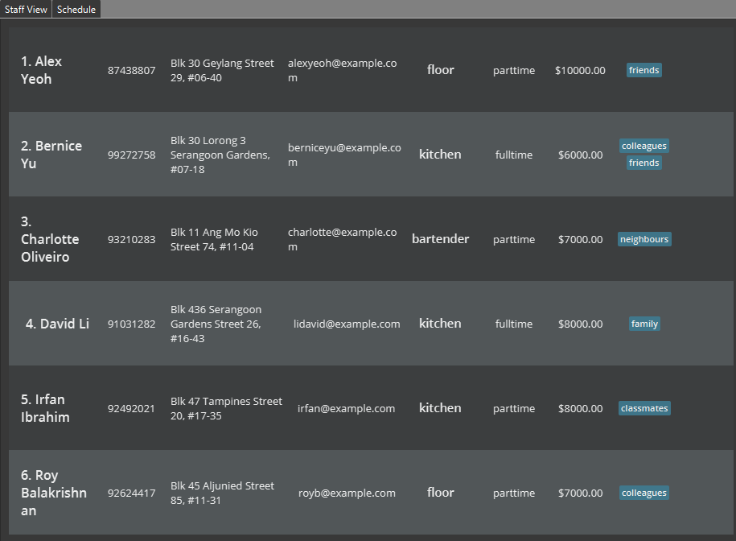

Staff’d helps food & beverage managers manage details and schedules of their staff. It is optimized for CLI users so that frequent tasks can be done faster by typing in commands. It is optimized for restaurants with two active shifts.

* Table of Contents
{:toc}

--------------------------------------------------------------------------------------------------------------------

## Quick start

### Firing up Staff'd

1. Ensure you have Java `11` or above installed in your Computer.

1. Download the latest __staffd.jar__ from [here](https://github.com/AY2122S1-CS2103T-W11-2/tp/releases).

1. Copy the file to the folder you want to use as the _home folder_ for your Staff’d.

2. If linux is your operating system, run `chmod +x staffd.jar` from the _home folder_.

3. Double-click the file to start the app. The GUI similar to the below should appear in a few seconds. Note how the app contains some sample data. 
   

### First Steps on Staff'd

1. On the first initialisation, Staff'd will have some sample data for you to play with.

1. The following is an example of how you might use Staff'd.

1. Joe wants to join your restaurant.

1. Try adding a Joe using the `add` command. `add n/Joe s/fulltime r/kitchen p/98765432 $/1234789 e/Joe@example.com a/John street, block 123, #01-01`

1. Type the command in the command box and press Enter to execute it.

1. Say the Staff in question has to work on the next monday's afternoon shift.

1. Use the `addShift` command to add the staff to the morning shift.   `addShift n/Joe d/monday-0`
  
1. Joe has a flu and is now unable to work on the next monday which is on 25th October 2021.

1. Mark Joe as absent with the `mark` command.   `mark -n Joe d/2021-10-25`

1. Joe has recovered faster than expected and is able to work on monday.

1. Remove the mark from Joe with the `unmark` command.   `unmark -n Joe d/2021-10-25`

1. On the first day of work, Joe has caused 10 customers food poisoning and is fired.

1. Remove Joe from Staff'd with the delete command.   `delete -n Joe`

1. Refer to the [Features](#features) below for more details of each command. Images are provided for commands with significant output.

--------------------------------------------------------------------------------------------------------------------

## Features

### Flag legend

#### Flags for Specific Fields

Flags|Description
---|-----------
n/|Name
s/|Status (as a full-time/part-time worker)
r/|Role (e.g. kitchen, floor)
a/|Address
$/|Salary
i/|Index
e/|Email
t/|Extra tags

#### Flags for Lookup

Flags|Name
---|----
-n|Name
-i|Index
-d|Day Of the Week
-t|Tag
-ti|Time

**:information_source: Notes about the command format:** 

* Words in `UPPER_CASE` are the parameters to be supplied by the user. 
  e.g. in `add n/NAME`, `NAME` is a parameter which can be used as `add n/John Doe`.

* Items in square brackets are optional. 

  e.g `n/NAME [t/TAG]` can be used as `n/John Doe t/friend` or as `n/John Doe`.

* Items with `…` after them can be used multiple times including zero times. 
  e.g. `[t/TAG]…` can be used as ` ` (i.e. 0 times), `t/friend`, `t/friend t/family` etc.

* Parameters can be in any order. 
  e.g. if the command specifies `n/NAME p/PHONE_NUMBER`, `p/PHONE_NUMBER n/NAME` is also acceptable.

* If a parameter is expected only once in the command but you specified it multiple times, only the last occurrence of the parameter will be taken. 
  e.g. if you specify `p/12341234 p/56785678`, only `p/56785678` will be taken.

* Extra parameters for commands that do not take in parameters (such as `help`, `list`, `exit` and `clear`) will be ignored. 
  e.g. if the command specifies `help 123`, it will be interpreted as `help`.

### Utility Features

#### Viewing help : `help`

Shows a message explaning how to access the help page.

Format: `help`

#### Listing all persons : `list`

Shows a list of all staffs in the staff view.

Format: `list`

#### Saving the data

Staff'd data are saved in the hard disk automatically after any command that changes the data. There is no need to save manually.

#### Editing the data file

Staff'd data are saved as a JSON file. Advanced users are welcome to update data directly by editing that data file.

:exclamation: **Caution:**
If your changes to the data file makes its format invalid, Staff'd will discard all data and start with an empty data file at the next run.

#### Archiving data files `[coming in v2.0]`

_Details coming soon ..._

### Basic management of Staff Details

#### View a staff - `view`

Displays a staff by a specific lookup of the fields (e.g. name, tags, roles, email, address) of a staff or by index of the staff.

 * Does not allow for non specific lookup. Any fields entered must be an exact reference, it cannot be non exact.
 * For example, the query `-n Candice` will result in any Staff with the exact name __Candice__ and noone else.

Format:  
`view -n NAME`  
`view -i INDEX`  
`view -t TAG`  
`view -r ROLE`

Examples:  
`view -n Candice`  
`view -i 123`  
`view -t friends`

#### Adding a staff - `add`

Adds a staff to the system. 

 * The tags and information are optional and can be presented in any order.
 * Upon creation of a staff, the system creates an index for them which can be used to refer to them and access the system.

Format:  
`add n/NAME p/PHONE_NUMBER e/EMAIL a/ADDRESS $/SALARY [s/STATUS] [r/ROLE]... [t/TAG]...`  

Examples:  
`add n/Joe s/fulltime r/kitchen p/98765432 $/1234789 e/Joe@example.com a/John street, block 123, #01-01`  
`add n/Candice s/parttime p/91234567 $/2 e/candice@example.com a/Newgate Prison`

#### Marking a staff as absent : `mark`

Marks a specified staff(s) as not working for a specified date.

 * The salary for that date will be not included in calculation,
depending on the staff's status. By default, the staff is recorded
as present for all shifts.
 * The format of the input date is in: `YYYY-MM-DD`

Format:  

Marking a period:

`mark -i INDEX d/STARTDATE d/END_DATE`  
`mark -n NAME d/STARTDATE d/END_DATE`  
`mark -t TAG d/STARTDATE d/END_DATE`

Possible to mark a single date:

`mark -t TAG d/DATE`  
`mark -n NAME d/DATE`

Examples:  
`mark -i 1 d/2020-01-03 d/2021-01-03`  
`mark -n Alex Yeoh d/2020-01-03`

#### Removing the absent mark `unmark`

Removes the period that was marked by the `mark` command.

The format of the input date is in: `YYYY-MM-DD`

Format:  
`unmark -n name d/startDate d/endDate`  
`unmark -i index d/startDate d/endDate`  

Examples:  
`unmark -i 1 d/2020-01-03 d/2021-01-03`  
`unmark -t friends d/2020-01-03`

#### Deleting a Staff : `delete`

Deletes the specified staff from the staff list.

* Deletes the staff(s) with the specified `NAME`, `ROLE`, `STATUS`, `INDEX`.
* The index refers to the index number shown in the displayed staff list. It **must be a positive integer** 1, 2, 3, …​

Formats:  
`delete -n NAME`  
`delete -i INDEX`  
`delete -r ROLE`  
`delete -s STATUS`  

Examples:  
`delete -n Candice`  
`delete -i 2`  
`delete -r cashiers`  
`delete -s fulltime`

#### Editing a staff : `edit`

Edits an existing staff in the Staff List.

Formats:  
`edit -n NAME [n/NAME] [p/PHONE_NUMBER] [e/EMAIL] [a/ADDRESS] [$/SALARY] [s/STATUS] [r/ROLE]... [t/TAG]...`  
`edit -i INDEX [n/NAME] [p/PHONE_NUMBER] [e/EMAIL] [a/ADDRESS] [$/SALARY] [s/STATUS] [r/ROLE]... [t/TAG]...`

* Edits the staff of the specified `NAME`, `INDEX`
The index refers to the index number shown in the displayed staff list. The index **must be a positive integer** 1, 2, 3, …​
* At least one of the optional fields must be provided.
* Existing values will be updated to the input values.

Examples:  
`edit -i 1 p/91234567 e/johndoe@example.com`  
`edit -n Bob p/69696969 e/candicepleasedateme@tinder.com`  
`edit -n Candice r/cook`

#### Finding staff: `find`

Finds staff whose names contain any of the given keywords, or by their index in the staff list.

Name Search:

* The search is case-insensitive. e.g `bob` will match `Bob`
* The order of the keywords does not matter. e.g. `Candice Dee` will match `Dee Candice`
* Only full words will be matched e.g. `Boba` will not match `Bob`
* Staff matching at least one keyword will be returned (i.e. `OR` search).
  e.g. `John Nathan` will return `John Wick`, `Nathan Tan`

Index Search:

* If previous searches have been made, the search is conducted on the displayed list. Otherwise, it will
  be performed on the overall staff list.
* The index must be within range (i.e. from 1 until the size of the Staff List, if the list is empty, no input is accepted)
* Only single search is supported, and this search will return only the specific Staff at that index

Format:  
`find -n KEYWORD [MORE_KEYWORDS]`
`find -i INDEX`

Examples:  
`find -n John`  
`find -n alex david`  
`find -i 3`

List before using Find command:

List after using Find command:

#### Clearing all entries : `clear`

Clears all entries from the Staff List.

Format: `clear`

#### Exiting the program : `exit`

Exits the program.

Format: `exit`

### Basic Management of Staff Schedules

#### Adding a shift to staff's schedule: `addShift`

Adds a time period where the staff is working to the staff’s schedule.

* There are two ways to identify the staff to add the time period to: by their `name` or by their staff `index`.
* The `fulldayname` field required to specify shifts are not case sensitive.

Formats:  
`addShift -n name d/fullDayName-shiftNumber`  
`addShift -i index d/fullDayName-shiftNumber`

Examples:  
`addShift -n Candice d/Monday-1`   
`addShift -i 1234 d/tuesday-0`

#### View a staff schedule : `viewSchedule`

Views a specific staff’s schedule.

Formats:  
`viewSchedule -n name`  
`viewSchedule -i index`

Examples:  
`viewSchedule -n Candice`  
`viewSchedule -i 123`

The output will look like the following.

#### Deleting a staff schedule: `deleteSchedule`

Deletes a time period from the staff schedule.  There are two ways to identify the staff to delete the time period from: by their `name` or by their staff `index`. The deleted period must be the same as a period previously entered by the manager.

Formats:  
`deleteSchedule -n NAME d/fullDayName-shiftNumber`  
`deleteSchedule -i INDEX d/fullDayName-shiftNumber`

Examples:  
`deleteSchedule -n Joe d/tuesday-2`  
`deleteSchedule -i 1278 d/friday-1`

#### Editing a staff schedule: `editSchedule`
Edits a staff schedule start and end date time. There are two ways to identify the staff who’s schedule will be edited: by their name or by their staff ID.

Formats:  
`editSchedule n/name old/fullDayName-shiftNumber new/fullDayName-shiftNumber`  
`editSchedule id/ID old/fullDayName-shiftNumber new/fullDayName-shiftNumber`

Examples:  
`editSchedule n/Candice old/tuesday-1 new/tuesday-2`  
`editSchedule n/12345678 old/wednesday-2 new/thursday-2`

#### View all the staff working a shift: `viewShift`

Finds all the staff working at a particular shift. The shift can be specified either by detailing the day of the week and the time, or the day of the week and slot number.

 * When using the -ti flag, it is in 24-hour format. Example, for 4.pm on wednesday, we use   `wednesday-16:00`
 * The DAY entry is not case sensitive.

Formats:  
`viewShift -d DAY-shift_number`  
`viewShift -ti DAY-HH:mm`

Note that day refers to the day of the week, and it is case-insensitive. However, it should be spelt in full (e.g. MONDAY instead of Mon).

Examples:  
`viewShift -d monday-1`  
`viewShift -d TUESDAY-0`  
`viewShift -ti wednesday-12:00`  
`viewShift -ti THURSDAY-16:30`  

Demonstration:  

--------------------------------------------------------------------------------------------------------------------

## FAQ

**Q**: How do I transfer my data to another Computer? 
**A**: Install the app in the other computer and overwrite the empty data file it creates with the file that contains the data of your previous Staff'd home folder.

--------------------------------------------------------------------------------------------------------------------

## Command summary

Action | Format, Examples
--------|------------------
**View** | `view -n name`   `view -i index`
**Add** | `add n/NAME p/PHONE_NUMBER e/EMAIL a/ADDRESS $/SALARY [s/STATUS] [r/ROLE]... [t/TAG]...`
**Delete** | `delete -n NAME`   `delete -i INDEX`   `delete -r ROLE`   `delete -s STATUS`
**Edit** | `edit -n NAME [n/NAME] [p/PHONE_NUMBER] [e/EMAIL] [a/ADDRESS] [$/SALARY] [s/STATUS] [r/ROLE]... [t/TAG]...`   `edit -i INDEX [n/NAME] [p/PHONE_NUMBER] [e/EMAIL] [a/ADDRESS] [$/SALARY] [s/STATUS] [r/ROLE]... [t/TAG]...`
**Find** | `find KEYWORD [MORE_KEYWORDS]`  e.g., `find James Jake`
**View staff schedule** | `viewSchedlue -n name`   `viewSchedlue -i index`
**Add staff to shift** | `addShift -n name d/fullDayName-shiftNumber`   `addShift -i index d/fullDayName-shiftNumber`
**Delete staff shift** | `deleteSchedule -n NAME d/fullDayName-shiftNumber`   `deleteSchedule -i INDEX d/fullDayName-shiftNumber`
**View shift** | `viewShift -d day-shift_number`   `viewShift -ti day-HH:mm`
**Mark absent** | `mark -i index d/startDate [d/endDate]`   `mark -n name d/startDate [d/endDate]`
**Remove mark** | `unmark -i index d/startDate [d/endDate]`   `mark -n name d/startDate [d/endDate]`
**List** | `list`
**Help** | `help`
**Clear** | `clear`
**Exit** | `exit`
