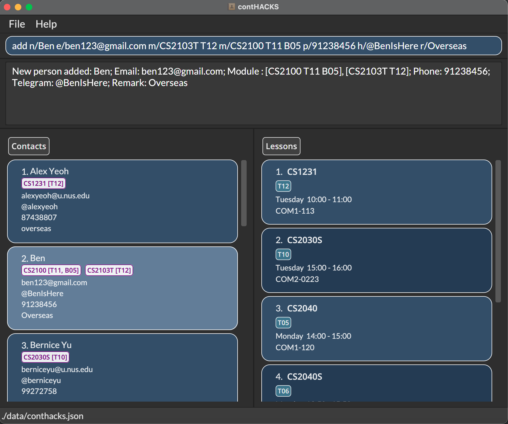
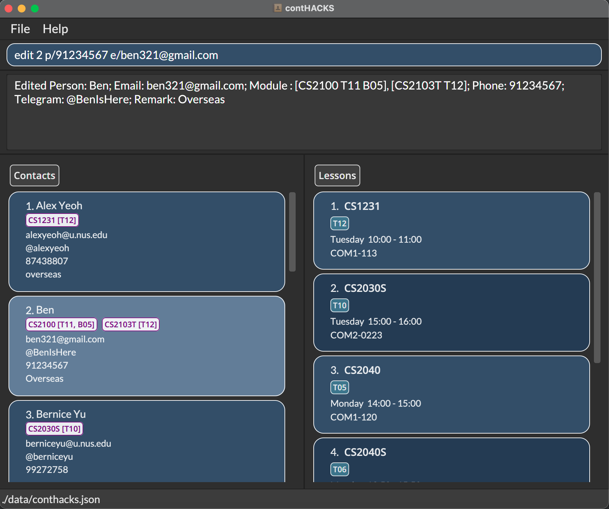
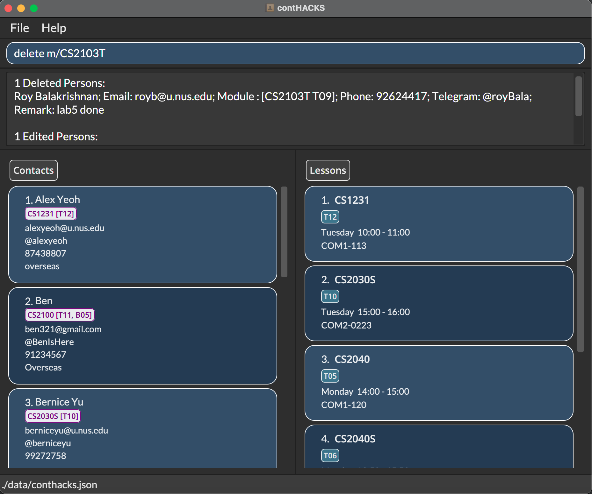
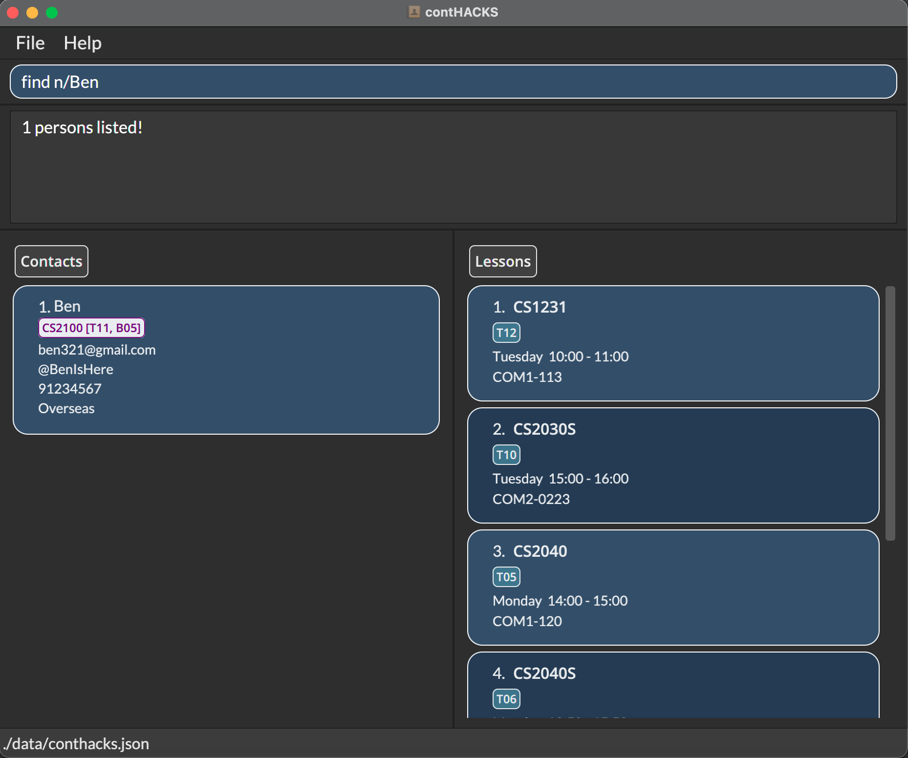
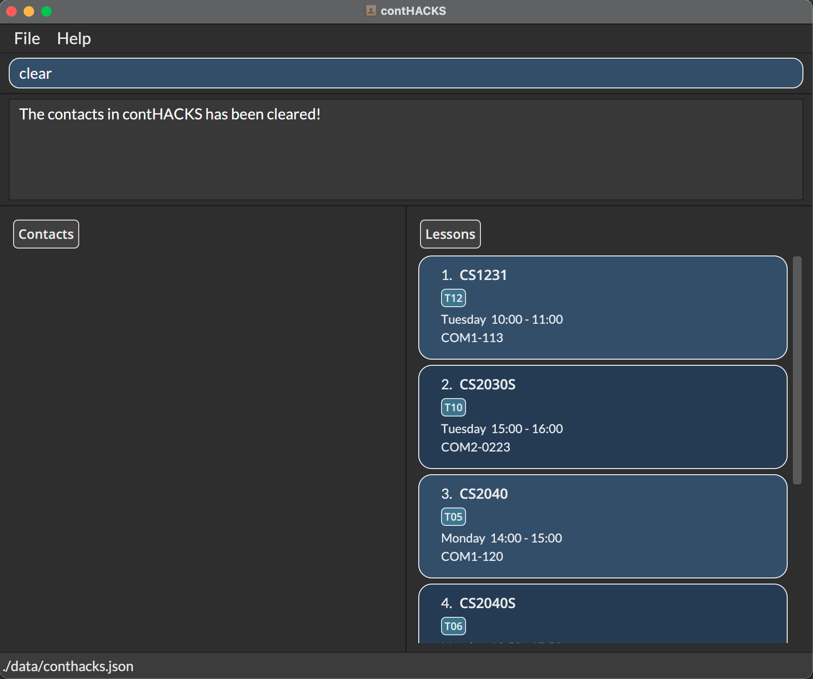
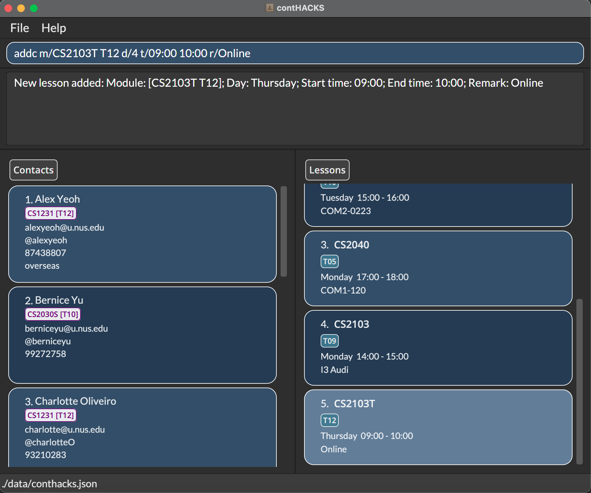
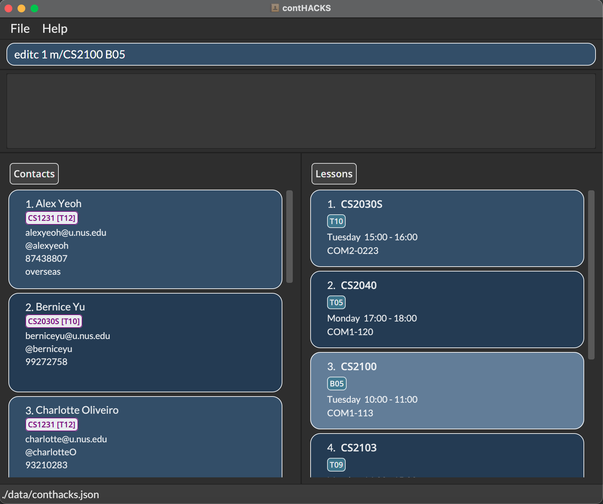
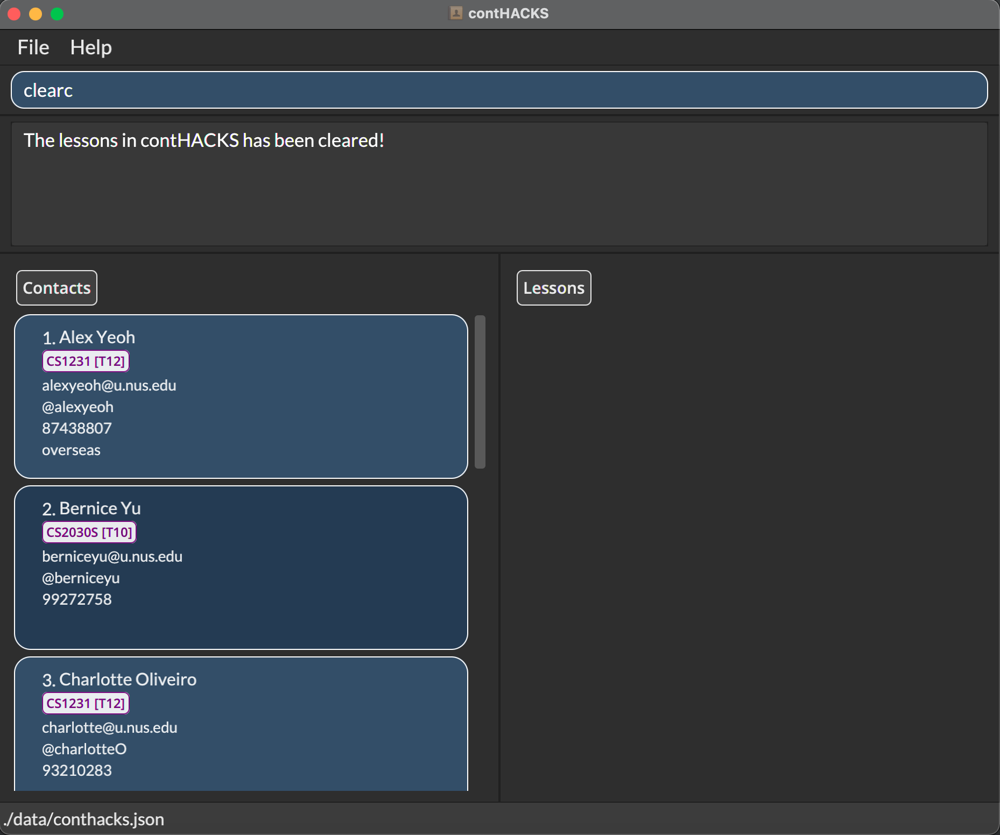

contHACKS is a **desktop app to help Teaching Assistants (TAs) in managing contacts. It is optimized for use via a Command Line Interface (CLI)** while still having the benefits of a Graphical User Interface (GUI). contHACKS **streamlines the creation, reading, updating and deleting operations of contacts** to make it fast and efficient for TAs, easing your workload to focus on the more important task - teaching.

## Table of Contents 
* [Quick start](#quick-start)

* [How to use this User Guide](#how-to-use)

* [Features](#features)
  * [General](#general)
    * [Accessing the help page: `help`](#help)
    * [Exiting the app: `exit`](#exit)
  * [Managing contacts](#managing-contacts)
    * [Adding a contact: `add`](#add)
    * [Editing a contact: `edit`](#edit)
    * [Deleting a contact / contacts: `delete`](#delete)
    * [Finding a contact / contacts: `find`](#find)
    * [Listing all contacts: `list`](#list)
    * [Clearing all contacts: `clear`](#clear)

  * [Managing lessons](#manaaging-lessons)
    * [Adding a lesson: `addc`](#addc)
    * [Editing a lesson: `editc`](#editc)
    * [Deleting a lesson / lessons: `deletec`](#deletec)
    * [Finding a lesson / lessons: `findc`](#findc)
    * [Listing all lessons: `listc`](#listc)
    * [Clearing all lessons: `clearc`](#clearc)

  * [Managing data](#managing-data)
    * [Saving the data](#saving-data)
    * [Editing the data file](#editing-data)

* [Command Summary](#summary)

## Quick start 

1. Ensure you have Java `11` or above installed on your computer

2. Download the latest `contHACKS.jar` from [here](https://github.com/AY2122S1-CS2103T-T09-2/tp/releases)

3. Copy the file to the folder you want to use as the home folder

4. Double-click the file to start the app

5. An application like the one in the screenshot below should appear in a few seconds

## How to use this User Guide 

This section provides tips on reading this document, as well as how to navigate it.

This User Guide is structured so that it is easy for you to find what you need. If this is your first time using contHACKS, we recommend reading the User Guide in order, starting from this section. If you are ever lost, head over to [table of contents](#table-of-contents) to orientate yourself.

Here are some of the things you will need to know before you get started!
### Meaning of icons 

| Icon | Description |
|---|---|
|:information_source:| This icon indicates that some extra information is provided.|
|:exclamation:| This icon indicates that the information provided is **important**. |
|:warning:| This icon indicates proceed with caution. |
### Key terms 

These are the key terms defined for the usage of the commands:

- **Module Code**: Refers to the module code of a NUS module   e.g. CS2103, GEQ1000, ST2334

- **Lesson Code**: Refers to the code of the lesson: tutorials, labs, sectionals etc   e.g. T18, B30, E32

- **Telegram Handle**: Telegram username that should begin with an `@`   e.g. @BenIsHere, @Jerry321

- **Index**: Refers to the number displayed next to the name in the displayed contact list.   e.g. 1, 2, 3...

- **Alias**: These are alternative words that you can use to perform the same command

Refer to the image below for more information on the different components of ContHACKS!

### GUI 

#### Top Navigation Bar

#### Contact List Panel

#### Lesson List Panel

### Command format 
Notes about the command format: 

* Command words are case insensitive  
  e.g. `add`,`Add` and `ADD` can all be used to perform the same command

* Words in `UPPER_CASE` are the parameters to be supplied by you 
  e.g. in `add n/NAME`, `NAME` is a parameter that can be used as `add n/John Doe`

* Items in square brackets are optional 
  e.g `n/NAME [h/TELEGRAM_HANDLE]` can be used as `n/John Doe h/@johndoe` or as `n/John Doe`

* Parameters of all commands can be in any order 
  e.g. if the command specifies `n/NAME p/PHONE`, `p/PHONE n/NAME` is also acceptable

* If a parameter is expected only once in the command but you specified it multiple times, only the last occurrence of the parameter will be taken 
  e.g. if you specify `p/12341234 p/56785678`, only `p/56785678` will be taken

* Extraneous parameters for commands that do not take in parameters (such as `help`, `list`, `exit` and `clear`) will be ignored 
  e.g. if the command specifies `help 123`, it will be interpreted as `help`

Some example commands you can try:

   * `list` : Lists all contacts

   * `add n/Ben p/91234567 e/ben123@gmail.com m/CS2103T` : Adds a contact named `Ben`

   * `addc m/CS2103T G09 d/4 t/09:00 10:00` Adds a class with CS2103T module code and G09 lesson code, that falls on a Thursday from 9am - 10am

   * `delete 3` : Deletes the 3rd contact shown in the current contact list

   * `deletec 2` : Deletes the 2nd lesson shown in the current lesson list

   * `clear` : Deletes all contacts

   * `exit` : Exits the app

Some additional notes: 
   * The contact list panel and the lesson list panel are **independent of each other**. This means that adding a contact with module and lesson code `CS2103T G09` will not create that lesson in the lesson panel list. 
   * Contacts and lessons are sorted alphabetically after every command by name and module code name respectively.  

## Features 
### General 

#### Accessing the help page : `help` 

Shows a message explaining how to access the help page.

Format: `help`

Command aliases: `man` `h`

#### Exiting the program : `exit` 

Exits the program.

Format: `exit`

Command aliases: `quit` `q`
### Managing contacts 
#### Adding a contact: `add` 

Adds a contact to contHACKS.

Format: `add n/NAME e/EMAIL m/MODULE_CODE [LESSON_CODE(S)] [p/PHONE] [h/TELEGRAM_HANDLE] [r/REMARK]`

* Name, email and module code are **compulsory**
* Lesson code, phone number, telegram handle and remarks are **optional**
* You can add multiple module codes and can have multiple lesson codes for a single module code

:information_source: **Note:**
Module code and lesson code are separated by white spaces.

Examples:
* `add n/Ben e/ben123@gmail.com m/CS2103T T12 m/CS2100 T11 B05 p/91238456 h/@BenIsHere r/Overseas`: Adds a contact using all parameters, with multiple module code and multiple lesson code
* `add n/Mary e/mary123@gmail.com m/CS2103T`: Adds a contact using only the compulsory parameters
* `add n/Tim e/timothy@gmail.com m/CS2101 G09 h/@Teeeeeeeemo r/Needs more help for CS2103T`: Adds a contact using some optional parameters

Command alias: `a`

***

#### Editing a contact: `edit` 

Edits the contact at the specified index in the currently viewed list.

Format: `edit INDEX [n/NAME] [e/EMAIL] [m/MODULE_CODE LESSON_CODE(S)] [p/PHONE] [h/TELEGRAM_HANDLE] [r/REMARK]`

* At least one of the parameters must be provided
* Existing values of the parameters specified will be erased and updated to the input values
* You can input multiple module codes and can have multiple lesson codes for a single module code

:information_source: **Note:**
To remove an existing phone number/telegram handle/remark from a contact, simply input `p/``h/``r/` respectively.

Examples:
* `edit 1 e/ben321@gmail.com p/91234567`: Edits the email and phone number of the 1st contact to be `ben321@gmail.com` and `91234567`respectively
* `edit 2 m/CS2100 T09 B09 m/CS2103T T01`: Edits the modules of the 2nd contact to be `[CS2100 T09 B09], [CS2103T T01]`
* `edit 3 r/`: Removes the remark of the 3rd contact

Command aliases: `update` `e`

***

#### Deleting a contact / contacts: `delete` 

Delete the specified contact(s) from contHACKS.

Format: `delete INDEX`/ `delete INDEX_START-INDEX_END`

* Deletes the specified contact(s) at the specified index(es) including `INDEX_END` and `INDEX_START`.
* `INDEX_END` should be a positive integer greater than or equal to `INDEX_START`.

Format: `delete m/MODULE_CODE`/`delete m/MODULE_CODE LESSON_CODE`

* Delete all contacts associated with a module code using `m/MODULE_CODE`.
* Delete all contacts associated with a lesson code under the module using `m/MODULE_CODE LESSON_CODE`.

Examples:
* `delete 2`: Deletes the 2nd contact in the displayed list.
* `delete 2-5`: Deletes the 2nd, 3rd, 4th and 5th contacts in the displayed list.
* `delete m/CS2103T`: Deletes all the contacts with the module code CS2103T.
* `delete m/CS2103T T10`: Deletes all the contacts with both the module code CS2103T and lesson code T10.

Command aliases: `del` `rm` `d`

#### Finding contacts by name / module code: `find` 

Finds a contact by specifying either the name/module code(s).

Format: `find n/NAME`/`find m/MODULE_CODE(S)`
* Can only search by name or module code(s), but not both at once   i.e. You cannot perform `find n/Ben m/CS2040S`
* The search is case-insensitive   e.g `ben` will match `Ben`
* The order of the keywords does not matter   e.g. `Ben Tan` will match `Tan Ben`
* Partial words will also be matched, for both name and module code searches.   e.g. `Ben` will match `Benjamin`

:exclamation: **Important:**
If multiple words are specified for the name search, only results matching all the words specified will be returned  
e.g `find n/Bernice Yu` will only return contacts that have both words `Bernice` and `Yu` 
Similarly, if multiple module codes are specified, only results matching all the module codes specified will be returned  
e.g. `find m/CS2030S CS2040S` will only return contacts that have both `CS2030S` and `CS2040S` module codes

Examples:
* `find n/Ben`: Search contacts for names containing `Ben`
* `find n/Ben Bernice Mary`: Search contacts with names containing either `Ben`, `Bernice` or `Mary`
* `find m/CS2103T CS2100`: Search contacts with the inputted module code

Command alias: `f`

#### Listing all contacts : `list` 

Shows a list of all contacts in contHACKS.

Format: `list`

Command alias: `ls`

***

#### Clearing all contacts: `clear` 

Purges **all** existing contacts from contHACKS.

:warning: **Warning:**
This action cannot be undone. Use with caution!

Format: `clear`

Command aliases: `clr` `c`

### Managing lessons 

#### Adding a lesson: `addc` 

Adds a lesson to contHACKS.

Format: `addc m/MODULE_CODE LESSON_CODE d/DAY t/START_TIME END_TIME [r/REMARK]`

* All the parameters are **compulsory** except for remark
* Day input is only accepted in integer form   e.g. `1` for Monday, `7` for Sunday
* Start and end time input is only accepted in the `HH:mm` format   e.g. `09:00`

:information_source: **Note:**
Module code and lesson code are separated by white spaces. Lesson start time and end time are separated by white spaces as well.

Examples:
* `addc m/CS2103T T12 d/4 t/09:00 10:00 r/Online`: Adds a lesson with remark
* `addc m/CS2100 B05 d/3 t/14:00 15:00`: Adds a lesson without remark

Command alias: `ac`

***

#### Editing a lesson: `editc` 

Edits the lesson at the specified index in the currently viewed list.

Format: `editc INDEX [m/MODULE_CODE LESSON_CODE] [d/DAY] [t/START_TIME END_TIME] [r/REMARK]`

* At least one of the parameters must be provided.
* Existing values of the parameters specified will be erased and updated to the input values

:information_source: **Note:**
To remove a remark from a lesson, simply input `r/`.

Examples:
* `editc 1 m/CS2100 B05`: Edits the module of the 1st lesson to be `CS2100 B05`
* `editc 2 d/3`: Edits the day of the 2nd lesson to be Wednesday
* `editc 3 t/10:00 12:00`: Edits the start time and end time of the 3rd lesson to be 10AM and 12PM respectively
* `editc 4 r/COM01-0120`: Edits the remark of the 4th lesson to `COM01-0120`
* `editc 5 m/CS2100 B05 d/3 t/10:00 12:00 r/COM01-0120`: All parameters present in one command

Command aliases: `updatec` `ec`

***

#### Deleting a lesson / lessons: `deletec` 

Deletes the specified lesson(s) from contHACKS.

Format: `deletec INDEX`/`deletec INDEX_START-INDEX_END`

* Deletes the specified lesson(s) at the specified index(es) including the `INDEX_START` and `INDEX_END`.
* `INDEX_END` should be a positive integer greater than or equal to `INDEX_START`.

Format: `deletec m/MODULE_CODE`

* Deletes all contacts associated with a module code using `m/MODULE_CODE`.

Examples:
* `deletec 1`: Deletes the 1st lesson in the displayed list.
* `deletec 1-3`: Deletes 1st, 2nd and 3rd lesson in the displayed list.
* `deletec m/CS2103T`: Deletes all the lessons with CS2103T module code.

Command aliases: `delc` `rmc` `dc`

***

#### Finding a lesson / lessons: `findc` 

Finds a contact by specifying the module code(s)/day(s)/start time(s).

Format: `findc m/MODULE_CODE(S)`/`findc d/DAY(S)`/`findc t/START_TIME(S)`
* Can only search using one prefix at a time   i.e. You cannot perform `findc m/CS2040S d/2`
* The search is case-insensitive   e.g `cs2040` will match `CS2040`
* Only for module codes, partial word matches will also be matched.   e.g. `S123` will match `CS1231`
* Day input is only accepted in integer form   e.g. `1` for Monday, `7` for Sunday
* Start time input is only accepted in the `HH:mm` format   e.g. `15:00` `09:00`

:exclamation: **Important:**
If multiple keywords are specified for the search, any lesson that matches at least one of the keywords will be returned  
e.g. `findc m/CS2030 CS2040` will return lessons that are of module `CS2030` or `CS2040`  
e.g. `findc d/2 3` will return lessons that are on Tuesday or Wednesday  
e.g. `findc t/10:00 15:00` will return lessons that start at either timings `10:00` or `15:00`

Examples:
* `findc m/CS2030 CS2040`: Search lessons of modules `CS2030` or `CS2040`
* `findc d/2`: Search lessons that fall on Tuesdays
* `findc t/14:00`: Search lessons that start at `14:00`

Command alias: `fc`

***

#### Listing all lessons: `listc` 

Shows a list of all lessons in contHACKS.

Format: `listc`

Command alias: `lc`

***

#### Clearing all lessons: `clearc` 

Purges **all** existing lessons from contHACKS.

:warning: **Warning:**
This action cannot be undone. Use with caution!

Format: `clearc`

Command aliases: `clrc` `cc`

### Managing Data 

#### Saving the data 

Contact data are saved in the hard disk automatically after any command that changes the data. There is no need to save manually.

#### Editing the data file 

contHACKS data are saved as a JSON file `[JAR file location]/data/conthacks.json`.

:information_source: **Note:**
Advanced users are welcome to update data directly by editing that data file.

:warning: **Warning:**
If your changes to the data file make its format invalid, contHACKS will discard all data and start with an empty data file on the next start up.

## Command Summary 

<table>

<tr>
    <th> Category</th>
    <th> Action  </th>
    <th> Command </th>
    <th> Format  </th>
    <th> Example </th>
</tr>

<tr>
    <td rowspan="2"> General</td>
    <td> Accessing the help page</td>
    <td>
        <code>help</code>
        <code>man</code> 
        <code>h</code>
    </td>
    <td>
        <code>help</code>
    </td>
    <td>
        <code>help</code>
    </td>
</tr>

<tr>
    <td> Exiting the app</td>
    <td>
        <code>exit</code>
        <code>quit</code> 
        <code>q</code>
    </td>
    <td>
        <code>exit</code>
    </td>
    <td>
        <code>exit</code>
    </td>
</tr>

<tr>
    <td rowspan="6"> Managing contacts</td>
    <td> Adding a contact</td>
    <td>
        <code>add</code> 
        <code>a</code>
    </td>
    <td>
        <code>add n/NAME e/EMAIL m/MODULE_CODE [LESSON_CODE(S)] [p/PHONE] [h/TELEGRAM_HANDLE] [r/REMARK]</code>
    </td>
    <td>
        <code>add n/Ben e/ben123@gmail.com m/CS2103T T12 p/91238456 h/@BenIsHere r/Overseas</code>
    </td>
</tr>

<tr>
    <td> Editing a contact</td>
    <td>
        <code>edit</code> 
        <code>update</code> 
        <code>e</code>
    </td>
    <td>
        <code>edit INDEX [n/NAME] [e/EMAIL] [p/PHONE] [h/TELEGRAM_HANDLE] [m/MODULE_CODE LESSON_CODE(S)] [r/REMARK]</code>
    </td>
    <td>
        <code>edit 1 p/91234567 e/ben321@gmail.com</code>
    </td>
</tr>

<tr>
    <td> Deleting a contact / contacts</td>
    <td>
        <code>delete</code> 
        <code>del</code> 
        <code>rm</code> 
        <code>d</code>
    </td>
    <td>
        <code>delete INDEX</code> 
        <code>delete INDEX_START-INDEX_END</code> 
        <code>delete m/MODULE_CODE</code> 
        <code>delete m/MODULE_CODE LESSON_CODE</code>
    </td>
    <td>
        <code>delete 2</code> 
        <code>delete 2-5</code> 
        <code>delete m/CS2103T</code> 
        <code>delete m/CS2103T T09</code>
    </td>
</tr>

<tr>
    <td> Finding a contact / contacts</td>
    <td>
        <code>find</code> 
        <code>f</code>
    </td>
    <td>
        <code>find n/NAME</code> 
        <code>find m/MODULE_CODE(S)</code>
    </td>
    <td>
        <code>find n/Ben</code> 
        <code>find m/CS2103T</code>
    </td>
</tr>

<tr>
    <td> Listing all contacts</td>
    <td>
        <code>list</code> 
        <code>ls</code>
    </td>
    <td>
        <code>list</code>
    </td>
    <td>
        <code>list</code>
    </td>
</tr>

<tr>
    <td> Clearing all contacts</td>
    <td>
        <code>clear</code> 
        <code>clr</code> 
        <code>c</code>
    </td>
    <td>
        <code>clear</code>
    </td>
    <td>
        <code>clear</code>
    </td>
</tr>

<tr>
    <td rowspan="6"> Managing lesson</td>
    <td> Adding a lesson</td>
    <td>
        <code>addc</code> 
        <code>ac</code>
    </td>
    <td>
        <code>addc m/MODULE_CODE LESSON_CODE d/DAY t/START_TIME END_TIME [r/REMARK]</code>
    </td>
    <td>
        <code>addc m/CS2103T T12 d/4 t/09:00 10:00 r/Online</code>
    </td>
</tr>

<tr>
    <td> Editing a lesson</td>
    <td>
        <code>editc</code> 
        <code>updatec</code> 
        <code>ec</code>
    </td>
    <td>
        <code>editc INDEX [m/MODULE_CODE LESSON_CODE] [d/DAY] [t/START_TIME END_TIME] [r/REMARK]</code>
    </td>
    <td>
        <code>editc 5 m/CS2100 B05 d/3 t/10:00 12:00 r/COM01-0120</code>
    </td>
</tr>

<tr>
    <td> Deleting a lesson / lessons</td>
    <td>
        <code>deletec</code> 
        <code>delc</code> 
        <code>rmc</code> 
        <code>dc</code> 
    </td>
    <td>
        <code>deletec INDEX</code> 
        <code>deletec INDEX_START-INDEX_END</code> 
        <code>deletec m/MODULE_CODE</code>
    </td>
    <td>
        <code>deletec 1</code> 
        <code>deletec 1-3</code> 
        <code>deletec m/CS2103T</code>
    </td>
</tr>

<tr>
    <td> Finding a lesson / lessons</td>
    <td>
        <code>findc</code> 
        <code>fc</code>
    </td>
    <td>
        <code>findc m/MODULE_CODE(S)</code> 
        <code>findc d/DAY(S)</code> 
        <code>findc t/START_TIME(S)</code>
    </td>
    <td>
        <code>findc m/CS2030 CS2040</code> 
        <code>findc d/2 3</code> 
        <code>findc t/10:00 15:00</code>
    </td>
</tr>

<tr>
    <td> Listing all lessons</td>
    <td>
        <code>listc</code> 
        <code>lc</code>
    </td>
    <td>
        <code>listc</code>
    </td>
    <td>
        <code>listc</code>
    </td>
</tr>

<tr>
    <td> Clearing all lessons</td>
    <td>
        <code>clear</code> 
        <code>clrc</code> 
        <code>cc</code>
    </td>
    <td>
        <code>clearc</code>
    </td>
    <td>
        <code>clearc</code>
    </td>
</tr>

</table>
