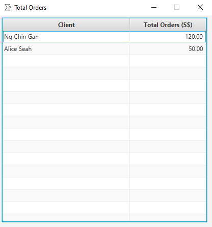

SalesNote is a desktop app for Singapore-based tailors to manage local sales and clients, so that they can focus on 
producing great work. SalesNote is optimized for use via a Command Line Interface (CLI) while still having the 
benefits of a Graphical User Interface (GUI). Fast typists can get more out of the application than from traditional 
GUI apps.

This project is based on the AB3 project created by the [SE-EDU initiative](https://se-education.org).

## Table of Contents

- [Quick Start](#quick-start)
- [Features](#features)
    - [Viewing help : `help`](#viewing-help--help)
    - [Client Commands](#client-commands)
        - [Listing all clients : `listclients`](#listing-all-clients--listclients)    
        - [Adding a client : `addclient`](#adding-a-client--addclient)
        - [Deleting a client : `deleteclient`](#deleting-a-client--deleteclient)
        - [Editing a client : `editclient`](#editing-a-client--editclient)
        - [Locating clients by name : `findclient`](#locating-clients-by-name--findclient)
    - [Task Commands](#task-commands)
        - [Listing all tasks : `listtasks`](#listing-all-tasks--listtasks)
        - [Adding a task : `addtask`](#adding-a-task--addtask)
        - [Deleting a task : `deletetask`](#deleting-a-task--deletetask)
        - [Editing a task : `edittask`](#editing-a-task--edittask)
        - [Marking a task as done : `marktask`](#marking-a-task-as-done--marktask)
        - [Finding tasks by keywords : `findtask`](#finding-tasks-by-keywords--findtask)
        - [Listing completed tasks : `completedtasks`](#listing-completed-tasks--completedtasks)
        - [Listing incomplete tasks : `incompletetasks`](#listing-incomplete-tasks--incompletetasks)
    - [Order Commands](#order-commands)
        - [Listing all orders : `listorders`](#listing-all-orders--listorders)
        - [Adding an order : `addorder`](#adding-an-order--addorder)
        - [Deleting an order : `deleteorder`](#deleting-an-order--deleteorder)
        - [Marking an order as complete : `markorder`](#marking-an-order-as-complete--markorder)
        - [Finding orders by keywords : `findorder`](#finding-orders-by-keywords--findorder)
        - [Listing completed orders : `completedorders`](#listing-completed-orders--completedorders)
        - [Listing incomplete orders : `incompleteorders`](#listing-incomplete-orders--incompleteorders)
        - [Sorting orders : `sortorders`](#sorting-orders--sortorders)
        - [Viewing total orders : `totalorders`](#viewing-total-orders--totalorders)
    - [Clearing all entries : `clear`](#clearing-all-entries--clear)
    - [Exiting the program : `exit`](#exiting-the-program--exit)
    - [Saving the data](#saving-the-data)
    - [Editing the data file](#editing-the-data-file)
- [FAQ](#faq)
- [Command Summary](#command-summary)
            
            

--------------------------------------------------------------------------------------------------------------------

## Quick Start

1. Ensure you have Java `11` or above installed on your computer.
You may install Java `11` from [here](https://www.oracle.com/java/technologies/downloads/#java11).
2. Download the latest `SalesNote.jar` from [here](https://github.com/AY2122S1-CS2103T-W08-3/tp/releases).
3. Copy the file to the folder you want to use as the _home folder_ for your SalesNote.
4. Double-click the file to start the app. The GUI similar to the below should appear in a few seconds. 
The app provides some sample data to help you get started.

5. Type the command in the command box and press Enter to execute it.
e.g. typing **`listtasks`** and pressing Enter will list all tasks.
Some example commands you can try:
   * **`list`**: List all clients.
   * **`add`**`n/John Doe g/Male p/98765432 e/johnd@example.com m/170_80_100 a/311, Clementi Ave 2, #02-25 r/loves blue t/friends t/owesMoney`: Adds a client named `John Doe`.
   * **`delete`**`2`: Deletes the 2nd client shown in the current client list.
   * **`clear`**: Deletes all existing data.
   * **`exit`**: Exits the app.
6. Refer to the [Features](#features) below to learn more about the commands.

--------------------------------------------------------------------------------------------------------------------

## Features

**:information_source: Notes about the command format:** 

* Words in `UPPER_CASE` are the parameters to be supplied by the user. 
  e.g. in `add n/NAME`, `NAME` is a parameter which can be used as `add n/John Doe`.

* Items in square brackets are optional. 
  e.g `n/NAME [t/TAG]` can be used as `n/John Doe t/friend` or as `n/John Doe`.

* Items with `…`​ after them can be used multiple times including zero times. 
  e.g. `[t/TAG]…​` can be used as ` ` (i.e. 0 times), `t/friend`, `t/friend t/family` etc.

* Parameters can be in any order. 
  e.g. if the command specifies `n/NAME p/PHONE_NUMBER`, `p/PHONE_NUMBER n/NAME` is also acceptable.

* If a parameter is expected only once in the command but you specified it multiple times, only the last occurrence of the parameter will be taken. 
  e.g. if you specify `p/12341234 p/56785678`, only `p/56785678` will be taken.

* Extraneous parameters for commands that do not take in parameters (such as `help`, `list`, `exit` and `clear`) will be ignored. 
  e.g. if the command specifies `help 123`, it will be interpreted as `help`.
  
* Amount accepts a real number for its input, with an upper limit of 1 billion, and no negative amounts allowed. Note 
  that it supports accuracy of up to 15-17 decimal places, and accuracy may be lost beyond that point.

* Date inputs should follow one of the formats below.

  Format | Example
  --------|------------------
  **dd mmmm yyyy** | `08 November 2001`
  **dd mmm yyyy** | `08 Nov 2021`
  **yyyy mm dd** | `2021 11 08`
  **dd-mm-yyyy** | `08-11-2021`
  **yyyy/mm/dd** | `2021/11/08`
  **dd/mm/yyyy** | `08/11/2021`

### Viewing help : `help`

Shows a message explaining how to access the help page.

Format: `help`

## Client Commands

**:information_source: Notes about the client commands:** 

* A male's body measurements should be of the format height_waist_shoulder in cm, and it should not be blank.
* A female's body measurements should be of the format height_waist_shoulder_bust in cm, and it should not be blank.

### Listing all clients : `listclients`

Shows a list of all clients in the application.

Format: `listclients`

### Adding a client : `addclient`

Allows you to add a client to the application. 

Note that two clients are regarded as their names are the same! As two individuals having the exact same name
is quite a rare occurrence, we felt this was more likely to be a user mistake we wanted to guard against, then
it was to be an intentional choice. If you happen to have two clients with the exact same name, our recommendation
is to add a number, to be clear that this was intentional. (e.g., adding Jane Lim and Jane Lim1).

Format: `addclient n/NAME p/PHONE_NUMBER e/EMAIL a/ADDRESS m/MEASUREMENT g/GENDER [r/REMARK] [t/TAG]…​`

:bulb: **Tip:**
A client can have any number of tags (including 0). The remark is also optional.

Examples:
* `addclient n/John Doe p/98765432 e/johnd@example.com a/John street Blk 92 g/M m/170_100_40`
* `addclient n/Betsy Crowe e/bcrowe@example.com a/Sesame Street p/1234567 t/important g/F m/160_85_35_81`

### Deleting a client : `deleteclient`

Deletes the specified client from the application.

Format: `deleteclient INDEX`

* Deletes the client at the specified `INDEX`.
* The index refers to the index number shown in the displayed client list.
* The index **must be a positive integer** 1, 2, 3, …​

Examples:
* `listclients` followed by `deleteclient 2` deletes the 2nd client in the application.
* `find Betsy` followed by `deleteclient 1` deletes the 1st client in the results of the `find` command.

### Editing a client : `editclient`

Edits an existing client in the application.

Format: `editclient INDEX [n/NAME] [p/PHONE_NUMBER] [e/EMAIL] [a/ADDRESS] [m/MEASUREMENT] [g/GENDER] [r/REMARK] [t/TAG]…​`

:information_source: **Note:**
Do not forget to edit the body measurements when you modify the client's gender.

* Edits the client at the specified `INDEX`. The index refers to the index number shown in the displayed client list. The index **must be a positive integer** 1, 2, 3, …​
* At least one of the optional fields must be provided.
* Existing values will be updated to the input values.
* When editing tags, the existing tags of the client will be removed i.e adding of tags is not cumulative.
* You can remove all the client’s tags by typing `t/` without
    specifying any tags after it.

Examples:
*  `editclient 1 p/91234567 e/johndoe@example.com` Edits the phone number and email address of the 1st client to be `91234567` and `johndoe@example.com` respectively.
*  `editclient 2 n/Betsy Crower t/` Edits the name of the 2nd client to be `Betsy Crower` and clears all existing tags.

### Locating clients by name : `findclient`

Finds clients whose names contain any of the given keywords.

Format: `findclient KEYWORD [MORE_KEYWORDS]`

* The search is case-insensitive. e.g `hans` will match `Hans`
* The order of the keywords does not matter. e.g. `Hans Bo` will match `Bo Hans`
* Only the name is searched.
* Only full words will be matched e.g. `Han` will not match `Hans`
* Clients matching at least one keyword will be returned (i.e. `OR` search).
  e.g. `Hans Bo` will return `Hans Gruber`, `Bo Yang`

Examples:
* `findclient John` returns `john` and `John Doe`
* `findclient alex david` returns `Alex Yeoh`, `David Li` 

## Task Commands

**:information_source: Notes about the task commands:** 

* The task tags should either be 'General' or have prefix `SO` followed by at least 1 digit.
* The number after the 'SO' prefix should correspond to the id of an existing order.

### Listing all tasks : `listtasks`

Shows a list of all tasks in the application.

Format: `listtasks`

### Adding a task : `addtask`

Adds a task to the application.

Format: `addtask l/LABEL d/DATE [t/TASKTAG]`

:information_source: **Note:**
The new task will automatically be assigned the 'General' tag if the `TASKTAG` parameter is not supplied.

Examples:
* `addtask l/sew buttons onto blazer d/20 August 2021 t/SO1` adds the task to the application if there is an order with the id of SO1.

### Deleting a task : `deletetask`

Deletes the specified task from the application.

Format: `deletetask INDEX`

* Deletes the task at the specified `INDEX`.
* The index refers to the index number shown in the displayed task list on the **Tasks**'s tab.
* The index **must be a positive integer** 1, 2, 3, …​

Examples:
* `listtasks` followed by `deletetask 2` deletes the 2nd task in the application.
* `findtask sew` followed by `deletetask 1` deletes the 1st task in the results of the `findtask` command.

### Editing a task : `edittask`

Edits an existing task in the application.

Format: `edittask INDEX [l/LABEL] [d/DATE] [t/TASKTAG]`

* Edits the task at the specified `INDEX`. The index refers to the index number shown in the displayed task list on the **Tasks**'s tab. The index **must be a positive integer** 1, 2, 3, …​
* At least one of the optional fields must be provided.
* Existing values will be updated to the input values.

Examples:
* `edittask 1 l/order cloth d/19 September 2021` edits the label and date of the 1st task to be `order cloth` and `19th September 2021` respectively.
* `edittask 2 t/General` edits the tag of the 2nd task to be `General`

### Marking a task as done : `marktask`

Marks a specified task from the application as done.

Format: `marktask INDEX`

* Marks the task at the specified `INDEX` as done.
* The index refers to the index number shown in the displayed task list on the **Tasks**'s tab.
* The index **must be a positive integer** 1, 2, 3, …​

Examples:
* `listtasks` followed by `marktask 2` marks the the 2nd task displayed as done.

### Finding tasks by keywords : `findtask`

Finds tasks whose label, date or task tag contain any of the given keywords.

Format: `findtask KEYWORD [MORE_KEYWORDS]`

* The search is case-insensitive. e.g. `orders` will match `Orders`
* The order of the keywords does not matter. e.g. `Cloth Orders` will match `Orders Cloth`
* Only full words will be matched. e.g. `Order` will not match `Orders`
* Tasks matching at least one keyword will be returned (i.e. OR search). e.g. `Order clothes` will return `Order scissors`, `Sew clothes`.

Examples:
* `findtask buttons` returns `order buttons` and `deliver red buttons`
* `findtask SO1` returns task with task tag of `SO1`

### Listing completed tasks : `completedtasks`

List all the completed tasks.

Format: `completedtasks`

### Listing incomplete tasks : `incompletetasks`

List all the incomplete tasks.

Format: `incompletetasks`

--------------------------------------------------------------------------------------------------------------------

## Order Commands

### Listing all orders : `listorders`

Shows a list of all orders in the application.

### Adding an order : `addorder`

Adds an order to the application.

Format: `addorder l/LABEL c/CUSTOMER a/AMOUNT d/DATE`

Examples:
* `addorder l/blue blouse c/Alice a/21.90 d/20 August 2021`
* `addorder l/school uniform c/John a/15.00 d/15 October 2021`

### Deleting an order : `deleteorder`

Deletes an order from the application.

Format: `deleteorder INDEX`

* Deletes the order at the specified `INDEX`
* The index refers to the index number shown in the displayed order list.
* The index must be a positive integer 1, 2, 3

Note that this will also delete all tasks tagged to the deleted order.

### Marking an order as complete : `markorder`

Format: `markorder INDEX`
* Marks the order at the specified `INDEX` as completed
* The index refers to the index number shown in the displayed order list.
* The index must be a positive integer 1, 2, 3

### Finding orders by keywords : `findorder`

Finds orders whose customer, label, date or sales id contain any of the given keywords.

Format: `findorder KEYWORD [MORE_KEYWORDS]`

* The search is case-insensitive. e.g. `green` will match `Green`
* The order of the keywords does not matter. e.g. `Blue Blazer` will match `Blazer Blue`
* Only full words will be matched. e.g. `Blazer` will not match `Blazers`
* Orders matching at least one keyword will be returned (i.e. OR search). e.g. `Blue Blazer` will return `Blue Shirt`, `Black Blazer`.

Examples:
* `findorder blue` returns `blue blazer` and `blue shirt`
* `findorder SO1` returns order with id of `SO1`

### Listing completed orders : `completedorders`

List all the completed orders.

Format: `completedorders`

### Listing incomplete orders : `incompleteorders`

List all the incomplete orders.

Format: `incompleteorders`

### Sorting orders : `sortorders`

Sorts all orders based on a chosen field and arrangement.

Format: `sortorders f/FIELD [o/ORDERING]`

* Your orders are sorted based on the `FIELD` chosen. You may choose between:
  * The Date field, identified with a "d" or "date".
  * The Amount field, identified with an "a" or "amount".
* The direction of the arrangement depends on the `ORDERING`, which is either:
  * Ascending, identified with an "asc" or "ascending".
  * Descending, identified with a "desc" or "descending".
* If the `ORDERING` parameter is not supplied, the list will be sorted in ascending order.

**:information_source: Note:**  

* Your orders are normally arranged in the sequence they were added. 
* When two or more orders have an identical value for the `FIELD` chosen, the normal arrangement is used as a tiebreaker.
* Adding / Deleting an order reverts the list to the normal arrangement.

Examples:
* `sortorders f/date o/descending` sorts your orders in descending order of date (orders with later dates shown first).
* `sortorders f/d o/asc` sorts your orders in ascending order of date (orders with earlier dates shown first).
* `sortorders f/a o/ascending` sorts your orders in ascending order of amount (orders for smaller amounts shown first).
* `sortorders f/amount` sorts your orders in ascending order of amount (orders for smaller amounts shown first).

### Viewing total orders : `totalorders`

Shows the total orders for each client in the application.

:information_source:

* Clients without orders will not be displayed.
* After adding/deleting orders, you might want to run this command again to refresh the window.

Format: `totalorders`

:bulb: **Tip:**
Press the ESCAPE key to close the total orders window

--------------------------------------------------------------------------------------------------------------------

### Clearing all entries : `clear`

Clears all entries (Clients, Tasks, SalesOrder) from the application.

Format: `clear`

### Exiting the program : `exit`

Exits the program.

Format: `exit`

### Saving the data

SalesNote data is saved in the hard disk (As a JSON file) automatically after any command that changes the data. There is no need to save manually.

### Editing the data file

SalesNote saves each data in a different json file.
- AddressBook (Clients information) : as a JSON file `[JAR file location]/data/addressbook.json`.
- TaskBook (Tasks information)  : as a JSON file `[JAR file location]/data/taskBook.json`.
- OrderBook (Sales order information) : as a JSON file `[JAR file location]/data/orderBook.json`.

Advanced users are welcome to update data directly by editing that data file.

_Example usage_

1. Open the JSON file in any of your favorite text editor.
2. Edit the entities in the JSON file as you wish.
3. Re-open SaleNote and changes should be reflected.

:exclamation: **Caution:**
If your changes to the data file make its format invalid, SalesNote will discard all data related to the incorrectly formatted JSON file and start with an empty data file at the next run.

--------------------------------------------------------------------------------------------------------------------

## FAQ

**Q**: How do I transfer my data to another Computer? 
**A**: Install the app in the other computer and overwrite the empty data file it creates with the file that contains the data of your previous SalesNote home folder.

--------------------------------------------------------------------------------------------------------------------

## Command summary

### Client Commands

Action | Format, Examples
--------|------------------
**ListClients** | `listclients`
**AddClient** | `addclient n/NAME p/PHONE_NUMBER e/EMAIL a/ADDRESS m/MEASUREMENT g/GENDER [r/REMARK] [t/TAG]…​`   e.g., `add n/John Doe p/98765432 e/johnd@example.com a/John street Blk 92 g/M m/170_100_40 t/friend`
**DeleteClient** | `deleteclient INDEX`  e.g., `delete 3`
**EditClient** | `editclient INDEX [n/NAME] [p/PHONE_NUMBER] [e/EMAIL] [a/ADDRESS] [m/MEASUREMENT] [g/GENDER] [r/REMARK] [t/TAG]…​`  e.g.,`edit 2 n/James Lee e/jameslee@example.com`
**FindClients** | `findclient KEYWORD [MORE_KEYWORDS]`  e.g., `find James Jake`

### Task Commands

Action | Format, Examples
--------|------------------
**ListTasks** | `listtasks`
**AddTask** | `addtask l/LABEL d/DATE [t/TASKTAG]` e.g., `addtask l/sew buttons onto blazer d/20 August 2021 t/SO1`
**DeleteTask** | `deletetask INDEX` e.g., `deletetask 1`
**EditTask** | `edittask INDEX [l/LABEL] [d/DATE] [t/TASKTAG]` e.g., `edittask 1 l/order cloth d/19 September 2021 t/General`
**MarkTask** | `marktask INDEX` e.g., `marktask 2`
**FindTasks** | `findtask KEYWORD [MORE_KEYWORDS]`  e.g., `findtask buttons`
**CompletedTasks** | `completedtasks`
**IncompleteTasks** | `incompletetasks`

### Order Commands

Action | Format, Examples
--------|------------------
**ListOrders** | `listorders`
**AddOrder** | `addorder l/LABEL c/CUSTOMER a/AMOUNT d/DATE` e.g., `addorder l/blue blouse c/Alice a/21.90 d/20 August 2021`
**DeleteOrder** | `deleteorder INDEX` e.g., `deleteorder 1`
**MarkOrder** | `markorder INDEX` e.g., `markorder 2`
**FindOrders** | `findorder KEYWORD [MORE_KEYWORDS]`  e.g., `findorder blazer`
**CompletedOrders** | `completedorders`
**IncompleteOrders** | `incompleteorders`
**SortOrders** | `sortorders f/FIELD [o/ORDERING]` e.g., `sortorders f/date o/descending`
**ViewTotalOrders** | `totalorders`

### General Commands

Action | Format
--------|------------------
**Help** | `help`
**Clear** | `clear`
**Exit** | `exit`
