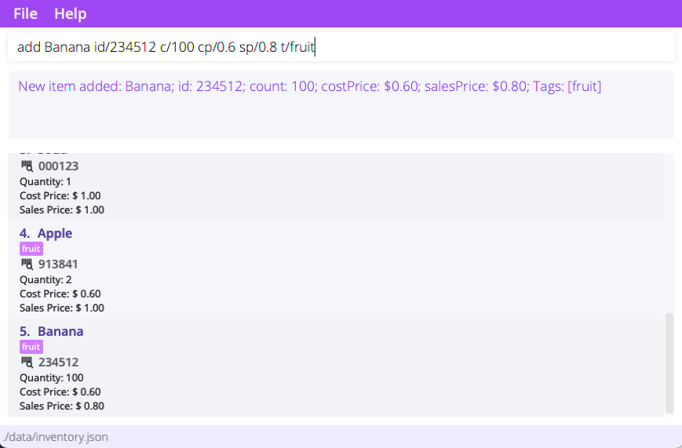
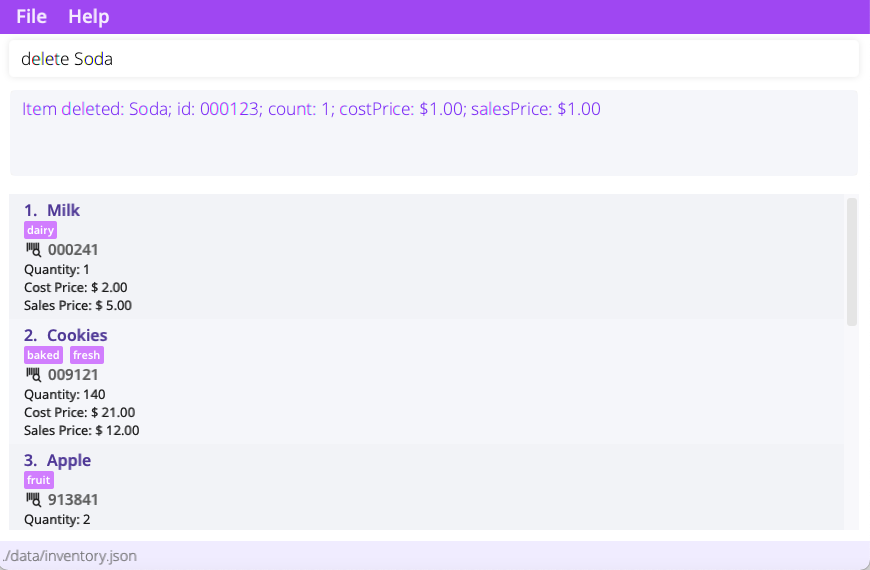
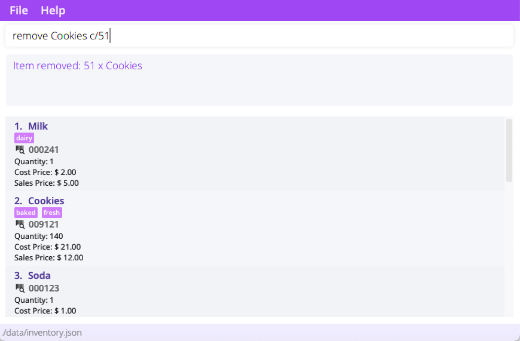
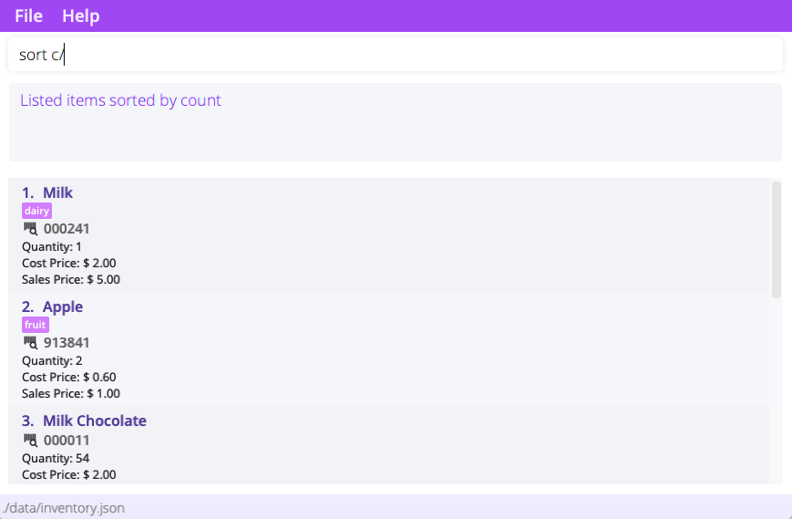
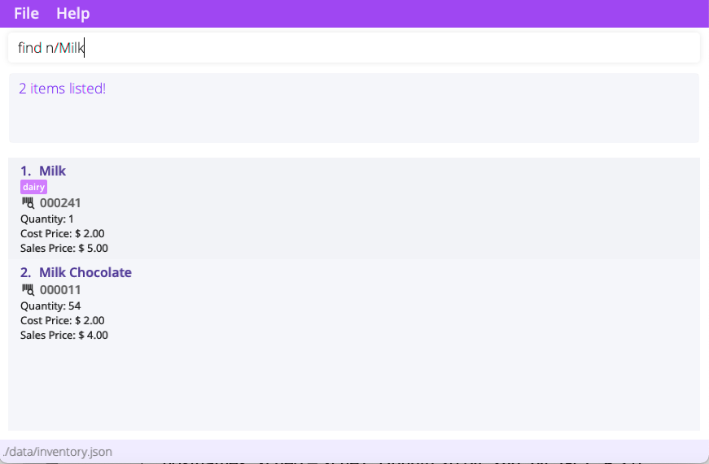
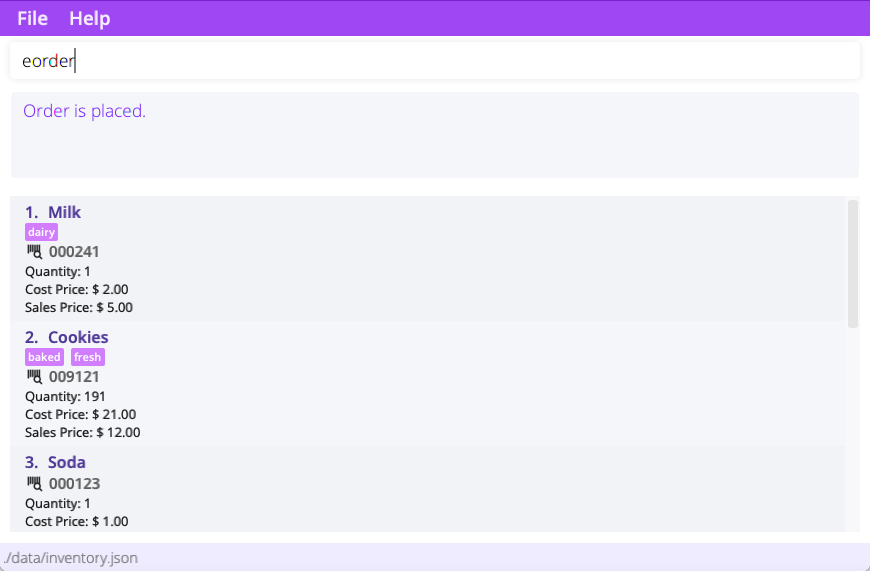

<h3><i>What is BogoBogo?</i></h3>

BogoBogo is a **desktop app for small business owners to manage inventories, optimized for use via a Command Line Interface (CLI)**
while still having the benefits of a Graphical User Interface (GUI). If you can type fast, BogoBogo can get your
inventory management tasks done faster than traditional GUI apps.

With BogoBogo, business owners can:
1. easily manage their inventories
2. record customer orders
3. track profit, costs, and revenue

<b>Table of Contents</b>

{:toc}

--------------------------------------------------------------------------------------------------------------------

## Getting started

1. Ensure you have Java `11` or above installed in your Computer.

2. Download the latest `BogoBogo.jar` from [here](https://github.com/AY2122S1-CS2103-F10-2/tp/releases).

3. Move the file to the folder you want to use as the _home folder_ for the application.

4. Double-click the file to start the app. The GUI similar to the below should appear in a few seconds. Note how the app
   contains some sample data.<br>
   

{/% include tip.html
content="You might have to give your device permission to open BogoBogo. [See FAQ](#FAQ) for more info." %}

6. Let's try adding a new item! Enter the command in the command box.<br>

    - **`add`** `Apple id/139827 c/3 cp/1.3 sp/2.4` : Adds an apple with id 139827, 
      cost price 1.3, and sales price 2.4, into the inventory.

7. Congrats on setting up BogoBogo! Read our [features](#Features) to learn about the different things you can do on the application.

<div markdown="span" class="alert alert-warning">:exclamation: **Caution:**
* For Mac users, method 2 is the recommended way to open your files to ensure that you are able to see the save data for _PH_
</div>

   {/%include tip.html
   content="Ready to jump right into recording your inventory? Use `clear` to clear the sample data!" %}
--------------------------------------------------------------------------------------------------------------------

## Features

<div markdown="block" class="alert alert-info">

**:information_source: Notes about the command format:**<br>

- Words in `{}` are the parameters to be supplied by the user.<br>
  e.g. in `add {name}`, `name` is a parameter which can be used as `add milk`.

- Parameter prefixes such as sp/ and cp/ are special keywords that indicate a start of a parameter.
   
- Parameters in `()` are optional.<br>
  e.g. in `add {name} (c/{count}), the `count` parameter can be omitted from the command.

- Items in square brackets with pipes are exclusively optional (user must specify at least one of the option).<br>
  e.g `delete [{name} | id/{id_number}]` should be supplied with either `name` or `id number`.

- Items with `…`​ after them can be zero or more times.<br>
  e.g. `[t/TAG]…​` can be used as ` ` (i.e. 0 times), `t/popular`, `t/popular t/baked` etc.

- Prefixed parameters can be in any order.<br>
  e.g. if the command specifies `id/{id_number} cp/{cost_price}`, `cp/{cost_price} id/{id_number}` is also acceptable.

- If a parameter is expected only once in the command is specified multiple times, only the last occurrence of
  the parameter will be taken.<br>
  e.g. if you specify `id/123413 id/567856`, only `id/567856` will be taken.

- Extraneous parameters for commands that do not take in parameters (such as `help`, `list`, `exit` and `clear`) will be
  ignored.<br>
  e.g. if the command specifies `help 123`, it will be interpreted as `help`.

</div>

### Viewing help : `help`

Gives a quick link to this user guide.
If a command word is specified, it'll explain how to use the specified command instead.

Format: 
- `help`: Shows help page url.
- `help {command}` : Explains how to use the specified command.

Examples:
- **`help list`** offers information regarding our `list` command.


### Adding an item: `add`

Adds an item to the inventory.

Format: `add [{name} | id/{id number}] (c/{count}) (cp/{cost price}) (sp/{sell price})`

Prefix  |  Argument     | Description                   | Remarks                                 |
--------|-------------- |-------------------------------|-----------------------------------------|
&nbsp;  | name          | Name of the item to add.      | Only alphanumeric characters allowed.   |
`id/`   | id number     | Id number of item to add.     | Must be a 6 digit number.               |
`c/`    | count         | Quantity of the item to add.  | If omitted, value defaulted as 1.       |
`cp/`   | cost price    | Cost price of the item to add.| Must be a positive number.              |
`sp/`   | sell price    | Sell price of the item to add.| Must be a positive number.              |

{/% include note.html
content="When adding an item for the first time, the name, id, cost price, and sales prices must be specified." %}

Examples:

- `add apple` adds an apple into the inventory
- `add id/111111` adds 2 of item with id #111111 into the inventory
- `add banana id/192023 cp/1.0 sp/2.2` adds a banana with id #192023, cost price $1 and sales price $2.20 into the inventory.

{/% include tip.html
  content="BogoBogo will get confused if different items have matching names or id. Hence, adding different items with clashing names/ids are is not allowed." %}



### Deleting an item : `delete`

Deletes the specified item from the inventory.
Use this command to delete items wrongly keyed into the inventory. Costs initially incurred from the item will be removed too.

Format: `delete [{name} | id/{id number}]`

Prefix  |  Argument      | Description
--------|----------------|-------------
`n/`    | name           | Name of the item to delete.
`id/`   | id number      | Serial number of the item to delete.

- Delete the specified item entirely from the inventory.
- An item can be specified by either name or serial number.
- If both name and serial number are specified, the command will take the name as reference.

```
delete Apple // delete by name
delete id/181817  // delete by serial number
```

Screenshot:



### Removing an item : `remove`

Removes a specified amount of a particular item from the inventory.

Format: `remove [{name} | id/{id number}] c/{count}`

Flag    |  Argument      | Description                      | Remarks                           |
--------|----------------|----------------------------------|-----------------------------------|
`n/`    | name           | Name of the item to remove.      |                                   |
`id/`   | id number      | Id number of the item to remove. |                                   |
`c/`    | count          | Quantity of the item to remove.  | If omitted, value defaulted to 1. |

- An item can be specified by either name or serial number.
- If both name and serial number are specified, the command will take the name as reference.

Examples:

```
remove Apple c/2 // remove 2 apples from inventory
remove id/181817 c/5 // remove 5 items with id 181817
```

Screenshot:



### Editing an item : `edit`

Edit a particular item in the inventory.

Format: `edit {index} [n/{name}] [id/{id}] [cp/{cp}] [sp/{sp}] [t/{tag}]...`

Flag    |  Argument    | Description
--------|--------------|-------------
&nbsp;  | index         | index of the item to edit.
`n/`    | name          | new name for the item.
`id/`   | id number     | new id number for the item.
`cp/`   | cost price    | new cost price for the item.
`sp/`   | sell price    | new sell price for the item.
`t/`    | tag           | new tag for the item.

- Count cannot be edited, use add, delete or remove instead.

Examples:

```
edit 1 id/192028  // edit first item's id to 192028
edit 2 n/Panadol  // edit second item's name to Panadol
```

Screenshot:


### Listing items: `list`

List items in the inventory, current order, or past transactions.

Format: 

 - `list`: List items in the inventory.
 - `list order`: List items in the current order (if any).
 - `list txns`: List past transactions.
 - `list txns {id}`: List items in the specified transaction.

Screenshot:


### Sorting items: `sort`

Sort items in the inventory.
Note that display must be in inventory mode (see `list`).

Format: 

 - `sort n/`: Sort items in the inventory by name.
 - `list id/`: Sort items in the inventory by id.

Screenshot:



### Finding items: `find`

Find items in the inventory.
Note that display must be in inventory mode (see `list`).

Format: `find [ n/{name}... | id/{id}... | t/{tag}]`

Searching by 1 or more names, or 1 or more ids, or 1 or more tags is supported. However, searching by multiple tags simultaneously is not supported.

Examples: 

```
find n/Cookie n/Apple  // find and list items with names "Cookie" and "Apple"
find id/123456  // find item with id 123456
```

Screenshot:



### Clearing items: `clear`

Clears the entire inventory.

Format: `clear`

Screenshot:


### Manage orders

Remove items from the inventory by logging in an order. To enter order logging mode, use `sorder`. Exit the mode
with `eorder`.


### Start ordering: `sorder`

Starts a new list of orders.

Format: `sorder`

Example:

```
sorder
>> Please enter item name and quantity.
```

Screenshot:


### Inputting an item into order: `iorder`

Add an item into the current order.

Format:
`iorder [ {name} | id/{id} ] (c/{count})`

Flag    |  Argument      | Description                            | Remarks                           |
--------|----------------|----------------------------------------|-----------------------------------|
&nbsp;  | name           | Name of the item to add to order.      |                                   |
`id/`   | id number      | Id number of the item to add to order. |                                   |
`c/`    | count          | Quantity of the item to add to order.  | If omitted, value defaulted to 1. |

Example:

```
iorder milk c/5  // Add 5x milk into order
iorder id/12345  // Add 1x item with id 12345 into order
```

Screenshot:


### Cancelling an item in the order: `corder`

Cancels the specified order from the current order.

Format:
`corder [ {name} | id/{serial number}]`

Flag    |  Argument      | Description                                 | Remarks                           |
--------|----------------|---------------------------------------------|-----------------------------------|
&nbsp;  | name           | Name of the item to remove from order.      |                                   |
`id/`   | id number      | Id number of the item to remove from order. |                                   |
`c/`    | count          | Quantity of the item to remove from order.  | If omitted, value defaulted to 1. |

Example:

```
corder milk c/5  // Remove 5x milk from the order
corder id/12345  // Remove 1x item with id 12345 from the order
```

Screenshot:


### End ordering: `eorder`

Process the current order and save it.

Format: `eorder`

Example:

```
eorder
>> Order is placed.
```

Screenshot:



--------------------------------------------------------------------------------------------------------------------

## FAQ [Coming soon]

**Q**:
**A**:

--------------------------------------------------------------------------------------------------------------------

## Command summary

Action | Format, Examples
--------|------------------

**
Add** | `add {name} -sp {sales price} -s {serial number} -c {count} -cp {cost price}` <br>
e.g., `add apple -sp 8.5 -s A012345 -c 1000 -cp 5.2`
**Delete** | `delete [-n {name} \| -s {serial number}] -c {count}` <br> e.g., `delete -n milk -c 10`
**Count** | `count [-n {name} \| -s {serial number}]` <br> e.g., `count milk`
**Start ordering** | `sorder`
**Input item to order** | `iorder [-n {name} \| -s {serial number}] -c {count}` <br> e.g., `iorder -n milk -c 5`
**Cancel item in order** | `corder [-n {name} \| -s {serial number}]` <br> e.g., `corder -n milk`
**End ordering** | `eorder`
