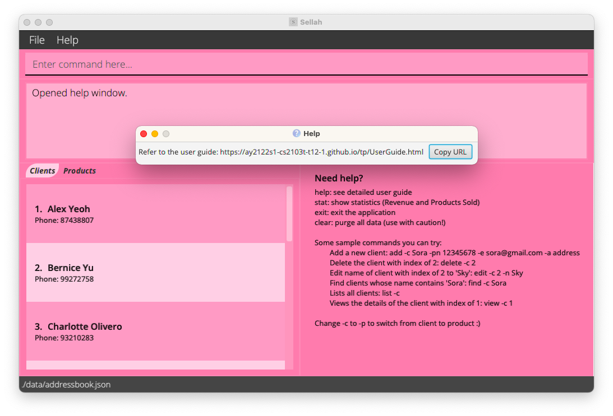

## Table of Contents

1. [Introduction](#1-introduction)  
1. [Quick start](#2-quick-start)  
1. 

<a href="#3-about">About</a>

      3.1. <a href="#31-structure-of-the-document">Structure of this Document</a> 
      3.2. <a href="#32-reading-this-document">Reading this Document</a> 
      &nbsp;&nbsp;&nbsp;&nbsp; 3.2.1. <a href="#321-technical-terms">Technical terms</a> 
      &nbsp;&nbsp;&nbsp;&nbsp; 3.2.2. <a href="#322-general-symbols-and-syntax">General Symbols and Syntax</a> 
      &nbsp;&nbsp;&nbsp;&nbsp; 3.2.3. <a href="#323-defining-client-and-product">Defining Client and Product</a> 
   

1. 

<a href="#4-features">Features</a>

      4.1. <a href="#41-getting-help">Getting Help</a> 
      4.2. <a href="#42-add">Add</a> 
      &nbsp;&nbsp;&nbsp;&nbsp; 4.2.1. <a href="#421-adding-a-client">Adding a Client</a> 
      &nbsp;&nbsp;&nbsp;&nbsp; 4.2.2. <a href="#422-adding-a-product">Adding a Product</a> 
      4.3. <a href="#43-delete">Delete</a> 
      &nbsp;&nbsp;&nbsp;&nbsp; 4.3.1. <a href="#431-deleting-a-client">Deleting a Client</a> 
      &nbsp;&nbsp;&nbsp;&nbsp; 4.3.2. <a href="#432-deleting-a-product">Deleting a Product</a> 
      4.4. <a href="#44-edit">Edit</a> 
      &nbsp;&nbsp;&nbsp;&nbsp; 4.4.1. <a href="#441-editing-a-client">Editing a Client</a> 
      &nbsp;&nbsp;&nbsp;&nbsp; 4.4.2. <a href="#442-editing-a-product">Editing a Product</a> 
      4.5. <a href="#45-find">Find</a> 
      &nbsp;&nbsp;&nbsp;&nbsp; 4.5.1. <a href="#451-finding-a-client">Finding a Client</a> 
      &nbsp;&nbsp;&nbsp;&nbsp; 4.5.2. <a href="#452-finding-a-product">Finding a Product</a> 
      4.6. <a href="#46-list">List</a> 
      &nbsp;&nbsp;&nbsp;&nbsp; 4.6.1. <a href="#461-listing-all-clients">Listing all Clients</a> 
      &nbsp;&nbsp;&nbsp;&nbsp; 4.6.2. <a href="#462-listing-all-products">Listing all Products</a> 
      4.7. <a href="#47-view">View</a> 
      &nbsp;&nbsp;&nbsp;&nbsp; 4.7.1. <a href="#471-viewing-a-client">Viewing a Client</a> 
      &nbsp;&nbsp;&nbsp;&nbsp; 4.7.2. <a href="#472-viewing-a-product">Viewing a Product</a> 
      4.8. <a href="#48-clearing-all-data">Clearing the all Data</a> 
      4.9. <a href="#49-navigating-the-command-history">Navigating the Command History</a> 
      4.10. <a href="#410-viewing-statistics">Viewing Statistics</a> 
      4.11. <a href="#411-exiting-sellah">Exiting Sellah</a> 
      4.12. <a href="#412-saving-data">Saving Data</a> 
      4.13. <a href="#413-editing-the-data-file">Editing the Data file</a> 
   

1. [FAQ](#5-faq)  
1. [Command summary](#6-command-summary)  

--------------------------------------------------------------------------

## 1. Introduction

Welcome to the User Guide of **Sellah**!

**Sellah** is a desktop application optimized for online sellers who prefer using a `Command Line Interface (CLI)` over
the `Graphical User Interface (GUI)`. It is used to keep track of the contact information of your clients and details of
the products in your inventory, as well as details of the orders placed by your clients.

**Sellah** uses `CLI`; this means that you operate the application by typing commands into a `Command Box`. If your
typing speed is fast, you can operate the application faster than other `GUI` applications; `GUI` applications allow you
to interact with the application through graphical icons such as buttons.  

You do not have to worry at all even if you are new to CLI applications as this user guide will take you through step by
step on how various features of the **Sellah** can be utilised, all geared towards providing the best possible
experience for you.  

If you are interested, jump to [Section 2 - Quick Start](#2-quick-start) to learn how to optimise your inventory using
**Sellah**.  

--------------------------------------------------------------------------

## 2. Quick Start

1. Ensure you have `Java 11` or above installed in your Computer. You can download it from
   [here](https://www.oracle.com/java/technologies/javase/jdk11-archive-downloads.html).

1. Download the latest `sellah.jar` from [here](https://github.com/AY2122S1-CS2103T-T12-1/tp/releases).

1. Copy the file to the folder you want to use as the _home directory_ for your **Sellah**.

1. For `Windows` users, simply `double-click` the file to start the application.  
   For `Mac` users, you need to open **Sellah** using terminal, key in `java -jar sellah.jar` and press `Enter` to
   launch the application. You can `right-click` on the folder and click on `New Terminal at Folder` to bring up your
   terminal as shown below.

   > :bulb: The image below shows how you can open the home directory of **Sellah** in a terminal for Mac users.

   

1. The GUI similar to the below should appear in a few seconds. Note how the app contains some sample data. You can use
   the [`clear`](#48-clearing-all-data) command to purge all data.  
   

1. Refer to the [Features](#4-features) below for details of each command.

--------------------------------------------------------------------------

## 3. About

### 3.1 Structure of the Document

The structure of this document is to help you find what you need quickly and easily.

In the next section [Reading this Document](#32-reading-this-document), you will be able to find definitions of
technical terms, general syntax and format of commands that will be used throughout the guide.

The following section [Features](#4-features), documents the main features of **Sellah** and provides explanations on
how to utilise them to its fullest.

Alternatively, if you are looking for a quick summary of the command formats, you can jump
to [Command Summary](#6-command-summary).

### 3.2 Reading this Document

This section provides some common terms and syntax that would be used throughout the document. It is important that you
familiarise yourself with them before moving on to the next section [Features](#4-features).

Throughout this guide, [Products](#323-defining-client-and-product) refer to the items in your inventory
and [Clients](#323-defining-client-and-product) refer to the people who have
order [Products](#323-defining-client-and-product) from you.

#### 3.2.1 Technical Terms

The table below explains some technical terms that you may come across throughout the user guide.

| Term | Definition |
|:---:| --- |
| CLI | The Command-Line Interface (CLI) is the user interface in which Sellah is based on. Unlike traditional Graphical User Interface (GUI) base applications, it may be less intuitive to new users. However upon familiarisation, fast typists may find it faster to use. |
| Command | Keywords that Sellah recognises to invoke specific commands. |
| Parameters | Information to be passed to the Commands. |
| Index | The number next to the list of [Clients](#323-defining-client-and-product) or [Products](#323-defining-client-and-product). |
| ID | Each [Client](#323-defining-client-and-product) or [Product](#323-defining-client-and-product) is associated with a unique numerical `ID`. This number may not always be the same as `Index`. |

#### 3.2.2 General Symbols and Syntax

The table below explains the general syntax used throughout the user guide.

| Syntax | Definition |
|:---:| --- |
| `...` | Indicates that the parameter before it can be used multiple times, including 0 times. If the parameter is `-o`, some possible usages could be <code></code>(empty) or `-o 1 -o 2`. |
| `UPPER_CASE` | Name of the parameter. For example, `EMAIL` is a parameter named email. |
| `-lower_case UPPER_CASE` | A parameter field. The name of the parameter is defined in `UPPER_CASE` and `-lower_case` refers to an acronym of `UPPER_CASE`. An example can be `-e abc@gmail.com`. |
| `[-lower_case UPPER_CASE]` | An optional parameter field. Eg `-a A [-b B]` can be used as `-a A -b B` or just `-a A`. |
| :bulb: | A light bulb indicates that the following text is a tip. |

* Parameters can be in any order. 
  e.g. if the command specifies `-pn PHONE_NUMBER -e EMAIL`, then `-e EMAIL -pn PHONE_NUMBER` is also acceptable.

* If a parameter is expected only once in the command, but you specified it multiple times, only the last occurrence of
  the parameter will be taken. 
  e.g. if you specify `-pn 12341234 -pn 56785678`, only `-pn 56785678` will be taken.

* Extraneous parameters for commands that do not take in parameters (such as `exit`) will be ignored. 
  e.g. if the command specifies `exit 123`, it will be interpreted as `exit`.

* Extraneous parameters for commands that do take in parameters (such as `edit`) will be ignored. 
  e.g. if the command specifies `edit -c 1 -a asdf -id 5`, the resulting address will be changed to `asdf -id 5`.

#### 3.2.3 Defining Client and Product

**Client** refers to the clients that have bought your products before. Each client must have a **Name** and a
**Phone Number**. Optionally, they can have an **Email Address**, a physical **Address** and a list of **Orders**. Every
client command requires a `-c` parameter.

An **Order** refers to a product that the client has ordered. For each order, the **ID** associated to the product, the
**Quantity** and the **Date of Purchase** must be included.

Parameter | Format |
|:---:| --- |
`-n` | Any valid name, only alphabets, numbers and spaces are allowed (applicable for Edit command only).   E.g.: `-n Alice Bob`.
`-pn` | A series of 1 or more positive integers from 0 to 9.   E.g.: `-pn 12345678` and `-pn 123` is valid.
`-e` | Any valid email.   E.g.: `-e abc@asdf.com`.
`-a` | Any valid address, spaces are allowed.   E.g.: `-a 12 clementi road`.
`-o` | Each order requires a product id, quantity and a date field that is either in `YYYY/MM/DD` or `MM/DD` and is identified by its own ID.   E.g.: `-o 1 1 1/2` and `-o 3 12 2020/07/09`.

**Product** refers to the items currently in your inventory. Each product must have a **Name**, the **Unit Price**
(cost of 1 item). Optionally, you can add a **Quantity** to the products that indicates the number of that item you have
in your inventory currently. Every product command requires a `-p` parameter.

Parameter | Format |
|:---:| --- |
`-n` | Any valid name, only alphabets, numbers and spaces are allowed (applicable for Edit command only).   E.g.: `-n Alienware Aurora R12`.
`-$` | A valid price, optional to specify the cents (2 decimal places).   E.g.: `-$ 10.00` and `-$ 10`.
`-q` | Any positive integer to specify the quantity.   E.g.: `-q 15`.

--------------------------------------------------------------------------

## 4. Features

This section contains the main features of the **Sellah**. To use each feature, you can enter the command associated
with each feature into the CLI.

### 4.1 Getting help

Displays a help message. Format: `help`

Expected Output:

### 4.2 Add

Adds a new client or product to Sellah with an automatically generated ID.

An error message will be displayed if the format of a parameter is incorrect. A different error message will be
displayed if the client or product to be added already exists in Sellah.

#### 4.2.1 Adding a Client

Adds a client with name, phone number and optional email, address and orders.

Format: `add -c NAME -pn PHONE_NUMBER [-e EMAIL] [-a ADDRESS] [-o ORDER]...`

> Note: the format of `ORDER` is `PRODUCT_ID QUANTITY DATE`, e.g. `-o 0 10 10/26` represents an order made on 26 Oct of the current year, the product requested has `PRODUCT_ID` = `0` and `QUANTITY` = `10`.

Example (without orders) : `add -c Ben -pn 12345678 -e test@xyz.com -a 12 Clementi Road` adds a new `Client` `Ben`,
whose `PHONE_NUMBER` is `98765432`, `EMAIL` is `test@xyz.com` and `ADDRESS` is `12 Clementi Road`.

Example (with orders) : `add -c Ben -pn 12345678 -e test@xyz.com -a 12 Clementi Road -o 0 10 10/26` adds a new
`Client` `Ben`, whose `PHONE_NUMBER` is `98765432`, `EMAIL` is `test@xyz.com` and `ADDRESS` is `12 Clementi Road` with
an `ORDER` of `QUANTITY` `10` of product with `IDENTITY` `0` on `DATE` `26/10/<curr year>`.

Expected Output (without orders):

> Note: the expected output of an addClient command with orders is similar to the output above except that the orders added will be displayed.

#### 4.2.2 Adding a Product

Adds a product with name, unit price and optional quantity. If quantity is not specified, the number of product is not
0, but undefined instead. Unit price have to only contain 2 decimal places. `-$ 0.2` and `-$ 0.002` would be invalid.

Format: `add -p NAME -$ UNIT_PRICE [-q QUANTITY]`

Example: `add -p pen -$ 5 -q 150` adds a new `Product` `pen` with a `UNIT_PRICE` of `$5` and there are `150`
pens in stock.

Expected Output:

### 4.3 Delete

Deletes the specified client/product from Sellah.

An error message will be displayed if the format of a parameter is incorrect. A different error message will be
displayed if the client or product to be deleted does not exist in Sellah.

#### 4.3.1 Deleting a Client

Deletes the client at the specified index from Sellah.

Format: `delete -c INDEX`

Example : `delete -c 1` deletes the client with index 1 from Sellah.

Expected Output:

#### 4.3.2 Deleting a Product

Deletes the product at the specified index in Sellah.

Format: `delete -p INDEX`

Example : `delete -p 1` deletes the product with index 1 from Sellah.

Expected Output:

### 4.4 Edit

Edits an existing client or product in Sellah. You need to provide at least one of the optional field so that Sellah can
update the client or product correctly.

An error message will be displayed if the format of a parameter is incorrect. A different error message will be
displayed if the client or product to be edited does not exist in Sellah.

#### 4.4.1 Editing a Client

Edits the client (if he exists) at the specified index in Sellah.

Format : `edit -c INDEX [-n NAME] [-pn PHONE_NUMBER] [-e EMAIL] [-a ADDRESS] [-o ORDER]...`

Example : `edit -c 1 -n Ben` Edits the name of the client with `INDEX` of `1` to `Ben`.

Expected Output:

**:bulb: Notes on `ORDER`:**

* If the client has an order with same `Product ID`, then that order's other information will be updated with the
  information in `ORDER`.
* If the client does not have an order with same `Product ID`, then that `ORDER` will be added.
* If the `ORDER`'s `Quantity` is 0, then that `ORDER` will be removed.
* For example, assuming client already has an order `[ Product ID = 1, Quantity = 3, (other information)... ]`, and the
  input `ORDER`s are `[ Product ID = 1, Quantity = 0, ... ]` and `[ Product ID = 2, Quantity = 10, ... ]`:
* `[ Product ID = 1, Quantity = 3, ... ]` will be updated to `[ Product ID = 1, Quantity = 0, ... ]` as they have the
  same `Product ID`, and since `Quantity` is now 0, this `ORDER` will be removed.
* `[ Product ID = 2, Quantity = 10, ... ]` will be added as the client does not have an order with the same
  `Product ID`.

#### 4.4.2 Editing a Product

Edits the product (if it exists) at the specified index in Sellah.

Format: `edit -p INDEX [-n NAME] [-$ UNIT_PRICE] [-q QUANTITY]`

Example : `edit -p 3 -n Ben10 -q 20` Edits the name of the product with `INDEX` of `3` to `Ben10` and the quantity
to `20`.

Expected Output:

### 4.5 Find

Finds a client or product in Sellah based on the name. If there are no matching name, Sellah will show an empty list.

An error message will be displayed if the format of a parameter is incorrect.

The name you provide must fully match (case-insensitive) the name of the client or product in Sellah.

Example : `find -c ben` will match with `Ben`, but will not match with `Benson`.

If multiple keywords are specified, any name matching the keywords will be displayed.

Example: `find -c alice ben charlie` will match with `alice`, `ben`, and `charlie`.

#### 4.5.1 Finding a Client

Finds a client in Sellah.

Format : `find -c NAME`

Example : `find -c Benson` Shows a list of all clients with the `NAME` `Benson` in Sellah.

Expected Output:

#### 4.5.2 Finding a Product

Finds a product in Sellah.

Format : `find -p NAME`

Example : `find -p apple` Shows a list of all products with the `NAME` `apple` in Sellah.

Expected Output:

### 4.6 List

Displays a list of all the clients or products in Sellah. If there are no clients or products, Sellah will show an empty
list.

An error message will be displayed if the format of a parameter is incorrect.

#### 4.6.1 Listing all Clients

Lists all the clients in Sellah.

Format : `list -c`

Example : `list -c` Shows a list of all clients in Sellah.

Expected Output:

#### 4.6.2 Listing all Products

Lists all the products in Sellah.

Format : `list -p`

Example : `list -p` Shows a list of all products in Sellah.

Expected Output:

### 4.7 View

Views the details of a client or product. The details will be displayed in the second panel of Sellah.

An error message will be displayed if the format of a parameter is incorrect. A different error message will be
displayed if the client or product to be viewed does not exist in Sellah.

#### 4.7.1 Viewing a Client

Views a current client that exists in Sellah. You will see the details of the client in the second panel on the right.
These details include ID, name, phone number, email, address and orders.

If any of the details were not specified, a placeholder value will be displayed such as `No orders available!`.

Format : `view -c INDEX`

Example : `view -c 2` Views all the details of the client with `INDEX` of `2`.

Expected Output:

#### 4.7.2 Viewing a Product

Views a current product that exists in Sellah. Details of the product will be presented to you in the second panel on
the right. These details include ID, name, unit price and quantity.

If any of the details were not specified, a placeholder value will be displayed such as `No quantity provided`.

Format : `view -p INDEX`

Example : `view -p 5` Views all the details of the product with `INDEX` of `5`.

Expected Output:

### 4.8 Clearing all Data

Deletes all client and product data from Sellah. Please be very careful when using this command as once deleted, the
data **cannot be recovered**!

Format: `clear`

Expected Output:

### 4.9 Navigating the Command History

You may press the `↑` and `↓` keys to navigate to previous commands that you have used within the same session.
Pressing `↑` when the first command is currently displayed will do nothing. `↓` when the last command is currently
displayed clears the command input field. Subsequent `↓` will do nothing.

### 4.10 Viewing Statistics

Shows the current stock of each product in your inventory. The stock would be displayed as a pie chart in the secondary
panel on the right. Each label would contain the product name with the quantity associated with it.

If there are no products in your inventory with a valid quantity specified, an error message would be shown.

Format : `stat`

Expected Output:

### 4.11 Exiting Sellah

Exits Sellah.

Format : `exit`

### 4.12 Saving Data

Sellah's data are saved in the hard disk automatically after any command that changes the data. There is no need to save
manually.  

Your saved data can be found in the data folder within your home directory of Sellah.

In the data folder you will find the text file as shown below.

### 4.13 Editing the Data file

Sellah data are saved as a JSON file `[JAR file location]/data/addressbook.json`.  
You are welcome to update data directly by editing this file. However, if your changes to the file make its format
invalid, Sellah will start with a new data file on its next run.

> :bulb: It is highly recommended that you do not edit the saved data as it can cause data losses in future sessions!

--------------------------------------------------------------------------

## 5. FAQ

**Q**: How do I transfer my clients' and products' information to another computer?  
**A**: Copy the entire `data` folder and `sellah.jar` in your _home directory_ on the current computer over to the new
_home directory_ on the new computer. Optionally, you can also copy `config.json` and `preferences.json` over if you
wish to keep your preferences of the application.

**Q**: Do I lose all my clients and products' information when I close the application?  
**A**: All data is auto-saved once you exit the app and loaded upon next entry, so you do not lose any data.

**Q**: What should I do if I don’t know the command format?  
**A**: You can type the [`Help`](#41-getting-help) command to receive a help message.

--------------------------------------------------------------------------

## 6. Command Summary

Action | Format
|:---:| --- |
[Help](#41-getting-help) | `help`
[Exit](#411-exiting-sellah) | `exit`
[Add](#42-add) | Client: `add -c NAME -pn PHONE_NUMBER [-e EMAIL] [-a ADDRESS] [-o ORDER]...`   Product: `add -p NAME -$ UNIT_PRICE [-q QUANTITY]`
[Delete](#43-delete) | Client: `delete -c INDEX`   Product: `delete -p INDEX`
[Edit](#44-edit) | Client: `edit -c INDEX [-n NAME] [-pn PHONE_NUMBER] [-e EMAIL] [-a ADDRESS] [-o ORDER]...`   Product: `edit -p INDEX [-n NAME] [-$ UNIT_PRICE] [-q QUANTITY]`
[Find](#45-find) | Client: `find -c NAME`   Product: `find -p NAME`
[List](#46-list) | Client: `list -c`   Product: `list -p`
[View](#47-view) | Client:`view -c INDEX`   Product: `view -c INDEX`
[Clear](#48-clearing-all-data) | `clear`
[Command History](#49-navigating-the-command-history) | Previous: `↑`   Next: `↓`
[Statistics](#410-viewing-statistics) | `stat`
