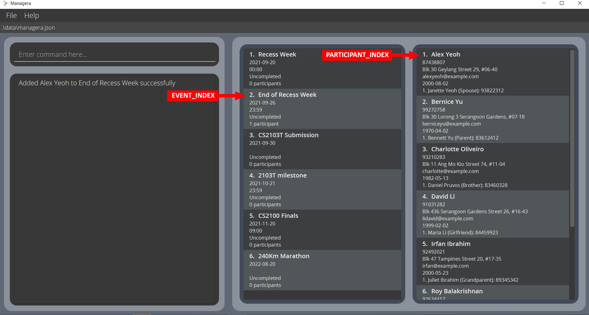

Managera is a **desktop app that _provides event organisers with a convenient method of keeping track of upcoming 
[events](#glossary) and the details of their [Participants](#glossary)_**. It does not handle communication between the event organiser and the 
Participants.

Managera is OS-independent, meaning it will work on any operating system (Windows, MacOS, Linux).

## Table of Contents
- [**What this user guide is for**](#what-this-user-guide-is-for)
- [**How to use this user guide**](#how-to-use-this-user-guide)
- [**Quick start**](#quick-start)
- [**Features**](#features)
    * [Participant](#participant)
        * [Adding a Participant: `add`](#adding-a-participant-add)
        * [Deleting a Participant: `delete`](#deleting-a-participant--delete)
        * [Editing a Participant: `edit`](#editing-a-participant--edit)
        * [Locating Participants by name: `find`](#locating-participants-by-name-find)
        * [Listing all Participants: `list`](#listing-all-participants--list)
        * [Viewing a Participant's details: `view`](#viewing-a-participants-details-view)
        * [Adding a Next-of-Kin to a Participant: `addNok`](#adding-a-next-of-kin-to-a-participant-addnok)
        * [Deleting a Next-of-Kin of a Participant: `deleteNok`](#deleting-a-next-of-kin-of-a-participant-deletenok)
    * [Event](#event)
        * [Adding an event: `addEvent`](#adding-an-event-addevent)
        * [Deleting an event: `deleteEvent`](#deleting-an-event--deleteevent)
        * [Editing an event: `editEvent`](#editing-an-event--editevent)
        * [Marking an Event as done: `done`](#marking-an-event-as-done-done)
        * [Locating Events by name: `findEvent`](#locating-events-by-name-findevent)
        * [Filtering Events by time: `filterEvents`](#filtering-events-by-time-filterevents)
        * [Sorting Events by time: `sortEvents`](#sorting-events-by-time-sortevents)
        * [Listing all Events: `listEvents`](#listing-all-events-listevents)
        * [Showing an Event's details: `showDetails`](#showing-an-events-details-showdetails)
        * [Adding a Participant to an Event: `enroll`](#adding-a-participant-to-an-event-enroll)
        * [Remove a Participant from an Event: `expel`](#removing-a-participant-from-an-event-expel)
        * [Showing an Event's Participants: `showParticipants`](#showing-an-events-participants-showparticipants)
    * [Miscellaneous](#miscellaneous)
        * [Viewing help: `help`](#viewing-help--help)
        * [Clearing all Data: `clear`](#clearing-all-data--clear)
        * [Exiting the program: `exit`](#exiting-the-program--exit)
- [**Valid emails**](#valid-emails)    
- [**Saving the data**](#saving-the-data)
- [**Editing the data file**](#editing-the-data-file)
- [**Features in the next update v1.5**](#features-in-the-next-update-v15)
    * [Undone Event](#undo-event-undone)
- [**Modifications in the next update v1.5**](#modifications-in-the-next-update-v15)
    * [Event time period](#event-time-period)
    * [Detect schedule clashes](#detect-clashes-in-schedule)
- [**Glossary**](#glossary)
- [**FAQ**](#faq)
- [**Command summary**](#command-summary)

--------------------------------------------------------------------------------------------------------------------

## What this user guide is for

This user guide aims to give a brief overview of what Managera is and what features it has.
It is intended mainly for first-time users or beginners to Managera, but experienced users may still use it for 
reference.

It contains instructions for [how to set up Managera](#quick-start), [how to use certain features](#features) 
and answers to some [commonly-asked questions](#faq). You may also use this user guide as a
[quick reference](#command-summary) to any [commands](#glossary) once you are more experienced with Managera.

If this is your first time using Managera, or your first time using this user guide, you are strongly advised to
look through the [next section](#how-to-use-this-user-guide).

--------------------------------------------------------------------------------------------------------------------
## How to use this user guide

If this is the first time you are using Managera, you are strongly advised to visit the [Quick Start](#quick-start) 
section to learn how to set up Managera and get started.

If there are any doubts on how certain commands are used, you can look for the description of the command in the 
[Features](#features) section or have a brief overview in the [Command Summary](#command-summary) section.

If there are any terms used in this user guide you are unclear of or do not understand, their definitions may be found 
in the [Glossary](#glossary).

For any other questions about Managera, you may refer to the [FAQ](#faq) section.

You can quickly jump to any of the sections by using the [Table of Contents](#table-of-contents) above.

--------------------------------------------------------------------------------------------------------------------

## Quick start

1. [Ensure](https://twallet.telangana.gov.in/TABiometric/data/Java%20Check.pdf) you have Java `11` or 
   above installed in your Computer.

2. If your computer does not have Java `11`, obtain the installation package from 
   [here](https://www.oracle.com/java/technologies/downloads/#java11) and follow the instructions 
   [here](https://docs.oracle.com/en/java/javase/11/install/overview-jdk-installation.html).

3. Download the latest release `managera.jar` from [here](https://github.com/AY2122S1-CS2103T-T10-2/tp/releases).

4. Copy `managera.jar` to a new folder which will act as the [_home folder_](#glossary) for Managera.

5. Double-click `managera.jar` to start the app. The GUI similar to the one below should appear in a few seconds. Note 
   how the app contains some sample data. 
   

6. Type the command in the command box and press Enter to execute it. e.g., typing **`help`** and pressing Enter will 
   open the help window.  
   Some example commands you can try:

   * **`list`** : Lists all Participants.

   * **`add`**`n/John Doe p/98765432 e/johnd@example.com a/John street, block 123, #01-01` : Adds a Participant 
     named `John Doe` to Managera.

   * **`delete 3`** : Deletes the 3rd Participant shown in the current list.

   * **`clear`** : Deletes all Participants and Events.
     
   * **`addEvent n/My First Event d/2021-01-01`** : Adds a new Event to the list called 'My First Event'.
     
   * **`sortEvents`** : Sorts the current list of Events in chronological order.

   * **`exit`** : Exits the app.

7. Refer to the [Features](#features) below for details of each command.

--------------------------------------------------------------------------------------------------------------------

## Features

**:information_source: Notes about the command format:** 

* Words in `UPPER_CASE` are the [parameters](#glossary) to be supplied by the user. 
  e.g., in `addEvent n/NAME d/DATE`, `n/NAME` and `d/DATE` are parameters which can be used as 
  `addEvent n/CS2103T Final d/2021-11-23`.

* Items in square brackets are optional. 
  e.g., `addEvent n/NAME d/DATE [t/TIME]` can be used as `addEvent n/CS2103T Final d/2021-11-23 t/1700` or as 
  `addEvent n/CS2103T Final d/2021-11-23`.

* Parameters with [prefixes](#glossary) can be in any order. 
  e.g., if the command specifies `n/NAME d/DATE`, `d/DATE n/NAME` is also acceptable.

* Parameters without prefixes needs to be followed strictly. 
  e.g., `edit INDEX [n/NAME] [p/PHONE] [e/EMAIL] [a/ADDRESS] [d/BIRTHDATE]` INDEX must strictly be the first parameter 
  while the others with prefix can be in any order after that.

* If a parameter is expected only once in the command, but you specified it multiple times, only the last occurrence of 
  the parameter will be taken. 
  e.g., if you specify `t/1700 t/1800`, only `t/1800` will be taken.

* If a command does not take in any parameters, (namely `help`, `list`, `clear`, `sortEvents` and 
  `exit`) then any extra words added after the command will be ignored. 
  e.g., if the command specifies `sortEvents 123`, it will be interpreted as `sortEvents`.

## Participant

The following commands deal with the handling of Participants in Managera. They can help you: 
* [Add a Participant](#adding-a-participant-add), 
* [Delete a Participant](#deleting-a-participant--delete), 
* [Edit a Participant's details](#editing-a-participant--edit), 
* [Locate Participants by name](#locating-participants-by-name-find), 
* [List all Participants](#listing-all-participants--list), 
* [View a Participant's details](#viewing-a-participants-details-view), 
* [Add a Next-of-Kin to a Participant](#adding-a-next-of-kin-to-a-participant-addnok) and 
* [Delete a Next-of-Kin of a Participant](#deleting-a-next-of-kin-of-a-participant-deletenok).

### Adding a Participant: `add`

Adds a Participant to Managera.

Format: `add n/NAME p/PHONE_NUMBER e/EMAIL a/ADDRESS [d/BIRTHDATE]`

* The name must contain only alphanumeric characters and is case-insensitive e.g., `Alice` will match `alice`.
* The phone number should only have numbers, and must be at least 3-digits long.
* Emails should be of the form `local-part@domain`. The full list of constraints can be found [here](#valid-emails).
* The address does not have any constraints.
* The date of birth must be given in YYYY-MM-DD format. It cannot be a date in the future.

* Managera cannot accept duplicate Participants. A Participant is considered duplicate if their name
  and birthdate are identical with those of an existing Participant.
* If a Participant to be added shares an identical name with an existing Participant, but one of them lacks a 
  birthdate, they are treated as two different Participants. (The new Participant will be added.)

Examples:
* `add n/John Doe p/98765432 e/johnd@example.com a/John street, block 123, #01-01 d/2000-01-02` - Adds a Participant
  whose name is John Doe with given phone number, email, address and birthdate to the Participant list.
* `add n/Betsy Crowe e/betsycrowe@example.com a/Newgate Prison p/1234567` - Adds a Participant whose name is Betsy 
  Crowe with given phone number, email and address to the Participant list.

 

### Deleting a Participant : `delete`

Deletes the specified Participant from Managera.

Format: `delete INDEX`

* Deletes the Participant at the specified `INDEX`.
* The index refers to the index number of the Participant as shown in the displayed Participant list.
* The index **must be a positive integer** 1, 2, 3, …​

Examples:
* `delete 3` - Deletes the 3rd Participant in the displayed Participant list.
* `list` followed by `delete 2` - Deletes the 2nd Participant in the full Participant list. 
  Find out more about `list` [here](#listing-all-participants--list).
* `find Betsy` followed by `delete 1` - Deletes the 1st Participant in the results of the `find` command.
  Find out more about `find` [here](#locating-participants-by-name-find).

### Editing a Participant : `edit`

Edits an existing Participant in Managera.

Format: `edit INDEX [n/NAME] [p/PHONE] [e/EMAIL] [a/ADDRESS] [d/BIRTHDATE]`

* Edits the Participant at the specified `INDEX`. The index refers to the index number of the Participant as shown 
  in the displayed Participant list. The index **must be a positive integer** 1, 2, 3, …​
* At least one of the optional fields must be provided.
* Existing values will be updated to the input values.

* The name must contain only alphanumeric characters and is case-insensitive e.g., `Alice` will match `alice`.
* The phone number should only have numbers, and must be at least 3-digits long.
* Emails should be of the form `local-part@domain`. The full list of constraints can be found [here](#valid-emails).
* The address does not have any constraints.
* The date of birth must be given in YYYY-MM-DD format. It cannot be a date in the future.
  

* If a Participant is edited in a way such that their new name and birthdate would exactly match those of another
  existing Participant, Managera would refuse to execute the command as it forbids duplicate Participants.
* A Participant is not considered duplicate if either their name or birthdate is different.

Examples:
*  `edit 1 p/91234567 e/johndoe@example.com d/1999-10-09` - Edits the phone number, email address and birthdate of the 
   1st Participant  in the displayed Participant list to be `91234567`, `johndoe@example.com` and `1999-10-09` 
   respectively.
*  `edit 2 n/Betsy Crower` - Edits the name of the 2nd Participant in the displayed Participant list to be 
   `Betsy Crower`.

### Locating Participants by name: `find`

Finds Participant(s) whose names contain any of the given keywords. It is possible for there to be no matches.

Format: `find KEYWORD [MORE_KEYWORDS]`

* The search is case-insensitive. e.g., `hans` will match `Hans`.
* The order of the keywords does not matter. e.g., `Hans Bo` will match `Bo Hans`.
* Only the name is searched.
* Only full words will be matched e.g., `Han` will not match `Hans`.
* Participants whose names match at least one keyword will be returned.
  e.g., `Hans Bo` will return `Hans Gruber`, `Bo Yang`.

Examples:
* `find John` - Finds any Participants with the name "John". Some possible matches are: `John` and `John Doe`.
* `find alex david` - Finds any Participants with "Alex" or "David" in their names. Some
  possible matches are: `Alex Yeoh` and `David Li`. 
  
 

### Listing all Participants : `list`

Shows a list of all Participants in Managera.

Format: `list`

### Viewing a Participant's details: `view`

Displays the details of a Participant in Managera.

Format: `view INDEX`

* Views the details of the Participant at the specified `INDEX`.
* The index refers to the index number of the Participant as shown in the displayed Participant list.
* The index **must be a positive integer** 1, 2, 3, …​

Example Usage:
* `view 1` - Displays the details of the 1st Participant in the displayed Participant list.
* `list` followed by `view 2` - Displays the details of the 2nd Participant in the full Participant list.
  Find out more about `list` [here](#listing-all-participants--list).
* `find Betsy` followed by `view 1` - Displays the details of the 1st Participant in the results of the 
  `find` command. Find out more about `find` [here](#locating-participants-by-name-find).

 

## Adding a Next-of-Kin to a Participant: `addNok`

Adds a Next-of-Kin (NOK) to a Participant.

Format: `addNok INDEX n/NAME p/PHONE tag/TAG`

* Adds an NOK to the Participant at the specified `INDEX`.
* The index refers to the index number of the Participant as shown in the displayed Participant list.
* The index **must be a positive integer** 1, 2, 3, …​
* An NOK with the same name cannot be assigned to the same Participant.
* The name must contain only alphanumeric characters and is case-insensitive e.g., `Willy` will match `wiLLy`.
  

* Managera does not allow duplicate NOKs for a single Participant. An NOK is considered duplicate if they share the 
  same name with another existing NOK. Please ensure that all NOKs for a single Participant have different names.

Example Usage:
* `addNok 1 n/Janette Yeo p/88734323 tag/Spouse` - Adds an NOK whose name is Janette Yeo with contact number
  88734323 and tag Spouse to the first Participant.

### Deleting a Next-of-Kin of a Participant: `deleteNok`

Deletes a Next-of-Kin (NOK) of a Participant.

Format: `deleteNok NOK_INDEX PARTICIPANT_INDEX`

* Deletes the NOK at specified `NOK_INDEX` of the Participant at specified index `PARTICIPANT_INDEX`.
* `NOK_INDEX` refers to the index number of the NOK as shown in the Participant's list of NOKs.
* `PARTICIPANT_INDEX` refers to the index number of the Participant as shown in the displayed Participant list.
* The index **must be a positive integer** 1, 2, 3, …​

Example Usage:
* `deleteNok 2 1` - Deletes the 2nd NOK of the 1st Participant.

 

## Event

The following commands deal with the handling of Events in Managera. They can help you:
* [Add an Event](#adding-an-event-addevent), 
* [Delete an Event](#deleting-an-event--deleteevent), 
* [Edit an Event](#editing-an-event--editevent),
* [Mark an Event as done](#marking-an-event-as-done-done), 
* [Locate Events by name](#locating-events-by-name-findevent), 
* [Filter Events by time](#filtering-events-by-time-filterevents), 
* [Sort Events by time](#sorting-events-by-time-sortevents), 
* [List all Events](#listing-all-participants--list), 
* [Show an Event's details](#showing-an-events-details-showdetails),
* [Add a Participant to an Event](#adding-a-participant-to-an-event-enroll), 
* [Remove a Participant from an Event](#removing-a-participant-from-an-event-expel) and 
* [Show Participants of an Event](#showing-an-events-participants-showparticipants).

### Adding an event: `addEvent`

Adds an Event to Managera.

Format: `addEvent n/NAME d/DATE [t/TIME]` 

* The event name must contain only alphanumeric characters.
* The event date must be given in YYYY-MM-DD format.
* The event time must be given in 24-hr format, i.e. 0000 to 2359.
  

* Managera cannot accept duplicate events. An event is considered duplicate it shares the same name **and** date
  (time not considered) with those of an existing event. When adding a new event, please ensure that it has a 
  different name or different date from those that already exist in Managera.

Example Usage:
* `addEvent n/CS2100 Finals d/2021-11-20 t/0900` - Adds an Event "CS2100 Finals" on 20th November 2021 at 9:00am 
  to the Event list.
* `addEvent n/240Km Marathon d/2022-08-20` - Adds a full-day Event "240 km Marathon" on 20th August 2022 
  to the Event list.

### Deleting an event : `deleteEvent`

Deletes the specified Event from Managera.

Format: `deleteEvent INDEX`

* Deletes the Event at the specified `INDEX`.
* The index refers to the index number of the Event as shown in the displayed Event list.
* The index **must be a positive integer** 1, 2, 3, …​

Example Usage:
* `deleteEvent 5` - Deletes the 5th Event in the displayed Event list.
* `listEvents` followed by `deleteEvent 2` - Deletes the 2nd Event in the full Event list.
  Find out more about `listEvents` [here](#listing-all-events-listevents).
* `filterEvents d/2021-09-18` followed by `deleteEvent 1` - Deletes the 1st Event in the results of the `filterEvents` 
  command. Find out more about `filterEvents` [here](#filtering-events-by-time-filterevents).

### Editing an event : `editEvent`

Edits an existing Event in Managera.

Format: `editEvent INDEX [n/EVENTNAME] [d/EVENTDATE] [t/EVENTTIME]`

* Edits the Event at the specified `INDEX`.
* The index refers to the index number of the Event as shown in the displayed Event list.
* The index **must be a positive integer** 1, 2, 3, …​
* At least one of the optional fields must be provided.
* Existing values will be updated to the input values.
* You can remove the event time by typing `t/` and leaving a blank after it. This is possible 
  due to the fact that time is optional for an Event.
* The event name must contain only alphanumeric characters.
* The event date must be given in YYYY-MM-DD format.
* The event time must be given in 24-hr format, i.e. 0000 to 2359.

* If an event is edited in a way such that its name **and** date
  would exactly match those of another existing event, Managera would refuse to execute the command as it forbids
  duplicate events.
* An event is considered duplicate if its name **and** date match those of another event.

Example Usage:
* `editEvent 1 n/241Km Marathon` - Edits the event name of the 1st Event in the displayed Event list to be 
  `241Km Marathon`.
* `editEvent 2 n/2103T milestone d/2021-10-21 t/2359` - Edits the event name, event date and event time of the 
  2nd Event in the displayed Event list to be `2103T milestone`, `2021-10-21` and `2359` respectively.

 

### Marking an Event as done: `done`

Marks the specified Event in Managera as done.

Format: `done INDEX`

* Marks the Event at the specified `INDEX` as done.
* The index refers to the index number of the Event shown in the displayed Event list.
* The index **must be a positive integer** 1, 2, 3, …​

Example Usage:
* `done 3` - Marks the 3rd Event in the displayed Event list as done.
* `listEvents` followed by `done 2` - Marks the 2nd Event in the full Event list as done.
  Find out more about `listEvents` [here](#listing-all-events-listevents).
* `filterEvents d/2021-09-18` followed by `done 1` - Marks the 1st Event in the results of the `filterEvents` command 
  as done. Find out more about `filterEvents` [here](#filtering-events-by-time-filterevents).

### Locating Events by name: `findEvent`

Finds Events whose names contain any of the given keywords. It is possible for there to be no matches.

Format: `findEvent KEYWORD [MORE_KEYWORDS]`

* The search is case-insensitive. e.g., `marathon` will match `Marathon`.
* The order of the keywords does not matter. e.g., `Marathon Commencement` will match `Commencement Marathon`.
* Only the name is searched.
* Only full words will be matched e.g., `Marath` will not match `Marathon`.
* Events matching at least one keyword will be returned.
  e.g., `Marathon Commencement` will return `240Km Marathon`, `Marathon Commencement`.

Examples:
* `findEvent party` - Finds any Events with the name "party". Some possible matches are: `beach party` and `Christmas party`.
* `findEvent marathon meeting` - Finds any Events with "marathon" or "meeting" in their names. Some
  possible matches are:  `240Km Marathon`, `project meeting`. 

### Filtering Events by time: `filterEvents`

Filters the Event list for Events occurring on a specific date and optionally, time.

Format: `filterEvents d/DATE [t/TIME]`

* The event date must be given in YYYY-MM-DD format.
* The event time must be given in 24-hr format, i.e. 0000 to 2359.

Example Usage:
* `filterEvents d/2021-09-18` - Filters the displayed Event list to show only Events occurring on 18th September 2021.
* `filterEvents d/2021-09-18 t/0900` - Filters the displayed Event list to show only Events occurring on 
  18th September 2021 at 9am.

### Sorting Events by time: `sortEvents`

Sorts the displayed Event list in chronological order with earlier Events at the top and later Events 
at the bottom.

 

Format: `sortEvents`

### Listing all Events: `listEvents`

Show a list of all events in Managera.

Format: `listEvents`

### Showing an Event's details: `showDetails`

Displays the details of the Event at the specified index.

Format: `showDetails INDEX`

* Views the details of the Event at the specified `INDEX`.
* The index refers to the index number of the Event as shown in the displayed Event list.
* The index **must be a positive integer** 1, 2, 3, …​

Example Usage:
* `showDetails 1` - Displays the details of the 1st Event in the displayed Event list.
* `listEvents` followed by `showDetails 2` - Displays the details of the 2nd Event in the full Event list.
  Find out more about `listEvents` [here](#listing-all-events-listevents).
* `filterEvents d/2021-09-18` followed by `showDetails 1` - Displays the details of the 1st Event in the results of 
  the `filterEvents` command. Find out more about `filterEvents` [here](#filtering-events-by-time-filterevents).

### Adding a Participant to an Event: `enroll`

Adds a Participant with the first specified index to the Event with the second specified index.

Format: `enroll PARTICIPANT_INDEX EVENT_INDEX`

* Adds the Participant at specified `PARTICIPANT_INDEX` to the Event at specified index `EVENT_INDEX`.
* `PARTICIPANT_INDEX` refers to the index number of the Participant as shown in the displayed Participant list.
* `EVENT_INDEX` refers to the index number of the Event as shown in the displayed Event list.
* The indexes **must be positive integers** 1, 2, 3, …​
* You cannot add Participants who were already added to the event previously.

Example Usage:
* `enroll 1 2` - Adds the 1st Participant in the displayed Participant list to the 2nd Event in the displayed Event
  list.

 

### Removing a Participant from an Event: `expel`

Removes the Participant with the first specified index from the Event with the second specified index.

Format: `expel PARTICIPANT_INDEX EVENT_INDEX`

* Removes the Participant at specified `PARTICIPANT_INDEX` from the Event at specified index `EVENT_INDEX`.
* `PARTICIPANT_INDEX` refers to the index number of the Participant as shown in the displayed Participant list.
* `EVENT_INDEX` refers to the index number of the Event as shown in the displayed Event list.
* The indexes **must be positive integers** 1, 2, 3, …​
* You cannot remove Participants who were not added to the event previously.

Example Usage:
* `expel 3 1` - Removes the 3rd Participant in the displayed Participant list from the 1st Event in the displayed Event
  list.

### Showing an Event's Participants: `showParticipants`

Displays the list of Participants of the Event at the specified index.

Format: `showParticipants INDEX`

* Views the Participants of the Event at the specified `INDEX`.
* The index refers to the index number of the Event as shown in the displayed Event list.
* The index **must be a positive integer** 1, 2, 3, …​

Example Usage:
* `showParticipants 4` - Displays the list of Participants of the 4th Event in the displayed Event list.

 

## Miscellaneous

The following features are additional and deal with other actions that you may want to do in Managera.

### Viewing help : `help`

Opens a popup window with a link to this user guide. You can always return here whenever you need help 
or just want to learn more about Managera.

Format: `help`

### Clearing all Data : `clear`

Clears all Events and Participants from Managera.

:exclamation: **Caution:**
This command is irreversible! Please make sure you want to permanently delete all your data before
entering this command.

Format: `clear`

 

### Exiting the program : `exit`

Exits the program.

Format: `exit`

--------------------------------------------------------------------------------------------------------------------

## Valid emails

* Emails should be of the form `local-part@domain`.
* The local-part should only contain alphanumeric characters and these special characters: +_.-
* The local-part should not start or end with any of the special characters.
* This is followed by a '@' and then a domain name. The domain name is made up of domain labels separated by periods.
* The domain name must:
    - end with a domain label at least 2 characters long,
    - have each domain label start and end with alphanumeric characters,
    - have each domain label consist of alphanumeric characters, separated only by hyphens, if any.
    
--------------------------------------------------------------------------------------------------------------------

## Saving the data

Managera saves data in the hard disk automatically after any command that changes the data. 
There is no need to save manually.

--------------------------------------------------------------------------------------------------------------------

## Editing the data file

Managera's data is saved as a JSON file `[JAR file location]/data/managera.json`. Advanced users are welcome to 
update data directly by editing that data file.

:exclamation: **Caution:**
If your changes to the data file makes its format invalid, Managera will discard all data and start with an empty data 
file at the next run.

--------------------------------------------------------------------------------------------------------------------

## Features in the next update v1.5: 

### Undo Event: `undone`

Marks the specified Event in Managera as undone.

Format: `undone INDEX`

* Marks the completed(done) Event at the specified `INDEX` as undone.
* The index refers to the index number of the Event shown in the displayed Event list.
* The index **must be a positive integer** 1, 2, 3, …​

Example Usage:

* `undone 3` - Marks the 3rd Event in the displayed Event list as undone.

## Modifications in the next update v1.5:

### Event Time period

Currently, Events only have a start datetime and do not have an end datetime. In v1.5, Events will be revamped to
include an end datetime. This will allow Events to occupy a period of time instead of only a specific date
and time. More details of the revamp will be made available in v1.5 Patch notes when it is released.

### Detect clashes in schedule

Currently, Participants can be enrolled into an infinite number of Events regardless of whether doing so would result in a clash in schedule.
Enrolling Participants would require users to be aware of possible clashes. With the implementation of Event Time period,
updates will also include a mechanism to check for schedule clashes in v1.5. This will reduce the hassle for users to
check for possible schedule clashes manually when enrolling a participant.

--------------------------------------------------------------------------------------------------------------------

## Glossary

The glossary contains definitions for terms which you may not fully understand.

**Participant**: A person that is participating in or attending some given event. 

**Event**: An event that will be conducted in real life e.g., a competition, meeting, social activity etc. 

**Home Folder**: The home folder for Managera is the folder which you have placed `managera.jar` in. You are strongly 
recommended creating a new folder for Managera instead of running it on the desktop, as Managera will be 
creating new files and folders in the same directory.

**Command**: A command is a specific instruction that you give to Managera to perform a certain action, like adding a 
new Participant to the list. Commands will be the primary way that you will interact with Managera. 

**Parameter**: Parameters are pieces of data that must be passed to certain commands to tell Managera which actions to 
perform. For example, the `done` command requires a single integer as a parameter so that it knows which event to mark 
as done. 

**Prefix**: Prefixes are unique identifiers in front of parameters so that Managera understands what kind of values 
they are. For example, the prefix "n/" lets Managera know that a name is expected to follow behind it, while the 
prefix "d/" lets Managera know that a date is expected. 

--------------------------------------------------------------------------------------------------------------------

## FAQ

**Q**: How do I transfer my data to another computer? 
**A**: Install and run Managera in the other computer. Then overwrite the empty save file it creates with the save file 
from your previous computer. The save file of Managera is found in `[JAR file location]/data/managera.json`.

**Q**: Does Managera have a mobile version? 
**A**: Managera currently does not operate on any other platform other than desktop.

**Q**: I accidentally exited Managera by closing the window rather than using the given `exit` command, what do I 
do? 
**A**: Since Managera automatically saves your data to the hard disk after each change, it should not reverse any 
changes you have made in the session. Your progress is most likely preserved after restarting Managera.

--------------------------------------------------------------------------------------------------------------------

## Command summary

Action | Format, Examples
--------|------------------
**Add Participant** | `add n/NAME p/PHONE_NUMBER e/EMAIL a/ADDRESS [d/BIRTHDATE]`  e.g., `add n/James Ho p/22224444 e/jamesho@example.com a/123, Clementi Rd, 1234665`
**Delete Participant** | `delete INDEX`  e.g., `delete 3`
**Edit Participant** | `edit INDEX [n/NAME] [p/PHONE_NUMBER] [e/EMAIL] [a/ADDRESS] [d/BIRTHDATE]`  e.g.,`edit 2 n/James Lee e/jameslee@example.com`
**Find Participant** | `find KEYWORD [MORE_KEYWORDS]`  e.g., `find James Jake`
**List Participants** | `list`
**View Participant details** | `view INDEX`   e.g., `view 1`
**Add NOK to Participant** | `addNok INDEX n/NAME p/PHONE_NUMBER tag/TAG`   e.g., `addNok 1 n/Jannette Yeo p/88734323 tag/Spouse`
**Delete NOK of Participant** | `deleteNOK NOK_INDEX PARTICIPANT_INDEX`   e.g., `deleteNok 2 1`
**Add Event** | `addEvent n/NAME d/DATE [t/TIME]`   e.g., `addEvent n/CS2100 Finals d/2021-11-20 t/0900`
**Delete Event** | `deleteEvent INDEX`    e.g., `deleteEvent 1`
**Edit Event** | `editEvent INDEX [n/EVENT_NAME] [d/EVENT_DATE] [t/EVENT_TIME]`   e.g., `editEvent 1 n/241Km Marathon`
**Mark an Event as done** | `done INDEX`   e.g., `done 1`
**Find Event** | `findEvent KEYWORD [MORE_KEYWORDS]`  e.g., `findEvent Marathon Commencement`
**Filter Events** | `filterEvents d/DATE [t/TIME]`   e.g., `filterEvents d/2021-09-18`
**Sort Events** | `sortEvents`
**List Events** | `listEvents`
**Show Event Details** | `showDetails INDEX`   e.g., `showDetails 1`
**Add Participant to Event** | `enroll PARTICIPANT_INDEX EVENT_INDEX`   e.g., `enroll 1 2`
**Remove Participant from Event** | `expel PARTICIPANT_INDEX EVENT_INDEX`   e.g., `expel 3 1`
**Show Event Participants** | `showParticipants INDEX`   e.g., `showParticipants 3`
**Help** | `help`
**Clear** | `clear`
**Exit** | `exit`
