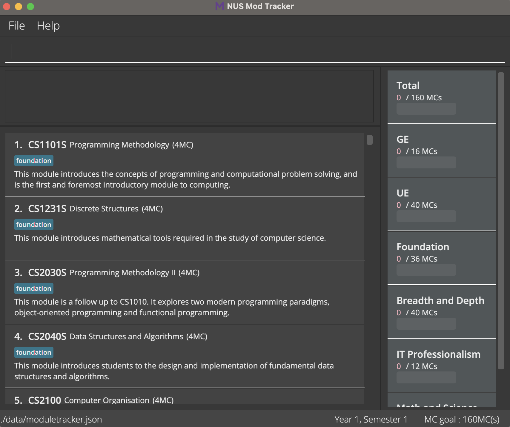
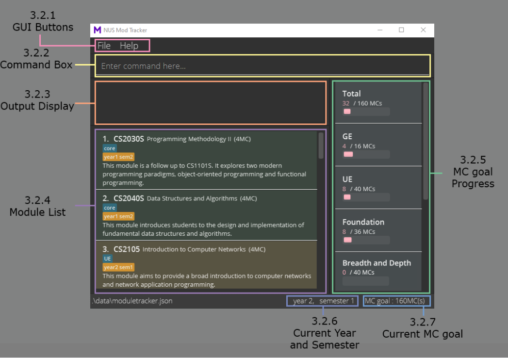
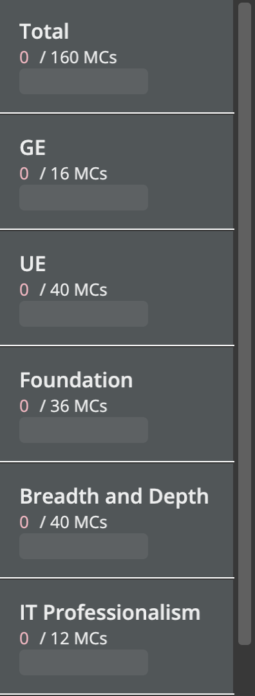
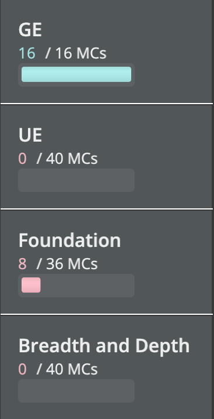
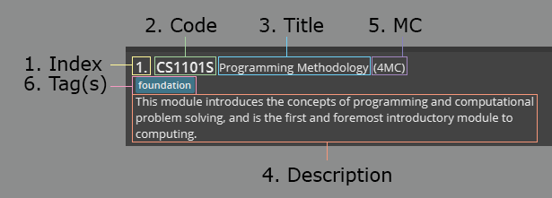
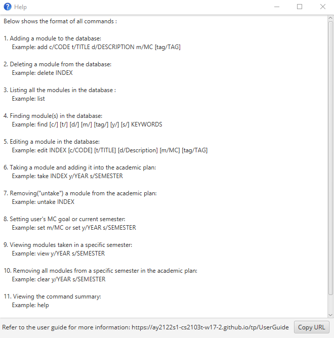

* Table of Contents
{:toc}

--------------------------------------------------------------------------------------------------------------------  
## 1. Introduction

NUS Mod Tracker is a **desktop app** designed for **NUS Computer Science (CS) students who are enrolled in the Academic Year 2021/2022 and onward** to **create their own academic plan**,
as well as to **keep track of their Modular Credits(MC) and modules taken**.
It is optimized for use via a Command Line Interface (CLI), while still having the benefits of a Graphical User
Interface (GUI).

For more information about our features, you can head over to our [Features](#4-features) section. Better yet, 
head over to our [Quick Start](#2-quick-start) and try it out for yourself!

### 1.1 Is this guide for you?

Are you someone who is trying our application for the very first time? If so, our guide is just the thing you need to get started on your journey to create your very own academic plan! 
Just simply read along and we will guide you step by step on how to use our application.

Are you someone who has maybe forgotten how some of our features work? Fret not, this user guide is also for you!
Simply head over to either our [Features](#4-features) section or our [Command Summary](#6-command-summary) section to solve your problems.

### 1.2 How to use the user guide 

We strongly recommend first time users of our application to read through the user guide in order to be familiarised with how our application works.
Throughout our user guide, we have included links which will direct you to the corresponding sections of the user guide. We have also added certain useful tips and tricks 
to help you get more out of our application. 
If you ever want to skip through any section of our user guide, do feel free to refer to use the table of contents at the top of our document to help you with the navigation.

--------------------------------------------------------------------------------------------------------------------

## 2. Quick start

This section gives you a quick summary on how to download and run our application.

1. Ensure you have Java `11` or above installed in your Computer.

1. Download the latest `modtracker.jar` from [here](https://github.com/AY2122S1-CS2103T-W17-2/tp/releases/tag/v1.3.1).

1. Copy the file to the folder you want to use as the _home folder_ for your Module Tracker.

1. Double-click the file to start the app. The GUI similar to the one below should appear in a few seconds. Note that the Module Tracker comes with some sample modules. 
   

1. If double-clicking does not work, trying launching our application through a terminal with the command `java -jar "modtracker.jar"`. 

:bulb:
If you are on Windows, use the DOS prompt or the PowerShell (not the WSL terminal) to run the JAR file.

6. Type the command in the command box and press Enter to execute it. e.g. typing **`help`** and pressing Enter will open the help window. 
   Some example commands you can try: 

   * **`list`** : Lists all modules.

   * **`add c/CS2103T t/Software Engineering d/Covers the main areas of software development m/4 tag/core`** : Adds a module named `CS2103T` to the Module Tracker.

   * **`delete`**`3` : Deletes the 3rd module from the database.

Kindly refer to the [Features](#4-features) below for more details of each command. 
Unsure of what some phrases or words mean? Head over to the [Command Terminology](#35-command-terminology) section to find out more.

--------------------------------------------------------------------------------------------------------------------

## 3. About

This section helps to familiarise you with how our application works as well as the terminologies we use throughout our application.

### 3.1 Special Icons

Here are some of the icons used in this user guide and what each of them represent.

**Tips**

Tips are useful information that can help you have a better experience with our application.

:bulb:
Tip: Tips are useful!

 

**Important Information**

Important Information are messages that are crucial for you to know in order to use our application smoothly.

:information_source:
Important Information: Remember the importance of this icon!

### 3.2 Application Homepage Explanation

Here is how our application's homepage works

#### 3.2.1 GUI Buttons
* Buttons have been placed at the top of our application to help you to exit the application and access the help function using your mouse.

#### 3.2.2 Command Box
* Here is the location for you to key in your inputs.

#### 3.2.3 Output Display
* Here is where our application will echo out your inputs entered.
* Results will also be displayed in this section when the appropriate commands have been inputted.

#### 3.2.4 Module List
* Here are the modules stored in our [database](#database).
* Do note that we have included some modules for you to test out our [features](#4-features).

#### 3.2.5 MC Goal Progress

Tracks and displays the number of MCs completed in total, and for each course requirement.  

The user's progress is displayed in the form of:
* The number of MCs completed for that category, over the number of required MCs.
* A progress bar filled according to the level of completion.

**Total MCs completed display:**

* Shows the total number of MCs taken, over the user's set MCs goal.
* The total number of MCs taken is calculated from all modules taken before the current semester.
    * For example: If the current semester is year 1 semester 2, the total number of MCs will be calculated
      from all modules taken in year 1 semester 1 only.

**Course requirements display:**

* Shows the total number of MCs taken for that requirement, over the number of MCs needed to satisfy the requirement.
* The total number of MCs taken for a requirement is calculated from modules taken before the current semester, which have been tagged with the specific tags.
    * For example: MCs for modules taken which are tagged with "ge" (`tag/ge`) will be counted into the total number of MCs taken for the GE requirement.
* Modules with the following tags will be used in calculating the MCs completed for the corresponding requirement:

Requirement | Tag (not case sensitive)
------------|-----------
GE | "ge"
UE | "ue"
Foundation | "foundation"
Breadth and Depth | "breadth and depth"
IT Professionalism | "it professionalism"
Math and Science | "math and science"

:information_source:
A module can have more than one tag, but the module will only be included in the calculation of MC requirements if it contains at least one of the tags mentioned above.

Notes:
* If the MC requirement has been satisfied, the completed MCs and progress bar will be coloured light blue. 
  
* If the MC requirement is not satisfied, the completed MCs and progress bar will be coloured pink. 

#### 3.2.6 Current Year and Semester
* Displays the current year and semester that the application is in.
* The current year and semester affects the colours of the [modules](#33-module-explanation) in your academic plan.
* The current year and semester also affects your [MC goal progress](#325-mc-goal-progress).
* You can use the [set](#423-setting-users-mc-goal-or-current-semester--set) command to update the current year and semester that the application is in.

#### 3.2.7 Current MC goal
* Displays your current [MC goal](#mcgoal).
* Your MC goal can be edited using the [set](#423-setting-users-mc-goal-or-current-semester--set) command.

### 3.3 Module Explanation
Here is an image of a module in our [database](#database) 

A module is made up of 6 **components**:
1. An index in the database
1. A module [code](#code) number
1. A [title](#title) 
1. A [description](#description) of the module
1. The number of [MC](#mc) that the module carries 
1. The [tag(s)](#tag) that the module can be classified under

A module can have 4 different colour codes:
* A grey coloured module represents a module that is in the database but not in your [academic plan](#academic-plan) 
  

* A green coloured module represents a module that is in your academic plan and you have taken the module previously 
  For example, if you are currently in Year 2 Semester 1, a module in Year 1 Semester 2 of your academic plan would look like this: 
  

* A red coloured module represents a module that is in your academic plan and you are planning to take the module in a future year or semester 
  For example, if you are currently in Year 1 Semester 1, a module in Year 1 Semester 2 of your academic plan would look like this: 
  

* A yellow coloured module represents a module that is in your academic plan and you are currently taking this module in this semester previously 
  For example, if you are currently in Year 1 Semester 2, a module in Year 1 Semester 2 of your academic plan would look like this: 
  

### 3.4 Command Format

**:information_source: Notes about the command format:** 

* Words in `lower_case` are the inputs to be followed while words in `UPPER_CASE` are the inputs to be entered by you. 
  e.g. when using our [add command](#411-adding-a-module-into-the-database--add)(`add m/MODULE`),
  you are supposed to type in`add m/` while `MODULE` is a parameter which is entered you(such as `add m/GEQ1000` or `add m/CS2030S`).

* Items in square brackets are optional. 
  e.g. `c/CODE [tag/TAG]` can be used as `c/CS2103T tag/core` or as `c/CS2103T`.
* If a parameter is expected only once in the command but you specified it multiple times, only the last occurrence of the parameter will be taken. 
  e.g. if you specify `m/2 m/4`, only `m/4` will be taken.

* Inputs for commands that do not take in parameters (such as `help`, `list`, `exit` and `clear`) will be ignored. 
  e.g. if the command specifies `help 123`, it will be interpreted as `help`.

### 3.5 Command Terminology

:bulb:
Tip: Do take a good look at this section to understand the common terminologies that we have used in our Features Section below!

 

#### `database`
* Refers to NUS Mod Tracker's database.
* Contains all the modules that is currently stored in the application locally.
* Modules in the database can be viewed in the [Module List](#324-module-list)

#### `academic plan`
* Refers to modules that you have assigned with a specific semester and year.
* Contributes to the calculation of the MC requirements. 
  

#### `INDEX`
* The `INDEX` refers to the index number of a module shown in the [database](#database).
* The `INDEX` **must be a positive integer** (1, 2, 3 ...). 
  
* For example, with the screenshot above, an `INDEX` of 1 would represent the Module CS2030S, and an `INDEX` of 2 would represent the Module CS2040S.

#### `CODE`
* Represents the `module`'s code component.
* `CODE` must follow the NUSMods module code format.
  * `CODE` should start with 2-3 capital letters, followed by 4 numerical digits, and end with 1-2 optional capital letters.
  * Valid Examples: CJ1101K, CH1001, NMB1234, UIS3911EL
  * Invalid Examples: CA300M, GEY10005, G1234M, GA1000MLC

#### `TITLE`
* Represents the `module`'s title component.
* Titles should not be more than 60 characters.

#### `DESCRIPTION`
* Represents the `module`'s description component.

#### `MC`
* Stands for Modular Credits.
* Represents the `module`'s MC component.
* `MC` must be a **positive integer** from 0-20.

#### `TAG`
* Represents the `module`'s tag component.
* Tags names should not be more than 30 characters.

#### `YEAR`
* Represents one of the following:
  1. Academic Year that the specified module is being taken in (for [take](#421-adding-a-module-to-the-academic-plan--take) command).
  1. Academic Year of the academic plan (for [set](#423-setting-users-mc-goal-or-current-semester--set), [view](#424-viewing-modules-taken-in-a-specific-semester--view) and [clear](#425-removing-all-modules-in-a-specific-semester-from-the-academic-plan--clear) commands).  
* The `YEAR` must be a positive integer from 1-6.

#### `SEMESTER`
* Represents one of the following:
  1. Semester that the specified module is being taken in (for [take](#421-adding-a-module-to-the-academic-plan--take) command).
  1. Semester of the academic plan (for [set](#423-setting-users-mc-goal-or-current-semester--set), [view](#424-viewing-modules-taken-in-a-specific-semester--view) and [clear](#425-removing-all-modules-in-a-specific-semester-from-the-academic-plan--clear) commands).
* The `SEMESTER` must be a positive integer from 1-4.
* Special semesters 1 and 2 are represented by integer values 3 and 4 respectively.

#### `MCGOAL`
* Represents the total number of MC you plan to take in your academic plan.
* `MCGOAL` must be a **positive integer** from 1-999.

--------------------------------------------------------------------------------------------------------------------

## 4. Features

This section gives you a detailed explanation on how each of our features work.

For an easy reference, we have decided to split our features into 3 different sub-categories:
* Database features
* Academic Plan features
* Miscellaneous features

The following sub-categories will explain the intended purpose for the set of features.

### 4.1 Database

[Database](#database) features consist of features that allows you to be able to make changes to modules that are in our database. 
Do note that these features do not directly affect the modules that are currently stored in your academic plan.
(we will explain how such features can **indirectly** affect the modules that are currently stored in your academic plan in the [FAQ](#5-faq) section)  

Such features include adding a new module into the database, removing a module from the database, as well as finding, editing, and listing modules that are in the database.

#### 4.1.1 Adding a module into the database : `add`

You can add a module to the database with our `add` command.

Format: `add c/CODE t/TITLE d/DESCRIPTION m/MC [tag/TAG]`

Parameters: [`CODE`](#code) [`TITLE`](#title) [`DESCRIPTION`](#description) [`MC`](#mc) [`TAG`](#tag)

Examples:
* `add c/CS2103 t/Software Engineering d/Covers the main areas of software development m/4 tag/core`
is equivalent to adding a Module with a code of `CS2103`, a title called `Software Engineering`, a description `Covers the main areas of software development`, consists of `4` MCs and a `core` tag to the database. 
  
#### 4.1.2 Deleting a module in the database : `delete`

You can delete a module from the database with our `delete` command.

Format: `delete INDEX`

Parameters: [`INDEX`](#index)

Example:
* `delete 2` is equivalent to deleting the 2nd module in the database.

#### 4.1.3 Listing modules stored in the database : `list`

You can view all modules in the database with our `list` command.

Format: `list`

#### 4.1.4 Finding a module in the database : `find`

You can search for specific module(s) in the database with our `find` command.

:information_source:
Do take note that the format is slightly different compared to the other features!

Format: `FORMAT: find [c/] [t/] [d/] [m/] [tag/] [y/] [s/] KEYWORDS`
* `KEYWORDS` refers to the words that the application will search the modules by.
* If no optional parameters are entered, the application will search within all [components](#33-module-explanation) of the modules
  for matching `KEYWORDS`.
* If optional parameters are entered, the application will search within the modules'
  specified components for matching `KEYWORDS`.

Optional Parameter | Component to search 
------------|-----------
c/ | [`CODE`](#code)
t/ | [`TITLE`](#title)
d/ | [`DESCRIPTION`](#description)
m/ | [`MC`](#mc)
tag/ | [`TAG`](#tag)
y/ | [`YEAR`](#year)
s/ | [`SEMESTER`](#semester)

Examples:
* `find CS`is equivalent to displaying any modules that contain the word "CS" in the code, title, description, MC, tag, year or semester.
* `find c/ t/ CS GE` is equivalent to displaying any modules that contain the words "CS" or "GE" in the code or title.
* `find c/ CS2040S` is equivalent to displaying any modules that contain the word "CS2040S" in the code.
* `find tag/ UE` is equivalent to displaying any modules that contain the word "UE" in the tag.

#### 4.1.5 Editing a module in the database : `edit`

You can edit and update an existing module's component(s) with our `edit` command.

Format: `edit INDEX [c/CODE] [t/TITLE] [d/DESCRIPTION] [m/MC] [tag/TAG]`

* At least one of the optional fields must be provided.
* The given value for the field(s) must be **different** from value that it is replacing.
* For values supplied to the `CODE` field, the value must **NOT** be identical with any other module's `CODE` field in the database.

Parameters: [`CODE`](#code) [`TITLE`](#title) [`DESCRIPTION`](#description) [`MC`](#mc) [`TAG`](#tag)

Examples:
* `edit 1 c/CS2103T t/Software Engineering` is equivalent to 
  editing the code of the 1st module in the database to be CS2103T, 
  as well as editing the title of the 1st module in the database to be Software Engineering respectively.
* `edit 3 m/2` is equivalent to editing the 3rd module in the database to have a MC of 2.

### 4.2 Academic Plan

[Academic Plan](#academic-plan) features consist of features that allows you to be able to create and customize your own academic plan.
Do note that these features are the ones that allows you to update and edit your academic plans
(such as the visual display of which modules you have taken, as well as the progress bar for each of the University's requirements).

Such features include taking/un-taking a module in a specific semester, viewing and setting the current semester or MC goal,
as well as viewing and clearing modules in a specific semester.

#### 4.2.1 Adding a module to the academic plan : `take`

You can take a module in the specified semester and add it into your academic plan with our `take` command.

Format: `take INDEX y/YEAR s/SEMESTER`

* If the specified module has already been scheduled, its schedule will be overridden.

Parameters: [`INDEX`](#index) [`YEAR`](#year) [`SEMESTER`](#semester) 

Example:
* `take 2 y/2 s/1` is equivalent to scheduling the 2nd module in the database for year 2 semester 1.
* `take 1 y/1 s/3` is equivalent to scheduling the 1st module in the database for year 1 special semester 1.
* `take 1 y/1 s/4` is equivalent to scheduling the 1st module in the database for year 1 special semester 2.

#### 4.2.2 Removing a module from the academic plan : `untake`

You can remove a module from your academic plan with our `untake` command.

Format: `untake INDEX`

* If the module has not been added to the academic plan, nothing happens.

Parameters: [`INDEX`](#index)

Example:
* `untake 1` is equivalent to removing the schedule from the 1st module in the database.

#### 4.2.3 Setting user's MC goal OR current semester : `set`

You can update your MC goal or current semester with our `set` command.

Format: `set m/MCGOAL` or `set y/YEAR s/SEMESTER`

Parameters: [`MCGOAL`](#mcgoal) [`YEAR`](#year) [`SEMESTER`](#semester)

Examples:
* `set m/160` - is equivalent to setting the MC goal to 160 credits
* `set y/2 s/1` - is equivalent to setting the current semester to year 2 semester 1
* `set y/3 s/3` - is equivalent to setting the current semester to year 3 special semester 1

#### 4.2.4 Viewing modules taken in a specific semester : `view`

You can view all the modules that you have taken in a specific semester with our `view` command.

Format: `view y/YEAR s/SEMESTER`

Parameters: [`YEAR`](#year) [`SEMESTER`](#semester)

Examples:
* `view y/2 s/1` - is equivalent to seeing all the modules taken in year 2 semester 1.
* `view y/2 s/3` - is equivalent to seeing all the modules taken in year 2 special semester 1.

#### 4.2.5 Removing all modules in a specific semester from the academic plan : `clear`

You can remove all modules from a specific semester in your academic plan with our `clear` command.

Format: `clear y/YEAR s/SEMESTER`

Parameters: [`YEAR`](#year) [`SEMESTER`](#semester)

Example:
* `clear y/1 s/1` is equivalent to removing all modules in year 1 semester 1 of the academic plan.

### 4.3 Miscellaneous

Miscellaneous features consist of features that does not directly affect the database nor the academic plan.

#### 4.3.1 Viewing help : `help`

You can view our command summary and get a link to our user guide(this documentation) with our `help` command.

Format: `help`

#### 4.3.2 Exiting the application : `exit`

You can exit our application with our `exit` command.

Format: `exit`

--------------------------------------------------------------------------------------------------------------------

## 5. FAQ

This section gives you the solutions to commonly asked questions.

**Q**: How do I transfer my data to another Computer? 
**A**: Install the app in the other computer and overwrite the empty data file it creates with the file that contains the data of your previous NUS Module Tracker home folder.

**Q**: If I have a module inside my academic plan and I delete the module from the database using the "delete" command, would the module still appear in my academic plan? 
**A**: No, deleting a module from the database removes the module from your academic plan.

**Q**: What should I do if there is a module that I want to add into my academic plan but it is not inside the database? 
**A**: First, add the module into the database using the [add](#411-adding-a-module-into-the-database--add) command. Then, you can add the module into your academic plan using the [take](#421-adding-a-module-to-the-academic-plan--take) command.

**Q**: Why is the module not included in the [MC Goal Progress](#325-mc-goal-progress) even though I have added it to my academic plan using the [take](#421-adding-a-module-to-the-academic-plan--take) command 
**A**: Make sure that the module has the appropriate tag. Also make sure that the module is colour coded in green as specified [here](#33-module-explanation). Do remember that our MC Goal Progress only takes into account the modules that you have taken.

**Q**: What should I do if I want to edit my data file directly?  
**A**: Your data is saved as a JSON file `[JAR file location]/data/moduletracker.json`, you may directly access the file to edit your data. 

:information_source:
Do note that if you edit your data file and NUS Mod Tracker deems it as an invalid data file, your data will be discarded and you will start with the default database modules.

--------------------------------------------------------------------------------------------------------------------

## 6. Command summary

This section gives you a summary on how to use each of the features.

Database Commands | Format, Examples
--------|------------------
**Add** | `add c/CODE t/TITLE d/DESCRIPTION m/MC [tag/TAG]`   e.g. `add c/ST2334 t/Probability and Statistics d/Introduces students to basic probability theory and statistical inference m/4`
**Delete** | `delete INDEX`  e.g. `delete 3`
**List** | `list`
**Find** | `find [c/] [t/] [d/] [m/] [tag/] [y/] [s/] KEYWORDS`   e.g. `find c/ CS2040S`
**Edit** | `edit INDEX [c/CODE] [t/TITLE] [d/DESCRIPTION] [m/MC] [tag/TAG]`   e.g `edit 2 c/CS2103T t/Software Engineering`

Academic Plan Commands | Format, Examples
--------|------------------
**Take** | `take INDEX y/YEAR s/SEMESTER`   e.g. `take 2 y/2 s/1`
**Untake** | `untake INDEX`   e.g. `untake 1`
**Set**| `set m/MC` or `set y/YEAR s/SEMESTER`   e.g. `set m/120` `set y/2 s/1`
**View**| `view y/YEAR s/SEMESTER`   e.g. `view y/2 s/1`
**Clear** | `clear y/YEAR s/SEMESTER`   e.g. `clear y/1 s/1`

Miscellaneous Command | Format, Examples
--------|------------------
**Help**| `help`
**Exit**| `exit`

