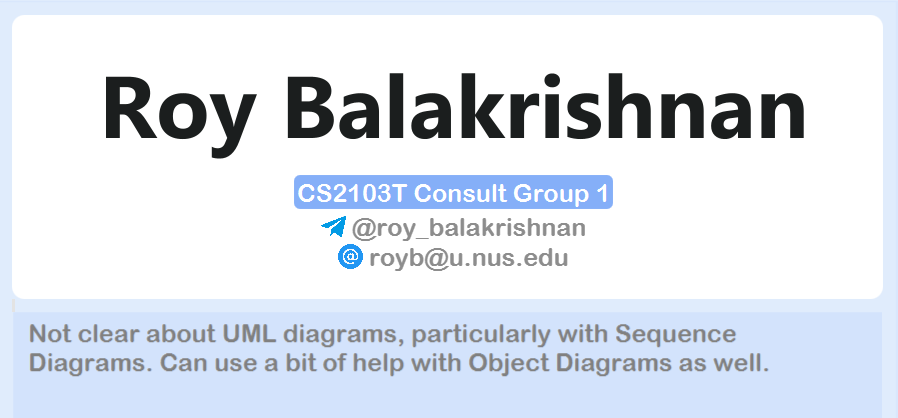

Welcome to the CSBook User Guide. **CSBook is a desktop app for teaching assistants (TAs) to manage their students, optimized for use via a Command Line Interface** (CLI) while still having the benefits of a Graphical User Interface (GUI). If you are faster at typing, CSBook can get your student management tasks done faster than traditional GUI applications.

**CSBook aims to help lessen your workload** of having to create separate spreadsheets or notes to track your students' academic progress. With CSBook, **your students may be organised in a more intuitive manner in custom groups** and **track them and their academic progress in assignments more efficiently**, saving time and letting you get back to your students quicker.

If this is your first time using CSBook, we recommend that you first look at the [How to use](#how-to-use)
section of the user guide.

## Table of Contents

* Table of Contents
{:toc}

--------------------------------------------------------------------------------------------------------------------

## How to use

This user guide will bring you through **how to quickly start using our application through the [Quick Start](#quick-start) section**, while also serving as a **reference to more experienced users in the [Feature List](#feature-list) section**, where notes and tips on how best to make use of our application will also be given.

**If you face any difficulty while following the user guide, do refer to the [FAQ section](#faq)** to see if your issue has been addressed there. If the solution provided or your query has yet to be answered in the FAQ section, feel free to reach out to our team lead, Erin Ong, at [e0559779@u.nus.edu](mailto:e0559779@u.nus.edu) through email.

--------------------------------------------------------------------------------------------------------------------

## Quick start

1. Ensure you have Java `11` or above installed in your Computer (See also: [FAQ](#faq)).

2. Download the latest `csbook.jar` from [here](https://github.com/AY2122S1-CS2103T-T09-3/tp/releases).

3. Copy the file to the folder you want to use as the _home folder_ for CSBook.

4. Double-click the file to start the app. The GUI similar to the below should appear in a few seconds. Note how the app contains some sample data.  
   

5. Type the command in the command box and press Enter to execute it. e.g. typing **`help`** and pressing Enter will open the help window.  
   Some example commands you can try:

    * **`list`** : Lists all students currently stored.

    * **`addgroup`** `g/CS2100 d/Computer Organisation` : Adds a group named `CS2100` with the description `Computer Organisation` to CSBook

    * **`add`** `n/Jia Xian t/@albino_monkii e/albinomonkey@gmail.com g/CS2101` : Adds a student named `Jia Xian` to CSBook. The student has the following details:
        * Telegram Handle: `@albino_monkii`
        * Email: `albinomonkey@gmail.com`
        * Group: `CS2101`

    * **`delete`** `3` : Deletes the 3rd student shown in the current list.

    * **`clear`** : Deletes all students and groups.

    * **`exit`** : Exits the app.

6. Refer to the [Feature list](#feature-list) below for the full details of each command.

--------------------------------------------------------------------------------------------------------------------

## Glossary of terms

Term | Definition
--------|------------------
**Command-Line Interface (CLI)** |An interface that accepts and parses text input from the user in order to execute some command.
**Graphical User Interface (GUI)** |A visual interface that allows the user to interact with the program through graphical icons and buttons.
**Group**|Any user-defined grouping in CSBook. They may indicate that students belonging to the group are from a certain module, tutorial, remedial or require additional help for example.
**Java** |The programming language used to create CSBook. It may also refer to the Java Runtime Environment, which allows Java applications like CSBook to be run.
**Module**|A unit of study that makes up a part of a course taught in university.
**Operating System (OS)** |The system software that is running on the computer. E.g. Microsoft Windows, macOS, Linux.
**Student**|A student in any module that a TA is teaching.
**Terminal window**|A simple CLI-based program that allows the user to run some system commands.
**Teaching Assistant (TA)**|A student teacher that has been hired to assist in teaching a tutorial/lab session for a module.

## Glossary of icons

These icons will appear within coloured boxes to indicate

&nbsp; &nbsp; &nbsp; Icon &nbsp; &nbsp; &nbsp; | Meaning | Box colour
------------|------------------|----
 :information_source:**Note** |This icon serves to give an additional note or remark about the current feature|Blue
 :bulb:**Tip** |This icon serves to give a quick recommendation about how to use the feature in the most beneficial way|Blue
 :exclamation:**Caution** |This icon serves to give a note on behaviour of the application that could be unexpected to you|Yellow
 :warning:**Warning** |This icon serves to warn against using a feature in some unintended manner| Yellow

## Feature List

**:information_source: Notes about the command format:** 

* Words in `UPPER_CASE` are the parameters to be supplied by the user. 
  e.g. in `add n/NAME`, `NAME` is a parameter which can be used as `add n/Jun Wei`.

* Parameters can be in any order. 
  e.g. if the command specifies `n/NAME t/TELEGRAM_HANDLE`, `t/TELEGRAM_HANDLE n/NAME` is also acceptable.

* Optional parameters/fields will be indicated within square brackets.
  e.g. if the command specifies `edit INDEX [n/NAME] [t/TELEGRAM_HANDLE] [e/EMAIL] [g/GROUP_NAME]`, `edit 1 n/Jiaxian` or `edit 1 n/Jiaxian t/@albino_monkey e/e0540014X@u.nus.edu g/CS2103T` are both acceptable commands

* For parameters that expect a number value, such as `INDEX` of a student or `SCORE` for assessments, CSBook will have unexpected behaviours if too large of a number is given. The reason being is that CSBook was designed to manage at most a few thousand students, and it is not realistic for an assessment to have the total number of marks above a couple of hundreds either.

* If a parameter is expected only once in the command but if you specified it multiple times, only the last occurrence of the parameter will be taken. 
  e.g. if you specify `t/@albino_monkii t/@albino_api`, only `t/@albino_api` will be taken.

* Extraneous parameters for commands that do not take in parameters (such as `help`, `list`, `exit` and `clear`) will be ignored. 
  e.g. if the command specifies `help 123`, it will be interpreted as `help`.

--------------------------------------------------------------------------------------------------------------------

### General features

:information_source: **Note**: Listed in this section are general features and commands to use and manage CSBook.

#### Viewing help : `help`

Displays a pop-up message explaining how to access the user guide as shown below:

Format: `help`

#### Clearing all entries : `clear`

Clears all students, groups and their associated data from CSBook

Format: `clear`

#### Encrypting the data file: `encrypt`

Encrypts the CSBook data file into a non-human-readable format to protect the data from access by undesirable parties.

Format: `encrypt`

#### Decrypting the data file: `decrypt`

Decrypts the CSBook data file back into a human-readable format from its previously encrypted state.

Format: `decrypt`

#### Exiting the program : `exit`

Exits the program.

Format: `exit`

#### Saving the data

CSBook data are saved in the hard disk automatically after any command that changes the data. There is no need to save manually. The data is decrypted by default, but you may encrypt them using the `encrypt` command listed above.

#### Editing the data file

CSBook data are saved as an JSON file at `[JAR file location]/data/csbook`. Advanced users are welcome to update data directly by editing that data file.

Note that if the encrypt function is turned on, the data will be saved in an encrypted JSON format. In which case, users are highly advised to decrypt the data file first through the `decrypt` command before editing the data file directly.

:exclamation: **Caution:**
If there are changes to the data file that makes its format invalid, CSBook will discard all data and start with an empty data file on the next run.  

:warning: **Warning**: Do not intentionally change the data file in order to restart CSBook afresh with an empty data file. You should use the `clear` command instead if you want to clear all currently stored data.

### Student management features

:information_source: **Note**: Listed in this section are all the features and commands related to managing and tracking student information in CSBook. Stored student information helps you keep track of all the information related to each of your students in one collated entry.

#### Adding a student: `add`

Adds a student to the CSBook.

Format: `add n/NAME t/TELEGRAM_HANDLE e/EMAIL g/GROUP_NAME`

* Adds a new student into CSBook.
* The group name must correspond to that of a group that has been added to CSBook before the student is created. Each student **MUST** belong to a group.
* Each student can only belong to one group.
* `NAME` is case-sensitive and must be unique. Thus, it is possible to have two students named `John` and `john`, but it is not possible to have two students named `Alfred` and `Alfred`
* The `EMAIL` used can be any email; it need not be an NUS email.

:information_source: **Note on groups**: Refer to the "Group management features" section for more details on how you may use groups to enhance the way you track students.

Examples:
* `add n/Jia Xian t/@albino_monkii e/albinomonkey@u.nus.edu g/CS2103T`
* `add n/Jun Wei t/@albino_api e/albinoape@u.nus.edu g/CS2101`

Result of `add n/Jun Wei t/@albino_api e/albinoape@u.nus.edu g/CS2101`:
  

#### Listing all students : `list`

Shows a list of all students in the CSBook.

* A student will be coloured red if their latest assessment fall below the passing threshold of 50%.

Format: `list`

#### Editing a student : `edit`

Edits an existing student in the CSBook.

Format: `edit INDEX [n/NAME] [t/TELEGRAM_HANDLE] [e/EMAIL]`

* Edits the student at the specified INDEX. The index refers to the index number shown in the displayed student list. The index **must be a positive integer** 1, 2, 3, …​
* At least one of the optional fields must be provided.
* Existing values will be updated to the input values.

Examples:

*  `edit 1 t/@albino_monkey e/e0540014X@u.nus.edu` Edits the telegram handle and email address of the 1st student to be `@albino_monkey` and `e0540014X@u.nus.edu` respectively.
*  `edit 2 n/bernice` Edits the name of the 2nd student to be `bernice`.

#### Finding students by name: `find`

Finds students whose names contain any of the given keywords.

Format: `find KEYWORD [MORE_KEYWORDS]`

* The search is **case-insensitive**. e.g `roy` will match with `Roy`.
* The order of the keywords does not matter. e.g. `Alex Bernice` will match `Bernice Alex`.
* Only the name of the student is matched against the keywords.
* Only full words will be matched e.g. `Davi` will not match `David`.
* If several keywords were given, students matching at least one keyword will be returned.
  e.g. `Alex Bernice` will return `Alex Yeoh`, `Bernice Yu`.

Examples:
* `find oliveiro` returns `Charlotte Oliveiro` and `Edgar Oliveiro`
* `find alex david` returns `Alex Yeoh`, `David Li` 

Result of `find alex david`:
  

#### View student: `viewstudent`

Views an existing student in the CSBook.

Format: `viewstudent NAME`

* The search is **case-sensitive**. e.g. `david` will not match `David`
* The full name of the student must be matched. e.g. `Alex` will not match `Alex Yeoh`
* The student's details shown includes their full name, group, telegram handle, email, notes and assessments.
* Individual assessments are coloured red if they fall below the passing threshold of 50%.
* To go back to the main page with the list of students, use the `list` command.

Examples:
* `viewstudent David Li` returns `David Li`
* `viewstudent Irfan Ibrahim` returns `Irfan Ibrahim` 

Result of `viewstudent Irfan Ibrahim`:
  

#### Adding an assessment: `addassessment`

Adds an assessment for a student.

Format: `addassessment INDEX a/ASSESSMENT_NAME s/SCORE`

* Adds a new assessment to the student at the specified `INDEX`
* The index refers to the index number shown in the displayed student list.
* The index must be a **positive integer** 1, 2, 3, …​
* The assessment name must be unique in the student's assessment list.
* The assessment name should only contain alphanumeric characters and spaces, and it should not be blank
* The score consists of two components: an *actual score* and a *total score*.
  * The *actual score* should be an integer greater than or equal to 0
  + The *total score* should be an integer greater than 0.
  + The *actual score* should be less than or equal to the *total score*.

Examples:
* `addassessment 1 a/Finals s/13/30`
* `addassessment 6 a/Participation s/3/5` 

Result of `addassessment 6 a/Participation s/3/5`:
  

#### Deleting an assessment: `deleteassessment`

Deletes an assessment from a student.

Format: `deleteassessment INDEX a/ASSESSMENT_NAME`

* Deletes an assessment from the student at the specified `INDEX`
* The index refers to the index number shown in the displayed student list.
* The index must be a **positive integer** 1, 2, 3, …​
* The assessment name must be found in the student's assessment list. The search is **case-sensitive**. e.g. `Midterms` will not match `midterms`.
* The assessment name should only contain alphanumeric characters and spaces, and it should not be blank

Examples:
* `deleteassessment 1 a/Midterms`
* `deleteassessment 5 a/Participation`

#### Adding a note: `note`

Sets the note of the student to the given input.

Format: `note n/NAME no/NOTE`

* If a note exists, it will be overwritten with the new note.
* An existing note can be cleared by having an empty `NOTE` parameter. i.e., `note n/NAME no/`

Examples:
* `note n/Charlotte Oliveiro no/Great with presentations` will replace the existing note `Very convincing presentations` with `Great with presentations`
* `note n/Roy Balakrishnan no/Not clear about UML diagrams, particularly with Sequence Diagrams. Can use a bit of help with Object Diagrams as well.` will add a note `Not clear about UML diagrams, particularly with Sequence Diagrams. Can use a bit of help with Object Diagrams as well.` 

Result of the above `note n/Roy Balakrishnan no/Not clear about...`:
  

#### Deleting a student : `delete`

Deletes the specified student from CSBook.

Format: `delete INDEX`

* Deletes the student at the specified `INDEX` and removes the student from their assigned group.
* The index refers to the index number shown in the displayed student list.
* The index must be a **positive integer** 1, 2, 3, …​

Examples:
* `list` followed by `delete 2` deletes the 2nd student in CSBook.
* `find alex david` followed by `delete 1` deletes the 1st student in the results of the `find` command.

### Group management features

:information_source: **Note**: Listed in this section are all the features and commands related to
managing groups that students can be assigned to in CSBook. Groups allow you to put students
that match some similar criteria into the same category for easier lookup and management of students. 

:bulb: **Use cases**: You may use groups in any way that best suits your needs! You may split students by
module/tutorial group if you're teaching more than one module/class. You may also divide students within the
same class into consultation groups to better focus your needs on certain students.

#### Creating a group: `addgroup`

Creates a group with the given group name and given description so that students can be added into it.

Format: `addgroup g/GROUPNAME d/DESCRIPTION`

* Creates a group with the specified `GROUPNAME` and `DESCRIPTION`.

Examples:
* `addgroup g/CS2100 d/Computer Organisation` creates a group called `CS2100` and the description `Computer Organisation`
that students can be added into. 

  Result of `addgroup g/CS2100 d/Computer Organisation`:
  

#### Viewing students of a group: `viewgroup`

Views the students in a group.

Format: `viewgroup g/GROUPNAME`

Examples:
* `viewgroup g/CS2103T` displays the students in `CS2103T`.

Result of `viewgroup g/CS2103T`:
  

#### Changing the group of a student: `changegroup`

Changes the group which the given student belongs in to the given group.

Format: `changegroup n/NAME g/GROUPNAME`

* The student with the specified `NAME` has their group changed to the group with the specified `GROUPNAME`.

Examples:
* `changegroup n/David Li g/CS2103T Consult Group 1` changes the group that `David Li` belongs in to `CS2103T Consult Group 1`.

#### Deleting a group: `deletegroup`

Deletes the group with the specified group name as well as all students associated with the group.

Format: `deletegroup g/GROUPNAME`

* Deletes the group with the specified `GROUPNAME` as well as all students associated with the group.

Examples:
* `deletegroup g/CS2103T` deletes the group `CS2103T` along with all students that are in the group.

## Command summary

Action | Format, Examples
--------|------------------
**Help** | `help`
**Clear** | `clear`
**Encrypt** | `encrypt`
**Decrypt** | `decrypt`
**Exit** | `exit`
**Add Student** | `add n/NAME t/TELEGRAM_HANDLE e/EMAIL g/GROUPNAME`   e.g., `add n/Jia Xian t/@albino_monkii e/albinomonkey@u.nus.edu g/CS2103T`
**List Students** | `list`
**Edit Student** | `edit INDEX [n/NAME] [t/TELEGRAM_HANDLE] [e/EMAIL]`  e.g.,`edit 1 t/@albino_monkey e/e0540014X@u.nus.edu`
**Find Students** | `find KEYWORD [MORE_KEYWORDS]`  e.g., `find oliveiro`
**View Student** | `viewstudent NAME`  e.g., `viewstudent David Li`
**Add Assessment** | `addassessment INDEX a/ASSESSMENT_NAME S/SCORE`  e.g., `addassessment 1 a/Midterms s/60/100`
**Delete Assessment** | `deleteassessment INDEX a/ASSESSMENT_NAME`  e.g., `deleteassessment 1 a/Midterms`
**Add Notes** | `note n/NAME no/NOTE`  e.g., `note n/Charlotte Oliveiro no/Great with presentations`
**Delete Student** | `delete INDEX`  e.g., `delete 3`
**Add Group** | `addgroup g/GROUPNAME d/DESCRIPTION`  e.g., `addgroup g/CS2100 d/Computer Organisation`
**View Group** | `viewgroup g/GROUPNAME`  e.g., `viewgroup g/CS2103T`
**Change Group** | `changegroup n/NAME g/GROUPNAME`  e.g., `changegroup n/David Li g/CS2103T Consult Group 1`
**Delete Group** | `deletegroup g/GROUPNAME`  e.g., `deletegroup g/CS2103T`

## FAQ

1. How do I check that I have Java `11` or above installed on my computer?
    * You may run the `java -version` command on your respective operating system's (OS) terminal window.
    * Alternatively, if the above does not work, you may follow [this guide](https://www.java.com/en/download/help/version_manual.html) to determine the version of Java installed on your Computer
    * Note: Either versions of Java released by [Oracle](https://www.oracle.com/java/) or [OpenJDK](https://openjdk.java.net/) are compatible
