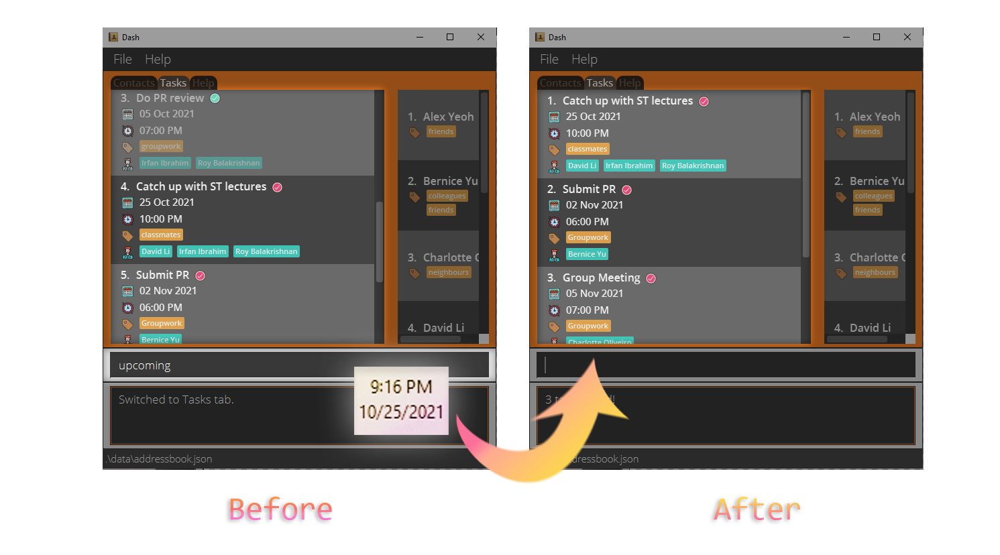

Dash is a personal planner app which offers unparalleled speed using text-based input. It supports both management of
tasks and contacts. Dash is tailored to the needs of university students, who must keep track of a slew of different 
deadlines, commitments, and contacts. So long as you're a fast typist, Dash provides a blisteringly quick way to stay 
on top of your responsibilities.

This guide was written to help you set up and start using Dash. You can navigate by clicking the table of 
contents [below](#table-of-contents). If you're a new user, the Quick Start guide has all you need to get started. If 
you're an intermediate user looking to get more out of Dash, all supported commands are listed below.

--------------------------------------------------------------------------------------------------------------------

## Table of Contents

* Table of Contents
{:toc}

--------------------------------------------------------------------------------------------------------------------

## <u>Setting up Dash</u>

Whether you're using Windows or macOS, the steps for installation are the same.

1. Ensure you have Java `11` or above installed in your Computer. 
   [Not sure what Java is? Click here!](https://java.com/en/download/help/download_options.html).

2. Download the latest `dash.jar` from [this website](https://github.com/AY2122S1-CS2103T-W15-2/tp/releases/tag/v1.3.1).

3. Copy the file to the folder you want to use as the _home folder_ for Dash, which is where your data is stored.
   -  _We suggest creating a folder called "Dash" and putting the `dash.jar` file inside it. You can place this folder 
      wherever you want. Next, we recommend that you create a shortcut for Dash by right-clicking on the `dash.jar` 
      file. On Windows, click on the `Create Shortcut` option while on macOS, click on `Make Alias`. You can then put 
      this shortcut in a convenient place (such as your Desktop) for easy access._

4. Double-click the file to start the app. Here's what you should see in a few seconds: 
   
   
5. That's all you need to do for the setup. To get started writing commands, refer to the Getting Started section 
   [below](#getting-started).

--------------------------------------------------------------------------------------------------------------------
## <u>How to use this User Guide</u>

* Go to the [Getting Started](#getting-started) section for an overview of Dash.
* If you want to dive straight into features, you can check out our [Features](#features) section.
* For a quick recap of the commands, you can take a look at our [Command Summary](#command-summary) section.

   
**Here is the meaning of some icons used in the guide:** 

:information_source: Extra information about the specific section.

:warning: Important information to help you avoid errors.

:bulb: Tips to help you get the most out of Dash.
   

--------------------------------------------------------------------------------------------------------------------
   
## <u>Getting Started</u>

Dash supports contact and task management in several ways. 
In terms of contact management, Dash allows you to add contacts and fill in details such as their 
phone number, address, and email. 
It even allows you to group them using tags such as "Neighbour" or "Colleague", so you can look them up more easily. 
For task management, Dash allows you to add tasks, tag them, and set deadlines for them. 
Once you're done with a task, you can mark it as complete.

Dash uses a tab system to keep your contacts and tasks separate. 
To view and edit your contact list, you must switch to the contacts tab. 
Similarly, to view and edit your task list, you must switch to the tasks tab. 
Finally, the help tab provides you with a quick summary of Dash's features and how to use them.

Dash uses a Command Line Interface (CLI) to optimize speed. This means that you use mostly your keyboard to interact 
with Dash, instead of relying on your mouse to click on options. For example, you can switch tabs by typing in a 
command; you cannot do so by clicking the tab.

Type the command in the command box and press Enter to execute it. e.g. typing **`help`** and pressing Enter will open 
the help window.

Some example commands you can try:

* **`contacts`** : Switches to the contacts tab

* **`tasks`** : Switches to the tasks tab

* **`add n/Joe`** : Adds a contact named Joe.

* **`clear`** : Deletes all contacts.

* **`exit`** : Exits the app.

:bulb: You can press the up and down arrow keys in the command box to retrieve your 10 previous commands. This can save 
you a lot of time!

Refer to the [Features](#features) below for details of each command.

--------------------------------------------------------------------------------------------------------------------

## <u>Features</u>

**:information_source: Notes about the command format:** 

* Command words (like `add`, `find`, `help`, etc.) are always lowercase and are case-sensitive.
  e.g. `Help` will not be understood by Dash, but `help` will. 

* Words in `UPPER_CASE` are the parameters to be supplied by the user. 
  e.g. in `add n/NAME`, `NAME` is a parameter which can be used as `add n/John Doe`.

* Items in square brackets are optional. 
  e.g. `n/NAME [t/TAG]` can be used as `n/John Doe t/friend` or as `n/John Doe`.

* Items with `…` after them can be used more than once. 
  e.g. `p/PERSON_INDEX…` can be used as `p/1`, `p/1 p/3`, `p/4 p/5 p/2` etc. 
  e.g. `[t/TAG]…` can be used as ` ` (i.e. 0 times, because of the square brackets), `t/friend`, `t/friend t/family` 
  etc.

* Parameters can be in any order. 
  e.g. if the command specifies `n/NAME p/PHONE_NUMBER`, `p/PHONE_NUMBER n/NAME` is also acceptable.

* If a parameter is expected only once in the command, but you specified it multiple times, only the last occurrence of 
  the parameter will be taken. 
  e.g. if you specify `p/12341234 p/56785678`, only `p/56785678` will be taken.

* Extraneous parameters for commands that do not take in parameters (such as `help`, `contacts`, `tasks` and `clear`) 
  will be ignored. 
  e.g. if the command specifies `help 123`, it will be interpreted as `help`.
  
* Here is the meaning of some icons used in this section:

:orange_book: Brief description of what the command does.

:camera: Explanation of included screenshots.

:page_with_curl: Format of the command. Refer to the [command format notes](#command-format-info) above for more 
information.

:scroll: Notes on the command behavior, with relevant examples.

### <u>General</u>

#### Switch Tabs: `contacts` or `tasks` or `help`

:orange_book: If you want to switch to a certain tab, you can do that by typing out the tab name.

:page_with_curl: Format: `contacts` or `tasks` or `help`

Alternatively, you can switch tabs using shortcuts to save time:

:page_with_curl: Format: `c` or `t` or `h`

--------------------------------------------------------------------------------------------------------------------

#### Exiting the program: `exit`

:orange_book: If you want to close the window and exit the program, you can use the _Exit_ command.

:page_with_curl: Format: `exit`

:bulb: You can exit the app at any time by using the exit command or by closing the window. Your progress will always
be saved.

--------------------------------------------------------------------------------------------------------------------

### <u>Contacts</u>

**:warning: Command behaviour:**
Make sure you switch to the Contacts tab before using these commands! They will not work otherwise.

#### Adding a contact: `add`

:orange_book: If you want to add a person to the contact list, you can use the _Add_ command. Only the contact's name 
is compulsory during creation. 

:camera: The above screenshot shows how you can use the _Add_ command to add a person with the following details to 
your contact list:

* Name: _Mitski Miyawaki_
* Phone number: _91288841_
* Email address: _mitski@example.com_
* Address: _1 Hougang Street 91, #01-41_
* Tag(s): _friend_

:page_with_curl: Format: `add n/NAME [p/PHONE_NUMBER] [e/EMAIL] [a/ADDRESS] [t/TAG]...`

**:information_source: Name limitations:** 
Names must be unique, and should be no longer than 30 characters.

--------------------------------------------------------------------------------------------------------------------

#### Editing contact details: `edit`

:orange_book: If you want to modify the details of a specific contact, you can use the _Edit_ command.

:camera: The above screenshot shows how the _Edit_ command can be used to edit the phone number and email of a contact.

:page_with_curl: Format: `edit INDEX [n/NAME] [p/PHONE_NUMBER] [e/EMAIL] [a/ADDRESS] [t/TAG]...`

:scroll: Notes:

* At least one of the optional fields must be provided.
* Edits the contact at the specified `INDEX`.
  * The `INDEX` refers to the position of the contact in the displayed contact list as indicated by the number next to 
  their name.
  * The `INDEX` must be a positive integer (1, 2, 3,...).
* Existing values will be updated to the input values.
* When editing tags, the existing tags of the contact will be removed i.e. adding of tags is not cumulative.
  * To add tags without removing existing tags, refer to the Tag command in the [next section](#tagging-a-contact-tag).

**:information_source: Name limitations:** 
Names must be unique, and should be no longer than 30 characters.

  

:bulb: You can remove all tags from a contact by typing `edit INDEX t/`.

--------------------------------------------------------------------------------------------------------------------
#### Tagging a contact: `tag`

:orange_book: If you want to add new tags to a contact without replacing the old ones, you can use the _Tag_ command.

:camera: The above screenshot shows how the _Tag_ command can be used to tag a contact with the tag "groupmate".

:page_with_curl: Format: `tag INDEX t/TAG...`

:scroll: Notes:

* At least one tag must be provided.

**:information_source: Tag limitations:** 
Tags should be no longer than 15 characters.

--------------------------------------------------------------------------------------------------------------------

#### Deleting a contact: `delete`

:orange_book: If you want to delete a contact, you can use the _Delete_ command.

:page_with_curl: Format: `delete INDEX`

:scroll: Notes:

* Deletes the person at the specified `INDEX`.
  * The `INDEX` refers to the position of the contact in the displayed contact list as indicated by the number next to
    their name.
  * The `INDEX` must be a positive integer (1, 2, 3,...).

--------------------------------------------------------------------------------------------------------------------

#### Finding all contacts matching given details: `find`

:orange_book: If you want to filter your contacts by tags, names, or any other details, you can use the _Find_ command.

:camera: The above screenshot shows how the _Find_ command can be used to search for all contacts who are tagged as 
"friends".

:page_with_curl: Format: `find [n/NAME] [p/PHONE_NUMBER] [e/EMAIL] [a/ADDRESS] [t/TAG]...`

:scroll: Notes:

* At least one of the optional fields must be provided.
* The search is case-insensitive. e.g. `find e/hans@gmail.com` will match `Hans@gmail.com`.
* The order of the keywords does not matter. e.g. `find a/tampines 111` will match `Blk 111 Tampines Street 11, #02-345`.
* Contacts matching all keywords will be returned (i.e. AND search). 
  * e.g. `find n/Hans Bo` will return only `Hans Bo` and `Hans Bo the Second`. It will not return `Hans Gruber` or
    `Bo Yang`.
  * e.g. `find p/86235343 t/CS2101` will return only contacts who have both the phone number `86235343` AND the tag 
    `CS2101`. It will not return contacts with different phone numbers, even if they both have the tag `CS2101`.

:bulb: For added convenience, you can find contacts by their names by typing just `find NAME` without the prefix `n/`.

--------------------------------------------------------------------------------------------------------------------

#### Listing all contacts: `list`

:orange_book: After you’ve filtered your contacts using 
[the _Find_ command](#finding-all-contacts-matching-given-details-find), if you want to view all of them again, you can 
use the List command.

:page_with_curl: Format: `list`

--------------------------------------------------------------------------------------------------------------------

#### Clearing all contacts: `clear`

:orange_book: If you want to delete all of your contacts, you can use the _Clear_ command.

:page_with_curl: Format: `clear`

**:warning: Clearing all contacts:** 
This command is **irreversible** and your contact list will be **permanently** deleted.  

--------------------------------------------------------------------------------------------------------------------

### <u>Tasks</u>

**:warning: Command behaviour:**
Make sure you switch to the Tasks tab before using these commands! They will not work otherwise.

**:information_source: Notes on the Contacts panel:**
On the Tasks tab, there is a Contacts panel on the right that shows a simplified view of your Contacts tab. If you 
filtered your contacts by using the _Find_ command before switching to the Tasks tab, the Contacts panel shows the same 
filtered contact list. In this way, if you have a lot of contacts, you can maintain a focused view of the current people
of interest and more easily assign them to tasks.

#### Adding a task: `add`

:orange_book: If you want to add a task to the task list, you can use the _Add_ command. Only task's description is 
compulsory during creation. 

:camera: The above screenshot shows how you can use the _Add_ command to add a task with the following details to your 
task list:

* Description: _Submit PR_
* Date and Time: _1 Nov 2021, 5:00 PM_
* Tag(s): _Groupwork_
* Assigned Person(s): _Alex Yeoh_

:page_with_curl: Format: `add d/DESCRIPTION [dt/DATE] [dt/TIME] [dt/DATE, TIME] [p/PERSON_INDEX]... [t/TAG]...`

:scroll: Notes:

* An explanation of how Date and Time formats work can be found 
  [here](#date-time-info).
* If you want to assign people to the task, the people to be assigned to the task (assignees) are specified with
  `PERSON_INDEX`.  
  * You can assign multiple people to the same task at once.
  * The `PERSON_INDEX` refers to the position of the person in the
    [Contacts panel](#tasks-info) as indicated by the number next to their name.
  * Any specified `PERSON_INDEX` must be a positive integer (1, 2, 3,...).

--------------------------------------------------------------------------------------------------------------------

#### Editing task details: `edit`

:orange_book: If you want to modify the details of a specific task, you can use the _Edit_ command.

:camera: The above screenshot shows how the _Edit_ command can be used to edit the Date, Time and assignee of a task.

:page_with_curl: Format: `edit INDEX [d/DESCRIPTION] [dt/DATE] [dt/TIME] [dt/DATE, TIME] [p/PERSON_INDEX]... [t/TAG]...`

:scroll: Notes:

* At least one of the optional fields must be provided.
* Edits the task at the specified `INDEX`.
  * The `INDEX` refers to the position of the task in the displayed task list as indicated by the number next to 
  its description.
  * The `INDEX` must be a positive integer (1, 2, 3,...).
* Existing values will be updated to the input values.
* When editing tags, the existing tags of the contact will be removed i.e. adding of tags is not cumulative.
  * To add tags without removing existing tags, refer to the Tag command in the [next section](#tagging-a-task-tag).
* An explanation of how Date and Time formats work can be found 
  [here](#date-time-info).
* If you want to modify the assignees of the task, new assignees are specified with `PERSON_INDEX`.
  * You can assign multiple people to the same task at once.
  * The `PERSON_INDEX` refers to the position of the person in the 
    [Contacts panel](#contacts-panel-info) as indicated by the number next to their name.
  * Any specified `PERSON_INDEX` must be a positive integer (1, 2, 3,...).

:bulb: You can remove all tags from a task by typing `edit INDEX t/`.

--------------------------------------------------------------------------------------------------------------------

#### Tagging a task: `tag`

:orange_book: If you want to add more tags to a task without replacing the old tags, you can use the _Tag_ command.

:camera: The above screenshot shows how the _Tag_ command is used to add the tag "urgent" to the task "Submit CS2100 Assignment
by 23:59".

:page_with_curl: Format: `tag INDEX t/TAG...`

:scroll: Notes:

* At least one tag must be provided.

**:warning: Tag Limitations:** 
Tags should be no longer than 15 characters.

--------------------------------------------------------------------------------------------------------------------

#### Assigning people to a task: `assign`

:orange_book: If you want to assign more people to a task without replacing the old assignees, you can use the _Assign_ 
command.

:camera: The above screenshot shows how the _Assign_ command is used to assign "Alex Yeoh" to the task "Submit CS2100 Assignment
by 23:59". 

:page_with_curl: Format: `assign INDEX p/PERSON_INDEX...`

:scroll: Notes:

* Assigns people, specified with `PERSON_INDEX`, to the task at the specified `INDEX`.
  * At least one person must be provided.
  * You can assign multiple people to the same task at once.
  * The `INDEX` refers to the position of the task in the displayed task list as indicated by the number next to its 
    description.
  * The `PERSON_INDEX` refers to the position of the person in the
    [Contacts panel](#contacts-panel-info) as indicated by the number next to their name.  
  * The `INDEX` and `PERSON_INDEX` must be positive integers (1, 2, 3,...).
  
--------------------------------------------------------------------------------------------------------------------

#### Completing a task: `complete`

:orange_book: If you have completed a task, you can mark it as completed by using the _Complete_ command.

:camera: The above screenshot shows how a completed task has its text greyed out and has a green tick next to its description. 
An incomplete task has a red tick instead.

:page_with_curl: Format: `complete INDEX`

:scroll: Notes:

* Completes the task at the specified `INDEX`.
  * The `INDEX` refers to the position of the task in the displayed task list as indicated by the number next to its 
    description.
  * The `INDEX` must be a positive integer (1, 2, 3,...).
* You cannot 'un-complete' a task. 

--------------------------------------------------------------------------------------------------------------------

#### Deleting a task: `delete`

:orange_book: If you want to delete a task, you can use the _Delete_ command.

:page_with_curl: Format: `delete INDEX`

:scroll: Notes:

* Deletes the task at the specified `INDEX`.
  * The `INDEX` refers to the position of the task in the displayed task list as indicated by the number next to 
    its description.
  * The `INDEX` must be a positive integer (1, 2, 3,...).
  
--------------------------------------------------------------------------------------------------------------------

#### Finding all tasks matching given details: `find`

:orange_book: If you want to filter your tasks by tags, assigned people, or any other details, 
you can use the _Find_ command.

:camera: The above screenshot shows how the _Find_ command can be used to search for all tasks marked "07:00 PM".

:page_with_curl: Format: `find [d/DESCRIPTION] [dt/DATE] [dt/TIME] [dt/DATE, TIME] [c/COMPLETION_STATUS] 
[p/PERSON_INDEX]... [t/TAG]...`

:scroll: Notes:

* At least one of the optional fields must be provided.
* The search is case-insensitive. e.g `find t/HOMEWORK` will match the `homework` tag.
* The order of the keywords does not matter. e.g. `find d/lectures ST` will match `ST Lectures`.
* `COMPLETION_STATUS` must be either `true` (for completed tasks) or `false` (for incomplete tasks). 
* Tasks matching all keywords will be returned (i.e. AND search). 
  * e.g. `find d/Math Quiz` will return only `Math Quiz` and `Math Quiz 8`. 
    It will not return `Math Assignment` or `GEQ Quiz`.
  * e.g. `find dt/1900 t/homework` will return only tasks which have both the time `1900` AND the tag `homework`.
  It will not return tasks with different times, even if they both have the tag `homework`.

:bulb: For added convenience, you can find tasks by their descriptions by typing just `find DESCRIPTION` 
without the prefix `d/`.

--------------------------------------------------------------------------------------------------------------------

#### Viewing all upcoming tasks: `upcoming`

:orange_book: If you want to view all of your upcoming tasks, you can use the _Upcoming_ command. Upcoming tasks are
incomplete tasks whose Date/Time are after the current Date/Time.

:camera: The above screenshot shows how the _Upcoming_ command is used to view all incomplete tasks after the current 
Date/Time. In this example, it was 25 October 2021, 09:16 PM.

:page_with_curl: Format: `upcoming`

:scroll: Notes:

* Filters your task list so that upcoming tasks will be listed in chronological order.
* The current Date/Time is determined locally by your system clock.
* An explanation of how Date and Time formats work can be found 
  [here](#date-time-info).

:bulb: This command will reorder your task list, even after you remove the filter with 
[the _List_ command](#listing-all-tasks-list).
Completed tasks will appear first, so it's convenient to use 
[the _Cleardone_ command](#clearing-completed-tasks-cleardone) next!

--------------------------------------------------------------------------------------------------------------------

#### Listing all tasks: `list`

:orange_book: After you’ve filtered your tasks using 
[the _Find_ command](#finding-all-tasks-matching-given-details-find) or 
[the _Upcoming_ command](#viewing-all-upcoming-tasks-upcoming), if you want to view all of them again, you can
use the List command.

:page_with_curl: Format: `list`

--------------------------------------------------------------------------------------------------------------------

#### Clearing completed tasks: `cleardone`

:orange_book: If you want to delete all of your completed tasks, you can use the _Cleardone_ command.

:page_with_curl: Format: `cleardone`

--------------------------------------------------------------------------------------------------------------------

#### Clearing all tasks: `clear`

:orange_book: If you want to delete all of your tasks, you can use the _Clear_ command.

:page_with_curl: Format: `clear`

**:warning: Clearing all tasks:** 
This command is **irreversible** and your task list will be **permanently** deleted.

--------------------------------------------------------------------------------------------------------------------

**:information_source: Notes about specifying Date and Time:**
A task can optionally have a Date, or both a Date and a Time.

`add [dt/DATE] [dt/TIME] [dt/DATE, TIME]`

* When only Date is specified in the `add` command, a task will only have the specified Date.
* When only Time is specified in the `add` command, a task will have today's Date and the specified Time.
* When both Date and Time are specified in the `add` command, a task will have both of the specified Date and Time.

`edit [dt/DATE] [dt/TIME] [dt/DATE, TIME]`

* When only Date is specified in the `edit` command, a task will only have its Date changed to the specified Date.
* When only Time is specified in the `edit` command, a task will only have its Time changed to the specified Time.
* When both Date and Time are specified in the `edit` command, a task will have both of its Date and Time changed to the specified Date and Time.

**:warning: Multiple Date and Time parameters:** 
If a parameter is expected only once in the command, but you specified it multiple times, only the last occurrence of the parameter will be taken. 
e.g. if you specify `dt/12/02/2021 dt/1900`, only `dt/1900` will be taken.

**Date Formats**

Format | Example
--------|------------------
**dd/MM/yyyy** | `02/10/2021`
**dd-MM-yyyy** | `02-10-2021`
**yyyy/MM/dd** | `2021/10/02`
**yyyy-MM-dd** | `2021-10-02`
**dd MMM yyyy** | `02 Oct 2021` (First letter of Month must be capitalised)

**Time Formats**

Format | Example
--------|------------------
**HHmm** | `1300` (01:00 PM in 24-hour notation)
**hh:mm a** | `10:00 PM`, `02:00 AM` (AM and PM must be capitalised)

## <u>Command summary</u>

### General

Action | Format
--------|------------------
**Contacts** | `contacts` or `c`
**Tasks** | `tasks` or `t`
**Help** | `help` or `h`
**Exit** | `exit`

### Contact Tab

Action | Format
--------|------------------
**Add** | `add n/NAME [p/PHONE_NUMBER] [e/EMAIL] [a/ADDRESS] [t/TAG]...`
**Edit** | `edit INDEX [n/NAME] [p/PHONE_NUMBER] [e/EMAIL] [a/ADDRESS] [t/TAG]...`
**Tag** | `tag INDEX t/TAG...`
**Delete** | `delete INDEX`
**Find** | `find [n/NAME] [p/PHONE_NUMBER] [e/EMAIL] [a/ADDRESS] [t/TAG]...`
**List** | `list`
**Clear** | `clear`

### Tasks Tab

Action | Format
--------|------------------
**Add** | `add d/DESCRIPTION [dt/DATE] [dt/TIME] [dt/DATE, TIME] [p/PERSON_INDEX]... [t/TAG]...`
**Edit** | `edit INDEX [d/DESCRIPTION] [dt/DATE] [dt/TIME] [dt/DATE, TIME] [p/PERSON_INDEX]... [t/TAG]...`
**Tag** | `tag INDEX t/TAG...`
**Assign** | `assign INDEX p/PERSON_INDEX...`
**Complete** | `complete INDEX`
**Delete** | `delete INDEX`
**Find** | `find [d/DESCRIPTION] [dt/DATE] [dt/TIME] [dt/DATE, TIME] [p/PERSON_INDEX]... [t/TAG]...`
**Upcoming** | `upcoming`
**List** | `list`
**Clear Done** | `cleardone`
**Clear** | `clear`

