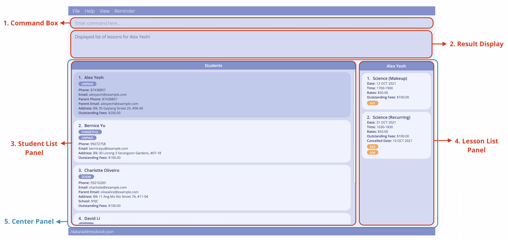
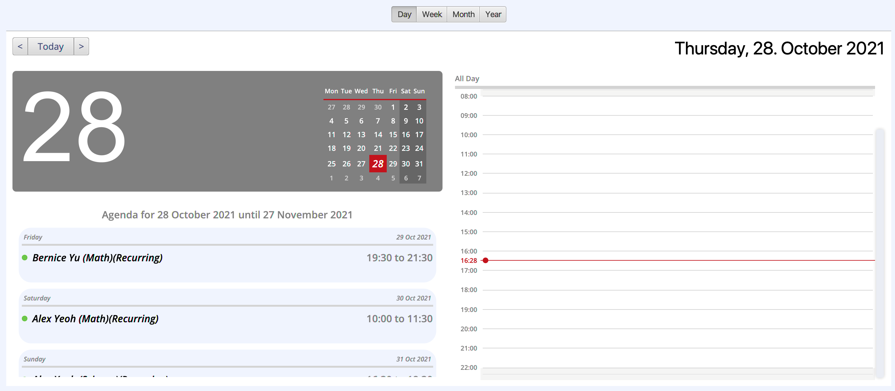
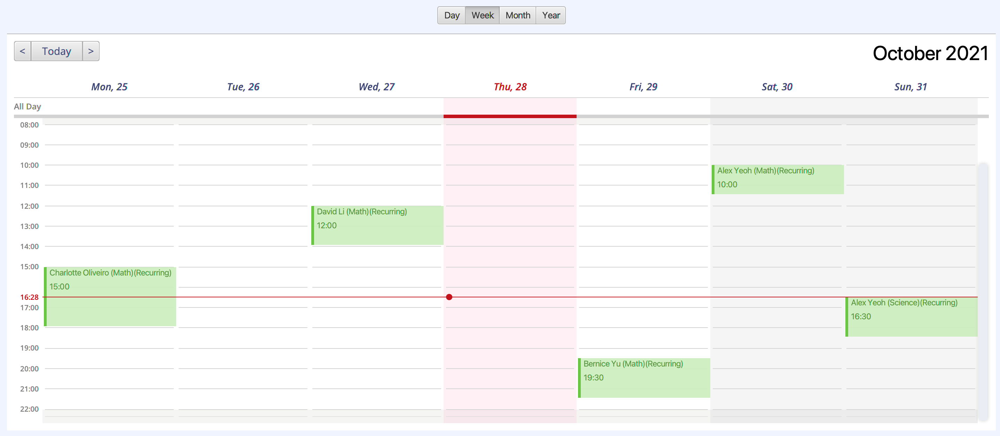
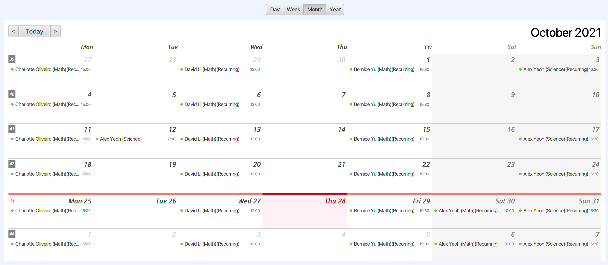

* Table of Contents
{:toc}

--------------------------------------------------------------------------------------------------------------------

## Introduction

**Tuition Address Book (TAB)** is an all-in-one desktop application that helps you keep track of the large number of students and their respective lesson information, and empower you to provide the best quality home tuition service.

TAB is a Command Line Interface (CLI) application which allows users to interact with it with just text inputs. On top of that, TAB also 
comes with a clean and aesthetic Graphical User Interface (GUI), allowing users to view their data easily.
With TAB, you can effortlessly manage your students' contact details faster than a typical mouse/GUI driven app.

--------------------------------------------------------------------------------------------------------------------

## About This Guide

This user guide is intended for any user of TAB. It provides installation instructions to help get you started with using TAB, and describes in detail the features available in TAB.

**Navigation**

In the [Table of Contents](), each item listed is a link which you can click on to go directly to that section in the guide.

**Conventions Used**

Syntax | Meaning
--------|------------------
`text` | A command to be entered into the command box in TAB.
<kbd>text</kbd> | A keyboard input, or a button to be clicked on.
[text](#about-this-guide) | Links to other parts of the document, or links to be opened in the browser.
_text_ | Caption for images.
:information_source: | Indication that the following text is a note.
:bulb: | Indication that the following text is a tip.
:exclamation: | Indication that the following text is important.

--------------------------------------------------------------------------------------------------------------------

## Quick Start

**:information_source: JDK Installation Guide**

You can install the required JDK and JRE from the
[Java SE Development Kit Downloads page](https://www.oracle.com/java/technologies/downloads/).

Here is a [website](https://docs.oracle.com/en/java/javase/17/install/overview-jdk-installation.html#GUID-8677A77F-231A-40F7-98B9-1FD0B48C346A)
to help you with the installation. Follow the guide for your operating system for detailed instructions.

1. Ensure you have **Java 11** or above installed on your computer.

2. Download the latest **TAB.jar** from [here](https://github.com/AY2122S1-CS2103T-F13-3/tp/releases).

3. Copy the file to the folder you want to use as the _home folder_ for your TAB.

4. Double-click the file to start the app. The window similar to the one below should appear in a few seconds. Note how the app contains some sample data. 
   

5. Type the command in the command box and press <kbd>ENTER</kbd> to execute it. e.g. typing **`help`** and pressing <kbd>Enter</kbd> will open the help window. 
   
   Some example commands you can try:

   * **`list`** : Lists all students.

   * **`add`**`n/John Doe p/98765432 e/johnd@example.com a/John street, block 123, #01-01` : Adds a student named `John Doe` to TAB.

   * **`delete`**`3` : Deletes the 3rd student shown in the current list.

   * **`clear`** : Deletes all students.

   * **`exit`** : Exits the app.

6. Refer to the [Features](#features) section for details of each command.

--------------------------------------------------------------------------------------------------------------------

## Graphical User Interface (GUI)

This section briefly explains the various section of TAB's GUI.

Basic layout of TAB's user interface.

No. | Section | Representation
----|---------|---------
1 | Command Box | The text field where you key in commands that are meant to be processed by TAB. TAB will execute the command after you pressed <kbd>Enter</kbd>.
2 | Result Display | The area that shows the result of the execution of the command. If the command entered has been executed successfully, it will display relevant success messages, otherwise, it will show error messages indicating the cause of the error.
3 | Student List Panel | The area that shows the list of students you have in TAB.
4 | Lesson List Panel | The area that shows the name of the student you have selected together with a list of lessons that the student has.
5 | Center Panel | The area that displays the lists of students and lessons, calendar or the list of tags depending on the command you have entered. See [Features](#features) for more details.

--------------------------------------------------------------------------------------------------------------------

## Features
This section describes the available features in TAB.

**:information_source: Notes about the command format:** 

* Words in `UPPER_CASE` are the parameters to be supplied by the user. 
  e.g. in `add n/NAME`, `NAME` is a parameter which can be used as `add n/John Doe`.

* Items in square brackets are optional. 
  e.g. `n/NAME [t/TAG]` can be used as `n/John Doe t/friend` or as `n/John Doe`.
  
* Items in curly brackets separated by the pipe character `|` indicates that you must select exactly one parameter from the list of choices.
  e.g. `cond/{all | any | none}` can be used as `cond/all` or `cond/any` or `cond/none`.
  
* Items with `…` after them can be used multiple times including zero times. 
  e.g. `[t/TAG]…​` can be used as ` ` (i.e. 0 times), `t/friend`, `t/friend t/family` etc.

* Parameters can be in any order. 
  e.g. if the command specifies `n/NAME p/PHONE_NUMBER`, `p/PHONE_NUMBER n/NAME` is also acceptable.

* If a parameter is expected only once in the command, but you specified it multiple times, only the last occurrence of the parameter will be taken. 
  e.g. if you specify `p/12341234 p/56785678`, only `p/56785678` will be taken.

* Extraneous parameters for commands that do not take in parameters (such as `help`, `list`, `exit` and `clear`) will be ignored. 
  e.g. if the command specifies `help 123`, it will be interpreted as `help`.
  
* There are constraints in place to determine whether the value you provided for a field is valid. 
  TAB will inform you if you gave an invalid input for a field.

### Getting Help 
This section tells you what to do if you require help while using TAB.

--------------------------------------------------------------------------------------------------------------------

#### Viewing help: `help`

Shows a command summary table as well as a link to access this user guide page.

Format: `help`

Shortcut: <kbd>F1</kbd>

- You can select a cell and press <kbd>CONTROL</kbd> + <kbd>C</kbd> or <kbd>COMMAND</kbd> + <kbd>C</kbd> on your keyboard to copy the selected cell value.
- You can click <kbd>Copy URL</kbd> button to copy the link to this user guide.
- You can click the right end to each column to sort the rows alphabetically.

Help window interface.

### Managing Students
This section guides you on how to use the commands for managing students in TAB.

A student must have the following essential fields:
* Name
* Address

A student must have **at least 1** of these contact fields:
* Phone number
* Parent phone number
* Email
* Parent email

Other available optional fields for a student are:
* Academic level
* Academic stream
* School
* Remarks
* Tags
* Lessons

**:information_source: Note:** 
A student can be identified by the index number shown in the displayed list of students.

--------------------------------------------------------------------------------------------------------------------

#### Adding a student: `add`

Adds a student to TAB.

Format: `add n/NAME a/ADDRESS [p/PHONE_NUMBER] [e/EMAIL] [pp/PARENT_PHONE_NUMBER] [pe/PARENT_EMAIL] [sch/SCHOOL] [stream/ACAD_STREAM] [lvl/ACAD_LEVEL] [r/REMARK] [t/TAG]…​`

:bulb: **Tip:**
A student can have any number of tags (including 0).

* At least one contact field is required. 
  e.g. at least one of the `p/PHONE_NUMBER`, `e/EMAIL`, `pp/PARENT_PHONE_NUMBER`, or `pe/PARENT_EMAIL` fields must be 
  included in the add command.
* `lvl/ACADEMIC_LEVEL` field allows only a maximum of 15 characters (including spaces).

Examples:
* `add n/John Doe p/98765432 e/johnd@example.com a/John street, block 123, #01-01 pp/92345678 pe/jackdoe@example.com sch/John's School stream/John stream lvl/J1`
* `add n/Betsy Crowe t/cousin a/Newgate p/91234567 r/hasnt pay tuition fee for Aug t/retainee`

#### Editing a student: `edit`

Edits an existing student in TAB.

Format: `edit INDEX [n/NAME] [a/ADDRESS] [p/PHONE] [e/EMAIL] [pp/PARENT_PHONE_NUMBER] [pe/PARENT_EMAIL] [sch/SCHOOL] [stream/ACAD_STREAM] [lvl/ACAD_LEVEL] [r/REMARK] [t/TAG]…​`

* Edits the student at the specified `INDEX`.  
  e.g. `edit 2` means that you wish to edit the 2nd student in the displayed list.

* You must provide at least one field. 
  e.g. entering just `edit 2` alone is not a valid command. You need to include the field you wish to edit.

* Existing values will be updated to the entered values. 
  e.g. `edit 2 f/0` will override the outstanding fees of the 2nd student in the displayed list to `0`.

* When editing tags, all existing tags of the student will be removed and replaced with the tags specified. 
  e.g. `edit 2 t/SEC2 t/IP` will erase the student's original tags and replace it with the new tags `SEC2` and `IP`.

* You can delete the data in optional fields by supplying a parameter with no arguments. 
  e.g. `edit 2 r/` will remove the remarks for the 2nd student in the displayed list.

* You cannot remove a contact field if it is the only remaining means of contact you have with a student. 
  e.g. no student should have all contact fields empty. `edit 2 pp/` will not work if the student does not have
  any `PHONE_NUMBER`, `EMAIL`, or `PARENT_EMAIL`.

* You can delete all tags of a student by typing `t/` without any arguments. 
  e.g. `edit 2 t/` will remove all existing tags from the 2nd student in the displayed list.

Examples:
* `edit 1 p/91234567 e/johndoe@example.com` Edits the phone number and email address of the 1st student to be `91234567` and `johndoe@example.com` respectively.
* `edit 2 n/Betsy Crower t/` Edits the name of the 2nd student to be `Betsy Crower` and clears all existing tags.
* `edit 3 sch/NJC stream/` Edits the school of the 3rd student to be `NJC` and clears academic stream data.

#### Deleting a student: `delete`

Deletes the specified student from TAB.

Format: `delete INDEX`

* Deletes the student at the specified `INDEX`.

* The index must be a valid index number of a student shown in the displayed list.

Examples:
* `list` followed by `delete 2` deletes the 2nd student in TAB.
* `find n/Betsy` followed by `delete 1` deletes the 1st student in the results of the `find` command.

#### Listing all students: `list`

Shows a list of all students in TAB.

Format: `list`

Shortcut: <kbd>F2</kbd>

### Finding Students
This section guides you on how to find or filter students of your choice in TAB.

--------------------------------------------------------------------------------------------------------------------

#### Finding students by fields: `find`

Finds all students whose fields match the given keyword(s), based on the specified find condition.

Fields that you can search for are:

Field            | Parameter                   | Result                                              
------------------|-----------------------------|---------------------------------------------------------
Student Name     | n/NAME_KEYWORDS             | Students whose name contains all the keywords
Student Address  | a/ADDRESS_KEYWORDS          | Students whose address contains all the keywords
Student Phone    | p/PHONE_KEYWORDS            | Students whose phone number contains all the keywords
Student Email    | e/EMAIL_KEYWORDS            | Students whose email contains all the keywords
Parent Phone     | pp/PARENT_PHONE_KEYWORDS    | Students whose parent phone number contains all the keywords
Parent Email     | pe/PARENT_EMAIL_KEYWORDS    | Students whose parent email contains all the keywords
School           | sch/SCHOOL_KEYWORDS         | Students whose school contains all the keywords
Academic Stream  | stream/ACAD_STREAM_KEYWORDS | Students whose academic stream contains all the keywords
Academic Level   | lvl/ACAD_LEVEL_KEYWORDS     | Students whose academic level contains all the keywords
Remarks          | r/REMARK_KEYWORDS               | Students whose remarks contains all the keywords
Tags             | t/TAG                           | Students who have the specified tag
Lesson Subject   | subject/LESSON_SUBJECT_KEYWORDS | Students who have lessons with subject that contains all the keywords
Lesson Date      | date/LESSON_DATE | Students with lessons that fall on the specified date
Lesson Time      | time/LESSON_TIME | Students with lessons that fall in the specified time range
Cancelled Dates  | cancel/CANCELLED_DATE     | Students who have lessons cancelled on the specified date
Lesson Rates     | rate/LESSON_RATE_KEYWORDS | Students whose lessons have rates that contain the keyword
Lesson Homework  | hw/LESSON_HOMEWORK_KEYWORDS | Students who have homework that contains all the keywords

Format: `find [cond/{all | any | none}] [n/NAME_KEYWORDS] [a/ADDRESS_KEYWORDS] [p/PHONE_KEYWORDS] [e/EMAIL_KEYWORDS] [pp/PARENT_PHONE_KEYWORDS] [pe/PARENT_EMAIL_KEYWORDS] [sch/SCHOOL_KEYWORDS] [stream/ACAD_STREAM_KEYWORDS] [lvl/ACAD_LEVEL_KEYWORDS] [r/REMARK_KEYWORDS] [t/TAG_KEYWORD]…​ [subject/LESSON_SUBJECT_KEYWORDS] [time/LESSON_TIME] [date/LESSON_DATE] [cancel/CANCELLED_DATE] [rates/LESSON_RATE_KEYWORDS] [hw/LESSON_HOMEWORK_KEYWORDS]`

Notes about the find condition:

* The find condition indicates that a student is only considered a match when `all`, `any` or `none`
  of the fields which you are searching for match the student. 
  e.g. 
    * `find n/John t/math cond/all` will return students with both the name `John` and the tag `math`.
    * `find n/John t/math cond/any` will return students with only the name `John`, or only the tag `math`, or both.
    * `find n/John t/math cond/none` will return students without the name `John` and the tag `math`.
    
* The find condition is optional and defaults to `all` if not specified.  
  e.g. `find date/10 Oct 2021 time/1000-1400` will return students with lessons that occur between `1000-1400` on `10 Oct 2021`.
  
Notes about search keywords:

* You must provide at least one field to search. 
  e.g. entering just `find` or `find cond/any` alone is not a valid command. You need to include the fields you wish to search for.

* You must provide at least one keyword to search for. 
  e.g. entering just `find n/` alone is not a valid command as the keyword is empty.

* Tags must only have one keyword. 
  e.g. `find t/zoom math` is invalid. To search by multiple tags, you can do `find t/zoom t/math`.
  
* The search is case-insensitive. 
  e.g. keyword `hans` will match `Hans`.

* A keyword can match a word partially. 
  e.g. keyword `math` will match `mathematics`.
  
* The order of the keywords do not matter. 
  e.g. keyword `west jurong` will match `jurong west`.
  
* A field needs to contain all specified keywords to be matched. 
  e.g. keywords `Amad Ali` will not match `Amad` or `Ali Abdul`, but it will match `Amad bin Ali`.

Examples:

To find a student, you may enter `find a/serangoon n/Bern` into the command box.

All students in TAB whose address matches `serangoon` and whose name matches `Bern` will be returned. The figure below shows the list after the find command is executed.

TAB displays one student after the find command.

To find students without the `unpaid` tag and whose school is not `NYJC`, you may enter the command `find cond/none t/unpaid sch/NYJC`. The figure below shows the list after this find command is executed.

TAB displays three students after the find command.

### Managing Lessons

This section guides you on how to use the commands for managing the lessons of your students in TAB.
A lesson **must** have the following fields: a start date, a time range, a lesson rate and a subject.

A lesson can be categorised into 2 types: 
1. A **weekly** recurring lesson
2. A one-off makeup lesson.

The essential fields for a lesson are:
* Start date
* Time range
* Subject
* Rate

An optional field for both types of lesson is:
* Homework
* Outstanding Fees (refer to more details in this [section](#managing-lesson-fees))

Optional fields for a **recurring** lesson is:
* End date
* Cancelled dates

**:information_source: Note:** 
* The lesson's rate refers to the fee of the lesson per hour.
This rate will be used in the calculation of fees due after each lesson.

* A lesson can be identified by the index number shown in the lesson list of the student.

 

--------------------------------------------------------------------------------------------------------------------

#### Adding a lesson: `ladd`

Adds a lesson to the specified student in TAB.

Format: `ladd INDEX [recurring/[END_DATE]] date/dd MMM yyyy time/HHmm-HHmm subject/SUBJECT rates/LESSON_RATES [hw/HOMEWORK]…​`

:bulb: **Tip:**
You can add multiple pieces of homework to a lesson in TAB.

* The type of lesson will be inferred from the presence of the `recurring/` prefix.

* The end date for the recurrence is optional.
  
* The date is case-insensitive. i.e. `12 jaN 2022` is equivalent to `12 JAN 2022`.

Examples:

* `ladd 1 recurring/23 Nov 2022 date/30 jan 2022 time/0900-1100 subject/Math rates/37.50` adds a recurring lesson that
starts on 30 Jan 2022 and ends on 23 Nov 2022 to the 1st student in the displayed student list.

* `list` followed by `ladd 1 recurring/ date/30 jan 2022 time/0900-1100 subject/Math rates/37.50`
  adds the recurring lesson to the 1st student in the displayed student list.

* `list` followed by `ladd 4 date/16 Sep 2021 time/1530-1730 subject/Science hw/TYS p2 Q2 hw/Exercise 3 hw/Lab report rates/40`
  adds the makeup lesson to the 4th student in the displayed student list.

* `find n/john` followed by `ladd 1 date/30 MAR 2021 time/1630-1745 subject/Physics hw/Worksheet 1 rates/25.00`
  adds the makeup lesson to the 1st student in the results of the `find` command.

#### Editing a lesson : `ledit`

Edits the specified lesson of the specified student in TAB with the indicated changes for specified fields.

Format: `ledit INDEX LESSON_INDEX [recurring/[END_DATE]] [date/START_DATE] [time/TIMERANGE] [subject/SUBJECT] [rates/LESSON_RATES] [f/OUTSTANDING_FEES] [hw/HOMEWORK]… [cancel/CANCEL_DATE]… [uncancel/UNCANCEL_DATE]…​`

* Edits the lesson of specified `LESSON_INDEX` for the student at the specified `INDEX`.

* The index must be a valid index number shown in the displayed student list.

* The lesson index must be a valid index number shown in the lesson list of the student.

* You can edit all fields of a lesson.

* You cannot change the lesson's type (i.e. recurring and makeup).

* The date to cancel must be a valid lesson date. 
  e.g. If the start date of a recurring lesson is `1 Oct 2021`, you can cancel `8 Oct 2021` but not `2 Oct 2021`.
  
* The date to uncancel must be an already cancelled date.

* If you change the start date of the lesson, the cancelled dates that become invalid will be removed.

Examples:
* `ledit 1 1 time/1100-1200` Edits the time range of the 1st lesson of the 1st student to be `1100-1200`.
* `ledit 1 1 recurring/30 Nov 2021` Edits the end date of the 1st lesson (assumed to be recurring with start date before 30 Nov 2021) of the 1st student to be `30 Nov 2021`.
* `ledit 2 3 rates/35.85 subject/Chinese hw/` Edits the subject of the 3rd lesson of the 2nd student to be `Chinese` and clears all existing homework.
* `ledit 3 1 hw/Textbook hw/Exercise 5` Edits the homework list of 1st lesson of the 3rd student to contain `Textbook` and `Exercise 5` only.
* `ledit 1 2 date/1 Oct 2021 cancel/15 Oct 2021 cancel/03 Dec 2021`. Cancels the specific lessons on `15 Oct 2021` and `03 Dec 2021` for the 2nd lesson (recurring) of the 1st student.
* `ledit 2 2 uncancel/10 Oct 2021` Uncancels the specific lesson on `10 Oct 2021`, which was previously cancelled, for the 2nd lesson of the 2nd student.

#### Deleting a lesson : `ldelete`

Deletes the specified lesson of the specified student in TAB.

Format: `ldelete INDEX LESSON_INDEX`

* Deletes the lesson of specified `LESSON_INDEX` for the student at the specified `INDEX`.
  
* The index must be a valid index number shown in the displayed student list.
  
* The lesson index must be a valid index number shown in the lesson list of the student.

Examples:
* `list` followed by `ldelete 2 1` deletes the 1st lesson for the 2nd student in TAB.
  
* `find n/Betsy` followed by `ldelete 1 1` deletes the 1st lesson for the 1st student in the results 
  of the `find` command.
  
#### Viewing lessons : `view`

Views all the lessons for the specified student in TAB.

Format: `view INDEX`

* Views the list of lessons belonging to the student of the specified `INDEX`.

* The index must be a valid index number shown in the displayed student list.

Examples:

* `view 1` displays the list of lessons for the 1st student in the displayed student list.
  
  
A list of lessons for the 1st student is shown on the lesson panel.

* `find n/Betsy` followed by `view 1` displays the list of lessons for the 1st student in the results of the `find` command.

#### Viewing upcoming lessons : `remind`

Displays a list of upcoming lessons with end date time within the next 48 hours

Format: `remind`

Shortcut: `F5`

Reminder window interface.

### Managing Lesson Fees

This section guides you on how to use the commands for managing the lesson fees of your students in TAB and the behaviour of the Fees Calculator feature of TAB.

**:information_source: Note:** 
* Outstanding fees can only be added and edited using Lesson Commands.
* Outstanding fee displayed in Student details is the sum of all the student's lesson's outstanding fees.

--------------------------------------------------------------------------------------------------------------------

#### Adding a Lesson's Outstanding Fees : `ladd`

Adds outstanding fees to specific lesson. Uses the Lesson Add command as seen in [Adding a lesson](#adding-a-lesson-ladd).

In the event that you have existing outstanding fees for the lesson prior to adding the lesson, you can add outstanding fees as a field when adding lesson.
Outstanding fee is an optional field and if not added with lesson, TAB will assume outstanding fees for the newly added lesson as $0.00.

Format: `ladd 1 COMPULSORY_FIELDS f/OUTSTANDING_AMOUNT`

Examples:

* `ladd 1 recurring/23 Nov 2022 date/30 jan 2022 time/0900-1100 subject/Math rates/37.50` adds the recurring lesson with the specified details and outstanding fees is assumed to be `$0.00`.

* `ladd 1 recurring/ date/30 jan 2022 time/0900-1100 subject/Math rates/37.50 f/250`
  adds the recurring lesson with an outstanding fee of `$250.00`.

#### Editing a Lesson's Outstanding Fees: `ledit`

Edits the outstanding fees to specific lesson. Uses the Lesson Edit command as seen in [Editing a lesson](#editing-a-lesson--ledit).

In the event that you disagree with the outcomes of the Fees Calculator, you can edit outstanding fees using `ledit` command.
Refer to [Behaviours of the Fees Calculator](#behaviours-of-the-fees-calculator) for cases the Fees Calculator will not account for.

Format: `ledit INDEX LESSON_INDEX OTHER_FIElDS_TO_EDIT f/OUTSTANDING_AMOUNT`

Examples:
* `ledit 2 1 f/250` Edits the outstanding fees to `$100.00`.
* `ledit 1 1 time/1100-1200 f/100` Edits the time range to `1100-1200` and outstanding fees to `$100.00`.
* `ledit 1 1 rates/50 f/0` Edits the rates to be `$50.00` and outstanding fees to be `$0.00`.

#### Paying a Lesson's Outstanding Fees: `paid`

Pays for a specific lesson.

The amount paid would be deducted from the outstanding fees field. The amount paid should be greater than 0 and should not be greater than the current outstanding fees.

Format: `paid INDEX LESSON_INDEX amt/AMOUNT_PAID`

Examples:
* `paid 1 1 amt/70` The 1st student has paid `$70.00` for his or her 1st lesson.
* `paid 3 2 amt/480.50` The 3rd student has paid `$480.50` for his or her 2nd lesson.

#### Behaviours of the Fees Calculator

TAB will update your lesson's outstanding fees upon launching TAB after the lesson has ended using Fees Calculator feature. Fees will not be updated while TAB is open, it will only update fees upon launch.
The Fees Calculator will account for cancelled dates and ensure that lesson fees on these dates will not be added.

However, the Fees Calculator will not account for any changes to lessons that have passed. Such cases include:

* **Lesson rates increment.** In the event that you want to increase your lesson rates, the current outstanding fees will not change according to the newly edited lesson rates.
* **Incorrect lesson rates entry.** Similarly, in the event that you have entered your lesson rates incorrectly and only realised it after your lesson has passed, the current outstanding fees will not change according to 
the newly edited lesson rates.
* **Cancelling or uncancelling a date in the past.** In the event that you did not cancel your lesson and the fees for that particular cancelled lesson has been added to outstanding fees, the Fees Calculator will not deduct
the fees of the cancelled lesson for you. Same for uncancelling a lesson that has passed, the fees will not be added back for you.
* **Shifting the end date of a recurring lesson.** In the event that the end date of the lesson is shifted to an earlier date and lessons after that new end date have already passed, the outstanding fees will not change.
* **Shifting the start date of a recurring lesson.** In the event that the start date of the lesson is shifted to an earlier date and lessons between the edited start date and original start date have passed,
the fees of these lessons will not be deducted for you. Same for shifting start date to a later date after the original start date has passed and fees have been updated prior.

### Viewing your Calendar

This section guides you on how to use TAB's calendar interface. Typing any of the commands in this section will bring you to the calendar interface. Any other command, such as `list` or `tag`, will bring you right out.

--------------------------------------------------------------------------------------------------------------------

#### Switching to the calendar interface: `calendar`

Brings you to TAB's calendar interface for you to see all your scheduled lessons.

Format: `calendar`

Shortcut: <kbd>F3</kbd>

:bulb: **Tip:**
All the other commands in this [Viewing your Calendar](#viewing-your-calendar) section act as a shortcut that opens the calendar as well!
For example, the `day` command bellow opens the calendar, **and** goes to the day page. You can skip typing `calendar`! 

#### Viewing your daily calendar: `day`

Displays the daily calendar, which shows your scheduled lessons for the day.

Format: `day`

Day view for calendar interface.

#### Viewing your weekly calendar: `week`

Shows the weekly calendar for you to see all the lessons you have for the week

Format: `week`

Week view for calendar interface.

#### Viewing your monthly calendar: `month`

Displays the monthly calendar, allowing you to visualise your lessons for the month.

Format: `month`

Month view for calendar interface.

#### Viewing your weekly calendar: `year`

Shows the yearly calendar. You can see which days of the year you have lessons in this view.

Format: `year`

Year view for calendar interface.

#### Navigating forward in the calendar: `next`

Goes to the next day/week/month/year in the calendar interface.

Format: `next`

#### Navigating backwards in the calendar: `back`

Goes to the previous day/week/month/year in the calendar.

Format: `back`

#### Navigate to today in the calendar: `today`

Jumps to the current day in the calendar.

Format: `today`

### Managing Data

This section informs you on how data is handled in TAB.

--------------------------------------------------------------------------------------------------------------------

#### Saving the data

TAB data are saved in the hard disk automatically after any command that changes the data. There is no need to save manually.

#### Editing the data file

TAB data are saved as a JSON file **[JAR file location]/data/addressbook.json**. Advanced users are welcome to update data directly by editing that data file.

:exclamation: **Caution:**
If your changes to the data file makes its format invalid, TAB will discard all data and start with an empty data file at the next run.

### Miscellaneous Commands
This section describes the other miscellaneous commands available in TAB.

--------------------------------------------------------------------------------------------------------------------

#### Clearing all entries: `clear`

Clears all entries from TAB.

Format: `clear`

#### Viewing all tags: `tag`

Shows all the tags that you have created together with the number of students labelled with each tag.

Format: `tag`

Shortcut: <kbd>F4</kbd>

The text on the left shows the tag names created and the number on the right indicates the number of students labelled with each tag.

#### Undoing previous command: `undo`

Undo the previous command that modified the data.

Format: `undo`

#### Redoing undone command: `redo`

Redo the previous command that has been undone. 
The undone command can only be redone provided that you did not call any commands that will modify data prior to redo.

Format: `redo`

Example:
1. Valid Redo command
   1. `edit 1 n/Joe Doe` modifies name of the first student.
   2. `undo` undoes the modification. Name of first student returns to original name before `edit` command.
   3. `day` displays the calendar for today. This command **does not modify any data**.
   4. `redo` redoes the edit command.
  

2. Invalid Redo command
   1. `edit 1 n/Joe Doe` modifies name of the first student.
   2. `undo` undoes the modification. Name of first student returns to original name before `edit` command.
   3. `ledit 2 1 date/3 Nov 2021` modifies the start date of the first lesson of the second student. This command **modifies data**.
   4. `redo` shows that there are no commands to be redone.
   

#### Exiting the program: `exit`

Exits the program.

Format: `exit`

### Shortcuts

TAB has keyboard shortcuts for navigating between its various views to help you stay more productive by keeping your hands on the keyboard.

Shortcut | Action
--------|------------------
<kbd>F1</kbd> | **Help**   Opens the help window.
<kbd>F2</kbd> | **View Students**   Brings you to your list of students.
<kbd>F3</kbd> | **View Calendar**   Brings you to the calendar interface.
<kbd>F4</kbd> | **View Tags**   Brings you to your list of tags.
<kbd>F5</kbd> | **View Reminders**   Opens the reminder window.

:bulb: **Tip:**
You can immediately go back to typing commands from anywhere in TAB even if your cursor is not in the Command Box.
This means that after clicking any button in the GUI, you do not have to click in the Command Box again to continue. Just type away!

--------------------------------------------------------------------------------------------------------------------

## FAQ

This section records frequently asked questions from users of TAB.

**Q**: How do I transfer my data to another Computer? 
**A**: Install the app in the other computer and overwrite the empty data file it creates with the file that contains the data of your previous AddressBook home folder.

**Q**: I am using a Mac and when I tried to open **TAB.jar**, Mac shows “TAB.jar cannot be opened because it is from an unidentified developer". How do I resolve this issue?  
**A**: Go to <kbd>System Preferences</kbd> → <kbd>Security & Privacy</kbd> → <kbd>General</kbd> and click <kbd>Open Anyway</kbd> at the bottom as shown in the following screenshot.

<i>The arrow indicates where you should click to open the app.</i>

--------------------------------------------------------------------------------------------------------------------

## Glossary
This section shows a list of technical and TAB-related terms used in this user guide with their respective definitions.

Term | Meaning
--------|------------------
Academic level | Mainstream academic years from primary to tertiary education in Singapore (i.e. Primary 1-6, Secondary 1-5, Junior College 1-2 and Year 1-6).
Academic stream | Mainstream tracks in Singapore (i.e. Express, NA, NT, IP, IB) as well as other common exam streams (e.g. IELTS, SAT, ACT).
CLI | Command Line Interface - a type of user interface through which users interact with the app in the form of text inputs only. New users may find it difficult to use but fast typist may find it faster to use upon familiarization.
GUI | Graphical User Interface - a type of user interface through which users interact with the app via visual representations.
JAR | Java Archive - a file format used for aggregating multiple Java class files and their associated components (e.g. images) into a single file for distribution.
Lesson rates | Amount charged per hour for lessons.
Makeup lesson | A lesson that occurs only once, for a student who has missed a previous lesson.
Mainstream OS | Windows, Linux, Unix, OS-X.
Parameter | User input required to specify the data to be saved into the application.
Recurring lesson | A lesson that will occur more than once in patterned intervals.
UI | User Interface - the means by which the user and the app interact.
UTC+8 | The UTC offset used by Singapore Standard Time (SST), 8 hours ahead of UTC. Historically also referred to as GMT+8. UTC, or Coordinated Universal Time, is the primary time standard by which the world regulates clocks and time.
UX | User Experience - The experience a user has when using the app.

--------------------------------------------------------------------------------------------------------------------

## Command summary
This section lists all available commands in TAB, along with examples on how you can use them.

Action | Format, Examples
--------|------------------
**Help** | `help`
**Add Student** | `add n/NAME a/ADDRESS [p/PHONE_NUMBER] [e/EMAIL] [pp/PARENT_PHONE_NUMBER] [pe/PARENT_EMAIL] [sch/SCHOOL] [stream/ACAD_STREAM] [lvl/ACAD_LEVEL] [r/REMARKS] [t/TAG]…`   e.g. `add n/James Ho a/123, Clementi Rd, 1234665 p/22224444 e/jamesho@example.com pp/33335555 pe/danielho@example.com sch/DHS lvl/Y1 r/retainee t/cousin`
**Edit Student** | `edit INDEX [n/NAME] [a/ADDRESS] [p/PHONE] [e/EMAIL] [pp/PARENT_PHONE_NUMBER] [pe/PARENT_EMAIL] [sch/SCHOOL] [stream/ACAD_STREAM] [lvl/ACAD_LEVEL] [r/REMARK] [t/TAG]…`   e.g. `edit 2 n/James Lee e/jameslee@example.com`
**Delete Student** | `delete INDEX`   e.g. `delete 3`
**List Students** | `list`
**Find Students** | `find [cond/{all &#124; any &#124; none}] [n/NAME_KEYWORDS] [a/ADDRESS_KEYWORDS] [p/PHONE_KEYWORDS] [e/EMAIL_KEYWORDS] [pp/PARENT_PHONE_KEYWORDS] [pe/PARENT_EMAIL_KEYWORDS] [sch/SCHOOL_KEYWORDS] [stream/ACAD_STREAM_KEYWORDS] [lvl/ACAD_LEVEL_KEYWORDS] [t/TAG_KEYWORD]…​`
**View Tags** | `tag`
**Add Lesson** | `ladd INDEX [recurring/[END_DATE]] date/dd MMM yyyy time/HHmm-HHmm subject/SUBJECT rates/LESSON_RATES [f/OUTSTANDING_FEES] [hw/HOMEWORK]…​`   e.g. `ladd 1 recurring/ date/10 Nov 2021 time/1000-1200 subject/Math rates/50`
**Edit Lesson** | `ledit INDEX LESSON_INDEX [recurring/[END_DATE]] [date/dd MMM yyyy] [time/HHmm-HHmm] [subject/SUBJECT] [rates/LESSON_RATES] [f/OUTSTANDING_FEES] [hw/HOMEWORK]… [cancel/CANCEL_DATE]… [uncancel/UNCANCEL_DATE]…​`
**Delete Lesson** | `ldelete INDEX LESSON_INDEX`   e.g.`ldelete 2 1`
**Pay Lesson** | `paid INDEX LESSON_INDEX amt/AMOUNT_PAID`
**View Calendar** | `calendar`
**View Schedule of Particular Day** | `day`
**View Schedule of Today** | `today`
**View Schedule of Week** | `week`
**View Schedule of Month** | `month`
**View Schedule of Year** | `year`
**Navigate forward in Schedule** | `next`
**Navigate backward in Schedule** | `back`
**View Reminders** | `remind`
**Clear** |`clear`
**Undo** | `undo`
**Redo** | `redo`
**Exit** | `exit`
