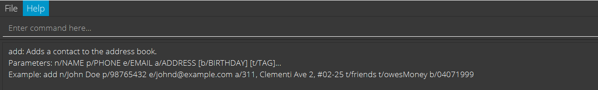
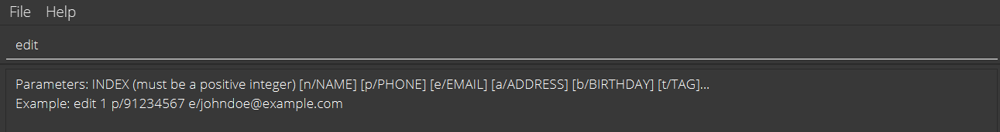

CONNECTIONS is a **desktop app for managing contacts, optimized for use via a Command Line Interface (CLI)** while still having the benefits of a Graphical User Interface (GUI). If you can type fast, CONNECTIONS can get your contact management tasks done faster than traditional GUI apps.

* [Quick Start](#quick-start)
* [Features](#features
  * [Upcoming birthdays](#upcoming-birthdays)
  * [Viewing help : `help`](#viewing-help--help)
  * [Adding a person: `add`](#adding-a-person-add)
  * [Listing all persons : `list`](#listing-all-persons--list)
  * [Editing a person : `edit`](#editing-a-person--edit)
  * [Adding Tags : `tag`](#adding-tags--tag)
  * [Removing Tags : `untag`](#removing-tags--untag)
  * [Locating persons by name and tag(s): `find`](#locating-persons-by-name-and-tags-find)
  * [Locating persons by name or tag(s): `findAny`](#locating-persons-by-name-or-tags-findany)
  * [Pinning a person: `pin`](#pinning-a-person--pin)
  * [Unpinning a person: `unpin`](#unpinning-a-person--unpin)
  * [Deleting a person : `delete`](#deleting-a-person--delete)
  * [Deleting multiple person : `deletem`](#deleting-multiple-people--deletem)
  * [Exporting a mailing list of contacts: `mailingList`](#exporting-a-mailing-list-of-contacts--mailinglist)
  * [Clearing all entries : `clear`](#clearing-all-entries--clear)
  * [Exiting the program : `exit`](#exiting-the-program--exit)
  * [Command Assistant](#command-assistant)
  * [Command History](#command-history)
* [FAQ](#faq)
* [Command Summary](#command-summary)

--------------------------------------------------------------------------------------------------------------------

## Quick start

1. Ensure you have Java `11` or above installed in your Computer.

1. Download the latest `CONNECTIONS.jar` from [here](https://github.com/AY2122S1-CS2103-F09-4/tp/releases).

1. Copy the file to the folder you want to use as the _home directory_ for your CONNECTIONS.

1. Double-click the file to start the app. The GUI similar to the below should appear in a few seconds. Note how the app contains some sample data. 
   

1. Type the command in the command box and press Enter to execute it. e.g. typing **`help`** and pressing Enter will show a list of commands that CONNECTIONS supports. 
   Click [here](#command-summary) for example commands you can try!

1. Refer to the [Features](#features) below for details of each command.

--------------------------------------------------------------------------------------------------------------------

## Features

**:information_source: Notes about the command format:** 

* Words in `UPPER_CASE` are the parameters to be supplied by the user. 
  e.g. in `add n/NAME`, `NAME` is a parameter which can be used as `add n/John Doe`.

* Items in square brackets are optional. 
  e.g. `n/NAME [t/TAG]` can be used as `n/John Doe t/friend` or as `n/John Doe`.

* Items with `…`​ after them can be used multiple times including zero times. 
  e.g. `[t/TAG]…​` can be used as ` ` (i.e. 0 times), `t/friend`, `t/friend t/family` etc.

* Parameters can be in any order. 
  e.g. if the command specifies `n/NAME p/PHONE_NUMBER`, `p/PHONE_NUMBER n/NAME` is also acceptable.

* If a parameter is expected only once in the command, but you specified it multiple times, only the last occurrence of the parameter will be taken. 
  e.g. if you specify `p/12341234 p/56785678`, only `p/56785678` will be taken.

* Extraneous parameters for commands that do not take in parameters (such as `list`, `exit` and `clear`) will be ignored. 
  e.g. if the command specifies `list 123`, it will be interpreted as `list`.

* Phone number can be of any length, and can contain any number of digits.

### Upcoming Birthdays
The vertical tab provides upcoming birthdays at a glance.
It sorts all birthdays amongst all contacts in CONNECTIONS **chronologically**, 
with the **nearest** upcoming birthday at the **top**.

* Contacts colour-coded in **GREEN** are celebrating their birthdays **today**.
* Contacts colour-coded in **BLUE** will be celebrating their birthdays in **a week or less**.
* The rest of the entries will not be colour-coded.

### Viewing help : `help`

Shows help message explaining each command.

#### Format:
* `help` - List out all available commands.
* `help COMMAND` - Shows help message for the command specified.

Notes:
* Use the command `help more` to open a link to the documentation.

**Sample Usage:**

* `help`
  * Shows all available commands.
  
* `help add`
  * Shows help message for `add`.
  
* `help more`
  * Opens a link to the documentation.
  

### Adding a person: `add`

Adds a person to the address book.

#### Format:
* `add n/NAME p/PHONE_NUMBER e/EMAIL a/ADDRESS [b/BIRTHDAY] [t/TAG]…​`

:bulb: **Tip:**
A person can have any number of tags (including 0).

:bulb: **Tip:**
Format birthday as `ddMMyyyy`.

Notes:
* Phone number must be unique.
* Birthdays are optional and can be added in future with `edit` command.
* Future dates as birthdays are not allowed.
* Each tag has a character limit of 60.

**Sample Usage:**
* `add n/John Doe p/98765432 e/johnd@example.com a/John street, block 123, #01-01`
* `add n/Betsy Crowe t/friend e/betsycrowe@example.com a/Newgate Prison b/25121999 p/1234567 t/criminal`

### Listing all persons : `list`

Shows a list of all persons in the address book.

#### Format:
* `list`

### Editing a person : `edit`

Edits an existing person in the address book.

#### Format:
* `edit INDEX [n/NAME] [p/PHONE] [e/EMAIL] [a/ADDRESS] [b/BIRTHDAY] [t/TAG]…​`

Notes:
* Edits the person at the specified `INDEX`. The index refers to the index number shown in the displayed person list. The index **must be a positive integer** 1, 2, 3, …​
* At least one of the optional fields must be provided.
* Existing values will be updated to the input values.
* When editing tags, the existing tags of the person will be removed i.e. adding of tags is not cumulative.
* You can remove all the person’s tags by typing `t/` without
    specifying any tags after it.

**Sample Usage:**
* `edit 1 p/91234567 e/johndoe@example.com`
  * Edits the phone number and email address of the 1st person to be `91234567` and `johndoe@example.com` respectively.
* `edit 2 n/Betsy Crower t/`
  * Edits the name of the 2nd person to be `Betsy Crower` and clears all existing tags.

### Adding Tags : `tag`

Adds tag to an existing person in the address book.

#### Format:
* `tag INDEX t/TAG [t/MORE_TAGS]…​`

Notes:
* Adds tag to the person at the specified `INDEX`. The index refers to the index number shown in the displayed person list. The index **must be a positive integer** 1, 2, 3, …​
* New tags will be added on top of existing tags i.e. tags added is cumulative.
* Adding new tags which already exist will succeed with a warning letting you know that the person already had those tags.
* Tags have a character limit of 60.

**Sample Usage:**
* `tag 2 t/friend t/NUS`
    * Adds the tags `friend` and `NUS` to the 2nd person.

### Removing Tags : `untag`

Removes an existing tag from an existing person in the address book.

#### Format:
* `untag INDEX t/TAG [t/MORE_TAGS]…​`

Notes:
* Remove tags from the person at the specified `INDEX`. The index refers to the index number shown in the displayed person list. The index **must be a positive integer** 1, 2, 3, …​
* Only tags that exist will be removed.
* If the command contains tags that the person does not have, a warning will be shown and no tags will be removed.

**Sample Usage:**
* `untag 2 t/friend t/NUS`
    * Removes the tags `friend` and `NUS` from the 2nd person.

### Locating persons by name and tag(s): `find`

Finds all persons whose names **and** tags matches ALL keywords provided.

#### Format:
* `find [n/NAME] …​ [t/TAG] …​`
  * Note that `find` must have at least one `[n/NAME]` or `[t/TAG]`.

Notes:
* `find` is case-insensitive by default. e.g. `hans` will match `Hans`.
  * However, users can opt for case-sensitive search by including the `c/` flag **after** the command word.
  * `c/` case-sensitive search applies **ONLY** to tags.
* The order of the keywords does not matter. e.g. `n/Hans t/football` will return the same result as
  `t/friends n/Hans`.
* Both name and tags are searched.
* Only full words will be matched e.g. `Han` will not match `Hans`.
  * This applies to both names and tags. This means `find n/an` will not return entries such as `Hans`, but 
    it will return entries such as `Jing An`.
* Only Persons matching all keywords will be returned (i.e. `AND` search).
  e.g. `n/Hans t/Friend` will return all Persons named `Hans` and are tagged with `Friend`.

**Sample Usage:**
* `find n/John`
  * returns `john` and `John Doe`.
    
* `find n/alex t/football t/classmate`
  * returns `Alex Yeoh`, who has both `football` and `classmates` tag. 
    
* `find c/ t/FRIENDS`
  * returns `Shin`, who is tagged with `FRIENDS`.
    

### Locating persons by name or tag(s): `findAny`

Finds all persons whose names **or** tags contain ANY of the given keywords.

#### Format:
* `findAny [n/NAME] …​ [t/TAG] …​`
  * Note that `find` must have at least one `[n/NAME]` or `[t/TAG]`.

Notes:
* `findAny` is case-insensitive by default. e.g. `hans` will match `Hans`.
  * However, users can opt for case-sensitive search by including the `c/` flag **after** the command word.
  * `c/` case-sensitive search applies **ONLY** to tags.
* The order of the keywords does not matter. e.g. `Hans Bo` will match `Bo Hans`.
* Both name and tags are searched.
* Only full words will be matched e.g. `Han` will not match `Hans`.
  * This applies to both names and tags. This means `findAny n/an` will not return entries such as `Hans`, but
    it will return entries such as `Jing An`.
* Persons matching at least one keyword will be returned (i.e. `OR` search).
  e.g. `n/Hans n/Bo` will return `Hans Gruber`, `Bo Yang`.

**Sample Usage:**
* `findAny n/John`
  * returns `john` and `John Doe`.
    
* `findAny n/alex n/irfan t/chef`
  * returns `Alex Yeoh`, `Irfan Ibrahim`, `Carol` who is tagged with `chef`. 
    
* `findAny c/ n/Shin t/FRIENDS t/chef`
  * returns `Shin` who is tagged with `FRIENDS`, as well as `Carol` who is tagged with `chef`.
    

### Pinning a person : `pin`

#### Format: 
* `pin INDEX`
  
  Notes:
* Pins the person at the specified `INDEX`.
* The index refers to the index number shown in the displayed person list.
* The index **must be a positive integer** 1, 2, 3, …​

**Sample Usage:**
* `list` followed by `pin 2`
  * pins the 2nd person in the address book.
* `find n/Betsy` followed by `pin 1`
  * pins the 1st person in the results of the `find` command.

### Unpinning a person : `unpin`

#### Format:
* `unpin INDEX`

  Notes:
* Unpins the person at the specified `INDEX`.
* The index refers to the index number shown in the displayed person list.
* The index **must be a positive integer** 1, 2, 3, …​

**Sample Usage:**
* `list` followed by `unpin 2`
  * unpins the 2nd person in the address book.
* `find n/Betsy` followed by `unpin 1`
  * unpins the 1st person in the results of the `find` command.

### Deleting a person : `delete`

Deletes the specified person from the address book.

#### Format:
* `delete INDEX`

Notes:
* Deletes the person at the specified `INDEX`.
* The index refers to the index number shown in the displayed person list.
* The index **must be a positive integer** 1, 2, 3, …​

**Sample Usage:**
* `list` followed by `delete 2`
  * deletes the 2nd person in the address book.
* `find n/Betsy` followed by `delete 1`
  * deletes the 1st person in the results of the `find` command.

### Deleting multiple people : `deletem`

Deletes the people within the range from the address book.

#### Format:
* `deletem START_INDEX - END_INDEX`

Notes:
* Deletes the people within the specified range from `START_INDEX to END_INDEX`.
* The indexes refers to the index number shown in the displayed person list.
* The indexes **must be a positive integer** 1, 2, 3, …​
* The `END_INDEX` must be bigger than or equal to `START_INDEX`.

**Sample Usage:**
* `list` followed by `deletem 2 - 3`
  * deletes the 2nd and 3rd person in the address book.
* `find n/Betsy` followed by `deletem 1 - 5`
  * deletes the 1st and 2nd person in the results of the `find` command.

### Exporting a mailing list of contacts : `mailingList`

Exports a CSV file of the current view containing specified fields.

#### Format:
* `mailingList [p/] [e/] [a/] [b/] [t/]`

Notes:
* Name is always the first column in the CSV file.
* The default exported fields are name, phone, email.
* Invalid prefixes are ignored.
* Opens a file selector for you to pick the export location and file name.

**Sample Usage:**
* `mailingList`
  * Prepares a CSV of the current view containing Name, Phone and Email as the fields.

* `mailingList p/`
  * Prepares a CSV of the current view containing Name and Phone as the fields.

* `mailingList j/`
  * Invalid Prefix j/ is ignored.
  * Prepares a CSV of the current view containing Name, Phone and Email as the fields.

### Clearing all entries : `clear`

Clears all entries from the address book.

#### Format:
* `clear`

### Exiting the program : `exit`

Exits the program.

#### Format:
* `exit`

### Command Assistant

Shows command format and example as the command is entered.

#### Sample Usage:

* `edit` is entered in the command box.
  * CONNECTIONS shows command format and sample for `edit`.
    

* `tag` is entered in the command box.
  * CONNECTIONS shows command format and sample for `tag`.
  

### Command History

View and use previously called commands.

Notes:
* Only commands from the current program run can be viewed. Commands from previous runs are not stored.

#### Sample Usage:
* Up Arrow
  * Shows the previous command called in the command box, or the earliest command called if there are no earlier commands.
* Down Arrow
  * Shows the next command called in the command box, or an empty command box if there are no later commands.

### Saving the data

CONNECTIONS data are saved in the hard disk automatically after any command that changes the data. There is no need to save manually.

### Editing the data file

CONNECTIONS data are saved as a JSON file `[JAR file location]/data/CONNECTIONS.json`. Advanced users are welcome to update data directly by editing that data file.

:exclamation: **Caution:**
If your changes to the data file makes its format invalid, CONNECTIONS will discard all data and start with an empty data file at the next run.
If your changes to the data file makes Birthday and Pin have invalid format, CONNECTIONS will discard data for these fields and revert to default (no birthday and not pinned). Other data will be recovered. 

--------------------------------------------------------------------------------------------------------------------

## FAQ

**Q**: How do I transfer my data to another Computer? 
**A**: Install the app in the other computer and overwrite the empty data file it creates with the file that contains the data of your previous AddressBook home folder.

--------------------------------------------------------------------------------------------------------------------

## Command Summary

Action | Summary | Format, Examples
--------|--------|----------------
**Add** | Adds a person | `add n/NAME p/PHONE_NUMBER e/EMAIL a/ADDRESS [b/BIRTHDAY] [t/TAG]…​`   e.g., `add n/James Ho p/22224444 e/jamesho@example.com a/123, Clementi Rd, 1234665 b/23062001 t/friend t/colleague`
**Clear** | Clears all entries | `clear`
**Delete** | Deletes a person | `delete INDEX`  e.g., `delete 3`
**Deletem** | Deletes multiple people within the range | `deletem START_INDEX END_INDEX`  e.g., `deletem 3 - 5`
**Edit** | Edits a person | `edit INDEX [n/NAME] [p/PHONE_NUMBER] [e/EMAIL] [a/ADDRESS] [b/BIRTHDAY] [t/TAG]…​`  e.g.,`edit 2 n/James Lee e/jameslee@example.com b/30012000`
**Exit** | Exits the program | `exit`
**Find** | Locates persons by name and tags (Results fulfill all search terms)| `find n/NAME [n/NAME] t/TAG [t/TAG]`  e.g., `find n/James t/friends`
**FindAny** | Locates persons by name and tags (Results fulfill at least one search term)| `findAny n/NAME [n/NAME] t/TAG [t/TAG]`  e.g., `findAny n/James t/NUS`
**Pin** | Pins a person | `pin INDEX`  e.g., `pin 1`
**Unpin** | Unpins a person | `unpin INDEX`  e.g., `unpin 1`
**Help** | Displays help information | `help [COMMAND]`  e.g., `help`, `help add`, `help more`
**List** | Lists all persons | `list`
**Tag** | Tags a person | `tag INDEX [t/TAG]…​`  e.g., `tag 2 t/friend t/NUS`
**Untag** | Untags a person | `untag INDEX [t/TAG]…​`  e.g., `untag 2 t/colleague`
**MailingList**| Exports a mailing list | `mailingList [p/] [e/] [a/] [b/] [t/]`
