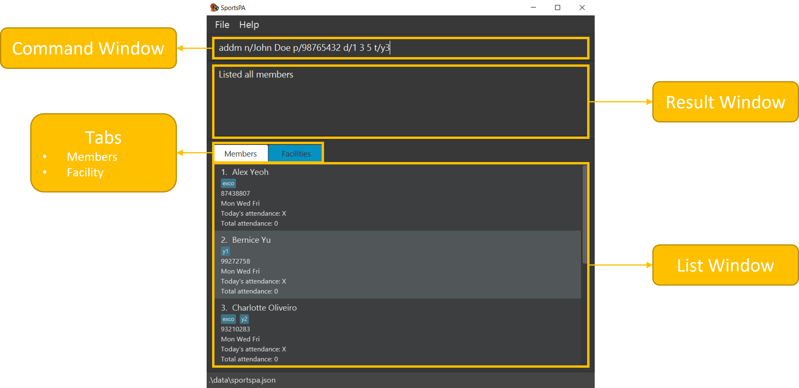

### *Welcome to the SportsPA User Guide!*

SportsPA is a desktop application targeted for use among NUS sports CCA Leaders. It is used to manage membership and
training sessions for NUS sports CCAs. SportsPA allows you to keep track of details of your members as well as
facilities to hold training sessions at. With SportsPA, you will be able to quickly organise training sessions as we
help you allocate available members into the various facilities according to their specified capacity.

As SportsPA mainly uses a CLI (Command Line Interface), this user guide provides an in-depth documentation on the all
the commands available. If this is your first time using SportsPA, we also provide a quick start guide that demonstrates
the end-to-end setup process to get you started.

_____________________________________________________________________________________________________________

* Table of Contents
{:toc}

_____________________________________________________________________________________________________________

## Quick Start

1. Ensure you have Java `11` or above installed in your Computer. If unsure how to do so, refer to [FAQ](#faq).

2. Download the latest `SportsPA.jar` from [here](https://github.com/AY2122S1-CS2103T-W12-1/tp/releases/tag/v1.2.1).

3. Copy the file to the folder you want to use as the _home folder_ for SportsPA.

4. Double-click the file to start the app. The GUI similar to the image below should appear in a few seconds. The app
   provides some sample data for you to play around with and familiarize yourself with the commands.  
   

[Back to Table of Contents](#table-of-contents)

_____________________________________________________________________________________________________________

## Using SportsPA's Interface

While SportsPA has a GUI (Graphical User Interface), you interact with the user mainly on the Command Line Interface(
CLI). The figure below provides an overview on the key components of our interface.   

Typically, to execute a command, you type the relevant command into the **Command Window** and press **Enter** on your
keyboard. *e.g. typing **`help`** and pressing Enter will open the help window*. The results of the command (or any
warning messages generated) are displayed in the **Result Window**. Any changes made to the data will be reflected
accordingly in the **List Window**. SportsPA stores two lists - **Members** and **Facilities**, which you can freely
switch between by clicking on the respective **Tabs**.

Here are some example commands you can try:

* **`listf`** : Lists all facilities.

* **`addf`**`n/Court 1 l/University Sports Centre t/1700 c/10` : Adds the facility named `Court 1` to the facilities
  list.

* **`deletem`**`3` : Deletes 3rd member in the members list.

* **`clearm`** : Clears the members list.

* **`exit`** : Exits the app.

[Back to Table of Contents](#table-of-contents)

--------------------------------------------------------------------------------------------------------------------

## Features

This section documents all the commands available in SportsPA, guiding you through its function, format, example usages
and any other noteworthy tips. For a summary of all the commands, refer to [Command Summary](#command-summary). If this
is your first read, do go through the following notes about the command format to help you better understand the
documentation.

**:information_source: Notes about the command format:** 

* Characters with the slash symbols are used to indicate the type of parameter supplied by user.
    eg. in `addm n/NAME p/PHONE_NUMBER`, `n/` and `p/` are the symbols used before entering a parameter for `NAME`
  and `PHONE_NUMBER` respectively.

* Words in `UPPER_CASE` are the parameters to be supplied by the user. 
  e.g. in `findm KEYWORD`, `KEYWORD` is a parameter which can be used as `findm Ben`.

* Items in square brackets are optional. 
  e.g `n/NAME p/PHONE_NUMBER [d/DAY(S)] [t/TAG]` can be used as `n/Ben p/91111111 d/1` or as `n/John p/91111111` or
  as `n/John p/91111111 t/exco`.

* Items with `...` after them can be used multiple times including zero times. 
  e.g. `[t/TAG]...` can be used as ` `(i.e. 0 times), `t/exco`, `t/exco t/y2`etc.

* Parameters can be in any order. 
  e.g. if the command specifies `n/NAME l/LOCATION`, `l/LOCATION n/NAME` is also acceptable.

* If a parameter is expected only once in the command but you specified it multiple times, only the last occurrence of
  the parameter wll be taken. 
  e.g. if you specify `p/12341234 p/56785678`, only `p/56785678` will be taken.

* Extraneous parameters for commands that do not take in parameters (such as `help`, `listf`, `clearm` and `exit`) will
  be ignored. 
  e.g. if the command specifies `help 123`, it will be interpreted as `help`.

### Getting help: `help`

Shows message explaining how you can access our help page.

Format: `help`

[Back to Table of Contents](#table-of-contents)

### Adding a facility: `addf`

Adds a facility to your facility list.

Format: `addf n/NAME l/LOCATION t/TIME c/CAPACITY`

* `TIME` specifies the start time and is to be inputted in the format HH:MM
* `CAPACITY` specifies the maximum allowed people in the facility

**:information_source: Note:** You will not be able to add facilities with the same `NAME` and `LOCATION` into the list
as they are considered duplicates.

Examples:

* `addf n/Court 1 l/University Sports Hall t/15:00 c/5` adds Court 1 at University Sports Hall at 3pm with a capacity of
  5

[Back to Table of Contents](#table-of-contents)

### Listing all facilities : `listf`

Shows a list of all your facilities.

Format: `listf`

[Back to Table of Contents](#table-of-contents)

### Finding a facility : `findf`

If you want to see specific facilities you are looking for, `findf` lets you find and filter facilities whose location contains
any of the given keywords.

Format: `findf KEYWORD [MORE_KEYWORDS]`

* `KEYWORD` is case-insensitive. Eg. `Utown` will match `utown`
* Only the location is searched
* Only full words will be matched eg. `Utown` will not match `town`
* Facilities matching at least one keyword will be returned (i.e. OR search) e.g `Utown Redhill` will
  return `Utown Field` and `Redhill Sports Complex`

Examples:

* `findf redhill` returns `Redhill Sports Complex` and `Redhill Field`
* `findf utown redhill` returns `Utown Field`, `Redhill Sports Complex` and `Redhill Field`

[Back to Table of Contents](#table-of-contents)

### Deleting a facility : `deletef`

Removes a facility from your facility list.

Format: `deletef INDEX`

* Deletes the facility at the specified `INDEX`
* `INDEX` refers to the index number shown in the currently displayed facility list
* `INDEX` **must be a positive integer** 1, 2, 3…

Examples:

* `listf` followed by `deletef 2` deletes the 2nd facility in the facility list
* `findf Court 1` followed by `deletef 1` deletes the 1st facility in the results of the `findf` command

[Back to Table of Contents](#table-of-contents)

### Editing a facility: `editf`

Edits an existing facility from your facility list.

Format: `editf INDEX [n/NAME] [l/LOCATION] [t/TIME] [c/CAPACITY]

* Edits the facility at the specified `INDEX`
* `INDEX` refers to the index number shown in the displayed facility list
* `INDEX` **must be a positive integer** 1, 2, 3…
* At least one of the optional fields must be provided
* Existing values will be updated to the input values

**:information_source: Note:** You will not be able to edit the facility if it has the same `NAME` and `LOCATION` as
another existing facility as they are considered duplicates.

Examples:

* `editf 1 n/Court 5` edits the name of the 1st facility to be `Court 5`
* `editf 2 n/Court 20 l/University Sports Hall` edits the name and location of the 2nd facility to be `Court 20`
  and `University Sports Hall` respectively

[Back to Table of Contents](#table-of-contents)

### Clearing all entries in facility list: `clearf`

Clears all facilities from your facility list.

Format: `clearf`

:exclamation: **Caution:**
All facility data will be removed immediately after this command is executed. This action is undoable. 

[Back to Table of Contents](#table-of-contents)

### Adding a member: `addm`

Adds a member to your members list.

Format: `addm n/NAME p/PHONE_NUMBER [d/DAY(S)] [t/TAG]...`

* `DAYS` is an optional field indicating a list of days for which the member is available for that week
* `DAYS` should be provided as numerical index, where `1` represents Monday, `2` represents Tuesday … and `7` represents
  Sunday
* Members added without `DAYS` will have an empty list of days by default
* `TAG` is an optional field indicating the tags associated with the member

**:information_source: Note:** You will not be able to add members with the same `NAME` into the member list as they are
considered duplicates.

Examples:

* `addm n/John p/91234567 d/1 3 5` adds John to the member list and indicates his availability on Monday, Tuesday and
  Friday
* `addm n/John p/91234567 t/exco t/y2` adds John to the member list and tags him as 'exco' and 'y2'.
* `addm n/Bob p/91228372` adds Bob to the member list with zero available days by default.

[Back to Table of Contents](#table-of-contents)

### Listing all members: `listm`

Shows a list of your members.

Format: `listm`

[Back to Table of Contents](#table-of-contents)

### Sorting member list: `sortm`

Shows a list of all members, sorted alphabetically

Format: `sortm`

### Finding a member `findm`

If you want to see specific members you are looking for,`findm` lets you find and filter members whose name contains any of the
given keywords.

Format: `findm KEYWORD [MORE_KEYWORDS]`

* `KEYWORD` is case-insensitive. Eg. `John` will match `john`
* Only the name of the member is searched
* Only full words will be matched eg. `Johnny` will not match `John`
* Names matching at least one keyword will be returned (i.e. OR search) e.g `John Henry` will return `John, Henry`

Examples:

* `findm Bob` returns `bob` and `Bob Doe`
* `findm john bobby` returns `John Lee`, `Bobby Tan`

[Back to Table of Contents](#table-of-contents)

### Deleting a member : `deletem`

Deletes a member from your member list

Format: `deletem INDEX`

* Deletes the member at the specified `INDEX`.
* The index refers to the index number shown in the displayed member list.
* The index **must be a positive integer** 1, 2, 3, …​

Examples:

* `listm` followed by `deletem 2` deletes the member at index 2 of the member list
* `findm John` followed by `deletem 1` deletes the 1st member in the results of the `findm` command

[Back to Table of Contents](#table-of-contents)

### Editing a member: `editm`

Edits an existing member from your member list.

Format: `editm INDEX [n/NAME] [p/PHONE_NUMBER] [d/DAYS]`

* Edits the member at the specified `INDEX`
* `INDEX` refers to the index number shown in the displayed member list
* `INDEX` **must be a positive integer** 1, 2, 3…
* At least one of the optional fields must be provided
* Existing values will be updated to the input values

**:information_source: Note:** You will not be able to edit the member if it has the same `NAME` as another existing
member as they are considered duplicates.

Examples:

* `editm 1 n/Jonathan` edits the name of the 1st member to be `Jonathan`
* `editm 2 n/Jonathan p/93837283` edits the name and phone number of the 2nd member to be `Jonathan` and `93837283`
  respectively

[Back to Table of Contents](#table-of-contents)

### Setting member availability: `setm`

We know that the availability of your members can change frequently. Thus, instead of having to individually edit your
members' availability, use
`setm` to set the availability of given member(s) at one go.

Format: `setm INDEX/INDICES d/DAY(S)`

* Sets the availability of the member(s) at the specified `INDEX/INDICES` to be the specified `DAY(s)`
* Availability is defined as days of the week when member is free
* `DAY` **must be a positive integer from 1 to 7**, whereby 1 represents Monday and 7 represents Sunday.
* `DAYS` **must be separated by a single space** 1 2 3 …​
* `INDEX` refers to the index number shown in the displayed member list
* `INDICES` **must be positive integers** 1, 2, 3, …​
* `INDICES` **must be separated by a single space**

Examples:

* `listm` followed by `setm 5 d/1 2` sets the availability of the person at index 5 in the member list to be Monday and
  Tuesday
* `findm John` followed by `setm 2 d/1` sets the availability of the person at index 2 in the results of the `findm`
  command to be Monday

[Back to Table of Contents](#table-of-contents)

### Clearing all entries in member list: `clearm`

Clears all members from the member list.

Format: `clearm`

:exclamation: **Caution:**
All member data will be removed immediately after this command is executed. This action is undoable. 

[Back to Table of Contents](#table-of-contents)

### Splitting members into facilities : `split`

Organise your next training session seamlessly by splitting members into the facilities based on its capacity and
members' availability using `split`.

Format: `split DAY`

* Allocate members available at the specified `DAY` to each facility
* `DAY` **must be a positive integer from 1 to 7**, whereby 1 represents Monday and 7 represents Sunday.

Examples:

* `split 1` splits members into groups for training on Monday of that week and displays the list of allocations to the
  user

[Back to Table of Contents](#table-of-contents)

### Creating an alias: `alias`

Some of our commands' names may be not be to your liking. Hence, SportsPA offers you the flexibility of personalising
the commands you use. With `alias`, `you can create a shortcut name for any command.

Format: `alias s/SHORTCUT cw/COMMAND_WORD`

* Creates an alias that allows the specified `COMMAND_WORD` to be executed with the specified `SHORTCUT`
* `SHORTCUT` **must not an existing command**
* `COMMAND_WORD` **must be an existing command**

**:information_source: Note:** If you create an alias whose given `SHORTCUT` already exists, the newly created alias
will replace that existing one.

Examples:

* `alias s/lf cw/listf` creates an alias for `listf` command. Entering `lf` will execute the `listf` command and a list
  of all facilities will be shown

[Back to Table of Contents](#table-of-contents)

### Listing all aliases: `aliases`

Shows a list of your created aliases in the **Result Window**.

Format: `aliases`

[Back to Table of Contents](#table-of-contents)

### Deleting an alias: `unalias`

Deletes an alias you have created.

Format: `unalias SHORTCUT`

* Deletes the alias associated with the specified `SHORTCUT`

Examples:

* `unalias lf` deletes the alias with shortcut name `lf`

[Back to Table of Contents](#table-of-contents)

### Exiting the program : `exit`

Exits the program.

Format: `exit`

[Back to Table of Contents](#table-of-contents)

### Saving the data

Your SportsPA data is saved in the hard disk automatically after any command that changes the data. They are saved as a
JSON file `[JAR file location]/data/sportspa.json`. Though **not recommended**, if you are familiar with JSON, you can
directly change the contents, *e.g a member's name*, in the data file, which will be reflected in SportsPA.

:exclamation: **Caution:**
If changes made to the data file makes its format invalid, SportsPA will discard all data and start with an empty data file at the next run.

[Back to Table of Contents](#table-of-contents)

--------------------------------------------------------------------------------------------------------------------

## FAQ

**Q**: How do I check if Java 11 is installed in my Computer? 
**A**: Open your Operating System's command prompt and enter `java -version`. Java 11 is installed if output shows Java
11.  
**Q**: How do I transfer my data to another Computer? 
**A**: Install the app in the other computer and overwrite the empty data file it creates with the file that contains
the data of your previous SportsPA home folder.

[Back to Table of Contents](#table-of-contents)

--------------------------------------------------------------------------------------------------------------------

## Command summary

Action | Format, Examples
--------|------------------
**Add
facility**| `addf n/NAME l/LOCATION t/TIME c/CAPACITY`   eg. `addf n/Court 1 l/University Sports Hall t/1500 c/5`
**Add
member**| `addm n/NAME p/PHONE_NUMBER [d/DAY(S)] [t/TAG]`   eg. `addm n/John Doe p/91111111`, `addm n/John Doe p/91111111 d/1 3 5`, `addm n/John Doe p/91111111 d/1 3 5 t/exco`
**Clear facilities**|`clearf`
**Clear member**| `clearm`
**Delete facility**| `deletef INDEX`   eg. `deletef 4`
**Delete member**| `deletem INDEX`   eg. `deletem 1`
**Exit**| `exit`
**Find member**| `findm KEYWORD`   eg. `findm John`, `findm John Bob`
**Find facility**| `findf KEYWORD`   eg. `findf Clementi`, `findf Utown`
**Help**| `help`
**List members**| `listm`
**List facilities**| `listf`
**Set member availability**| `setm INDEX/INDICES d/DAY(S)...`   eg.`setm 1 2 3 d/2 3 5`
**Split members**| `split d/DAY`   eg. `split d/1`
**Creates alias**| `alias s/SHORTCUT cw/COMMAND_WORD`   eg. `alias s/lf cw/listf`
**List aliases**| `aliases`
**Deletes alias**| `unalias SHORTCUT`   eg. `unalias lf`

[Back to Table of Contents](#table-of-contents)
