* Table of Contents
{:toc}

--------------------------------------------------------------------------------------------------------------------
## **1. Introduction**

### 1.1 What is gitGud? 

gitGud is a **desktop application for storing and managing your friends' gaming information and schedules**. 
It is dedicated to gamers like you and provides a gamer-themed experience with a focus on increasing your efficiency through
its typing-based interface.  

Previously, keeping track of all of yours friends' gaming information and schedules can be difficult and time-consuming.
However, with gitGud, there is no need to get tilted (frustrated) by this anymore as gitGud provides you with a convenient 
platform to manage essential gaming information of your fellow gamer friends.

For example, to get you excited, gitGud supports many time-saving features such as finding friends available to play with
just a single command.

--------------------------------------------------------------------------------------------------------------------

## **2. About this User Guide**

### 2.1 How to use this guide?

If you're new to gitGud, don't worry!
This guide will walk you through the [basic setup](#3-quick-start) necessary to get you ready to use gitGud
for the first time quickly.

Additionally, this guide provides you with in-depth information on the functionality gitGud provides, which will turn
you into a gitGud pro in the [features](#5-features) section.

For experienced users of gitGud, this guide also provides a [command summary](#9-command-summary) for your reference, so
you can quickly look up all of gitGud's core commands at a glance.

### 2.2 Reading this document

This guide utilizes symbols and syntax to highlight specific points made throughout the guide and to enhance your 
overall reading experience. The section below on the meanings of [symbols and syntax used](#221-general-symbols-used) 
provides more details for your reference. 

#### 2.2.1 General symbols used

This table describes the main symbols used in the user guide and their respective meanings. 

| Symbol/Syntax | What it means | 
--------------- | ---------------
:heavy_exclamation_mark: | Indicates warnings (take caution when you see this symbol)
:information_source: | Important information to take note about

--------------------------------------------------------------------------------------------------------------------

## **3. Quick start**

1. Ensure you have Java `11` installed on your computer. 
   1. To check if Java `11` is currently installed, you may follow this short [guide](https://www.baeldung.com/java-check-is-installed).
   Otherwise, if Java `11` is not installed, you may follow the installation instructions over 
   [here](https://docs.oracle.com/en/java/javase/11/install/overview-jdk-installation.html#GUID-8677A77F-231A-40F7-98B9-1FD0B48C346A).

2. Next, download the latest `gitgud.jar` from [here](https://github.com/AY2122S1-CS2103T-W13-4/tp/releases).

3. Copy the file to the folder you want to use as the _home folder_ for your gitGud application.

4. Double-click the file to start the app. The GUI similar to the below should appear in a few seconds. 
   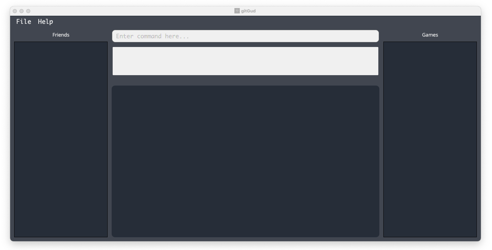
 
<ins>Image: gitGud upon startup.</ins>

5. Choose and type in a command into the command input box and press `Enter` to execute it. 
e.g. typing **`help`** and pressing `Enter` will open the help window. 
   Here are some example commands you can try:

   * **`friend --add Draco -n Marcus`** : Adds a friend __Marcus__ with gitGud `FRIEND_ID` of __Draco__ to the application.

   * **`friend --delete Draco`** : Deletes friend with gitGud `FRIEND_ID` of __Draco__.

   * **`exit`** : Exits the app.
   
Congratulations! You have successfully set up gitGud.
For more in-depth details of each command, refer to the [features](#5-features) section below.

--------------------------------------------------------------------------------------------------------------------
## **4. gitGud User Interface** 

Before we jump into the commands, let us take a moment to familiarise ourselves with the user interface. 

gitGud provides a gamer-themed user interface as shown in the image below with 6 main sections.

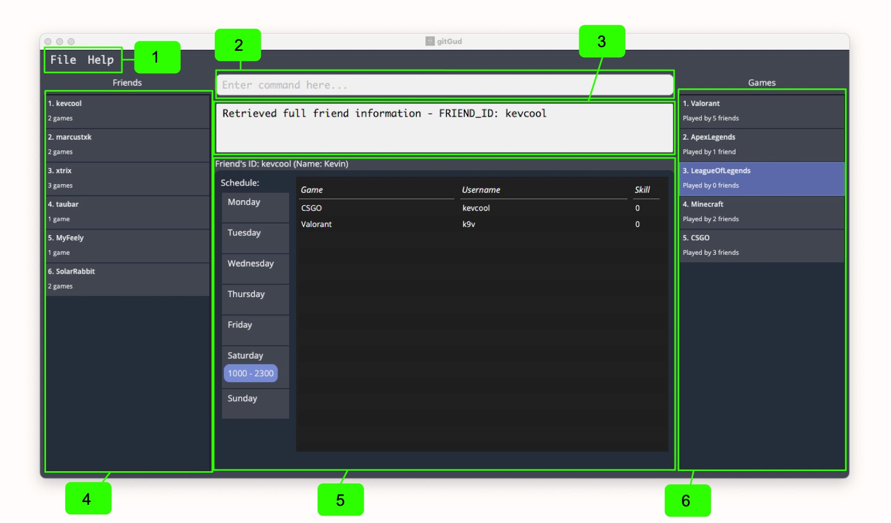
 
<ins>Image: User interface layout of gitGud.</ins>

| Number | Section Name | Description |
| -------| -------------- | ----------- | 
| 1 | Toolbar | Provides functionality related to exiting and accessing the help screen. | 
| 2 | Command input box | This is where you can input commands to perform actions in gitGud. |
| 3 | Command feedback box | This box displays information related to the status of the commands you have executed. |
| 4 | Friends list | This section displays the friends list and may be filtered to display specific friends based on the previously executed commands. |
| 5 | Main card | This box displays in-depth information for friends or games during `get` commands. | 
| 6 | Games list | This section displays the games list and may be filtered to display specific games based on the previously executed commands. | 

--------------------------------------------------------------------------------------------------------------------
## **5. Features**

**:information_source: Notes about the command format:** 

* Words in `UPPER_CASE` are the parameters to be supplied by the user. 
  e.g. in `game --get GAME_ID`, `GAME_ID` is a parameter which can be used as such: `game --get CSGO`.

* If a parameter is expected only once in the command, but you specified it multiple times, only the **last occurrence**
  of the parameter will be taken.  e.g. if you specify `-n Marcus Tang -n Taufiq`, only `-n Taufiq` will be taken.

### 5.1 Friend commands  

This section includes commands that help you manage information regarding the friends you play with, such as 
adding, editing, deleting or viewing of friends in your gitGud friend list.

#### 5.1.1 Adding a friend: `friend --add`

Adds a new friend to gitGud friend’s list with an associated **unique** friend identifier.

**:information_source: What is the friend identifier?**

The friend identifier (`FRIEND_ID`) is an ID you assign to a friend to refer to each unique friend for use within the 
gitGud application, 
it must also be unique and not previously exist in the friends list.
gitGud has imposed the command constraints listed below on the friend identifier to ensure it is easy for you to remember and type.

Format: `friend --add FRIEND_ID [-n NAME]`

Command constraints:
* The `FRIEND_ID` used: 
  * must be non-empty and cannot contain only whitespaces.
  * must be a single word (no spaces) e.g. `Kevin` and not `Kevin Lee`.
  * must only contain alphanumeric characters e.g. `Kevin` and not `K@v!n`.
  * can have at most 20 characters.
* The `NAME` used:
  * must be non-empty and cannot contain only whitespaces.
  * can have at most 20 characters.
  * supports all characters except for `-`.
* The `FRIEND_ID` must be unique and must not already exist in the friends list.

**:heavy_exclamation_mark: Warning: `FRIEND_ID` cannot be changed after being set. Hence, make sure to use a `FRIEND_ID`
you are sure about.**

Examples:
* `friend --add Draco` Adds a brand-new friend into the friends list with the identifier 'Draco' and
  which does not currently have an associated real-life name.
* `friend --add tau_bar -n Taufiq` Adds a brand-new friend into the friends list with the identifier 'tau-bar' and
  has the real-life name 'Taufiq'.

Screenshot:

 
<ins>Image: Command feedback box after adding a friend `Draco`</ins>

#### 5.1.2 Editing a friend: `friend --edit` 

Updates the friend's name to a new name for an existing friend with the given `FRIEND_ID`. 

Format: `friend --edit FRIEND_ID -n NEW_NAME`

Command constraints: 
* The `FRIEND_ID` used must currently exist in the friends list.

Examples: 
* `friend --edit Draco -n Kevin` Sets the name of existing friend with the `FRIEND_ID` 'Draco' to 'Kevin'.

Screenshot: 

 
<ins>Image: Command feedback box after editing an existing friend `kevcool`'s name to `Kevin Foong`</ins>

#### 5.1.3 Deleting a friend: `friend --delete`

Deletes a friend from gitGud’s friends list with the given `FRIEND_ID`.

Format: `friend --delete FRIEND_ID`

Command constraints: 
* The `FRIEND_ID` must currently exist in the friends list.

Examples:
* `friend --delete Draco` Deletes friend with gitGud `FRIEND_ID` of Draco and all their data from the friends list.

Screenshot:

 
<ins>Image: Command feedback box after deleting a friend `Draco`</ins>

#### 5.1.4 Link a game to a friend: `friend --link`

Links a game and the associated in-game username for the game to a friend with the provided `FRIEND_ID`.
A link between a particular friend and game shows that the friend plays the game. 
This association is required for subsequent commands, e.g. for the application to display all games that a friend plays 
or to recommend a friend to play with based on a particular game.

**:information_source: Notes about the link command:** 

* When a game is newly linked to a friend, the skill value is initially set to `0`. 

* If you link an already linked game to particular friend again, the previous link will be 
overridden with the new link with the new `IN_GAME_USERNAME` and the friend's skill value set to `0`.

Format: `friend --link FRIEND_ID -g GAME_ID -u IN_GAME_USERNAME`

Command constraints: 
* Both `FRIEND_ID` and `GAME_ID` have to already exist within the friends and games list respectively.
* The `IN_GAME_USERNAME` used:
    * must be non-empty and cannot contain only whitespaces.
    * can have at most 20 characters.
    * supports all characters except for `-`.

Examples:
* `friend --link Draco -g DOTA -u Draco995`
  Links a single game, “DOTA” with the in-game username ‘Draco995’,
  to the friend with the gitGud `FRIEND_ID` ‘Draco’.

Screenshot:

 
<ins>Image: Command feedback box after linking a friend `marcustxk` to a game `RocketLeague`</ins>

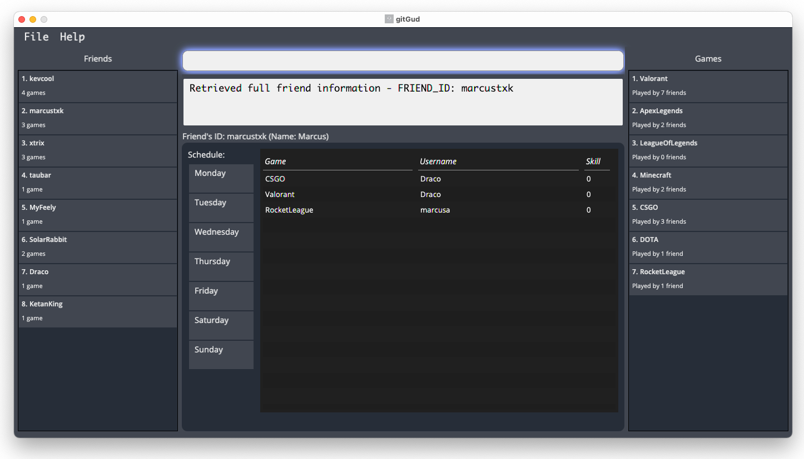
 
<ins>Image: gitGud after running `friend --get marcustxk`, after linking a friend `marcustxk` 
to a game `RocketLeague`</ins>

#### 5.1.5 Unlinking a game from a friend: `friend --unlink`

Removes the link between a friend and a game.
This may be used if for example, a friend no longer plays a previously linked game. 

Format: `friend --unlink FRIEND_ID -g GAME_ID`

Command constraints: 
* `FRIEND_ID` has to already be inside the friends list.
* The friend has to be previously linked to the game with the provided `GAME_ID`.

Examples:
* `friend --unlink Draco -g DOTA` Removes the link between the friend with `FRIEND_ID` 'Draco' and the game with `GAME_ID` 'DOTA'. 'Draco' is now no longer associated with 'DOTA'.

Screenshot:

 
<ins>Image: Command feedback box after unlinking a friend `marcustxk` from a game 
`RocketLeague`</ins>

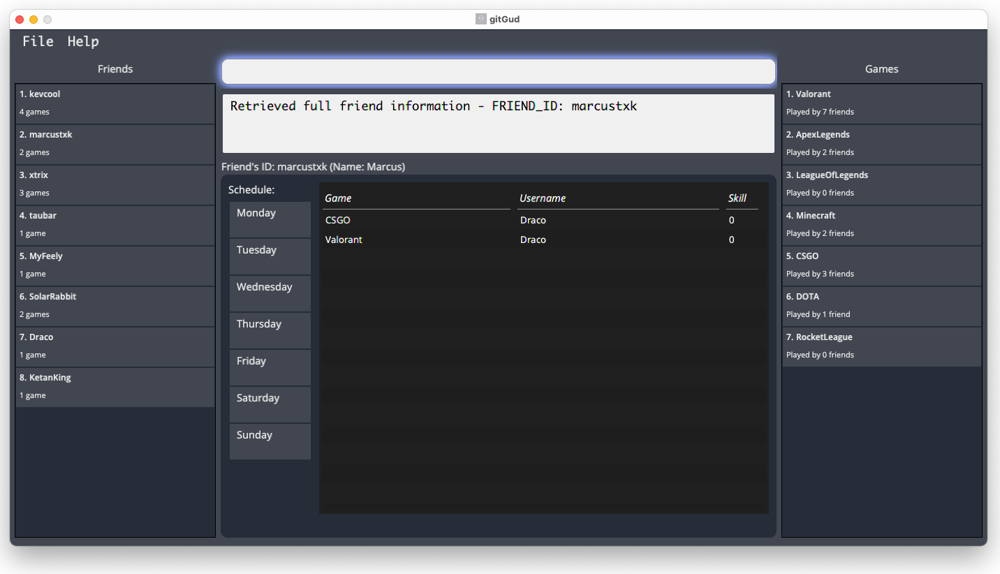
 
<ins>Image: gitGud after running `friend --get marcustxk`, after unlinking a game `RocketLeague` from a 
friend 
`marcustxk`</ins>

#### 5.1.6 Assigning a skill value for a linked game : `friend --skill`

Assigns the provided skill value to the friend with the given `FRIEND_ID` for the linked game with the given `GAME_ID`.
This command allows you to record your personal gauge of a friend's skill at a particular game.

Format: `friend --skill FRIEND_ID -g GAME_ID -v SKILL_VALUE`

Command constraints: 
* A friend with the given `FRIEND_ID` provided must exist in the friends list.
* The friend has to be previously linked to the game with the given `GAME_ID`.
* The skill value assigned must be integers within the range 0 to 10 (inclusive). e.g. 0, 8 and 10 are valid skill values,
  whereas -1, 11, 1.2, and 'one' are invalid skill values.
 
Examples: 
* `friend --skill Draco -g Valorant -v 7` Sets the skill value for friend 'Draco' for the linked game
'Valorant' to 7.
  
Screenshot:

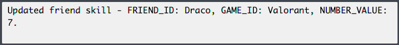
 
<ins>Image: Command feedback box after assigning skill value `7` to a game `Valorant` linked to a
friend `Draco`</ins>

 
<ins>Image: gitGud after running `friend --get Draco`, after adding a skill value `7` for a 
friend `Draco` for a game `Valorant`</ins>

#### 5.1.7 Scheduling a friend: `friend --schedule`

Schedules an existing friend by updating their schedule to indicate the time periods they are free or busy.
* gitGud stores a weekly schedule for each friend, from Monday to Sunday, with each day having 24 blocks of hours that can be marked as free or busy.
* The hourly blocks of time allows users to get an estimate of when their friends are free, allowing them to easily find common timeslots to play.

Format: `friend --schedule FRIEND_ID -p START_HOUR END_HOUR DAY -f IS_FREE`

**:information_source: Notes about the schedule:** 

* New friends start off with a schedule with all periods marked as busy.

* gitGud displays the periods of time friends are free using the 24-hour notation.
The end of a day, midnight (12am) is displayed as `2400` to allow users to easily differentiate it 
from the start of the day, which is displayed as `0000`.

  

Command constraints: 
* `FRIEND_ID` must belong to an existing friend in gitGud.
* `START_HOUR` and `END_HOUR` must be an integer between 0 and 24 inclusive, and represents the hour of the day.
  * `END_HOUR` must be strictly after `START_HOUR`.
  * For example, `START_HOUR` = 2 and `END_HOUR` = 20 represents the time period from the 2nd to the 20th hour of the day.
* `DAY` must be an integer between 1 and 7 inclusive, with each day representing a day of the week from Monday to Sunday.
* `IS_FREE` is used to mark the period as a free or busy period, and can only be the values `1` meaning free or `0` meaning busy.

Examples:
* `friend --schedule Draco -p 18 22 2 -f 1` Schedules 'Draco' as free from 18th to 22nd hour, 1800 - 2200 on Tuesday.
* `friend --schedule Draco -p 12 24 7 -f 0` Schedules 'Draco' as busy from 12th to 24th hour, 1200 - 2400 (midnight) on Sunday.

Screenshot:

 
<ins>Image: Command feedback box after scheduling a friend's `Draco` availability</ins>

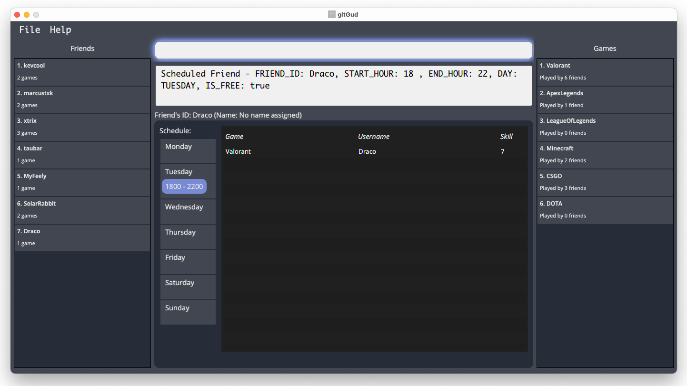
 
<ins>Image: gitGud after running `friend --get Draco`, after scheduling a friend's `Draco` 
availability</ins>

#### 5.1.8 Recommending friends available to play with - `recommend`

Lists all friends who both play the given game with `GAME_ID` and are available to play
with at the specified time each week based on their stored schedules.

Format: `recommend -g GAME_ID -t HOUR DAY`

Command constraints:
* The `HOUR` provided must be an integer within 0 to 23 inclusive, with 0 representing the 24-hour time (start of the day)
  `0000` and 23 representing the 24-hour time `2300`.
* The `DAY` provided must be an integer within 1 - 7 inclusive, with `1` representing Monday
  and `7` representing Sunday.
* The `GAME_ID` must exist in the games list.

Examples:
* `recommend -g Valorant -t 10 6` Recommends friends who play the game with the `GAME_ID` `Valorant` and
  are available weekly at `1000` every Saturday based on the stored schedule.

Screenshot:
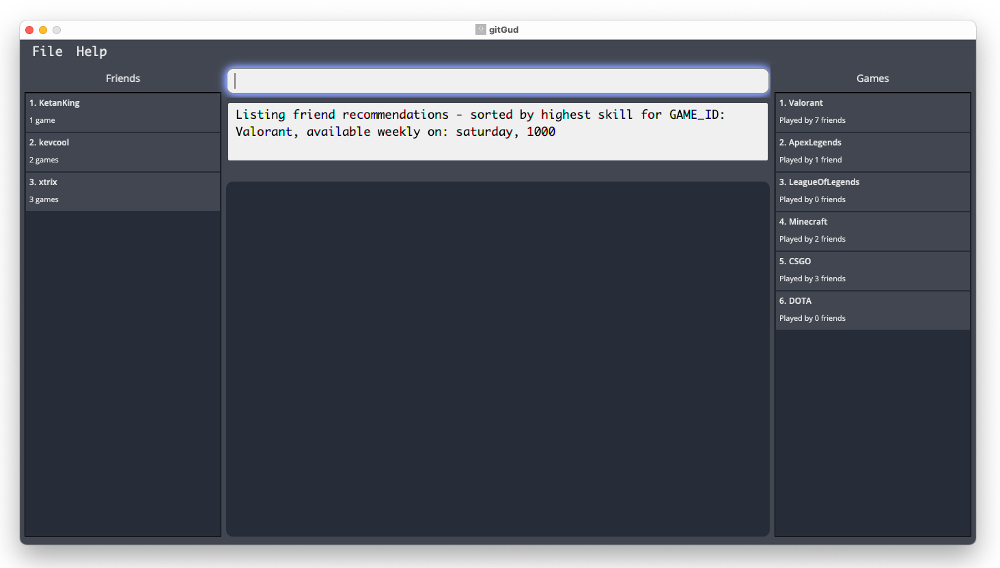
 
<ins>Image: Friends available on Saturday 1000 recommended in friends list</ins>

#### 5.1.9 Getting a single friend's complete data: `friend --get`

Displays a particular friend's complete data with gitGud’s **unique** friend identifier `FRIEND_ID`.

A friend's complete data includes:
* The weekly schedule of the friend.
* List of games the friend plays.
* In-game username for each game and the skill value in that game.

Format: `friend --get FRIEND_ID`

Command constraints: 
* The `FRIEND_ID` must currently exist in the friends list.

Examples:
* `friend --get Draco` Gets the complete data for friend 'Draco'.

Screenshot:

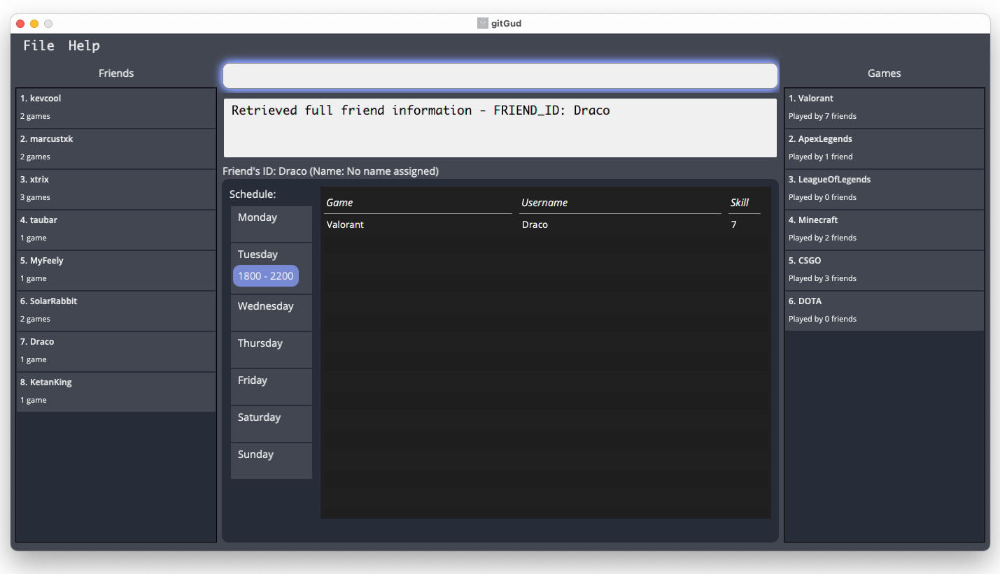
 
<ins>Image: gitGud displaying friend `Draco` after the `get` command</ins>

#### 5.1.10 Listing/Filtering multiple friends data: `friend --list`

Lists all friends stored in gitGud whose friend id contains any of the given keywords.

Format: `friend --list [KEYWORD]`

* If `KEYWORD` is left empty, **all friends** stored in gitGud will be listed.
* The filter keyword is case-insensitive e.g. `Taubar` will match `taubar`.
* Only the `FRIEND_ID` of friends is filtered.
* Partial matches will be displayed e.g. `tau` will match `taubar`.

Examples:
* `friend --list` Lists all friends stored in gitGud.
* `friend --list t` Lists all friends stored in gitGud that have `t` in their `FRIEND_ID`.

Screenshot:

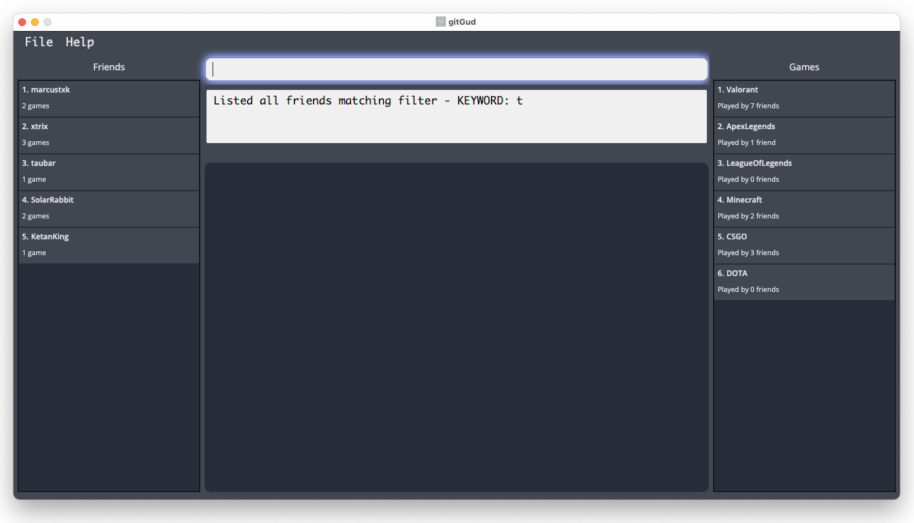
 
<ins>Image: gitGud after listing all friends that have `t` in their `FRIEND_ID`</ins>

### 5.2 Game commands

This section includes commands that help you manage the games you and your friends play, such as adding, deleting or 
viewing of games in your gitGud game list.

#### 5.2.1 Adding a game: `game --add`

Adds a game with the given **unique** `GAME_ID` into the gitGud game list.

Format: `game --add GAME_ID`

Command constraints:
* The `GAME_ID` provided:
  * must be non-empty and cannot contain only whitespaces.
  * must be a single word (no spaces) e.g. `ApexLegends` and not `Apex Legends`.
  * must only contain alphanumeric characters e.g. `CSGO` and not `CS:GO`.
  * can have at most 20 characters.
* The `GAME_ID` provided should not already exist in the games list. 

**:information_source: Notes on GAME_ID:**

* To ensure the `GAME_ID` is easy to remember and use, `GAME_ID` is limited to a single word and 
to alphanumeric characters as it is used to refer to games stored in gitGud.

* To store games with multiple words in gitGud, you may choose to capitalize the first character of each word.
e.g. `Apex Legends` may be stored as `ApexLegends`.  

Examples:
* `game --add RocketLeague` Adds a brand-new game into the game list with the **unique** `GAME_ID` 'RocketLeague'.

Screenshot:

 
<ins>Image: Command feedback box after adding a game `RocketLeague`</ins>

#### 5.2.2 Deleting a game: `game --delete`

Deletes a game from the gitGud game list.

**:information_source: Notes on deleting games:**

* When a game is deleted, all previous links between the game and friends will be removed.

Format: `game --delete GAME_ID`

Command constraints: 
* The `GAME_ID` must exist in the games list to be deleted.

Examples:
* `game --delete Valorant` Deletes the game record ‘Valorant’ from the game list if it exists.

Screenshot:

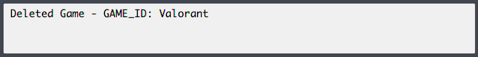
 
<ins>Image: gitGud after deleting the game `Valorant`</ins>

#### 5.2.3 Getting a single game's complete data: `game --get`

Displays a particular game's complete data with gitGud’s **unique** game identifier `GAME_ID`.

A game's complete data includes:
* List of friends that play the game.
* In-game username for each friend and their skill value.

Format: `game --get GAME_ID`

Command constraints: 
* The `GAME_ID` must currently exist in the database.

Examples:
* `game --get CSGO` Gets all the relevant information for the game 'CSGO''.

Screenshot:

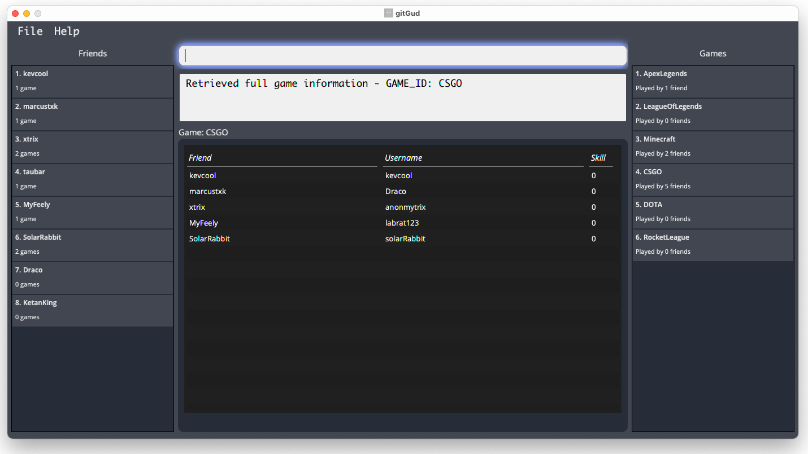
 
<ins>Image: gitGud after getting the game `CSGO`</ins>

#### 5.2.4 Listing/Filtering multiple games data: `game --list`

Lists all games stored in gitGud whose `GAME_ID` contains any of the given keywords.

Format: `game --list [KEYWORD]`

* If `KEYWORD` is left empty, **all games** stored in gitGud will be listed.
* The filter keyword is case-insensitive e.g. `valorant` will match `Valorant`.
* Only the `GAME_ID` of games is filtered.
* Partial matches will be displayed e.g. `Valo` will match `Valorant`.

Examples:
* `game --list` Lists all games stored in gitGud.
* `game --list Valo` Lists all games stored in gitGud that have `Valo` in their `GAME_ID`.

Screenshot:

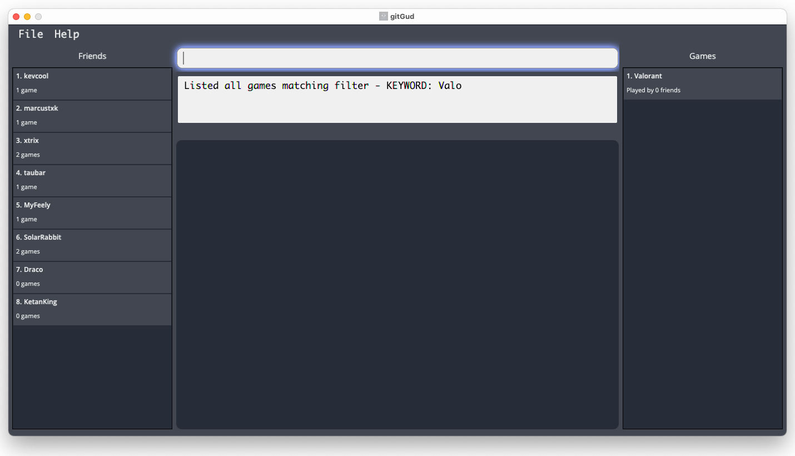
 
<ins>Image: gitGud after listing games with the keyword `Valo`.</ins>

### 5.3 Other commands

This section contains miscellaneous commands that may help improve your experience with gitGud.

#### 5.3.1 Viewing help: `help`

Shows a message providing a link to the User Guide page.

Format: `help`

Screenshot:

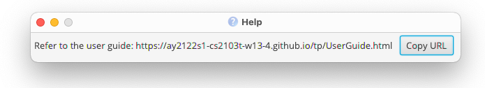
 
<ins>Image: gitGud after running help command</ins>

#### 5.3.2 Clearing the friends and games lists : `clear`

Clears all friends and games from gitGud.

Format: `clear`

**:heavy_exclamation_mark: Warning: This command deletes all friends and games from gitGud!**  
Only use this command if you are absolutely sure you would like to restart gitGud from a clean slate.

#### 5.3.3 Exiting the program : `exit`

Terminates and exits gitGud.

Format: `exit`

___

## **6. Managing data**
Your friends and games application data is stored in the files within the `data` folder relative to the where the `gitGud.jar` file
is running on your computer `[JAR file location]/data/gamesList.json` and `[JAR file location]/data/friendsList.json`.

### 6.1 Saving of application data 
Application data is saved in the hard disk automatically after any command that changes the data. 
There is no need to save manually.

### 6.2 Editing data files externally
For advanced users, you are able to change the values stored in the data files directly. 
However, this is **not recommended** and may cause your files to be corrupted - hence, we will not be covering the in-depth
details in our guide. 

**:heavy_exclamation_mark: Warning:** If the changes you have made cause the format of the data files to be invalid, 
gitGud will start with **empty data for the list(s) affected by the invalid file(s)** at the next run and 
may override the invalid files with subsequent saves.
This may cause **loss of data** and hence should be avoided unless you are absolutely sure of what you are doing!

--------------------------------------------------------------------------------------------------------------------

## **7. FAQ**

**Q**: How do I **_transfer_** my friends and games list data to another Computer running gitGud? 
**A**: Copy over the data folder (containing friendsList.json and gamesList.json) generated by gitGud on your current computer into the folder containing the 
gitGud.jar on the other computer.

**Q**: Which operating systems do gitGud support?  
**A**: gitGud is developed and tested to support most popular Operating systems including Microsoft Windows 10, Mac OS and
on Linux. However, as there are many different distributions of Linux, we are not able to test and guarantee full support 
for all distributions. 

--------------------------------------------------------------------------------------------------------------------

## **8. Glossary**

Terminology used | What it means
--------|------------------
Tilted | A term widely used in the gaming community to express frustration. 
Pro | A term widely used in the gaming community to refer to a someone who is considered highly skilled. 
Friend Identifier | An identifier you assign to a friend to refer to that specific friend within the gitGud application.
Game Identifier | An identifier you assign to a game to refer to that specific game within the gitGud application.

--------------------------------------------------------------------------------------------------------------------

## **9. Command summary**

Action | Format, Examples
--------|------------------
**Add friend** | `friend --add FRIEND_ID [-n NAME]`   e.g., `friend --add Draco -n Marcus Tang`
**Edit friend**| `friend --edit FRIEND_ID -n NEW_NAME`   e.g., `friend --edit Draco -n Kevin` 
**Delete friend** | `friend --delete FRIEND_ID`  e.g., `friend --delete Draco`
**Link game and friend** | `friend --link FRIEND_ID -g GAME_ID -u IN_GAME_USERNAME`  e.g., `friend --link Draco -g Valorant -u taufiq007`
**Unlink game and friend** | `friend --unlink FRIEND_ID -g GAME_ID`   e.g., `friend --unlink Draco -g DOTA`
**Add skill value to linked game** | `friend --skill FRIEND_ID -g GAME_ID -v SKILL_VALUE`   e.g.,`friend --skill Draco -g Valorant -v 7`
**Schedule friend** | `friend --schedule FRIEND_ID -p START_HOUR END_HOUR DAY -f IS_FREE`  e.g., `friend --schedule Draco -p 18 22 2 -f 1`
**Recommend friends** | `recommend -g GAME_ID -t HOUR DAY`  e.g., `recommend -g Valorant -t 10 6` 
**Get friend** | `friend --get FRIEND_ID`  e.g., `friend --get Draco`
**List/filter friends** | `friend --list [KEYWORD]`  e.g., `friend --list`, `friend --list Tau`
**Add game** | `game --add GAME_ID`   e.g., `game --add Valorant`, `game --add ApexLegends` 
**Delete game** | `game --delete GAME_ID`   e.g., `game --delete Valorant`
**Get game** | `game --get GAME_ID`  e.g., `game --get Valorant`
**List/filter games** | `game --list [KEYWORD]`  e.g., `game --list`, `game --list Valorant`
**Viewing help** | `help`
**Clearing friends and games lists** | `clear`
**Exit program** | `exit`

