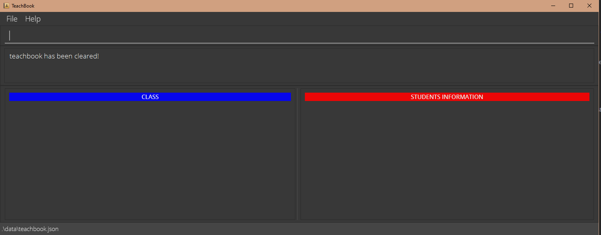

ClassMATE is a **desktop app designed for CS2101 tutors to manage student contacts and organize them into their tutorial classes and groups, as well as
other administrative matters including recording of students' class participation. It is optimized for use via a Command Line Interface** (CLI) while
still having the benefits of a Graphical User Interface (GUI). If you can type fast, ClassMATE can get your contact management tasks done faster than traditional GUI apps.

This guide will get you started on how to create students, classes and groups,
assigning students to their respective classes and groups and covers other functionalities for users
such as filtering and searching students. Finally, it will also guide
you through on how you can add class participation marks for your students.

* Table of Contents
{:toc}
--------------------------------------------------------------------------------------------------------------------

## How to use this User Guide

This User Guide has been created to help users, old and new alike, familiarize themselves with ClassMATE, its features, commands and uses!

* Use the Quick Start [below](#Quick-Start) :arrow_down_small: to setup ClassMATE on your Computer.
* You may view the entire list of ClassMATE's Features by clicking [here](#features).
* Alternatively, you can refer to the Command Summary Table at the bottom, or by clicking [here](#Command-Summary).
* A list of frequently-asked questions (FAQs) is maintained [here](#FAQ)

Throughout the User Guide,

**:information_source: Notes** will be used to give additional points regarding features

**:bulb:Tips** will be used to provide quick information bits about features

**:warning:Warning** will be used to provide warnings about features

We hope you find this User Guide helpful in using ClassMATE!

------

## Quick Start

1. Ensure you have Java `11` or above installed in your Computer. (Go to [this website](https://codejava.net/java-se/download-and-install-java-11-openjdk-and-oracle-jdk) and follow the instructions to download and install Oracle JDK 11, which is _basically_ Java 11.)
1. Download the latest `classmate.jar` from [here](https://github.com/AY2122S1-CS2103T-W15-1/tp/releases).
1. Copy the file to the folder you want to use as the _home folder_ for your ClassMATE.
1. Double-click the file to start the app. The GUI similar to the below should appear in a few seconds. Note how the app contains some sample data. 
   
1. Type the command in the **Command-Line Input** and press Enter to execute it. e.g. typing **`help`** and pressing Enter will open the help window. 
   
1. Refer to the [Tutorial](#CLI-Tutorial) below for details of each command.

--------------------------------------------------------------------------------------------------------------------

## CLI Tutorial

In this section, you will familiarize yourself with the use of CLI to facilitate your experience when using ClassMATE.
All commands would be typed in the **Command-Line Input** as shown in the image below.

### Command Features

**:information_source: Notes about the command format:** 

* Words in `UPPER_CASE` are the parameters to be supplied by the user. 
  e.g. in `addstu n/NAME`, `NAME` is a parameter which can be used as `add n/John Doe`.

* Items in square brackets are optional. 
  e.g `n/NAME [t/TAG]` can be used as `n/John Doe t/friend` or as `n/John Doe`.

* Items with `…`​ after them can be used multiple times including zero times. 
  e.g. `[t/TAG]…​` can be used as ` ` (i.e. 0 times), `t/friend`, `t/friend t/family` etc.

* You can add parameters in any order. 
  e.g. if the command specifies `n/NAME p/PHONE_NUMBER`, you can also type `p/PHONE_NUMBER n/NAME` for the parameters.

* If a parameter is expected only once in the command, but you specified it multiple times, only the last occurrence of the parameter will be taken. 
  e.g. if you specify `p/12341234 p/56785678`, only `p/56785678` will be taken.

* If you add parameters for commands that do not take in parameters (such as `help`, `list`, `exit` and `clear`), they will be ignored. 
  e.g. if the command specifies `help 123`, it will be interpreted as `help`.

### Viewing help : `help`

Shows a message explaning how to access the help page.

Format: `help`

## Student Commands

### Adding a student: `addstu`

Adds a student to ClassMATE.

Format: `addstu n/NAME p/PHONE_NUMBER e/EMAIL a/ADDRESS c/CLASS_CODE [t/TAG]…​`

:bulb: **Tip:**
A student can have any number of tags (including 0)

Examples:
* `addstu n/John Doe p/98765432 e/johnd@example.com a/John street, block 123, #01-01 c/G06`
* `addstu n/Betsy Crowe t/proactive e/betsycrowe@example.com a/10 Kent Dr, #02-02 p/1234567 c/G06 t/team player`

### Editing a student : `editstu`

Edits an existing student in ClassMATE.

Format: `editstu INDEX [n/NAME] [p/PHONE_NUMBER] [e/EMAIL] [a/ADDRESS] [c/CLASS_CODE] [t/TAG]…​`

* Edits the student at the specified `INDEX`. The index refers to the index number shown in the displayed student list. The index **must be a positive integer** 1, 2, 3, …​
* At least one of the optional fields must be provided.
* Existing values will be updated to the input values.
* When editing tags, the existing tags of the student will be removed i.e adding of tags is not cumulative.
* You can remove all the student’s tags by typing `t/` without
  specifying any tags after it.

Examples:
*  `editstu 1 p/91234567 e/johndoe@example.com` Edits the phone number and email address of the 1st student to be `91234567` and `johndoe@example.com` respectively.
*  `editstu 2 n/Betsy Crower t/` Edits the name of the 2nd student to be `Betsy Crower` and clears all existing tags.

### Viewing a student : `viewstu`

View a student's details in ClassMATE, as shown in the picture above

Format: `viewstu INDEX`

* Views the student's details at specified `INDEX`
* The index refers to the index number shown in the displayed student list.
* The index must be a positive integer 1, 2, 3, …​

Examples:

* `liststu` followed by `viewstu 2` shows second student in the student list.
* `findstu Betsy` followed by `viewstu 1` shows the 1st student in the results of the find command.

### Listing all students : `liststu`

Shows a list of all students in ClassMATE.

Format: `liststu [c/CLASS_CODE]`

* If the optional field is not provided, all students stored are listed. Otherwise, only students that belong to the field specified are listed.

Examples:

* `liststu c/G06` Lists all students stored in the class `G06`

### Finding students by name: `findstu`

Finds students whose names contain any of the given keywords.

Format: `findstu KEYWORD [MORE_KEYWORDS]`

* The search is case-insensitive. e.g `hans` will match `Hans`
* Only the name is searched.
* Only full words will be matched e.g. `Han` will not match `Hans`

Examples:
* `findstu John` returns `john` and `John Doe`
* `findstu alex david` returns `Alex Yeoh`, `David Li` 

### Deleting a student : `deletestu`

Deletes the specified student from the student list.

Format: `deletestu INDEX`

* Deletes the student at the specified `INDEX`.
* The index refers to the index number shown in the displayed student list.
* The index **must be a positive integer** 1, 2, 3, …​

Examples:
* `liststu` followed by `deletestu 2` deletes the 2nd student in the student list.
* `findstu Betsy` followed by `deletestu 1` deletes the 1st student in the results of the `findstu` command.

### Clearing all students : `clear`

Clears all students from ClassMATE. Below is how it would look like.

Format: `clear`

:warning: **Warning:**
This command deletes **ALL** students and is irreversible :warning:

## Tutorial Class Commands

### Adding a tutorial class : `addc`

Adds a tutorial class to ClassMATE.

Format: `addc c/CLASS_CODE s/SCHEDULE [t/TAG]…​`

Examples:
* `addc c/G06 s/Tuesday 2 to 4pm, Friday 2 to 4pm`
* `addc c/G01 s/Monday 10am to 12pm, thursday 10am to 12pm`

### Viewing a class

Views a class in ClassMATE, as shown above

**:information_source: Note:** 

viewc highlights the class chosen, and filters out only students in the class!

Format: `viewc INDEX`

* Views the class details at the specified INDEX.
* Details of a class includes students in the class and the class schedule.
* The index refers to the index number shown in the displayed list of classes.
* The index must be a positive integer 1, 2, 3, …​

Examples:

* `listc` followed by `viewc 2` shows the 2nd class in the displayed class list.

### Listing all classes : `listc`

Shows a list of all classes in ClassMATE.

Format: `listc`

### Finding classes by class codes: `findc`

Find classes by class codes.

Format: `findc KEYWORD [MORE_KEYWORDS]`

* The search is not absolute. e.g `G0` will match `G06`

Examples:
* `findc A02` returns `A02` if it exists
* `findc E` returns `E01`, `E02`, `E03` 

### Deleting a class: `deletec`

Deletes a class from ClassMATE

Format: `deletec INDEX`

* Deletes the class at the specified INDEX.
* The index refers to the index number shown in the displayed list of classes.
  The index **must be a positive integer** 1, 2, 3, …​

Examples:
* `listc` followed by `deletec 2` deletes the 2nd class in the list of classes.
* `findc G06` followed by `deletec 1` deletes the 1st class in the results of the `findc` command.

## Tutorial Group Commands

### Adding a group: `addcg`

Adds a group to a particular tutorial class

Format: `addcg gn/GROUP_NAME c/CLASS_CODE type/GROUP_TYPE`

Examples: `addcg gn/Group 1 c/G01 type/OP1` adds Group 1 to class `G01` assigned to the task `OP1`

### Listing all groups : `listg` [Coming Soon]

Shows a list of all groups in a specific class in ClassMATE.

Format: `listg c/CLASS_CODE`

Examples:
* `listg c/G06` Lists all groups in the class `G06`

### Viewing a Group: `viewcg` [Coming Soon]

Views a group's details in ClassMATE

Format: `viewcg INDEX`

* Views the group's details at the specified INDEX.
* The index refers to the index number shown in the displayed group list.
* The index must be a positive integer 1, 2, 3...

Examples:
* `listg c/G06` followed by `viewcg 2` shows the 2nd group in the list of group in class G06

### Deleting a Group: `deletecg`

Deletes a group from ClassMATE by their index in the group list

Format: `deletecg INDEX`

* Deletes the group at the specified INDEX.
* The INDEX refers to the index number shown in the displayed group list.
* The index you use must be a positive integer 1, 2, 3...

Examples:
* `listg n/G06` followed by `deleteg 2` deletes the 2nd group in the list of group in class G06

## Adding Student to a group: `addsg` [Coming Soon]

Adds student to a group.

Format: `addsg n/NAME tp/TYPE g/GROUP_NAME [t/TAG]`

* Adds the student to a group in the class
* Type refers to the assignment that the group will work together for

Example:
* `liststu c/G06`shows that Betsy is a student in class G06.
  `addsg n/Betsy tp/OP1 g/A` then adds a student called Betsy to OP1 Group A in class G06

### Exiting the program : `exit`

Exits the program.

Format: `exit`

### Saving the data

ClassMATE data is saved in the hard disk automatically after any command that changes the data. **There is no need to save manually.**

### Editing the data file

ClassMATE data are saved as a JSON file `[JAR file location]/data/classmate.json`. Advanced users are welcome to update data directly by editing that data file.

:exclamation: **Caution:**
If your changes to the data file makes its format invalid, ClassMATE will discard all data and start with an empty data file at the next run.

--------------------------------------------------------------------------------------------------------------------

## FAQ

**Q**: How do I transfer my data to another Computer? 
**A**: Install the app in the other computer and overwrite the empty data file it creates with the file that contains the data of your previous ClassMATE home folder.

--------------------------------------------------------------------------------------------------------------------

## Command Summary

Action | Format, Examples
--------|------------------
**Help** | `help`
**Add student** | `addstu n/NAME p/PHONE_NUMBER e/EMAIL a/ADDRESS c/CLASS_CODE [t/TAG]…​`  e.g., `add n/James Ho p/22224444 e/jamesho@example.com a/123, Clementi Rd, 1234665 c/G01 atd/1 t/attentive`
**Edit student** | `editstu INDEX [n/NAME] [p/PHONE_NUMBER] [e/EMAIL] [a/ADDRESS] [c/CLASS_CODE] [t/TAG]…​`  e.g., `edit 2 n/James Lee e/jameslee@example.com`
**View student** | `viewstu INDEX`  e.g., `liststu` followed by `viewstu 2`
**Find student** | `findstu KEYWORD [MORE_KEYWORDS]`  e.g., `findstu John`
**Delete student** | `deletestu INDEX`  e.g., `liststu` followed by `deletestu 3`
**List students** | `liststu [c/CLASS_CODE]`  e.g., `liststu c/G06`
**Add class** | `addc c/CLASS_CODE s/SCHEDULE [t/TAG]…​`  e.g., `addc c/G06 s/Tuesday 2 to 4pm, Friday 2 to 4pm`
**Delete class** | `deletec INDEX`  e.g., `listc` followed by `deletec 2`
**View class** | `viewc INDEX`  e.g., `listc` followed by `viewc 3`
**List all classes** | `listc`
**Find class** | `findc KEYWORD [MORE_KEYWORDS]`  e.g., `findc A02`
**Add Tutorial Group** | `addcg gn/GROUP_NAME c/CLASS_CODE type/TYPE`   e.g.,`addsg n/Betsy tp/OP1 g/A`
**Delete Tutorial Group** | `deletecg INDEX`   e.g., `deletecg 2` 
**List Tutorial Group** | `listg`
**Add Student to Group** | `addsg n/NAME tp/TYPE g/GROUP_NAME [t/TAG]`   e.g., `addcg gn/Group 1 c/G01 type/OP1`
**Clear all students** | `clear`
**Exit ClassMATE** | `exit`

## Glossary

**Java 11** | Java is a programming language, more on it [here](https://en.wikipedia.org/wiki/Java_(programming_language)).
**JSON** | a JSON file is an open standard file format, more on it [here](https://en.wikipedia.org/wiki/JSON).
