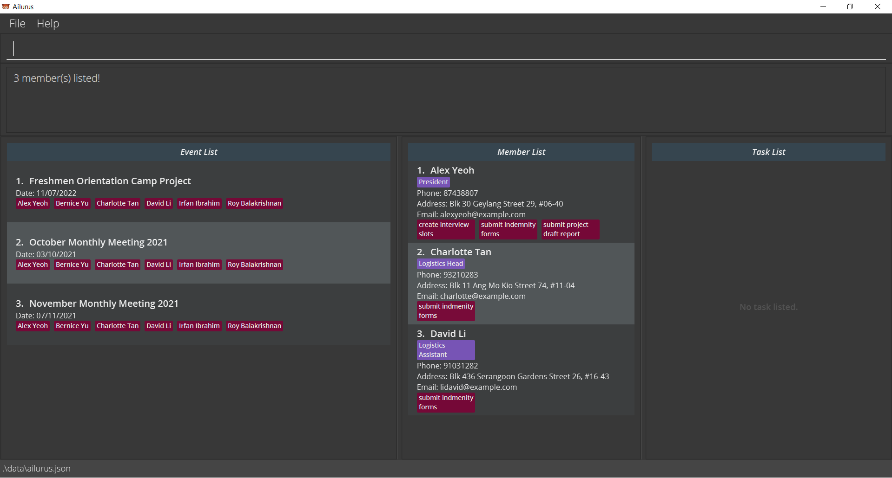

Ailurus is a **desktop application** designed to aid Organising Committees from the Computing Faculty in managing and accounting for their administrative concerns. It provides users with the ability to plan and manage events and tasks for their members.

Ailurus is catered for people that are familiar with [Command Line Interfaces](https://en.wikipedia.org/wiki/Command-line_interface) (CLI), and are able to type fast. It also preserves the benefits of a [Graphical User Interface](https://en.wikipedia.org/wiki/Graphical_user_interface) (GUI) via [JavaFX](https://en.wikipedia.org/wiki/JavaFX).

* Table of Contents
{:toc}

--------------------------------------------------------------------------------------------------------------------

## Welcome to the Ailurus User Guide
This User Guide aims to introduce new users to Ailurus, while also providing them with a comprehensive guide to all the commands in Ailurus.

Texts highlighted in light-blue such as [this](https://en.wikipedia.org/wiki/This_(computer_programming)) will direct the user to areas where more information about the highlighted text can be found. This is useful especially when the user wants to navigate to a certain section via the Table of Contents.

It is recommended to follow along and try out the commands listed in this User Guide. Ailurus is designed such that the commands will come as intuitive after a short period of use.

## Quick start

1. Ensure you have [Java 11](https://www.oracle.com/java/technologies/downloads/) or above installed in your Computer.

2. Download the latest `ailurus.jar` from [here](https://github.com/AY2122S1-CS2103T-T15-2/tp/releases).

3. Copy the file to the folder you want to use as the _home folder_ for Ailurus.

4. Double-click the file to start the app. The GUI similar to the below should appear in a few seconds. Note how the app contains some sample data. 
   

5. Type the command in the command box and press Enter to execute it. e.g. typing **`help`** and pressing Enter will 
open the help window. 
   Some example commands you can try:

   * **`mlist`** : Lists all members in Ailurus.

   * **`madd`**`/n John Doe /ph 98765432 /em johnd@example.com /a John street, block 123, #01-01` : Adds a contact named `John Doe` to Ailurus.

   * **`mdel`**`3` : Deletes the 3rd contact shown in the current list of people.

   * **`exit`** : Exits the app.

6. Refer to the [Features](#features) below for details of each command.

--------------------------------------------------------------------------------------------------------------------

## Features

**:information_source: Notes about the command format:** 

* Commands are usually abbreviated to facilitate faster typing for user convenience. As a general rule of thumb, `m`, `e` and `t` are used to represent `Member`, `Event` and `Task` respectively.

* Words in `UPPER_CASE` are the parameters to be supplied by the user. 
  e.g. in `madd /n NAME`, `NAME` is a parameter which can be used as `madd /n John Doe`.

* Items in square brackets are optional. 
  e.g. `/n NAME [/p POSITION]` can be used as `/n John Doe /p friend` or as `/n John Doe`.

* Items with `…`​ after them can be used multiple times including zero times. 
  e.g. `[/p POSITION]…​` can be used as ` ` (i.e. 0 times), `/p friend`, `/p friend /p family` etc.

* Parameters can be in any order. 
  e.g. if the command specifies `/n NAME /ph PHONE_NUMBER`, `/ph PHONE_NUMBER /n NAME` is also acceptable.

* If a parameter is expected only once in the command, but you specified it multiple times, only the last occurrence of the parameter will be taken. 
  e.g. if you specify `/ph 12341234 /ph 56785678`, only `/ph 56785678` will be taken.

* Extraneous parameters for commands that do not take in parameters (such as `help`, `list` and `exit`) will be ignored.
   
  e.g. if the command specifies `help 123`, it will be interpreted as `help`.

* Some commands require the user to enter the `EVENT_INDEX`, `MEMBER_INDEX` or `TASK_INDEX`. The `ID` refers to the order on 
  the display list. 
  e.g. `Financial Planning` has a `EVENT_INDEX` of `1` and `Charlotte Oliveiro` has a `MEMBER_INDEX` 
  of `3` according to the diagram below.
  

### Viewing help : `help`

Shows a message explaining how to access the help page.

Format: `help`

### Member Commands

#### Adding a member: `madd`

Adds a member to Ailurus.

Format: `madd /n NAME /ph PHONE_NUMBER /em EMAIL [/a ADDRESS] [/p POSITION]…​`

 
:bulb: **Tip:** A member can have any number of positions (including 0). A member MUST have a name, phone number and email address, but mailing address and positions are optional.

Examples:
* `madd /n John Doe /ph 98765432 /em johnd@example.com`
* `madd /n Betsy Crowe /p Programs Head /em betsycrowe@example.com /a Newgate Prison /ph 1234567 /p Finance Assistant`

#### Listing all members : `mlist`

Shows a list of all members (of an event optionally).

Format: `mlist [/e EVENT_INDEX] [/att] [/abs]`

* `EVENT_INDEX` **must be a positive integer** 1, 2, 3, …​
* List everyone recorded in Ailurus if `EVENT_INDEX` is not given.
* If  `EVENT_INDEX` is provided, list everyone who is participating in the event.
* `EVENT_INDEX` refers to the index number shown in the displayed event list.
* Only one of `/att` or `/abs` may be provided if EVENT_INDEX is present.
* `/att` filters the list to those that attended the event.
* `/abs` filters the list to those that were absent from the event.

Example:
* `mlist` lists everyone in Ailurus.
* `mlist /e 1` lists all members of the event with index number 1.
* `mlist /e 1 /att` lists all members who attended the event with index number 1.
* `mlist /e 1 /abs` lists all members who were absent from the event with index number 1.

#### Editing a member : `medit`

Edits an existing member in Ailurus. 

Format: `medit /m MEMBER_INDEX [/n NAME] [/ph PHONE] [/em EMAIL] [/a ADDRESS] [/p POSITION]…​`

* `MEMBER_INDEX` **must be a positive integer** 1, 2, 3, …​
* Edits the member at the specified `MEMBER_INDEX`. The index refers to the index number shown in the displayed member list.
* At least one of the optional fields must be provided.
* Existing values will be updated to the input values.
* When editing positions, the existing positions of the member will be removed i.e. adding of positions is not cumulative.
* You can remove all the member’s positions by typing `/p` without specifying any positions after it.

Examples:
* `medit /m 1 /ph 91234567 /em johndoe@example.com` Edits the phone number and email address of the 1st member to be `91234567` and `johndoe@example.com` respectively.
* `medit /m 2 /n Betsy Crower /p` Edits the name of the 2nd member to be `Betsy Crower` and clears all existing positions.

#### Locating members by name: `mfind`

Finds members whose names contain any of the given keywords.

Format: `mfind KEYWORD [MORE_KEYWORDS]…​`

* The search is case-insensitive. e.g. `hans` will match `Hans`
* The order of the keywords does not matter. e.g. `Hans Bo` will match `Bo Hans`
* Only the name is searched.
* Only full words will be matched e.g. `Han` will not match `Hans`
* Members matching at least one keyword will be returned (i.e. `OR` search).
  e.g. `Hans Bo` will return `Hans Gruber`, `Bo Yang`

Examples:
* `mfind John` returns `john` and `John Doe`
* `mfind alex david` returns `Alex Yeoh`, `David Li` 
  

#### Locating members by their tasks : `mtfind`

Finds members whose tasks' names contains the given keyword.

Format: `mtfind KEY_WORD`

* The search is case-insensitive. e.g. `form` will match `Form`
* Only the name of the task is searched.
* Only full words will be matched e.g. `form` will not match `forms`
* Members with at least one task matching the given keyword will be returned.

Examples:
* `mtfind form` returns `Alex Yeoh`, `Charlotte Oliveiro`, `David Li` and `Irfan Ibrahim` because task `submit form` was assigned to them.
 

#### Locating members by their positions: `pfind`

Find positions whose names contain any of the given keywords.

Format: `pfind KEYWORD [MORE_KEYWORDS]...`

* The search is case-insensitive. e.g `friend` will match `Friend`
* The order of the keywords does not matter. e.g. `work Buddies` will match `Buddies work`
* Only the name of the position is searched.
* Member with positions with names matching at least one keyword will be returned (i.e. `OR` search).
  e.g. `work Buddies` will return `Best Buddies`, `workaholic`

Examples:
* `pfind assist` returns `David Li`, `Irfan Ibrahim` and `Betsy Crowe` because they have the following positions: `Logistics Assistant`, `Logistics Assistant` and `Finance Assistant` respectively.

#### Deleting a member : `mdel`

Deletes the specified member from Ailurus.

Format: `mdel /m MEMBER_INDEX`

* `MEMBER_INDEX` **must be a positive integer** 1, 2, 3, …​
* Deletes the member at the specified `MEMBER_INDEX`.
* `MEMBER_INDEX` refers to the index number shown in the displayed member list.

Examples:
* `mdel /m 2` deletes the 2nd member in Ailurus.

### Task Commands

#### Adding a task: `tadd`

Adds a task to the specified members in Ailurus.

Format: `tadd /n TASKNAME /d DATE_TIME /m MEMBER_INDEX [/m MORE_MEMBER_INDEX]…​`

:bulb: Note: A task must be assigned to a member.

* `MEMBER_INDEX` **must be a positive integer** 1, 2, 3, …​
* Tasks can be added to multiple members if there is more than one `MEMBER_INDEX` provided.
* `DATE_TIME` must be of format: `dd/MM/yyyy HH:mm`
* `MEMBER_INDEX` refers to the index number shown in the displayed member list.

Examples:
* `tadd /n Collect payment from members /d 20/11/2021 11:30 /m 3` adds task `Collect payment from members` to the third member on the  member list.
* `tadd /n Collect dogtag /d 20/11/2021 11:30 /m 1 /m 2 /m 3` adds task `Collect dogtag` to the first three members on the member list.

#### Listing all tasks of a member : `tlist`

Shows a list of tasks of a member with the specified `MEMBER_INDEX`. Optional fields are provided to further filter the list
to completed, uncompleted or overdue tasks.

Format: `tlist /m MEMBER_INDEX [/dn OPTION] [/ovd]`

* `MEMBER_INDEX` **must be a positive integer** 1, 2, 3, …​
* `MEMBER_INDEX` refers to the index number of the member of concern in the displayed member list.
* `OPTION` must be either **y** or **n** to indicate yes or no respectively.
* Only one of `/dn` or `/ovd` may be present when in use.
* `/dn` filters the list of tasks to either done tasks or not done tasks based on `OPTION`.
* `/ovd` filters the list to tasks that are overdue.

Example:
* `tlist /m 2` lists all tasks of the member with index number 2.

#### Mark a task as done : `tdone`
Marks the specified tasks of the specified member as done. Only can be used when the task list has entries (accessible via `tlist /m MEMBER_INDEX`).

Format: `tdone /t TASK_INDEX [/t MORE_TASK_INDEX]…​`

* Can **only be used when task list has entries**.
* Multiple tasks can be marked as done when there is more than one `TASK_INDEX` provided.
* `TASK_INDEX` **must be a positive integer** 1, 2, 3, …​
* Marks the task specified by `TASK_INDEX`.
* `TASK_INDEX` refers to the index number shown in the displayed task list.

Example:
* `tdone /t 1 /t 2` marks the 1st and 2nd task on the displayed task list as done in Ailurus.

#### Mark a task as undone : `tundone`
Marks the specified completed task of the specified member as undone. Only can be used when the task list has entries (accessible via `tlist /m MEMBER_INDEX`).

Format: `tundone /t TASK_INDEX [/t MORE_TASK_INDEX]…​`

* Can **only be used when task list has entries**.
* Multiple completed tasks can be marked as undone when there is more than one `TASK_INDEX` provided.
* `TASK_INDEX` **must be a positive integer** 1, 2, 3, …​
* Marks the task specified by `TASK_INDEX`.
* `TASK_INDEX` refers to the index number shown in the displayed task list.

Example:
* `tundone /t 1 /t 2` marks the 1st and 2nd completed task on the displayed task list as undone in Ailurus.

#### Editing a task: `tedit`
Edits an existing task within Ailurus.

Format: `tedit /t TASK_INDEX [/n TASK_NAME] [/d TASK_DEADLINE]`

* `TASK_INDEX` **must be a positive integer** 1, 2, 3, …​
* Edits the task at the specified `TASK_INDEX`. The index refers to the index number shown in the displayed task 
  list.
* At least one of the optional fields must be provided.
* Existing values will be updated to the input values.

Examples:
* `tedit /t 1 /n Vaccinate Myself` Edits the task name of the 1st task on task list to be `Vaccinate Myself`.
* `tedit /t 2 /n Do OSA Quiz /d 21/10/2021 23:59` Edits the task name and deadline of the 2nd task on task list to be `Do OSA Quiz` and `21/10/2021 23:59` respectively.

#### Deleting a task belonging to a member : `tdel`

Deletes the specified task of a specified member from Ailurus. Only can be used when the task list has entries (accessible via `tlist /m MEMBER_INDEX`).

Format: `tdel /t TASK_INDEX`

* Can **only be used when task list has entries**.
* `TASK_INDEX` **must be a positive integer** 1, 2, 3, …​
* Deletes the task according to the specified `TASK_INDEX`.
* `TASK_INDEX` refers to the index number shown in the displayed task list.

Examples:
* `tdel /t 1` deletes the 1st task on the displayed task list in Ailurus.

#### Locating tasks by name: `tfind`

Find tasks whose names contain any of the given keywords.

Format: `tfind KEYWORD [MORE_KEYWORDS]...`

* The search is case-insensitive. e.g `submit` will match `Submit`
* The order of the keywords does not matter. e.g. `submit form` will match `form submit`
* Only the name is searched.
* Tasks matching at least one keyword will be returned (i.e. `OR` search).
  e.g. `Submit form` will return `Submit homework`, `Edit form`

Examples:
* `tfind form` returns `form` and `submit form`
* `tfind Submit form` returns `Submit homework`, `Edit form` 

### Event Commands

#### Adding an event: `eadd`

Adds an event to the Ailurus.

Format: `eadd /n EVENTNAME /d DATE [/m MEMBER_INDEX]…​`

:bulb: Note:
You can add multiple members to an event e.g. /m 2 /m 3 /m 4...

* `EVENT_INDEX` and `MEMBER_INDEX` **must be a positive integer** 1, 2, 3, …​
* `DATE` must be of format: dd/MM/yyyy
* `EVENT_INDEX` and `MEMBER_INDEX` are the INDEX of the event and member list respectively.
* Multiple members can be added to an event when more than one `MEMBER_INDEX` is provided.

Examples:
* `eadd /n Computing Freshmen Orientation Camp 2021 /d 22/11/2021 /m 4 /m 5 /m 6` adds a `Computing Freshmen Orientation Camp 2021` event dated `22/11/2021` and has the 4th, 5th and 6th members of the member list added to it.

#### Deleting an event : `edel`

Deletes the specified event from Ailurus.

Format: `edel /e EVENT_INDEX`

* `EVENT_INDEX` **must be a positive integer** 1, 2, 3, …​
* Deletes the event at the specified `EVENT_INDEX`.
* `EVENT_INDEX` refers to the index number shown in the displayed event list.

Examples:
* `edel /e 10` deletes the 10th event in Ailurus.

#### Listing all events : `elist`

Shows a list of all events.

Format: `elist`

Example:
* `elist` lists all events in Ailurus.

#### Marking participants as attended : `emark`

Marks the attendance of a participant in a specific event.

Format: `emark /e EVENT_INDEX /m MEMBER_INDEX [/m MORE_MEMBER_INDEX]…​`

* `EVENT_INDEX` and `MEMBER_INDEX` **must be a positive integer** 1, 2, 3, …​
* `EVENT_INDEX` and `MEMBER_INDEX` are the INDEX of the event and member list respectively.
* Multiple members under the event can be marked when more than one `MEMBER_INDEX` is provided.
* It is recommended for `emark` to be used when the member list shows all entries that are participating in the event (accessible via `mlist /e EVENT_INDEX`).
* If the specified member is not participating in the event, an error is thrown to the user.

Examples:
* `emark /e 1 /m 2 /m 3` marks the attendance of the 2nd and 3rd person in the member list in Event 1. 

#### Marking all participants in the event as attended : `emarkall`

Marks the attendance of all participants in the specific event.

Format: `emarkall /e EVENT_INDEX`

* `EVENT_INDEX` **must be a positive integer** 1, 2, 3, …​

Examples:
* `markall /e 3` marks the attendance of all participants in Event 3.

#### Undo marking participants as attended : `eunmark`

Undo the marking of the attendance of a participant in a specific event.

Format: `eunmark /e EVENT_INDEX /m MEMBER_INDEX [/m MORE_MEMBER_INDEX]…​`

* `EVENT_INDEX` and `MEMBER_INDEX` **must be a positive integer** 1, 2, 3, …​
* `EVENT_INDEX` and `MEMBER_INDEX` are the INDEX of the event and member list respectively.
* Multiple members under the event can be unmarked when more than one `MEMBER_INDEX` is provided.
* It is recommended for `eunmark` to be used when the member list shows all entries that are participating in the event (accessible via `mlist /e EVENT_INDEX`).
* If the specified member is not participating in the event, an error is thrown to the user.

Examples:
* `eunmark /e 2 /m 3 /m 4` unmark the attendance of the 3rd and 4th person in the member list in Event 2.

#### Editing an event : `eedit`

Edits an existing event in Ailurus.

Format: `eedit /e EVENT_INDEX [/n EVENT_NAME] [/d EVENT_DATE] [/m MEMBER_INDEX]…​`

* `EVENT_INDEX` **must be a positive integer** 1, 2, 3, …​
* `DATE` must be of format: dd/MM/yyyy
* `EVENT_INDEX` and `MEMBER_INDEX` are the INDEX of the event and member list respectively.
* Edits the member at the specified `EVENT_INDEX`. `EVENT_INDEX` refers to the index number shown in the displayed event list.
* At least one of the optional fields must be provided.
* Existing values will be updated to the input values.
* You can remove all the members by typing `/m` without specifying any members after it.

Examples:
* `eedit /e 1 /n Freshman Orientation Project Discussion /d 22/11/2021` edits the event name of the 1st event on the event list to be `Freshman Orientation Project Discussion` and date to be `22/11/2021`.
* `eedit /e 2 /m 1 /m 2 /m 3` edits the participants in the event to be the 1st, 2nd and 3rd members on the member list.

#### Locating events by their names: `efind`

Finds events whose names contain any of the given keywords.

Format: `efind KEYWORD [MORE_KEYWORDS]…​`

* The search is case-insensitive. e.g. `cycling` will match `Cycling`
* The order of the keywords does not matter. e.g. `Dance crazy` will match `crazy Dance`
* Only the name of events is searched.
* Events matching at least one keyword will be returned (i.e. `OR` search).
  e.g. `Happy Cycling` will return `Happy Birthday Party`, `Cycling at Park`

#### Adding participants to an event : `emadd`

Adds selected participant(s) to a specific event.

Format: `emadd /e EVENT_INDEX /m MEMBER_INDEX [/m MORE_MEMBER_INDEX]…​`

* `EVENT_INDEX` and `MEMBER_INDEX` **must be a positive integer** 1, 2, 3, …​
* `EVENT_INDEX` and `MEMBER_INDEX` are the INDEX of the event and member list respectively.
* Multiple members can be added to the event when more than one `MEMBER_INDEX` is provided.
* If the specified member already participating in the event, an error is thrown to the user.

Examples:
* `emadd /e 1 /m 2 /m 3` adds the 2nd and 3rd person in the member list to Event 1.

#### Deleting participants from an event : `emdel`

Deletes selected participant(s) to a specific event.

Format: `emdel /e EVENT_INDEX /m MEMBER_INDEX [/m MORE_MEMBER_INDEX]…​`

* `EVENT_INDEX` and `MEMBER_INDEX` **must be a positive integer** 1, 2, 3, …​
* `EVENT_INDEX` and `MEMBER_INDEX` are the INDEX of the event and member list respectively.
* Multiple members can be deleted from the event when more than one `MEMBER_INDEX` is provided.
* It is recommended for `emdel` to be used when the member list shows all entries that are participating in the event (accessible via `mlist /e EVENT_INDEX`).
* If the specified member is not participating in the event, an error is thrown to the user.

Examples:
* `emdel /e 1 /m 2 /m 3` deletes the 2nd and 3rd person in the member list from Event 1.

### Exiting the program : `exit`

Exits the program.

Format: `exit`

### Saving the data

Ailurus data are saved in the hard disk automatically after any command that changes the data. There is no need to save manually.

### Editing the data file

Ailurus data are saved as a JSON file `[JAR file location]/data/Ailurus.json`. Advanced users are welcome to update data directly by editing that data file.

:exclamation: **Caution:** If your changes to the data file makes its format invalid, Ailurus will discard all data and start with an empty data file at the next run.

--------------------------------------------------------------------------------------------------------------------

## FAQ

**Q**: How do I transfer my data to another Computer? 
**A**: Install the app in the other computer and overwrite the empty data file it creates with the file that contains the data of your previous Ailurus home folder.

--------------------------------------------------------------------------------------------------------------------

## Command summary

Action | Format, Examples
--------|------------------
**help** | `help`
**madd** | `madd /n NAME /ph PHONE_NUMBER /em EMAIL /a ADDRESS [/p POSITION]…​`   e.g., `madd /n James Ho /ph 22224444 /em jamesho@example.com /a 123, Clementi Rd, 1234665 /p friend /p colleague`
**mlist** | `mlist [/e EVENT_INDEX] [/att] [/abs]`   e.g., `mlist /e 3 /att`
**medit** | `medit /m MEMBER_INDEX [/n NAME] [/ph PHONE_NUMBER] [/em EMAIL] [/a ADDRESS] [/p POSITION]…​`  e.g.,`edit /m 2 /n James Lee /em jameslee@example.com`
**mfind** | `mfind KEYWORD [MORE_KEYWORDS]…​`  e.g., `mfind James Jake`
**mtfind** | `mtfind KEYWORD [MORE_KEYWORDS]…​`  e.g., `mtfind form`
**pfind** | `pfind KEYWORD [MORE_KEYWORDS]…​`  e.g., `pfind colleague`
**mdel** | `mdel /m MEMBER_INDEX`   e.g., `mdel /m 5`
**tadd** | `tadd /n TASKNAME /m MEMBER_INDEX`   e.g., `tadd /n Collect payment from members /m 3`
**tfind** | `tfind KEYWORD [MORE_KEYWORDS]…​`  e.g., `tfind form`
**tlist** | `tlist /m MEMBER_INDEX [/dn OPTION] [/ovd]`   e.g., `tlist /m 2 /dn y`
**tdone** | `tdone /t TASK_INDEX [/t MORE_TASK_INDEX]…​`  e.g. `tdone /t 3 /t 4`
**tundone** | `tundone /t TASK_INDEX [/t MORE_TASK_INDEX]…​`  e.g. `tundone /t 3 /t 4`
**tedit** | `tedit /t TASK_INDEX [/n TASK_NAME] [/d TASK_DEADLINE]`   e.g. `tedit /t 2 /n Do OSA Quiz /d 21/10/2021 23:59`
**tdel** | `tdel /t TASK_INDEX`   e.g., `tdel /t 1`
**eadd** | `eadd /n EVENTNAME [/m MEMBER_INDEX]…​`   e.g., `eadd /n Computing Freshmen Orientation Camp 2021 /m 4 /m 5 /m 6`
**edel** | `edel /e EVENT_INDEX `   e.g., `edel /e 7`
**elist** | `elist`
**emark** | `emark /e EVENT_INDEX /m MEMBER_INDEX [/m MORE_MEMBER_INDEX]…​`   e.g. `emark /e 1 /m 2 /m 3`
**emarkall** | `emarkall /e EVENT_INDEX`   e.g. `emarkall /e 5`
**eunmark** | `unmark /e EVENT_INDEX /m MEMBER_INDEX [/m MORE_MEMBER_INDEX]…​`   e.g. `eunmark /e 2 /m 2 /m 5`
**eedit** | `eedit /e EVENT_INDEX [/n EVENT_NAME] [/d EVENT_DATE] [/m MEMBER_INDEX]…​`   e.g. `eedit /e 1 /n Freshman Orientation Project Discussion`
**efind** | `efind KEYWORD [MORE_KEYWORDS]…​`  e.g., `efind competition`
**emadd** | `emadd /e EVENT_INDEX /m MEMBER_INDEX [/m MORE_MEMBER_INDEX]…​`   e.g. `emadd /e 1 /m 2 /m 3`
**emdel** | `emdel /e EVENT_INDEX /m MEMBER_INDEX [/m MORE_MEMBER_INDEX]…​`   e.g. `emdel /e 1 /m 2 /m 3`
**exit** | `exit`
