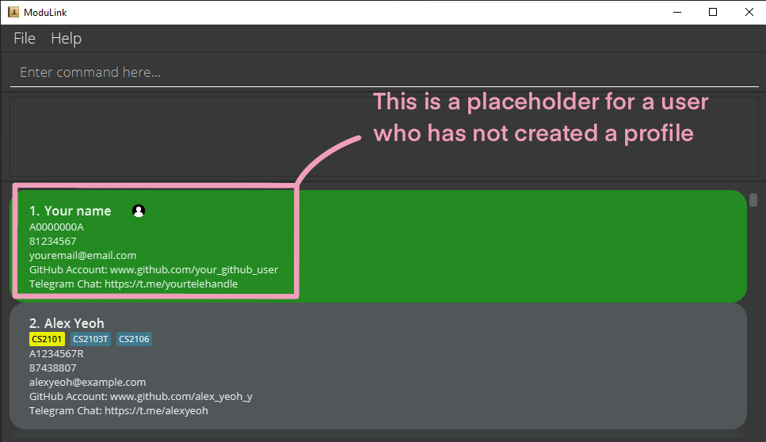
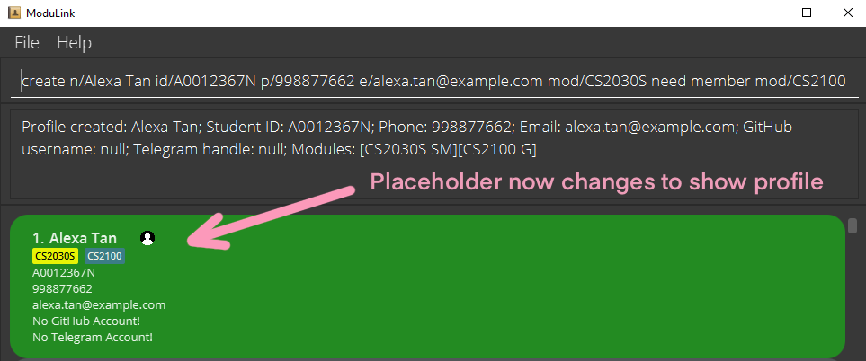
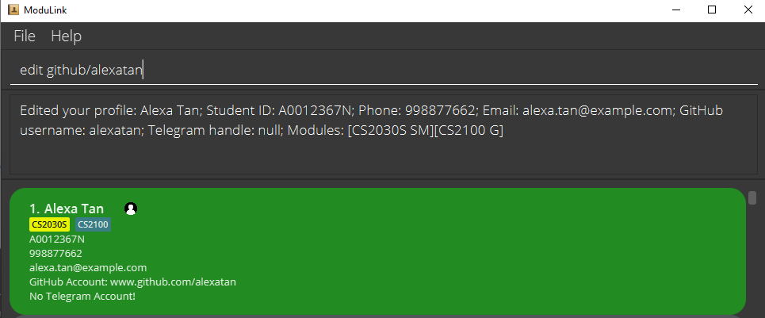
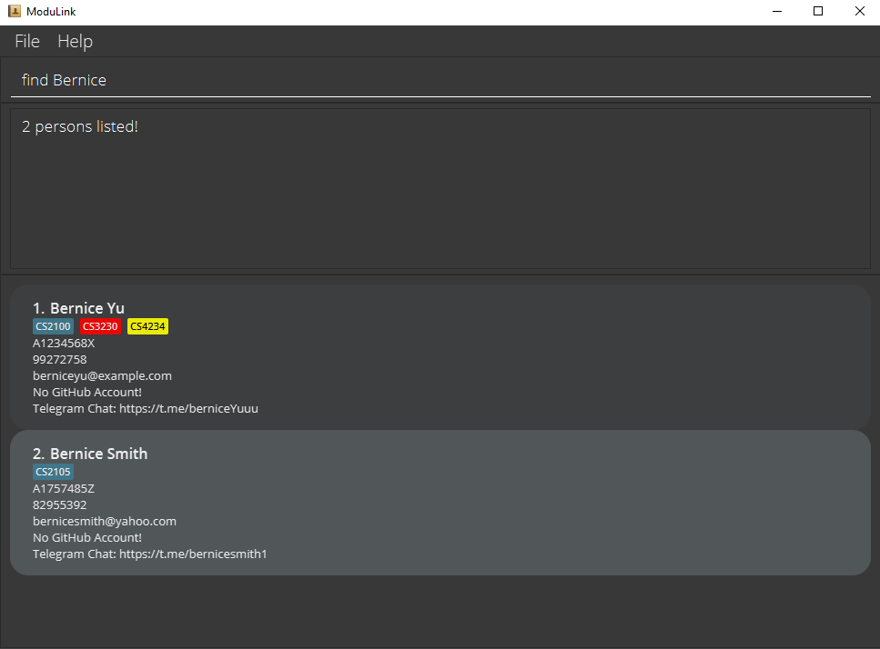
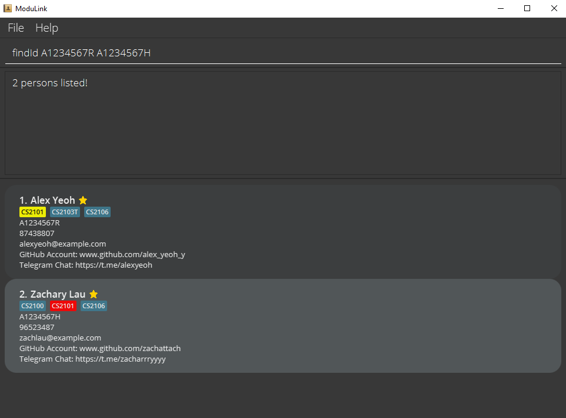
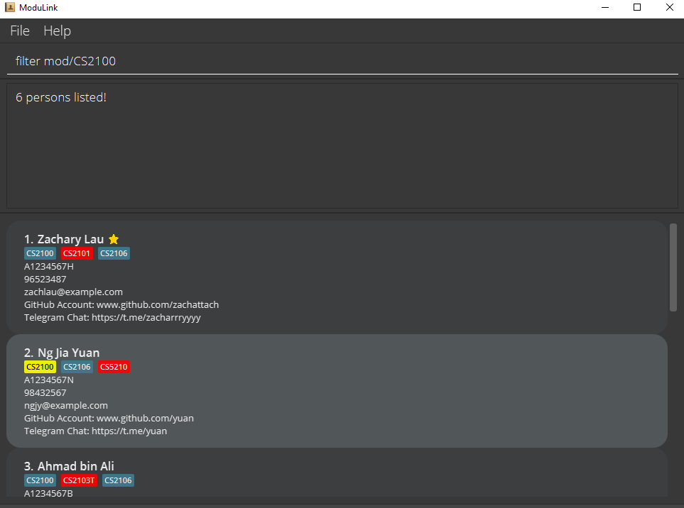
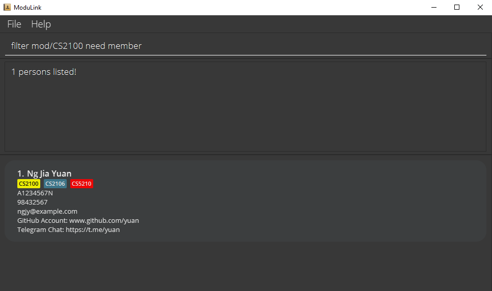

# ModuLink
ModuLink is a **desktop app for CS students to manage contacts, optimized for use via a Command Line Interface** (CLI) while still having the benefits of a Graphical User Interface (GUI). If you are a CS student and you need a platform to connect with your peers and to find project groups, ModuLink is the choice for you.

## User Guide
Here is a reference guide to the features and potential uses of ModuLink.

**Table of Contents**
1. [Quick Start](#quick-start)
2. [Features](#features)
3. [Data Storage in ModuLink](#data-storage-in-modulink)
4. [FAQ](#faq)
5. [Command & Parameter Summary](#parameter--command-summary)

--------------------------------------------------------------------------------------------------------------------

## Quick start

1. Ensure you have Java `11` or above installed in your Computer.

1. Download the latest `modulink.jar` from [here](https://github.com/AY2122S1-CS2103T-W12-4/tp/releases).

1. Copy the file to the folder you want to use as the _home folder_ for your ModuLink.

1. Double-click the file to start the app. The GUI similar to the below should appear in a few seconds. Note how the app contains some sample data. 
   

1. Type the command in the command box and press Enter to execute it. e.g. typing **`help`** and pressing Enter will open the help window. 
   Some example commands you can try:

    * **`create`**`n/John Doe id/A0123456A p/24680135 e/johnd@example.com` : Creates a ModuLink user profile with the name John Doe and the relevant student ID, phone number and email.

    * **`addFav`**`id/A0222594A` : Adds the profile with student ID A0222594A to your ModuLink favourite contacts.

    * **`list`** : Lists all profiles in your ModuLink favourites list.

    * **`find`**`Joseph`: Finds profiles whose names contain the keyword 'Joseph' amongst all profiles in ModuLink.

    * **`filter`**`mod/CS2103T`: Filters to show all profiles taking the CS2103T module.

    * **`filter`**`mod/CS2103T group/SM`: Filters to show all profiles who are taking the CS2103T module and are seeking members.

1. Refer to the [Features](#features) below for details of each command.

--------------------------------------------------------------------------------------------------------------------

## Features

1. [Profiles](#1-profiles)  
   1.1. [Create your own profile](#11-create-your-own-profile--create)  
   1.2. [Edit your profile](#12-edit-your-profile--edit)  
   1.3. [View a profile in a different window](#13-view-a-profile-in-a-different-window--view)  
2. [Manage module tags](#2-manage-module-tags)  
   2.1. [Add modules to your profile](#21-add-modules-to-your-profile--addmod)  
   2.2. [Edit the group status of existing modules on your profile](#22-edit-the-group-status-of-existing-modules-on-your-profile--editgroupstatus)  
   2.3. [Remove modules from your profile](#23-remove-modules-from-your-profile--remmod)  
3. [Manage favourites](#3-manage-favorites)  
   3.1. [Add a profile as a favourite](#31-add-a-profile-as-a-favorite--addfav)  
   3.2. [Remove a profile from favourites list](#32-remove-a-profile-from-favourites-list--remfav)  
4. [Viewing options](#4-viewing-options)  
   4.1. [List all profiles](#41-list-all-profiles--list)  
   4.2. [List all profiles marked as favorite](#42-list-all-profiles-marked-as-favorite--listfav)  
   4.3. [Find profiles by name](#43-find-profiles-by-name--find)  
   4.4. [Find profiles by Student ID](#44-find-profiles-by-student-id--findid)  
   4.5. [Filter profiles by module and group status](#45-filter-profiles-by-module-and-group-status--filter)  
5. [Utility commands](#5-utility-commands) 
   5.1 [Viewing help](#51-viewing-help--help) 
   5.2 [Exiting ModuLink](#52-exiting-modulink--exit) 

**:information_source: Notes about the command format:** 

* Words in `UPPER_CASE` are the parameters to be supplied by the user. 
  e.g. in `add n/NAME`, `NAME` is a parameter which can be used as `add n/John Doe`.

* Items in square brackets are optional. 
  e.g `n/NAME [mod/MODULE]` can be used as `n/John Doe mod/CS2103T` or as `n/John Doe`.

* Items with `…`​ after them can be used multiple times including zero times. 
  e.g. `[mod/MODULE]…​` can be used as ` ` (i.e. 0 times), `mod/CS2100`, `mod/CS2100 mod/CS2103T` etc.

* Parameters can be in any order. 
  e.g. if the command specifies `n/NAME p/PHONE_NUMBER`, `p/PHONE_NUMBER n/NAME` is also acceptable.

* If a parameter is expected only once in the command but you specified it multiple times, only the last occurrence of the parameter will be taken. 
  e.g. if you specify `p/12341234 p/56785678`, only `p/56785678` will be taken.

* Extraneous parameters for commands that do not take in parameters (such as `help`, `list`, `exit` and `clear`) will be ignored. 
  e.g. if the command specifies `help 123`, it will be interpreted as `help`.

### 1. Profiles

#### 1.1 Create your own profile : `create`

Creates your user profile. You can also choose to add modules and indicate your group status for each module. Note, in order to start using ModuLink, you area **required** to create a new profile should you not have one.

Format: `create n/NAME id/STUDENT_ID p/PHONE_NUMBER e/EMAIL [mod/MODULE [GROUP_STATUS]]...`

**:information_source: Notes:**
* STUDENT_ID must be unique
* The group statuses available are: Need member, Need group, Don't need group/Not looking for group.
* The default status when a module is added without a description is 'Don't need group/Not looking for group'. The respective module will be displayed as a blue tag.
* To indicate you need members for your group, you can specify any phrase that includes 'member'. The respective module will be displayed as a yellow tag.
* To indicate you are looking for a group, you can specify any phrase that includes 'group'. The respective module will be displayed as a red tag.

Examples:
* `create n/John Doe id/A0222594A p/12345678 e/john.doe@example.com mod/CS2103T`
* `create n/Jane Doe id/A0222594A p/87654321 e/jane_doe@example.com mod/CS2101 need a member`
* `create n/Alexa Tan id/A0012367N p/998877662 e/alexa.tan@example.com mod/CS2030S need member mod/CS2100`
     
     

#### 1.2 Edit your profile : `edit`

Edits your own profile. You can choose to edit any attributes in your own profile. You can edit multiple attributes at once.

Format: `edit EDITED_ATTRIBUTE [MORE ATTRIBUTES]`

Examples:
* `edit p/123321432 e/changedemail@example.com`
     
   

#### 1.3 View a profile in a different window : `view`

Displays the user-specified profile in a pop-up window.

Format: `view STUDENT_ID`

Examples:
* `view A0123456L`
* `view A1122334F`
   
   
  (Insert screenshots here)

### 2. Manage module tags

#### 2.1 Add modules to your profile : `addMod`

Adds the user-specified module(s) to your own profile.

Format: `addMod mod/MODULE [GROUP_STATUS] [mod/MODULE [GROUP_STATUS]]...`

Examples:
* `addMod mod/CS2103T Need a member mod/CS1231S`
* `addMod mod/CS2101`
   
   
  (Insert screenshots here)

#### 2.2 Edit the group status of existing modules on your profile : `editGroupStatus`

Edits the group status of user-specified module(s).

Format: `editGroupStatus mod/MODULE [updateStatus/NEW_STATUS_DESCRIPTION] [mod/MODULE [updateStatus/NEW_STATUS_DESCRIPTION]]...`

**:information_source: Notes:**
* If no updated status description is given, the group status is set to the default 'Don't need group/Not looking for group'.

Examples:
* `editGroupStatus mod/CS2103T updateStatus/Need a member`
* `editGroupStatus mod/CS2101`
   
   
  (Insert screenshots here)

#### 2.3 Remove modules from your profile : `remMod`

Removes the user-specified module(s) from your own profile.

Format: `remMod mod/MODULE [mod/MODULE]...`

Examples:
* `remMod mod/CS2103T`
* `remMod mod/CS2100`
   
   
  (Insert screenshots here)

### 3. Manage favorites

#### 3.1 Add a profile as a favorite : `addFav`

Adds a profile to your favourites list.

Format: `addfav STUDENT_ID`

Examples:
* `addfav A0222594A`
* `addfav A1234967R`
   
   
  

### 3.2 Remove a profile from favourites list : `remFav`

Removes a user-specified profile from the favourites list.

Format: `remfav STUDENT_ID`

Examples:
* `remove A0212345X`
* `remove A1234567R`
   
   
  

### 4. Viewing options

#### 4.1 List all profiles : `list`

Shows a list of all profiles in ModuLink.

Format: `list`
     
     

#### 4.2 List all profiles marked as favorite : `listFav`

Shows a list of all profiles that the user has added to their favourites list.

Format: `listfav`
 
 

#### 4.3 Find profiles by name : `find`

Finds profiles whose names contain any of the entered keywords.

Format: `find KEYWORD [MORE_KEYWORDS]`

* The search is not case-sensitive. e.g hans will match Hans
* The order of the keywords does not matter. e.g. Hans Bo will match Bo Hans
* Only the name is searched.
* Only full words will be matched e.g. Han will not match Hans
* Profiles matching at least one keyword will be returned (i.e. OR search).

Examples:
* `find John` returns `John` and `John Doe`
* `find bernice` returns `Bernice Yu`
* `find alex david` returns `Alex Berenson` and `David Li`
   
   
  

#### 4.4 Find profiles by student ID : `findId`

Finds profiles whose student ID number matches any of the entered keywords.

Format: `findId KEYWORD [MORE_KEYWORDS]`

* The search is not case-sensitive. e.g a0123456a will match A023456A
* The order of the keywords does not matter. e.g. `findId A0123456A A0654321A` will show the profiles whose student Id number matches either A0123456A or A0654321A.
* Only the student ID numbers are searched.
* Profiles matching any keywords will be returned.

Examples:
* `findId A1204567S` returns the person whose student ID number matches A1204567S
* `findId A0123456A A0654321A` returns the profiles whose student ID number matches either A0123456A or A0654321A.
   
   
  

#### 4.5 Filter profiles by module and group status : `filter`

Show profiles filtered by module code and _optionally_ by group status.

Format: `filter mod/MODULE_CODE [group/GROUP_STATUS]`

* `OPTIONAL_GROUP_STATUS` enumerates the following: { `SG`: seeking group, `SM`: seeking member, `G`: in a group, `NG`: no group }
* `MODULE_CODE` is required for filtering by group status. The filter will return the profiles with the specified group status of the specified module.

Examples:
* `filter mod/CS2030`
* `filter mod/CS2030 group/SM`
* `filter mod/CS2030 group/SG`
   
   
  
   
   
  

### 5. Utility commands

#### 5.1 Viewing help : `help`

Shows a message explaning how to access the help page.

Format: `help`
 
 

#### 5.2 Exiting ModuLink : `exit`

Exits the program.

Format: `exit`

## Data Storage in ModuLink

### Saving the data

ModuLink's data is saved in the hard disk automatically after any command that changes the data. There is no need to save manually.

### Editing the data file

ModuLink's data are saved as a JSON file `[JAR file location]/data/modulink.json`. Advanced users are welcome to update data directly by editing that data file.

:exclamation: Caution:
If your changes to the data file makes its format invalid, ModuLink will discard all data and start with an empty data file at the next run.

--------------------------------------------------------------------------------------------------------------------

## FAQ

**Q**: How do I transfer my data to another Computer? 
**A**: Install the app in the other computer and overwrite the empty data file it creates with the file that contains the data of your previous ModuLink home folder.

--------------------------------------------------------------------------------------------------------------------

## Parameter & Command summary

### Parameter summary

Prefix | Parameter
-------|-----------
**`n/`** | NAME
**`id/`** | STUDENT ID
**`p/`** | PHONE NUMBER
**`e/`** | EMAIL
**`mod/`** | MODULE
**`group/`** | GROUP STATUS

### Command summary

Action | Format, Examples
-------|-----------------
**Create** | `create n/NAME id/STUDENT_ID p/PHONE_NUMBER e/EMAIL [mod/MODULE [GROUP STATUS]]...`   e.g., `create n/John Doe id/A0222594A p/12345678 e/john.doe@example.com mod/CS2100`
**Edit** | `edit EDITED_ATTRIBUTE [MORE ATTRIBUTES]`, `edit p/123321432 e/changedemail@example.com`
**View** | `view STUDENT_ID`, `view A1234567R`
**Add module** | `addMod mod/MODULE [GROUP_STATUS] [mod/MODULE [GROUP_STATUS]]...`, `addMod mod/CS2103T Need a member mod/CS1231S`
**Edit module group status** | `editGroupStatus mod/MODULE [updateStatus/NEW_STATUS_DESCRIPTION] [mod/MODULE [updateStatus/NEW_STATUS_DESCRIPTION]]...`, `editGroupStatus mod/CS2103T updateStatus/Need a member`
**Remove module** | `remMod mod/MODULE [mod/MODULE]...`, `remMod mod/CS2100 mod/CS2103T`
**Add Favourite** | `addFav STUDENT_ID`   e.g., `addFav A0222594A`
**Remove Favourite** | `remFav STUDENT_ID`   e.g., `remFav A0222594A`
**List** | `list`
**List favorites** | `listFav`
**Find by name** | `find KEYWORD [MORE_KEYWORDS]`   e.g., `find alex david` returns `Alex Yeoh, David Li`
**Find by student ID** | `findId KEYWORD [MORE_KEYWORDS]`   e.g., `findId A0222594A` returns person with student Id matching A0222594A.
**Filter** | `filter mod/MODULE_CODE [group/GROUP_STATUS]`  e.g. no group filter: `filter mod/CS2030` with group filter: `filter mod/CS2030 group/SM`
**Help** | `help`
**Exit** | `exit`
