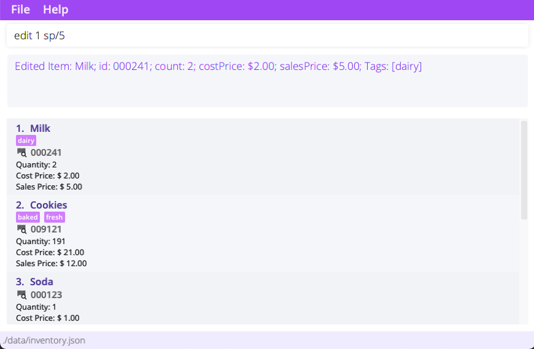
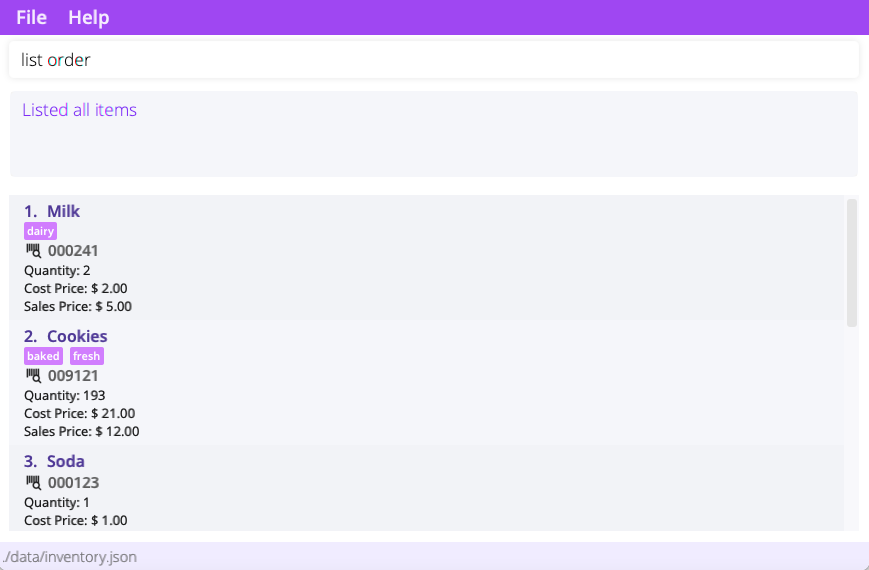
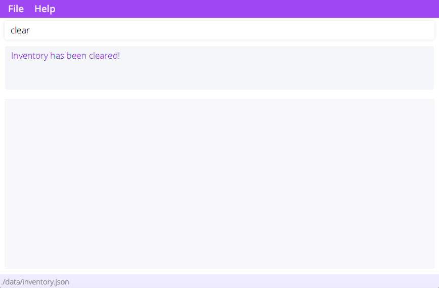
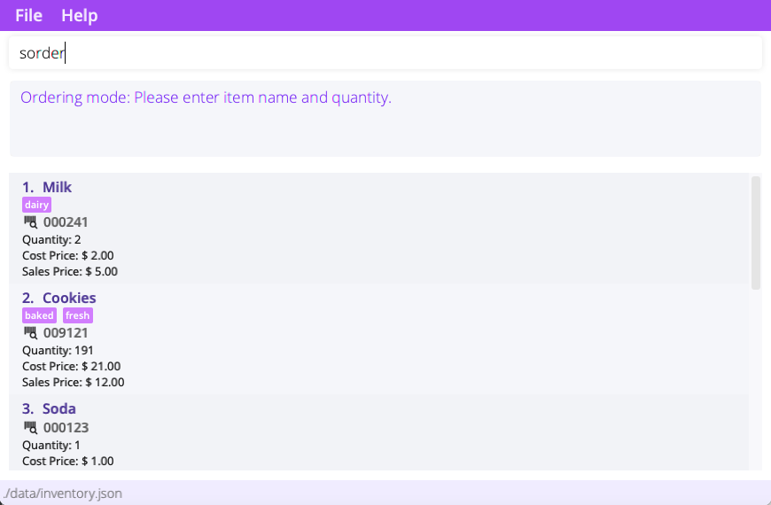
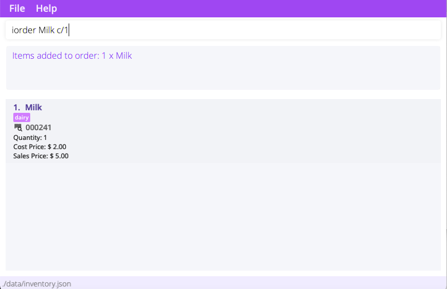
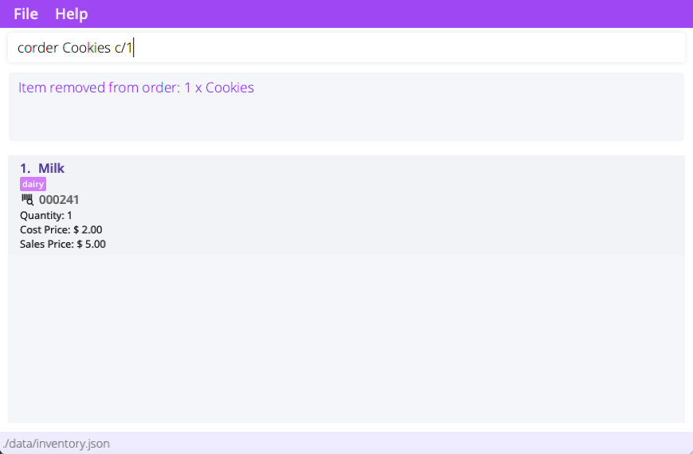

**BogoBogo User Guide**{: .text-purple-000 .text-alpha }

_What is BogoBogo?_{: .text-gamma}

BogoBogo is a **desktop app for small business owners to manage inventories, optimized for use via a Command Line
Interface (CLI)**
while still having the benefits of a Graphical User Interface (GUI). If you can type fast, BogoBogo can get your
inventory management tasks done faster than traditional GUI apps.

With BogoBogo, business owners can:

1. manage inventories
2. record customer orders
3. track profit, costs, and revenue

  

    Table of contents
  

  {: .text-delta }
1. TOC
{:toc}

--------------------------------------------------------------------------------------------------------------------

## Getting started

1. Ensure you have Java `11` or above installed in your Computer.

2. Download the latest `BogoBogo.jar` from [here](https://github.com/AY2122S1-CS2103-F10-2/tp/releases).

3. Move the file to the folder you want to use as the _home folder_ for the application.

4. Double-click the file to start the app. The GUI similar to the below should appear in a few seconds. Note how the app
   contains some sample data. 
   

:bulb:
You might have to give your device permission to open BogoBogo.

6. Let's try adding a new item! Enter the command in the command box. 

    - **`add`** `Apple id/139827 c/3 cp/1.3 sp/2.4` : Adds an apple with id 139827, cost price 1.3, and sales price 2.4,
      into the inventory.

7. Congrats on setting up BogoBogo! Read our [features](#managing-inventory) to learn about the different things you can
   do on the application.

:bulb:
Ready to jump right into recording your inventory? Use <code>clear</code> to clear the sample data!

8. To close BogoBogo, simply enter `exit` into the command box.

--------------------------------------------------------------------------------------------------------------------

## Managing Inventory

<b>:information_source: Notes about the command format:</b> 
<ul>
    <li>
      
Words in <code>{}</code> are the parameters to be supplied by the user. 
      e.g. in <code>add {name}</code>, <code>name</code> is a parameter which can be used as <code>add milk</code>.

    </li>
    <li>
      
Parameter prefixes such as <code>sp/</code> and <code>cp/</code> are special keywords that indicate a start of a parameter.

    </li>
    <li>
      
Parameters in <code>()</code> are optional. 
      e.g. in <code>add {name} (c/{count})</code>, the <code>count</code> parameter can be omitted from the command.

    </li>
    <li>
      
Items in <code>[]</code> with <code>|</code>(vertical slash) are exclusively optional (user must specify at least one of the options). 
      e.g <code>delete [{name} | id/{id_number}]</code> should be supplied with either <code>name</code> or <code>id number</code>.

    </li>
    <li>
      
Items with <code>…​</code> after them can be specified zero or more times. 
      e.g. <code>[t/TAG]…​</code> can be used as <code>t/popular t/baked</code> 

    </li>
    <li>
      
Prefixed parameters can be in any order. 
      e.g. <code>id/{id number} cp/{cost price}</code> and <code>cp/{cost price} id/{id number}</code> mean the same thing.

    </li>
    <li>
      
If a parameter is expected only once in the command is specified multiple times, only the last occurrence of
      the parameter will be taken. 
      e.g. if you specify <code>id/123413 id/567856</code>, only <code>id/567856</code> will be taken.

    </li>
    <li>
      
Extraneous parameters for commands that do not take in parameters (such as <code>help</code>, <code>exit</code> and <code>clear</code>) will be
      ignored. 
      e.g. if the command specifies <code>help 123</code>, it will be interpreted as <code>help</code>.

    </li>
</ul>

### Viewing help : `help`

Gives a quick link to this user guide. If a command word is specified, it'll explain how to use the specified command
instead.

Format:

- `help`: Shows help page url.
- `help {command}` : Explains how to use the specified command.

Examples:

- `help list` offers information regarding the `list` command.

### Adding items: `add`

Adds an item to the inventory.

Format: `add [{name} | id/{id number}] (c/{count}) (cp/{cost price}) (sp/{sell price}) (t/{tag})...`

Prefix  |  Argument     | Description                   | Remarks                                                  |
--------|-------------- |-------------------------------|----------------------------------------------------------|
&nbsp;  | name          | Name of the item to add.      | Only alphanumeric characters (and spaces) are allowed.   |
`id/`   | id number     | Id number of item to add.     | Must be an integer with no more than 6 digits.                               |
`c/`    | count         | Quantity of the item to add.  | Must be an integer, default value is 1.                  |
`cp/`   | cost price    | Cost price of the item to add.| Must be a positive number.                               |
`sp/`   | sell price    | Sell price of the item to add.| Must be a positive number.                               |
`t/`    | tag(s)        | Tags of the item to add.      | Only alphanumeric characters are allowed.                |

:information_source: When adding an item for the first time, the name, id, cost price, and sales prices must all be specified.

Examples:

- `add apple` adds an apple into the inventory
- `add id/111111 c/2` adds 2 of item with id #111111 into the inventory
- `add banana id/192023 cp/1.0 sp/2.2` adds a banana (#192023) with cost price $1 and sales price $2.20 into the
  inventory.

:information_source: BogoBogo will get confused if different items have matching names or id. Hence, adding different items with clashing names/ids are is not supported.

### Deleting items : `delete`

Deletes **all** the specified item from the inventory. Use this command to delete items wrongly keyed into the inventory. Costs
initially incurred from the item will be removed too.

Format: `delete [{name} | id/{id number}]`

Prefix  |  Argument      | Description                  | Remarks
--------|----------------|------------------------------|--------------------------------
&nbsp;  | name           | Name of the item to delete.  | Only alphanumeric characters (and spaces) are allowed.
`id/`   | id number      | Id number of item to delete. | Must be an integer with no more than 6 digits.

- Delete the specified item entirely from the inventory.
- An item can be specified by name,{id number , or both.

- `delete Apple` deletes by name
- `delete id/181817` deletes by id number

### Removing items : `remove`

Removes a specified amount of a particular item from the inventory.

Format: `remove [ {name} | id/{id number} ] c/{count}`

Flag    |  Argument      | Description                      | Remarks                                 |
--------|----------------|----------------------------------|-----------------------------------------|
&nbsp;  | name           | Name of the item to remove.      | Only alphanumeric characters (and spaces) are allowed.                                         |
`id/`   | id number      | Id number of the item to remove. | Must be an integer with no more than 6 digits.                                        |
`c/`    | count          | Quantity of the item to remove.  | Must be an integer, default value is 1. |

- An item can be specified by name, id number, or both.

Examples:

- `remove Apple` removes **one** apple from inventory
- `remove id/181817 c/5` removes 5 items with id 181817

### Editing an item : `edit`

Edit a particular item in the inventory. Note that display must be in inventory mode (see [`list`](#listing-items-list))
.

Format: `edit {index} (n/{name}) (id/{id}) (cp/{cp}) (sp/{sp}) (t/{tag})...`

Flag    |  Argument     | Description                     | Remarks
--------|---------------|---------------------------------|-------------------------
&nbsp;  | index         | index of the item to edit.      | Index is 1 based.
`n/`    | name          | new name for the item.          | Only alphanumeric characters (and spaces) are allowed.
`id/`   | id number     | new id number for the item.     | Must be an integer with no more than 6 digits.
`cp/`   | cost price    | new cost price for the item.    | Must be a positive number.
`sp/`   | sell price    | new sell price for the item.    | Must be a positive number.
`t/`    | tag           | new tag(s) for the item.        | Only alphanumeric characters are allowed.

- Feel free to edit multiple fields at once!
- Count cannot be edited, use `add`, `delete` or `remove` instead.

:exclamation:  When editing tags, old tags will be overwritten!

Examples:

- `edit 1 id/192028` edits first item's id to #192028
- `edit 2 n/Panadol cp/2`  edits second item's name to "Panadol" and cost price to $2

### Listing items: `list`

List items in the inventory, current order, or past transactions.

Format:

- `list`: List items in the inventory.
- `list order`: List items in the current order (if any).
- `list txns`: List past transactions, along with total costs, revenue and profit.
- `list txns {id}`: List items in the specified transaction.

:question:  <b>Where can I find the transaction id?</b> 
The transaction id can be found to the right of the transaction timestamp when you <code>`list txns</code>.

### Sorting items: `sort`

Sort items in the inventory. Note that display must be in inventory mode (see [`list`](#listing-items-list)).

Format:

- `sort n/`: Sort items in the inventory by name.
- `sort c/`: Sort items in the inventory by count.

### Finding items: `find`

Find items in the inventory. Note that display must be in inventory mode (see [`list`](#listing-items-list)).

Format: `find [ n/{name}... | id/{id}... | t/{tag}... ]`

BogoBogo searches and lists items in the inventory that has matches any of the specified name, id, or tag.

Examples:

- `find n/Cookie n/Apple` finds and lists items with the words "Cookie" or "Apple" in their names
- `find id/123456` finds item with id 123456

### Clearing items: `clear`

Clears the entire inventory.

Format: `clear`

:exclamation: Be careful with this command! Clearing an inventory will not only clear the inventory but delete data regarding items' details. 

## Managing orders

Orders is BogoBogo's way of tracking sold items. Users can create orders, process, and save them for later review. By
processing an order, the revenue attained will be added into total revenue.

:exclamation: Be sure not to close BogoBogo without saving your order! Any unsaved order will be lost. 

The workflow of the order system is as follows:
* Use `sorder` to enter ordering mode.
* Use `iorder` to add items into your order.
* Use `corder` to remove items from your order.
* Use `eorder` to place your order.
* Use `list order` to see current items in your order (see [`list`](#listing-items-list)).

### Start ordering: `sorder`

Starts a new order and enters ordering mode.

Format: `sorder`

### Adding an item into order: `iorder`

Add an item into the current order. BogoBogo will let you know if there isn't enough items in the inventory to fulfill
the order request.

:bulb: Once having added items, you can view your current order with <code>list order</code>.

Format:
`iorder [ {name} | id/{id} ] (c/{count})`

Flag    |  Argument      | Description                            | Remarks                                         |
--------|----------------|----------------------------------------|-------------------------------------------------|
&nbsp;  | name           | Name of the item to add to order.      | Only alphanumeric characters (and spaces) are allowed.                                                |
`id/`   | id number      | Id number of the item to add to order. | Must be an integer with no more than 6 digits.                                                |
`c/`    | count          | Quantity of the item to add to order.  | Must be a positive integer, default value is 1. |

Examples:

- `iorder milk c/5`  Adds 5x milk into the current order
- `iorder id/12345`  Adds 1x item with id 12345 into the current order

### Cancelling an item in the order: `corder`

Cancels the specified order from the current order.

Format:
`corder [ {name} | id/{id} ] (c/COUNT)`

Flag    |  Argument      | Description                                 | Remarks                                         |
--------|----------------|---------------------------------------------|-------------------------------------------------|
&nbsp;  | name           | Name of the item to remove from order.      | Only alphanumeric characters (and spaces) are allowed.                                                |
`id/`   | id number      | Id number of the item to remove from order. | Must be an integer with no more than 6 digits.                                                |
`c/`    | count          | Quantity of the item to remove from order.  | Must be a positive integer, default value is 1. |

Examples:

- `corder milk c/5` Removes 5x milk from the order
- `corder id/12345` Removes 1x item with id 12345 from the order

### End ordering: `eorder`

Processes the current order and saves it.

Format: `eorder`

--------------------------------------------------------------------------------------------------------------------

## FAQ

**Q**: What is total profit, cost and revenue? 
**A**: Total cost is the total amount of money incurred from adding items to the inventory. Revenue is the total amount
of money gained from successfully selling items. Profit = Revenue - Cost.

**Q**: I have edited the cost price of my item. Why isn't the change reflected in my total cost? 
**A**: BogoBogo adds the cost of an item to the total cost only upon the addition of the item into the inventory. Any
changes to cost price is assumed to be for future restocking of the item. 

**Q**: Why can't I edit the count of an item with `edit`? 
**A**: Due to the calculation of total cost and revenue, BogoBogo needs to know the reason for the change in count.
Use `add` for stocking items, `delete` to delete accidentally added items, `remove` to remove unsold items (e.g. expired
goods), and `iorder` to account for sold items.

**Q**: My business is really growing lately, why does my BogoBogo calculation of revenue, profit, and cost seem wrong? 
**A**: BogoBogo was built for small businesses in mind. On that note, it doesn't calculate revenue and cost beyond $999,999,999. 
Consider hiring an accountant Mr Billionaire!
--------------------------------------------------------------------------------------------------------------------

## Command summary

- **Add Item**: `add [ {name} \| id/{id number} ] (c/{count}) (cp/{cost price}) (sp/{sell price}) (t/{tag})...`
- **Delete Item**: `delete [ -n {name} \| id/{id number} ]`
- **Remove Item**: `remove [ {name} \| id/{id number} ] (c/{count})`
- **List**: `list [ \| order \| txns \| txns {id} ]`
- **Sort Items**: `sort n/` or `sort c/`
- **Find Items**: `find [ n/{name}... \| id/{id}... \| t/{tag} ]`
- **Start an order**: `sorder`
- **Add item to order**: `iorder [ {name} \| id/{id number} ] (c/{count})`
- **Remove item from order**: `corder [-n {name} \| id/{id number}] (c/{count}`
- **End the order**: `eorder`
- **Exit BogoBogo**:`exit`
