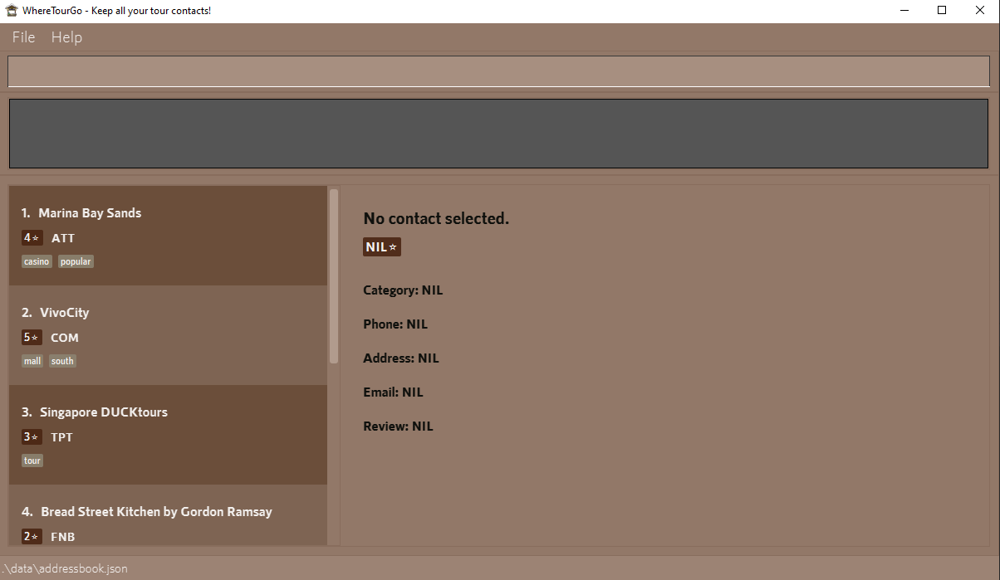
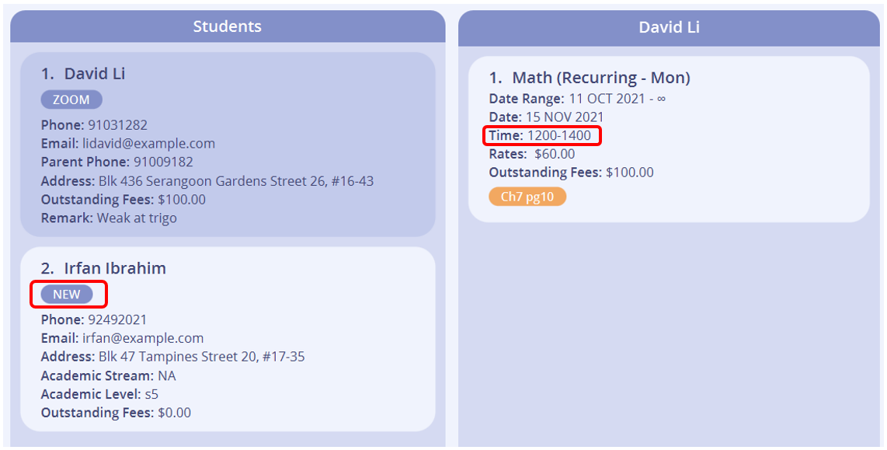

<h2 align ="center"> WhereTourGo: A Tour Guide’s Best Friend! </h2>

**WhereTourGo (WTG)** is a desktop app for managing your tour contacts, optimized for use via a Command Line Interface (CLI) while still having the benefits of a Graphical User Interface (GUI).

The app helps the tour guides easily collate and access contacts of a variety of several services such as F&B, accommodations, attractions etc.

If you can type fast, WTG can get your contact management tasks done faster than traditional GUI apps.

This User Guide will help you set up your contact list and familiarise yourself with the features of WhereTourGo.

## Table of Contents

* [Quick Start](#quick-start)
* [About](#about)
* [Features](#features)
  * [Restrictions](#restrictions)
  * Modifying Contacts
    * [Adding a contact: `add`](#adding-a-contact-add)
    * [Editing a contact: `edit`](#editing-a-contact-edit)
    * [Deleting a contact: `delete`](#deleting-a-contact-delete)
  * Viewing Contacts
    * [Listing all contacts: `list`](#listing-all-contacts-list)
    * [Locating contacts: `find`](#locating-contacts-find)
    * [Filtering by category: `filter`](#filtering-contacts-filter)
    * [Sorting contacts: `sort`](#sorting-the-contacts-sort)
    * [Summarizing contacts: `sum`](#summarizing-contacts-sum)
    * [Viewing a contact : `view`](#viewing-a-contact-view)
    *
  * Others
    * [Undoing operations : `undo`](#undoing-operations-undo)
    * [Redoing operations : `redo`](#redoing-operations-redo)
    * [Navigating input history](#navigating-input-history)
    
  * Help
    * [Viewing help: `help`](#viewing-help-help)
    * [Displaying commands: `cmd`](#displaying-commands-cmd)
  * Managing Data
    * [Exporting data: `export`](#exporting-data-export)
    * [Clearing all entries : `clear`](#clearing-all-entries-clear)
    * [Saving the data](#saving-the-data)
    * [Editing the data file](#editing-the-data-file)
  * [Exiting the program : `exit`](#exiting-the-program-exit)

    
* [FAQ](#faq)
* [Command Summary](#command-summary)

--------------------------------------------------------------------------------------------------------------------

## Quick start

1. Download the latest `wheretourgo.jar` from [here](no link for now)

1. Copy the file to the folder you want to use as the _home folder_ for your WhereTourGo

1. Double-click the file to start the app. The GUI similar to the below should appear in a few seconds. Note how the app contains some sample data 
   

1. Type the command in the command box and press Enter to execute it. e.g. typing **`help`** and pressing Enter will open the help window 
   Some example commands you can try:

    * **`list`** : Lists all contacts

    * **`add`**`c/att n/Mandarin Oriental p/98765432 e/Mandarin_Oriental@example.com a/Marina Bay Sands, Singapore 123432` : Adds a contact named `Mandarin Oriental`

    * **`delete`**`3` : Deletes the 3rd contact shown in the current list

    * **`clear`** : Deletes all contacts

    * **`exit`** : Exits the app

1. Refer to the [Features](#features) below for details of every command

--------------------------------------------------------------------------------------------------------------------

## Features

**:information_source: Notes about the command format:** 

* Words in `UPPER_CASE` are the parameters to be supplied by the user 
  e.g. in `add n/NAME`, `NAME` is a parameter which can be used as `add n/Mandarin Oriental`.

* Items in **square brackets** are **optional** 
  e.g `n/NAME [t/TAG]` can be used as `n/Mandarin Oriental t/hotel` or as `n/Mandarin Oriental`.

* Items with `…`​ after them can be used multiple times including zero times 
  e.g. `[t/TAG]…​` can be used as ` ` (i.e. 0 times), `t/food`, `t/wine t/food` etc.

* Parameters can be in any order 
  e.g. if the command specifies `n/NAME p/PHONE_NUMBER`, `p/PHONE_NUMBER n/NAME` is also acceptable.

* If a parameter is expected only once in the command but you specified it multiple times, only the last occurrence of the parameter will be taken 
  e.g. if you specify `p/12341234 p/56785678`, only `p/56785678` will be taken.

* Extraneous parameters for commands that do not take in parameters (such as `help`, `list`, `exit` and `clear`) will be ignored 
  e.g. if the command specifies `help 123`, it will be interpreted as `help`.

*Duplicate contact names are not allowed
  e.g. if there exists a contact named ‘Marina Bay Sands’, adding or editing a contact with the name ‘Marina Bay Sands’ is not allowed. 

### Viewing help: `help`

Opens the User Guide in the Browser.

Format: `help`

### Adding a contact: `add`

Adds a contact to the contact list.

Format: `add c/CATEGORY_CODE n/CONTACT_NAME p/PHONE_NUMBER e/EMAIL a/ADDRESS [rv/REVIEW] [ra/RATING] [t/TAG]…​​`

Category Code:
* Attraction: `att`
* F&B: `fnb`
* Commerce: `com`
* Accomodation: `acc`
* Transport: `tpt`
* OTHERS: `oth`

:bulb: Tip:
A contact can have any number of tags (including 0)

:bulb: Tip:
A contact can have a review

Examples:
* `add c/att n/Singapore Flyers p/92345678 e/123@example.com a/30 Raffles Ave, Singapore 039803 ra/4`

Expected Outcome for `add c/att n/Singapore Flyers p/92345678 e/123@example.com a/30 Raffles Ave, Singapore 039803 ra/4` :

### Listing all contacts: `list`

Shows a list of all contacts in the contact list.

Format: `list`

### Editing a contact: `edit`

Edits an existing contact in the contact list.

Format: `edit INDEX [n/NAME] [p/PHONE] [e/EMAIL] [a/ADDRESS] [rv/REVIEW] [ra/RATING]  [t/TAG]…​`

* Edits the contact at the specified `INDEX`. The index refers to the index number shown in the displayed contact list. The index **must be a positive integer** 1, 2, 3, …​
* At least one of the optional fields must be provided
* Existing values will be updated to the input values
* When editing tags, the existing tags of the contact will be removed i.e adding of tags is not cumulative
* You can remove all the contact’s tags by typing `t/` without
  specifying any tags after it

Examples:
*  `edit 1 p/92345678 e/Mandarin_Oriental@example.com` Edits the phone number and email address of the 1st contact to be `92345678` and `Mandarin_Oriental@example.com` respectively
*  `edit 2 n/Marina Bay Sands t/` Edits the name of the 2nd contact to be `Marina Bay Sands` and clears all existing tags
* `edit 3 ra/3` Edits the rating of the 3rd contact to be `3`

Expected Outcome for `edit 1 p/92345678 e/Mandarin_Oriental@example.com`:

Before:

After:

### Locating contacts: `find`

Finds contacts whose names, addresses, phone numbers, email addresses or reviews contain any of the given keywords.

Format: `find KEYWORD [MORE_KEYWORDS]`

* The search is case-insensitive, e.g.,  `hotel` will match `Hotel`
* The order of the keywords does not matter. e.g. `Park Hyatt` will match `Hyatt Park`
* The name, phone, email, address and review will be searched
* Contacts matching at least one keyword will be returned . e.g. `Park` will return `Park Hyatt Singapore`, `Park Royale`

Examples:
* `find hotel` returns `D’ Hotel` and `Shangri-La Hotels and Resorts`
* `find bay` returns `Gardens by the Bay` and `Marina Bay Sands`

Expected Outcome for `find bay`:

### Deleting a contact: `delete`

Deletes the specified contact from the contact list, either by name or index.

Format: `delete INDEX`

* Deletes the contact at the specified INDEX
* The index refers to the index number shown in the displayed contact list
* The index must be a positive integer 1, 2, 3, ...

Examples:
* `list` followed by `delete 2` deletes the 2nd contact in the contact list
* `find Mandarin Oriental` followed by `delete 1` deletes the 1st contact in the results of the find command

Format: `delete FULL_NAME`

* Deletes the contact specified by FULL_NAME
* The name must refer to a contact’s full name in the displayed contact list
* The name is case-sensitive and must match exactly

Examples:
* `list` followed by `delete Singapore DUCKTours` deletes the contact with name ' Singapore DUCKTours’
* `find shangri-la` followed by `delete Shangri-La Hotels & Resorts` deletes the contact with name 'Shangri-La Hotels & Resorts'

### Filtering contacts: `filter`
Shows a list of all contacts in the specified category or with the specified rating.

Format: `filter [c/CATEGORY] [ra/NUMBER] ... `

Category codes:
* Attraction :`c/att`
* F&B :`c/fnb`
* Commerce :`c/com`
* Accommodation :`c/acc`
* Transport :`c/tpt`
  Ratings :
* 1-star : `ra/1`
* 2-star : `ra/2`
* 3-star : `ra/3`
* 4-star : `ra/4`
* 5-star : `ra/5`

:bulb: Tip:
You can filter contacts in one or many categories

Examples:
* `filter c/fnb` returns McDonald's, KFC, and Burger King (all F&B contacts)
* `filter c/acc c/fnb` returns Mandarin Oriental, Hotel81, and KFC (all accommodation and F&B contacts)
* `filter ra/3` returns all contacts with 3-star rating from all categories
* `filter c/fnb ra/3` returns all F&B contacts with 3-star rating

Expected Outcome for `filter c/fnb`:

### Undoing operations: `undo`
Undoes the last change made to the list of contacts.

Format: `undo`

Examples :
* If you execute the command `delete Marina Bay Sands`, then execute the command `undo` , the Marina Bay Sands contact will be restored

### Redoing operations: `redo`
Redoes the last change undone on the list of contacts.

Format: `redo`

Examples :
* If you execute the command `delete Marina Bay Sands`, then execute the command `undo` , the Marina Bay Sands contact will be restored.
If you then execute `redo` , the Marina Bay Sands contact will be deleted again

### Sorting the contacts: `sort`
Sorts the list of contacts in a specified order. The sort feature is sorted by Contact name (in alphabetical order) or by Rating (in descending order).

Format : `sort FIELD`

Examples :
* `sort name` returns the same list of contacts displayed in an alphabetical order
* `sort rating` returns the same list of contacts displayed from the contacts with the highest to lowest rating

### Summarizing contacts: `sum`
Shows a summary of the content of WhereTourGo. The data presented as a summary are as follows:
* number of contacts in the contact list
* the percentage of contacts that have a review
* the number of contacts in each category defined by `CategoryCode`

Format: `sum`

Expected Outcome for `sum`:
  ADD A SCREENSHOT HERE !!!!!!!!!!!!!!!!!!!!!!!

### Viewing a contact: `view`

Displays the specified contact from the contact list.

Format: `view INDEX`

* Displays the contact at the specified INDEX
* The index refers to the index number shown in the displayed contact list
* The index must be a positive integer 1, 2, 3, ...

Examples:
* `list` followed by `view 2` displays the 2nd contact in the contact list
* `find Mandarin Oriental` followed by `view  1` displays the 1st contact in the results of the find command

Format: `view FULL_NAME`

* Displays the contact specified by FULL_NAME
* The name must refer to a contact’s full name in the displayed contact list
* The name is case-sensitive and must match exactly

Examples:
* `list` followed by `view Marina Bay Sands` displays the contact with name 'Marina Bay Sands'
* `find Gardens By The Bay` followed by `view Gardens By The Bay` displays the contact with name 'Gardens By The Bay'

### Exporting data: `export`

Exports all the contacts from the contact list to a well-formatted `.txt` file.

Format: `export`
* Exports the specified contact from the contact list

Format: `export INDEX`

* Exports the contact at the specified INDEX
* The index refers to the index number shown in the displayed contact list
* The index must be a positive integer 1, 2, 3, ...

Examples:
* `list` followed by `export 2` exports the 2nd contact in the contact list
* `find Mandarin Oriental` followed by `export  1` exports the 1st contact in the results of the find command

ADD A SCREENSHOT HERE !!!!!!!!!!!!!!!!!!!!!!! (show exported file?)

### Displaying commands: `cmd`
Displays a list of the commands used in WhereTourGo, along with their functionalities.

Format: `cmd`

### Clearing all entries: `clear`

Clears all entries from the contact list.

Format: `clear`

### Exiting the program: `exit`

Exits the program.

Format: `exit`

### Navigating input history
When typing commands, you can use the up and down arrow keys to access previously entered inputs.

### Saving the data

WhereTourGo data is saved in the hard disk automatically after any command that changes the data. You do not need to save your changes manually. :)

### Editing the data file

WhereTourGo data is saved as a JSON file `[JAR file location]/data/addressbook.json`. Advanced users are welcome to update data directly by editing that data file.

:exclamation: Caution:
If your changes to the data file makes its format invalid, WhereTourGo will discard all data and start with an empty data file at the next run.

--------------------------------------------------------------------------------------------------------------------

## FAQ

**Q**: How do I transfer my data to another computer? 
**A**: Install the app in the other computer and overwrite the empty data file it creates with the file that contains the data of your previous WhereTourGo home folder.

--------------------------------------------------------------------------------------------------------------------

## Command summary

Action | Format, Examples
--------|------------------
**Add** | `add c/CATEGORY_CODE n/CONTACT_NAME p/PHONE_NUMBER e/EMAIL a/ADDRESS [t/TAG]…​`   e.g., `add c/att n/Singapore Flyers p/92345678 e/123@example.com a/30 Raffles Ave, Singapore 039803 t/friend t/colleague`
**Clear** | `clear`
**Delete** | `delete INDEX`  e.g., `delete 3`
**Edit** | `edit INDEX [n/NAME] [p/PHONE_NUMBER] [e/EMAIL] [a/ADDRESS] [t/TAG]…​`  e.g.,`edit 2 n/James Lee e/jameslee@example.com`
**Find** | `find KEYWORD [MORE_KEYWORDS]`  e.g., `find hotel sands`
**List** | `list`
**Filter** | `filter c/CATEGORY`  e.g.,`filter c/fnb`
**Sort** | `sort name` or `sort rating`
**View** | `view`
**Undo Command** | `undo`
**Redo Command** | `redo`
**Contact Summary** | `sum`
**Command Summary** | `cmd`
**Help** | `help`
**Exit** | `exit`
