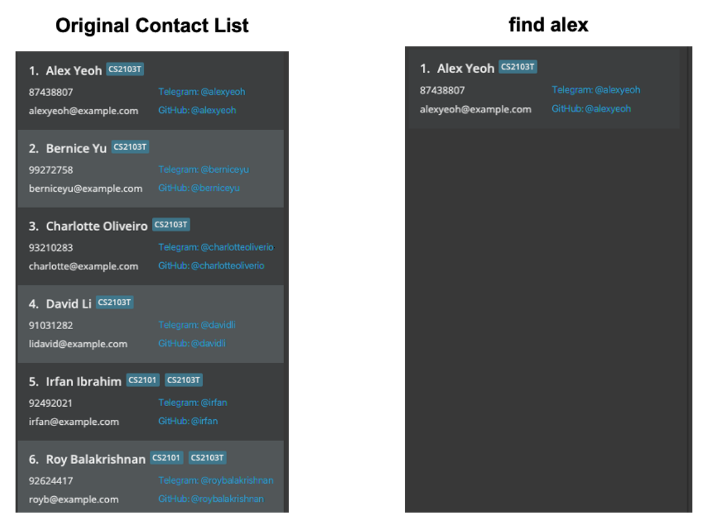

ModuLink is a **desktop app for CS students to manage contacts, optimized for use via a Command Line Interface** (CLI) while still having the benefits of a Graphical User Interface (GUI). If you are a CS student and you need a platform to connect with your peers and to find project groups, ModuLink is the choice for you.

* Table of Contents
{:toc}

--------------------------------------------------------------------------------------------------------------------

## Quick start

1. Ensure you have Java `11` or above installed in your Computer.

1. Download the latest `modulink.jar` from [here](https://github.com/AY2122S1-CS2103T-W12-4/tp/releases).

1. Copy the file to the folder you want to use as the _home folder_ for your ModuLink.

1. Double-click the file to start the app. The GUI similar to the below should appear in a few seconds. Note how the app contains some sample data. 
   

1. Type the command in the command box and press Enter to execute it. e.g. typing **`help`** and pressing Enter will open the help window. 
   Some example commands you can try:

   * **`create`**`n/John Doe id/A0222594A p/24680135 e/johnd@example.com` : Creates a ModuLink user profile with the name John Doe and the relevant student ID, phone number and email.

   * **`add`**`id/A0222594A` : Adds the student with student ID A0222594A to your ModuLink favourite contacts.

   * **`list`** : Lists all people in your ModuLink favourites list.

   * **`find`**`Joseph`: Finds people whose names contain the keyword 'Joseph' in all profiles in ModuLink. 
   
   * **`filter`**`mod/CS2103T`: Filters to show all profiles taking the CS2103T module.

   * **`filter`**`mod/CS2103T group/SM`: Filters to show all profiles who are taking the CS2103T module and are seeking members.

1. Refer to the [Features](#features) below for details of each command.

--------------------------------------------------------------------------------------------------------------------

## Features

**:information_source: Notes about the command format:** 

* Words in `UPPER_CASE` are the parameters to be supplied by the user. 
  e.g. in `add n/NAME`, `NAME` is a parameter which can be used as `add n/John Doe`.

* Items in square brackets are optional. 
  e.g `n/NAME [t/TAG]` can be used as `n/John Doe t/friend` or as `n/John Doe`.

* Items with `…`​ after them can be used multiple times including zero times. 
  e.g. `[t/TAG]…​` can be used as ` ` (i.e. 0 times), `t/friend`, `t/friend t/family` etc.

* Parameters can be in any order. 
  e.g. if the command specifies `n/NAME p/PHONE_NUMBER`, `p/PHONE_NUMBER n/NAME` is also acceptable.

* If a parameter is expected only once in the command but you specified it multiple times, only the last occurrence of the parameter will be taken. 
  e.g. if you specify `p/12341234 p/56785678`, only `p/56785678` will be taken.

* Extraneous parameters for commands that do not take in parameters (such as `help`, `list`, `exit` and `clear`) will be ignored. 
  e.g. if the command specifies `help 123`, it will be interpreted as `help`.

### Creating a profile with mods : `create`

Creates your user profile. You can also choose to add mods to indicate your group availability. Note, in order to start using ModuLink, you area **required** to create a new profile should you not have one.

Format: `create n/NAME id/STUDENT_ID p/PHONE_NUMBER e/EMAIL [mod/TAG]...`

:information_source: Note: STUDENT_ID must be unique

Examples:
* `create n/John Doe id/A0222594A p/12345678 e/john.doe@example.com mod/CS2103T`
* `create n/Jane Doe id/A0222594A p/87654321 e/jane_doe@example.com mod/CS2101`
* `create n/Betsy Crowe id/A0222594A p/24680135 e/betsycrowe@example.com`

### Adding a person: `addfav`

Adds a person to your favourites list.

Format: `addfav STUDENT_ID`

Examples:
* `addfav A0222594A`
* `addfav A1234567R`
 

### Removing a favourite : `remfav`

Removes a favourited user from the favourites list.

Format: `remfav STUDENT_ID`

Examples:
* `remove A0212345X`
* `remove A0123456X`

### Listing all persons : `list`

Shows a list of all persons that the user has added to their favourites list.

Format: `list`
 
   
  

### Filter user profiles by module and group status : `filter`

Show user profiles filtered by module code and _optionally_ by group status.

Format: `filter mod/MODULE_CODE [group/GROUP_STATUS]`

* `OPTIONAL_GROUP_STATUS` enumerates the following: { `SG`: seeking group, `SM`: seeking member, `G`: in a group, `NG`: no group }
* `MODULE_CODE` is required for filtering by group status. The filter will return the profiles with the specified group status of the specified module.

Examples:
* `filter mod/CS2030`
* `filter mod/CS2030 group/SM`
* `filter mod/CS2030 group/SG`
 
    
   
 
    
   

### Find profiles by name  : `find`

Finds persons whose names contain any of the entered keywords.

Format: `find KEYWORD [MORE_KEYWORDS]`

* The search is not case-sensitive. e.g hans will match Hans
* The order of the keywords does not matter. e.g. Hans Bo will match Bo Hans
* Only the name is searched.
* Only full words will be matched e.g. Han will not match Hans
* Persons matching at least one keyword will be returned (i.e. OR search).

Examples:
* `find John` returns `John` and `John Doe`
* `find alex david` returns `Alex Berenson` and `David Li`
 
   
  
  
### Find profiles by student ID  : `findId`

Finds persons whose student ID number matches any of the entered keywords.

Format: `findId KEYWORD [MORE_KEYWORDS]`

* The search is not case-sensitive. e.g a0123456a will match A023456A
* The order of the keywords does not matter. e.g. `findId A0123456A A0654321A` will show the persons whose student Id number matches either A0123456A or A0654321A.
* Only the student Id numbers are searched.
* Persons matching any keywords will be returned.

Examples:
* `findId A0123456A` returns the person whose student Id number matches A0123456A
* `findId A0123456A A0654321A` returns the persons whose student Id number matches either A0123456A or A0654321A.
 
   
  

### Viewing help : `help`

Shows a message explaning how to access the help page.

Format: `help`

### Exiting the program : `exit`

Exits the program.

Format: `exit`

### Saving the data

ModuLink's data is saved in the hard disk automatically after any command that changes the data. There is no need to save manually.

### Editing the data file

ModuLink's data are saved as a JSON file `[JAR file location]/data/modulink.json`. Advanced users are welcome to update data directly by editing that data file.

:exclamation: **Caution:**
If your changes to the data file makes its format invalid, ModuLink will discard all data and start with an empty data file at the next run.

### Archiving data files `[coming in v2.0]`

_Details coming soon ..._

--------------------------------------------------------------------------------------------------------------------

## FAQ

**Q**: How do I transfer my data to another Computer? 
**A**: Install the app in the other computer and overwrite the empty data file it creates with the file that contains the data of your previous ModuLink home folder.

--------------------------------------------------------------------------------------------------------------------

## Command summary

Action | Format, Examples
--------|------------------
**Create** | `create n/NAME id/STUDENT_ID p/PHONE_NUMBER e/EMAIL [mod/TAG]...`   e.g., `create n/John Doe id/A0222594A p/12345678 e/john.doe@example.com mod/CS2100`
**Add Favourite** | `addfav STUDENT_ID`   e.g., `addfav A0222594A`
**Remove Favourite** | `remfav STUDENT_ID`   e.g., `remfav A0222594A`
**List** | `list`
**Filter** | `filter mod/MODULE_CODE [group/GROUP_STATUS]`  e.g. no group filter: `filter mod/CS2030` with group filter: `filter mod/CS2030 group/SM` 
**Find by Name** | `find KEYWORD [MORE_KEYWORDS]`   e.g., `find alex david` returns `Alex Yeoh, David Li`
**Find by Student Id** | `findId KEYWORD [MORE_KEYWORDS]`   e.g., `find A0222594A` returns person with student Id matching A0222594A.
**Help** | `help`
**Exit** | `exit`
