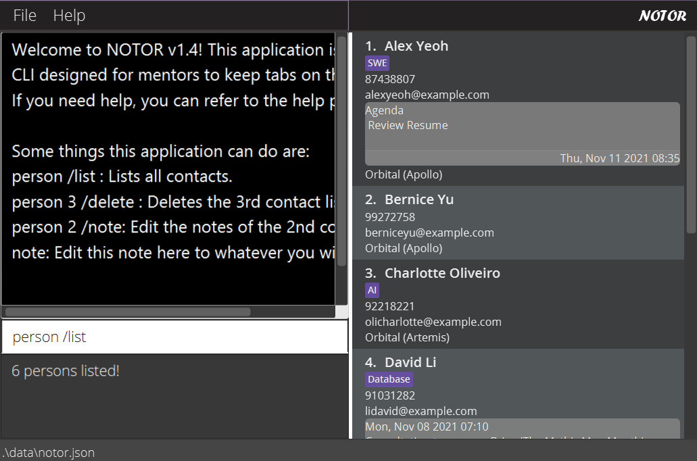
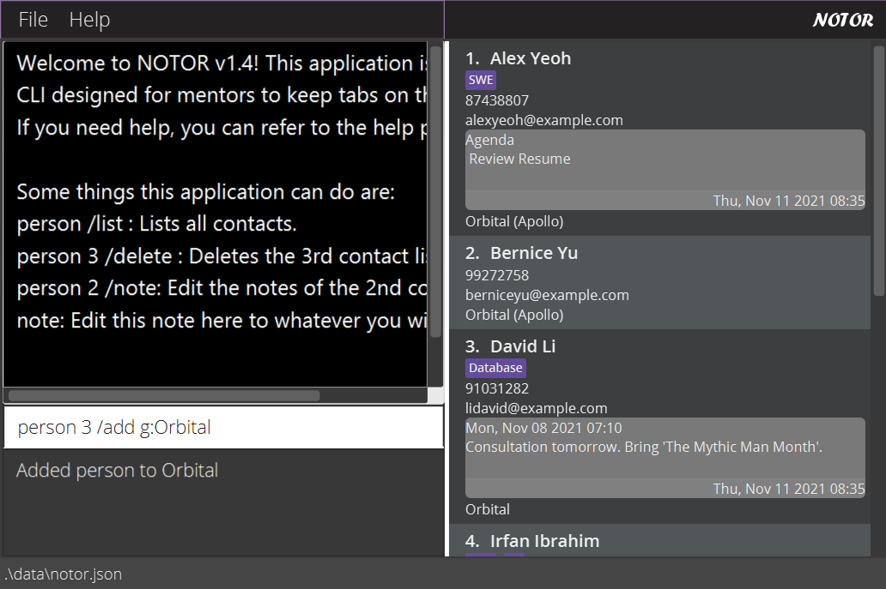
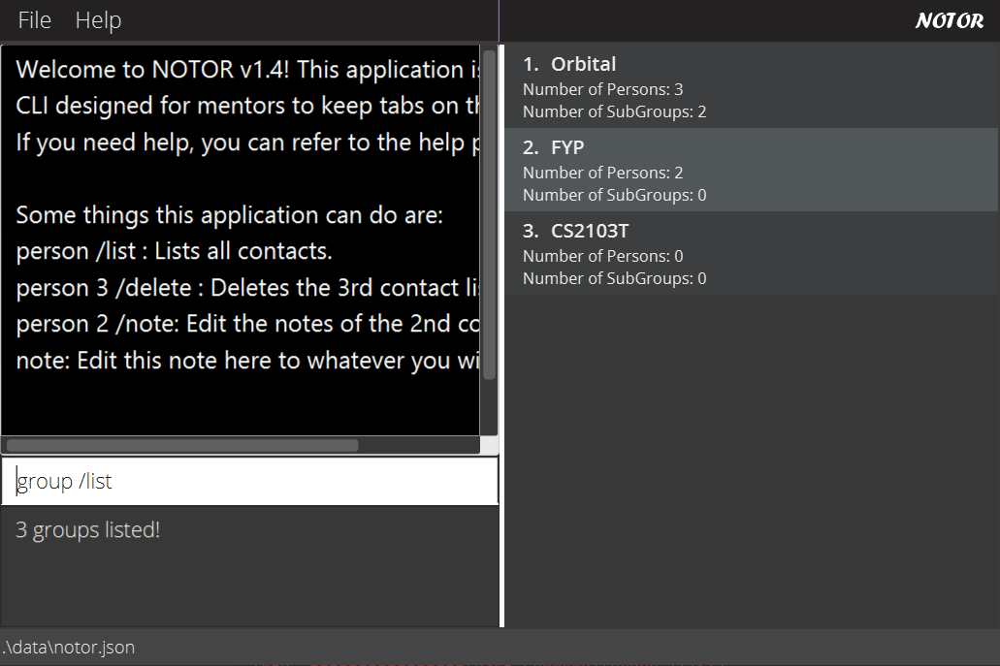
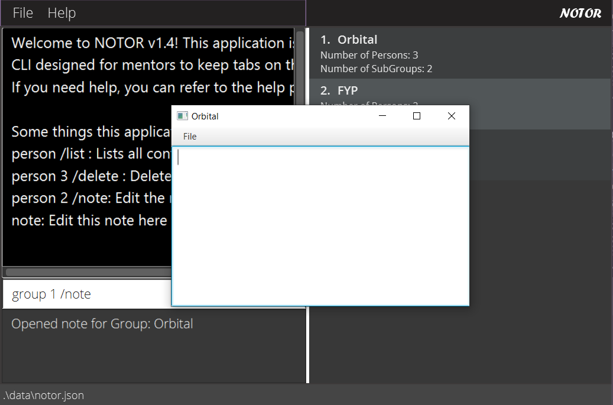

**Notor** is a personal CRM, developed for faculty mentors at NUS to manage their mentees. However, we're sure that Notor can still help people outside our target audience in situations where they have a **many mentees to one mentor relationship**, where they need to **take notes quickly**. Personal CRMs (CRM stands for Customer Relationship Manager) are useful tools to keep track of people's information and keep it organised, which can really benefit you in making connections with people.

Notor is a desktop application **optimized for use via a Command Line Interface** (CLI) while still having the benefits of a Graphical User Interface (GUI). If you can type faster than the average typing speed, Notor allows you to take notes quickly and efficiently during meetings with mentees, and group those notes with your mentee's information powerfully and easily.

Key features of Notor are:

* Powerful Organization which is up to the user to manage many mentees
  * Group mentees, and place groups into subgroups for greater control
  * Add tags to mentees and sort by tags to easily identify meta-data about your contacts
  * Archive contacts you’re no longer actively mentoring, but keep them in your Notor to retrieve at any time
* Clean note-taking system
  * Take notes concurrently with meeting the mentee through no-frills text files
  * Drop time stamps whenever you update your information and meet with the mentee effortlessly
* Fast CLI
  * Commands with short forms
  * Works offline for better performance

## Table of Contents
* Table of Contents
{:toc}

### Using this User Guide

If you're new to Notor, hop over to [Quick Start](#quick-start) to install and begin using it. If you already know what you want, use the Table of Contents to find the feature you are looking for, or the [Command Summary](#command-summary) to view all commands available. 

If you've used Notor for a while and are looking to get the best out of Notor, 'level-up' by reading our [Tips on Using Notor](#tips-on-using-notor).

Some terminology that might help when referring to Notor:
1. **List pane** : The panel located on the right, which is used to display the list of persons or groups
2. **View pane** : The panel on the left, used to view notes, such as general notes
3. **Note Window**: The pop-up window you may use to edit and add notes
4. **Command Box**: The box on the left pane, underneath the view pane, where you may type commands.

Pay attention to these callouts:

:information_source: <strong>Note:</strong>
This block is used to highlight information you should pay attention to.

:bulb: <strong>Tip:</strong>
Used to highlight tips.

:exclamation: <strong>Caution:</strong>
Used to highlight dangers.

--------------------------------------------------------------------------------------------------------------------

## Quick Start
### 1. Setup
Ensure you have Java `11` or above installed in your computer. You can install Java `11` from [here](https://www.oracle.com/java/technologies/downloads/#java11-windows).
### 2. Installing the project
Download the latest `notor.jar` [here](https://github.com/AY2122S1-CS2103T-W08-1/tp/releases), and copy the file to the folder you want to use as the _home folder_ for your Notor. The *home folder* is where the data that Notor uses will be stored.

### 3. Running the application
Double-click the file to start the application. If you have set up Java `11` correctly, the application should open, and the GUI similar to below should appear in a few seconds.
Note how the app contains some sample data.  

### 4. Try Running Examples!

Type the command in the command box and press Enter to execute it. e.g. Typing **help** and pressing Enter will
open the help window.  

If you'd like a guided tour of a few of Notor's features, go to [Appendix: Tutorial](#tutorial) to try Notor out. We recommend this if you have never used Notor before.

Otherwise, you can jump right into it! Here are a few other commands you can try:

* `person /list` : Lists all contacts.
* `person 3 /delete` : Deletes the 3rd contact (contact with index number 3) shown in the current list.
* `person User /create` : Creates a person named User.
* `group Orbital /create` : Creates a group named Orbital.
* `person 3 /add g:Orbital` : Adds the person with index 3 to the group Orbital.
* `group /list` : Lists all groups.
* `group 1 /note` : Edits the group note for the group with index number 1.
* `group 1 /create n:Artemis` : Creates a subgroup Artemis inside the group with index number 1.
* `clear` : Deletes all contacts.
* `exit` : Exits the application.  

Refer to the [Command Breakdown](#features) below for more details on each command.

--------------------------------------------------------------------------------------------------------------------

## Command Breakdown
What follows is a detailed breakdown of all the commands Notor has available and what they do. All the commands have a shortened command format to make typing them easier.

**Notes about the command format:** 
* Words in `UPPER_CASE` are the parameters to be supplied by the user. 
  e.g. in `person /create n:NAME`, `NAME` is a parameter which can be used as `/create n:John Doe`.
* Round brackets `()` refer to COMPULSORY arguments. 
  e.g. `g:(GROUP_NAME)` means that the group name must be entered at that position.
* Items in square brackets are optional. 
  e.g. `n:NAME [g:GROUP_NAME]` can be used as `n:Elton g:Orbital` or as `n:Elton`.
* Items with `…`​ after them can be used multiple times including zero times, with a comma separating terms. 
  e.g. `[t/TAG…​]` can be used as ` ` (i.e. 0 times), `t:tag1, tag2, tag3` etc.
* Parameters can be in any order. 
  e.g. if the command specifies `g:GROUP_NAME sg:SUBGROUP_NAME`, `sg:SUBGROUP_NAME g:GROUP_NAME` is also acceptable.
* If a parameter is expected only once in the command, but you specified it multiple times, only the last occurrence of the parameter will be taken. 
  e.g. if you specify `p:12341234 p:56785678`, only `p:56785678` will be taken.
* Extraneous parameters for commands that do not take in parameters (such as `help`, `exit` and `clear`) will be ignored. 
  e.g. if the command specifies `help 123`, it will be interpreted as `help`.

### General Commands

#### _Viewing help_

Displays a summary of commands, as well as a link you can copy to get to this full user guide.

| Format      | What the command does          |
|-------------|--------------------------------|
| `help`      | Opens the help panel           |
| `h`         | Same as above                  |

:bulb: <strong>Tip:</strong>
You don't even need to use the help command to get help! If you type in a command with no arguments and the command requires arguments, the error message should help you come up with the right command.

#### _Clearing all entries_

Clears all entries from Notor. This means that all your contacts, as well as the groups you keep them in, will be removed.

| Format      | Short Format    |
|-------------|-----------------|
| `clear`     | `c`             |

:exclamation: <strong>Caution:</strong>
  Data will be deleted and **will not be saved**. The intended use of this
  command is to clear the dummy starting data, but you can also use it to reset your Notor from within the program.

#### _Exiting the program_
Exits the program and saves your data.

| Format      | Short Format    |
|-------------|-----------------|
| `exit`      | `e`             |

#### _Exporting data_

Exports all the data of Notor into a CSV file to Notor's home directory.

| Format   | Short Format |
|----------|--------------|
| `export` | `exp`        |

You can usually find the exported data in the home directory that contains Notor. The data file indicates the exported data, and the time and date when you exported the data.

The data exported will be displayed as follows:

### Working with people
The base functionality of Notor is allowing you to maintain notes on people who you mentor. These are the commands you can use with the `person` prefix to manage your contacts.

:exclamation: <strong>Caution:</strong>
  The following commands only work when persons are listed in Notor (visible in the list pane).

#### _Creating a person_

Creates a person's contact card within Notor. When creating this person, you can pass optional arguments to fill out more information about them in a single command.

| Format                                                                        | Example                                                                    | What the example does                                                                                                                                                                   |
|-------------------------------------------------------------------------------|----------------------------------------------------------------------------|-----------------------------------------------------------------------------------------------------------------------------------------------------------------------------------------|
| `person (NAME) /create [p:PHONE] [e:EMAIL] [t:TAG1,TAG2,...] [g:GROUP_INDEX]` | `person John Lim /create p:91119111 e:notor@notor.com t:scholar g:1` | Creates the contact `John Lim`, with a phone number of `9111911`, and email of `notor@notor.com`. John is tagged with `scholar` and belongs to the group at index `1`              |
| `p (NAME) /c [p:PHONE] [e:EMAIL] [t:TAG1,TAG2,...] [g:GROUP_INDEX]`           | `p Dhruv Chopra /c p:92229222 e:notor@notor.com t:AI, Crypto g:2`          | Creates the contact `Dhruv Chopra`, with a phone number of `9222922`, and email of `dhruv.chopra@u.nus.sg`. Dhruv is tagged with `AI` and `Crypto`, and belongs to the group at index `2` |

:information_source: <strong>Notes on parameters:</strong>
* Creates a person with the `NAME`. This name cannot start with a number.
* Optional arguments:
  * `PHONE`: Phone number of the person.
  * `EMAIL`: Email of the person.
  * `TAG1,TAG2..`: Tag(s) that describe the person.
  * `GROUP_INDEX`: Index of the group in Notor to add the person to.
* The person cannot have the same name as someone else in the group.

:bulb: <strong>Tip:</strong>
Notor minimizes what you need to remember. To add the person to a group, you need to have groups displayed in the list panel, so that you can select the group by its index instead of memorising and typing its name.

#### _Adding a person to a group or subgroup_

Adds a person at the given index `INDEX` to a specified group. To add a person to a subgroup, include the subgroup parameter.

| Format                                                | Example                              | What the example does                                                                                  |
|-------------------------------------------------------|--------------------------------------|--------------------------------------------------------------------------------------------------------|
| `person (INDEX) /add (g:GROUP_NAME)`                  | `person 1 /add g:Orbital`            | Add the person at index `1` to the group `Orbital`                                                       |
| `p (INDEX) /a (g:GROUP_NAME)`                         | `p 2 /a g:Alumni`                    | Add the person at index `2` to the group `Alumni`                                                        |
| `person (INDEX) /add (g:GROUP_NAME sg:SUBGROUP_NAME)` | `person 3 /add g:Orbital sg:Artemis` | Add the person at index `3` to the subgroup `Artemis` which is contained within the group `Orbital`      |
| `p (INDEX) /a (g:GROUP_NAME sg:SUBGROUP_NAME)`        | `p 2 /a g:Alumni sg:Class 2010`      | Add the person at index `4` to the subgroup  `Class 2010`  which is contained within the group  `Alumni` |

:bulb: <strong>Tip:</strong>
Notor considers people within a subgroup as also being within the group that contains it (the supergroup). Hence, if you later try to [list all persons in group](#list-persons-in-group), anyone within a subgroup will also be listed.

#### _Deleting a person_

Removes the contact and the data saved for a person from Notor.

| Format                  | Example            | What the example does         |
|-------------------------|--------------------|-------------------------------|
| `person (INDEX) /delete`| `person 1 /delete` | Deletes the person at index `1` |
| `p (INDEX) /d`          | `p 3 /d`           | Deletes the person at index `3` |

:exclamation: <strong>Caution:</strong>
Data will be deleted and **will not be saved**. Be careful when deleting people. You may prefer to [archive them](#archiving-people) or make a backup of your data first by [exporting the data](#exporting-data).

#### _Editing a person_

Edits the data of the person at the index `INDEX` in the List Pane and replaces the fields specified with the new parameters.

| Format                                              | Example                                           | What the example does                                                                                          |
|-----------------------------------------------------|---------------------------------------------------|----------------------------------------------------------------------------------------------------------------|
| `person (INDEX) /edit [n:NAME] [p:PHONE] [e:EMAIL]` | `person 1 /edit n:Amira e:amira.hannah@gmail.com` | Changes the name of the person at index `1` to `Amira` and also change their email to `amira.hannah@gmail.com` |
| `p (INDEX) /e [n:NAME] [p:PHONE] [e:EMAIL]`         | `p 2 /e n:Tan See Kiat p:93339333`                | Change the name of the person at index `2` to `Tan See Kiat` and also change their phone number to `93339333`  |

:information_source: <strong>Note:</strong>
* Please specify at least one field to be edited.
* Optional arguments:
  * `NAME`: Name of the person.
  * `PHONE`: Phone number of the person.
  * `EMAIL`: Email of the person.
* You cannot change the name of the person to the same name as someone else in the group.

#### _Removing a person from group_

Removes a person from a group or a subgroup. To remove a person from a subgroup, include the subgroup parameter along with the group it is under.

| Format                                                   | Example                                 | What the example does                                                                             |
|----------------------------------------------------------|-----------------------------------------|---------------------------------------------------------------------------------------------------|
| `person (INDEX) /remove (g:GROUP_NAME)`                  | `person 1 /remove g:Orbital`            | Remove the person at index  `1`  from the group  `Orbital`                                        |
| `p (INDEX) /r (g:GROUP_NAME)`                            | `p 2 /r g:Final Year Project`           | Remove the person at index `2` from the group `Final Year Project`                                |
| `person (INDEX) /remove (g:GROUP_NAME sg:SUBGROUP_NAME)` | `person 1 /remove g:Orbital sg:Group A` | Remove the person at index  `1`  from the group  `Group A` which is the subgroup of `Orbital`. The person is still in the group `Orbital`|
| `p (INDEX) /r (g:GROUP_NAME sg:SUBGROUP_NAME)`           | `p 2 /r g:Research sg:AI focus`         | Remove the person at index  `2`  from the group  `AI focus`  which is the subgroup of  `Research`. The person is still in the group `Research`|

#### _Taking notes for a person_

Opens a note window pop-up to take notes in.

| Format                 | Example          | What the example does                                          |
|------------------------|------------------|----------------------------------------------------------------|
| `person (INDEX) /note` | `person 1 /note` | Opens the note window which belongs to the person at index `1` |
| `p (INDEX) /n`         | `p 2 /n`         | Opens the note window which belongs to the person at index `2` |

:bulb: <strong>Tip:</strong>
For keyboard shortcuts within the note, you can reference [tips on using Notor](#tips-on-using-notor).

 
  

#### _Clearing notes of a person_

Removes the note of the person at the given `INDEX` in the List Pane.

| Format                      | Example               | What the example does                       |
|-----------------------------|-----------------------|---------------------------------------------|
| `person (INDEX) /clearnote` | `person 1 /clearnote` | Removes the note of the person at index `1` |
| `p (INDEX) /cn`             | `p 2 /cn`             | Removes the note of the person at index `2` |

:exclamation: <strong>Caution:</strong>
Data will be deleted and **will not be saved**. Be careful.

#### _Tagging a person_

Add tags to an existing person. Please specify at least one tag to be added.

| Format                                  | Example                          | What the example does                                      |
|-----------------------------------------|----------------------------------|------------------------------------------------------------|
| `person (INDEX) /tag [t:TAG1,TAG2,...]` | `person 1 /tag t:friends,family` | Tag person with index  `1`  with  `friends`  and  `family` |
| `p (INDEX) /t [t:TAG1,TAG2,...]`        | `p 2 /t t:friday`                | Tag person with index `2` with `friday`                    |

:information_source: <strong>Note:</strong> 
What are tags? Well, tags can be used to flag information about a person that you want to highlight and find later. Tags are searchable, while notes are not. Some ideas of what you could use tags for are ...  
* Areas of interest the mentee has
* Graduation year
* Where they are currently or have previously worked
* Outstanding qualities they might have
* The day you usually meet this mentee

#### _Untagging a person_

Removes tag(s) from an existing person.

| Format                                    | Example                            | What the example does                                                   |
|-------------------------------------------|------------------------------------|-------------------------------------------------------------------------|
| `person (INDEX) /untag [t:TAG1,TAG2,...]` | `person 1 /untag t:friends,family` | For the person at index  `1`, remove the tags  `friends`  and  `family` |
| `p (INDEX) /ut [t:TAG1,TAG2,...]`         | `p 2 /t ut:friday`                 | For the person at index  `2` , remove the tag `friday`                  |

#### _Clearing tags from a person_

Removes all the tags from an existing person. Use with caution.

| Format                      | Short Format     |
|-----------------------------|------------------|
| `person (INDEX) /cleartags` | `p (INDEX) /ct`  |

### Archiving People
Archiving people allows you to only view the contacts you are actively managing, while still keeping the information
of older mentees within Notor. You might also want to view the [Export](#exporting-data) command. You can restore
archived mentees at any time.

#### _Archiving a person_
Archives a single person by their index.

| Format                  | Example           | What the example does          |
|-------------------------|-------------------|--------------------------------|
| `person (INDEX) /archive`| `person 1 /archive` | Archives the person at index `1` |
| `p (INDEX) /ar`          | `p 2 /ar`          | Archives the person at index `2` |

#### _Archiving All_
Archives every person displayed in the list panel.

| Format   | Short Format |
|----------|--------------|
| `person /archive`| `person /ar`|

#### _Listing Archived Persons_
Shows the list of archived Persons.

| Format   | Short Format |
|----------|--------------|
| `person /listarchive` | `p /lar`|

#### _Unarchiving_ 
Restores an archived person back to your person list in Notor.

| Format                    | Example        | What the example does                                        |
|---------------------------|----------------|--------------------------------------------------------------|
| `person (INDEX) /unarchive` | `p 1 /unarchive` | Restores archived person at index `1` back to your person list |
| `p (INDEX) /uar `           | `p 2 /uar`       | Restores archived person at index `2` back to your person list |

:exclamation: <strong>Caution:</strong>
You must be on the list of archived persons in order to use this command, as it needs the index of the person to unarchive.

### Working with groups/subgroups
You can also create a group to organize people based on their common traits. In addition to groups, you can also create a subgroup
of a group to organize people based on a more specific category. 

:bulb: <strong>Tip:</strong>
You can sort your contacts in Notor by the group that they are in, as well as taking general notes 
on the group. A few ideas on how you can use groups are:

<ul>
  <li>Group people you tend to talk to together. When meeting them, you can sort your Notor by that group, so that you can reference just their contacts</li>
  <li>Group mentees with common interests. This makes it convenient if you want to reach out to all mentees with a certain shared interest</li>
  <li>Group mentees who you need to achieve certain checkpoints with. For example, if in your job as a mentor
    you must find out from every mentee a certain list of goals, you can put this checklist into Notor as a group note, then reference it as you contact each mentee.</li>
</ul>

:exclamation: <strong>Caution:</strong>
All group commands except **Creating a group** will only work when groups or subgroups are listed.

#### _Creating a group_

Creates a group.

| Format                     | Example               | What the example does         |
|----------------------------|-----------------------|-------------------------------|
| `group (GROUP_NAME) /create` | `group Orbital /create` | Creates a group named `Orbital` |
| `g (GROUP_NAME) /c`          | `g FYP /c`              | Creates a group named `FYP`     |

:information_source: <strong>Note:</strong>
  * You cannot create a group with name starting with a number, and may contain `-` or `.` characters
  * The new group must not have a same name with other existing groups.

:bulb: <strong>Tip:</strong>
You can execute this command no matter what list is in the List Pane.

#### _Deleting a group_

Deletes an existing group at the index `INDEX` specified.

| Format                | Example         | What the example does       |
|-----------------------|-----------------|-----------------------------|
| `group (INDEX) /delete` | `group 1 /delete` | Deletes the group at index `1`|
| `g (INDEX) /d`         | `group 2 /d`      | Deletes the group at index `2`|

:exclamation: <strong>Caution:</strong>
  You can only execute this command when groups are listed in the list pane.

#### _Creating a subgroup_

Creates a new subgroup.

| Format                                | Example                   | What the example does                                    |
|---------------------------------------|---------------------------|----------------------------------------------------------|
| `group (INDEX) /create n:SUBGROUP_NAME` | `group 1 /create n:Artemis` | Creates a new subgroup named `Artemis` in group at index `1` |
| `g (INDEX) /c n:SUBGROUP_NAME`         | `g 2 /create n:Year2`       | Creates a new subgroup named `Year2` in group at index `2`    |

:information_source: <strong>Note:</strong>
  * This name cannot start with a number, and may contain `-` or `.` characters.
  * The new subgroup must not have the same name as other existing subgroups in the same group.

#### _Adding notes to a group or subgroup_

Opens a pop-up a note window to add note to group or subgroup.

| Format              | Example       | What the example does                                                        |
|---------------------|---------------|------------------------------------------------------------------------------|
| `group (INDEX) /note` | `group 1 /note` | Opens a pop-up window where you can edit notes for group/subgroup at index `1` |
| `group (INDEX) /n`   | `g 2 /n`        | Opens a pop-up window where you can edit notes for group/subgroup at index `2` |

:bulb: <strong>Tip:</strong>
You can open add notes to multiple groups at the same time by executing the command multiple times.

#### _Clearing notes of a group or subgroup_

Removes note of an existing group or subgroup.

| Format                   | Example            | What the example does                         |
|--------------------------|--------------------|-----------------------------------------------|
| `group (INDEX) /clearnote` | `group 1 /clearnote` | Removes the note of group/subgroup at index `1` |
| `g (INDEX) /cn`            | `g 2 /cn`           | Removes the note of group/subgroup at index `2` |

## Filtering with Notor

Sometimes, you will want to view all people, groups, subgroups to understand what you have saved in your Notor. 
At other times, you will want to find those which fit into certain parameters. Here are the ways to view a subset of your data.

### List

List can show all persons, groups, subgroups which you have added to Notor.
It can also list archived persons: see [Archiving People](#archiving-people).

#### _Listing all persons_

Lists all persons in the list panel.

| Format       | What the command does |
|--------------|-----------------------|
| `person /list` | List all persons      |
| `p /l`        | List all persons      |

#### _Listing all groups_

Lists all groups in the list panel.

| Format      | What the command does          |
|-------------|--------------------------------|
| `group /list` | Lists all groups in list panel |
| `g /l`        | Lists all groups in list panel |

#### _Listing all persons in a group or subgroup_

Lists all persons in that group or subgroup. 

| Format               | Example        | What the example does                         |
|----------------------|----------------|-----------------------------------------------|
| `person (INDEX) /list` | `person 2 /list` | List all persons in group/subgroup at index `2` |
| `p (INDEX) /l`         | `p 3 /list`      | List all persons in group/subgroup at index `3` |

:information_source: <strong>Note:</strong>
  * Only works if you have listed out all groups or subgroups in Notor.
  * Lists all persons of a group or subgroup that is at the given `INDEX`.
  * Do not confuse this with the list all subgroups command, whose first command word is `group`.

:exclamation: <strong>Caution:</strong>
Only works if you have listed out all groups or subgroups in Notor.

#### _Listing all subgroups in a group_

Lists all the subgroups within a group.

| Format              | Example       | What the example does                   |
|---------------------|---------------|-----------------------------------------|
| `group (INDEX) /list` | `group 3 /list` | Lists all subgroups of group at index `3` |
| `g (INDEX) /l`        | `g 2 /l`        | Lists all subgroups of group at index `2` |

:exclamation: <strong>Caution:</strong>
Do not confuse this with the list all persons in a group command, whose first command word is <code>person</code>.

  

### Find

Find allows you to obtain the results that match with the keyword specified. You can filter in this way on people, groups, and subgroups. In addition, you may add additional parameters to your search, in order to narrow the search further.

#### _Finding persons_

Finds all persons that match your search term. You may search for substrings within a persons name, or for tags the user must be tagged with. If you specify multiple search terms, only those people which match ALL criteria will be returned.

| Format                                        | Example                        | What the example does                                                  |
|-----------------------------------------------|--------------------------------|------------------------------------------------------------------------|
| `person /find [n:NAME_QUERY] [t:TAG1, TAG2...]` | `person /find n:Elton t:CS2103T` | Find all persons that that match `Elton` with tag that match `CS2103T` |
| `p /f [n:NAME_QUERY] [t:TAG1, TAG2...] `        | `p /f t:SWE`                     | Find all persons with tag that match `SWE`                             |

:information_source: <strong>Note:</strong>
  * Finds all persons that match with given `NAME_QUERY`, or are tagged with the tags specified.
  * The query for the name will match if the string exists within the name, regardless of case: `jo` will match `John` and `joanne`.
  * Tags must be spelled exactly. You may specify more than one tag.
  * While the parameters have been marked optional, you must specify at least one of the parameters if you want to filter the results.

#### _Finding groups or subgroups_

Finds all the groups/subgroups with the keyword specified. This will search for the keyword within the group's name.
Use after you have listed out all groups or subgroups.

| Format                   | Example               | What the example does                             |
|--------------------------|-----------------------|---------------------------------------------------|
| `group /find n:QUERY_NAME` | `group /find n:Artemis` | Finds all the groups/subgroups that match `Artemis` |
| `g /f n:QUERY_NAME`        | `g /f n:CS2103`         | Finds all the groups/subgroups that match `CS2103`  |

:information_source: <strong>Note:</strong>
  * Finds all the groups/subgroups that match the `KEYWORD`.
  * Substrings will match: `art` will match `Art Jammers`, `Smart cookie`, and `Artemis`

## Miscellaneous information

### Saving the data

Notor data are saved in the hard disk automatically after any command that changes the data. There is no need to save manually.

### Editing the data file

Notor data are saved as a JSON file in Notor's Directory. Advanced users are welcome to update data
directly by editing that data file.

:exclamation: <strong>Caution:</strong>
If your changes to the data file makes its format invalid, Notor will 
discard all data and start with an empty data file at the next run.

--------------------------------------------------------------------------------------------------------------------

## Tips on Using Notor

### Keeping Track of Successfully Executed Command History
Notor keeps tracks of successfully executed commands in the current instance,  allowing you to navigate through with Up arrow key starting from the most recent command.
Users can also use the Down arrow key to navigate back to the more recent command when they are navigating with Up arrow key.

### Keyboard Shortcuts
Notor has keyboard shortcuts to give you added convenience and allow you to control Notor using your keyboard alone. Here are the shortcuts we have available.

#### Pop-Up Window

You can navigate the buttons in a pop-up window using the arrow keys. On Windows and Linux, 
select the button by pressing enter; on MacOS, press space.

#### Shortcut Keys for Note Window

Shortcut Key            | Linux/Window                                   | MacOS
------------------------|------------------------------------------------|---------------------------------------
**TimeStamp**           | `Ctrl + T`                                     | `Cmd + T`
**Save**                | `Ctrl + S`                                     | `Cmd + S`
**Quit without Saving** | `Ctrl + W`                                     | `Cmd + W`
**Save and Quit**       | `Ctrl + Q`                                     | `Cmd + Q`

:information_source: <strong>Note:</strong>
* <strong>Timestamp: </strong> shortcut key types the current date and time in Note Window in this format <code>E, MMM dd yyyy HH:mm"</code>.  
* Example: `Fri., Oct. 22 2021 00:07`

## Command Summary

:information_source: <strong>Note:</strong>
* Round brackets `()` refer to COMPULSORY arguments.
* Square brackets `[]` refer to optional arguments.

### General
Refer to the details of the general commands [here](#general-command).

Action     | Format   | Short Format
-----------|----------|----------
**Help**   | `help`   | `h`
**Exit**   | `exit`   | `e`
**Clear**  | `clear`  | `c`
**Export** | `export` | `exp`

### Person
Refer to the details of Person commands [here](#person-command).

Action                    | Format                                                                        | Short Format
--------------------------|-------------------------------------------------------------------------------|--------------------------------------------------------------------
**Create**                | `person (NAME) /create [p:PHONE] [e:EMAIL] [t:TAG1,TAG2,...] [g:GROUP_INDEX]` | `p (NAME) /c [p:phone] [e:email] [t:TAG1,TAG2,...] [g:GROUP_INDEX]`
**Edit**                  | `person (INDEX) /edit [n:NAME] [p:PHONE] [e:EMAIL]`                           | `p (INDEX) /e [n:NAME] [p:phone] [e:email]`
**Delete**                | `person (INDEX) /delete`                                                      | `p (INDEX) /d`
**Add Group**             | `person (INDEX) /add (g:GROUP_NAME) `                                         | `p (INDEX) /a (g:GROUP_NAME)`
**Add SubGroup**          | `person (INDEX) /add (g:GROUP_NAME sg:SUBGROUP_NAME) `                        | `p (INDEX) /a (g:GROUP_NAME sg:SUBGROUP_NAME)`
**Remove Group**          | `person (INDEX) /remove (g:GROUP_NAME) `                                      | `p (INDEX) /r (g:GROUP_NAME)`
**Remove SubGroup**       | `person (INDEX) /remove (g:GROUP_NAME sg:SUBGROUP_NAME) `                     | `p (INDEX) /r (g:GROUP_NAME sg:SUBGROUP_NAME)`
**Note**                  | `person (INDEX) /note`                                                        | `p (INDEX) /n`
**Clear Note**            | `person (INDEX) /clearnote`                                                   | `p (INDEX) /cn`
**Tag**                   | `person (INDEX) /tag [t:TAG1,TAG2,...]`                                       | `p (INDEX) /t [t:TAG1,TAG2,...]`
**Untag**                 | `person (INDEX) /untag [t:TAG1,TAG2,...]`                                     | `p (INDEX) /ut [t:TAG1,TAG2,...]`
**Clear Tags**            | `person (INDEX) /cleartags`                                                   | `p (INDEX) / ct`
**List Persons**          | `person /list`                                                                | `p /l`
**List Persons in Group or SubGroup** | `person (INDEX) /list`                                            | `p [INDEX] /l`
**Find**                  | `person /find (n:QUERY)`                                                      | `p /f (n:QUERY)`
**Archive**               | `person (INDEX) /archive`                                                     | `p (INDEX) /ar`
**Archive All**           | `person /archive`                                                             | `p /ar`
**List Archived Persons**       | `person /listarchive`                                                           | `p /lar`
**Unarchive**             | `person (INDEX) /unarchive`                                                   | `p (INDEX) /uar`

:exclamation: <b>Caution:</b>
For the <b>Add</b> and <b>Remove</b> commands, please make sure that the <code>GROUP_NAME</code> is typed exactly as how it is spelt on
the card.

:information_source: <strong>Note:</strong>

  * For the <strong>Create</strong> and <strong>List</strong> commands, if you want to automatically add them to a group, 
    please use the <b>List</b> command to make sure the <code>Group</code> you want to use the command on is displayed 
    before using them via <code>GROUP_INDEX</code>.
  * For the <b>List</b> commands, to view list of persons in a particular subgroup, you should first use <b>List</b> 
    command to list out all the subgroups in a Group you want to view, then list out the persons inside that subgroup 
    by <b>List</b> command with the <code>GROUP_INDEX</code> you want to list out.

### Group
Refer to the details of the group commands [here](#group-command).

Action                 | Format                                         | Short Format
-----------------------|------------------------------------------------|---------------------------------------
**Create Group**       | `group (GROUP_NAME) /create` | `g (GROUP_NAME) /c`
**Create Subgroup**    | `group (INDEX) /create n:SUBGROUP_NAME`        | `g (INDEX) /c n:SUBGROUP_NAME`
**Delete**             | `group (INDEX) /delete`                        | `g (INDEX) /d`
**Note**               | `group (INDEX) /note`                          | `g (INDEX) /n`
**List Groups**        | `group /list`                                  | `g /l`
**List Out Subgroups** | `group (INDEX) /list`                          | `g (INDEX) /l`
**Find**               | `group /find (n:QUERY)`                        | `g /f (n:QUERY)`

:exclamation: <strong>Caution:</strong>
Before using the group actions, remember to use <code>g /list</code> or <code>g /find</code> 
to change the list display so that you can access the indexes of the group.

:information_source: <strong>Note:</strong>
For the <b>List</b> command, the <code>INDEX</code> argument can be either a <code>Group</code> or a <code>Person</code>, 
depending on what is in the list display.
You can change the list display using <code>person /list</code> or <code>group /list</code>.

## FAQ

**Q**: How do I transfer my data to another Computer? 
**A**: Install the app in the other computer and overwrite the empty data file it creates with the file that contains
the data of your previous Notor home folder.

## What's next!

In the future, we would like to implement these features to enhance the experiences of mentors in using Notor:
  * View command for the viewing pane to support viewing other types of notes and command summary through the help command.
  * Different UI settings for the users to choose the color scheme they prefer.
  * Expand help window to improve user's experience in looking for help.
  * Import command to support importing data from CSV into Notor.
  * Tagging for groups.
  * And...more! Feel free to contact the team and share your suggestions at e0588244@u.nus.edu.

## Appendix: Tutorial

When you open Notor for the first time, you will see some dummy data for you to test out commands on. You can try out these commands sequentially to get familiar with Notor:

1. **`person /list`** : First, type this in to list all the people you have saved as contacts.

   

2. **`person 3 /delete`** : Use this command to delete the 3rd contact you have saved in Notor. This is the one listed at the 3rd index. In the example below `Charlotte Oliviero` will be removed.

   

   

3. **`person User /create`** : To create a new contact person, type in this command. You can replace `User` with a name of your choice.

   

4. **`group CS2103T /create`** : To create a new group, type in this command. You can replace `CS2103T` with any group name you want.
    
    
    

    
5. **`person 3 /add g:CS2103T`** : Now, if you want to add the person with index `3` to the group `CS2103T`. In the example shown below, the user named `David Li` will be added to the group `CS2103T`.
    

6. **`group /list`** : To refer to the current group list, you can simply type in this command.
   
   
   

7. **`group 1 /note`** : Edit the notes of the group with index number `1` with this command -- in the example below, `Orbital` is the group you will take notes on

   
   When the note window pops up, you can type whatever you like. Use the keyboard shortcut `Ctrl + T` to drop the timestamp you opened the note. When you are done, press `Ctrl + Q` to exit the note window and save what you wrote.

8. **`group 1 /create n:Gemini`** : This command creates a new subgroup inside the group at index `1`. In the following example, a new subgroup called `Orbital_Gemini` is created from the parent group `Orbital`. The syntax `n:` is to indicate the **name** of the subgroup you have created.

    
    
    

9. Test out whatever commands you like. When you're done...

10. **`clear`** : Type this and hit enter to remove all the dummy data prepared for you.

       
     This will delete every contact and group in the list. A warning window will ask you to confirm your decision  

     

11. **`exit`** : Finally, type in this command to exit the application and save all your data.  

And that concludes this short tutorial. Check out [Command Breakdown](#features) above for more details on each command.
