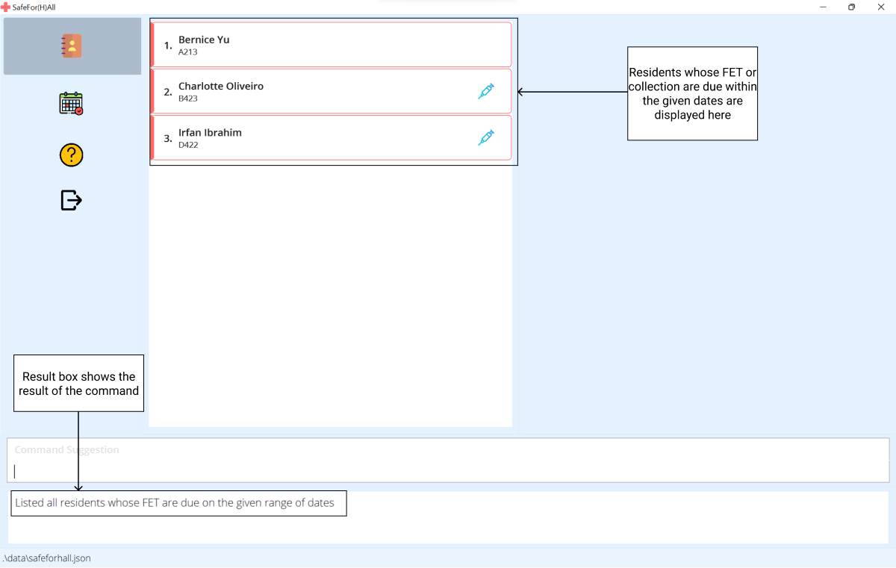
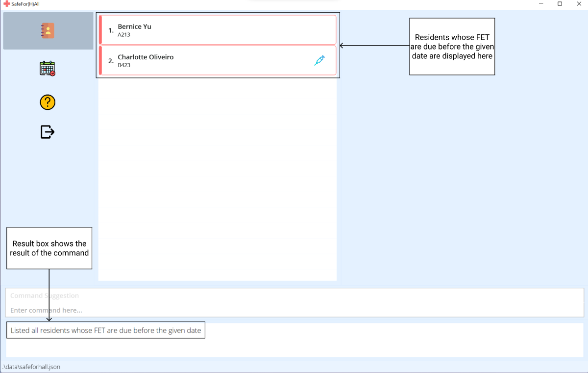
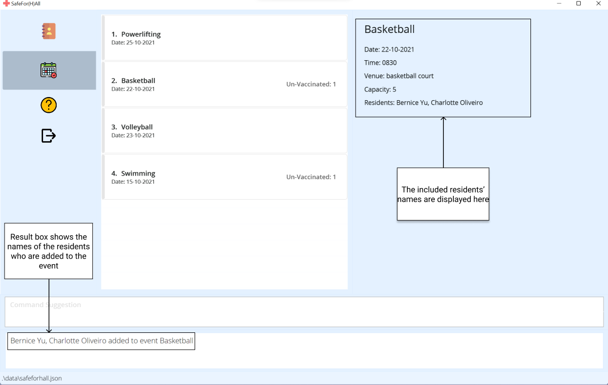
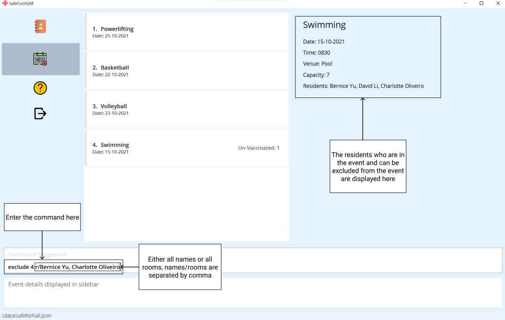
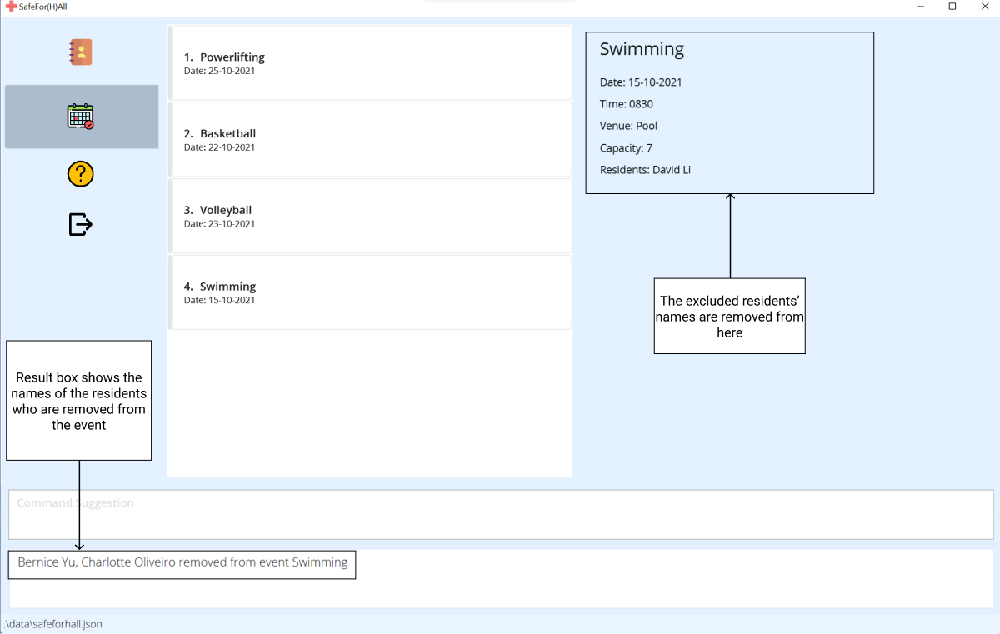

Are you a hall administrator in-charge of managing residents in NUS? Do you have to fumble through multiple different excel sheets just to look for a resident's information? Are you worried residents might be subject to the dangers of the pandemic? Well look no further as SafeFor(H)All is the application you need!

SafeFor(H)All is a **desktop app for hall admins to keep track of hall residents’ information to keep hall residents safe during the COVID-19 pandemic via a Command Line Interface (CLI)** while still having the benefits of a Graphical User Interface (GUI). If you can type fast, SafeFor(H)All can get your hall management tasks done faster than traditional GUI apps.

* Table of Contents
{:toc}

--------------------------------------------------------------------------------------------------------------------

## Quick start

1. Ensure you have Java `11` or above installed in your Computer.

1. Download the latest `safeforhall.jar` from [here](https://github.com/AY2122S1-CS2103T-T15-4/tp/releases/tag/v1.3.trial).

1. Copy the file to the folder you want to use as the _home folder_ for your SafeFor(H)All Application.

1. Double-click the file to start the app. The GUI similar to the below should appear in a few seconds.   
   

1. Type the command in the command box and press Enter to execute it. e.g. typing **`help`** and pressing Enter will open the help window. 
   Some example commands you can try:

   * **`view`** : Lists all residents.

   * **`add`**`n/John Doe r/A100 e/john@gmail.com p/12345678 v/t f/SoC` : Adds a resident named `John Doe` with the given information to the application.

   * **`delete`**`3` : Deletes the 3rd resident shown in the current list.

   * **`exit`** : Exits the app.

1. Refer to the [Features](#features) below for details of each command.

-------------------------------------------------------------------------------------------------------------
## Let's take a tour

### The left bar

The top-most 2 icons represent the main tabs: Residents and Events.   
 - You can view the relevant data when either is selected.

The third will open the help window and the last will exit the application.

### Viewing data

Resident and Event information is organized in this panel.  
You can view details about a resident/event by clicking on it. (Also achievable via [View Command](#viewing-residents-information--view))
> Residents with late FETs by 7 days and, Events with un-vaccinated residents are highlighted red
> 
> Vaccinated residents include the syringe icon towards the right-side of the card
> 
> Past Events are highlighted grey.

### Interacting

This is where you can enter commands to interact with the data.  
The [Command Suggestion](#command-suggestion) box will suggest parameters on typing.  
The result of executing the input command will be displayed the lower-most box.

## Features

### Command Format

**Format:** `command_word Prefix/PARAMETER`

* `command_word` is a word at the start of the command to specify the action to be done.   e.g. in `add n/NAME`, `add` is the command word.
* `PARAMETER` are word(s) in `UPPER_CASE` to be supplied by the user.  e.g. in `add n/NAME`, `NAME` is a parameter which can be used as `add n/John Doe`
* `Prefix` are letter(s) before `PARAMETER` to denote the information supplied as parameter.  e.g. in `add n/NAME`, `n/` is a prefix to indicate that NAME is being supplied.

**:information_source: Notes about the command format:** 

* Items in square brackets are optional. 
  e.g `add n/NAME [fd/LAST_FET_DATE]` can be used as `add n/John` or as `add n/John fd/09-09-2021`.

* An ellipsis (...) implies multiple of that parameter can be provided. 
  e.g `edit INDEX...` can be used as `edit 1` or as `edit 1 2 3 5 8`.

* Parameters can be in any order. 
  e.g. if the command specifies `n/NAME f/FACULTY`, `f/FACULTY n/NAME` is also acceptable.

* If a parameter is expected only once in the command but you specified it multiple times, only the last occurrence of the parameter will be taken. 
  e.g. if you specify `v/t v/f` only `v/f` will be taken.

* Extraneous parameters for commands that do not take in parameters (such as `help`, `exit`, `view`) will be ignored. 
  e.g. if the command specifies `help 123`, it will be interpreted as `help`.

* Date parameters can be of formats: `dd-mm-yyyy`, `dd.mm.yyyy` or `dd/mm/yyyy`

* Time parameter is of format: `hhmm`

### For Residents

These commands will function as specified when run under the `Resident` tab.

#### Adding a resident’s information : `add`

Adds a resident and their information to the application.

Format: `add n/NAME p/PHONE_NUMBER e/EMAIL r/ROOM v/VACCINATION_STATUS f/FACULTY [fd/LAST_FET_DATE] [cd/LAST_COLLECTION_DATE]`

Parameter | Constraints
|--------|-------
**NAME** | Unique, only containing alphabetical characters and spaces
**PHONE** | At least 6 digits long
**ROOM** | Made up of **block** + **level** + **number**  **block** is an alphabetical character from A to E  **level** is a digit from 1 to 4  **number** is two digits from 00 to 29  e.g. `A100`
**EMAIL** |  The local-part should only contain alphanumeric characters and these special characters, excluding the parentheses, (+_.-). The local-part may not start or end with any special characters.   This is followed by a '@' and then a domain name. The domain name is made up of domain labels separated by periods.   The domain name must:   - end with a domain label at least 2 characters long   - have each domain label start and end with alphanumeric characters   - have each domain label consist of alphanumeric characters, separated only by hyphens, if any.
**VACCINATION_STATUS** | `T` or `F` (case insensitive)
**FACULTY** | Single alphabetical word
**LAST_FET_DATE**   **LAST_COLLECTION_DATE** | `dd-mm-yyyy`, `dd.mm.yyyy` or `dd/mm/yyyy` format

**:information_source: Note:** 

**ROOM** is currently modelled after an existing hall in the National University of Singapore.

:bulb: **Tip:**
`LAST_FET_DATE` and `LAST_COLLECTION_DATE` are optional parameters.

Examples:
* `add n/John Doe p/98765432 e/johnd@example.com r/A100 v/t f/SoC`
* `add n/Betsy Crowe e/betsyc@example.com v/F r/B400 p/1234567 f/FASS fd/20-10-2021 cd/23-10-2021`

#### Viewing residents information : `view`

Shows a numbered list of all the residents in the address book.

The index of the resident is the corresponding number in the list
shown when `view` (without the [INDEX] parameter) is called.

Format: `view [INDEX]`
* For an index i, 1 ≤ i ≤ n, where n is the number of residents in the address book

Examples:

* `view` shows a list of all the residents
* `view 30` shows the details of the resident at index 30

#### Listing residents by fet/collection deadlines : `deadline`

Lists residents whose ART collection or FET tests are either:
* due before a given date, `d1`, by using the `late keywords` or 
* due within the range of two given dates, `d1` and `d2`, by using the `normal keywords`.

**:information_source: Note:** 

* There is a one week deadline for the test kit collection and fet test, therefore due date refers to one week after the last recorded date

| Differences | Normal Keyword | Late Keyword |
|-------------|--------|------|
| Format | `deadline k/KEYWORD d1/DATE1 d2/DATE2` | `deadline k/LATE_KEYWORD d1/DATE1`|
| Keyword | `f` or `c` | `lf` or `lc` |
| Input Date | Both `DATE1` and `DATE2` have to be inputted | Only `DATE1` should be inputted |
| Command Example | `deadline k/f d1/10-10-2021 d2/12-10-2021` | `deadline k/lf d1/11-10-2021` |
| Usage | List residents whose deadline lie within the range of two given dates, inclusive | List residents whose deadline is due before a given date
| Usage Example | A resident's fet or collection is due one week after their `last fet date` or `last collection date`.   For example, if a resident's last fet date is on a friday, `15-10-2021`, then the resident's fet deadline is on the following friday which is `22-10-2021` | The number of days a resident is considered late is calculated from `a day after` their deadline to the `current date`, both inclusive.  For example, if a resident's last fet date is `15-10-2021`, then the fet deadline will be `22-10-2021`, if the current date is `25-10-2021`, then the number of days the resident is late for fet is `3 days`.
| Note | The given `DATE2` must be a date later than the given `DATE1` `DATE1` is the start date and `DATE2` is the last date inclusive | Anyone whose fet and collection is due before but not on `DATE1` is outputted

Here's a step by step guide for `Normal Keyword`: 
1. Type the `deadline` command with the `normal keyword`, `f` for fet or `c` for collection, `d1`, the start date and
   `d2`, the end date.
   

2. The event list will now show the filtered list of residents.
   

Here's a step by step guide for `Late Keyword`: 
1. Type the `deadline` command with the `late keyword`, `lf` for late fet or `lc` for late collection, `d1`, the 
   end date
   

2. The event list will now show the filtered list of residents.
   
   

Examples:
* `deadline k/f d1/10-10-2021 d2/12-10-2021` retrieves a list of residents whose `FET` is due between `10 Oct 2021` and `12 Oct 2021`, inclusive
* `deadline k/f d1/15-10-2021 d2/20-10-2021` retrieves a list of residents whose `Test Kit Collection` is due some day between `15 Oct 2021` and `20 Oct 2021`, inclusive
* `deadline k/lf d1/11-10-2021` retrieves a list of residents whose `FET` is due before `11 Oct 2021`
* `deadline k/lc d1/12-10-2021` retrieves a list of residents whose `Test Kit Collection` is due before `12 Oct 2021`

#### Searching by resident information: `find`

Shows a list of residents that match the provided keywords for different available parameters.

Format: `find [PREFIX/KEYWORD]...`

* Allowed flags include; `n/`, `r/`, `e/`, `p/`, `f/` and `v/`
* Prefixes for `LAST_FET_DATE` and `LAST_COLLECTION_DATE` are not used. Refer to [Deadline Command](#listing-residents-by-fetcollection-deadlines--deadline) on how to make use of these fields.
* Searching by name:
    - It is case-insensitive. e.g `hans` will match `Hans`, `True` will match `true`
    - The order of the keywords provided for the name does not matter. e.g `Hans Bo` will match `Bo Hans`
    - Only full words will be matched. e.g `Han` will not match `Hans`
    - Residents matching at least one keyword for the name will be returned (i.e. `OR` search).
  e.g `Hans Bo` will return `Hans Gruber`, `Bo Yang`
* Searching by room:
    - It is case-sensitive. Block letters must be capitalised.
    - A block can be used as a search. e.g `r/A`
    - A level can be used as a search. e.g `r/2`
    - A block-level can be used as a search. e.g `r/A2`
    - A full valid room can be used as a search. e.g `r/A210`
* Any provided preamble to the prefixes will be ignored
* All other fields are subject to the same validity conditions as in the [Add Command](#adding-a-residents-information--add)

Examples:
* `find n/John` returns `john` and `John Doe`
* `find n/alex david v/t` returns vaccinated residents, `Alex Yeoh` and `David Li`
* `find v/f f/soc` returns un-vaccinated residents from SoC  

#### Editing a resident : `edit`

Edits the details of existing residents in the address book.

Format: `edit INDEX… [n/NAME] [r/ROOM] [p/PHONE] [e/EMAIL] [v/VACCINATION_STATUS] [f/FACULTY] [fd/LAST_FET_DATE] [cd/LAST_COLLECTION_DATE]`

* Edit the residents at the specified `INDEXES`.
* Each index refers to the index number shown in the displayed resident list.
* The indexes **must be positive integers** 1, 2, 3, …​
* At least one of the optional fields must be provided.
* Existing values will be updated to the input values.
* Edit multiple residents in a single command by inputting multiple indexes, each separated by a space.

Examples:
*  `edit 1 e/johndoe@example.com r/A101` Edits the email address and room number of the 1st resident to be `johndoe@example.com` and `A101` respectively.
*  `edit 1 2 3 v/t fd/20-10-2021` Sets the vaccination status of the 1st, 2nd, and 3rd resident as vaccinated, and sets their last FET dates to 20-10-2021.

#### Deleting a resident : `delete`

Deletes specified residents from the address book.

Format: `delete INDEX…`

* Delete the residents at the specified `INDEXES`.
* Each index refers to the index number shown in the displayed resident list.
* The indexes **must be positive integers** 1, 2, 3, …​
* Delete multiple residents in a single command by inputting multiple indexes, each separated by a space.

Examples:
* `view` followed by `delete 1 2 3` deletes the first 3 residents in the address book.
* `find n/Anne` followed by `delete 1` deletes the 1st resident named Anne in the results of the `find` command.

#### Tracing close contacts : `trace`

Traces a resident's close contacts based on the events they're involved in. This is useful when a COVID case is located within the residence and their close contacts are to be notified of proper procedure to follow.

Format: `trace r/RESIDENT [d/DEPTH] [t/DURATION]`

* A resident can be identified either by full name or room
* Depth refers to the maximum links to reach the resident in question
* Depth should be an integer >= 1 and will default to 1
* Duration is in days and will default to 7

Examples:
* `trace` followed by `r/A101` lists the resident's immediate close contact from events in the past 7 days.
* `trace r/Anne` followed by `d/2 t/4` lists Anne's immediate contacts and their immediate contacts from events in the past 4 days.

#### Sorting residents : `sort`

Sorts the residents according to specified fields in ascending or descending order

Format: `sort by/FIELD o/ORDER`

FIELD | Resident's field
-------- | ------ 
`n` | Name
`e` | Email
`r` | Room
`p` | Phone
`f` | Faculty
`v` | Vaccination
`fd` | FET date
`cd` | Collection date

* `ORDER` can be `a` for ascending or `d` for descending

Examples:
* `sort by/n o/a` sorts the residents by name in ascending order

#### Importing resident data : `import`

Imports resident information from the specified csv file which is to be located within the `data/` folder.

Format: `import CSV_NAME`

* 8 comma separated values for each row with values in order;  
      `name`, `room`, `phone`, `email`, `vaccStatus`, `faculty`, `lastFetDate`, `lastCollectionDate`
* The first row will be discarded as column headings
* `lastFetDate`, `lastCollectionDate` are optional (can be left as empty space)
* The file format (`.csv`) is not to be included in the `CSV_NAME`
* Resident lists of all events will be wiped

Examples:
* `import` followed by `safeforhall` attempts to read the file `safeforhall.csv` within the `data/` folder.

Example csv:

#### Exporting residents' emails : `export`

Exports the emails of all the residents in the last filtered list to a csv file within the `data/exports/` folder.
A quick copy-paste of the email addresses from the csv file allows you to send mass emails using modern email clients.

Format: `export FILE_NAME`

**:information_source: Note:** 

* The file format (`.csv`) is not to be included in the `FILE_NAME`

Examples:
* `export` followed by `safeforhall` creates a `safeforhall.csv` within the `data/exports/` folder, with the emails of all the residents currently displayed on the application.

### For Events

These commands will function as specified when run under the `Event` tab.

#### Adding an event : `add`

Adds a new event to the address book.

Format: `add n/EVENT_NAME v/VENUE c/CAPACITY d/DATE t/TIME [r/RESIDENTS]`

* The combination of the 5 required parameters should be unique
* `CAPACITY` is the maximum number of residents allowed in this event  
* `DATE` is the date on which the event is held
* `TIME` is the time at which the event is held
* `RESIDENTS` can be included as all full names or all rooms
* The number of residents cannot exceed to provided capacity
* Residents can be given in the form of name or room, but all has to be all rooms or all names  
* When adding multiple residents, each resident's name/room is separated by a comma
* The resident's name/room is case-insensitive

Examples:
* `add n/Swim v/Swimming Pool c/10 d/28-10-2021 t/1500`
* `add n/Frisbee v/MPSH c/15 d/30/10/2021 t/1500 r/E201`  
* `add n/Frisbee v/MPSH c/15 d/30/10/2021 t/1500 r/E201, a121`
* `add n/Frisbee v/MPSH c/15 d/30/10/2021 t/1500 r/John Doe, Jane Doe`

#### Viewing events information : `view`

Shows a numbered list of all the events in the address book.

The index of the event is the corresponding number in the list
shown when `view` (without the [INDEX] parameter) is called.

Format: `view [INDEX]`
* For an index i, 1 ≤ i ≤ n, where n is the number of events in the address book

Examples:

* `view` shows a list of all the events
* `view 5` shows the details of the event at index 5

#### Editing an event : `edit`

Edits an existing event in the address book.

Format: `edit INDEX [n/EVENT_NAME] [d/EVENT_DATE] [t/EVENT_TIME] [v/VENUE] [c/CAPACITY]`

* Edits the event at the specified `INDEX`.
* The index refers to the index number shown in the displayed event list.
* The index **must be a positive integer** 1, 2, 3, …​
* At least one of the optional fields must be provided.
* Existing values will be updated to the input values.

Examples:
*  `edit 1 n/Football Training v/Field c/50` Edits the name, venue, and capacity of the 1st event in the event list to be `Football Training`, `Field`, and `50` respectively.

#### Searching by event information: `find`

Shows a list of events that match the provided keywords for different available parameters.

Format: `find [PREFIX/KEYWORD]...`

* Allowed flags include; `n/`, `d/`, `v/`, `c/`
* Searching by name:
    - It is case-insensitive. e.g `dance` will match `Dance`
    - Keywords will be matched without the need to enter the full event name. e.g `Band` will match `Band training`
    - Events matching at least one keyword for the event name will be returned (i.e. `OR` search).
      e.g `Football Basketball` will return `Football Training`, `Basketball Training`
* Searching by venue:
    - It is case-insensitive. e.g `nus field` will match `NUS Field`
    - Only full event names will be matched. e.g `Field` will not match `NUS Field`
* The date and capacity fields are subject to the same validity conditions as in the [Add Event Command](#adding-an-event--add)

Examples:
* `find n/Football` returns `Football Match` and `Football Training`
* `find v/NUS field c/5` returns all the events at `NUS field` which have a capacity of `5`
* `find d/03-01-2021` returns all the events which occur on the date `03-01-2021`  

#### Deleting an event : `delete`

Deletes specified events from the address book.

Format: `delete INDEX…`

* Delete the events at the specified `INDEX…`.
* Each index refers to the index number shown in the displayed event list.
* The indexes **must be positive integers** 1, 2, 3, …​
* Delete multiple events in a single command by inputting multiple indexes, each separated by a space.

Examples:
* `view` followed by `delete 1 2 3` deletes the first 3 events in the address book.
* `find n/Football Training` followed by `delete 1` deletes the 1st event named Football Training in the results of the `find` command.

#### Add residents to an event: `include`

Add multiple residents to an event based on the information given(name or room number), a resident is only expected to be given a name or a room.

Format: `include INDEX r/RESIDENTS`

**:information_source: Note:** 

* Residents can be given in the form of `names/rooms`, but all has to be all `rooms` or all `names`
* The residents' `names/rooms` inputted have to exist in the address book under the `Resident` Tab to be added to an `Event`
* When adding multiple `names/rooms`, each resident's `name/room` is separated by a comma
* The resident's `name/room` inputted is case-insensitive

Here's a step by step guide: 
1. Type the `include` command with the `index` of the event, and the `names/rooms` of the residents to include to
   the event. When adding multiple `names/rooms`, remember to separate the `names/rooms` by a comma.
   

2. The sidebar will now show the updated list of residents in the event.
   
   

Examples:
* `include 1 r/A101` adds the resident who stays in room A101 to the first event in the address book
* `include 2 r/A101, A102, A103` adds the residents who stay in rooms A101, A102 and A103 to the second event in the address book
* `include 3 r/John Doe` adds John Doe to the third event in the address book
* `include 4 r/John Doe, Jane Doe` adds John Doe and Jane Doe to the fourth event in the address book

#### Remove residents from an event: `exclude`

Remove multiple residents from an event based on the information given(name or room number), a resident is only expected to be given a name or a room.

Format: `exclude INDEX r/RESIDENTS`

**:information_source: Note:** 

* Residents can be given in the form of `names/rooms`, but all has to be all `rooms` or all `names`
* The residents' `names/rooms` inputted have to be involved in the `Event` under the `Event` Tab, to be removed from
  that event
* When removing multiple `names/rooms`, each resident's `name/room` is separated by a comma
* The resident's `name/room` inputted is case-insensitive

Here's a step by step guide: 
1. Type the `exclude` command with the `index` of the event, and the `names/rooms` of the residents to exclude from
   the event. When removing multiple `names/rooms`, remember to separate the `names/rooms` by a comma.
   

2. The sidebar will now show the updated list of residents in the event.
   

Examples:
* `exclude 1 r/A101` removes the resident who stays in room A101 from the first event in the address book
* `exclude 2 r/A101, A102, A103` removes the residents who stay in rooms A101, A102 and A103 from the second event in the address book
* `exclude 3 r/John Doe` removes John Doe from the third event in the address book
* `exclude 4 r/John Doe, Jane Doe` removes John Doe and Jane Doe from the fourth event in the address book

#### Sorting events : `sort`

Sorts the events according to specified fields in ascending or descending order.

Format: `sort by/FIELD o/ORDER`

FIELD | Event's field
-------- | ------ 
`n` | Name
`d` | Date and Time
`c` | Capacity
`v` | Venue

* `ORDER` can be `a` for ascending or `d` for descending

Examples:
* `sort by/n o/a` sorts the events by name in ascending order
* `sort by/d o/a` sorts the events by date and time from old to new
* `sort by/d o/d` sorts the events by date and time from new to old

### Commons

These commands will function the same in either tab.

#### Viewing help : `help`

Provides a short summary of the commands and a hyperlink for the user to reach this online user guide.

Format: `help`

#### Switching tabs: `switch`

Toggles between the `Residents` and `Events` tab.

Format: `switch`

#### Command history

The `up` and `down` arrow keys when used with the input box in focus, allows traversal of past input commands to increase of use and efficiency.

#### Command suggestion

A suggested string of parameters is displayed above the input box when a valid command is entered, parameters that have their prefixes entered correctly are removed from this suggestion.

#### Clearing all entries : `clear`

Clears all entries from the address book, including entries from the `Resident` Tab and the `Event` Tab. Data cleared cannot be retrieved and this command should be used with caution. A sample data can be retrieved by removing the `safeforhall.json` file from `/data`

Format: `clear`

#### Exiting the program : `exit`

Exits the program.

Format: `exit`

-------------------------------------------------------------------------------------------------------------

## Prefix summary

### Resident Prefix

PREFIX | Description | Usage
|-------- | ------ | ------
`n/` | Name | `add`, `edit`, `find`
`p/` | Phone number | `add`, `edit`, `find`
`e/` | Email address | `add`, `edit`, `find`
`r/` | Room | `add`, `edit`, `find`
`v/` | Vaccination status | `add`, `edit`, `find`
`f/` | Faculty | `add`, `edit`, `find`
`fd/` | Last FET date | `add`, `edit`
`cd/` | Last collection date | `add`, `edit`
`k/` | Keyword | `deadline`
`d1/` | Date 1 | `deadline`
`d2/` | Date 2 | `deadline`
`r/` | Resident | `trace`
`d/` | Depth | `trace`
`t/` | Duration | `trace`
`by/` | Field | `sort`
`o/` | Order | `sort`

### Event Prefix

PREFIX | Description | Usage
|-------- | ------ | ------
`n/` | Name | `add`, `edit`
`v/` | Venue | `add`, `edit`
`c/` | Capacity | `add`, `edit`
`d/` | Date | `add`, `edit`
`t/` | Time | `add`, `edit`
`r/` | Residents | `add`, `include`, `exclude`
`by/` | Field | `sort`
`o/` | Order | `sort`

## Command summary

### Resident Commands

Command | Format | Examples
|--------|-------|----------
**Add** |  `add n/NAME p/PHONE_NUMBER e/EMAIL r/ROOM v/VACCINATION_STATUS f/FACULTY [fd/LAST_FET_DATE] [cd/LAST_COLLECTION_DATE]` | `add n/Betsy Crowe e/betsyc@example.com v/F r/B400 p/1234567 f/FASS fd/20-10-2021 cd/23-10-2021`
**View** | `view [INDEX]`| `view 30`
**Deadline** | `deadline k/KEYWORD d1/DATE1 d2/DATE` | `deadline k/f 15-8-2021 20-08-2021`
**Find** | `find [PREFIX/KEYWORD]...` | `find n/john alex v/false f/fass`  
**Edit** | `edit INDEX… [FLAG/UPDATED_PARTICULARS]…` | `edit 1 2 3 v/true fd/20-10-2021`  
**Delete** | `delete INDEX…` | `delete 1 2 3`
**Trace** | `trace r/RESIDENT [d/DEPTH] [t/DURATION]` | `trace r/D201 d/2 t/4`
**Sort** | `sort by/FIELD o/ORDER` | `sort by/n o/a`
**Import** | `import CSV_NAME` | `import safeforhall`
**Export** | `export FILE_NAME` | `export closeContactsOfA123`

### Event Commands

Command | Format | Examples
|--------|-------|----------
**Add** |  `add n/NAME p/PHONE_NUMBER e/EMAIL r/ROOM v/VACCINATION_STATUS f/FACULTY [fd/LAST_FET_DATE] [cd/LAST_COLLECTION_DATE]` | `add n/Betsy Crowe e/betsyc@example.com v/F r/B400 p/1234567 f/FASS fd/20-10-2021 cd/23-10-2021`
**View** | `view [INDEX]`| `view 30`
**Find** | `find [PREFIX/KEYWORD]...` | `find n/Swim d/28-10-2021`
**Edit** | `edit INDEX [FLAG/UPDATED_PARTICULARS]…` | `edit 1 n/Football Training l/Field`
**Delete** | `delete INDEX…` | `delete 1 2 3`
**Include** | `include INDEX r/RESIDENTS` | `include 1 r/A102, E416`
**Exclude** | `exclude INDEX r/RESIDENTS` | `exclude 1 r/A102, E416`
**Sort** | `sort by/FIELD o/ORDER` | `sort by/c o/d`

### Commons

Command | Format | Examples
|--------|-------|----------
**Help** | `help`
**Switch** | `switch`
**Clear** | `clear`
**Exit** | `exit`

