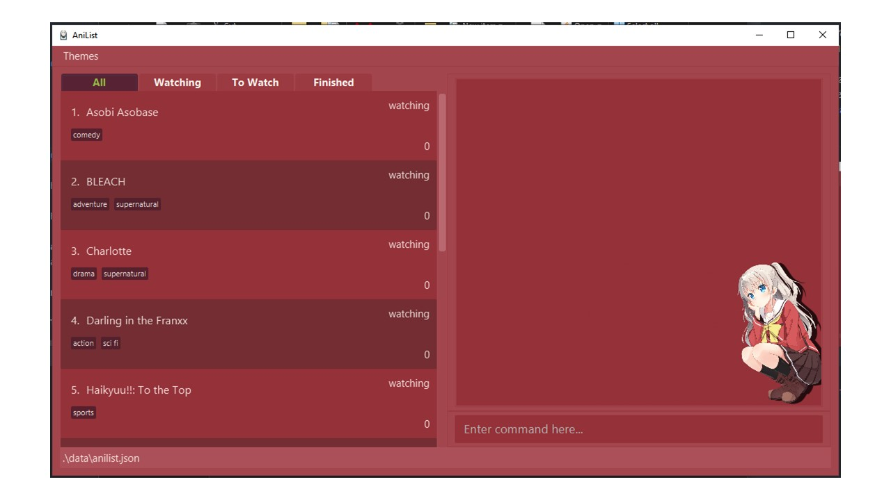

# AniList V1.4

AniList is a desktop application made to be a single centralized location for anime lovers to keep track of all the animes they are interested in. In AniList, users will be able to keep track of animes that they are watching, wanting to watch or even animes that they have finished. Users will also be able to get statistics on their watching habits such as the genre distribution of their current list of animes.

AniList is optimized for use via a Command Line Interface (CLI) while still having the benefits of a customizable Graphical User Interface (GUI). If you are a fast typist, AniList can get your anime management tasks done FASTER than traditional GUI applications!

This User Guide is to be used by any AniList user. No technical background is required.

## Table of Content

- [Quick Start](#quick-start)
- [GUI Breakdown](#gui-breakdown)
- [Hot-Keys](#hot-keys)
- [Commands](#commands)
  * [Adding an anime: `add`](#adding-an-anime-add)
  * [Deleting an anime: `delete`](#deleting-an-anime-delete)
  * [Updating anime episode: `update`](#updating-anime-episode-update)
  * [Updating anime watch status: `status`](#updating-anime-watch-status-status)
  * [Updating anime title: `rename`](#updating-anime-title-rename)
  * [Adding/ Deleting genre from anime: `genre`](#adding-deleting-genre-from-anime-genre)
  * [Listing all supported genres: `genrelist`](#listing-all-supported-genres-genrelist)
  * [Listing anime based on watch status: `list`](#listing-anime-based-on-watch-status-list)
  * [Clearing all animes currently displayed: `clear`](#clearing-all-animes-currently-displayed-clear)
  * [Finding an anime: `find`](#finding-an-anime-find)
  * [Viewing user statistics: `stats`](#viewing-user-statistics-stats)
  * [Viewing all supported commands: `help`](#viewing-all-supported-commands-help)
  * [Exiting application: `exit`](#exiting-application-exit)
- [Commands Table](#commands-table)
- [Glossary](#glossary)

## Quick Start
1. Ensure you have `Java 11` or later installed on your computer. ([install here](https://java.com/en/download/help/download_options.html))

2. Download the latest `anilist.jar` release [here](https://github.com/AY2122S1-CS2103T-T10-4/tp/releases).

3. Place the `anilist.jar` file into your desired *home folder* for AniList.

4. Double-click to launch the application. A window similar to the one shown below should appear shortly.

5. On first launch, AniList will contain sample anime data which you could play around with. Once you are done and
   wish to clear the sample data, enter `list` to [list](#listing-anime-based-on-watch-status-list) all sample animes,
   and then use the [clear](#clearing-all-animes-currently-displayed-clear) command to delete them.

---

___

## GUI Breakdown

1. **Menu Bar:** Here the user have the option to to change the application theme

2. **Tabs Bar:** Here the user can change the tabs to view their anime list filtered based on their watch status. (watching, towatch, finished)

3. **Anime List Panel:** The panel where all of the user's animes are listed. The order of listing is based on the order in which each anime was added —
the latest to be added appears last in the list

4. **Save Location:** States the location in which the anime list file is saved, with respect to the location of the `anilist.jar` file

5. **Command Result Panel:** This panel shows the result of the command based on user input in the Command Input Box

6. **Command Input Box:** User inputs the desired command in this box and runs the command by pressing `enter`

## Hot-Keys

AniList currently supports some hotkeys to allow for ease of use for CLI users.

* The hotkeys only work when the focus is on the main window. The hotkey for closing the statistics window is an exception as it can only be used when the focus is on the stats window

* **Theme Switching:** `CTRL-T`. This will cycle through all the available themes.

Charlotte Theme            |  Dark Theme
:-------------------------:|:-------------------------:
  |  

Squid Girl Theme           |  Wonder Egg Priority Theme
:-------------------------:|:-------------------------:
  |  

___

* **Tab Switching:** `CTRL-S` and `CTRL-D`. To cycle through the tabs to the right, use `CTRL-D`. To cycle through the tabs to the left, use `CTRL-S`.

All Tab  |  Watching Tab
:-------------------------:|:-------------------------:
  |  

To Watch Tab           |  Finished Tab
:-------------------------:|:-------------------------:
  |  

---

* **Closing Stats Window** `CTRL-Q` To close the statistics window.

___

## Commands

**Notes about command format:**
* Words in UPPER_CASE are the specifications given by the user:
   e.g. in `add n/NAME`, NAME is the specification which can be used in the form `add n/Doraemon`

* Items in square brackets are optional:
   e.g. `add n/NAME [e/EPISODE]`. Both `add n/Naruto` and `add n/Naruto e/27` are considered valid commands

* Commands are case-sensitive:
   e.g. `list` and `LIST` are registered differently. Entering `list` successfully lists all animes but
  entering `LIST` registers as an unknown command

* Leading and trailing whitespace is ignored:
   e.g. <code>&nbsp; list</code> and <code>list &nbsp;</code> will both be registered as `list`

* Order of prefixed parameters do not matter:
    e.g. `add n/NAME e/EPISODE` will obtain the same result as `add e/EPISODE n/NAME`
    e.g. `genre c/add 1 g/comedy` will not work as `1` is not a prefixed parameter

### Adding an anime: `add`

Adds a user-defined anime into the anime list.

Format: `add n/NAME [e/EPISODE] [s/STATUS] [g/GENRE] [g/GENRE] ...`

Notes:
* If multiple `n/NAME` are given in the command, the last provided `NAME` will be used
* If multiple `e/EPISODE` are given in the command, the last provided `EPISODE` will be used
* If multiple `s/STATUS` are given in the command, the last provided `STATUS` will be used
* If `EPISODE` is not provided, it will be set to `0`
* If `STATUS` is not provided, it will be set to `watching`
* All genres provided must be valid for the command to be successful

Parameters:
* [`NAME`](#name)
* [`EPISODE`](#episode)
* [`STATUS`](#status)
* [`GENRE`](#genre)

Example usages:
* `add n/Shingeki no Kyojin`
* `add n/Shingeki no Kyojin e/2`
* `add n/Shingeki no Kyojin s/w`
* `add n/Shingeki no Kyojin e/2 s/w g/fantasy`
* `add n/Shingeki no Kyojin e/2 s/w g/fantasy g/action g/comedy`

1. Details of the added anime is shown in the Command Result Panel
2. The new added anime is added to the list in the Anime List Panel

___

### Deleting an anime: `delete`

Deletes the user specified anime from the anime list if it exists.

Format: `delete INDEX`

Parameters:
* [`INDEX`](#index)

Example usages:
* `delete 1` deletes the first anime shown in the list
* `delete 5` deletes the fifth anime shown in the list

1. Details of the deleted anime is shown in the Command Results Panel

___

### Updating anime episode: `update`

Updates the episode that you are currently on for the specified anime.

Format: `update INDEX e/EPISODE`

Notes:
* If multiple `e/EPISODE` are given in the command, the last provided `EPISODE` will be used

Parameters:
* [`INDEX`](#index)
* [`EPISODE`](#episode)

Example usages:
* `update 1 e/3` updates the first anime to episode 3
* `update 5 e/27` updates the fifth anime to episode 27

1. Details of the updated anime is shown in the Command Results Panel
2. The episode number of the chosen anime is updated to the specified episode number

___

### Updating anime watch status: `status`

Updates the watch status of a specified anime.

Format: `status INDEX s/STATUS`

Notes:
* If multiple `s/STATUS` are given in the command, the last provided `STATUS` will be used

Parameters:
* [`INDEX`](#index)
* [`STATUS`](#status)

Example usages:
* `status 1 s/finished` updates the first anime to watch status `finished`
* `status 5 s/f` updates the fifth anime to watch status `finished`
* `status 3 s/towatch` updates the third anime to watch status `towatch`
* `status 2 s/watching` updates the second anime to watch status `watching`

1. Details of the updated anime is shown in the Command Results Panel
2. The watch status of the chosen anime is updated to the specified watch status

___

### Updating anime title: `rename`
Updates the anime title for the user specified anime.

Format: `rename INDEX n/NAME`

Notes:
* If multiple `n/NAME` are given in the command, the last provided `NAME` will be used

Parameters:
* [`INDEX`](#index)
* [`NAME`](#name)

Example usages:
* `rename 1 n/Narutoo` updates the first anime title to Narutoo
* `rename 1 n/Naruto: Shippuden` updates the first anime title to Naruto: Shippuden

1. Details of the updated anime is shown in the Command Results Panel
2. The name of the chosen anime is updated to the specified name

___

### Adding/ Deleting genre from anime: `genre`

Adds or deletes genre(s) from a specified anime

Format: `genre INDEX c/ACTION g/GENRE [g/GENRE] ...`

Notes:
* If multiple `c/ACTION` are given in the command, the last provided `ACTION` will be used
* Duplicate genres are not allowed
* At least 1 `g/GENRE` needs to be provided
* All valid genres provided will be successfully added/deleted from the anime

Parameters:
* [`INDEX`](#index)
* [`ACTION`](#action)
* [`GENRE`](#genre)

Example usages:
*  `genre 1 c/add g/fantasy g/supernatural g/comedy`
*  `genre 1 c/delete g/fantasy g/supernatural g/comedy`

1. Details of the updated anime is shown in the Command Results Panel
2. The genres tagged to the chosen anime is updated based on the addition or deletion of genre

___

### Listing all supported genres: `genrelist`

Lists all currently supported genres on the Command Results panel.

Format: `genrelist`

Example usages:
* `genrelist` displays all currently supported genres of AniList

1. The list of all available genres is shown in the Command Results Panel

___

### Listing anime based on watch status: `list`

Displays a list of animes that has been previously entered by the user based on their watch status.

Format: `list [s/STATUS]`

Notes:
* If multiple `s/STATUS` are given in the command, the last provided `STATUS` will be used
* If no `s/STATUS` is given, all animes will be listed

Parameters:
* [`STATUS`](#status)

Example usages:
* `list` displays all the anime in the list panel
* `list s/watching` displays all the anime with the watch status `watching`
* `list s/w` also displays all the anime with the watch status `watching`
* `list s/towatch` displays all the anime with the watch status `towatch`

1. The number of anime(s) listed in the current tab is shown in the Command Results Panel
2. The tab bar changes to show the current tab the user is on

___

### Clearing all animes currently displayed: `clear`

Removes all anime(s) currently displayed on screen, upon user confirmation  

Format: `clear`

* Only animes currently listed will be removed from the application
* User will be prompted with a confirmation message, and can proceed to clear all displayed animes by entering 'clear' again
* Entering anything else will cancel the command

Example usages:
* `clear` on the initial clear command prompts the user to confirm the command
* `clear` on follow-up clear command deletes all anime data currently displayed

1. A success message showing all anime(s) has been cleared is shown on the Command Results Panel
2. The Anime List Panel is empty as all anime(s) have been cleared

___

### Finding an anime: `find`

Finds all anime(s) with status belonging to the current tab that contains specified search phrase(s) in their names or
genres(case-insensitive) and displays them as a list with index numbers

Format: `find [n/NAME SEARCH TERM]... [g/GENRE SEARCH TERM]...`

* `NAME SERACH TERM` refers to the name search term(s) you are searching for
* `GENRE SEARCH TERM` refers to the genre search term(s) you are searching for
* `find` has to be followed by at least one search term
* An anime only has to match ONE search term from each category (i.e. `NAME` and `GENRE`) to be counted as a match
and displayed

Parameters:
* `NAME SERACH TERM`
* `GENRE SEARCH TERM`

Example Usages:
* `find n/boku no n/hero g/comedy` Finds all anime with "boku no" or "hero" in their name and
all anime with comedy genre

1. A success message showing the number of anime(s) found is shown on the Command Results Panel
2. Anime(s) found are listed in the Anime List Panel

___

### Viewing user statistics: `stats`

Displays a pop-up window that shows the statistical breakdown of anime(s) in AniList.
User may exit the stats window by either clicking on the `X` button on the top right or by pressing
`CTRL-Q`

Format: `stats`

* The stats window consists of a **pie chart** on the left and a **bar chart** on the right.
* The pie chart shows the number of anime(s) of each `STATUS` in AniList
* The bar chart shows the number of top genres, up to the **top 6**, based on the number of animes
  tagged with a particular genre
* If two or more genres tie for the sixth spot (i.e. there are an equal number of anime(s) tagged
  with these genres), a random genre among these genres will be included in the bar chart
* The Command Input Box is disabled while the `stats` window is up

Stats Window           |
:-------------------------:|
  |

Main Window when the Stats Window is on display |
:-------------------------:|
  |

1. A success message showing that the user statistics have been displayed is shown on the Command Results Panel
2. The Command Input Box is disabled

___

### Viewing all supported commands: `help`
Lists all currently supported commands on the Command Results panel.

Format: `help`

Example usages:
* `help` displays all currently supported commands of AniList

1. A list of all supported commands is shown in the Command Results Panel
2. A link to the User Guide is provided

___

### Exiting application: `exit`

Exits the application.

Format: `exit`

___

## Commands Table

**Notes about command format:**
* Words in UPPER_CASE are the specifications given by the user:
   e.g. in `add n/NAME`, NAME is the specification which can be used in the form `add n/Doraemon`

* Items in square brackets are optional:
   e.g. `add n/NAME [e/EPISODE]`. Both `add n/Naruto` and `add n/Naruto e/27` are considered valid commands

* Commands are case-sensitive:
   e.g. `list` and `LIST` are registered differently. Entering `list` successfully lists all animes but
  entering `LIST` registers as an unknown command

* Leading and trailing whitespace is ignored:
   e.g. <code>&nbsp; list</code> and <code>list &nbsp;</code> will both be registered as `list`

* Order of prefixed parameters do not matter:
    e.g. `add n/NAME e/EPISODE` will obtain the same result as `add e/EPISODE n/NAME`
    e.g. `genre c/add 1 g/comedy` will not work as `1` is not a prefixed parameter

| Command | Usage |
| :--------: | -------- |
| [add](#adding-an-anime-add)     | `add n/NAME [e/EPISODE] [s/STATUS] [g/GENRE1] [g/GENRE2] ...` |
| [delete](#deleting-an-anime-delete)     | `delete INDEX` |
| [update](#updating-anime-episode-update)     | `update INDEX e/NEWEPISODE` |
| [status](#updating-anime-watch-status-status)     | `status INDEX s/UPDATEDSTATUS` |
| [rename](#updating-anime-title-rename)     | `rename INDEX n/NEWTITLE` |
| [genre](#adding-deleting-genre-from-anime-genre)     | `genre INDEX c/ACTION g/GENRE [g/GENRE]` |
| [genrelist](#listing-all-supported-genres-genrelist) | `genrelist` |
| [list](#listing-anime-based-on-watch-status-list)     | `list [s/STATUS]` |
| [clear](#clearing-all-animes-currently-displayed-clear)    | `clear` |
| [find](#finding-an-anime-find)  | `find [n/NAME SEARCH TERM]... [g/GENRE SEARCH TERM]...` |
| [stats](#viewing-user-statistics-stats)  | `stats` |
| [help](#viewing-all-supported-commands-help)     | `help` |

## Glossary

### NAME
* Refers to the anime title
* Must consist of only ASCII characters
* Must have a length of at least 1 and at most 140

### EPISODE
*  Refers to the latest episode watched for the anime
*  Must be a non-negative integer ranging from 0 to 99999 `0, 1, 2 ... 99998, 99999`

### STATUS
* Refers to the watch status for the anime.
* Current list of available status: `towatch`, `watching`, `finished`, with `t`, `w`, `f`, as their short forms respectively

### GENRE
*  Refers to the genre to which the anime belong to
*  Must be from the list of available genres found in [genre list](#list-of-available-genres)
*  A single anime can contain more than 1 genre

### INDEX
*  Refers to the position of the Anime as shown in the displayed list
*  The `INDEX` provided must be a positive integer `1, 2, 3...`

### ACTION
*  Used in the [`genre`](#adding-deleting-genre-from-anime-genre) command
*  Current list of available actions: `add`, `delete`, with `a`, `d`, as their short forms respectively

## List of Available Genres
These are the current list of available Genres in the genre list:
*  Action
*  Adventure
*  Comedy
*  Drama
*  Fantasy
*  Horror
*  Magic
*  Mystery
*  Psychological
*  Romance
*  Sci Fi
*  Slice of Life
*  Sports
*  Supernatural
