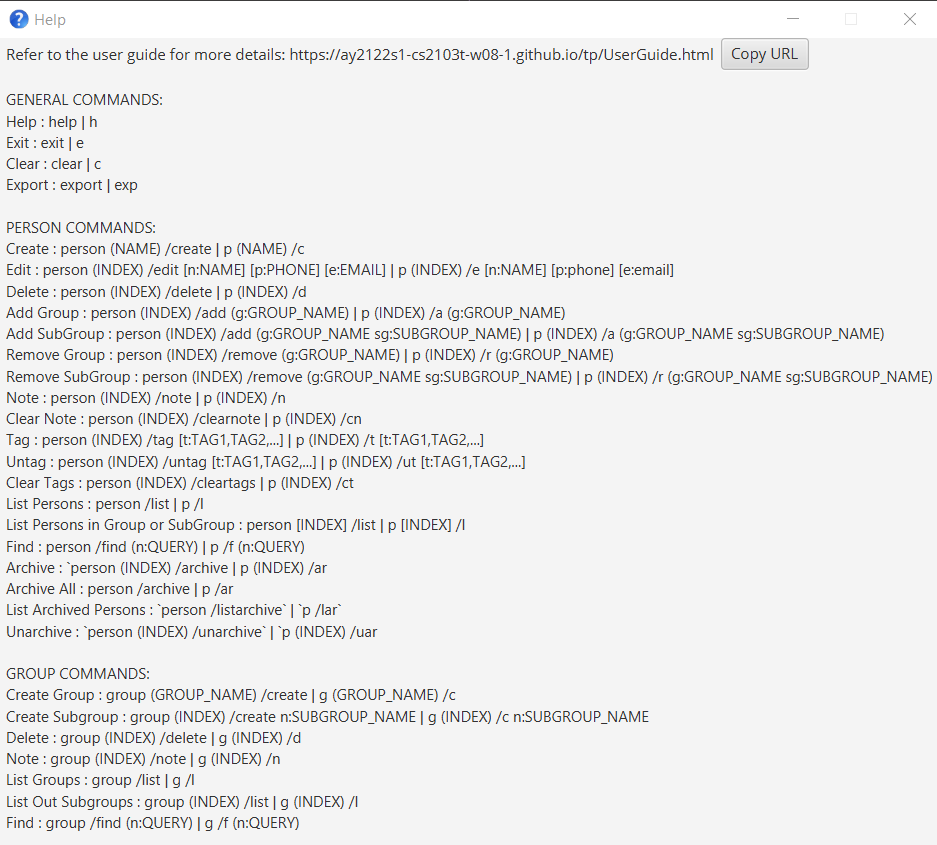
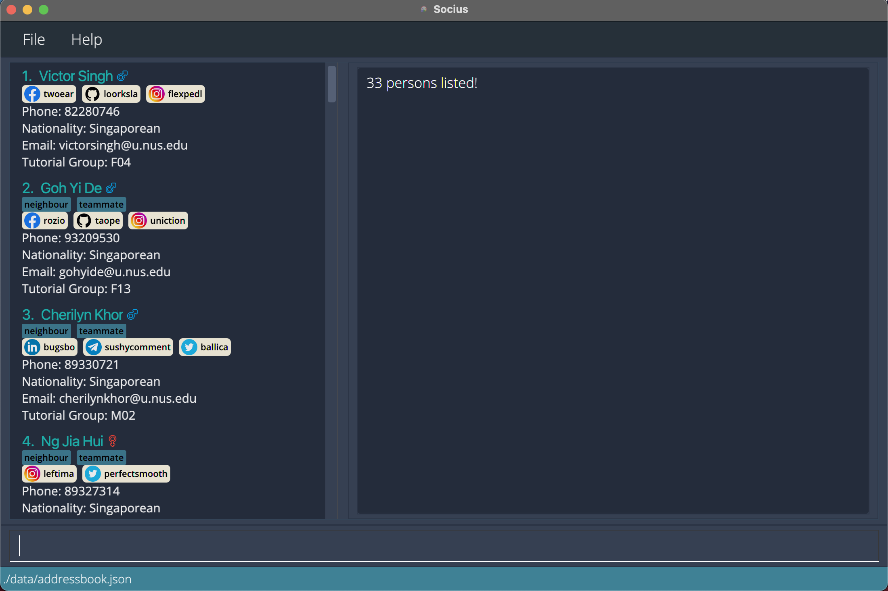

# Welcome to Socius User Guide!

Welcome to Socius User Guide! Choose a section from the table of contents below to find step-by-step guides on how to use Socius!

Are you a developer? Make sure to check out our Developer Guide too! You can find the Developer Guide [here](https://github.com/AY2122S1-CS2103T-W08-4/tp/blob/master/docs/DeveloperGuide.md).

--------------------------------------------------------------------------------------------------------------------

## Table of Contents

1. [Introduction to Socius](#introduction-to-socius)
2. [Using this guide](#using-this-guide)
3. [Quick start](#quick-start)
4. [Features](#features)
   1. [Getting help `help`](#getting-help-help)
   2. [Modifying contacts](#adding-a-person-add)
       1. [Adding a person `add`](#adding-a-person-add)
       2. [Adding tags to people `addt`](#adding-tags-to-people-addt)
       3. [Adding a remark to a person `remark`](#adding-a-remark-to-a-person-remark)
       4. [Editing a person `edit`](#editing-a-person-edit)
       5. [Deleting a person `delete`](#deleting-a-person-delete)
       6. [Deleting multiple people `deletem`](#deleting-multiple-person-deletem)
       7. [Deleting tags from people `deletet`](#deleting-tags-from-people-deletet)
       8. [Clearing all contacts `clear`](#clearing-all-contacts-clear)
   3. [Viewing contacts](#listing-all-contacts-list)
      1. [Listing all contacts `list`](#listing-all-contacts-list)
      2. [Finding people `find`](#finding-people-find)
      3. [Sorting people `sort`](#sorting-people-sort)
      4. [Viewing statistics `stat`](#viewing-statistics-stat)
   4. [Sharing contacts](#importing-contacts-import)
      1. [Importing contacts `import`](#importing-contacts-import)
      2. [Exporting contacts `export`](#exporting-contacts-export)
   5. [Aliasing commands `alias`](#aliasing-commands-alias)
   6. [Exiting Socius `exit`](#exiting-socius-exit)
   7. [Saving contacts](#saving-the-data)
   8. [Accessing command history](#command-history)
5. [Parameter Constraints](#parameter-constraints)
6. [FAQ](#faq)
7. [Glossary](#glossary)
8. [Authors](#authors)
9. [Command Summary](#command-summary)

--------------------------------------------------------------------------------------------------------------------

## Introduction to Socius

Socius is a desktop application that helps you, as a CS2103T Software Engineering student, to
* manage your classmates’ contacts,
* make friends, and
* find teammates!

The Socius User Guide gets you started with Socius.
This User Guide familarises you with the commands and functionality of Socius, enabling you to get the most out of Socius.
If you are an experienced Socius user, a command summary table is available at the end of the user guide for your reference!

We hope that you will have a great time using Socius! :)

Socius provides these main features:
* Access details of students taking CS2103T.
* Find any students with their name, tutorial group, nationality, tags, and more.
* Pin suitable tags to categorize students.
* View statistics on nationality.

Socius is optimized for use via a *Command Line Interface (CLI)* while still having the benefits of a *Graphical User Interface (GUI)*. If you can
type fast, Socius can get your contact management tasks done faster than traditional *GUI* apps.

--------------------------------------------------------------------------------------------------------------------

## Using this guide

Before exploring the features of Socius, you should be familiar with these symbols used in this user guide.

| Symbol | Meaning |
| :----: | ------- |
| :information_source: | Important information |
| :exclamation: | Warning or caution |
| :bulb: | Additional information such as tips |
| :wrench: | Help with common technical issues |

--------------------------------------------------------------------------------------------------------------------

## Quick Start

Here is a quick start on how to use Socius on your computer.

1. Install [*Java 11*](https://www.oracle.com/sg/java/technologies/javase/jdk11-archive-downloads.html) on your computer.

2. Download the latest `Socius.jar` from [here](https://github.com/AY2122S1-CS2103T-W08-4/tp/releases).

3. Move the `Socius.jar` file to a folder you want to use as the home folder for Socius.

4. Double-click the file to start Socius. A GUI similar to the one below should appear within a few seconds.

:wrench: **Help:**
If double-clicking does not work, you can use the Terminal and type `java -jar Socius.jar`. Ensure that the Terminal is in the same directory as the `Socius.jar` file.

   

* Note that the app comes with some sample contacts by default. Type **`clear`** in the command box to remove those sample contacts.

* Type your command in the command box and press `Enter` to execute the command. e.g. typing **`help`** and pressing `Enter` will open the help window.
These are some example commands that you can try:
    * **`add`** `n/Amy Tan nat/Singaporean tg/W08` : Adds a contact named `Amy Tan`, a `Singaporean` in tutorial group `W08` to your contacts.

    * **`delete`** `3` : Deletes the 3rd contact shown in the current list.

    * **`find`** : `g/f nat/Singaporean` : Finds all female Singaporeans from your contacts.

    * **`list`** : Lists all contacts.

    * **`clear`** : Deletes all contacts.

    * **`exit`** : Exits from Socius.

* Refer to the next section on [Features](#features) for more details of each command. Alternatively, you can refer to the [Command Summary](#command-summary) for an overview of all commands.

--------------------------------------------------------------------------------------------------------------------

## Features

**:information_source: Notes about the command format:** 

* Words in `UPPER_CASE` are the parameters to be supplied by the user. 
  e.g. in `add n/NAME`, `NAME` is a parameter which can be used as `add n/John Tan`.

* Items in square brackets are optional. 
  e.g. `n/NAME [t/TAG]` can be used as `n/John Tan t/friend` or as `n/John Tan`.

* Items with `…`​ after them can be used multiple times including zero times. 
  e.g. `[t/TAG]…​` can be used as ` ` (i.e. 0 times), `t/friend`, `t/friend t/family` etc.

* Parameters can be in any order. 
  e.g. if the command specifies `n/NAME p/PHONE_NUMBER`, `p/PHONE_NUMBER n/NAME` is also acceptable.

* If a parameter is expected only once in the command but you specified it multiple times, only the last occurrence of the parameter will be taken.
  e.g. if you specify `p/12341234 p/56785678`, only `p/56785678` will be taken.

* If only one parameter is expected but multiple parameters are specified, only the last parameter will be taken. 
  e.g. if you specify `n/John Tan e/JohnT@gmail.com`, only `e/JohnT@gmail.com` will be taken.

* Extraneous parameters for commands that do not take in parameters (`help`, `list`, `exit` and `clear`) will be
  ignored. 
  e.g. if the command specifies `help 123`, it will be interpreted as `help`.

### Getting help: `help`

You can view the full list of commands available on Socius with the `help` command.

Format: **`help`**

*After execution of Help Command: **`help`***

### Adding a person: `add`

You can add a new person into Socius with the `add` command.

Format: **`add`** `n/NAME [p/PHONE_NUMBER] [e/EMAIL] [nat/NATIONALITY] [g/GENDER] [tg/TUTORIAL_GROUP] [s/SOCIAL_HANDLE]…​ [r/REMARK] [t/TAG]…​`

:bulb: **Tip:**
The [Parameter Constraints](#parameter-constraints) section shows the constraints for each parameter.

* Only the `NAME` parameter of a person is _compulsory_, other parameters are _optional_.
* The parameters can be in any order.

:bulb: **Tip:**
A person can have any number of tags and social handles (including 0)

Examples:

* **`add`** `n/Amy Tan` adds `Amy Tan` to the list.
* **`add`** `n/Benedict p/98765432 e/ben@example.com g/M` adds `Benedict`, a `Male` with phone number `98765432` and email `ben@yahoo.com`  to your contacts list.
* **`add`** `n/Ernest s/tg:ernest2334 s/ig:ernessst` adds `Ernest`, with Telegram handle `earnest2334` and Instagram handle `ernessst` to your contacts list.

*After execution of Add Command: **`add`** `n/Ernest s/tg:ernest2334 s/ig:ernessst`*

### Adding tags to people: `addt`

You can add tags to people in your contacts list with the `addt` command.

You can add tags to one person with `addt INDEX`. Alternatively, you can add tags to everyone in the
displayed contacts list by replacing `INDEX` with the word `all` (i.e. `addt all`).

Format: **`addt`** `INDEX t/TAG [t/TAG]…​`
* Add tags to the person at the specified `INDEX`.
* The index refers to the index number shown in the displayed contacts list.
* The index must be provided and **must be a positive integer** 1, 2, 3, …​
* At least one `TAG` must be provided.
* `TAG` is case-sensitive.
* Input tag will be appended to the existing tag.
* If duplicate tags are entered, these tags will not be added.

For example:

* **`addt`** `1 t/friend` after **`find`** `g/f` adds the `friend` tag to first person in the filtered list of female contacts.
* **`addt`** `2 t/teammate t/neighbour` adds both `teammate` and `neighbour` tags to second person in the displayed contacts list.

Alternate Format: **`addt`** `all t/TAG [t/TAG]…​`
* Add tags to everyone in the displayed contacts list.
* At least one `TAG` must be provided.
* `TAG` is case-sensitive
* Input tag will be appended to the existing tag.
* If duplicate tags are entered, these tags will not be added.

For example:

* **`addt`** `all t/friend` after **`find`** `g/f` adds the `friend` tag to everyone in the filtered list of female contacts.
* **`addt`** `all t/teammate t/neighbour` adds both `teammate` and `neighbour` tags to everyone in the displayed contacts list.

*After execution of Add Tag Command: **`addt`** `all t/teammate t/neighbour`*

### Adding a remark to a person: `remark`

You can add a remark to a person in your contacts list with the `remark` command.

Format: **`remark`** `INDEX r/REMARK`
* Add a remark to the person at the specified `INDEX`.
* The index refers to the index number shown in the displayed contacts list.
* Index must be provided and **must be a positive integer** 1, 2, 3, …​
* Existing remark will be updated to the input remark.
* If a duplicate remark is entered, only the latest remark will be taken.
* You can remove a person’s remark by typing `remark` (i.e. empty parameter) or `remark r/` without specifying any remark.

Examples:

* **`remark`** `1 r/She likes coding` adds the remark `She likes coding` to first person in the displayed contacts list.
* **`remark`** `2` clears the remark of the second person in the displayed contacts list.

*After execution of Remark Command: **`remark`** `2`*

### Editing a person: `edit`

You can edit an existing person in your contacts list with the `edit` command.

Format: **`edit`** `INDEX PREFIX/KEYWORD [PREFIX/KEYWORD]…​`

* `PREFIX/KEYWORD` can be substituted with any of the following:
  * `n/NAME`
  * `g/GENDER`
  * `p/PHONE_NUMBER`
  * `e/EMAIL`
  * `nat/NATIONALITY`
  * `tg/TUTORIAL_GROUP`
  * `s/SOCIAL_HANDLE`
  * `r/REMARK`
  * `t/TAG`

:bulb: **Tip:**
The [Parameter Constraints](#parameter-constraints) section shows the constants for each parameter.

* At least one parameter must be entered.
* Edits the person at the specified `INDEX`.
* The index refers to the index number shown in the displayed contacts list.
* Index must be provided and **must be a positive integer** 1, 2, 3, …​
* Existing values will be updated to the input values.
* You can remove a parameter of a person by leaving the `KEYWORD` empty (i.e. `edit INDEX PREFIX/`)
  * For `s/SOCIAL_HANDLE`, you can remove a social handle by leaving the `USERID` empty (i.e. `s/PLATFORM:`)
* If duplicate parameters are entered, only the latest parameter will be taken.
  * This does not apply to `s/SOCIAL_HANDLE` and `t/TAG` as they accept multiple values.
* Existing tags will be updated to the input tag.
* You can remove all tags from a person by typing `t/` without specifying any tags (i.e. `edit INDEX t/`).

:bulb: **Tip:**
You can change the default colour of the tag with `t/TAG:#HEX_COLOUR` 
Example: `t/friends:#FF0000` for a red colour tag

Examples:

* **`edit`** `1 p/91234567 e/amytan@example.com` edits the phone number of the first person in the displayed contacts list to be `91234567`
  and the email address of that person to be `amytan@example.com`.
* **`edit`** `2 n/Benedict t/` edits the name of the second person in the displayed contacts list to be `Benedict` and clears all his existing tags.

### Deleting a person: `delete`

You can delete the specified person from your contacts list with the `delete` command.

Format: **`delete`** `INDEX`

* Deletes the person at the specified `INDEX`.
* The index refers to the index number shown in the displayed contacts list.
* Index must be provided and **must be a positive integer** 1, 2, 3, …​

Examples:

* **`delete`** `2` after **`list`** deletes the second person in the displayed contacts list from your contacts list.
* **`delete`** `1` after **`find`** `n/benedict` deletes the first person in the filtered contacts list from your contacts list.

### Deleting multiple person: `deletem`

You can delete multiple person from the contact book with the `deletem` command.

Format: **`deletem`** `PREFIX/KEYWORD [PREFIX/KEYWORD]…​`

* `PREFIX/KEYWORD` can be substituted with any of the following:
  * `n/NAME`
  * `g/GENDER`
  * `p/PHONE_NUMBER`
  * `e/EMAIL`
  * `nat/NATIONALITY`
  * `tg/TUTORIAL_GROUP`
  * `s/SOCIAL_HANDLE`
  * `r/REMARK`
  * `t/TAG`

* At least one `KEYWORD` must be provided.
* `KEYWORD` is case-insensitive. (e.g `hans` will match `Hans`)
* People matching all keywords will be deleted (i.e. `AND` search).

Examples:

* **`deletem`** `n/jia ling` deletes `Zhong Jia Ling` and `Oon Jia Ling`.

*After execution of Delete Multiple Command: **`deletem`** `n/jia ling`*

### Deleting tags from people: `deletet`
You can delete tags for people in your contacts list with the `deletet` command.

You can delete tags for one person with `deletet INDEX`. Alternatively, you can delete tags for everyone in the
displayed contacts list by replacing `INDEX` with the word `all` (i.e. `deletet all`).

Format: **`deletet`** `INDEX [t/TAG]…​`
* Delete tags for the person at the specified `INDEX`.
* The index refers to the index number shown in the displayed contacts list.
* The index must be provided and **must be a positive integer** 1, 2, 3, …​
* Existing tag will be removed if one of the input tags matches the existing tag.
* If no `TAG` is provided, all tags of the person will be deleted.
* `TAG` is case-sensitive

For example:

* **`deletet`** `1 t/friend` after **`find`** `g/f` deletes the `friend` tag for the first person in the filtered list of female contacts.
* **`deletet`** `2 t/teammate t/neighbour` deletes the `teammate` and `neighbour` tags for the second person in the displayed contacts list.

*After execution of Delete Tag Command: **`deletet`** `2 t/teammate t/neighbour`*

Alternate Format: **`deletet`** `all [t/TAG]…​`
* Delete tags for everyone in the displayed contacts list.
* Existing tag will be removed if one of the input tags matches the existing tag.
* If no `TAG` is provided, all tags in the displayed contacts list will be deleted.
* `TAG` is case-sensitive

For example:

* **`deletet`** `all t/friend` after **`find`** `g/f` deletes the `friend` tag for everyone in the filtered list of female contacts.
* **`deletet`** `all t/teammate t/neighbour` deletes both `teammate` and `neighbour` tags for everyone in the displayed contacts list.

### Clearing all contacts: `clear`

You can clear everyone from your contacts list with the `clear` command.

Format: **`clear`**

### Listing all contacts: `list`

You can list everyone in your contacts list with the `list` command.

Format: **`list`**

### Finding people: `find`

You can find specific people with the `find` command.

Format: **`find`** `PREFIX/KEYWORD [PREFIX/KEYWORD]…​`

* `PREFIX/KEYWORD` can substituted with any of the following:
     * `n/NAME`
     * `g/GENDER`
     * `p/PHONE_NUMBER`
     * `e/EMAIL`
     * `nat/NATIONALITY`
     * `tg/TUTORIAL_GROUP`
     * `s/SOCIAL_HANDLE_USERID`
     * `r/REMARK`
     * `t/TAG`

* At least one `KEYWORD` must be provided.
* The `KEYWORD` is case-insensitive. (e.g `hans` will match `Hans`)
* People matching all keywords will be returned (i.e. `AND` search).

Examples:

* **`find`** `n/Alex` returns `alex` and `Alexandra`.
* **`find`** `n/jack tg/M12` returns `Jack` from tutorial group `M12`. 

*After execution of Find Command: **`find`** `n/jack tg/M12`*
* **`find`** `nat/Singaporean` returns all Singaporeans.  

*After execution of Find Command: **`find`** `nat/Singaporean`*

### Sorting people: `sort`

You can sort everyone in the contact book by a specified parameter with the `sort` command.

Format: **`sort`** `PREFIX/`

* `PREFIX/` can substituted with any of the following: 
  * `n/`
  * `g/`
  * `p/`
  * `e/` 
  * `nat/`
  * `tg/`
  * `s/`
  * `r/` 
  * `t/`
* If the parameter contains words, everyone is sorted in ascending alphabetical order.
* If the parameter contains numbers, everyone is sorted in ascending numeric order.

Examples:

* **`sort`** `n/` sorts everyone by name in ascending alphabetical order.
* **`sort`** `tg/` sorts everyone by tutorial group in ascending alphanumeric order.

*After execution of Sort Command: **`sort`** `tg/`*

### Viewing statistics: `stat`

You can view the statistics of different nationalities of students from a specified tutorial group with the `stat` command.

Format: **`stat`** `TUTORIAL_GROUP`

Examples:

* **`stat`** `T08` shows the statistics of the different nationalities of students from tutorial group `T08`.

*After execution of Stat Command: **`stat`** `T08`*

### Importing contacts: `import`

You can import your friends' contact book into your contacts list with the `import` command.

Format: **`import`** `FILE_NAME.json`

* The input file must be in the JSON format.
* The input file must be located in the `./data` directory from the directory where `Socius.jar` is located.

Examples:
* **`import`** `groupmates.json` imports a contacts list from a file named `groupmates.json` into your existing contacts list.

*Illustration of where the JSON file should be located*

### Exporting contacts: `export`

You can export your contacts list and share it with your friends with the `export` command.

Format: **`export`** `FILE_NAME.json`

* The exported file follows the JSON format.
* The exported file will be stored in the `./data` directory from the directory where `Socius.jar` is located.

Examples:

* **`export`** `friends.json` export your contacts list into a file named `friends.json`.

### Aliasing commands: `alias`
You can create shortcuts by aliasing a command with a custom keyword with the `alias` command. 
This enables you to type the keyword in place of the command.

Format: **`alias`** `a/KEYWORD c/COMMAND`.

* Keywords that are reserved for command names cannot be used as `KEYWORD` (e.g `a/add`).
* The order of `a/KEYWORD` and `c/COMMAND` does not matter.

Examples:

* **`alias`** `a/Singaporeans c/find nat/Singaporean tg/T08` maps the keyword `Singaporeans` 
to the `Find` command to find all Singaporeans in tutorial group T08.

*After execution of Alias Command: **`alias`** `a/Singaporeans c/find nat/Singaporean tg/T08`*

### Exiting Socius: `exit`

Exits from Socius.
f
Format: **`exit`**

### Saving the data

The data in Socius is automatically saved to your computer after the execution of any command that changes the data.
There is no need to save manually. The data will be automatically loaded back into Socius on your next use.

### Command History

Use the Up or Down arrow keys to navigate through command history. This feature is useful if your command is similar to a previous command, or if you wish to revisit your previous commands.

--------------------------------------------------------------------------------------------------------------------

## Parameter Constraints

### `n/NAME`
`NAME` should only contain alphanumeric characters and spaces.

Example: `n/Zayden Tan Bee Hoon`

### `g/GENDER`
`GENDER` should only be `M` for male, `F` for female or `O` for others.

Examples: `g/M`, `g/f`

### `p/PHONE_NUMBER`
`PHONE_NUMBER` should only contain numbers and optionally start with '+'.
`PHONE_NUMBER` should be at least 3 digits and at most 15 digits long.

Example: `+98739283`

### `e/EMAIL`
`EMAIL` should be of the format `local-part@domain` and adhere to the following constraints:
* The local-part should only contain alphanumeric characters and these special characters: `+_.-`.
* The local-part may not start or end with any special characters.
* The domain name is made up of domain labels separated by periods.
* The domain name must:
     * end with a domain label at least 2 characters long
     * have each domain label start and end with alphanumeric characters
     * have each domain label consist of alphanumeric characters, separated only by hyphens, if any.

Example: `e/e3029834@u.nus.edu`

### `nat/NATIONALITY`
`NATIONALITY` should be found among in this [list of nationalities](https://gist.github.com/marijn/274449).

Example: `nat/Singaporean`

### `tg/TUTORIAL_GROUP`
`TUTORIAL_GROUP` should only contain one letter that is either M/T/W/F followed by two digits.

Example: `tg/T09`

### `s/SOCIAL_HANDLE`
`SOCIAL_HANDLE` should be of the format `PLATFORM:USERID` and adhere to the following constraints:
* Only the following platforms are supported: `Instagram`, `Telegram`, `Facebook`, `Twitter`, `Github`, `Linkedin`, `Snapchat`, `Discord`
* The following 2 letter shorthand represents the `PLATFORM` for their corresponding social platform:
     * `ig` for Instagram
     * `tg` for Telegram
     * `fb` for Facebook
     * `tw` for Twitter
     * `gh` for Github
     * `ln` for Linkedin
     * `sc` for Snapchat
     * `dc` for Discord
* `USERID` should not contain whitespaces

Example: `s/tg:alexx9384`

### `r/REMARK`
`REMARK` accepts any values.

Example: `r/Stays in PGP`

### `t/TAG`
`TAG` should only contain alphanumeric characters.

Example:  `t/friends`

:bulb: **Tip:**
You can change the default colour of the tag with `t/TAG:#HEX_COLOUR`
Example: `t/friends:#FF0000` for a red colour tag

### `a/ALIAS`
`ALIAS` can take any values except keywords that are reserved for command names.

Example: `a/findAlex`

### `c/COMMAND`
`COMMAND` must be a valid command.

Example: `c/find n/Alex`

--------------------------------------------------------------------------------------------------------------------

## FAQ
**Q**: How do I transfer my data to another Computer? 
**A**: Install Socius in the other computer. Export your Socius contacts list to a JSON file and copy this JSON file to 
the same folder in the other computer. Import your contacts list from the JSON file to Socius in the other computer.

**Q**: Can I edit the data file directly? 
**A**: Socius data are saved as a JSON file (i.e. `SOCIUS_JAR_FILE_LOCATION/data/addressbook.json`).
Advanced users are welcome to update data directly by editing that data file.

:exclamation: **Caution:**
If the format of your data file is invalid, Socius will discard all data and start with an empty data file at the next run.

--------------------------------------------------------------------------------------------------------------------

## Glossary

| Word | Meaning |
|--------|-------|
|        |         |

--------------------------------------------------------------------------------------------------------------------

## Authors

This User Guide is co-written by Hsiao Ting, Choon Yong, Kevin, Boon Kee and Nathan. We are a group of Computer Science students from the National University of Singapore, and members of AY2022S1-CS2103T-W08-4.

--------------------------------------------------------------------------------------------------------------------

## Command Summary

### General

| Command | Format | Examples |
| --------- | ------------------- | ----------------------------------------------- |
| **Help** | **`help`** | **`help`** |
| **Exit** | **`exit`** | **`exit`** |

### Modify

| Command | Format | Examples |
| --------- | ------------------- | ----------------------------------------------- |
| **Add** | **`add`** `n/NAME [p/PHONE_NUMBER] [e/EMAIL] [nat/NATIONALITY] [g/GENDER] [tg/TUTORIAL GROUP] [s/SOCIALHANDLE]…​ [r/REMARK] [t/TAG]…​`| **`add`** `n/James Ho p/22224444 e/jamesho@example.com g/M tg/T12 s/tg:friendlyjames r/Friendly t/colleague`|
| **Addt** | **`addt`** `INDEX t/TAG [t/TAG]…​` or `all t/TAG [t/TAG]…​` | **`addt`** `1 t/friend t/teammate`|
| **Remark** | **`remark`** `INDEX [r/REMARK]` | **`remark`** `2 r/She likes coding` |
| **Edit** | **`edit`** `INDEX PREFIX/KEYWORD [PREFIX/KEYWORD]…​` | **`edit`** `1 s/tg:dogcatdonkey43 s/ig:applegrapeorange32 t/teammates e/wfeewf@gmail.com g/M nat/Singaporean` |
| **Delete** | **`delete`** `INDEX` | **`delete`** `3`|
| **Deletet** | **`deletet`** `INDEX t/TAG [t/TAG]…​` or `all t/TAG [t/TAG]…​` | **`deletet`** `all t/teammate`|
| **Deletem** | **`deletem`** `PREFIX/KEYWORD [PREFIX/KEYWORD]…​` | **`deletem`** `n/James g/f` |
| **Clear** | **`clear`** | **`clear`** |

### View

| Command | Format | Examples |
| --------- | ------------------- | ----------------------------------------------- |
| **List** | **`list`** | **`list`** |
| **Find** | **`find`** `PREFIX/KEYWORD [PREFIX/KEYWORD]…​` | **`find`** `g/F tg/07` |
| **Sort** | **`sort`** `PREFIX/` | **`sort`** `n/` |
| **Stat** | **`stat`** `TUTORIAL_GROUP` | **`stat`** `T09`|

### Share

| Command | Format | Examples |
| --------- | ------------------- | ----------------------------------------------- |
| **Import** | **`import`** | **`import`** `contactbook.json`|
| **Export** | **`export`** | **`export`** `contactbook.json`|

### Advance

| Command | Format | Examples |
|---------|-------------------|-------------------------------------------------|
| **Alias** | **`alias`** `a/KEYWORD c/COMMAND` | **`alias`** `a/allFemales c/find g/f`|
